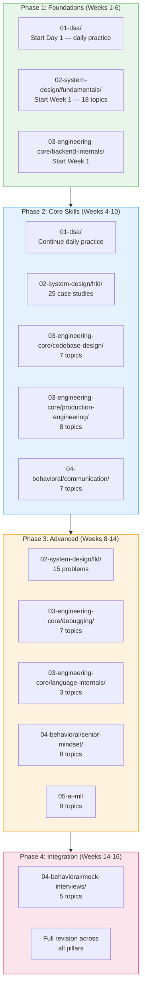

# Interview Preparation Guide

A structured, end-to-end guide for senior engineers preparing for top-tier tech interviews. Covers five pillars — DSA, System Design, Engineering Core, Behavioral, and AI/ML — with clear study order, concept breakdowns, and progress tracking.

**Who this is for:** Engineers with 4+ years of experience targeting senior/staff roles at FAANG, top startups, and high-growth companies.

**How to use it:** Each section has its own `00-README.md` with a visual roadmap, topic table, study order, and progress tracker. Start with the roadmap below, then dive into individual sections.

---

## Visual Overview

```mermaid
graph TB
    ROOT["Interview Preparation Guide<br/>137 Topics | ~245 Problems"]

    ROOT --> DSA["01-dsa/<br/>15 Topics | ~245 Problems"]
    ROOT --> SD["02-system-design/<br/>58 Topics"]
    ROOT --> EC["03-engineering-core/<br/>35 Topics"]
    ROOT --> BH["04-behavioral/<br/>20 Topics"]
    ROOT --> AI["05-ai-ml/<br/>9 Topics"]

    DSA --> DSA1["Arrays, Strings, Searching,<br/>Matrix, Linked Lists"]
    DSA --> DSA2["Stacks, Trees, BST,<br/>Heap, Greedy"]
    DSA --> DSA3["Backtracking, Graphs,<br/>DP, Trie"]

    SD --> SD1["Fundamentals<br/>18 Topics"]
    SD --> SD2["HLD Case Studies<br/>25 Systems"]
    SD --> SD3["LLD Problems<br/>15 Problems"]

    EC --> EC1["Backend Internals<br/>10 Topics"]
    EC --> EC2["Codebase Design<br/>7 Topics"]
    EC --> EC3["Production Engineering<br/>8 Topics"]
    EC --> EC4["Debugging<br/>7 Topics"]
    EC --> EC5["Language Internals<br/>3 Topics"]

    BH --> BH1["Communication<br/>7 Topics"]
    BH --> BH2["Senior Mindset<br/>8 Topics"]
    BH --> BH3["Mock Interviews<br/>5 Topics"]

    AI --> AI1["ML Fundamentals,<br/>Classical Algorithms,<br/>Deep Learning"]
    AI --> AI2["NLP & LLMs,<br/>Computer Vision,<br/>ML System Design"]
    AI --> AI3["Math & Statistics,<br/>Practical Coding,<br/>Behavioral Scenarios"]

    style ROOT fill:#1a1a2e,stroke:#e94560,color:#eee
    style DSA fill:#2ecc71,stroke:#27ae60,color:#000
    style SD fill:#3498db,stroke:#2980b9,color:#fff
    style EC fill:#e67e22,stroke:#d35400,color:#fff
    style BH fill:#9b59b6,stroke:#8e44ad,color:#fff
    style AI fill:#e74c3c,stroke:#c0392b,color:#fff
    style DSA1 fill:#27ae60,stroke:#1e8449,color:#fff
    style DSA2 fill:#27ae60,stroke:#1e8449,color:#fff
    style DSA3 fill:#27ae60,stroke:#1e8449,color:#fff
    style SD1 fill:#2980b9,stroke:#1f6dad,color:#fff
    style SD2 fill:#2980b9,stroke:#1f6dad,color:#fff
    style SD3 fill:#2980b9,stroke:#1f6dad,color:#fff
    style EC1 fill:#d35400,stroke:#b94600,color:#fff
    style EC2 fill:#d35400,stroke:#b94600,color:#fff
    style EC3 fill:#d35400,stroke:#b94600,color:#fff
    style EC4 fill:#d35400,stroke:#b94600,color:#fff
    style EC5 fill:#d35400,stroke:#b94600,color:#fff
    style BH1 fill:#8e44ad,stroke:#7d3c98,color:#fff
    style BH2 fill:#8e44ad,stroke:#7d3c98,color:#fff
    style BH3 fill:#8e44ad,stroke:#7d3c98,color:#fff
    style AI1 fill:#c0392b,stroke:#a93226,color:#fff
    style AI2 fill:#c0392b,stroke:#a93226,color:#fff
    style AI3 fill:#c0392b,stroke:#a93226,color:#fff
```



---

## The Five Pillars

### 01 — Data Structures & Algorithms

The daily practice pillar. 15 topics covering ~245 problems across easy, medium, and hard tiers. Each topic includes a curated problem set, pattern breakdowns, and solution templates. DSA is the one pillar you practice every single day from Day 1 until the interview.

**[Go to DSA →](./01-dsa/00-README.md)**

### 02 — System Design

58 topics split into three sections: 18 fundamentals (networking, caching, databases, distributed systems), 25 high-level design case studies (URL shortener to stock exchange), and 15 low-level design problems (parking lot to food ordering). Fundamentals first, then HLD, then LLD.

**[Go to System Design →](./02-system-design/00-README.md)**

### 03 — Engineering Core

35 topics across 5 sub-sections: backend internals (concurrency, DB internals, networking), codebase design (SOLID, patterns, clean architecture), production engineering (SLOs, incidents, deployments), debugging (root cause analysis, distributed tracing), and language internals (V8, TypeScript, Python). This is what separates senior engineers from mid-level.

**[Go to Engineering Core →](./03-engineering-core/00-README.md)**

### 04 — Behavioral

20 topics across communication (STAR method, conflict resolution, leadership), senior mindset (ownership, prioritization, tech debt), and mock interview formats. Builds the narrative layer that ties your technical skills into a compelling story.

**[Go to Behavioral →](./04-behavioral/00-README.md)**

### 05 — AI/ML

9 topics covering ML fundamentals, classical algorithms, deep learning, NLP & LLMs, computer vision, ML system design, math foundations, practical coding, and behavioral scenarios. Essential for ML-adjacent roles and increasingly relevant for all senior engineers.

**[Go to AI/ML →](./05-ai-ml/00-README.md)**

---

## Recommended Study Order

The pillars are designed to be studied in parallel tracks. Here is the recommended sequencing and how the pillars reinforce each other.



### Phase-by-Phase Breakdown

| Phase | Weeks | Pillars Active | Focus |
|-------|-------|----------------|-------|
| **Phase 1: Foundations** | 1-6 | DSA + System Design Fundamentals + Backend Internals | Build core problem-solving and systems knowledge |
| **Phase 2: Core Skills** | 4-10 | DSA (ongoing) + HLD + Codebase Design + Production Eng + Communication | Apply concepts to real-world designs and soft skills |
| **Phase 3: Advanced** | 8-14 | LLD + Debugging + Language Internals + Senior Mindset + AI/ML | Deepen expertise and strategic thinking |
| **Phase 4: Integration** | 14-16 | Mock Interviews + Full Revision | Simulate real interviews across all pillars |

### Key Principles

1. **DSA is a daily habit** — start on Day 1 and practice every day until the interview.
2. **System Design Fundamentals before HLD** — never attempt designing systems without knowing the building blocks.
3. **Engineering Core runs in parallel** — these topics reinforce system design understanding.
4. **Behavioral prep starts mid-way** — you need enough engineering stories to tell before starting behavioral prep.
5. **Mock interviews come last** — only after you have material across all pillars.

---

## Repository Structure

```
job-prep/
├── 00-README.md                          ← you are here
├── 01-dsa/                               ← 15 topics, ~245 problems
│   ├── 00-README.md
│   ├── 00-python-basics/
│   │   ├── easy/
│   │   └── medium/
│   ├── 01-arrays-and-bits/
│   │   ├── easy/
│   │   ├── medium/
│   │   └── hard/
│   └── ...
├── 02-system-design/                     ← 58 topics (flat files)
│   ├── 00-README.md
│   ├── fundamentals/
│   │   ├── 01-networking-basics.md
│   │   ├── 02-api-design.md
│   │   └── ...
│   ├── hld/
│   │   ├── 01-url-shortener.md
│   │   └── ...
│   └── lld/
│       ├── 01-parking-lot.md
│       └── ...
├── 03-engineering-core/                  ← 35 topics (flat files)
│   ├── 00-README.md
│   ├── backend-internals/
│   │   ├── 00-README.md
│   │   ├── 01-concurrency-models.md
│   │   └── ...
│   ├── codebase-design/
│   ├── production-engineering/
│   ├── debugging/
│   └── language-internals/
├── 04-behavioral/                        ← 20 topics (flat files)
│   ├── 00-README.md
│   ├── communication/
│   │   ├── 00-README.md
│   │   ├── 01-star-method.md
│   │   └── ...
│   ├── senior-mindset/
│   └── mock-interviews/
└── 05-ai-ml/                             ← 9 topics (flat files)
    ├── 00-README.md
    ├── 01-ml-fundamentals.md
    └── ...
```

---

## Master Progress Tracker

### 01-dsa/ — Data Structures & Algorithms

| # | Topic | Status |
|---|-------|:------:|
| 00 | Python Basics | [ ] |
| 01 | Arrays & Bit Manipulation | [ ] |
| 02 | Strings | [ ] |
| 03 | Searching & Sorting | [ ] |
| 04 | Matrix | [ ] |
| 05 | Linked List | [ ] |
| 06 | Stacks & Queues | [ ] |
| 07 | Binary Trees | [ ] |
| 08 | BST | [ ] |
| 09 | Heap | [ ] |
| 10 | Greedy | [ ] |
| 11 | Backtracking | [ ] |
| 12 | Graphs | [ ] |
| 13 | Dynamic Programming | [ ] |
| 14 | Trie | [ ] |

### 02-system-design/ — System Design

| Sub-section | Topics | Status |
|-------------|:------:|:------:|
| Fundamentals | 18 | [ ] |
| HLD Case Studies | 25 | [ ] |
| LLD Problems | 15 | [ ] |

### 03-engineering-core/ — Engineering Core

| Sub-section | Topics | Status |
|-------------|:------:|:------:|
| Backend Internals | 10 | [ ] |
| Codebase Design | 7 | [ ] |
| Production Engineering | 8 | [ ] |
| Debugging | 7 | [ ] |
| Language Internals | 3 | [ ] |

### 04-behavioral/ — Behavioral

| Sub-section | Topics | Status |
|-------------|:------:|:------:|
| Communication | 7 | [ ] |
| Senior Mindset | 8 | [ ] |
| Mock Interviews | 5 | [ ] |

### 05-ai-ml/ — AI/ML

| # | Topic | Status |
|---|-------|:------:|
| 01 | ML Fundamentals | [ ] |
| 02 | Classical Algorithms | [ ] |
| 03 | Deep Learning | [ ] |
| 04 | NLP & LLMs | [ ] |
| 05 | Computer Vision | [ ] |
| 06 | ML System Design | [ ] |
| 07 | Math & Statistics | [ ] |
| 08 | Practical Coding | [ ] |
| 09 | Behavioral Scenarios | [ ] |

---

## Quick Stats

| # | Pillar | Topics | Content | Section README |
|---|--------|:------:|---------|----------------|
| 01 | DSA | 15 | ~245 problems across easy/medium/hard | [01-dsa/00-README.md](./01-dsa/00-README.md) |
| 02 | System Design | 58 | 18 fundamentals + 25 HLD + 15 LLD | [02-system-design/00-README.md](./02-system-design/00-README.md) |
| 03 | Engineering Core | 35 | 5 sub-sections | [03-engineering-core/00-README.md](./03-engineering-core/00-README.md) |
| 04 | Behavioral | 20 | 3 sub-sections | [04-behavioral/00-README.md](./04-behavioral/00-README.md) |
| 05 | AI/ML | 9 | 9 concept files | [05-ai-ml/00-README.md](./05-ai-ml/00-README.md) |
| | **Total** | **137** | | |
