# 40-Day DSA Study Guide (Love Babbar 450 - Condensed)

A focused, 40-day plan to master Data Structures and Algorithms using **Python**. This guide condenses the Love Babbar 450 problem sheet into a structured daily routine covering 15 core topics, with ~12 Python exercises and ~233 DSA problems.

---

## Navigation

| # | Topic | Folder | Days | Problems |
|---|-------|--------|------|----------|
| 00 | Python Basics | [00-python-basics](./00-python-basics) | 1-3 | 12 exercises |
| 01 | Arrays & Bit Manipulation | [01-arrays-and-bits](./01-arrays-and-bits) | 4-8 | ~30 |
| 02 | Strings | [02-strings](./02-strings) | 9-11 | ~18 |
| 03 | Searching & Sorting | [03-searching-and-sorting](./03-searching-and-sorting) | 12-14 | ~18 |
| 04 | Matrix | [04-matrix](./04-matrix) | 15-16 | ~9 |
| 05 | Linked List | [05-linked-list](./05-linked-list) | 17-19 | ~18 |
| 06 | Stacks & Queues | [06-stacks-and-queues](./06-stacks-and-queues) | 20-22 | ~18 |
| 07 | Binary Trees | [07-binary-trees](./07-binary-trees) | 23-25 | ~20 |
| 08 | BST | [08-bst](./08-bst) | 26-27 | ~14 |
| 09 | Heap | [09-heap](./09-heap) | 28 | ~10 |
| 10 | Greedy | [10-greedy](./10-greedy) | 29-30 | ~12 |
| 11 | Backtracking | [11-backtracking](./11-backtracking) | 31-32 | ~10 |
| 12 | Graphs | [12-graphs](./12-graphs) | 33-35 | ~18 |
| 13 | Dynamic Programming | [13-dynamic-programming](./13-dynamic-programming) | 36-39 | ~30 |
| 14 | Trie + Revision | [14-trie](./14-trie) | 40 | ~8 |

**Total: ~12 Python exercises + ~233 DSA problems**

---

## 40-Day Gantt Chart

```mermaid
gantt
    title 40-Day DSA Study Plan
    dateFormat  X
    axisFormat Day %s

    section Week 1
    Python Basics           :done, py, 1, 3
    Arrays & Bits           :active, arr, 4, 8

    section Week 2
    Arrays & Bits (cont.)   :arr2, 8, 8
    Strings                 :str, 9, 11
    Searching & Sorting     :ss, 12, 14

    section Week 3
    Matrix                  :mat, 15, 16
    Linked List             :ll, 17, 19
    Stacks & Queues         :sq, 20, 22

    section Week 4
    Binary Trees            :bt, 23, 25
    BST                     :bst, 26, 27
    Heap                    :heap, 28, 28
    Greedy                  :greed, 29, 30

    section Week 5
    Backtracking            :back, 31, 32
    Graphs                  :graph, 33, 35

    section Week 6
    Dynamic Programming     :dp, 36, 39
    Trie + Revision         :trie, 40, 40
```

---

## Daily Routine

### Days 1-3: Python Basics (2-3 hrs/day)

| Time Block | Activity | Duration |
|------------|----------|----------|
| Block 1 | Learn Python fundamentals (data types, control flow, functions) | 60 min |
| Block 2 | Practice exercises — lists, dicts, sets, string manipulation | 60 min |
| Block 3 | Implement basic data structures in Python (stack, queue, linked list from scratch) | 60 min |

### Days 4-40: DSA Routine (4-5 hrs/day)

| Time Block | Activity | Duration |
|------------|----------|----------|
| Block 1 | Concept review — read/watch the theory for today's topic | 30 min |
| Block 2 | Solve 2-3 problems (easy to medium) with brute force first | 90 min |
| Block 3 | Break | 15 min |
| Block 4 | Solve 2-3 problems (medium to hard) with optimal approach | 90 min |
| Block 5 | Review solutions — note patterns, write comments, add to cheat sheet | 30 min |
| Block 6 | Spaced revision — revisit 2-3 problems from previous days | 30 min |

---

## Weekly Milestones

| Week | Days | Topics | Target Problems | Cumulative |
|------|------|--------|-----------------|------------|
| **Week 1** | 1-3 | Python Basics | 12 exercises | 12 |
| | 4-8 | Arrays & Bit Manipulation | ~30 problems | 42 |
| **Week 2** | 9-11 | Strings | ~18 problems | 60 |
| | 12-14 | Searching & Sorting | ~18 problems | 78 |
| **Week 2-3** | 15-16 | Matrix | ~9 problems | 87 |
| **Week 3** | 17-19 | Linked List | ~18 problems | 105 |
| | 20-22 | Stacks & Queues | ~18 problems | 123 |
| **Week 3-4** | 23-25 | Binary Trees | ~20 problems | 143 |
| **Week 4** | 26-27 | BST | ~14 problems | 157 |
| | 28 | Heap | ~10 problems | 167 |
| | 29-30 | Greedy | ~12 problems | 179 |
| **Week 4-5** | 31-32 | Backtracking | ~10 problems | 189 |
| **Week 5** | 33-35 | Graphs | ~18 problems | 207 |
| **Week 5-6** | 36-39 | Dynamic Programming | ~30 problems | 237 |
| | 40 | Trie + Revision | ~8 problems | 245 |

---

## Pattern Recognition Cheat Sheet

| Pattern | When to Use | Key Topics | Example Problems |
|---------|------------|------------|------------------|
| **Two Pointers** | Sorted arrays, pair finding, partitioning | Arrays, Strings, Linked List | Two Sum (sorted), Container With Most Water, Remove Duplicates |
| **Sliding Window** | Contiguous subarray/substring problems | Arrays, Strings | Max Sum Subarray of Size K, Longest Substring Without Repeating |
| **Binary Search** | Sorted data, search space reduction, min/max optimization | Searching & Sorting, Arrays | Search in Rotated Array, Median of Two Sorted Arrays |
| **Fast & Slow Pointers** | Cycle detection, middle of structure | Linked List | Detect Cycle, Find Middle Node, Happy Number |
| **Merge Intervals** | Overlapping intervals, scheduling | Arrays, Sorting | Merge Intervals, Insert Interval, Meeting Rooms |
| **Cyclic Sort** | Array contains numbers in range [1, n] | Arrays | Find Missing Number, Find All Duplicates |
| **BFS** | Shortest path (unweighted), level-order traversal | Trees, Graphs | Level Order Traversal, Shortest Path in Grid |
| **DFS** | Path finding, exhaustive search, tree traversal | Trees, Graphs, Backtracking | Path Sum, Number of Islands, All Permutations |
| **Monotonic Stack** | Next greater/smaller element | Stacks | Next Greater Element, Largest Rectangle in Histogram |
| **Top-K Elements** | K-th largest/smallest, frequency-based | Heap | Kth Largest Element, Top K Frequent Elements |
| **Topological Sort** | Dependency ordering, DAG processing | Graphs | Course Schedule, Alien Dictionary |
| **Union-Find** | Connected components, cycle detection in undirected graphs | Graphs | Number of Connected Components, Redundant Connection |
| **DP — Knapsack** | Subset selection with constraints | Dynamic Programming | 0/1 Knapsack, Partition Equal Subset Sum |
| **DP — LCS/LIS** | Subsequence comparison, sequence alignment | Dynamic Programming | Longest Common Subsequence, Longest Increasing Subsequence |
| **DP — On Grid** | Path counting, min-cost traversal | Dynamic Programming, Matrix | Unique Paths, Minimum Path Sum |
| **DP — State Machine** | Problems with defined states and transitions | Dynamic Programming | Best Time to Buy and Sell Stock (all variants) |
| **Bit Manipulation** | XOR tricks, counting bits, power of two checks | Arrays & Bits | Single Number, Counting Bits, Power of Two |
| **Trie** | Prefix matching, autocomplete, word search | Trie | Implement Trie, Word Search II, Autocomplete System |
| **Greedy** | Local optimal leads to global optimal, activity selection | Greedy | Activity Selection, Huffman Coding, Jump Game |
| **Backtracking** | Generate all combinations/permutations, constraint satisfaction | Backtracking | N-Queens, Sudoku Solver, Combination Sum |

---

## How to Use This Guide

1. **Follow the day sequence.** Topics build on each other — arrays before searching, trees before graphs, etc.
2. **Work through each folder.** Every topic folder contains a README with its problem list, approach notes, and solution files.
3. **Write code from scratch.** Do not copy-paste. Type every solution yourself in Python.
4. **Use the Pattern Cheat Sheet.** Before solving a problem, identify which pattern applies. This builds intuition.
5. **Time yourself.** Easy problems: 15-20 min. Medium: 25-35 min. Hard: 40-50 min. If stuck after the time limit, read the hint/approach, then try again.
6. **Revise aggressively.** Every day, re-solve 2-3 problems from earlier topics without looking at your notes.
7. **Track progress.** Mark problems as done in each topic's README. Aim to hit the cumulative targets in the milestones table.
8. **Don't skip the basics.** Even if you know Python, Days 1-3 ensure you can implement data structures from scratch — this matters in interviews.
