# Python Fundamentals - Day 1

A complete beginner's guide to Python basics: data types, variables, operators, strings, control flow, loops, and I/O.

---

## 1. Data Type Hierarchy

Every value in Python has a **type**. The most common built-in types you will use daily are shown below.

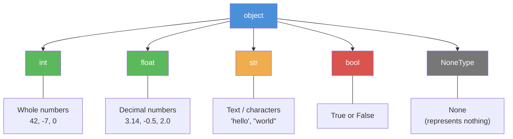

> **Key insight:** `bool` is actually a subclass of `int` in Python. `True` is `1` and `False` is `0`.

```python
# Check the type of any value
type(42)        # <class 'int'>
type(3.14)      # <class 'float'>
type("hello")   # <class 'str'>
type(True)      # <class 'bool'>
type(None)      # <class 'NoneType'>
```

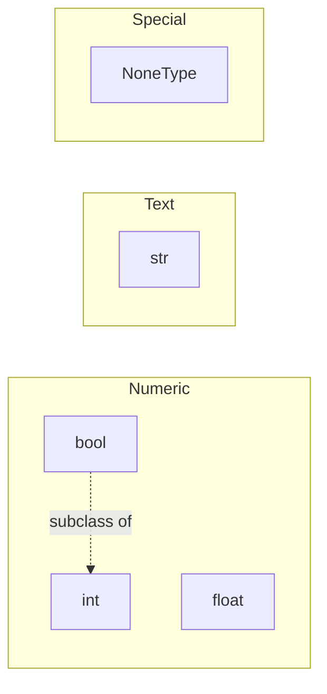

---

## 2. Variables & Assignment

A **variable** is a name that refers to a value stored in memory. Think of it as a label you stick on a box.

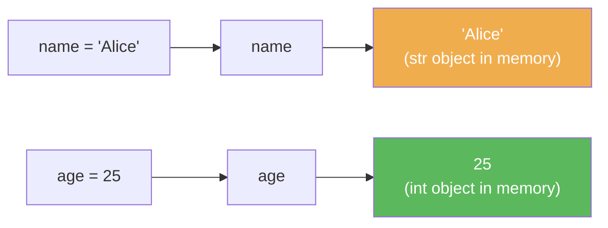

### Assignment Basics

```python
# Single assignment
x = 10
name = "Alice"

# Multiple assignment on one line
a, b, c = 1, 2, 3

# Same value to multiple variables
x = y = z = 0

# Swapping values (Python makes this easy!)
a, b = b, a
```

### Naming Conventions

| Rule                       | Good                 | Bad                          |
| -------------------------- | -------------------- | ---------------------------- |
| Start with letter or `_`   | `my_var`, `_private` | `2fast`                      |
| Use `snake_case`           | `user_name`          | `userName`                   |
| No spaces or special chars | `total_count`        | `total count`, `total-count` |
| Avoid reserved keywords    | `my_class`           | `class`, `for`, `if`         |
| Be descriptive             | `student_age`        | `x`, `sa`                    |

```python
# Reserved keywords you CANNOT use as variable names:
# False, True, None, and, or, not, if, elif, else,
# for, while, break, continue, pass, def, return,
# class, import, from, as, try, except, finally,
# raise, with, yield, lambda, global, nonlocal, del,
# in, is, assert
```

---

## 3. Arithmetic Operators

```python
# Addition
5 + 3        # 8

# Subtraction
10 - 4       # 6

# Multiplication
6 * 7        # 42

# Division (always returns float)
10 / 3       # 3.3333...
10 / 2       # 5.0  <-- still a float!

# Floor Division (rounds down to nearest int)
10 // 3      # 3
-10 // 3     # -4  (rounds toward negative infinity)

# Modulo (remainder)
10 % 3       # 1
17 % 5       # 2

# Exponent (power)
2 ** 3       # 8
9 ** 0.5     # 3.0  (square root!)
```

### Augmented Assignment

```python
x = 10
x += 5    # x = x + 5   -> 15
x -= 3    # x = x - 3   -> 12
x *= 2    # x = x * 2   -> 24
x /= 4    # x = x / 4   -> 6.0
x //= 2   # x = x // 2  -> 3.0
x %= 2    # x = x % 2   -> 1.0
x **= 3   # x = x ** 3  -> 1.0
```

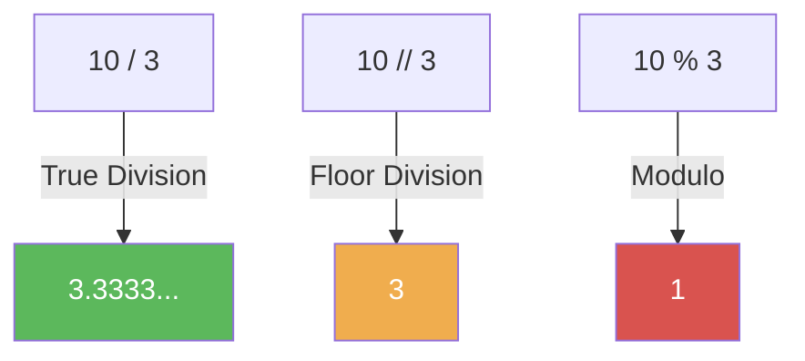

---

## 4. Comparison & Logical Operators

### Comparison Operators

```python
# All comparison operators return True or False

5 == 5      # True   (equal to)
5 != 3      # True   (not equal to)
5 > 3       # True   (greater than)
5 < 3       # False  (less than)
5 >= 5      # True   (greater than or equal to)
5 <= 3      # False  (less than or equal to)
```

### Logical Operators

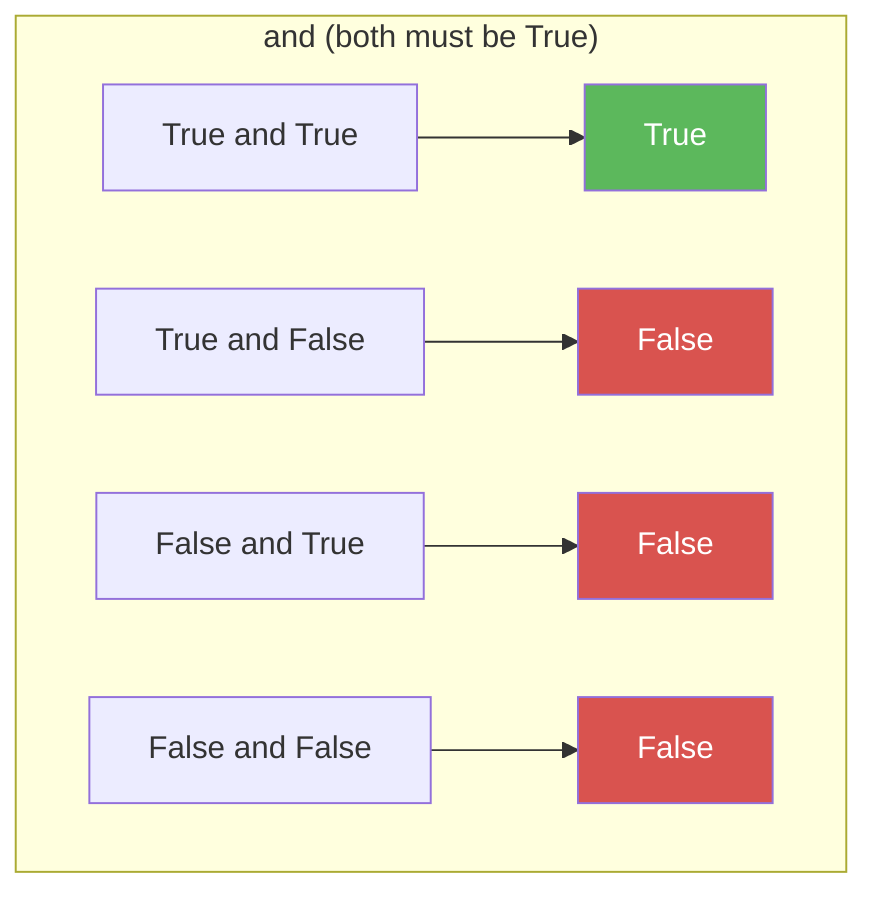

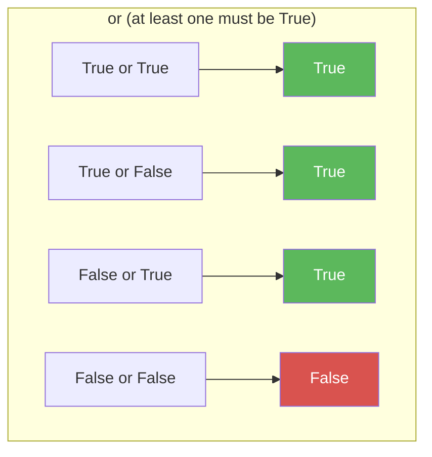

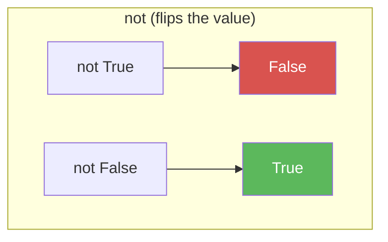

```python
age = 25
has_license = True

# Combining comparisons with logical operators
if age >= 18 and has_license:
    print("Can drive")

# Chained comparisons (Python special feature!)
x = 5
1 < x < 10      # True  (same as: 1 < x and x < 10)
1 < x < 3       # False
```

---

## 5. Operator Precedence

Operators at the top are evaluated first. When in doubt, use parentheses `()` to make your intent clear.

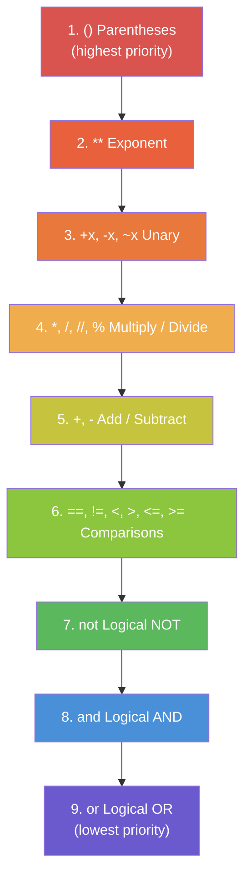

```python
# Precedence in action
2 + 3 * 4        # 14  (not 20! multiplication first)
(2 + 3) * 4      # 20  (parentheses override)

2 ** 3 ** 2       # 512  (** is right-associative: 2 ** 9)
(2 ** 3) ** 2     # 64

not True or False  # False  (not applies to True first)
not (True or False)  # False
```

---

## 6. Strings

Strings are **sequences of characters**. They are **immutable** -- once created, they cannot be changed in place.

### Creating Strings

```python
# Single or double quotes (no difference)
s1 = 'hello'
s2 = "hello"

# Triple quotes for multi-line strings
s3 = """This is
a multi-line
string"""

# Escape characters
s4 = "He said \"hi\""   # He said "hi"
s5 = 'It\'s fine'       # It's fine
s6 = "Line1\nLine2"     # \n = newline
s7 = "Tab\there"        # \t = tab
```

### Indexing & Slicing

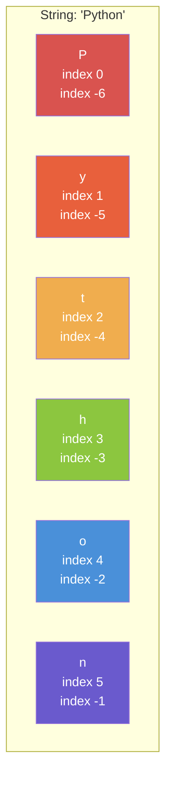

```python
s = "Python"

# Indexing (single character)
s[0]     # 'P'  (first character)
s[-1]    # 'n'  (last character)
s[2]     # 't'

# Slicing: s[start:stop:step]
# start = inclusive, stop = exclusive
s[0:3]   # 'Pyt'  (index 0, 1, 2)
s[2:5]   # 'tho'
s[:3]    # 'Pyt'  (start defaults to 0)
s[3:]    # 'hon'  (stop defaults to end)
s[:]     # 'Python'  (full copy)

# Slicing with step
s[::2]   # 'Pto'  (every 2nd character)
s[::-1]  # 'nohtyP'  (reverse the string!)
s[1:5:2] # 'yh'
```

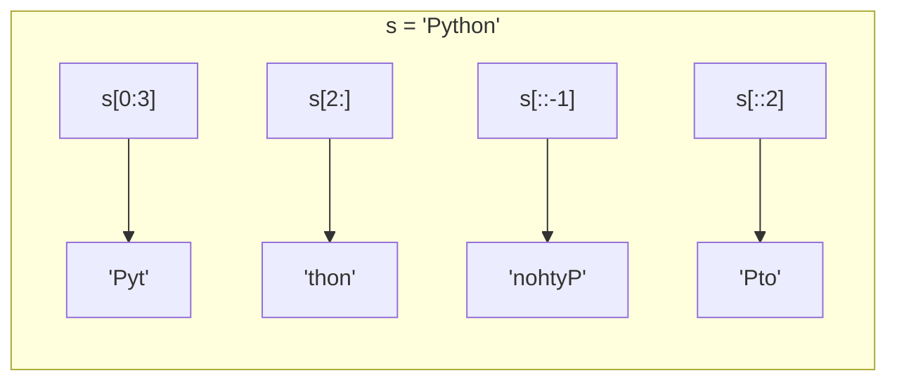

### Common String Methods

```python
s = "  Hello, World!  "

# Case methods
s.upper()       # '  HELLO, WORLD!  '
s.lower()       # '  hello, world!  '

# Whitespace removal
s.strip()       # 'Hello, World!'   (both sides)
s.lstrip()      # 'Hello, World!  ' (left only)
s.rstrip()      # '  Hello, World!' (right only)

# Splitting and joining
"a,b,c".split(",")           # ['a', 'b', 'c']
"hello world".split()        # ['hello', 'world'] (splits on whitespace)
", ".join(["a", "b", "c"])   # 'a, b, c'

# Finding and replacing
s = "Hello, World!"
s.find("World")     # 7  (index where it starts)
s.find("xyz")       # -1  (not found)
s.replace("World", "Python")  # 'Hello, Python!'
s.count("l")        # 3

# Checking content
"hello".startswith("he")  # True
"hello".endswith("lo")    # True
"abc123".isalnum()        # True
"abc".isalpha()           # True
"123".isdigit()           # True
```

### String Operations

```python
# Concatenation
"Hello" + " " + "World"   # 'Hello World'

# Repetition
"ha" * 3                  # 'hahaha'

# Length
len("Python")             # 6

# Membership
"Py" in "Python"          # True
"xyz" not in "Python"     # True
```

---

## 7. Control Flow

### if / elif / else

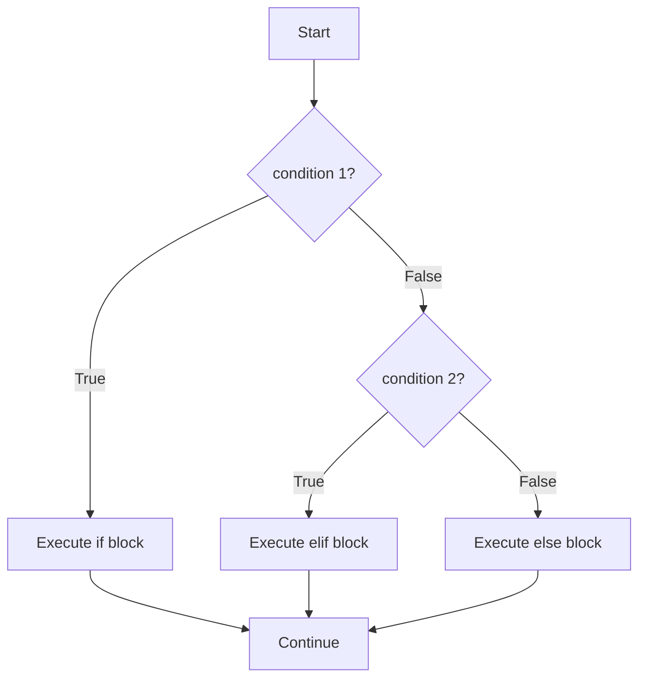

```python
age = 18

if age >= 18:
    print("Adult")
elif age >= 13:
    print("Teenager")
else:
    print("Child")
```

**Important rules:**

- Indentation matters! Use 4 spaces (not tabs).
- The colon `:` at the end of `if`, `elif`, `else` is required.
- `elif` and `else` are optional.
- You can have as many `elif` blocks as you want but only one `else`.

```python
# Ternary (one-line if/else)
status = "adult" if age >= 18 else "minor"
```

### for Loop

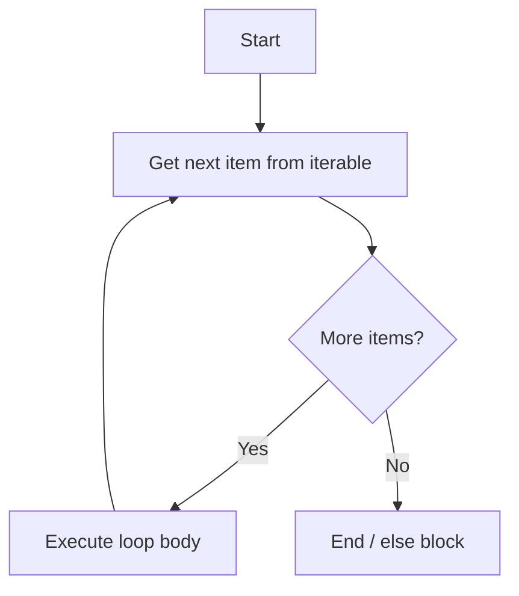

### while Loop

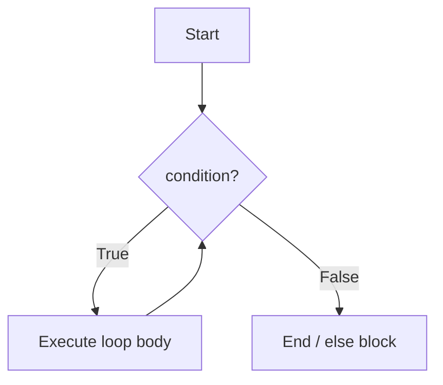

---

## 8. Loops

### for Loop

```python
# Looping over a list
fruits = ["apple", "banana", "cherry"]
for fruit in fruits:
    print(fruit)

# Looping over a string
for char in "Hello":
    print(char)

# Looping over a range of numbers
for i in range(5):       # 0, 1, 2, 3, 4
    print(i)

for i in range(2, 6):    # 2, 3, 4, 5
    print(i)

for i in range(0, 10, 2):  # 0, 2, 4, 6, 8
    print(i)

for i in range(5, 0, -1):  # 5, 4, 3, 2, 1 (countdown!)
    print(i)
```

### range() Explained

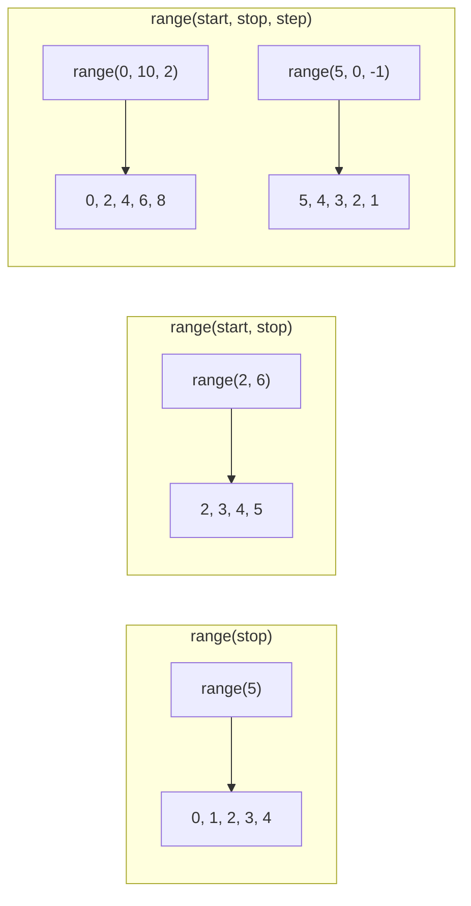

### enumerate()

When you need both the **index** and the **value** during iteration:

```python
fruits = ["apple", "banana", "cherry"]

for index, fruit in enumerate(fruits):
    print(f"{index}: {fruit}")
# 0: apple
# 1: banana
# 2: cherry

# Start counting from a different number
for index, fruit in enumerate(fruits, start=1):
    print(f"{index}: {fruit}")
# 1: apple
# 2: banana
# 3: cherry
```

### while Loop

```python
count = 0
while count < 5:
    print(count)
    count += 1       # Don't forget this or infinite loop!

# while with user input
password = ""
while password != "secret":
    password = input("Enter password: ")
print("Access granted!")
```

### break and continue

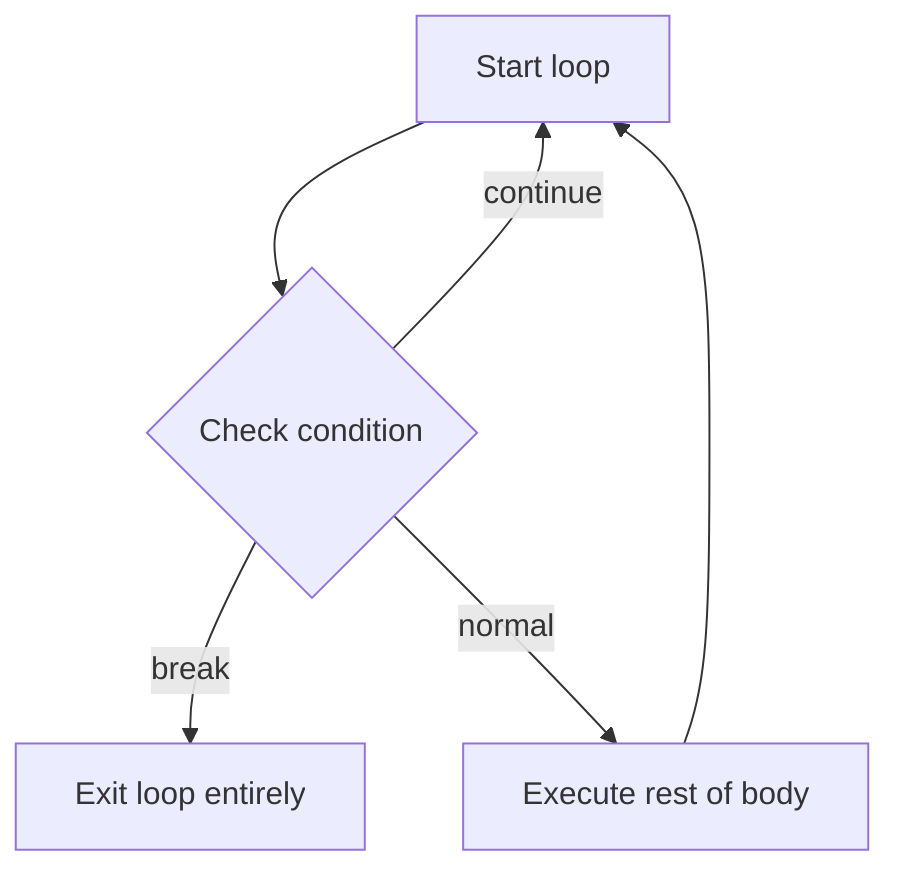

```python
# break - exits the loop immediately
for i in range(10):
    if i == 5:
        break           # stops at 5
    print(i)            # prints 0, 1, 2, 3, 4

# continue - skips to the next iteration
for i in range(10):
    if i % 2 == 0:
        continue        # skip even numbers
    print(i)            # prints 1, 3, 5, 7, 9
```

### Nested Loops

```python
# Multiplication table
for i in range(1, 4):
    for j in range(1, 4):
        print(f"{i} x {j} = {i * j}")
    print("---")
```

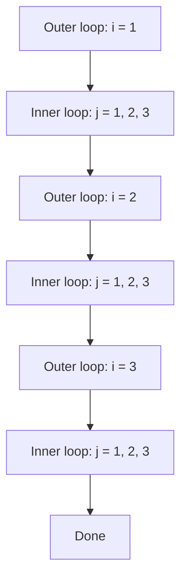

---

## 9. Input / Output

### print()

```python
# Basic printing
print("Hello, World!")

# Printing multiple values
name = "Alice"
age = 25
print("Name:", name, "Age:", age)    # separated by space

# Custom separator
print("a", "b", "c", sep="-")       # a-b-c

# Custom end character (default is newline)
print("Hello", end=" ")
print("World")                        # Hello World (on one line)
```

### f-strings (Formatted String Literals)

The modern and recommended way to format strings in Python (3.6+):

```python
name = "Alice"
age = 25

# Basic f-string
print(f"My name is {name} and I am {age} years old.")

# Expressions inside braces
print(f"Next year I'll be {age + 1}.")

# Formatting numbers
pi = 3.14159
print(f"Pi is approximately {pi:.2f}")    # Pi is approximately 3.14

price = 49.99
print(f"Price: ${price:>10.2f}")          # Price:      $49.99

# Padding and alignment
print(f"{'left':<20}")     # left aligned, 20 chars wide
print(f"{'center':^20}")   # center aligned
print(f"{'right':>20}")    # right aligned
```

### input()

```python
# input() always returns a string!
name = input("Enter your name: ")
print(f"Hello, {name}!")

# To get a number, convert the result
age = int(input("Enter your age: "))
height = float(input("Enter your height: "))
```

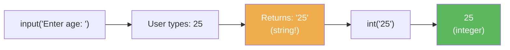

---

## 10. Type Conversion

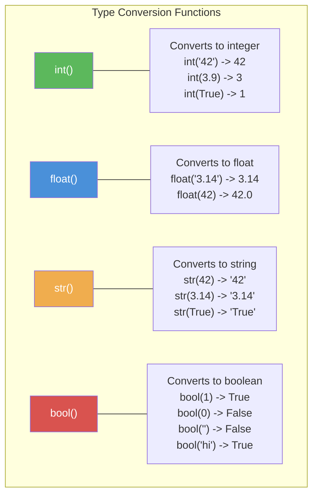

```python
# int() - converts to integer
int("42")       # 42
int(3.9)        # 3  (truncates, does NOT round!)
int(3.1)        # 3
int(True)       # 1
int(False)      # 0
# int("hello")  # ValueError! Can't convert non-numeric string

# float() - converts to float
float("3.14")   # 3.14
float(42)       # 42.0
float("inf")    # inf (infinity)

# str() - converts to string
str(42)         # '42'
str(3.14)       # '3.14'
str(True)       # 'True'
str(None)       # 'None'

# bool() - converts to boolean
# "Falsy" values (become False):
bool(0)         # False
bool(0.0)       # False
bool("")        # False  (empty string)
bool(None)      # False
bool([])        # False  (empty list)

# "Truthy" values (become True):
bool(1)         # True  (any non-zero number)
bool(-5)        # True
bool("hello")   # True  (any non-empty string)
bool(" ")       # True  (space is not empty!)
```

### Truthy and Falsy Cheat Sheet

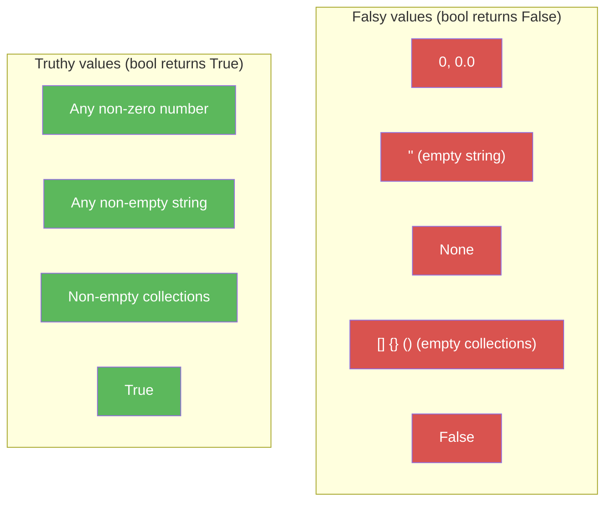

---

## Quick Reference Summary

| Concept      | Syntax                       | Example                     |
| ------------ | ---------------------------- | --------------------------- |
| Variable     | `name = value`               | `x = 10`                    |
| Type check   | `type(value)`                | `type(42)` -> `int`         |
| Arithmetic   | `+ - * / // % **`            | `10 // 3` -> `3`            |
| Comparison   | `== != < > <= >=`            | `5 > 3` -> `True`           |
| Logical      | `and or not`                 | `True and False` -> `False` |
| String index | `s[i]`                       | `"hi"[0]` -> `"h"`          |
| String slice | `s[start:stop:step]`         | `"hello"[1:4]` -> `"ell"`   |
| f-string     | `f"text {expr}"`             | `f"age: {25}"`              |
| if/elif/else | `if cond:`                   | See section 7               |
| for loop     | `for x in iterable:`         | `for i in range(5):`        |
| while loop   | `while cond:`                | `while x < 10:`             |
| Type convert | `int() float() str() bool()` | `int("42")` -> `42`         |
