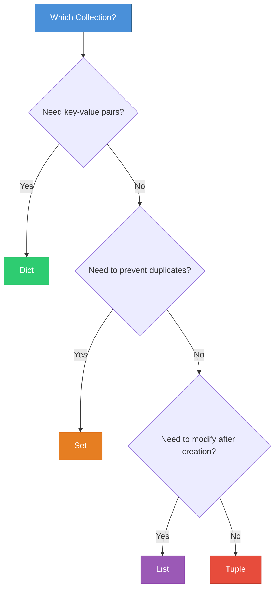
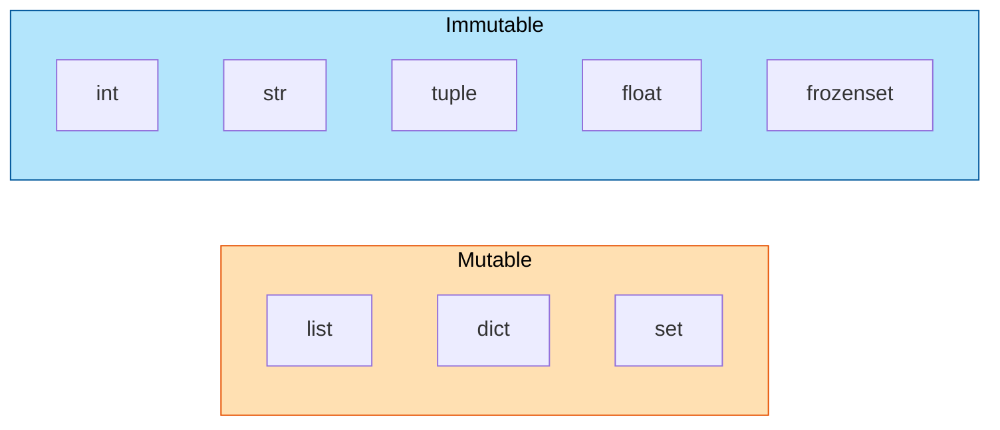
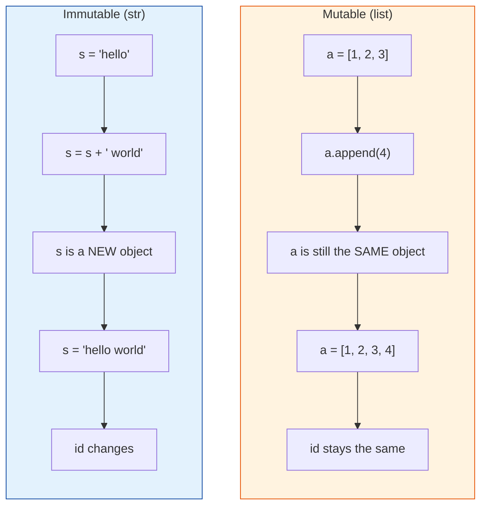
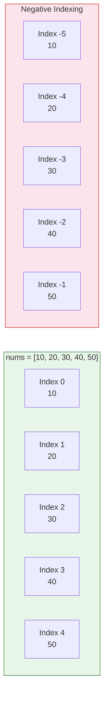
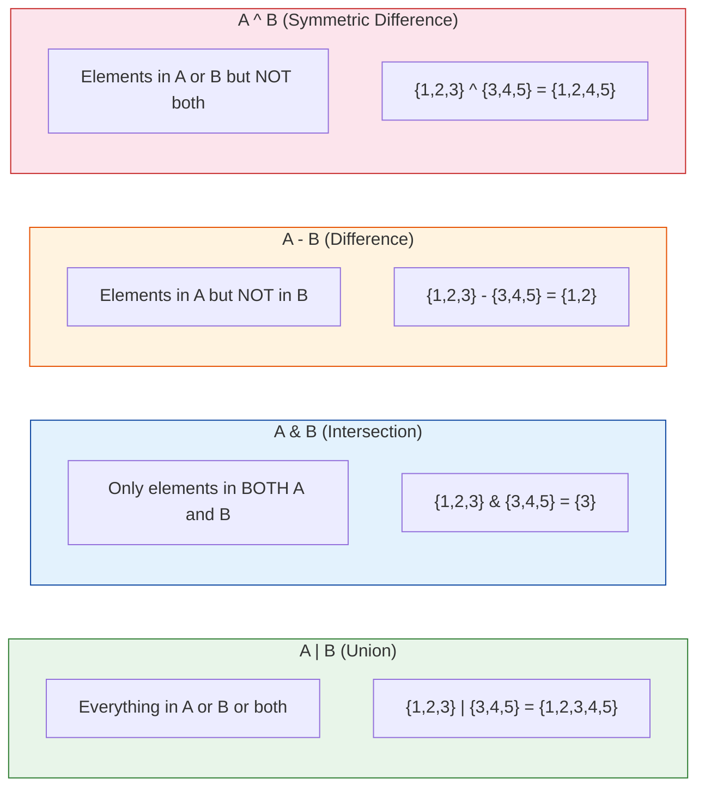
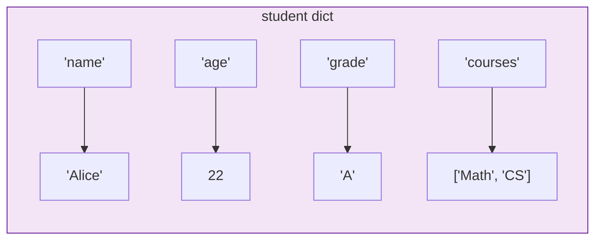
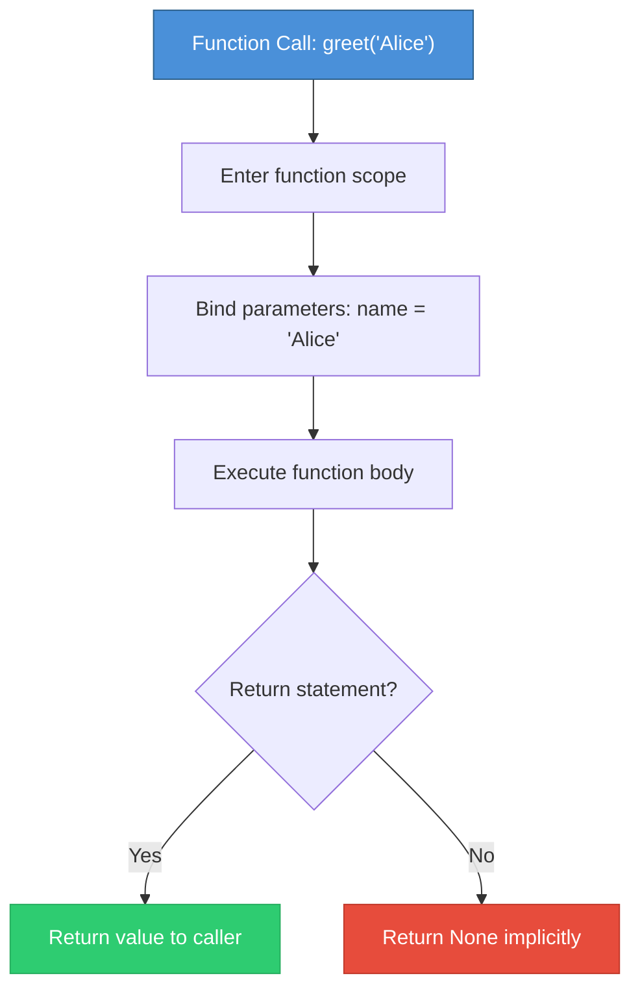
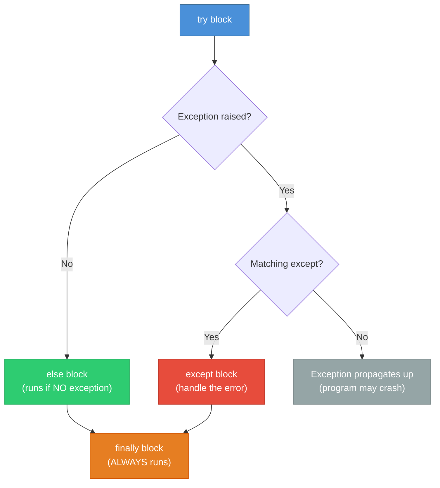

# Python Collections & Functions (Day 2)

A comprehensive guide covering Python's built-in collection types and function fundamentals. This is the foundation you need before tackling any data structures and algorithms work.

---

## Table of Contents

1. [List vs Tuple vs Set vs Dict](#1-list-vs-tuple-vs-set-vs-dict)
2. [Mutable vs Immutable](#2-mutable-vs-immutable)
3. [Lists](#3-lists)
4. [Tuples](#4-tuples)
5. [Sets](#5-sets)
6. [Dictionaries](#6-dictionaries)
7. [Functions](#7-functions)
8. [Lambda Functions](#8-lambda-functions)
9. [String Formatting](#9-string-formatting)
10. [Error Handling](#10-error-handling)

---

## 1. List vs Tuple vs Set vs Dict

Before diving into each collection, here is a high-level comparison so you can quickly decide which one to use.

| Feature    | List         | Tuple        | Set          | Dict              |
|------------|--------------|--------------|--------------|-------------------|
| Syntax     | `[1, 2, 3]`  | `(1, 2, 3)`  | `{1, 2, 3}`  | `{'a': 1, 'b': 2}`|
| Ordered?   | Yes          | Yes          | No           | Yes (3.7+)        |
| Mutable?   | Yes          | No           | Yes          | Yes               |
| Duplicates?| Yes          | Yes          | No           | Keys: No          |
| Indexable? | Yes          | Yes          | No           | By key             |



### When to use what

- **List** -- your default go-to. Use when you need an ordered collection you will modify.
- **Tuple** -- use when data should not change (coordinates, database rows, dict keys).
- **Set** -- use when you need uniqueness or fast membership testing (`in` is O(1)).
- **Dict** -- use when you need to look up values by a key.

---

## 2. Mutable vs Immutable

This is one of the most important concepts in Python and a common source of bugs.

- **Mutable**: can be changed in place (list, set, dict)
- **Immutable**: cannot be changed; any "modification" creates a new object (int, float, str, tuple)



### What happens when you "modify" each type



### Why this matters

```python
# Mutable gotcha -- two variables pointing to the SAME list
a = [1, 2, 3]
b = a           # b is NOT a copy, it is the same object
b.append(4)
print(a)        # [1, 2, 3, 4]  <-- a changed too!

# Fix: make a copy
b = a.copy()    # or a[:] or list(a)
b.append(4)
print(a)        # [1, 2, 3]  <-- a is unchanged
```

```python
# Immutable -- safe
x = "hello"
y = x
y = y + " world"
print(x)        # "hello"  <-- x is unchanged
```

---

## 3. Lists

Lists are Python's workhorse data structure. They are ordered, mutable sequences that can hold any type of element.

### Creating Lists

```python
empty = []
nums = [1, 2, 3, 4, 5]
mixed = [1, "hello", 3.14, True]
nested = [[1, 2], [3, 4]]
from_range = list(range(5))        # [0, 1, 2, 3, 4]
from_string = list("hello")        # ['h', 'e', 'l', 'l', 'o']
```

### Indexing



```python
nums = [10, 20, 30, 40, 50]

# Positive indexing (from the front)
nums[0]     # 10
nums[2]     # 30
nums[4]     # 50

# Negative indexing (from the back)
nums[-1]    # 50  (last element)
nums[-2]    # 40  (second to last)
```

### Slicing

Slicing syntax: `list[start:stop:step]` -- start is inclusive, stop is exclusive.

```python
nums = [10, 20, 30, 40, 50]

nums[1:3]       # [20, 30]         start at 1, stop before 3
nums[:3]        # [10, 20, 30]     from beginning to index 3
nums[2:]        # [30, 40, 50]     from index 2 to end
nums[::2]       # [10, 30, 50]     every 2nd element
nums[::-1]      # [50, 40, 30, 20, 10]  reversed
nums[1:4:2]     # [20, 40]         index 1 to 4, step 2
```

### Common List Operations

```python
nums = [3, 1, 4, 1, 5]

# --- Adding elements ---
nums.append(9)          # [3, 1, 4, 1, 5, 9]       add to end
nums.extend([2, 6])     # [3, 1, 4, 1, 5, 9, 2, 6] add multiple to end
nums.insert(0, 99)      # [99, 3, 1, 4, 1, 5, 9, 2, 6] insert at index

# --- Removing elements ---
nums.pop()              # removes & returns last element (6)
nums.pop(0)             # removes & returns element at index 0 (99)
nums.remove(1)          # removes first occurrence of value 1

# --- Sorting ---
nums.sort()             # sorts in place (ascending)
nums.sort(reverse=True) # sorts in place (descending)
sorted_nums = sorted(nums)  # returns NEW sorted list, original unchanged

# --- Other ---
nums.reverse()          # reverses in place
len(nums)               # number of elements
3 in nums               # True if 3 is in the list
nums.count(1)           # count occurrences of 1
nums.index(4)           # index of first occurrence of 4
```

### List Comprehensions

This is one of the most powerful and Pythonic features. Learn it well -- it shows up everywhere.

```python
# Basic: [expression for item in iterable]
squares = [x**2 for x in range(5)]           # [0, 1, 4, 9, 16]

# With condition: [expression for item in iterable if condition]
evens = [x for x in range(10) if x % 2 == 0] # [0, 2, 4, 6, 8]

# Nested
flat = [x for row in [[1,2],[3,4]] for x in row]  # [1, 2, 3, 4]

# With transformation
words = ["hello", "world"]
upper = [w.upper() for w in words]            # ['HELLO', 'WORLD']
```

---

## 4. Tuples

Tuples are like lists, but **immutable**. Once created, you cannot add, remove, or change elements.

### Creating Tuples

```python
empty = ()
single = (42,)         # NOTE the comma! (42) is just an int in parentheses
pair = (1, 2)
triple = (1, "hello", 3.14)
from_list = tuple([1, 2, 3])
```

### Tuple Unpacking

This is extremely useful and used heavily in Python.

```python
# Basic unpacking
x, y = (10, 20)
print(x)    # 10
print(y)    # 20

# Swap two variables (Pythonic!)
a, b = 1, 2
a, b = b, a    # a=2, b=1

# Unpacking with *
first, *rest = [1, 2, 3, 4, 5]
# first = 1, rest = [2, 3, 4, 5]

head, *middle, tail = [1, 2, 3, 4, 5]
# head = 1, middle = [2, 3, 4], tail = 5

# In loops
points = [(1, 2), (3, 4), (5, 6)]
for x, y in points:
    print(f"x={x}, y={y}")
```

### Named Tuples

Named tuples give you the immutability of tuples with the readability of classes.

```python
from collections import namedtuple

Point = namedtuple('Point', ['x', 'y'])
p = Point(3, 4)
print(p.x)      # 3
print(p.y)      # 4
print(p[0])     # 3 (still works like a tuple)

# Use case: returning multiple values from a function
Result = namedtuple('Result', ['value', 'found'])
def search(lst, target):
    for i, v in enumerate(lst):
        if v == target:
            return Result(value=i, found=True)
    return Result(value=-1, found=False)
```

### When to use tuples over lists

- Function return values (multiple returns)
- Dictionary keys (lists cannot be dict keys because they are mutable)
- Data that should not change (coordinates, RGB colors, database rows)
- Slightly more memory-efficient and faster than lists

---

## 5. Sets

Sets are unordered collections of **unique** elements. They are built on hash tables, making membership testing (`in`) very fast -- O(1) on average.

### Creating Sets

```python
empty = set()           # NOT {} -- that creates an empty dict!
nums = {1, 2, 3, 4, 5}
from_list = set([1, 2, 2, 3, 3])   # {1, 2, 3} -- duplicates removed
from_string = set("hello")          # {'h', 'e', 'l', 'o'}
```

### Set Operations

```python
s = {1, 2, 3}

s.add(4)            # {1, 2, 3, 4}
s.remove(2)         # {1, 3, 4}    raises KeyError if not found
s.discard(99)       # {1, 3, 4}    no error if not found
s.pop()             # removes and returns an arbitrary element
len(s)              # number of elements
3 in s              # True (O(1) lookup!)
```

### Set Math Operations



```python
a = {1, 2, 3, 4}
b = {3, 4, 5, 6}

# Union -- all elements from both sets
a | b               # {1, 2, 3, 4, 5, 6}
a.union(b)          # same thing

# Intersection -- elements in both
a & b               # {3, 4}
a.intersection(b)   # same thing

# Difference -- in a but not in b
a - b               # {1, 2}
a.difference(b)     # same thing

# Symmetric difference -- in one but not both
a ^ b                       # {1, 2, 5, 6}
a.symmetric_difference(b)   # same thing
```

### Common Use Cases

```python
# Remove duplicates from a list (order not preserved)
nums = [1, 2, 2, 3, 3, 3]
unique = list(set(nums))     # [1, 2, 3] (order may vary)

# Fast membership testing
valid = {'admin', 'editor', 'viewer'}
if user_role in valid:       # O(1) instead of O(n) with a list
    grant_access()

# Find common elements between two lists
common = set(list1) & set(list2)
```

---

## 6. Dictionaries

Dictionaries store **key-value pairs**. They are one of the most important data structures in Python and used constantly in interviews.



### Creating Dictionaries

```python
empty = {}
student = {
    'name': 'Alice',
    'age': 22,
    'grade': 'A'
}
from_tuples = dict([('a', 1), ('b', 2)])
from_keys = dict.fromkeys(['x', 'y', 'z'], 0)   # {'x': 0, 'y': 0, 'z': 0}
```

### Accessing Values

```python
student = {'name': 'Alice', 'age': 22, 'grade': 'A'}

# Direct access (raises KeyError if key missing)
student['name']         # 'Alice'
student['gpa']          # KeyError!

# Safe access with get() (returns None or default if key missing)
student.get('name')     # 'Alice'
student.get('gpa')      # None
student.get('gpa', 0.0) # 0.0 (custom default)
```

### Modifying Dictionaries

```python
d = {'a': 1, 'b': 2}

d['c'] = 3             # add new key
d['a'] = 10            # update existing key
d.update({'b': 20, 'd': 4})  # update multiple keys

del d['a']             # remove key (KeyError if missing)
value = d.pop('b')     # remove and return value (20)
d.pop('z', None)       # safe removal, returns None if missing
```

### Iterating Over Dictionaries

```python
student = {'name': 'Alice', 'age': 22, 'grade': 'A'}

# Keys (default iteration)
for key in student:
    print(key)              # name, age, grade

# Keys explicitly
for key in student.keys():
    print(key)

# Values
for value in student.values():
    print(value)            # Alice, 22, A

# Key-value pairs (most common)
for key, value in student.items():
    print(f"{key}: {value}")
```

### Dictionary Comprehensions

```python
# {key_expr: value_expr for item in iterable}
squares = {x: x**2 for x in range(5)}
# {0: 0, 1: 1, 2: 4, 3: 9, 4: 16}

# With condition
even_squares = {x: x**2 for x in range(10) if x % 2 == 0}
# {0: 0, 2: 4, 4: 16, 6: 36, 8: 64}

# Invert a dictionary
original = {'a': 1, 'b': 2}
inverted = {v: k for k, v in original.items()}
# {1: 'a', 2: 'b'}
```

### defaultdict Preview

`defaultdict` from the `collections` module automatically creates default values for missing keys. This is extremely useful for counting, grouping, and building graphs.

```python
from collections import defaultdict

# Regular dict -- you have to check if key exists
word_count = {}
for word in words:
    if word in word_count:
        word_count[word] += 1
    else:
        word_count[word] = 1

# defaultdict -- much cleaner
word_count = defaultdict(int)    # default value is 0
for word in words:
    word_count[word] += 1        # just works, no checking needed

# defaultdict with list -- great for grouping
groups = defaultdict(list)
for name, dept in employees:
    groups[dept].append(name)    # automatically creates empty list

# Also check out Counter for counting
from collections import Counter
word_count = Counter(words)      # does the same thing in one line
```

---

## 7. Functions

Functions are reusable blocks of code. In Python, functions are first-class objects -- they can be passed around, returned from other functions, and stored in variables.



### Defining Functions

```python
# Basic function
def greet(name):
    return f"Hello, {name}!"

# Calling it
message = greet("Alice")    # "Hello, Alice!"

# Function with no return (returns None)
def say_hi(name):
    print(f"Hi, {name}!")

result = say_hi("Bob")      # prints "Hi, Bob!", result is None
```

### Multiple Return Values

Python functions can return multiple values using tuples.

```python
def min_max(nums):
    return min(nums), max(nums)    # returns a tuple

low, high = min_max([3, 1, 4, 1, 5, 9])
print(low)    # 1
print(high)   # 9
```

### Default Arguments

```python
def power(base, exponent=2):
    return base ** exponent

power(3)        # 9   (exponent defaults to 2)
power(3, 3)     # 27

# GOTCHA: never use mutable defaults!
# BAD:
def append_to(value, lst=[]):    # this list is shared across calls!
    lst.append(value)
    return lst

# GOOD:
def append_to(value, lst=None):
    if lst is None:
        lst = []
    lst.append(value)
    return lst
```

### *args and **kwargs

```python
# *args -- accept any number of positional arguments (as a tuple)
def add_all(*args):
    return sum(args)

add_all(1, 2, 3)       # 6
add_all(1, 2, 3, 4, 5) # 15

# **kwargs -- accept any number of keyword arguments (as a dict)
def print_info(**kwargs):
    for key, value in kwargs.items():
        print(f"{key}: {value}")

print_info(name="Alice", age=22)
# name: Alice
# age: 22

# Combining everything
def func(required, *args, default=10, **kwargs):
    print(f"required: {required}")
    print(f"args: {args}")
    print(f"default: {default}")
    print(f"kwargs: {kwargs}")

func(1, 2, 3, default=20, x=100, y=200)
# required: 1
# args: (2, 3)
# default: 20
# kwargs: {'x': 100, 'y': 200}
```

### Scope

```python
x = 10          # global scope

def outer():
    y = 20      # enclosing scope

    def inner():
        z = 30  # local scope
        print(x, y, z)     # can read all three

    inner()

outer()         # 10 20 30

# To MODIFY a global variable inside a function
count = 0
def increment():
    global count
    count += 1
```

---

## 8. Lambda Functions

Lambdas are small anonymous (unnamed) functions. They are limited to a single expression.

### Syntax

```python
# Regular function
def add(a, b):
    return a + b

# Equivalent lambda
add = lambda a, b: a + b

# Usage
add(3, 4)    # 7
```

### Use with map, filter, sorted

```python
nums = [1, 2, 3, 4, 5]

# map -- apply function to every element
squares = list(map(lambda x: x**2, nums))
# [1, 4, 9, 16, 25]

# filter -- keep elements where function returns True
evens = list(filter(lambda x: x % 2 == 0, nums))
# [2, 4]

# sorted -- custom sort key
words = ["banana", "apple", "cherry"]
by_length = sorted(words, key=lambda w: len(w))
# ['apple', 'banana', 'cherry']

# Sort by second element of tuple
pairs = [(1, 'b'), (3, 'a'), (2, 'c')]
sorted_pairs = sorted(pairs, key=lambda p: p[1])
# [(3, 'a'), (1, 'b'), (2, 'c')]

# Sort by multiple criteria
students = [('Alice', 90), ('Bob', 85), ('Charlie', 90)]
sorted_students = sorted(students, key=lambda s: (-s[1], s[0]))
# [('Alice', 90), ('Charlie', 90), ('Bob', 85)]
```

### When to use lambdas

- Short, one-off functions (especially as sort keys)
- When the function is so simple that naming it adds no clarity
- **Do not** use lambdas for complex logic -- use a regular `def` instead

---

## 9. String Formatting

### f-strings (Python 3.6+) -- Preferred

```python
name = "Alice"
age = 22
gpa = 3.14159

# Basic
f"Hello, {name}!"                    # "Hello, Alice!"

# Expressions inside braces
f"{name} is {age} years old"         # "Alice is 22 years old"
f"2 + 3 = {2 + 3}"                   # "2 + 3 = 5"

# Formatting numbers
f"GPA: {gpa:.2f}"                    # "GPA: 3.14"      (2 decimal places)
f"Count: {42:05d}"                   # "Count: 00042"    (zero-padded)
f"Percent: {0.856:.1%}"              # "Percent: 85.6%"
f"Big number: {1000000:,}"           # "Big number: 1,000,000"

# Padding and alignment
f"{'left':<10}|"                     # "left      |"
f"{'right':>10}|"                    # "     right|"
f"{'center':^10}|"                   # "  center  |"

# Debugging (Python 3.8+)
x = 42
f"{x=}"                              # "x=42"
```

### .format() Method

```python
# Positional
"Hello, {}!".format("Alice")         # "Hello, Alice!"
"{0} and {1}".format("Alice", "Bob") # "Alice and Bob"

# Named
"Hello, {name}!".format(name="Alice")

# Format spec
"Pi is {:.2f}".format(3.14159)       # "Pi is 3.14"
```

### Common Patterns

```python
# Joining a list into a string
words = ["hello", "world"]
" ".join(words)         # "hello world"
", ".join(words)        # "hello, world"

# Splitting a string into a list
"hello world".split()           # ["hello", "world"]
"a,b,c".split(",")              # ["a", "b", "c"]

# Stripping whitespace
"  hello  ".strip()     # "hello"
"  hello  ".lstrip()    # "hello  "
"  hello  ".rstrip()    # "  hello"

# Checking content
"hello123".isalnum()    # True
"hello".isalpha()       # True
"123".isdigit()         # True
"hello".startswith("he")# True
"hello".endswith("lo")  # True
```

---

## 10. Error Handling

Error handling prevents your program from crashing when something unexpected happens. Python uses `try/except` blocks.



### Basic try/except

```python
# Catch a specific exception
try:
    result = 10 / 0
except ZeroDivisionError:
    print("Cannot divide by zero!")

# Catch the exception object
try:
    result = int("abc")
except ValueError as e:
    print(f"Error: {e}")    # Error: invalid literal for int() ...
```

### Multiple except blocks

```python
try:
    nums = [1, 2, 3]
    print(nums[10])
except IndexError:
    print("Index out of range!")
except TypeError:
    print("Type error!")
except Exception as e:
    print(f"Something else went wrong: {e}")
```

### else and finally

```python
try:
    result = 10 / 2
except ZeroDivisionError:
    print("Cannot divide by zero!")
else:
    # Only runs if NO exception was raised
    print(f"Result: {result}")
finally:
    # ALWAYS runs, whether exception or not
    # Great for cleanup (closing files, connections, etc.)
    print("Done!")
```

### Raising Exceptions

```python
def validate_age(age):
    if age < 0:
        raise ValueError("Age cannot be negative")
    if age > 150:
        raise ValueError("Age seems unrealistic")
    return age

# Using it
try:
    validate_age(-5)
except ValueError as e:
    print(e)    # "Age cannot be negative"
```

### Common Exception Types

| Exception           | When it happens                              |
|---------------------|----------------------------------------------|
| `ValueError`        | Wrong value (e.g., `int("abc")`)            |
| `TypeError`         | Wrong type (e.g., `"a" + 1`)               |
| `IndexError`        | List index out of range                      |
| `KeyError`          | Dict key not found                           |
| `ZeroDivisionError` | Division by zero                             |
| `FileNotFoundError` | File does not exist                          |
| `AttributeError`    | Object has no such attribute                 |
| `NameError`         | Variable not defined                         |

### Pattern: LBYL vs EAFP

Python favors "Easier to Ask Forgiveness than Permission" (EAFP):

```python
# LBYL (Look Before You Leap) -- common in other languages
if key in my_dict:
    value = my_dict[key]
else:
    value = default

# EAFP (Pythonic way)
try:
    value = my_dict[key]
except KeyError:
    value = default

# Even better -- just use .get()
value = my_dict.get(key, default)
```

---

## Quick Reference Cheat Sheet

```python
# Lists
[].append(x)    # add to end
[].pop()         # remove from end
[].sort()        # sort in place
sorted([])       # return new sorted list
x in []          # membership test O(n)

# Dicts
{}.get(k, d)     # safe access with default
{}.items()       # key-value pairs
{}.keys()        # just keys
{}.values()      # just values

# Sets
{} & {}          # intersection
{} | {}          # union
{} - {}          # difference
x in set()       # membership test O(1)

# Strings
"".split()       # split into list
" ".join([])     # join list into string
f"{var}"         # f-string formatting
```

---

**Next up**: Day 3 -- Classes, OOP, and Python-specific patterns for coding interviews.
