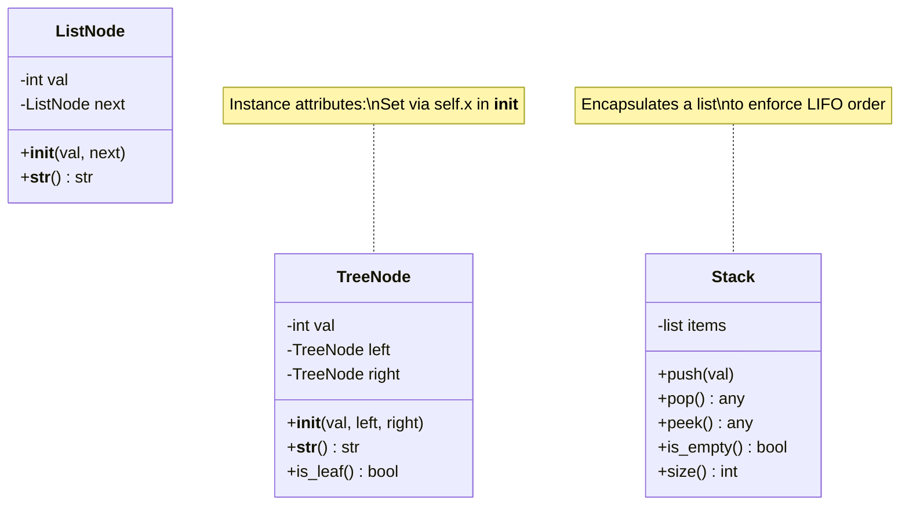
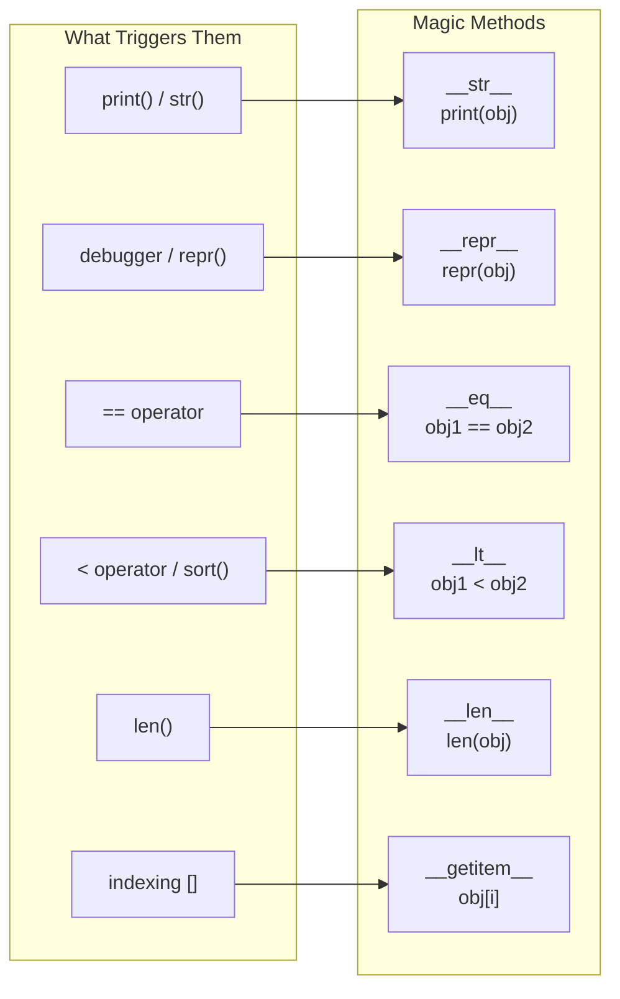
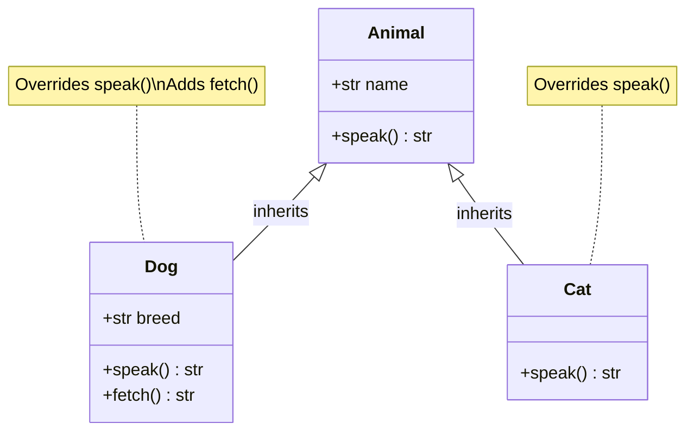
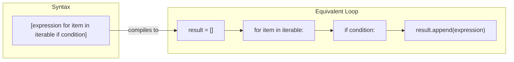
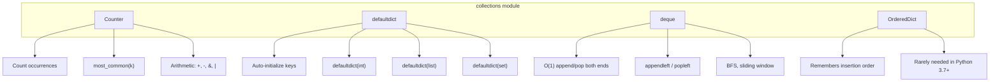
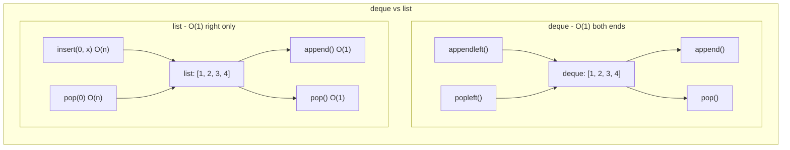
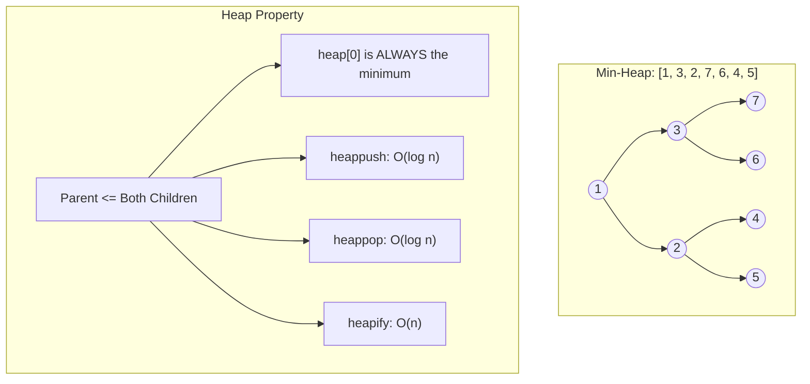
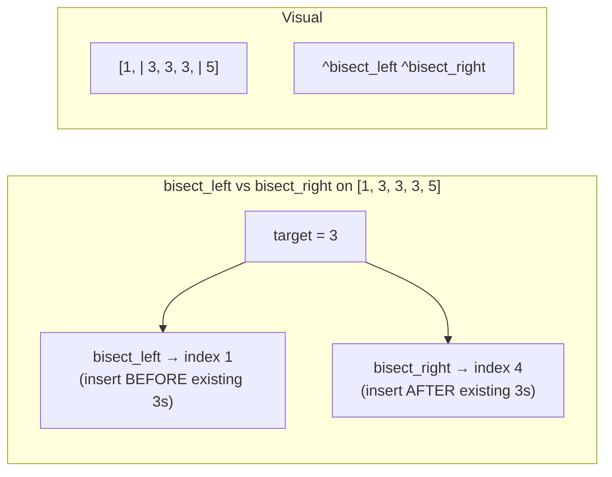
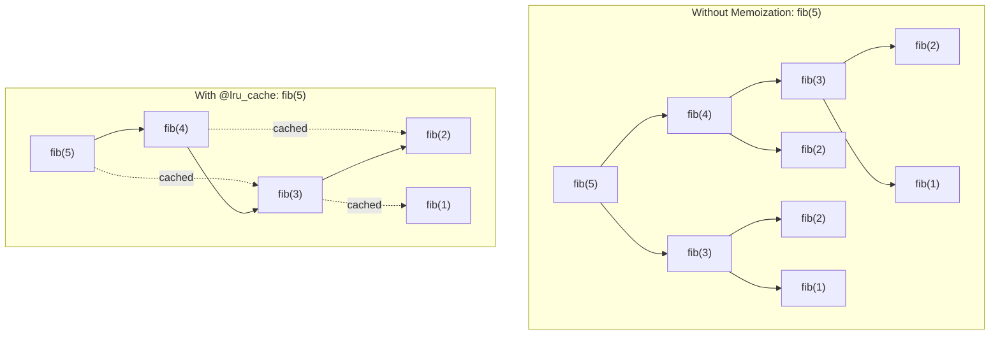
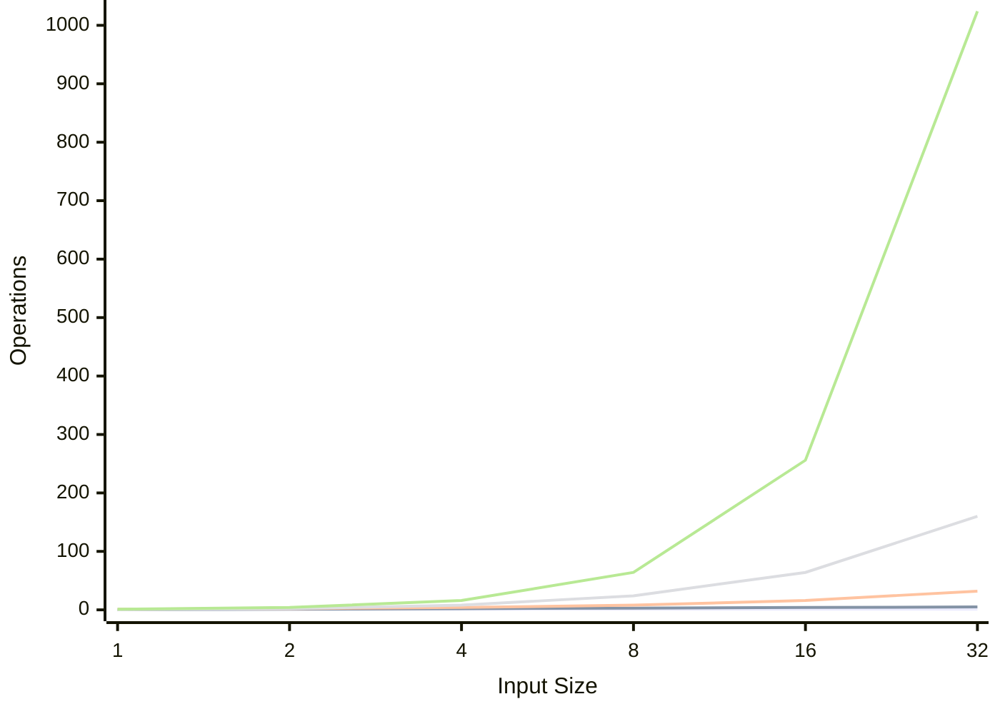

# Day 3: OOP & DSA Prerequisites

Master Python's object-oriented programming and the essential standard library modules used constantly in DSA problem solving.

---

## 1. Classes and Objects

A **class** is a blueprint for creating objects. An **object** is an instance of a class with its own data.



### The `__init__` Method and `self`

`__init__` is the **constructor** -- it runs automatically when you create an object. `self` refers to the specific instance being created.

```python
class ListNode:
    def __init__(self, val=0, next=None):
        self.val = val      # instance attribute
        self.next = next    # instance attribute

# Creating objects
node1 = ListNode(1)
node2 = ListNode(2, node1)
print(node2.val)   # 2
print(node2.next)  # <ListNode object>
```

### Instance vs Class Attributes

```python
class Counter:
    count = 0              # class attribute (shared by ALL instances)

    def __init__(self, name):
        self.name = name   # instance attribute (unique to each instance)
        Counter.count += 1 # modify the shared class attribute

a = Counter("alpha")
b = Counter("beta")
print(Counter.count)  # 2  (shared)
print(a.name)         # "alpha" (unique)
print(b.name)         # "beta"  (unique)
```

**Rule of thumb for DSA:** Almost always use **instance attributes** (set via `self.x` in `__init__`). Class attributes are rare in competitive coding.

---

## 2. Magic Methods (Dunder Methods)

Magic methods let your objects work with Python's built-in operators and functions.



### `__str__` and `__repr__`

```python
class ListNode:
    def __init__(self, val=0, next=None):
        self.val = val
        self.next = next

    def __str__(self):
        """Human-readable: used by print()"""
        parts = []
        curr = self
        while curr:
            parts.append(str(curr.val))
            curr = curr.next
        return " -> ".join(parts) + " -> None"

    def __repr__(self):
        """Developer-readable: used in debugger/REPL"""
        return f"ListNode({self.val})"

node = ListNode(1, ListNode(2, ListNode(3)))
print(node)       # 1 -> 2 -> 3 -> None
print(repr(node)) # ListNode(1)
```

### `__eq__` and `__lt__` (Comparison)

```python
class Point:
    def __init__(self, x, y):
        self.x = x
        self.y = y

    def __eq__(self, other):
        """Allows: point1 == point2"""
        return self.x == other.x and self.y == other.y

    def __lt__(self, other):
        """Allows: point1 < point2, and also sorting!"""
        return (self.x, self.y) < (other.x, other.y)

points = [Point(3, 1), Point(1, 5), Point(1, 2)]
points.sort()  # uses __lt__ -> sorted by x, then y
# Result: Point(1,2), Point(1,5), Point(3,1)
```

**DSA tip:** Defining `__lt__` lets you use your objects in `heapq` and `sorted()` directly.

### `__len__` and `__getitem__`

```python
class MyList:
    def __init__(self, data):
        self._data = data

    def __len__(self):
        return len(self._data)

    def __getitem__(self, index):
        return self._data[index]

ml = MyList([10, 20, 30])
print(len(ml))   # 3
print(ml[1])     # 20
```

---

## 3. Inheritance

Inheritance lets a class **reuse** code from a parent class and optionally **override** behavior.



### Single Inheritance and `super()`

```python
class Animal:
    def __init__(self, name):
        self.name = name

    def speak(self):
        return f"{self.name} makes a sound"

class Dog(Animal):
    def __init__(self, name, breed):
        super().__init__(name)  # call parent's __init__
        self.breed = breed      # add new attribute

    def speak(self):            # override parent method
        return f"{self.name} barks"

dog = Dog("Rex", "Labrador")
print(dog.speak())   # Rex barks
print(dog.name)      # Rex  (inherited from Animal)
print(dog.breed)     # Labrador
```

### Practical DSA Example: Extending a Node

```python
class TreeNode:
    def __init__(self, val=0, left=None, right=None):
        self.val = val
        self.left = left
        self.right = right

class AnnotatedTreeNode(TreeNode):
    """Adds extra metadata to a tree node."""
    def __init__(self, val=0, left=None, right=None, depth=0):
        super().__init__(val, left, right)
        self.depth = depth
```

---

## 4. List Comprehensions

List comprehensions provide a concise way to create lists. They are **faster** than equivalent for-loops and very common in DSA code.



### Basic Comprehension

```python
# Squares of 1 to 5
squares = [x**2 for x in range(1, 6)]
# [1, 4, 9, 16, 25]

# With filtering: only even squares
even_squares = [x**2 for x in range(1, 11) if x % 2 == 0]
# [4, 16, 36, 64, 100]
```

### Nested Comprehensions

```python
# Flatten a 2D matrix
matrix = [[1, 2, 3], [4, 5, 6], [7, 8, 9]]
flat = [val for row in matrix for val in row]
# [1, 2, 3, 4, 5, 6, 7, 8, 9]

# Reading order: outer loop first, inner loop second
# Equivalent to:
# for row in matrix:
#     for val in row:
#         flat.append(val)

# Transpose a matrix
transposed = [[row[i] for row in matrix] for i in range(3)]
# [[1, 4, 7], [2, 5, 8], [3, 6, 9]]
```

### Dict and Set Comprehensions

```python
# Dict comprehension: character frequency
s = "abracadabra"
freq = {ch: s.count(ch) for ch in set(s)}
# {'a': 5, 'b': 2, 'r': 2, 'c': 1, 'd': 1}

# Set comprehension: unique lengths
words = ["hello", "world", "hi", "hey"]
lengths = {len(w) for w in words}
# {2, 3, 5}
```

---

## 5. Generator Expressions

Generators produce values **lazily** -- one at a time, on demand. They use almost **no memory** regardless of size.

```python
# List comprehension: creates entire list in memory
sum_list = sum([x**2 for x in range(1_000_000)])  # ~8 MB in memory

# Generator expression: creates values one at a time
sum_gen = sum(x**2 for x in range(1_000_000))     # ~0 MB extra memory

# Both produce the same result, but the generator is memory efficient
```

### When to Use Generators

```python
# Use generator when you only need to iterate once
any(x > 100 for x in nums)          # stops at first True
all(x > 0 for x in nums)            # stops at first False
sum(len(word) for word in words)     # no intermediate list needed
max(abs(x) for x in nums)           # no intermediate list needed

# Use list comprehension when you need to:
# - Access by index
# - Iterate multiple times
# - Know the length
```

**Rule of thumb:** If you are passing the result directly into `sum()`, `any()`, `all()`, `min()`, `max()`, or `"".join()`, use a generator expression (no square brackets).

---

## 6. The `collections` Module



### Counter

```python
from collections import Counter

# Count occurrences
words = ["apple", "banana", "apple", "cherry", "banana", "apple"]
count = Counter(words)
# Counter({'apple': 3, 'banana': 2, 'cherry': 1})

# Most common
count.most_common(2)
# [('apple', 3), ('banana', 2)]

# Counting characters in a string
Counter("mississippi")
# Counter({'s': 4, 'i': 4, 'p': 2, 'm': 1})

# Arithmetic with Counters
a = Counter("aabbc")
b = Counter("abccc")
print(a + b)  # Counter({'c': 4, 'a': 3, 'b': 3})
print(a - b)  # Counter({'a': 1, 'b': 1})  (only positive counts)
print(a & b)  # Counter({'a': 1, 'b': 1, 'c': 1})  (min of each)
print(a | b)  # Counter({'c': 3, 'a': 2, 'b': 2})  (max of each)

# elements() returns an iterator over elements
list(Counter("aabbc").elements())
# ['a', 'a', 'b', 'b', 'c']
```

### defaultdict

```python
from collections import defaultdict

# defaultdict(int) -- default value is 0
counter = defaultdict(int)
for ch in "hello":
    counter[ch] += 1   # no KeyError if key doesn't exist!
# defaultdict(int, {'h': 1, 'e': 1, 'l': 2, 'o': 1})

# defaultdict(list) -- default value is []
groups = defaultdict(list)
words = ["eat", "tea", "tan", "ate", "nat", "bat"]
for word in words:
    key = "".join(sorted(word))
    groups[key].append(word)   # no need to check if key exists
# {'aet': ['eat', 'tea', 'ate'], 'ant': ['tan', 'nat'], 'abt': ['bat']}

# defaultdict(set) -- default value is set()
graph = defaultdict(set)
edges = [(1, 2), (1, 3), (2, 3)]
for u, v in edges:
    graph[u].add(v)
    graph[v].add(u)
# {1: {2, 3}, 2: {1, 3}, 3: {1, 2}}
```

### deque (Double-Ended Queue)



```python
from collections import deque

# Create a deque
dq = deque([1, 2, 3])

# O(1) operations on both ends
dq.append(4)       # [1, 2, 3, 4]
dq.appendleft(0)   # [0, 1, 2, 3, 4]
dq.pop()            # returns 4, deque is [0, 1, 2, 3]
dq.popleft()        # returns 0, deque is [1, 2, 3]

# BFS pattern (most common DSA use)
queue = deque([start_node])
while queue:
    node = queue.popleft()        # O(1) dequeue
    for neighbor in graph[node]:
        queue.append(neighbor)    # O(1) enqueue

# Comparison with list:
# Operation        | list    | deque
# append (right)   | O(1)    | O(1)
# pop (right)      | O(1)    | O(1)
# insert (left)    | O(n)    | O(1)  <-- deque wins
# pop (left)       | O(n)    | O(1)  <-- deque wins
# random access    | O(1)    | O(n)  <-- list wins
```

### OrderedDict

In Python 3.7+, regular `dict` already maintains insertion order. `OrderedDict` is rarely needed but has one useful feature: `move_to_end()`.

```python
from collections import OrderedDict

# Useful for LRU Cache implementation
class LRUCache:
    def __init__(self, capacity):
        self.cache = OrderedDict()
        self.capacity = capacity

    def get(self, key):
        if key in self.cache:
            self.cache.move_to_end(key)  # mark as recently used
            return self.cache[key]
        return -1
```

---

## 7. The `heapq` Module

Python's `heapq` implements a **min-heap** using a regular list. The smallest element is always at index 0.



### Core Operations

```python
import heapq

# heapify: convert list to heap in O(n)
nums = [5, 3, 8, 1, 2]
heapq.heapify(nums)
# nums is now a valid heap: [1, 2, 8, 5, 3]

# heappush: add element in O(log n)
heapq.heappush(nums, 0)
# [0, 2, 1, 5, 3, 8]

# heappop: remove and return smallest in O(log n)
smallest = heapq.heappop(nums)  # returns 0

# nlargest and nsmallest
heapq.nsmallest(3, [5, 1, 8, 3, 2])  # [1, 2, 3]
heapq.nlargest(3, [5, 1, 8, 3, 2])   # [8, 5, 3]
```

### Max-Heap Trick

Python only has min-heap. To simulate a max-heap, **negate the values**:

```python
import heapq

# Max-heap using negation
max_heap = []
for val in [3, 1, 4, 1, 5, 9]:
    heapq.heappush(max_heap, -val)

largest = -heapq.heappop(max_heap)  # 9
```

### Heap with Custom Priority (Tuples)

```python
import heapq

# Priority queue: (priority, data)
tasks = []
heapq.heappush(tasks, (2, "low priority"))
heapq.heappush(tasks, (1, "high priority"))
heapq.heappush(tasks, (3, "lowest priority"))

priority, task = heapq.heappop(tasks)
# priority=1, task="high priority"
```

---

## 8. The `bisect` Module

`bisect` performs **binary search** on sorted lists in O(log n).



```
Array:   [ 1,  3,  3,  3,  5 ]
Index:     0   1   2   3   4   5
                ^               ^
          bisect_left(3)=1   bisect_right(3)=4
```

### Core Functions

```python
import bisect

sorted_list = [1, 3, 3, 3, 5, 7, 9]

# bisect_left: leftmost position to insert (before duplicates)
bisect.bisect_left(sorted_list, 3)    # 1

# bisect_right: rightmost position to insert (after duplicates)
bisect.bisect_right(sorted_list, 3)   # 4

# insort: insert while keeping sorted order
bisect.insort(sorted_list, 4)
# [1, 3, 3, 3, 4, 5, 7, 9]
```

### Common DSA Patterns

```python
import bisect

# Count occurrences in sorted list: O(log n)
def count_in_sorted(arr, target):
    left = bisect.bisect_left(arr, target)
    right = bisect.bisect_right(arr, target)
    return right - left

# Count elements less than target: O(log n)
def count_less_than(arr, target):
    return bisect.bisect_left(arr, target)

# Count elements less than or equal to target: O(log n)
def count_leq(arr, target):
    return bisect.bisect_right(arr, target)

# Find element in sorted list (like binary search): O(log n)
def binary_search(arr, target):
    i = bisect.bisect_left(arr, target)
    if i < len(arr) and arr[i] == target:
        return i
    return -1
```

---

## 9. `functools.lru_cache` (Memoization)

`lru_cache` automatically caches function results, turning recursive solutions from exponential to polynomial time.



```python
from functools import lru_cache

# Without memoization: O(2^n) -- extremely slow
def fib_slow(n):
    if n <= 1:
        return n
    return fib_slow(n - 1) + fib_slow(n - 2)

# With memoization: O(n) -- fast!
@lru_cache(maxsize=None)
def fib(n):
    if n <= 1:
        return n
    return fib(n - 1) + fib(n - 2)

fib(100)  # instant, returns 354224848179261915075
```

### Common DSA Patterns with `lru_cache`

```python
from functools import lru_cache

# Climbing stairs (how many ways to reach step n?)
@lru_cache(maxsize=None)
def climb_stairs(n):
    if n <= 2:
        return n
    return climb_stairs(n - 1) + climb_stairs(n - 2)

# Grid paths (unique paths from top-left to bottom-right)
@lru_cache(maxsize=None)
def unique_paths(m, n):
    if m == 1 or n == 1:
        return 1
    return unique_paths(m - 1, n) + unique_paths(m, n - 1)
```

**Important:** `lru_cache` requires that all arguments are **hashable** (no lists or dicts -- use tuples instead).

---

## 10. The `itertools` Module

`itertools` provides efficient looping utilities that are extremely handy in DSA.

### permutations and combinations

```python
from itertools import permutations, combinations, product

# permutations: all orderings (n! results)
list(permutations([1, 2, 3]))
# [(1,2,3), (1,3,2), (2,1,3), (2,3,1), (3,1,2), (3,2,1)]

# permutations of specific length
list(permutations([1, 2, 3], 2))
# [(1,2), (1,3), (2,1), (2,3), (3,1), (3,2)]

# combinations: selections without order (n choose k)
list(combinations([1, 2, 3], 2))
# [(1,2), (1,3), (2,3)]

# product: cartesian product (nested loops)
list(product([0, 1], repeat=3))
# [(0,0,0), (0,0,1), (0,1,0), (0,1,1), (1,0,0), (1,0,1), (1,1,0), (1,1,1)]
```

### chain and groupby

```python
from itertools import chain, groupby

# chain: combine multiple iterables
list(chain([1, 2], [3, 4], [5]))
# [1, 2, 3, 4, 5]

# Flatten a list of lists
lists = [[1, 2], [3], [4, 5, 6]]
list(chain.from_iterable(lists))
# [1, 2, 3, 4, 5, 6]

# groupby: group consecutive elements (MUST be sorted first!)
data = sorted(["apple", "avocado", "banana", "blueberry", "cherry"])
for key, group in groupby(data, key=lambda x: x[0]):
    print(key, list(group))
# a ['apple', 'avocado']
# b ['banana', 'blueberry']
# c ['cherry']
```

---

## 11. `sys.setrecursionlimit`

Python's default recursion limit is **1000**. Many DSA problems have inputs up to 10^5, which means deep recursion will crash.

```python
import sys
sys.setrecursionlimit(10**6)  # increase to 1 million

# Now deep recursion won't hit RecursionError
def dfs(node, graph, visited):
    visited.add(node)
    for neighbor in graph[node]:
        if neighbor not in visited:
            dfs(neighbor, graph, visited)
```

**When to use it:**
- DFS on large graphs (up to 10^5 nodes)
- Deep recursive DP solutions
- Tree traversals on skewed trees

**Caution:** Setting it too high (10^7+) can cause a segmentation fault. For very deep recursion, convert to an iterative approach using an explicit stack.

---

## 12. Big O Notation

Big O describes how an algorithm's runtime or space grows as input size `n` increases.



### Growth Rates (Slowest to Fastest Growing)

| Big O | Name | Example | n=1000 |
|-------|------|---------|--------|
| O(1) | Constant | Hash lookup, array access | 1 |
| O(log n) | Logarithmic | Binary search, bisect | ~10 |
| O(n) | Linear | Single loop, linear scan | 1,000 |
| O(n log n) | Linearithmic | Merge sort, Tim sort | ~10,000 |
| O(n^2) | Quadratic | Nested loops, bubble sort | 1,000,000 |
| O(2^n) | Exponential | All subsets, naive recursion | ~10^301 |
| O(n!) | Factorial | All permutations | Way too many |

### Common Operations Complexity

| Operation | list | dict/set | deque | heapq | bisect (sorted list) |
|-----------|------|----------|-------|-------|---------------------|
| Access by index | O(1) | -- | O(n) | -- | O(1) |
| Search | O(n) | O(1) | O(n) | O(n) | O(log n) |
| Insert at end | O(1)* | O(1)* | O(1) | O(log n) | O(n) |
| Insert at front | O(n) | -- | O(1) | -- | -- |
| Delete by value | O(n) | O(1) | O(n) | O(n) | O(n) |
| Min/Max | O(n) | O(n) | O(n) | O(1)/O(n) | O(1) |
| Sort | O(n log n) | -- | -- | O(n log n) | already sorted |

*amortized

### Quick Rules for Interviews

```
n <= 10       -> O(n!) or O(2^n) is fine     (brute force)
n <= 20       -> O(2^n) is fine              (bitmask DP)
n <= 500      -> O(n^3) is fine              (triple loop)
n <= 5,000    -> O(n^2) is fine              (double loop)
n <= 100,000  -> O(n log n) is needed        (sorting, heap)
n <= 10^6     -> O(n) is needed              (single pass)
n <= 10^18    -> O(log n) is needed          (binary search, math)
```

---

## Quick Reference Cheat Sheet

```python
# --- Classes ---
class Node:
    def __init__(self, val):
        self.val = val

# --- List Comprehension ---
[x**2 for x in range(10) if x % 2 == 0]

# --- Generator ---
sum(x**2 for x in range(10))

# --- Counter ---
from collections import Counter
Counter("aabbc").most_common(2)

# --- defaultdict ---
from collections import defaultdict
d = defaultdict(list)
d["key"].append(1)

# --- deque ---
from collections import deque
q = deque()
q.append(1); q.popleft()

# --- heapq ---
import heapq
heapq.heappush(heap, val)
heapq.heappop(heap)

# --- bisect ---
import bisect
bisect.bisect_left(sorted_arr, target)

# --- lru_cache ---
from functools import lru_cache
@lru_cache(maxsize=None)
def dp(state): ...

# --- itertools ---
from itertools import permutations, combinations
list(permutations([1,2,3]))
list(combinations([1,2,3], 2))

# --- Recursion limit ---
import sys
sys.setrecursionlimit(10**6)
```
