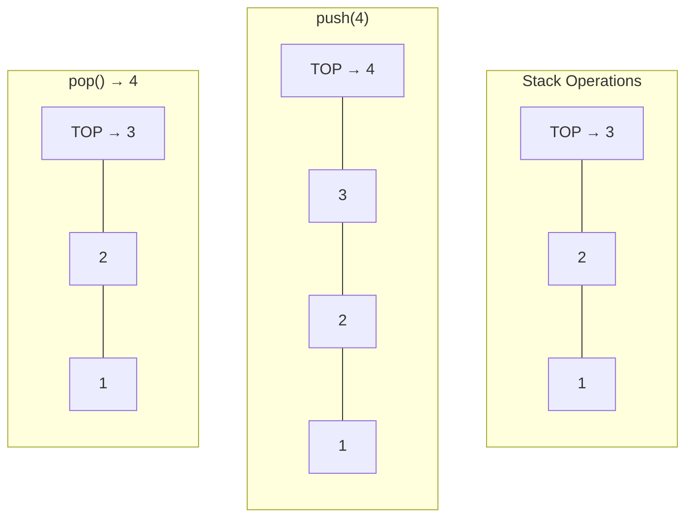
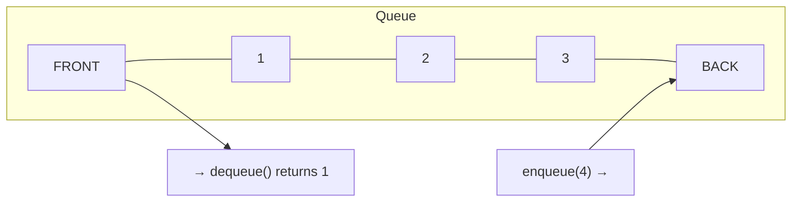
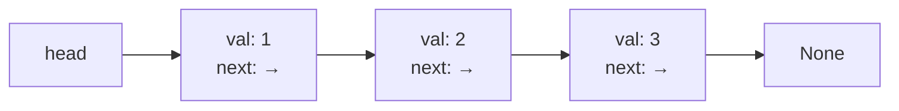
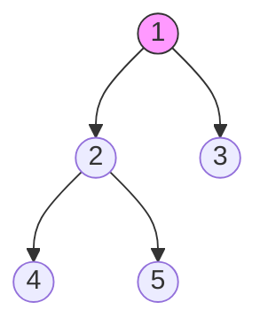
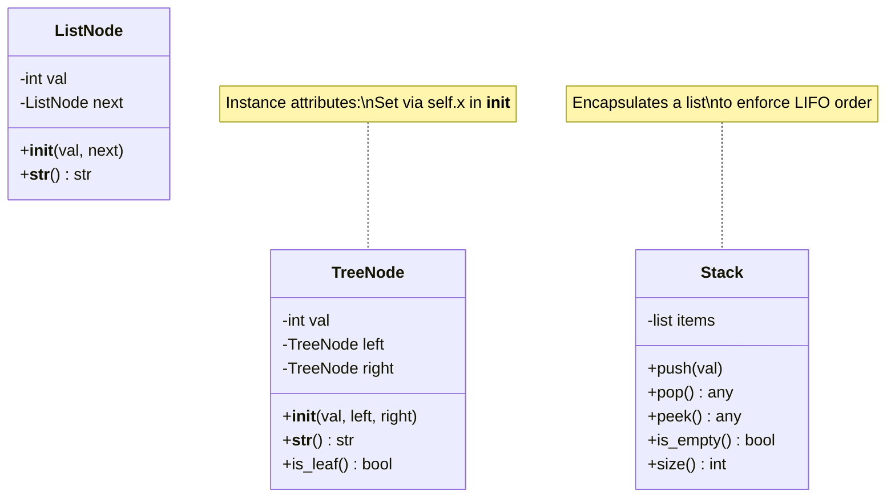
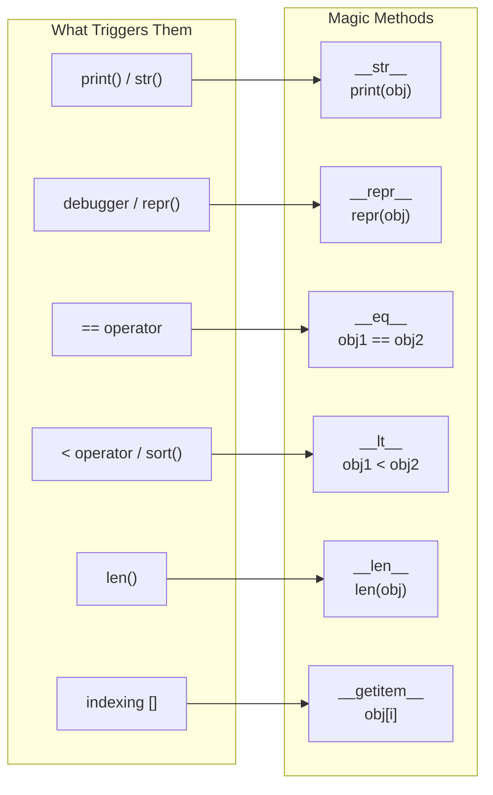
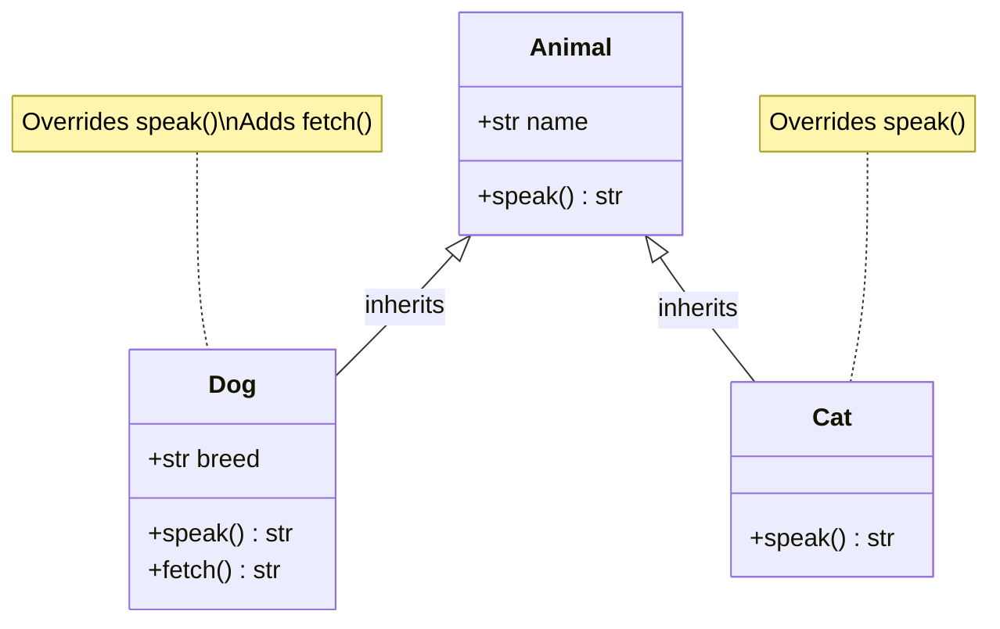

# Day 3: OOP Foundations

Master Python's object-oriented programming — the foundation for implementing every data structure in DSA.

---

## 1. DSA Building Blocks (What You'll Implement Today)

Before writing code, let's understand the four data structures you'll build using OOP. This section is **concepts only** — the Python implementation comes in the sections that follow.

### Stack (LIFO — Last In, First Out)

Think of a **stack of plates**: you can only add or remove from the **top**. The last plate placed is the first one taken off.



| Operation | What it does |
|-----------|-------------|
| `push(val)` | Add element to the top |
| `pop()` | Remove and return the top element |
| `peek()` | Look at the top element without removing |
| `is_empty()` | Check if stack has no elements |
| `size()` | Return number of elements |

**Where stacks appear:** undo/redo, browser back button, function call stack, matching parentheses, DFS traversal.

### Queue (FIFO — First In, First Out)

Think of a **line at a counter**: the first person in line is the first one served.



| Operation | What it does |
|-----------|-------------|
| `enqueue(val)` | Add element to the back |
| `dequeue()` | Remove and return the front element |
| `front()` | Look at the front element without removing |
| `is_empty()` | Check if queue has no elements |
| `size()` | Return number of elements |

**Where queues appear:** print queue, task scheduling, BFS traversal, message buffers.

### Linked List — Chain of Nodes

Think of **train cars** linked together. Each car (node) holds a value and a connector (pointer) to the next car. The last car points to nothing (`None`).



Each **node** stores two things:
- `val` — the data
- `next` — a reference to the next node (or `None` if it's the last)

**Why use linked lists?** Inserting or deleting at the head is O(1), whereas arrays need O(n) to shift elements. Linked lists are the foundation for stacks, queues, and many DSA problems.

### Binary Tree — Hierarchical Structure

Think of a **family tree** or org chart. Each person (node) can have up to two children: a left child and a right child.



Each **node** stores three things:
- `val` — the data
- `left` — reference to the left child (or `None`)
- `right` — reference to the right child (or `None`)

**Key terms:**
- **Root** — the topmost node (node 1 above)
- **Leaf** — a node with no children (nodes 3, 4, 5 above)
- **Height** — longest path from root to a leaf

**Where trees appear:** file systems, HTML DOM, database indexes, BST search (O(log n)), expression parsing.

---

## 2. Classes and Objects

A **class** is a blueprint for creating objects. An **object** is an instance of a class with its own data.



### The `__init__` Method and `self`

`__init__` is the **constructor** -- it runs automatically when you create an object. `self` refers to the specific instance being created.

```python
class ListNode:
    def __init__(self, val=0, next=None):
        self.val = val      # instance attribute
        self.next = next    # instance attribute

# Creating objects
node1 = ListNode(1)
node2 = ListNode(2, node1)
print(node2.val)   # 2
print(node2.next)  # <ListNode object>
```

### Instance vs Class Attributes

```python
class Counter:
    count = 0              # class attribute (shared by ALL instances)

    def __init__(self, name):
        self.name = name   # instance attribute (unique to each instance)
        Counter.count += 1 # modify the shared class attribute

a = Counter("alpha")
b = Counter("beta")
print(Counter.count)  # 2  (shared)
print(a.name)         # "alpha" (unique)
print(b.name)         # "beta"  (unique)
```

**Rule of thumb for DSA:** Almost always use **instance attributes** (set via `self.x` in `__init__`). Class attributes are rare in competitive coding.

---

## 3. Magic Methods (Dunder Methods)

Magic methods let your objects work with Python's built-in operators and functions.



### `__str__` and `__repr__`

```python
class ListNode:
    def __init__(self, val=0, next=None):
        self.val = val
        self.next = next

    def __str__(self):
        """Human-readable: used by print()"""
        parts = []
        curr = self
        while curr:
            parts.append(str(curr.val))
            curr = curr.next
        return " -> ".join(parts) + " -> None"

    def __repr__(self):
        """Developer-readable: used in debugger/REPL"""
        return f"ListNode({self.val})"

node = ListNode(1, ListNode(2, ListNode(3)))
print(node)       # 1 -> 2 -> 3 -> None
print(repr(node)) # ListNode(1)
```

### `__eq__` and `__lt__` (Comparison)

```python
class Point:
    def __init__(self, x, y):
        self.x = x
        self.y = y

    def __eq__(self, other):
        """Allows: point1 == point2"""
        return self.x == other.x and self.y == other.y

    def __lt__(self, other):
        """Allows: point1 < point2, and also sorting!"""
        return (self.x, self.y) < (other.x, other.y)

points = [Point(3, 1), Point(1, 5), Point(1, 2)]
points.sort()  # uses __lt__ -> sorted by x, then y
# Result: Point(1,2), Point(1,5), Point(3,1)
```

**DSA tip:** Defining `__lt__` lets you use your objects in `heapq` and `sorted()` directly.

### `__len__` and `__getitem__`

```python
class MyList:
    def __init__(self, data):
        self._data = data

    def __len__(self):
        return len(self._data)

    def __getitem__(self, index):
        return self._data[index]

ml = MyList([10, 20, 30])
print(len(ml))   # 3
print(ml[1])     # 20
```

---

## 4. Inheritance

Inheritance lets a class **reuse** code from a parent class and optionally **override** behavior.



### Single Inheritance and `super()`

```python
class Animal:
    def __init__(self, name):
        self.name = name

    def speak(self):
        return f"{self.name} makes a sound"

class Dog(Animal):
    def __init__(self, name, breed):
        super().__init__(name)  # call parent's __init__
        self.breed = breed      # add new attribute

    def speak(self):            # override parent method
        return f"{self.name} barks"

dog = Dog("Rex", "Labrador")
print(dog.speak())   # Rex barks
print(dog.name)      # Rex  (inherited from Animal)
print(dog.breed)     # Labrador
```

### Practical DSA Example: Extending a Node

```python
class TreeNode:
    def __init__(self, val=0, left=None, right=None):
        self.val = val
        self.left = left
        self.right = right

class AnnotatedTreeNode(TreeNode):
    """Adds extra metadata to a tree node."""
    def __init__(self, val=0, left=None, right=None, depth=0):
        super().__init__(val, left, right)
        self.depth = depth
```

---

## Quick Reference Cheat Sheet

```python
# --- Classes ---
class Node:
    def __init__(self, val):
        self.val = val

# --- Magic Methods ---
def __str__(self): ...    # print(obj)
def __repr__(self): ...   # repr(obj)
def __eq__(self, other): ...  # obj1 == obj2
def __lt__(self, other): ...  # obj1 < obj2, sorted(), heapq
def __len__(self): ...    # len(obj)
def __getitem__(self, i): ... # obj[i]

# --- Inheritance ---
class Child(Parent):
    def __init__(self, ...):
        super().__init__(...)
```
