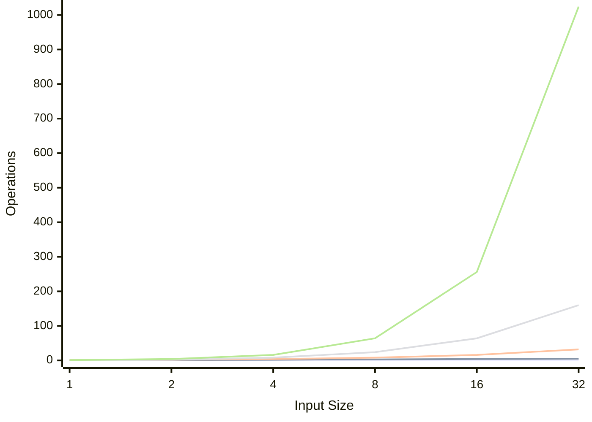
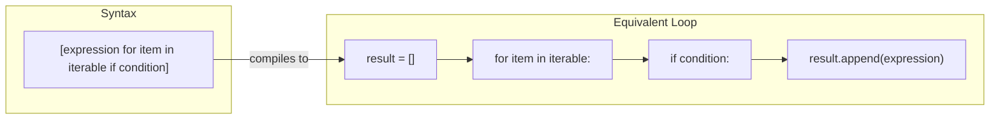

# Day 4: Pythonic Patterns & Big O

> Understand algorithm complexity and write efficient, idiomatic Python using comprehensions and generators.

---

## 1. Big O Notation

Big O describes how an algorithm's runtime or space grows as input size `n` increases.



### Growth Rates (Slowest to Fastest Growing)

| Big O | Name | Example | n=1000 |
|-------|------|---------|--------|
| O(1) | Constant | Hash lookup, array access | 1 |
| O(log n) | Logarithmic | Binary search, bisect | ~10 |
| O(n) | Linear | Single loop, linear scan | 1,000 |
| O(n log n) | Linearithmic | Merge sort, Tim sort | ~10,000 |
| O(n^2) | Quadratic | Nested loops, bubble sort | 1,000,000 |
| O(2^n) | Exponential | All subsets, naive recursion | ~10^301 |
| O(n!) | Factorial | All permutations | Way too many |

### Common Operations Complexity

| Operation | list | dict/set | deque | heapq | bisect (sorted list) |
|-----------|------|----------|-------|-------|---------------------|
| Access by index | O(1) | -- | O(n) | -- | O(1) |
| Search | O(n) | O(1) | O(n) | O(n) | O(log n) |
| Insert at end | O(1)* | O(1)* | O(1) | O(log n) | O(n) |
| Insert at front | O(n) | -- | O(1) | -- | -- |
| Delete by value | O(n) | O(1) | O(n) | O(n) | O(n) |
| Min/Max | O(n) | O(n) | O(n) | O(1)/O(n) | O(1) |
| Sort | O(n log n) | -- | -- | O(n log n) | already sorted |

*amortized

### Quick Rules for Interviews

```
n <= 10       -> O(n!) or O(2^n) is fine     (brute force)
n <= 20       -> O(2^n) is fine              (bitmask DP)
n <= 500      -> O(n^3) is fine              (triple loop)
n <= 5,000    -> O(n^2) is fine              (double loop)
n <= 100,000  -> O(n log n) is needed        (sorting, heap)
n <= 10^6     -> O(n) is needed              (single pass)
n <= 10^18    -> O(log n) is needed          (binary search, math)
```

---

## 2. List Comprehensions

List comprehensions provide a concise way to create lists. They are **faster** than equivalent for-loops and very common in DSA code.



### Basic Comprehension

```python
# Squares of 1 to 5
squares = [x**2 for x in range(1, 6)]
# [1, 4, 9, 16, 25]

# With filtering: only even squares
even_squares = [x**2 for x in range(1, 11) if x % 2 == 0]
# [4, 16, 36, 64, 100]
```

### Nested Comprehensions

```python
# Flatten a 2D matrix
matrix = [[1, 2, 3], [4, 5, 6], [7, 8, 9]]
flat = [val for row in matrix for val in row]
# [1, 2, 3, 4, 5, 6, 7, 8, 9]

# Reading order: outer loop first, inner loop second
# Equivalent to:
# for row in matrix:
#     for val in row:
#         flat.append(val)

# Transpose a matrix
transposed = [[row[i] for row in matrix] for i in range(3)]
# [[1, 4, 7], [2, 5, 8], [3, 6, 9]]
```

### Dict and Set Comprehensions

```python
# Dict comprehension: character frequency
s = "abracadabra"
freq = {ch: s.count(ch) for ch in set(s)}
# {'a': 5, 'b': 2, 'r': 2, 'c': 1, 'd': 1}

# Set comprehension: unique lengths
words = ["hello", "world", "hi", "hey"]
lengths = {len(w) for w in words}
# {2, 3, 5}
```

---

## 3. Generator Expressions

Generators produce values **lazily** -- one at a time, on demand. They use almost **no memory** regardless of size.

```python
# List comprehension: creates entire list in memory
sum_list = sum([x**2 for x in range(1_000_000)])  # ~8 MB in memory

# Generator expression: creates values one at a time
sum_gen = sum(x**2 for x in range(1_000_000))     # ~0 MB extra memory

# Both produce the same result, but the generator is memory efficient
```

### When to Use Generators

```python
# Use generator when you only need to iterate once
any(x > 100 for x in nums)          # stops at first True
all(x > 0 for x in nums)            # stops at first False
sum(len(word) for word in words)     # no intermediate list needed
max(abs(x) for x in nums)           # no intermediate list needed

# Use list comprehension when you need to:
# - Access by index
# - Iterate multiple times
# - Know the length
```

**Rule of thumb:** If you are passing the result directly into `sum()`, `any()`, `all()`, `min()`, `max()`, or `"".join()`, use a generator expression (no square brackets).

---

## Quick Reference Cheat Sheet

```python
# --- Big O Quick Rules ---
# n <= 5,000 -> O(n^2) ok | n <= 100,000 -> O(n log n) | n <= 10^6 -> O(n)

# --- List Comprehension ---
[x**2 for x in range(10) if x % 2 == 0]

# --- Dict Comprehension ---
{k: v for k, v in items if condition}

# --- Set Comprehension ---
{len(w) for w in words}

# --- Generator ---
sum(x**2 for x in range(10))  # no brackets = lazy
any(x > 0 for x in nums)       # short-circuits
```
