# Arrays & Bit Manipulation — Concepts Guide (Days 4–8)

---

## 1. What is an Array?

An array is a **contiguous block of memory** where elements of the same type are stored sequentially. Each element is accessible in O(1) time via its index because the memory address can be computed directly:

```
address(i) = base_address + i * element_size
```

```mermaid
block-beta
  columns 8
  block:header
    columns 8
    h0["Index"] h1["0"] h2["1"] h3["2"] h4["3"] h5["4"] h6["5"] h7["6"]
  end
  block:values
    columns 8
    v0["Value"] v1["10"] v2["20"] v3["30"] v4["40"] v5["50"] v6["60"] v7["70"]
  end
  block:addr
    columns 8
    a0["Addr"] a1["0x100"] a2["0x104"] a3["0x108"] a4["0x10C"] a5["0x110"] a6["0x114"] a7["0x118"]
  end
```

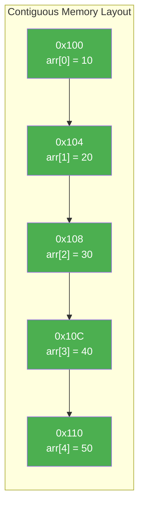

**Key properties:**

- Fixed size in most languages (not Python)
- O(1) random access by index
- Cache-friendly due to spatial locality

---

## 2. Python Lists (Dynamic Arrays)

Python `list` is a **dynamic array** — a resizable array that automatically grows when capacity is exceeded.

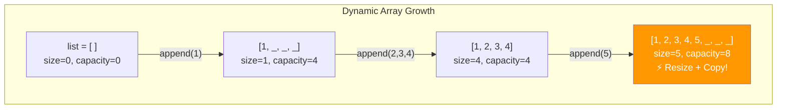

**How dynamic resizing works:**

1. When the array is full and you `append`, Python allocates a **new array ~1.125x the current size**
2. All existing elements are **copied** to the new array
3. The old array is freed

This gives **amortized O(1)** append — most appends are O(1), but occasionally one is O(n) for the copy. Averaged out, each append costs O(1).

**Internal structure:**

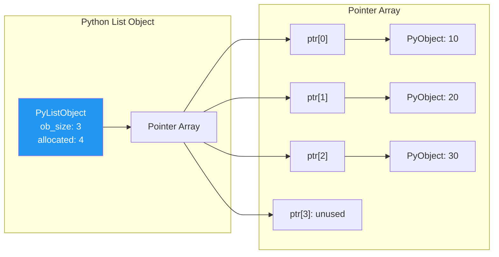

Python lists store **pointers to objects**, not raw values. This means:

- Each element is a pointer (8 bytes on 64-bit)
- The actual objects can be anywhere in memory
- Less cache-friendly than C arrays, but very flexible

---

## 3. Operations & Time Complexities

| Operation                     | Average Case | Worst Case | Notes                      |
| ----------------------------- | :----------: | :--------: | -------------------------- |
| **Access** `arr[i]`           |     O(1)     |    O(1)    | Direct index calculation   |
| **Search** (unsorted)         |     O(n)     |    O(n)    | Linear scan                |
| **Search** (sorted)           |   O(log n)   |  O(log n)  | Binary search              |
| **Append** `arr.append(x)`    |    O(1)\*    |    O(n)    | \*Amortized; resize copies |
| **Insert** `arr.insert(i, x)` |     O(n)     |    O(n)    | Shift elements right       |
| **Delete** `arr.pop(i)`       |     O(n)     |    O(n)    | Shift elements left        |
| **Delete end** `arr.pop()`    |     O(1)     |    O(1)    | No shifting needed         |
| **Sort** `arr.sort()`         |  O(n log n)  | O(n log n) | Timsort                    |
| **Slice** `arr[a:b]`          |    O(b-a)    |    O(n)    | Creates new list           |
| **in** `x in arr`             |     O(n)     |    O(n)    | Linear scan                |
| **len()**                     |     O(1)     |    O(1)    | Stored attribute           |

---

## 4. Key Patterns (Easy to Hard)

### 4.1 Two Pointers (Easy/Medium)

**When to use:** Sorted arrays, pairs/triplets, partitioning, palindromes, in-place operations.

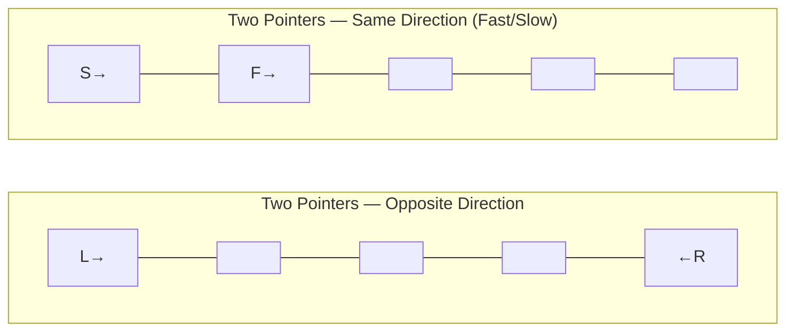

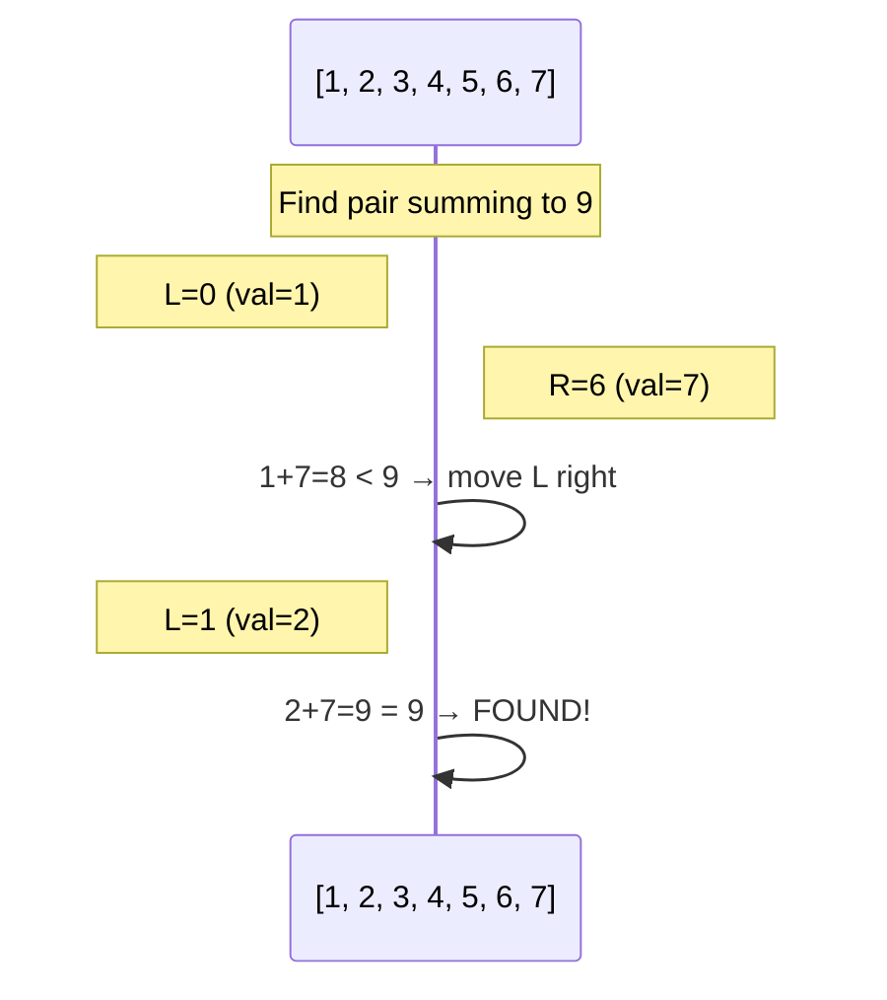

**Template — Opposite Ends:**

```python
def two_pointer_opposite(arr, target):
    left, right = 0, len(arr) - 1
    while left < right:
        current = arr[left] + arr[right]
        if current == target:
            return [left, right]
        elif current < target:
            left += 1
        else:
            right -= 1
    return []
```

**Template — Same Direction (Fast/Slow):**

```python
def two_pointer_same(arr):
    slow = 0
    for fast in range(len(arr)):
        if some_condition(arr[fast]):
            arr[slow] = arr[fast]
            slow += 1
    return slow  # new length
```

---

### 4.2 Sliding Window (Medium)

**When to use:** Subarray/substring problems, contiguous sequences, max/min in a range.

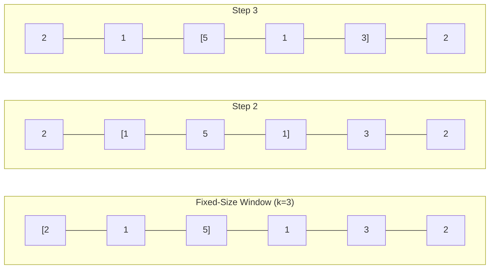

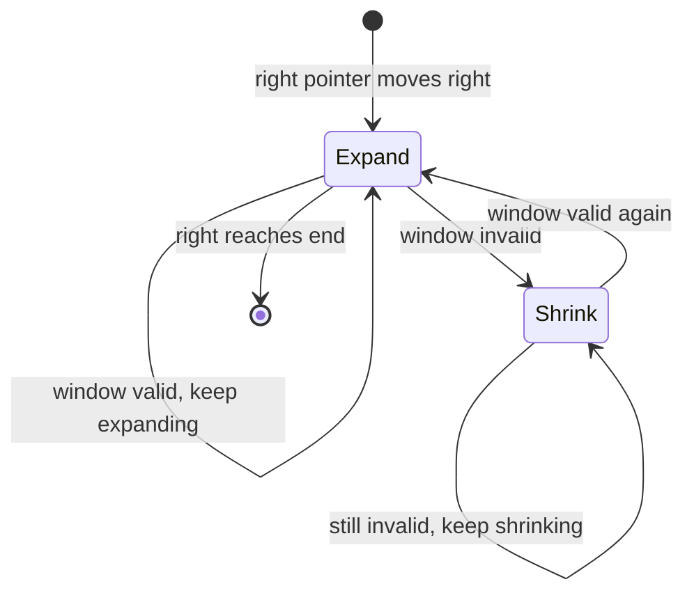

**Template — Fixed Size:**

```python
def fixed_window(arr, k):
    window_sum = sum(arr[:k])
    best = window_sum
    for i in range(k, len(arr)):
        window_sum += arr[i] - arr[i - k]  # slide: add right, remove left
        best = max(best, window_sum)
    return best
```

**Template — Variable Size:**

```python
def variable_window(arr, target):
    left = 0
    window_sum = 0
    best = float('inf')
    for right in range(len(arr)):
        window_sum += arr[right]          # expand
        while window_sum >= target:       # shrink when condition met
            best = min(best, right - left + 1)
            window_sum -= arr[left]
            left += 1
    return best
```

---

### 4.3 Kadane's Algorithm (Medium)

**When to use:** Maximum subarray sum, maximum subarray product (variant).

**Core idea:** At each position, decide: extend the current subarray or start fresh.

```
current_sum = max(nums[i], current_sum + nums[i])
```

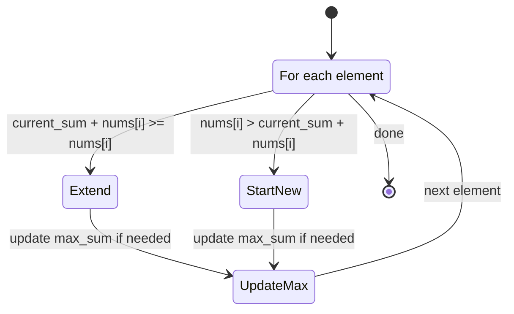

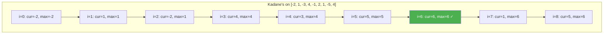

**Template:**

```python
def kadane(nums):
    max_sum = cur_sum = nums[0]
    for num in nums[1:]:
        cur_sum = max(num, cur_sum + num)
        max_sum = max(max_sum, cur_sum)
    return max_sum
```

---

### 4.4 Dutch National Flag (Medium)

**When to use:** Three-way partitioning, sort with 3 distinct values.

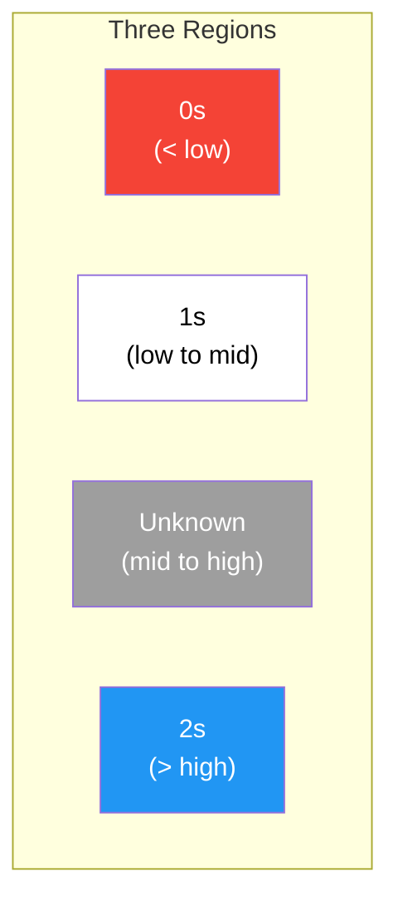

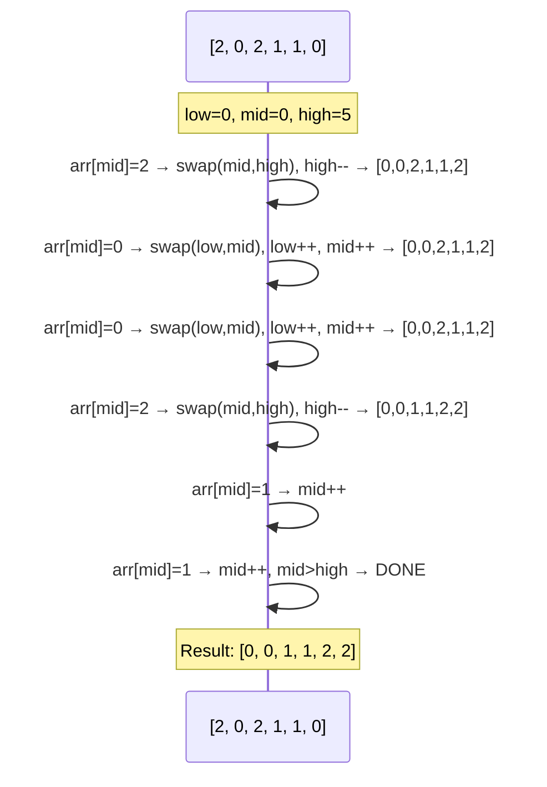

**Template:**

```python
def dutch_national_flag(arr):
    low, mid, high = 0, 0, len(arr) - 1
    while mid <= high:
        if arr[mid] == 0:
            arr[low], arr[mid] = arr[mid], arr[low]
            low += 1
            mid += 1
        elif arr[mid] == 1:
            mid += 1
        else:  # arr[mid] == 2
            arr[mid], arr[high] = arr[high], arr[mid]
            high -= 1
            # Don't increment mid — swapped value needs checking
```

---

### 4.5 Prefix Sum (Medium)

**When to use:** Range sum queries, subarray sums equal to k, cumulative operations.

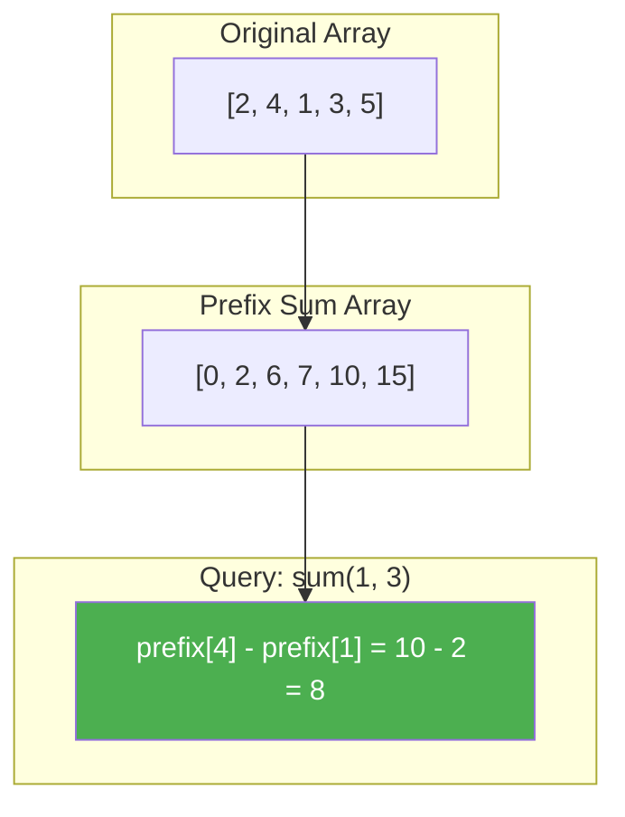

**Template:**

```python
def build_prefix_sum(arr):
    prefix = [0] * (len(arr) + 1)
    for i in range(len(arr)):
        prefix[i + 1] = prefix[i] + arr[i]
    return prefix

def range_sum(prefix, left, right):
    """Sum of arr[left..right] inclusive"""
    return prefix[right + 1] - prefix[left]
```

**Subarray sum equals k (LC 560):**

```python
def subarray_sum(nums, k):
    count = 0
    cur_sum = 0
    prefix_counts = {0: 1}  # empty prefix
    for num in nums:
        cur_sum += num
        count += prefix_counts.get(cur_sum - k, 0)
        prefix_counts[cur_sum] = prefix_counts.get(cur_sum, 0) + 1
    return count
```

---

### 4.6 Merge Intervals (Medium)

**When to use:** Overlapping intervals, scheduling, calendar conflicts.

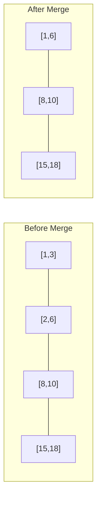

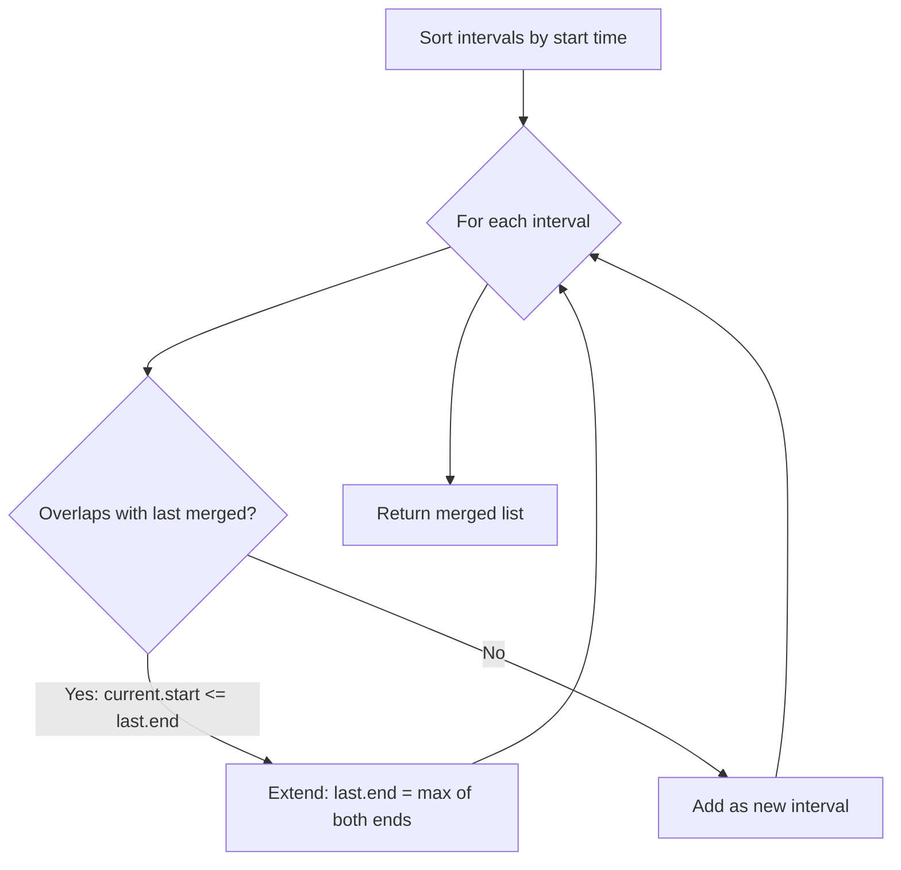

**Template:**

```python
def merge_intervals(intervals):
    intervals.sort(key=lambda x: x[0])
    merged = [intervals[0]]
    for start, end in intervals[1:]:
        if start <= merged[-1][1]:         # overlapping
            merged[-1][1] = max(merged[-1][1], end)
        else:
            merged.append([start, end])
    return merged
```

---

### 4.7 Trapping Rain Water (Hard)

**When to use:** Elevation maps, histogram problems.

**Key insight:** Water at position i = `min(max_left, max_right) - height[i]`

```mermaid
graph TD
    subgraph "Elevation Map: [0,1,0,2,1,0,1,3,2,1,2,1]"
        direction LR
        H0["0"] --- H1["█"] --- H2["0"] --- H3["██"] --- H4["█"] --- H5["0"] --- H6["█"] --- H7["███"] --- H8["██"] --- H9["█"] --- H10["██"] --- H11["█"]
    end
    subgraph "Water fills gaps (total = 6)"
        direction LR
        W0["0"] --- W1["█"] --- W2["~1~"] --- W3["██"] --- W4["█~"] --- W5["~~2~~"] --- W6["█~"] --- W7["███"] --- W8["██"] --- W9["█~"] --- W10["██"] --- W11["█"]
    end
```

**Two-Pointer Approach (O(n) time, O(1) space):**

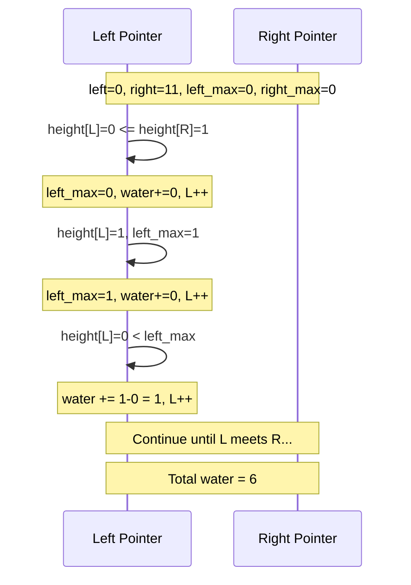

**Template — Two Pointers:**

```python
def trap(height):
    left, right = 0, len(height) - 1
    left_max = right_max = 0
    water = 0
    while left < right:
        if height[left] <= height[right]:
            if height[left] >= left_max:
                left_max = height[left]
            else:
                water += left_max - height[left]
            left += 1
        else:
            if height[right] >= right_max:
                right_max = height[right]
            else:
                water += right_max - height[right]
            right -= 1
    return water
```

---

## 5. Bit Manipulation Basics

### 5.1 Fundamental Operations

| Operator    | Symbol | Description     | Example (5=101, 3=011) |
| ----------- | :----: | --------------- | :--------------------: |
| AND         |  `&`   | Both bits 1     | `101 & 011 = 001` (1)  |
| OR          |  `\|`  | Either bit 1    | `101 \| 011 = 111` (7) |
| XOR         |  `^`   | Bits differ     | `101 ^ 011 = 110` (6)  |
| NOT         |  `~`   | Flip all bits   |  `~101 = ...010` (-6)  |
| Left Shift  |  `<<`  | Multiply by 2^k | `101 << 1 = 1010` (10) |
| Right Shift |  `>>`  | Divide by 2^k   |  `101 >> 1 = 10` (2)   |

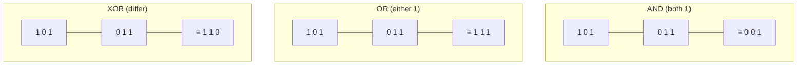

### 5.2 Common Bit Tricks

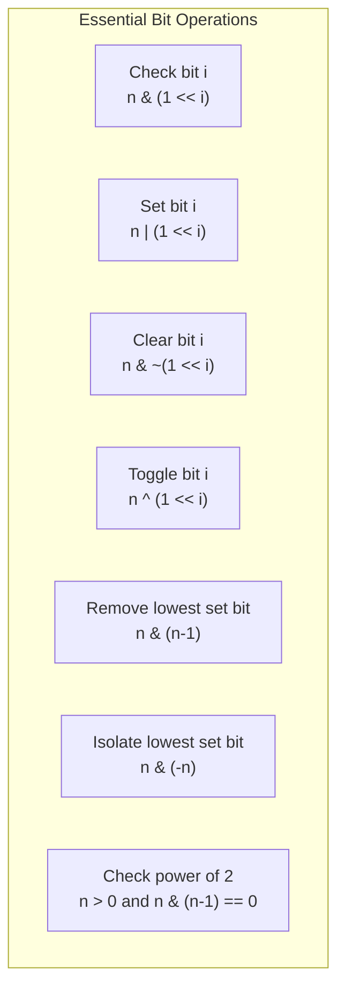

**n & (n-1) — Remove Lowest Set Bit:**

```
n   = 1 0 1 0 0  (20)
n-1 = 1 0 0 1 1  (19)
AND = 1 0 0 0 0  (16)  ← lowest set bit removed!
```

**n & (-n) — Isolate Lowest Set Bit:**

```
n    = 1 0 1 0 0  (20)
-n   = 0 1 1 0 0  (two's complement)
AND  = 0 0 1 0 0  (4)  ← only lowest set bit remains!
```

### 5.3 XOR Properties

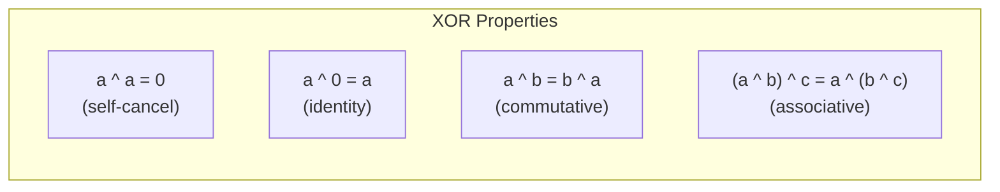

**Application — Find single number:**

```
[4, 1, 2, 1, 2]
4 ^ 1 ^ 2 ^ 1 ^ 2
= 4 ^ (1 ^ 1) ^ (2 ^ 2)
= 4 ^ 0 ^ 0
= 4
```

### 5.4 Bitmask for Subsets

For a set of n elements, each subset can be represented by an n-bit number:

```mermaid
graph TD
    subgraph "Subsets of {a, b, c} using bitmask"
        M0["000 = { }"]
        M1["001 = {c}"]
        M2["010 = {b}"]
        M3["011 = {b,c}"]
        M4["100 = {a}"]
        M5["101 = {a,c}"]
        M6["110 = {a,b}"]
        M7["111 = {a,b,c}"]
    end
```

```python
def subsets_bitmask(nums):
    n = len(nums)
    result = []
    for mask in range(1 << n):  # 0 to 2^n - 1
        subset = []
        for i in range(n):
            if mask & (1 << i):
                subset.append(nums[i])
        result.append(subset)
    return result
```

---

## 6. Which Pattern to Use?

```mermaid
flowchart TD
    START["Array / Bit Problem"] --> Q1{Involves bits/binary<br/>or powers of 2?}
    Q1 -->|Yes| BIT["Bit Manipulation<br/>XOR, AND, shifts"]
    Q1 -->|No| Q2{Sorted array or<br/>can sort?}
    Q2 -->|Yes| Q3{Finding pair/triplet<br/>with target sum?}
    Q3 -->|Yes| TP["Two Pointers<br/>(opposite ends)"]
    Q3 -->|No| Q4{Searching for<br/>a value?}
    Q4 -->|Yes| BS["Binary Search"]
    Q4 -->|No| MI{Intervals or<br/>ranges?}
    MI -->|Yes| MERGE["Merge Intervals<br/>Sort + sweep"]
    MI -->|No| TP2["Two Pointers"]
    Q2 -->|No| Q5{Contiguous subarray<br/>or substring?}
    Q5 -->|Yes| Q6{Fixed or bounded<br/>window size?}
    Q6 -->|Yes| SW["Sliding Window<br/>(fixed)"]
    Q6 -->|No| Q7{Max/min sum<br/>subarray?}
    Q7 -->|Yes| KD["Kadane's Algorithm"]
    Q7 -->|No| SWV["Sliding Window<br/>(variable)"]
    Q5 -->|No| Q8{Range sum query<br/>or cumulative?}
    Q8 -->|Yes| PS["Prefix Sum"]
    Q8 -->|No| Q9{In-place partition<br/>or reorder?}
    Q9 -->|Yes| Q10{Three categories?}
    Q10 -->|Yes| DNF["Dutch National Flag"]
    Q10 -->|No| TP3["Two Pointers<br/>(same direction)"]
    Q9 -->|No| Q11{Track min/max<br/>from both sides?}
    Q11 -->|Yes| TRAP["Two Pointers<br/>(Trapping Rain Water)"]
    Q11 -->|No| OTHER["Hash Map / Set<br/>or Brute Force"]

    style BIT fill:#9C27B0,color:#fff
    style TP fill:#2196F3,color:#fff
    style TP2 fill:#2196F3,color:#fff
    style TP3 fill:#2196F3,color:#fff
    style BS fill:#FF9800,color:#fff
    style SW fill:#4CAF50,color:#fff
    style SWV fill:#4CAF50,color:#fff
    style KD fill:#f44336,color:#fff
    style PS fill:#00BCD4,color:#fff
    style DNF fill:#795548,color:#fff
    style MERGE fill:#607D8B,color:#fff
    style TRAP fill:#E91E63,color:#fff
    style OTHER fill:#9E9E9E,color:#fff
```

---

## 7. Common Mistakes

### Off-by-One Errors

```python
# WRONG: skips last element
for i in range(len(arr) - 1):  # goes 0 to n-2
    ...

# RIGHT: includes last element
for i in range(len(arr)):      # goes 0 to n-1
    ...

# WRONG: index out of bounds
for i in range(len(arr)):
    if arr[i] == arr[i + 1]:   # fails when i = n-1
        ...

# RIGHT: stop one early
for i in range(len(arr) - 1):
    if arr[i] == arr[i + 1]:
        ...
```

### Modifying Array While Iterating

```python
# WRONG: skips elements
for i, val in enumerate(arr):
    if val == 0:
        arr.pop(i)  # indices shift!

# RIGHT: iterate backwards or use new list
for i in range(len(arr) - 1, -1, -1):
    if arr[i] == 0:
        arr.pop(i)

# BETTER: list comprehension for filtering
arr = [x for x in arr if x != 0]
```

### Integer Overflow (Python-safe, but matters in interviews)

```python
# Python handles big integers natively, but in C++/Java:
# - int: -2^31 to 2^31 - 1 (about ±2.1 billion)
# - Watch for: sum of two ints, product, bit operations

# In Python, still watch for the overflow constraint in problems:
INT_MAX = 2**31 - 1   # 2147483647
INT_MIN = -2**31      # -2147483648
```

### Common Bit Manipulation Pitfalls

```python
# WRONG: operator precedence — & has lower precedence than ==
if n & 1 == 0:    # parsed as n & (1 == 0) → n & False → 0

# RIGHT: use parentheses
if (n & 1) == 0:  # correct

# WRONG: ~ on unsigned vs signed
~5   # in Python: -6 (two's complement, infinite precision)

# Be careful with negative numbers in bit manipulation
# Python integers have arbitrary precision, no fixed bit width
```

---

## 8. Day-by-Day Schedule

```mermaid
gantt
    title Arrays & Bits Study Plan (Days 4-8)
    dateFormat X
    axisFormat Day %s

    section Day 4
    Reverse Array (Easy)           :done, d4a, 4, 4
    Two Sum (Easy)                 :done, d4b, 4, 4
    Buy/Sell Stock (Easy)          :done, d4c, 4, 4
    Find Duplicate (Easy)          :done, d4d, 4, 4
    Move Zeroes (Easy)             :done, d4e, 4, 4
    Sort Colors (Medium)           :active, d4f, 4, 4
    Kadane's Max Subarray (Medium) :active, d4g, 4, 4

    section Day 5
    Contains Duplicate (Easy)      :done, d5a, 5, 5
    Merge Intervals (Medium)       :active, d5b, 5, 5
    Next Permutation (Medium)      :active, d5c, 5, 5
    Three Sum (Medium)             :active, d5d, 5, 5
    Max Product Subarray (Medium)  :active, d5e, 5, 5
    Longest Consecutive (Medium)   :active, d5f, 5, 5

    section Day 6
    Trapping Rain Water (Hard)     :crit, d6a, 6, 6
    Median Two Sorted (Hard)       :crit, d6b, 6, 6
    Max Profit Two Tx (Hard)       :crit, d6c, 6, 6

    section Day 7
    Single Number (Easy)           :done, d7a, 7, 7
    Count Set Bits (Easy)          :done, d7b, 7, 7
    Power of Two (Easy)            :done, d7c, 7, 7
    Hamming Distance (Easy)        :done, d7d, 7, 7
    Power Set / Subsets (Medium)   :active, d7e, 7, 7
    Divide Integers (Medium)       :active, d7f, 7, 7

    section Day 8
    Jump Game II (Medium)          :active, d8a, 8, 8
    Review & Revisit Weak Areas    :d8b, 8, 8
```

### Day 4 — Array Basics + First Medium Problems

| #   | Problem                              | Difficulty | Pattern             |  Time  |
| --- | ------------------------------------ | :--------: | ------------------- | :----: |
| 1   | Reverse String (LC 344)              |    Easy    | Two Pointers        | 5 min  |
| 2   | Two Sum (LC 1)                       |    Easy    | Hash Map            | 10 min |
| 3   | Best Time to Buy/Sell Stock (LC 121) |    Easy    | Greedy              | 10 min |
| 4   | Find the Duplicate Number (LC 287)   |    Easy    | Floyd's Cycle       | 15 min |
| 5   | Move Zeroes (LC 283)                 |    Easy    | Two Pointers        | 10 min |
| 6   | Sort Colors (LC 75)                  |   Medium   | Dutch National Flag | 15 min |
| 7   | Maximum Subarray (LC 53)             |   Medium   | Kadane's            | 15 min |

### Day 5 — Medium Array Problems

| #   | Problem                               | Difficulty | Pattern            |  Time  |
| --- | ------------------------------------- | :--------: | ------------------ | :----: |
| 1   | Contains Duplicate (LC 217)           |    Easy    | Hash Set           | 5 min  |
| 2   | Merge Intervals (LC 56)               |   Medium   | Sort + Merge       | 15 min |
| 3   | Next Permutation (LC 31)              |   Medium   | Array Manipulation | 20 min |
| 4   | 3Sum (LC 15)                          |   Medium   | Two Pointers       | 20 min |
| 5   | Maximum Product Subarray (LC 152)     |   Medium   | Kadane's Variant   | 15 min |
| 6   | Longest Consecutive Sequence (LC 128) |   Medium   | Hash Set           | 15 min |

### Day 6 — Hard Array Problems

| #   | Problem                                  | Difficulty | Pattern            |  Time  |
| --- | ---------------------------------------- | :--------: | ------------------ | :----: |
| 1   | Trapping Rain Water (LC 42)              |    Hard    | Two Pointers       | 30 min |
| 2   | Median of Two Sorted Arrays (LC 4)       |    Hard    | Binary Search      | 40 min |
| 3   | Best Time to Buy/Sell Stock III (LC 123) |    Hard    | State Machine / DP | 30 min |

### Day 7 — Bit Manipulation

| #   | Problem                     | Difficulty | Pattern      |  Time  |
| --- | --------------------------- | :--------: | ------------ | :----: |
| 1   | Single Number (LC 136)      |    Easy    | XOR          | 5 min  |
| 2   | Number of 1 Bits (LC 191)   |    Easy    | n & (n-1)    | 10 min |
| 3   | Power of Two (LC 231)       |    Easy    | Bit Check    | 5 min  |
| 4   | Hamming Distance (LC 461)   |    Easy    | XOR + Count  | 10 min |
| 5   | Subsets (LC 78)             |   Medium   | Bitmask      | 15 min |
| 6   | Divide Two Integers (LC 29) |   Medium   | Bit Shifting | 25 min |

### Day 8 — Jump Game + Review

| #   | Problem                                        | Difficulty | Pattern |  Time  |
| --- | ---------------------------------------------- | :--------: | ------- | :----: |
| 1   | Jump Game II (LC 45)                           |   Medium   | Greedy  | 20 min |
| 2   | Review weak problems from Days 4-7             |     —      | —       | 60 min |
| 3   | Re-solve 2-3 problems without looking at notes |     —      | —       | 30 min |
