# Strings - Comprehensive Concepts Guide (Days 9-11)

## 1. What are Strings?

A **string** is an **immutable** sequence of characters. In Python, once a string is created, it cannot be modified in place. Any operation that appears to modify a string actually creates a **new** string object.

```python
s = "hello"
# s[0] = 'H'  # TypeError! Strings are immutable
s = "H" + s[1:]  # Creates a NEW string "Hello"
```

### Memory Representation

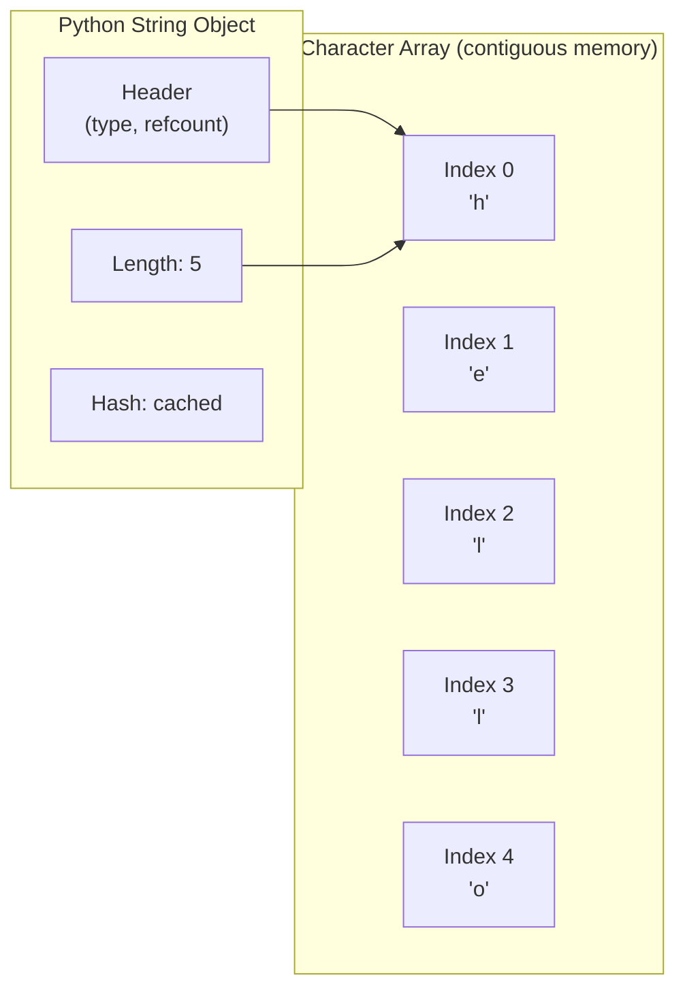

### Immutability in Action

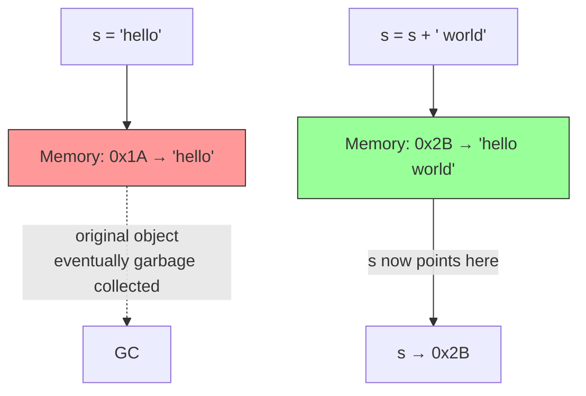

---

## 2. String Operations in Python

### Indexing & Slicing

```python
s = "abcdef"
s[0]      # 'a'       - first character
s[-1]     # 'f'       - last character
s[1:4]    # 'bcd'     - slice from index 1 to 3
s[::-1]   # 'fedcba'  - reverse the string
s[::2]    # 'ace'     - every other character
```

### Common Methods

```python
s = "Hello World"

# Case
s.lower()          # "hello world"
s.upper()          # "HELLO WORLD"
s.swapcase()       # "hELLO wORLD"

# Search
s.find("World")    # 6  (returns -1 if not found)
s.index("World")   # 6  (raises ValueError if not found)
s.count("l")       # 3

# Check
s.isalpha()        # False (has space)
s.isalnum()        # False
s.isdigit()        # False
s.startswith("He") # True
s.endswith("ld")   # True

# Transform
s.strip()          # removes leading/trailing whitespace
s.split()          # ["Hello", "World"]
s.replace("World", "Python")  # "Hello Python"
" ".join(["a","b","c"])        # "a b c"

# Character checks
c = 'A'
c.isalpha()        # True
c.isdigit()        # False
ord(c)             # 65
chr(65)            # 'A'
```

### Time Complexity Table

| Operation | Time Complexity | Notes |
|-----------|:-:|-------|
| `s[i]` (index) | O(1) | Direct access |
| `s[i:j]` (slice) | O(j - i) | Creates new string |
| `len(s)` | O(1) | Stored as attribute |
| `s + t` (concatenation) | O(len(s) + len(t)) | Creates new string |
| `s.find(t)` / `s.index(t)` | O(n * m) | n = len(s), m = len(t) |
| `s.replace(old, new)` | O(n) | Scans entire string |
| `s.split()` | O(n) | Scans entire string |
| `"".join(list)` | O(total chars) | Efficient concatenation |
| `s in t` (substring check) | O(n * m) | Worst case |
| `s == t` | O(n) | Character-by-character |
| `sorted(s)` | O(n log n) | Returns list of chars |
| `s.count(c)` | O(n) | Scans entire string |
| `s[::-1]` (reverse) | O(n) | Creates new string |

> **Key insight**: Use `"".join(list)` instead of repeated `+=` in loops. Repeated concatenation in a loop is O(n^2) because each `+=` creates a new string.

---

## 3. Key Patterns (Easy to Hard)

### Pattern 1: Basic String Manipulation (Easy)

Core operations: reversing, checking palindromes, comparing characters.

```python
# Reverse a string
s[::-1]

# Check palindrome
s == s[::-1]

# Check anagram (same character frequencies)
sorted(s) == sorted(t)
# or
Counter(s) == Counter(t)
```

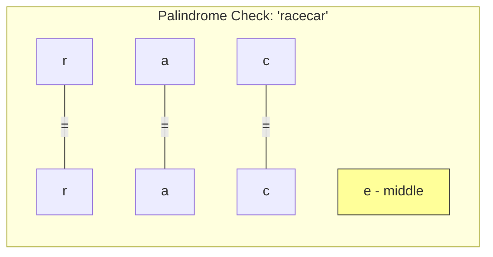

---

### Pattern 2: Sliding Window (Medium)

Used for substring problems where you need to find an optimal window. Two variants:

#### Fixed-Size Window
The window size is known. Slide it across the string.

```python
# Example: find max sum of k consecutive characters (by ord value)
def fixed_window(s, k):
    window_sum = sum(ord(c) for c in s[:k])
    max_sum = window_sum
    for i in range(k, len(s)):
        window_sum += ord(s[i]) - ord(s[i - k])  # slide: add right, remove left
        max_sum = max(max_sum, window_sum)
    return max_sum
```

#### Variable-Size Window
Expand the right pointer; shrink the left pointer when a condition is violated.

```python
# Template: longest substring with some property
def variable_window(s):
    left = 0
    best = 0
    state = {}  # track window state (e.g., char counts)
    for right in range(len(s)):
        # expand: add s[right] to state
        while window_is_invalid(state):
            # shrink: remove s[left] from state
            left += 1
        best = max(best, right - left + 1)
    return best
```

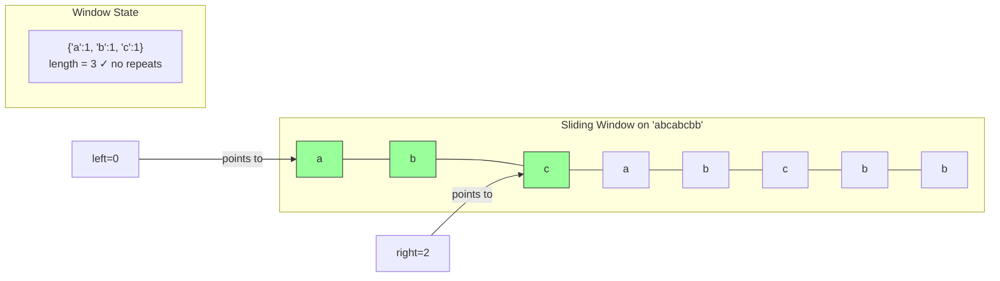

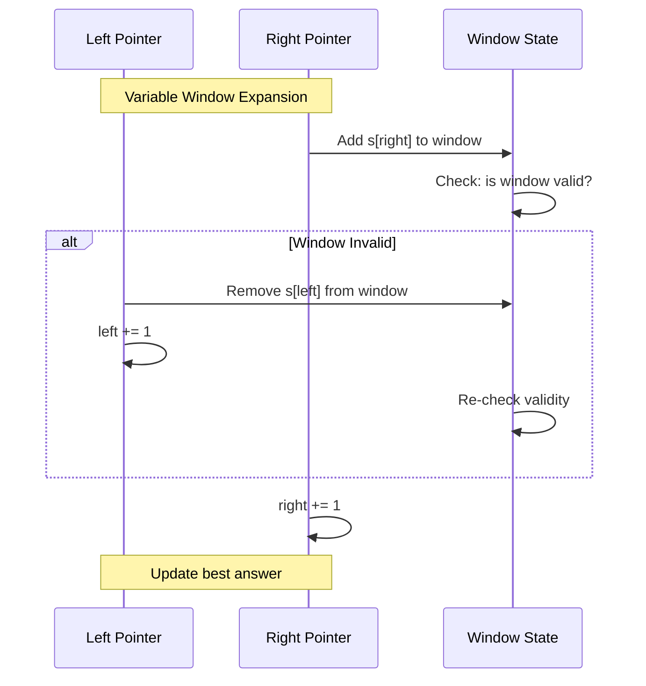

---

### Pattern 3: Two Pointers (Medium)

Move two pointers from opposite ends (or same direction) to solve problems in O(n).

```python
# Valid Palindrome (skip non-alphanumeric)
def is_palindrome(s):
    left, right = 0, len(s) - 1
    while left < right:
        while left < right and not s[left].isalnum():
            left += 1
        while left < right and not s[right].isalnum():
            right -= 1
        if s[left].lower() != s[right].lower():
            return False
        left += 1
        right -= 1
    return True
```

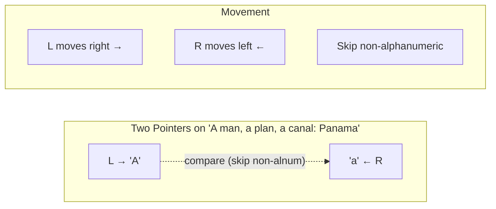

---

### Pattern 4: Hash Map for Frequency (Medium)

Count character occurrences to solve anagram, frequency, and grouping problems.

```python
from collections import Counter

# Group anagrams: same sorted string = same group
def group_anagrams(strs):
    groups = {}
    for s in strs:
        key = tuple(sorted(s))  # or use character count tuple
        groups.setdefault(key, []).append(s)
    return list(groups.values())
```

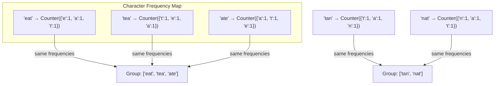

---

### Pattern 5: KMP / Pattern Matching (Hard)

The **Knuth-Morris-Pratt** algorithm finds a pattern in a text in O(n + m) time by precomputing a **failure function** (also called the LPS / prefix function).

#### Failure Function (LPS Array)

The LPS (Longest Proper Prefix which is also Suffix) array tells us: if a mismatch happens at position `i`, where should we resume matching?

```python
def build_lps(pattern):
    lps = [0] * len(pattern)
    length = 0  # length of previous longest prefix-suffix
    i = 1
    while i < len(pattern):
        if pattern[i] == pattern[length]:
            length += 1
            lps[i] = length
            i += 1
        else:
            if length != 0:
                length = lps[length - 1]  # fall back
            else:
                lps[i] = 0
                i += 1
    return lps
```

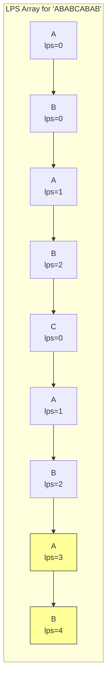

#### KMP Search

```python
def kmp_search(text, pattern):
    lps = build_lps(pattern)
    i = j = 0  # i for text, j for pattern
    results = []
    while i < len(text):
        if text[i] == pattern[j]:
            i += 1
            j += 1
        if j == len(pattern):
            results.append(i - j)  # match found
            j = lps[j - 1]
        elif i < len(text) and text[i] != pattern[j]:
            if j != 0:
                j = lps[j - 1]
            else:
                i += 1
    return results
```

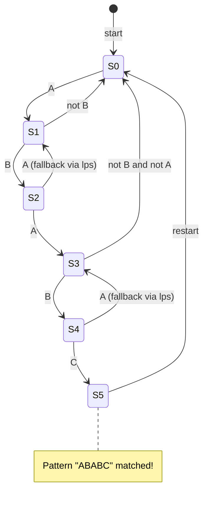

---

### Pattern 6: Rabin-Karp (Hard)

Uses a **rolling hash** to find pattern matches. Average case O(n + m), worst case O(n * m).

#### Rolling Hash Concept

```
hash("abc") = a*p^2 + b*p^1 + c*p^0   (p = prime base, mod large prime)

To slide window from "abc" to "bcd":
  hash("bcd") = (hash("abc") - a*p^2) * p + d
```

```python
def rabin_karp(text, pattern):
    n, m = len(text), len(pattern)
    if m > n:
        return []

    base, mod = 31, 10**9 + 7
    # Compute hash of pattern and first window
    p_hash = t_hash = 0
    power = 1
    for i in range(m - 1, -1, -1):
        p_hash = (p_hash + ord(pattern[i]) * power) % mod
        t_hash = (t_hash + ord(text[i]) * power) % mod
        if i > 0:
            power = (power * base) % mod

    results = []
    for i in range(n - m + 1):
        if p_hash == t_hash and text[i:i+m] == pattern:  # verify on hash match
            results.append(i)
        if i < n - m:
            # Roll the hash: remove leftmost, add new rightmost
            t_hash = (t_hash - ord(text[i]) * power) % mod
            t_hash = (t_hash * base + ord(text[i + m])) % mod
    return results
```

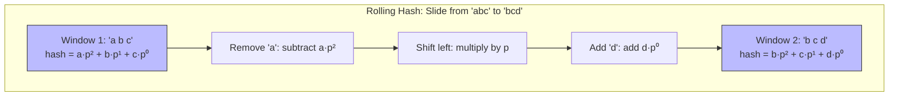

---

## 4. Which Pattern to Use?

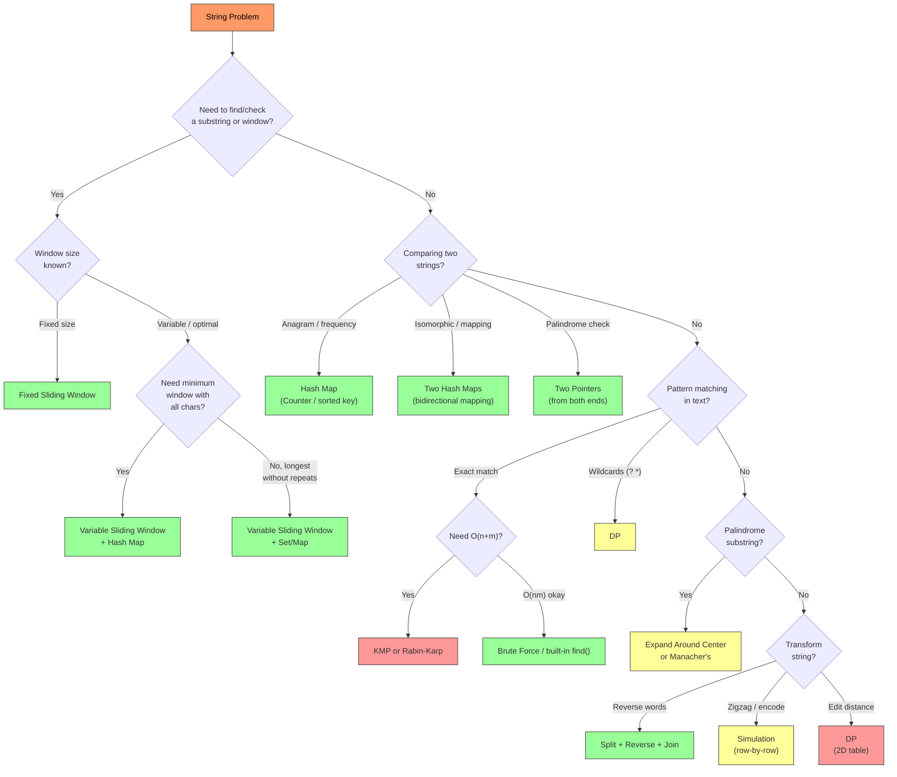

---

## 5. Common Mistakes

### Mistake 1: Forgetting String Immutability

```python
# WRONG: Trying to modify a string in place
s = "hello"
s[0] = 'H'  # TypeError!

# CORRECT: Create a new string
s = 'H' + s[1:]
# or convert to list
chars = list(s)
chars[0] = 'H'
s = ''.join(chars)
```

### Mistake 2: O(n^2) Concatenation in a Loop

```python
# WRONG: O(n^2) because each += creates a new string
result = ""
for char in some_list:
    result += char  # copies entire result each time!

# CORRECT: O(n) using join
result = "".join(some_list)
```

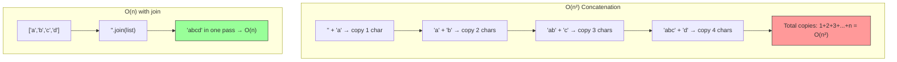

### Mistake 3: Not Handling Edge Cases

- Empty string `""`
- Single character `"a"`
- All same characters `"aaaa"`
- Special characters and spaces
- Unicode characters (usually not in interviews, but be aware)

### Mistake 4: Using `sorted()` When a Counter Suffices

```python
# Slower for anagram check: O(n log n)
sorted(s) == sorted(t)

# Faster: O(n)
Counter(s) == Counter(t)
```

### Mistake 5: Off-by-One in Sliding Window

Always be clear about whether your window boundaries are **inclusive** or **exclusive**. The window `[left, right]` has length `right - left + 1`, while `[left, right)` has length `right - left`.

---

## 6. Day-by-Day Schedule

### Day 9 - Easy + Introduction

| # | Problem | Pattern | Time |
|---|---------|---------|------|
| 1 | Valid Palindrome (LC 125) | Two Pointers | 15 min |
| 2 | Valid Anagram (LC 242) | Hash Map | 15 min |
| 3 | Reverse Words in a String (LC 151) | String Manipulation | 15 min |
| 4 | First Unique Character (LC 387) | Hash Map | 15 min |
| 5 | Isomorphic Strings (LC 205) | Hash Map | 15 min |
| 6 | Longest Common Prefix (LC 14) | String Comparison | 15 min |

**Goal**: Get comfortable with basic string operations, two pointers, and frequency counting. Read the concepts guide before starting.

---

### Day 10 - Medium Problems

| # | Problem | Pattern | Time |
|---|---------|---------|------|
| 1 | Longest Substring Without Repeating Characters (LC 3) | Sliding Window | 25 min |
| 2 | Group Anagrams (LC 49) | Hash Map | 20 min |
| 3 | Longest Palindromic Substring (LC 5) | Expand Around Center | 25 min |
| 4 | String to Integer (LC 8) | String Parsing | 20 min |
| 5 | Count and Say (LC 38) | Simulation | 15 min |
| 6 | Repeated Substring Pattern (LC 459) | String Pattern | 20 min |

**Goal**: Master sliding window and hash map patterns. These are the most frequently asked string problems.

---

### Day 11 - Hard + Mixed Review

| # | Problem | Pattern | Time |
|---|---------|---------|------|
| 1 | Zigzag Conversion (LC 6) | Simulation | 20 min |
| 2 | Multiply Strings (LC 43) | Math/String | 25 min |
| 3 | Minimum Window Substring (LC 76) | Sliding Window | 30 min |
| 4 | Edit Distance (LC 72) | DP | 30 min |
| 5 | Palindrome Pairs (LC 336) | Trie/Hash | 35 min |
| 6 | Wildcard Matching (LC 44) | DP | 30 min |

**Goal**: Tackle hard problems. Focus on understanding the DP table construction for edit distance and wildcard matching. The minimum window substring is a must-know sliding window problem.

---

### Summary of Patterns by Difficulty

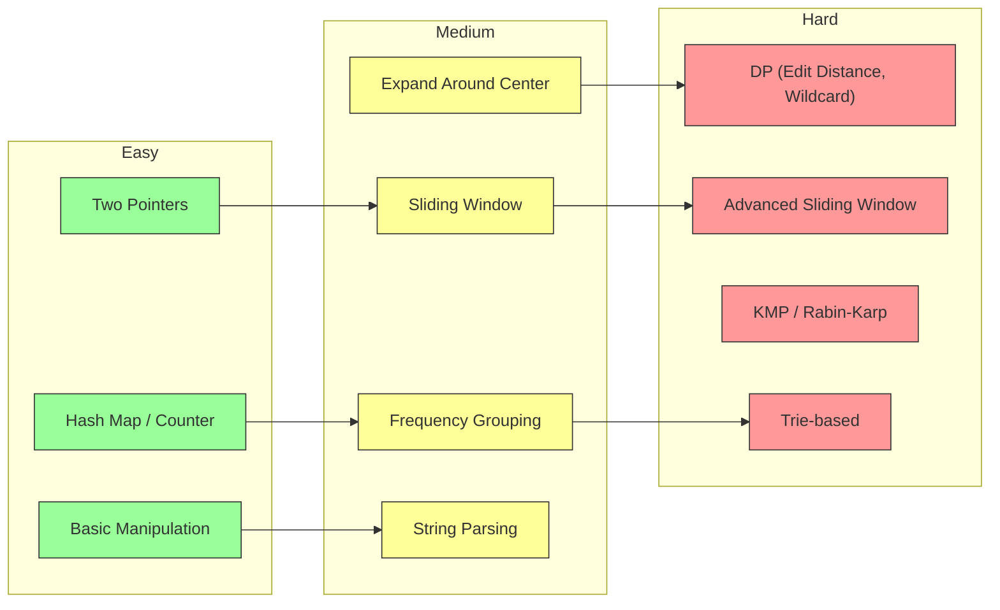
