# Searching and Sorting - Days 12-14

## Table of Contents

1. [Linear vs Binary Search](#1-linear-vs-binary-search)
2. [Binary Search Deep Dive](#2-binary-search-deep-dive)
3. [Sorting Algorithms](#3-sorting-algorithms)
4. [Key Patterns](#4-key-patterns)
5. [Which Pattern to Use?](#5-which-pattern-to-use)
6. [Common Mistakes](#6-common-mistakes)
7. [Day Schedule](#7-day-schedule)

---

## 1. Linear vs Binary Search

### Comparison at a Glance

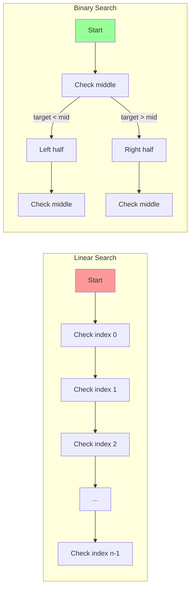

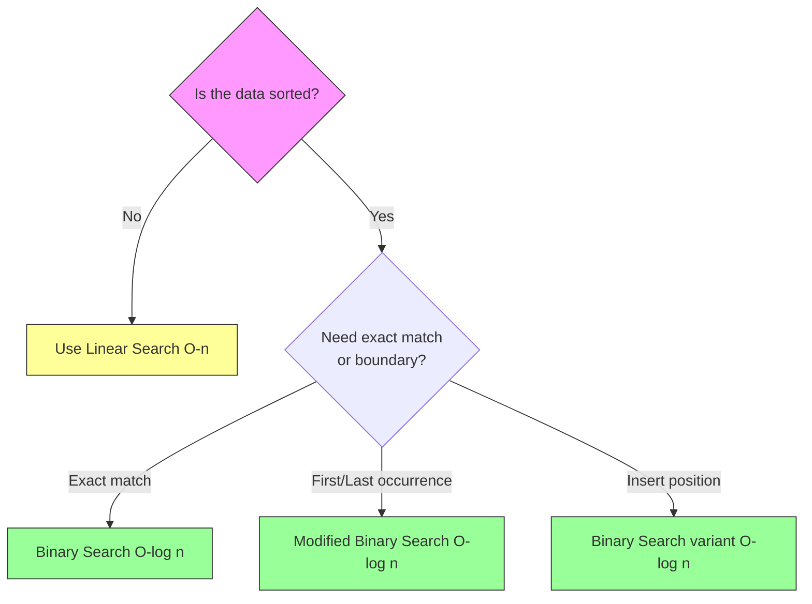

### When to Use Each

| Feature | Linear Search | Binary Search |
|---------|--------------|---------------|
| **Time** | O(n) | O(log n) |
| **Prerequisite** | None | Data must be sorted |
| **Data structure** | Array, linked list, anything | Array (random access needed) |
| **Best for** | Small/unsorted data | Large sorted data |
| **Implementation** | Trivial | Tricky (off-by-one errors) |

### Linear Search - Simple Code

```python
def linear_search(arr, target):
    for i, val in enumerate(arr):
        if val == target:
            return i
    return -1
```

### Binary Search - Simple Code

```python
def binary_search(arr, target):
    left, right = 0, len(arr) - 1
    while left <= right:
        mid = left + (right - left) // 2
        if arr[mid] == target:
            return mid
        elif arr[mid] < target:
            left = mid + 1
        else:
            right = mid - 1
    return -1
```

---

## 2. Binary Search Deep Dive

### Decision Tree Visualization

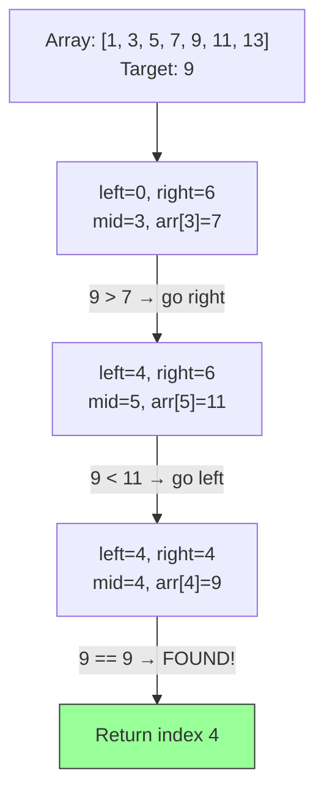

### Template Variants

There are two main binary search templates. Understanding the difference prevents bugs.

#### Variant 1: `left <= right` (Closed interval `[left, right]`)

```python
def binary_search_v1(arr, target):
    """Search space: [left, right] - both inclusive."""
    left, right = 0, len(arr) - 1  # right = last valid index
    while left <= right:            # loop while interval is non-empty
        mid = left + (right - left) // 2
        if arr[mid] == target:
            return mid
        elif arr[mid] < target:
            left = mid + 1          # shrink to [mid+1, right]
        else:
            right = mid - 1         # shrink to [left, mid-1]
    return -1
```

#### Variant 2: `left < right` (Find boundary / first true)

```python
def find_left_boundary(arr, target):
    """Find first index where arr[index] >= target."""
    left, right = 0, len(arr)      # right = beyond last index
    while left < right:             # loop while interval has > 1 element
        mid = left + (right - left) // 2
        if arr[mid] < target:
            left = mid + 1          # mid is too small
        else:
            right = mid             # mid could be answer, keep it
    return left                     # left == right == answer
```

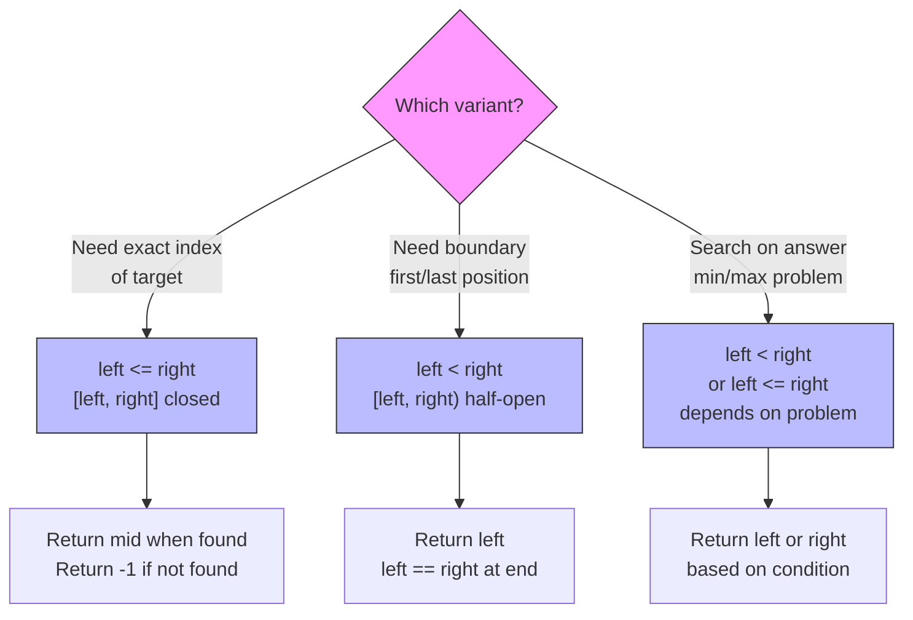

### Finding Boundaries

```python
def find_first_occurrence(arr, target):
    """Find the first index of target in sorted array."""
    left, right = 0, len(arr) - 1
    result = -1
    while left <= right:
        mid = left + (right - left) // 2
        if arr[mid] == target:
            result = mid        # record answer
            right = mid - 1     # keep searching left
        elif arr[mid] < target:
            left = mid + 1
        else:
            right = mid - 1
    return result

def find_last_occurrence(arr, target):
    """Find the last index of target in sorted array."""
    left, right = 0, len(arr) - 1
    result = -1
    while left <= right:
        mid = left + (right - left) // 2
        if arr[mid] == target:
            result = mid        # record answer
            left = mid + 1      # keep searching right
        elif arr[mid] < target:
            left = mid + 1
        else:
            right = mid - 1
    return result
```

---

## 3. Sorting Algorithms

### Comparison Chart

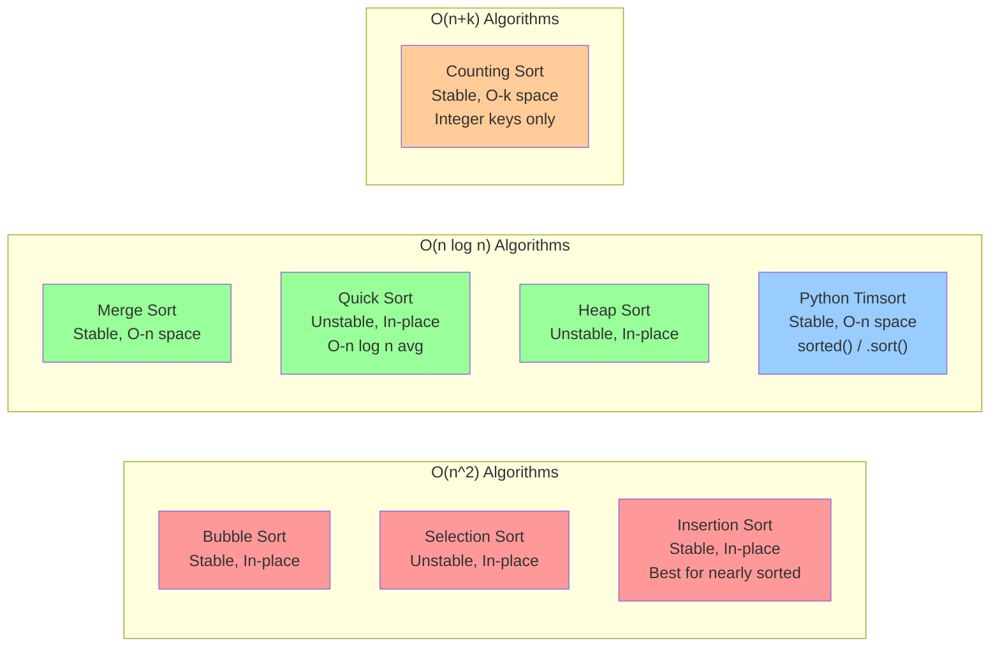

### Full Comparison Table

| Algorithm | Best | Average | Worst | Space | Stable | In-Place | Notes |
|-----------|------|---------|-------|-------|--------|----------|-------|
| Bubble | O(n) | O(n^2) | O(n^2) | O(1) | Yes | Yes | Good for detecting sorted |
| Selection | O(n^2) | O(n^2) | O(n^2) | O(1) | No | Yes | Minimum swaps |
| Insertion | O(n) | O(n^2) | O(n^2) | O(1) | Yes | Yes | Best for nearly sorted / small n |
| Merge | O(n log n) | O(n log n) | O(n log n) | O(n) | Yes | No | Guaranteed performance |
| Quick | O(n log n) | O(n log n) | O(n^2) | O(log n) | No | Yes | Fastest in practice |
| Heap | O(n log n) | O(n log n) | O(n log n) | O(1) | No | Yes | Good worst case, cache-unfriendly |
| Counting | O(n+k) | O(n+k) | O(n+k) | O(k) | Yes | No | Only for integer keys in [0, k) |
| Timsort | O(n) | O(n log n) | O(n log n) | O(n) | Yes | No | Python built-in, hybrid algorithm |

### Bubble Sort

Repeatedly swap adjacent elements if they are in the wrong order.

```python
def bubble_sort(arr):
    n = len(arr)
    for i in range(n):
        swapped = False
        for j in range(n - 1 - i):
            if arr[j] > arr[j + 1]:
                arr[j], arr[j + 1] = arr[j + 1], arr[j]
                swapped = True
        if not swapped:  # early termination if already sorted
            break
    return arr
```

### Selection Sort

Find the minimum element and place it at the beginning.

```python
def selection_sort(arr):
    n = len(arr)
    for i in range(n):
        min_idx = i
        for j in range(i + 1, n):
            if arr[j] < arr[min_idx]:
                min_idx = j
        arr[i], arr[min_idx] = arr[min_idx], arr[i]
    return arr
```

### Insertion Sort

Build sorted portion one element at a time (like sorting playing cards).

```python
def insertion_sort(arr):
    for i in range(1, len(arr)):
        key = arr[i]
        j = i - 1
        while j >= 0 and arr[j] > key:
            arr[j + 1] = arr[j]
            j -= 1
        arr[j + 1] = key
    return arr
```

### Merge Sort (Divide and Conquer)

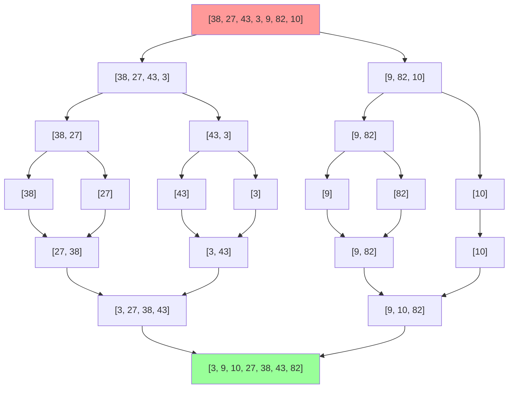

```python
def merge_sort(arr):
    if len(arr) <= 1:
        return arr

    mid = len(arr) // 2
    left = merge_sort(arr[:mid])
    right = merge_sort(arr[mid:])

    return merge(left, right)

def merge(left, right):
    result = []
    i = j = 0
    while i < len(left) and j < len(right):
        if left[i] <= right[j]:
            result.append(left[i])
            i += 1
        else:
            result.append(right[j])
            j += 1
    result.extend(left[i:])
    result.extend(right[j:])
    return result
```

### Quick Sort (Partition-based)

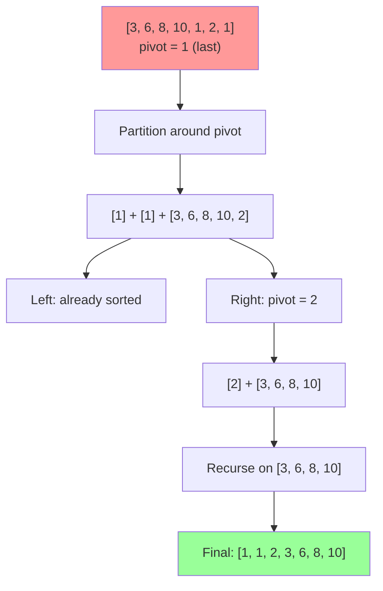

```python
def quick_sort(arr):
    if len(arr) <= 1:
        return arr

    pivot = arr[len(arr) // 2]
    left = [x for x in arr if x < pivot]
    middle = [x for x in arr if x == pivot]
    right = [x for x in arr if x > pivot]

    return quick_sort(left) + middle + quick_sort(right)
```

**In-place Quick Sort (interview version):**

```python
def quick_sort_inplace(arr, low=0, high=None):
    if high is None:
        high = len(arr) - 1
    if low < high:
        pivot_idx = partition(arr, low, high)
        quick_sort_inplace(arr, low, pivot_idx - 1)
        quick_sort_inplace(arr, pivot_idx + 1, high)

def partition(arr, low, high):
    pivot = arr[high]
    i = low - 1
    for j in range(low, high):
        if arr[j] <= pivot:
            i += 1
            arr[i], arr[j] = arr[j], arr[i]
    arr[i + 1], arr[high] = arr[high], arr[i + 1]
    return i + 1
```

### Heap Sort

```python
def heap_sort(arr):
    import heapq
    heapq.heapify(arr)          # O(n) - build min-heap
    return [heapq.heappop(arr) for _ in range(len(arr))]

# Manual implementation (max-heap, in-place):
def heap_sort_manual(arr):
    n = len(arr)

    def heapify(arr, n, i):
        largest = i
        left, right = 2 * i + 1, 2 * i + 2
        if left < n and arr[left] > arr[largest]:
            largest = left
        if right < n and arr[right] > arr[largest]:
            largest = right
        if largest != i:
            arr[i], arr[largest] = arr[largest], arr[i]
            heapify(arr, n, largest)

    # Build max-heap
    for i in range(n // 2 - 1, -1, -1):
        heapify(arr, n, i)
    # Extract elements one by one
    for i in range(n - 1, 0, -1):
        arr[0], arr[i] = arr[i], arr[0]
        heapify(arr, i, 0)
    return arr
```

### Counting Sort

```python
def counting_sort(arr):
    if not arr:
        return arr
    max_val = max(arr)
    min_val = min(arr)
    range_size = max_val - min_val + 1

    count = [0] * range_size
    output = [0] * len(arr)

    for num in arr:
        count[num - min_val] += 1

    for i in range(1, range_size):
        count[i] += count[i - 1]

    for num in reversed(arr):       # reversed for stability
        output[count[num - min_val] - 1] = num
        count[num - min_val] -= 1

    return output
```

### Python's Built-in: Timsort

```python
# Timsort: hybrid of merge sort and insertion sort
# Used by sorted() and list.sort()

arr = [3, 1, 4, 1, 5, 9]

sorted_arr = sorted(arr)           # returns NEW sorted list, original unchanged
arr.sort()                         # sorts IN-PLACE, returns None

# Custom sorting with key functions
words = ["banana", "apple", "cherry"]
sorted(words, key=len)             # ['apple', 'banana', 'cherry']
sorted(words, key=lambda x: x[-1]) # sort by last character

# Sort by multiple criteria
students = [("Alice", 85), ("Bob", 92), ("Charlie", 85)]
sorted(students, key=lambda x: (-x[1], x[0]))
# [('Bob', 92), ('Alice', 85), ('Charlie', 85)]

# functools.cmp_to_key for complex comparisons
from functools import cmp_to_key
def compare(a, b):
    # return negative if a < b, zero if a == b, positive if a > b
    return a - b
sorted(arr, key=cmp_to_key(compare))
```

---

## 4. Key Patterns

### Pattern 1: Standard Binary Search (Easy)

> **When**: Sorted array, find exact target.

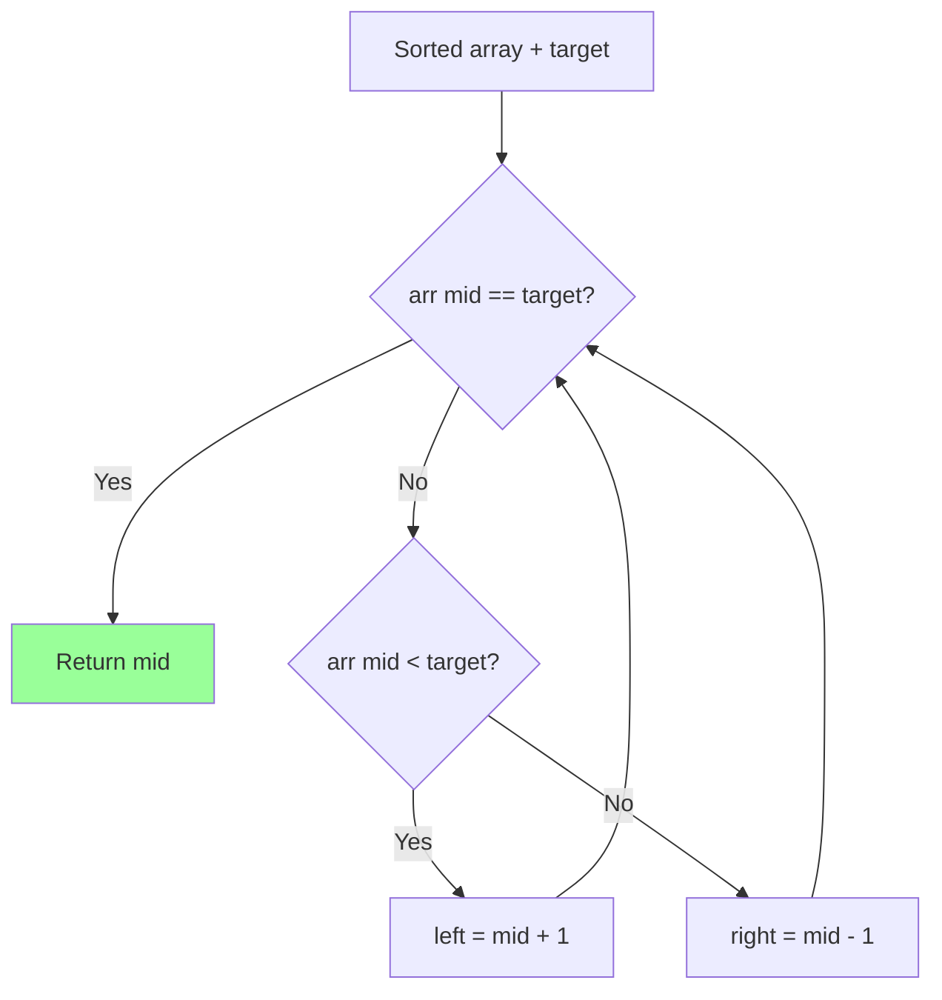

**Problems**: LC 704, LC 35, LC 278, LC 69

### Pattern 2: Binary Search on Answer (Medium)

> **When**: Find minimum/maximum value that satisfies a condition. The answer has a monotonic property (if X works, then X+1 also works, or vice versa).

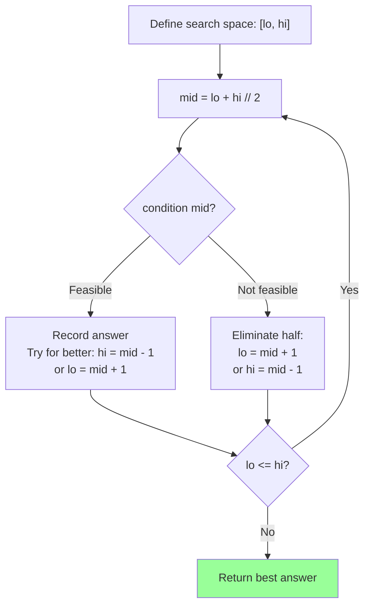

```python
def binary_search_on_answer(lo, hi):
    """Template for binary search on answer space."""
    result = -1
    while lo <= hi:
        mid = lo + (hi - lo) // 2
        if is_feasible(mid):
            result = mid        # mid works, try for better
            hi = mid - 1        # minimize: search left
            # lo = mid + 1      # maximize: search right
        else:
            lo = mid + 1        # not feasible, need larger
            # hi = mid - 1      # not feasible, need smaller
    return result
```

**Problems**: Aggressive Cows, LC 875 (Koko Eating Bananas), LC 1011

### Pattern 3: Merge Sort Applications (Medium)

> **When**: Problems that need to count relationships between elements during sorting (inversions, smaller elements after self).

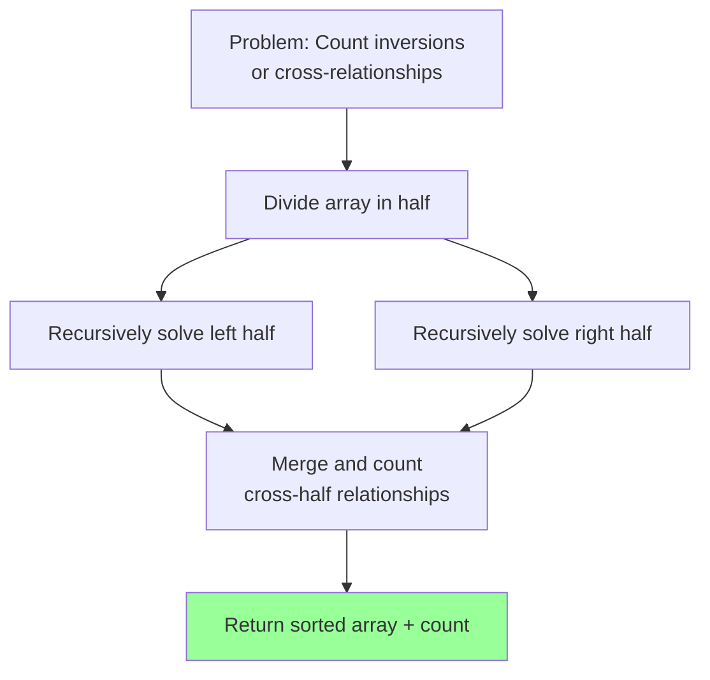

```python
def merge_sort_with_count(arr):
    """Count inversions while merge sorting."""
    if len(arr) <= 1:
        return arr, 0

    mid = len(arr) // 2
    left, left_count = merge_sort_with_count(arr[:mid])
    right, right_count = merge_sort_with_count(arr[mid:])

    merged = []
    inversions = left_count + right_count
    i = j = 0

    while i < len(left) and j < len(right):
        if left[i] <= right[j]:
            merged.append(left[i])
            i += 1
        else:
            merged.append(right[j])
            inversions += len(left) - i  # all remaining in left are > right[j]
            j += 1

    merged.extend(left[i:])
    merged.extend(right[j:])
    return merged, inversions
```

**Problems**: Count Inversions, LC 315 (Count of Smaller Numbers After Self)

### Pattern 4: Quick Select (Medium)

> **When**: Find kth smallest/largest element in O(n) average time.

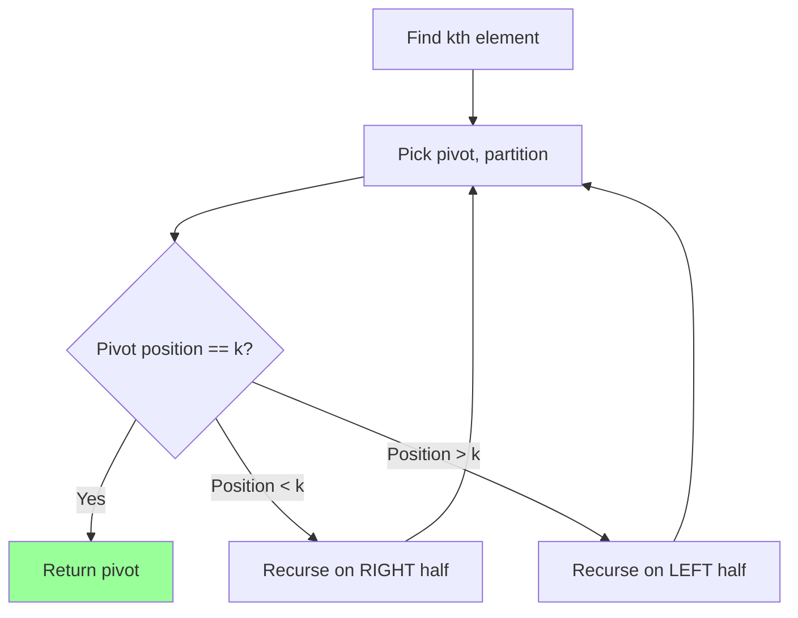

```python
import random

def quick_select(arr, k):
    """Find kth smallest element (0-indexed). Average O(n)."""
    if len(arr) == 1:
        return arr[0]

    pivot = random.choice(arr)
    left = [x for x in arr if x < pivot]
    middle = [x for x in arr if x == pivot]
    right = [x for x in arr if x > pivot]

    if k < len(left):
        return quick_select(left, k)
    elif k < len(left) + len(middle):
        return pivot
    else:
        return quick_select(right, k - len(left) - len(middle))
```

**Problems**: LC 215 (Kth Largest Element)

### Pattern 5: Custom Comparators (Medium)

> **When**: Sorting with non-trivial ordering rules.

```python
from functools import cmp_to_key

# Example: Largest Number (LC 179)
def largest_number(nums):
    nums_str = list(map(str, nums))

    def compare(a, b):
        if a + b > b + a:
            return -1   # a should come first
        elif a + b < b + a:
            return 1    # b should come first
        return 0

    nums_str.sort(key=cmp_to_key(compare))
    result = "".join(nums_str)
    return "0" if result[0] == "0" else result
```

**Problems**: LC 179, LC 451, LC 1356

---

## 5. Which Pattern to Use?

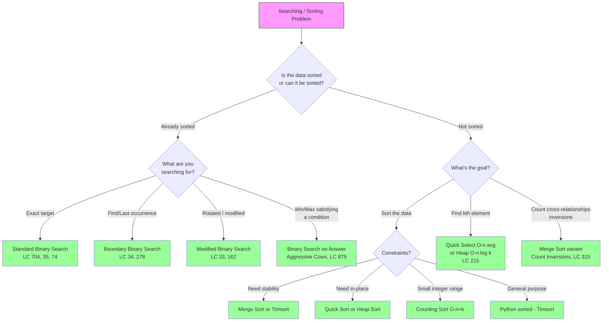

### Quick Reference Decision Table

| Clue in Problem | Pattern | Example |
|-----------------|---------|---------|
| "sorted array" + "find target" | Standard binary search | LC 704 |
| "sorted" + "first/last position" | Boundary binary search | LC 34 |
| "rotated sorted array" | Modified binary search | LC 33 |
| "minimum maximum" or "maximum minimum" | Binary search on answer | Aggressive Cows |
| "kth largest/smallest" | Quick select or heap | LC 215 |
| "count inversions" | Merge sort variant | Count Inversions |
| "sort by custom rule" | Custom comparator | LC 179, 451 |
| "sorted matrix" | 2D binary search | LC 74 |
| "two sorted arrays" + "median" | Binary search on partition | LC 4 |

---

## 6. Common Mistakes

### Mistake 1: Off-by-One Errors in Binary Search

```python
# WRONG: infinite loop when left == right
left, right = 0, len(arr) - 1
while left < right:          # BUG: misses the case left == right
    mid = (left + right) // 2
    if arr[mid] == target:
        return mid
    elif arr[mid] < target:
        left = mid + 1
    else:
        right = mid - 1
# Fix: use left <= right for standard binary search

# WRONG: infinite loop with left < right variant
while left < right:
    mid = (left + right) // 2
    if condition(mid):
        right = mid           # correct: mid could be answer
    else:
        left = mid            # BUG: when right = left + 1, mid = left, infinite loop
# Fix: use left = mid + 1
```

### Mistake 2: Integer Overflow in Mid Calculation

```python
# Potential issue in other languages (not Python, but good habit):
mid = (left + right) // 2        # can overflow in C++/Java

# Safe version:
mid = left + (right - left) // 2  # always safe
```

### Mistake 3: Forgetting Edge Cases

```python
# Empty array
if not arr:
    return -1

# Single element
# Array of all same elements
# Target smaller than all elements
# Target larger than all elements
```

### Mistake 4: Wrong Search Space in Binary Search on Answer

```python
# Make sure lo and hi cover ALL possible answers
# lo should be the minimum possible answer
# hi should be the maximum possible answer

# Example: minimum distance between cows
lo = 0                    # minimum possible distance
hi = max(positions) - min(positions)  # maximum possible distance
```

### Mistake 5: Unstable Sort When Stability Matters

```python
# If relative order of equal elements matters, use a STABLE sort
# Python's sorted() and list.sort() are stable (Timsort)
# Quick sort and heap sort are NOT stable

# To make an unstable sort stable, include original index as tiebreaker:
indexed = [(val, i) for i, val in enumerate(arr)]
indexed.sort(key=lambda x: (x[0], x[1]))
```

---

## 7. Day Schedule

### Day 12: Binary Search Fundamentals (Easy + Medium)

| Order | Problem | Difficulty | Key Concept |
|-------|---------|------------|-------------|
| 1 | LC 704 - Binary Search | Easy | Standard template |
| 2 | LC 278 - First Bad Version | Easy | Binary search boundary |
| 3 | LC 69 - Sqrt(x) | Easy | Binary search on answer |
| 4 | LC 35 - Search Insert Position | Easy | Boundary finding |
| 5 | LC 167 - Two Sum II (Sorted) | Easy | Two pointers on sorted |
| 6 | LC 88 - Merge Sorted Array | Easy | Two pointer merge |

**Goal**: Master the two binary search templates. Solve all 6 problems.

### Day 13: Sorting Problems + Advanced Binary Search (Medium)

| Order | Problem | Difficulty | Key Concept |
|-------|---------|------------|-------------|
| 1 | LC 33 - Search in Rotated Sorted Array | Medium | Modified binary search |
| 2 | LC 162 - Find Peak Element | Medium | Binary search on unsorted |
| 3 | LC 215 - Kth Largest Element | Medium | Quick select / heap |
| 4 | LC 451 - Sort Characters by Frequency | Medium | Hash map + sort |
| 5 | LC 34 - Find First and Last Position | Medium | Boundary binary search |
| 6 | LC 74 - Search a 2D Matrix | Medium | Flattened binary search |

**Goal**: Solve 4-6 medium problems. Focus on identifying the correct binary search variant.

### Day 14: Hard Problems + Review

| Order | Problem | Difficulty | Key Concept |
|-------|---------|------------|-------------|
| 1 | Count Inversions | Medium | Merge sort application |
| 2 | Aggressive Cows | Medium | Binary search on answer |
| 3 | LC 4 - Median of Two Sorted Arrays | Hard | Binary search on partition |
| 4 | LC 632 - Smallest Range | Hard | Heap + sliding window |
| 5 | LC 315 - Count Smaller After Self | Hard | Merge sort / BIT |
| 6 | LC 354 - Russian Doll Envelopes | Hard | Sort + LIS |

**Goal**: Attempt the hard problems. Review any Day 12-13 problems you struggled with. Solidify binary search and sorting pattern recognition.
