# Matrix (2D Array) - Days 15-16

## 1. What is a Matrix?

A **matrix** is a 2D array organized in rows and columns. In Python, we represent it as a list of lists. Elements are accessed by `matrix[row][col]`.

### Row-Major Order

Elements are stored row by row in memory:

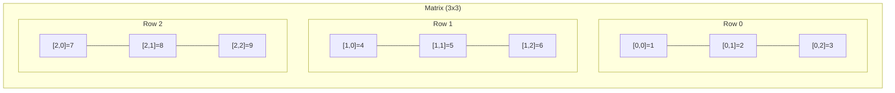

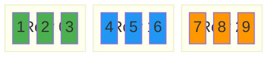

**Key dimensions:**
- `rows = len(matrix)`
- `cols = len(matrix[0])`
- Total elements = rows * cols

---

## 2. Matrix Operations in Python

### Using Nested Lists

```python
# Create a 3x3 matrix
matrix = [
    [1, 2, 3],
    [4, 5, 6],
    [7, 8, 9]
]

# Access element at row 1, col 2
val = matrix[1][2]  # 6

# Get dimensions
rows = len(matrix)       # 3
cols = len(matrix[0])    # 3

# Iterate all elements
for r in range(rows):
    for c in range(cols):
        print(matrix[r][c], end=" ")
    print()
```

### Common Initialization Patterns

```python
# WRONG - all rows share same reference!
bad = [[0] * 3] * 3

# CORRECT - each row is independent
good = [[0] * 3 for _ in range(3)]

# Initialize m x n matrix
m, n = 4, 3
grid = [[0] * n for _ in range(m)]
```

### Accessing Rows and Columns

```python
matrix = [[1,2,3],[4,5,6],[7,8,9]]

# Get row i (easy)
row = matrix[1]  # [4, 5, 6]

# Get column j (need list comprehension)
col = [matrix[r][2] for r in range(len(matrix))]  # [3, 6, 9]

# Get diagonal (top-left to bottom-right)
diag = [matrix[i][i] for i in range(len(matrix))]  # [1, 5, 9]

# Get anti-diagonal
n = len(matrix)
anti = [matrix[i][n-1-i] for i in range(n)]  # [3, 5, 7]
```

### 4-Directional Movement

```python
# The 4 neighbors of (r, c)
directions = [(0, 1), (0, -1), (1, 0), (-1, 0)]

for dr, dc in directions:
    nr, nc = r + dr, c + dc
    if 0 <= nr < rows and 0 <= nc < cols:
        # (nr, nc) is a valid neighbor
        pass
```

---

## 3. Key Patterns

---

### Pattern 1: Spiral Traversal

Traverse the matrix in a spiral (clockwise) order by maintaining four boundaries: top, bottom, left, right. Shrink them inward after processing each edge.

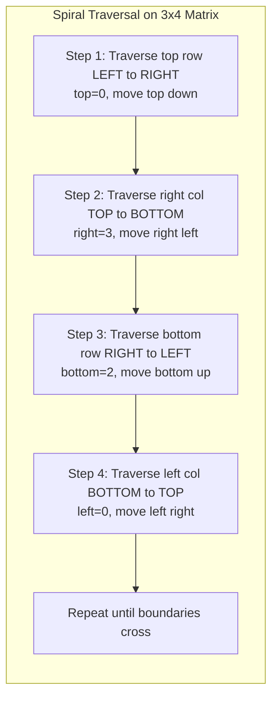

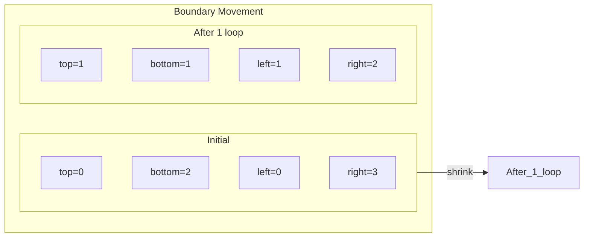

**Template:**
```python
def spiral_order(matrix):
    result = []
    top, bottom = 0, len(matrix) - 1
    left, right = 0, len(matrix[0]) - 1

    while top <= bottom and left <= right:
        # go right across top row
        for c in range(left, right + 1):
            result.append(matrix[top][c])
        top += 1

        # go down along right col
        for r in range(top, bottom + 1):
            result.append(matrix[r][right])
        right -= 1

        # go left across bottom row (if still valid)
        if top <= bottom:
            for c in range(right, left - 1, -1):
                result.append(matrix[bottom][c])
            bottom -= 1

        # go up along left col (if still valid)
        if left <= right:
            for r in range(bottom, top - 1, -1):
                result.append(matrix[r][left])
            left += 1

    return result
```

**When to use:** Any problem asking for spiral, layer-by-layer, or onion-peel traversal.

---

### Pattern 2: Diagonal Traversal

Traverse elements along diagonals. Two main types:
- **Primary diagonals** (top-left to bottom-right): `row - col` is constant
- **Anti-diagonals** (top-right to bottom-left): `row + col` is constant

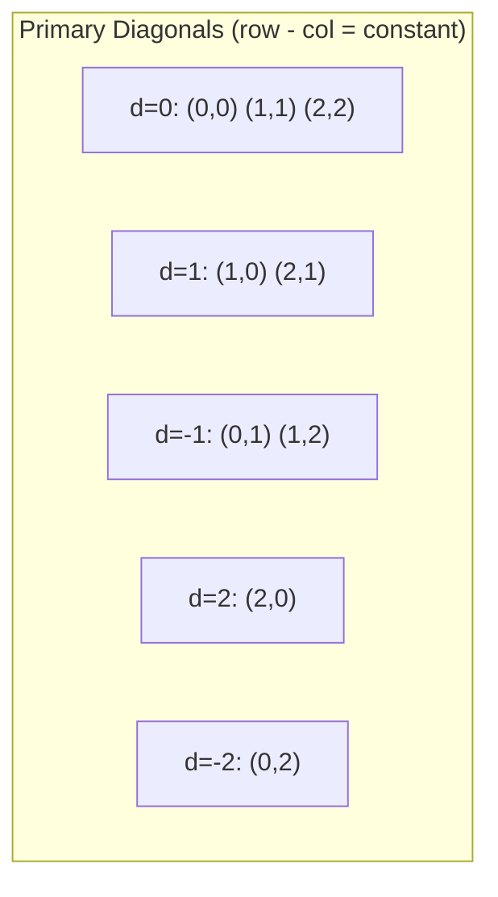

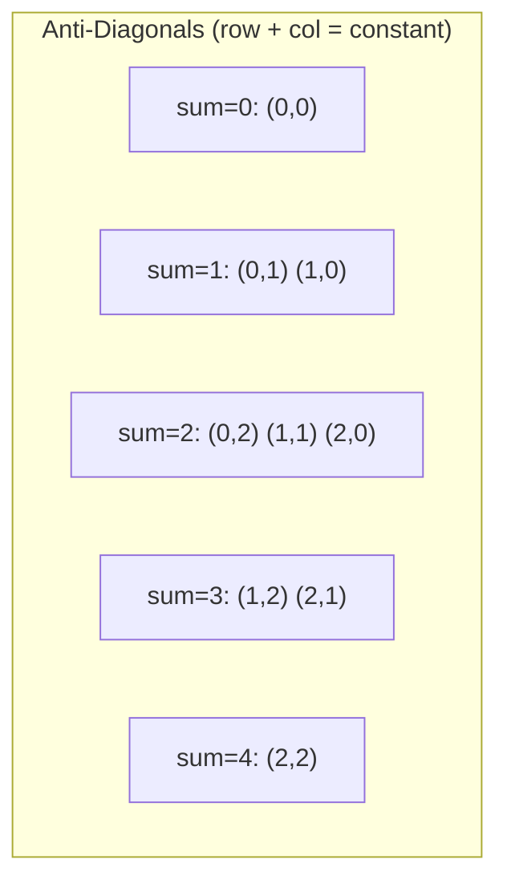

**Template:**
```python
from collections import defaultdict

def diagonal_traverse(matrix):
    diags = defaultdict(list)
    for r in range(len(matrix)):
        for c in range(len(matrix[0])):
            diags[r + c].append(matrix[r][c])  # anti-diagonal grouping

    result = []
    for key in sorted(diags):
        if key % 2 == 0:
            result.extend(diags[key][::-1])  # reverse even diagonals
        else:
            result.extend(diags[key])
    return result
```

**When to use:** Diagonal print, zigzag traversal, or when elements on same diagonal share a property.

---

### Pattern 3: Staircase Search (Search in Sorted Matrix)

For a matrix where each row and column is sorted in ascending order, start from the **top-right corner** (or bottom-left). At each step, eliminate an entire row or column.

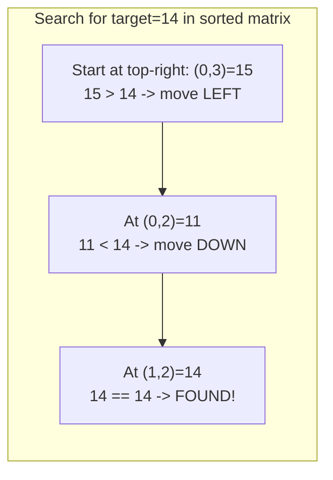

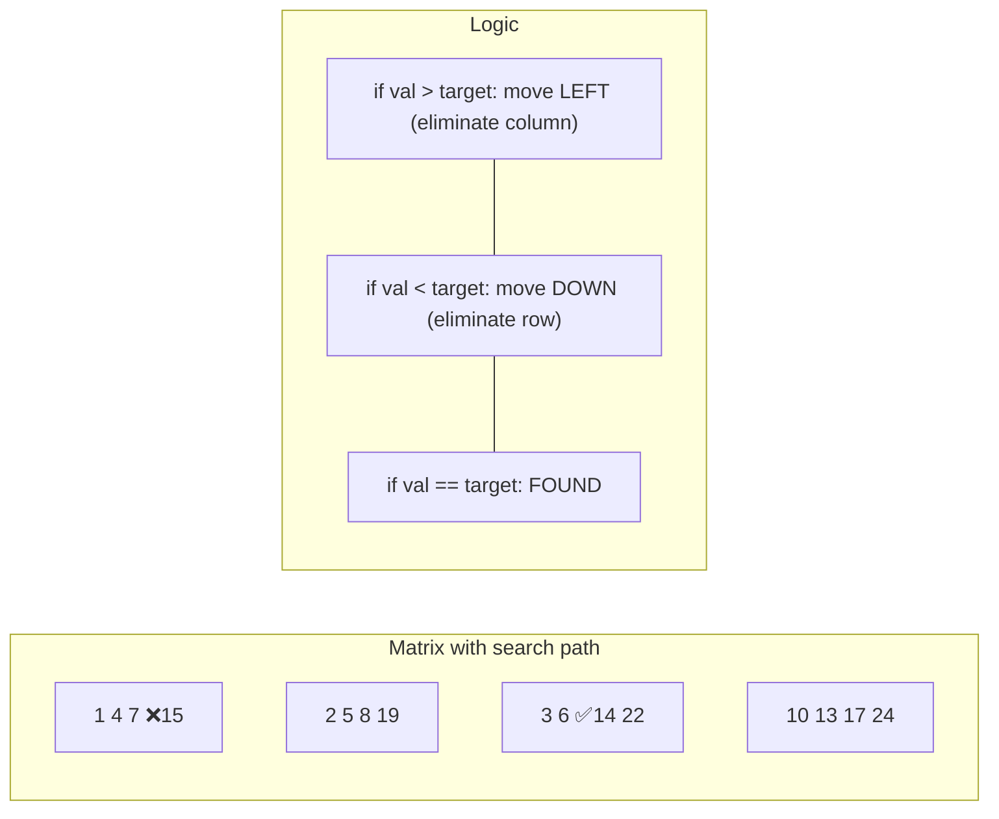

**Template:**
```python
def search_matrix(matrix, target):
    if not matrix:
        return False
    rows, cols = len(matrix), len(matrix[0])
    r, c = 0, cols - 1  # start top-right

    while r < rows and c >= 0:
        if matrix[r][c] == target:
            return True
        elif matrix[r][c] > target:
            c -= 1  # eliminate column
        else:
            r += 1  # eliminate row

    return False
```

**Time: O(m + n)** -- much better than O(m*n) brute force!

**When to use:** Matrix is sorted row-wise AND column-wise, search / count problems.

---

### Pattern 4: In-place Modification

Modify the matrix without extra space. Common tricks:
- **Use first row/col as markers** (Set Matrix Zeroes)
- **Transpose + Reverse** (Rotate Image)
- **Swap in layers** (Rotate by rings)

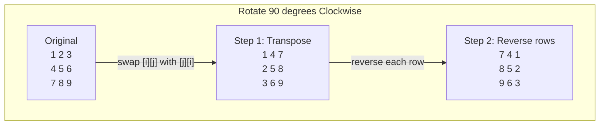

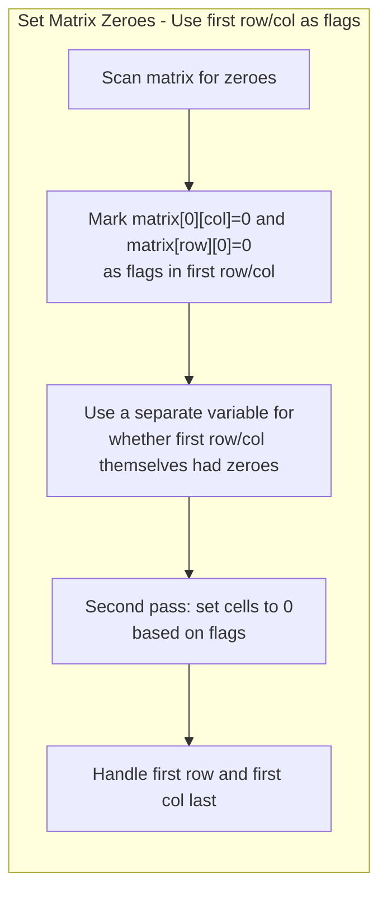

**When to use:** Problem says "in-place" or "O(1) extra space." Look for symmetry or reuse existing cells.

---

### Pattern 5: Island / Grid DFS/BFS

Treat the grid as a graph. Each cell is a node, and adjacent cells (4-directional) are edges. Use DFS or BFS to explore connected components.

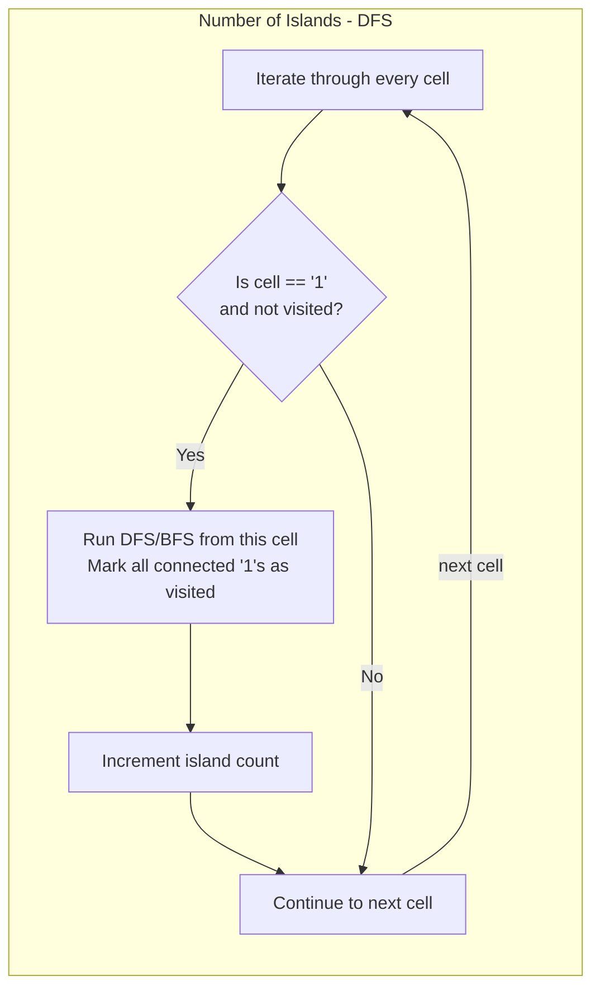

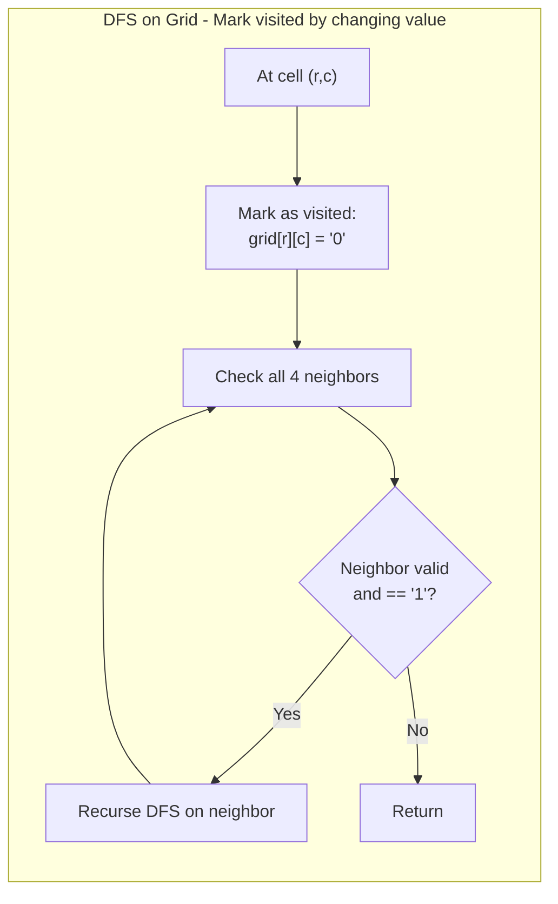

**Template:**
```python
def num_islands(grid):
    if not grid:
        return 0

    rows, cols = len(grid), len(grid[0])
    count = 0

    def dfs(r, c):
        if r < 0 or r >= rows or c < 0 or c >= cols or grid[r][c] != '1':
            return
        grid[r][c] = '0'  # mark visited
        dfs(r+1, c)
        dfs(r-1, c)
        dfs(r, c+1)
        dfs(r, c-1)

    for r in range(rows):
        for c in range(cols):
            if grid[r][c] == '1':
                dfs(r, c)
                count += 1

    return count
```

**When to use:** Connected components, flood fill, shortest path in grid, surrounded regions, island problems.

---

## 4. Which Pattern to Use?

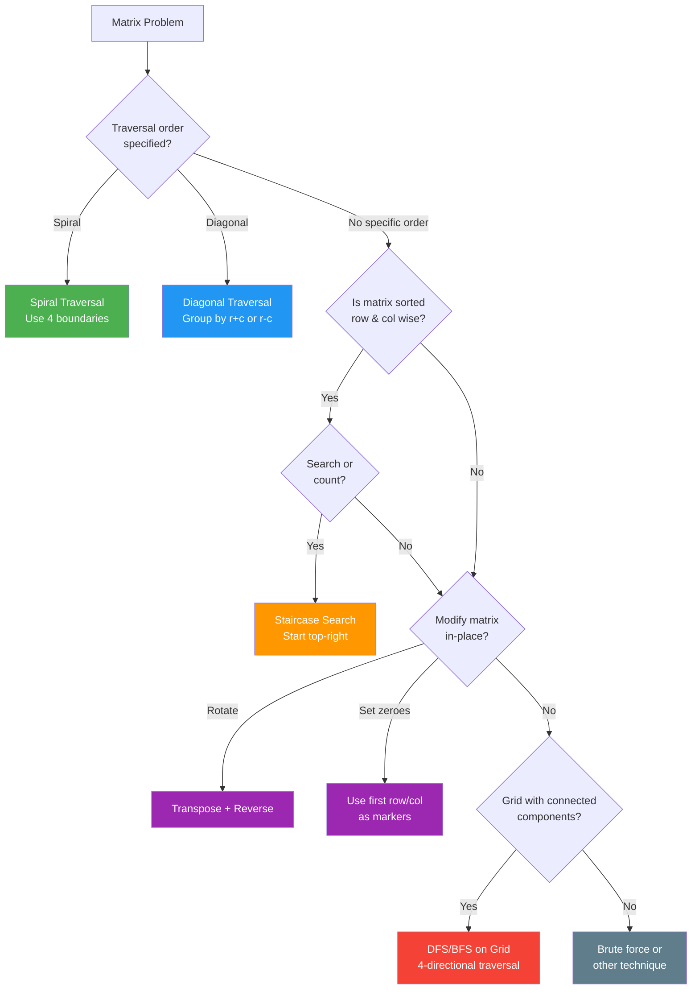

---

## 5. Common Mistakes

| Mistake | Fix |
|---|---|
| Confusing `row` and `col` indices | Always use `matrix[row][col]`, rows = `len(matrix)`, cols = `len(matrix[0])` |
| Wrong initialization: `[[0]*n]*m` | Use `[[0]*n for _ in range(m)]` -- each row must be independent |
| Off-by-one in spiral boundaries | Check `top <= bottom` and `left <= right` before inner loops |
| Not marking visited in grid DFS | Either mutate grid or use a `visited` set to avoid infinite loops |
| Modifying matrix while reading it | Use flags/markers first, then do a second pass to apply changes |
| Forgetting bounds check in DFS/BFS | Always check `0 <= r < rows and 0 <= c < cols` before accessing |

---

## 6. Day Schedule

### Day 15 (Easy + Medium Foundations)

| # | Problem | Difficulty | Pattern | Time Target |
|---|---------|-----------|---------|-------------|
| 1 | Matrix Transpose (LC 867) | Easy | Matrix Manipulation | 10 min |
| 2 | Flood Fill (LC 733) | Easy | DFS/BFS | 15 min |
| 3 | Island Perimeter (LC 463) | Easy | Grid Traversal | 15 min |
| 4 | Spiral Matrix (LC 54) | Medium | Spiral Traversal | 20 min |
| 5 | Rotate Image (LC 48) | Medium | In-place Rotation | 20 min |

**Focus:** Get comfortable with matrix traversal, boundary handling, and basic grid DFS.

### Day 16 (Medium + Hard)

| # | Problem | Difficulty | Pattern | Time Target |
|---|---------|-----------|---------|-------------|
| 1 | Set Matrix Zeroes (LC 73) | Medium | In-place Modification | 20 min |
| 2 | Word Search (LC 79) | Medium | DFS/Backtracking | 25 min |
| 3 | Maximal Rectangle (LC 85) | Hard | Stack/Histogram | 35 min |
| 4 | Number of Islands (LC 200) | Hard | DFS/BFS | 20 min |

**Focus:** In-place tricks, backtracking on grids, and combining matrix with other data structures (stacks).
