# Linked List - Concepts Guide (Days 17-19)

## 1. What is a Linked List?

A linked list is a linear data structure where elements (called **nodes**) are stored in non-contiguous memory locations. Each node contains data and a reference (pointer) to the next node.

### Node Structure

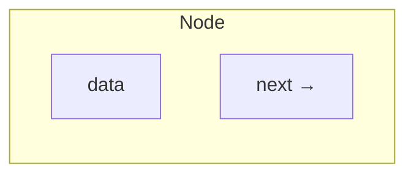

### Singly Linked List

Each node points to the next node. The last node points to `None`.

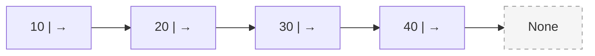

### Doubly Linked List

Each node has pointers to both the next and previous nodes.


### Linked List vs Array

| Feature | Array | Linked List |
|---|---|---|
| Memory layout | Contiguous | Non-contiguous |
| Access by index | O(1) | O(n) |
| Insert at beginning | O(n) | O(1) |
| Insert at end | O(1) amortized | O(n) or O(1) with tail |
| Insert at middle | O(n) | O(1) after finding position |
| Delete | O(n) | O(1) after finding position |
| Memory overhead | Low | Extra pointer per node |
| Cache performance | Excellent | Poor |
| Size | Fixed or resize needed | Dynamic |

---

## 2. How It Works

### Memory Layout

Arrays store elements in contiguous memory. Linked lists scatter nodes across memory, connected by pointers.

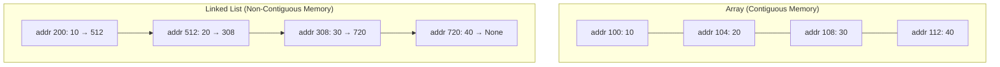

### Insertion at Head

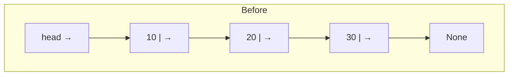

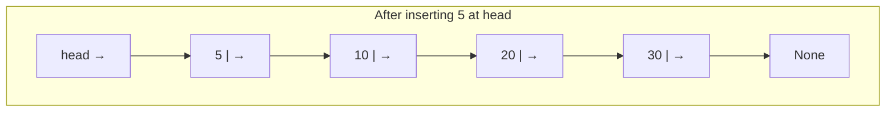

Steps:
1. Create new node with value 5
2. Set new node's `next` to current `head`
3. Update `head` to new node

### Deletion of a Node

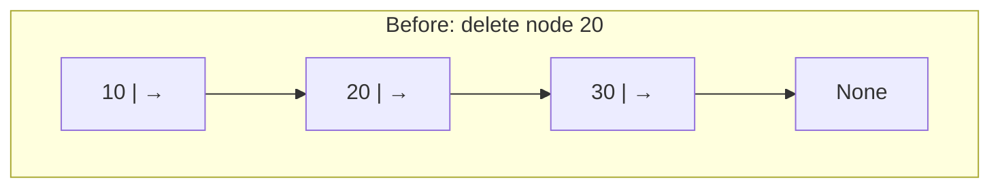

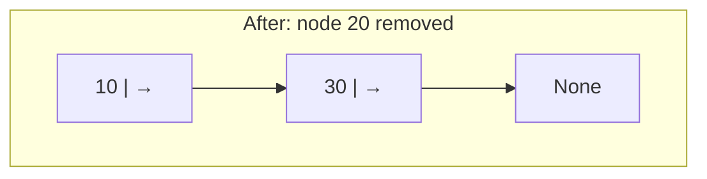

Steps:
1. Find the node **before** the target (node 10)
2. Set its `next` to target's `next` (skip over 20)
3. Node 20 is now unreachable and garbage collected

---

## 3. Operations & Time Complexities

| Operation | Singly Linked List | Doubly Linked List |
|---|---|---|
| Access by index | O(n) | O(n) |
| Search | O(n) | O(n) |
| Insert at head | O(1) | O(1) |
| Insert at tail (no tail ptr) | O(n) | O(n) |
| Insert at tail (with tail ptr) | O(1) | O(1) |
| Insert after given node | O(1) | O(1) |
| Delete head | O(1) | O(1) |
| Delete tail (no tail ptr) | O(n) | O(1) |
| Delete given node | O(n) | O(1) |
| Space complexity | O(n) | O(n) |

---

## 4. Python Implementation

### ListNode Class

```python
class ListNode:
    def __init__(self, val=0, next=None):
        self.val = val
        self.next = next
```

### Basic Operations

```python
# Build linked list from array
def build(arr):
    dummy = ListNode(0)
    curr = dummy
    for v in arr:
        curr.next = ListNode(v)
        curr = curr.next
    return dummy.next

# Convert linked list to array
def to_list(head):
    result = []
    while head:
        result.append(head.val)
        head = head.next
    return result

# Insert at head - O(1)
def insert_at_head(head, val):
    new_node = ListNode(val)
    new_node.next = head
    return new_node  # new head

# Insert at tail - O(n)
def insert_at_tail(head, val):
    new_node = ListNode(val)
    if not head:
        return new_node
    curr = head
    while curr.next:
        curr = curr.next
    curr.next = new_node
    return head

# Delete node with given value - O(n)
def delete_node(head, val):
    dummy = ListNode(0)
    dummy.next = head
    prev = dummy
    curr = head
    while curr:
        if curr.val == val:
            prev.next = curr.next
            break
        prev = curr
        curr = curr.next
    return dummy.next

# Search for value - O(n)
def search(head, val):
    curr = head
    while curr:
        if curr.val == val:
            return True
        curr = curr.next
    return False

# Get length - O(n)
def length(head):
    count = 0
    curr = head
    while curr:
        count += 1
        curr = curr.next
    return count
```

---

## 5. Key Patterns (Easy to Hard)

### Pattern 1: Traversal & Basic Operations (Easy)

The most fundamental pattern. Walk through nodes one by one using a pointer.

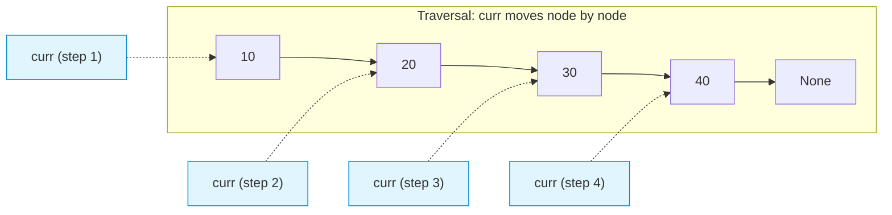

**When to use:** Finding length, searching, printing, summing values, removing duplicates from sorted list.

```python
# Template: iterate through all nodes
def traverse(head):
    curr = head
    while curr:
        # process curr.val
        curr = curr.next
```

**Problems:** LC 206, LC 83, LC 2

---

### Pattern 2: Fast & Slow Pointers (Medium)

Use two pointers moving at different speeds. **Slow** moves 1 step, **fast** moves 2 steps.

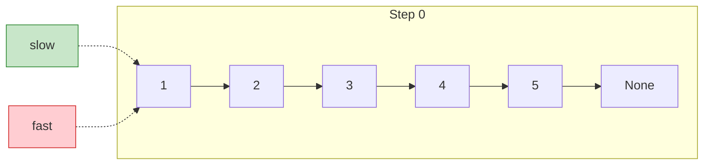

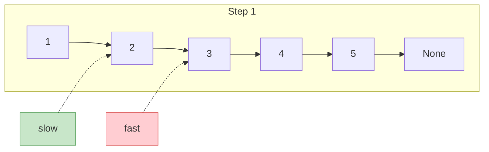

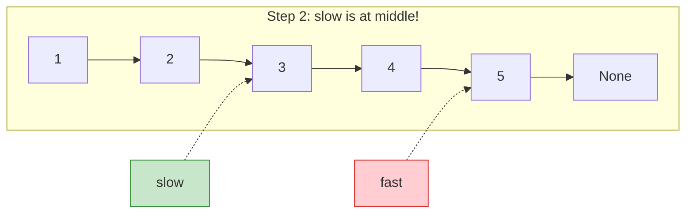

**When to use:**
- **Find middle node:** When fast reaches end, slow is at middle
- **Cycle detection (Floyd's):** If fast meets slow, there is a cycle
- **Find nth from end:** Move fast n steps ahead, then move both until fast hits end

```python
# Template: find middle
def find_middle(head):
    slow = fast = head
    while fast and fast.next:
        slow = slow.next
        fast = fast.next.next
    return slow  # slow is at middle
```

**Cycle detection with Floyd's algorithm:**

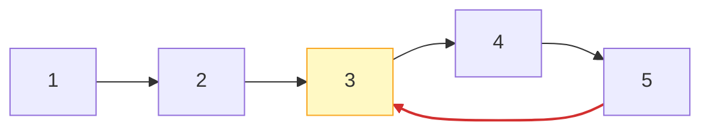

```python
def has_cycle(head):
    slow = fast = head
    while fast and fast.next:
        slow = slow.next
        fast = fast.next.next
        if slow == fast:
            return True
    return False
```

**Problems:** LC 876, LC 141, LC 234, LC 19, LC 143

---

### Pattern 3: Reversal (Medium)

Reverse the direction of pointers. Track three pointers: `prev`, `curr`, `next_node`.

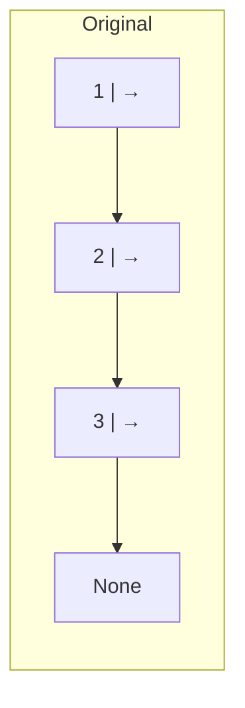

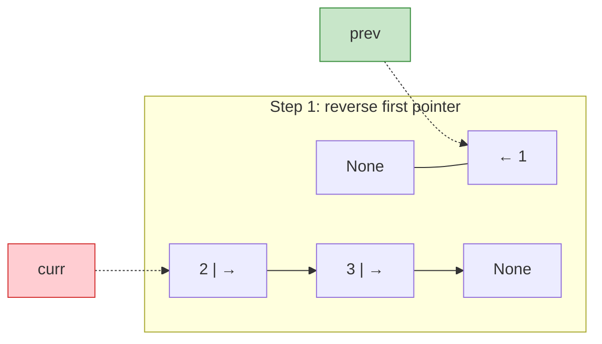

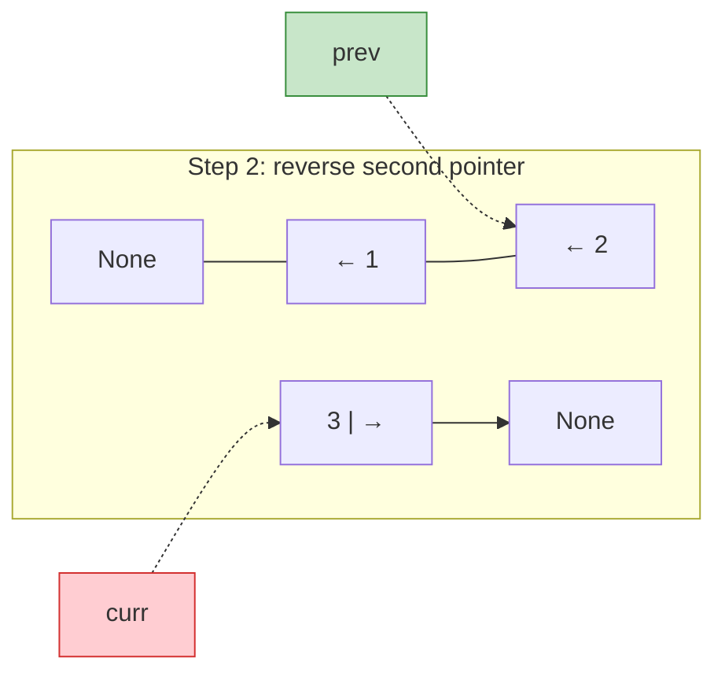

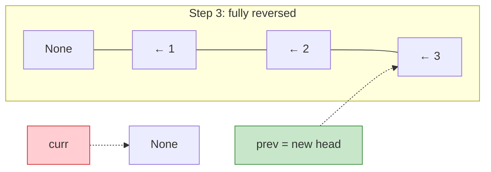

```python
# Iterative reversal
def reverse(head):
    prev = None
    curr = head
    while curr:
        next_node = curr.next   # save next
        curr.next = prev        # reverse pointer
        prev = curr             # advance prev
        curr = next_node        # advance curr
    return prev                 # new head

# Recursive reversal
def reverse_recursive(head):
    if not head or not head.next:
        return head
    new_head = reverse_recursive(head.next)
    head.next.next = head
    head.next = None
    return new_head
```

**Problems:** LC 206, LC 25, LC 234, LC 143

---

### Pattern 4: Merge (Medium)

Combine two sorted lists by comparing nodes and linking them in order.

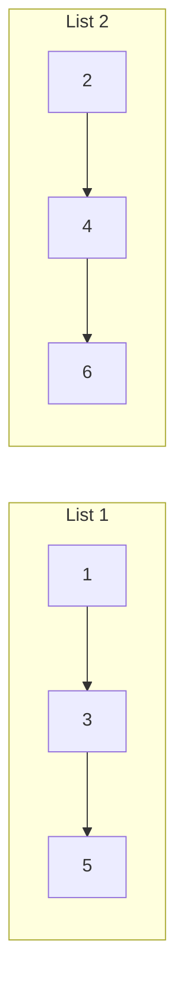

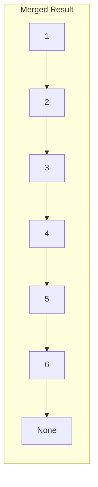

```python
# Template: merge two sorted lists using dummy node
def merge(l1, l2):
    dummy = ListNode(0)
    curr = dummy
    while l1 and l2:
        if l1.val <= l2.val:
            curr.next = l1
            l1 = l1.next
        else:
            curr.next = l2
            l2 = l2.next
        curr = curr.next
    curr.next = l1 or l2
    return dummy.next
```

**Problems:** LC 21, LC 23, LC 148

---

### Pattern 5: Dummy Node (Medium)

Create a fake head node to simplify edge cases (empty list, single node, operations on head).

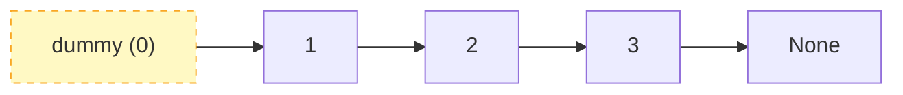

**Why use it?**
- Avoids special-casing when the head might change
- `return dummy.next` always gives the correct head
- Simplifies insert/delete at the beginning

```python
# Template: dummy node pattern
def process_list(head):
    dummy = ListNode(0)
    dummy.next = head
    prev = dummy
    curr = head
    while curr:
        # do operations, prev.next can skip curr if needed
        prev = curr
        curr = curr.next
    return dummy.next
```

**Problems:** LC 21, LC 19, LC 2, LC 25

---

### Pattern 6: Complex Pointer Manipulation (Hard)

Advanced operations requiring careful management of multiple pointers, often combining reversal with grouping or flattening.

```mermaid
graph LR
    subgraph "Reverse in k-groups (k=2)"
        direction LR
        A["1"] --> B["2"] --> C["3"] --> D["4"] --> E["5"]
    end
```

```mermaid
graph LR
    subgraph "Result"
        direction LR
        B2["2"] --> A2["1"] --> D2["4"] --> C2["3"] --> E2["5"]
    end
```

Key technique: isolate a group, reverse it, reconnect to the rest of the list.

**Problems:** LC 25, LC 430, LC 138

---

## 6. Which Pattern to Use?

```mermaid
flowchart TD
    START["Linked List Problem"] --> Q1{"Need to detect<br/>cycle or find middle?"}
    Q1 -->|Yes| FAST_SLOW["Fast & Slow Pointers"]
    Q1 -->|No| Q2{"Need to reverse<br/>all or part of list?"}
    Q2 -->|Yes| REVERSE["Reversal Pattern"]
    Q2 -->|No| Q3{"Combining or<br/>sorting lists?"}
    Q3 -->|Yes| MERGE["Merge Pattern"]
    Q3 -->|No| Q4{"Head node might<br/>change or edge cases?"}
    Q4 -->|Yes| DUMMY["Use Dummy Node"]
    Q4 -->|No| Q5{"Need multiple passes<br/>or complex rewiring?"}
    Q5 -->|Yes| COMPLEX["Complex Pointer<br/>Manipulation"]
    Q5 -->|No| TRAVERSE["Simple Traversal"]

    FAST_SLOW --> DONE["Solve!"]
    REVERSE --> DONE
    MERGE --> DONE
    DUMMY --> DONE
    COMPLEX --> DONE
    TRAVERSE --> DONE

    style START fill:#e3f2fd,stroke:#1565c0
    style DONE fill:#c8e6c9,stroke:#2e7d32
    style FAST_SLOW fill:#fff9c4,stroke:#f9a825
    style REVERSE fill:#fff9c4,stroke:#f9a825
    style MERGE fill:#fff9c4,stroke:#f9a825
    style DUMMY fill:#fff9c4,stroke:#f9a825
    style COMPLEX fill:#fff9c4,stroke:#f9a825
    style TRAVERSE fill:#fff9c4,stroke:#f9a825
```

### Quick Reference

| If the problem says... | Think... |
|---|---|
| "Find middle", "detect cycle" | Fast & Slow Pointers |
| "Reverse the list" | Reversal (iterative or recursive) |
| "Merge sorted lists" | Merge + Dummy Node |
| "Remove nth from end" | Two Pointers (gap technique) |
| "Reorder list" | Find middle + Reverse + Merge |
| "Palindrome" | Find middle + Reverse + Compare |
| "Sort linked list" | Merge Sort (split + merge) |
| "LRU Cache" | Doubly Linked List + Hash Map |
| "Copy with random pointer" | Hash Map or Interleaving |
| "Reverse in groups" | Reversal + Pointer reconnection |

---

## 7. Common Mistakes

### 1. Losing reference to the next node during reversal
```python
# WRONG - loses next node!
curr.next = prev
curr = curr.next  # curr.next is now prev, not the original next!

# CORRECT - save next first
next_node = curr.next
curr.next = prev
curr = next_node
```

### 2. Not handling None (empty list or end of list)
```python
# WRONG - crashes on empty list
def get_val(head):
    return head.val  # AttributeError if head is None

# CORRECT - check for None
def get_val(head):
    return head.val if head else None
```

### 3. Accidentally creating a cycle
```python
# WRONG - creates cycle when reversing part of list
# If you reverse a sublist, make sure the original head's next is set to None
# or connected to the correct node

# After reversing [1 -> 2 -> 3] to [3 -> 2 -> 1]:
# Node 1 still points to Node 2 unless you set 1.next = None
```

### 4. Off-by-one errors with dummy nodes
```python
# Remember: return dummy.next, NOT dummy
dummy = ListNode(0)
dummy.next = head
# ... operations ...
return dummy.next  # NOT return dummy
```

### 5. Not updating head when it changes
```python
# When deleting or inserting at head, the head reference must update
# Using dummy node pattern avoids this entirely
```

---

## 8. Day Schedule

### Day 17 - Easy: Fundamentals & Core Patterns
| # | Problem | Pattern | LC |
|---|---|---|---|
| 1 | Reverse Linked List | Reversal | 206 |
| 2 | Middle of Linked List | Fast & Slow | 876 |
| 3 | Merge Two Sorted Lists | Merge / Dummy | 21 |
| 4 | Linked List Cycle | Fast & Slow | 141 |
| 5 | Remove Nth From End | Two Pointers | 19 |
| 6 | Palindrome Linked List | Fast Slow + Reverse | 234 |

### Day 18 - Medium: Intermediate Patterns
| # | Problem | Pattern | LC |
|---|---|---|---|
| 1 | Add Two Numbers | Traversal | 2 |
| 2 | Remove Duplicates (Sorted) | Traversal | 83 |
| 3 | Intersection of Two Lists | Two Pointers | 160 |
| 4 | Sort List | Merge Sort | 148 |
| 5 | Reorder List | Fast Slow + Reverse + Merge | 143 |
| 6 | Odd Even Linked List | Pointer Manipulation | 328 |

### Day 19 - Hard + Review: Advanced Patterns
| # | Problem | Pattern | LC |
|---|---|---|---|
| 1 | Rotate List | Two Pointers | 61 |
| 2 | Flatten Multilevel List | DFS | 430 |
| 3 | Reverse Nodes in k-Group | Reversal | 25 |
| 4 | Merge k Sorted Lists | Heap + Merge | 23 |
| 5 | Copy List with Random Pointer | Hash Map | 138 |
| 6 | LRU Cache | DLL + Hash Map | 146 |
