# Stacks & Queues - Concepts Guide (Days 20-22)

## 1. Stack (LIFO - Last In, First Out)

A stack is like a pile of plates: you add to the top and remove from the top.

### How Push/Pop Works

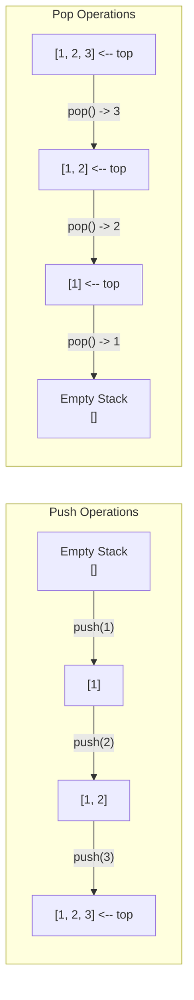

### Stack Visualization (Vertical)

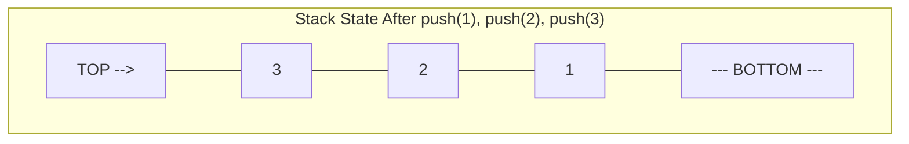

### Python List as Stack

```python
stack = []

# Push
stack.append(1)   # [1]
stack.append(2)   # [1, 2]
stack.append(3)   # [1, 2, 3]

# Peek (look at top without removing)
top = stack[-1]   # 3

# Pop
val = stack.pop() # 3, stack is now [1, 2]

# Check empty
if not stack:
    print("Stack is empty")

# Size
size = len(stack)
```

### collections.deque as Stack (Preferred for Performance)

```python
from collections import deque

stack = deque()

stack.append(1)     # push
stack.append(2)
val = stack.pop()   # pop -> 2
top = stack[-1]     # peek -> 1
```

> **Why deque?** Python lists use dynamic arrays. When the array is full, `append()` may trigger a resize (O(n) copy). `deque` uses a doubly-linked list of blocks, so `append()` and `pop()` are always O(1) -- no amortization needed.

---

## 2. Queue (FIFO - First In, First Out)

A queue is like a line at a coffee shop: first person in line gets served first.

### How Enqueue/Dequeue Works

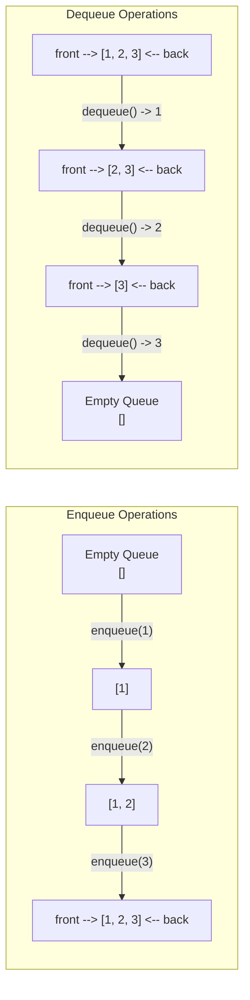

### Queue Visualization

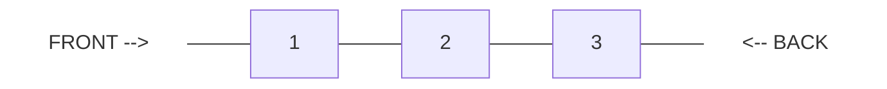

### collections.deque as Queue

```python
from collections import deque

queue = deque()

# Enqueue (add to back)
queue.append(1)       # deque([1])
queue.append(2)       # deque([1, 2])
queue.append(3)       # deque([1, 2, 3])

# Dequeue (remove from front)
val = queue.popleft() # 1, deque([2, 3])

# Peek front
front = queue[0]      # 2

# Check empty
if not queue:
    print("Queue is empty")
```

> **Never use `list.pop(0)` for queues!** It's O(n) because every element shifts. `deque.popleft()` is O(1).

---

## 3. Operations & Time Complexities

### Stack Operations

| Operation | list (stack) | deque (stack) | Description |
|-----------|:---:|:---:|-------------|
| Push | O(1)* | O(1) | Add to top |
| Pop | O(1) | O(1) | Remove from top |
| Peek | O(1) | O(1) | Look at top |
| Search | O(n) | O(n) | Find element |
| Size | O(1) | O(1) | Count elements |

*Amortized O(1) for list; deque is true O(1)

### Queue Operations

| Operation | list (queue) | deque (queue) | Description |
|-----------|:---:|:---:|-------------|
| Enqueue | O(1)* | O(1) | Add to back |
| Dequeue | **O(n)** | O(1) | Remove from front |
| Peek Front | O(1) | O(1) | Look at front |
| Search | O(n) | O(n) | Find element |
| Size | O(1) | O(1) | Count elements |

**Key takeaway:** Always use `deque` for queues. `list.pop(0)` is O(n).

---

## 4. Key Patterns

### Pattern 1: Parentheses Matching (Easy)

**When to use:** Any problem involving matching brackets, tags, or nested structures.

**Core idea:** Push opening brackets onto stack. When you see a closing bracket, pop and check if it matches.

```python
def is_valid(s: str) -> bool:
    stack = []
    mapping = {')': '(', ']': '[', '}': '{'}

    for char in s:
        if char in mapping:          # closing bracket
            if not stack or stack[-1] != mapping[char]:
                return False
            stack.pop()
        else:                        # opening bracket
            stack.append(char)

    return len(stack) == 0           # all brackets matched?
```

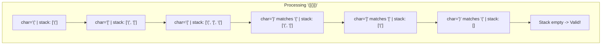

---

### Pattern 2: Monotonic Stack (Medium)

**When to use:** Finding the next/previous greater/smaller element for each position in an array.

**Core idea:** Maintain a stack where elements are in increasing (or decreasing) order. When a new element breaks this order, pop elements and record relationships.

#### Next Greater Element Walkthrough

Given array `[2, 1, 2, 4, 3]`, find the next greater element for each position.

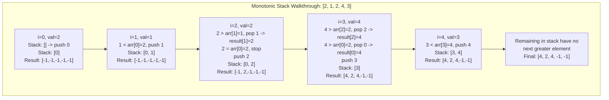

```python
def next_greater_element(nums):
    n = len(nums)
    result = [-1] * n
    stack = []  # stores indices

    for i in range(n):
        while stack and nums[i] > nums[stack[-1]]:
            idx = stack.pop()
            result[idx] = nums[i]
        stack.append(i)

    return result
```

**Monotonic Stack Variants:**
- **Next Greater:** iterate left-to-right, pop when `nums[i] > stack top`
- **Next Smaller:** iterate left-to-right, pop when `nums[i] < stack top`
- **Previous Greater:** iterate left-to-right, answer is current stack top before pushing
- **Previous Smaller:** same idea, monotonically increasing stack

---

### Pattern 3: Stack-based Evaluation (Medium)

**When to use:** Evaluating mathematical expressions, postfix notation, or calculator problems.

**Core idea:** Use a stack to hold numbers. When you see an operator, pop operands, compute, push result back.

#### Postfix (Reverse Polish Notation) Evaluation

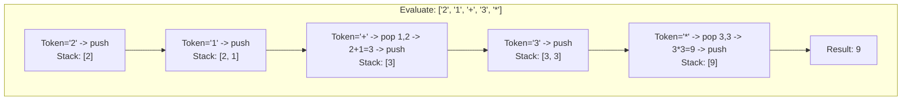

#### Infix Calculator Strategy

For expressions like `3 + 2 * 2`:
1. Track the current number and the last operator
2. For `+` and `-`: push the current accumulated value onto stack
3. For `*` and `/`: pop the top, compute immediately, push result
4. At end: sum everything in the stack

---

### Pattern 4: Queue with Stacks (Easy)

**When to use:** Interview classic -- implement one data structure using another.

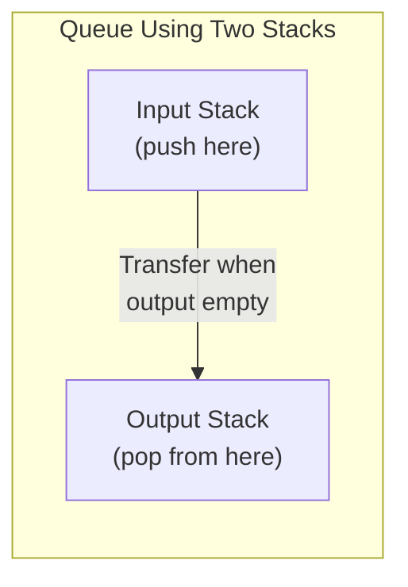

```python
class MyQueue:
    def __init__(self):
        self.in_stack = []   # for push
        self.out_stack = []  # for pop/peek

    def push(self, x):
        self.in_stack.append(x)

    def pop(self):
        self._transfer()
        return self.out_stack.pop()

    def peek(self):
        self._transfer()
        return self.out_stack[-1]

    def _transfer(self):
        if not self.out_stack:
            while self.in_stack:
                self.out_stack.append(self.in_stack.pop())
```

**Amortized O(1):** Each element is moved at most once from in_stack to out_stack.

---

### Pattern 5: Sliding Window Max with Monotonic Deque (Hard)

**When to use:** Finding max/min in a sliding window efficiently.

**Core idea:** Maintain a deque of indices where the values are in decreasing order. The front of the deque is always the max of the current window.

```mermaid
graph TD
    subgraph "Sliding Window Max: [1,3,-1,-3,5,3,6,7], k=3"
        A["i=0, val=1<br/>Deque: [0]"]
        B["i=1, val=3 > 1, pop 0<br/>Deque: [1]"]
        C["i=2, val=-1 < 3<br/>Deque: [1,2]<br/>Window [0-2] -> max=arr[1]=3"]
        D["i=3, val=-3 < -1<br/>Deque: [1,2,3]<br/>Window [1-3] -> max=arr[1]=3"]
        E["i=4, val=5 > all, pop all<br/>Deque: [4]<br/>Window [2-4] -> max=arr[4]=5"]
        F["i=5, val=3 < 5<br/>Deque: [4,5]<br/>Window [3-5] -> max=arr[4]=5"]
        G["i=6, val=6 > 3,5 pop both<br/>Deque: [6]<br/>Window [4-6] -> max=arr[6]=6"]
        H["i=7, val=7 > 6 pop<br/>Deque: [7]<br/>Window [5-7] -> max=arr[7]=7"]
        I["Result: [3, 3, 5, 5, 6, 7]"]

        A --> B --> C --> D --> E --> F --> G --> H --> I
    end
```

```python
from collections import deque

def max_sliding_window(nums, k):
    dq = deque()  # stores indices, values in decreasing order
    result = []

    for i in range(len(nums)):
        # Remove indices out of window
        while dq and dq[0] < i - k + 1:
            dq.popleft()

        # Remove smaller elements (they'll never be the max)
        while dq and nums[dq[-1]] <= nums[i]:
            dq.pop()

        dq.append(i)

        # Window is full, record max
        if i >= k - 1:
            result.append(nums[dq[0]])

    return result
```

---

### Pattern 6: Min Stack (Medium)

**When to use:** When you need O(1) access to the minimum element at all times.

**Core idea:** Keep a parallel stack that tracks the minimum at each level.

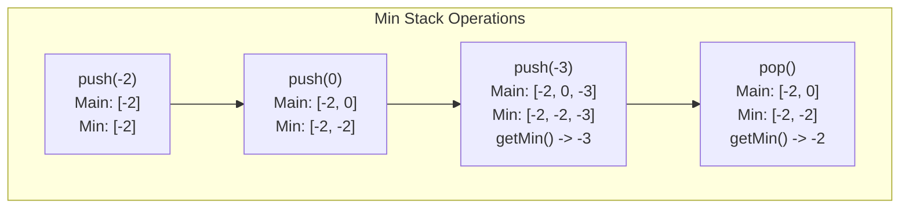

---

## 5. Which Pattern to Use?

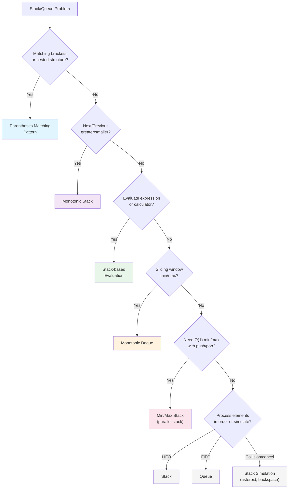

---

## 6. Common Mistakes

### 1. Popping from an Empty Stack
```python
# WRONG - will crash
stack.pop()

# RIGHT - always check first
if stack:
    stack.pop()
```

### 2. Not Considering All Bracket Types
```python
# WRONG - only handles ()
mapping = {')': '('}

# RIGHT - handle all types
mapping = {')': '(', ']': '[', '}': '{'}
```

### 3. Using list.pop(0) for Queue
```python
# WRONG - O(n) per operation
queue = []
queue.pop(0)

# RIGHT - O(1) per operation
from collections import deque
queue = deque()
queue.popleft()
```

### 4. Forgetting to Handle Remaining Stack Elements
```python
# After iterating, elements still in stack may need default values
# e.g., in "next greater element", remaining indices get -1
```

### 5. Off-by-One in Sliding Window
```python
# WRONG - recording result too early
if i >= k:
    result.append(...)

# RIGHT - window of size k starts at index k-1
if i >= k - 1:
    result.append(...)
```

### 6. Integer Division Truncation Toward Zero
```python
# Python's // truncates toward negative infinity
# For calculator problems, use int() to truncate toward zero
int(-7 / 2)   # -3 (toward zero) -- correct for LC
-7 // 2       # -4 (toward negative infinity) -- wrong for LC
```

---

## 7. Day Schedule

### Day 20 -- Stack & Queue Fundamentals (Easy + Basic Medium)
| # | Problem | Difficulty | Pattern | Time |
|---|---------|-----------|---------|------|
| 1 | Valid Parentheses (LC 20) | Easy | Parentheses Matching | 15 min |
| 2 | Implement Queue Using Stacks (LC 232) | Easy | Two Stacks | 15 min |
| 3 | Implement Stack Using Queues (LC 225) | Easy | Queue | 15 min |
| 4 | Min Stack (LC 155) | Easy | Parallel Stack | 15 min |
| 5 | Next Greater Element I (LC 496) | Easy | Monotonic Stack Intro | 20 min |
| 6 | Backspace String Compare (LC 844) | Easy | Stack Simulation | 15 min |

**Focus:** Understand the core push/pop/peek operations. Build intuition for when to use a stack.

### Day 21 -- Monotonic Stack & Expression Evaluation (Medium)
| # | Problem | Difficulty | Pattern | Time |
|---|---------|-----------|---------|------|
| 1 | Daily Temperatures (LC 739) | Medium | Monotonic Stack | 20 min |
| 2 | Evaluate RPN (LC 150) | Medium | Stack Evaluation | 15 min |
| 3 | Asteroid Collision (LC 735) | Medium | Stack Simulation | 20 min |
| 4 | Decode String (LC 394) | Medium | Nested Stack | 25 min |
| 5 | Remove K Digits (LC 402) | Medium | Monotonic Stack | 25 min |

**Focus:** Master monotonic stack. Practice recognizing "next greater/smaller" problems.

### Day 22 -- Advanced Stack + Hard Problems (Medium + Hard)
| # | Problem | Difficulty | Pattern | Time |
|---|---------|-----------|---------|------|
| 1 | Online Stock Span (LC 901) | Medium | Monotonic Stack | 20 min |
| 2 | Car Fleet (LC 853) | Medium | Stack + Sort | 25 min |
| 3 | Basic Calculator II (LC 227) | Medium | Stack Evaluation | 25 min |
| 4 | Largest Rectangle in Histogram (LC 84) | Hard | Monotonic Stack | 30 min |
| 5 | Sliding Window Maximum (LC 239) | Hard | Monotonic Deque | 25 min |
| 6 | Basic Calculator (LC 224) | Hard | Stack + Recursion | 30 min |
| 7 | Trapping Rain Water - Stack (LC 42) | Hard | Monotonic Stack | 25 min |

**Focus:** Tackle the hardest monotonic stack problems. Review all patterns from Days 20-21.
