# Binary Trees - Days 23-25

## 1. What is a Binary Tree?

A **binary tree** is a hierarchical data structure where each node has **at most two children**, referred to as the **left child** and the **right child**.

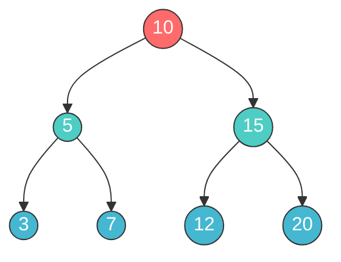

### Key Terminology

| Term | Definition | Example (above tree) |
|------|-----------|---------------------|
| **Root** | The topmost node | `10` |
| **Leaf** | A node with no children | `3`, `7`, `12`, `20` |
| **Internal Node** | A node with at least one child | `10`, `5`, `15` |
| **Parent** | Node directly above | `10` is parent of `5` and `15` |
| **Child** | Node directly below | `5` and `15` are children of `10` |
| **Depth** | Number of edges from root to node | Depth of `7` = 2 |
| **Height** | Number of edges on longest path from node to leaf | Height of `5` = 1 |
| **Level** | Set of all nodes at a given depth | Level 1 = `{5, 15}` |
| **Height of Tree** | Height of the root node | 2 |

---

## 2. Types of Binary Trees

### Full Binary Tree
Every node has **0 or 2** children (never just 1).

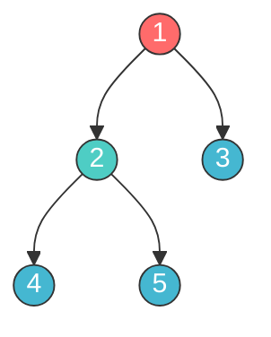

### Complete Binary Tree
All levels are fully filled **except possibly the last**, and the last level is filled **from left to right**.

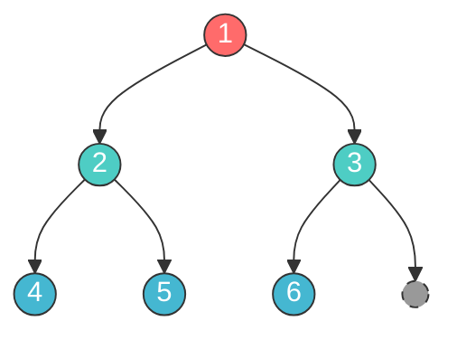

### Perfect Binary Tree
All internal nodes have **exactly 2 children** and all leaves are at the **same level**. Node count = `2^(h+1) - 1`.

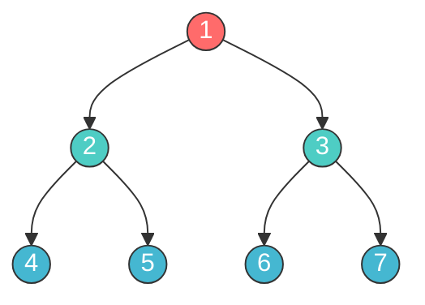

### Balanced Binary Tree
For **every node**, the height difference between left and right subtrees is **at most 1**.

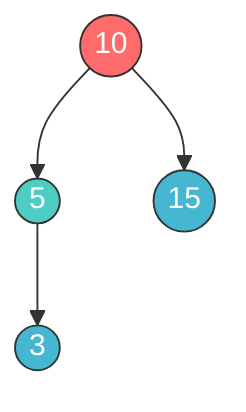
> Height of left subtree = 1, right subtree = 0. Difference = 1. Balanced!

### Degenerate (Skewed) Binary Tree
Every internal node has **only one child**. Essentially a linked list. All operations become O(n).

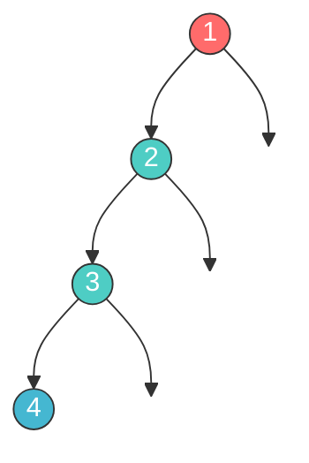

---

## 3. TreeNode Class in Python

```python
class TreeNode:
    def __init__(self, val=0, left=None, right=None):
        self.val = val
        self.left = left
        self.right = right
```

### Building a Tree from a List (LeetCode-style)

```python
from collections import deque

def build_tree(values):
    """Build a binary tree from a level-order list. None represents missing nodes."""
    if not values:
        return None
    root = TreeNode(values[0])
    queue = deque([root])
    i = 1
    while queue and i < len(values):
        node = queue.popleft()
        if i < len(values) and values[i] is not None:
            node.left = TreeNode(values[i])
            queue.append(node.left)
        i += 1
        if i < len(values) and values[i] is not None:
            node.right = TreeNode(values[i])
            queue.append(node.right)
        i += 1
    return root
```

### Converting a Tree to a List (for verification)

```python
def tree_to_list(root):
    """Convert a binary tree to level-order list."""
    if not root:
        return []
    result = []
    queue = deque([root])
    while queue:
        node = queue.popleft()
        if node:
            result.append(node.val)
            queue.append(node.left)
            queue.append(node.right)
        else:
            result.append(None)
    # Remove trailing Nones
    while result and result[-1] is None:
        result.pop()
    return result
```

---

## 4. Traversals

Consider this tree for all traversal examples:


### Inorder Traversal (Left -> Root -> Right)

Visit order: `4 -> 2 -> 5 -> 1 -> 6 -> 3 -> 7`

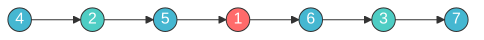

> For a **Binary Search Tree**, inorder traversal gives nodes in **sorted order**.

```python
def inorder(root):
    if not root:
        return []
    return inorder(root.left) + [root.val] + inorder(root.right)

# Iterative version (using stack)
def inorder_iterative(root):
    result, stack = [], []
    current = root
    while current or stack:
        while current:
            stack.append(current)
            current = current.left
        current = stack.pop()
        result.append(current.val)
        current = current.right
    return result
```

### Preorder Traversal (Root -> Left -> Right)

Visit order: `1 -> 2 -> 4 -> 5 -> 3 -> 6 -> 7`

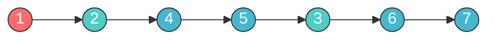

> Useful for **serialization** and **copying** a tree.

```python
def preorder(root):
    if not root:
        return []
    return [root.val] + preorder(root.left) + preorder(root.right)

# Iterative version
def preorder_iterative(root):
    if not root:
        return []
    result, stack = [], [root]
    while stack:
        node = stack.pop()
        result.append(node.val)
        if node.right:  # Push right first so left is processed first
            stack.append(node.right)
        if node.left:
            stack.append(node.left)
    return result
```

### Postorder Traversal (Left -> Right -> Root)

Visit order: `4 -> 5 -> 2 -> 6 -> 7 -> 3 -> 1`


> Useful for **deletion** (delete children before parent) and **expression evaluation**.

```python
def postorder(root):
    if not root:
        return []
    return postorder(root.left) + postorder(root.right) + [root.val]
```

### Level Order Traversal (BFS)

Visit order: `[1] -> [2, 3] -> [4, 5, 6, 7]`

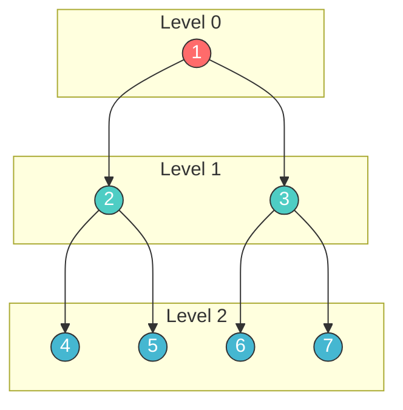

```python
from collections import deque

def level_order(root):
    if not root:
        return []
    result = []
    queue = deque([root])
    while queue:
        level = []
        for _ in range(len(queue)):
            node = queue.popleft()
            level.append(node.val)
            if node.left:
                queue.append(node.left)
            if node.right:
                queue.append(node.right)
        result.append(level)
    return result
```

### Traversal Comparison

| Traversal | Order | Use Case | Time | Space |
|-----------|-------|----------|------|-------|
| Inorder | L, Root, R | Sorted order (BST) | O(n) | O(h) |
| Preorder | Root, L, R | Serialization, copy | O(n) | O(h) |
| Postorder | L, R, Root | Deletion, eval | O(n) | O(h) |
| Level Order | Level by level | BFS problems, views | O(n) | O(w) |

> `h` = height of tree, `w` = max width of tree. For balanced tree h = O(log n), worst case h = O(n).

---

## 5. Key Patterns

### Pattern 1: DFS Recursive (Easy)

The backbone of tree problems. Most tree problems follow one of these templates:

```python
# Template: Return a value from subtrees
def solve(root):
    # Base case
    if not root:
        return BASE_VALUE  # e.g., 0, True, None, []

    # Recurse on subtrees
    left = solve(root.left)
    right = solve(root.right)

    # Combine results
    return COMBINE(root.val, left, right)
```

**When to use:** When you need to compute something for every node using its subtrees' results.

**Examples:** max depth, same tree, symmetric tree, invert tree.

---

### Pattern 2: BFS Level Order (Medium)

Use a queue to process nodes level by level.

```python
from collections import deque

def bfs_template(root):
    if not root:
        return []

    result = []
    queue = deque([root])

    while queue:
        level_size = len(queue)
        level = []

        for _ in range(level_size):
            node = queue.popleft()
            level.append(node.val)

            if node.left:
                queue.append(node.left)
            if node.right:
                queue.append(node.right)

        result.append(level)

    return result
```

**When to use:** Level-by-level processing, views, zigzag, minimum depth, connect next pointers.

---

### Pattern 3: Height / Depth (Easy/Medium)

```python
def max_depth(root):
    if not root:
        return 0
    return 1 + max(max_depth(root.left), max_depth(root.right))

def is_balanced(root):
    def height(node):
        if not node:
            return 0
        left_h = height(node.left)
        right_h = height(node.right)
        if left_h == -1 or right_h == -1 or abs(left_h - right_h) > 1:
            return -1  # Unbalanced signal
        return 1 + max(left_h, right_h)

    return height(root) != -1
```

**When to use:** Problems involving tree height, balance checking, diameter.

---

### Pattern 4: Path Problems (Medium)

Track the path from root to leaf or compute path sums.

```python
# Path sum: Does any root-to-leaf path equal target?
def has_path_sum(root, target):
    if not root:
        return False
    if not root.left and not root.right:  # Leaf
        return root.val == target
    return (has_path_sum(root.left, target - root.val) or
            has_path_sum(root.right, target - root.val))

# Collect all root-to-leaf paths
def all_paths(root):
    def dfs(node, path, result):
        if not node:
            return
        path.append(node.val)
        if not node.left and not node.right:  # Leaf
            result.append(list(path))
        dfs(node.left, path, result)
        dfs(node.right, path, result)
        path.pop()  # Backtrack

    result = []
    dfs(root, [], result)
    return result
```

**When to use:** Path sum, root-to-leaf paths, maximum path sum.

---

### Pattern 5: Tree Views (Medium)

Seeing the tree from different angles.

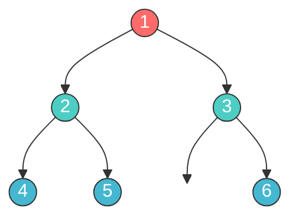

| View | Nodes | Technique |
|------|-------|-----------|
| **Left View** | 1, 2, 4 | BFS: first node in each level |
| **Right View** | 1, 3, 6 | BFS: last node in each level |
| **Top View** | 4, 2, 1, 3, 6 | BFS + column tracking |
| **Bottom View** | 4, 5, 1, 6 | BFS + column (last per column) |

```python
# Right side view
def right_side_view(root):
    if not root:
        return []
    result = []
    queue = deque([root])
    while queue:
        level_size = len(queue)
        for i in range(level_size):
            node = queue.popleft()
            if i == level_size - 1:  # Last node in this level
                result.append(node.val)
            if node.left:
                queue.append(node.left)
            if node.right:
                queue.append(node.right)
    return result
```

---

### Pattern 6: Lowest Common Ancestor (Medium)

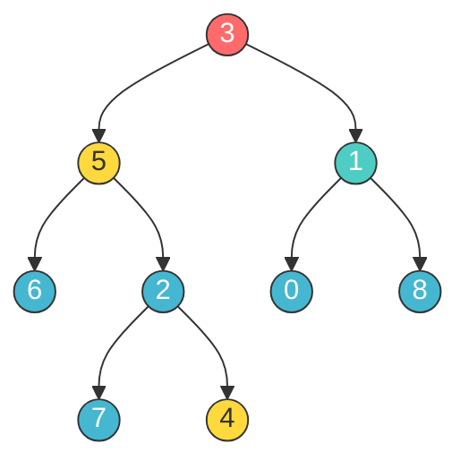

> LCA of `5` and `4` is `5` (a node can be its own ancestor). LCA of `5` and `1` is `3`.

```python
def lowest_common_ancestor(root, p, q):
    if not root or root == p or root == q:
        return root

    left = lowest_common_ancestor(root.left, p, q)
    right = lowest_common_ancestor(root.right, p, q)

    if left and right:
        return root       # p and q are in different subtrees
    return left or right  # Both in the same subtree
```

**Key insight:** If both left and right recursive calls return non-None, the current node is the LCA. If only one side returns non-None, the LCA is in that subtree.

---

### Pattern 7: Serialization (Hard)

Convert a tree to a string and back.

```python
from collections import deque

def serialize(root):
    if not root:
        return ""
    result = []
    queue = deque([root])
    while queue:
        node = queue.popleft()
        if node:
            result.append(str(node.val))
            queue.append(node.left)
            queue.append(node.right)
        else:
            result.append("null")
    return ",".join(result)

def deserialize(data):
    if not data:
        return None
    values = data.split(",")
    root = TreeNode(int(values[0]))
    queue = deque([root])
    i = 1
    while queue and i < len(values):
        node = queue.popleft()
        if values[i] != "null":
            node.left = TreeNode(int(values[i]))
            queue.append(node.left)
        i += 1
        if i < len(values) and values[i] != "null":
            node.right = TreeNode(int(values[i]))
            queue.append(node.right)
        i += 1
    return root
```

---

## 6. Which Pattern to Use?

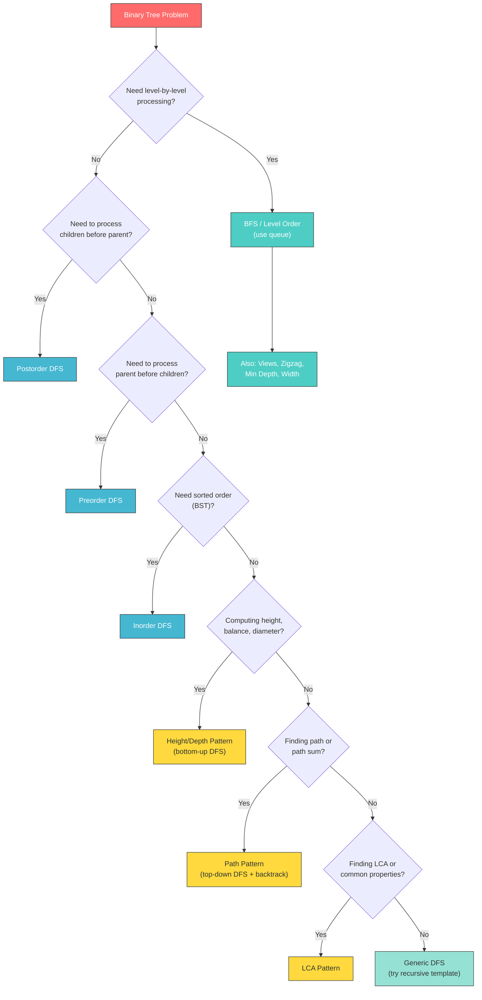

### Quick Reference Table

| Problem Type | Pattern | Difficulty |
|-------------|---------|------------|
| Traversals (inorder, preorder, postorder) | DFS Recursive | Easy |
| Max/Min Depth | Height/Depth | Easy |
| Same Tree, Symmetric Tree | DFS Recursive | Easy |
| Invert Tree | DFS Recursive | Easy |
| Path Sum | Path Pattern | Easy |
| Level Order, Zigzag | BFS Level Order | Medium |
| Right/Left Side View | BFS Level Order | Medium |
| Construct from Traversals | DFS + HashMap | Medium |
| Flatten to Linked List | DFS Preorder | Medium |
| LCA | LCA Pattern | Medium |
| Diameter | Height (with global var) | Medium |
| Balanced Tree | Height (early termination) | Medium |
| Max Path Sum | Path + Height (global var) | Hard |
| Serialize/Deserialize | BFS or Preorder | Hard |
| Vertical Order | BFS + Column Sort | Hard |
| Max Width | BFS + Position Index | Hard |

---

## 7. Day Schedule

### Day 23: Easy + Traversals (Foundation Day)

**Goal:** Master tree fundamentals and recursive thinking.

| Order | Problem | Pattern | Time |
|-------|---------|---------|------|
| 1 | Inorder Traversal (LC 94) | DFS | 15 min |
| 2 | Maximum Depth (LC 104) | Height | 15 min |
| 3 | Same Tree (LC 100) | DFS | 15 min |
| 4 | Symmetric Tree (LC 101) | DFS | 15 min |
| 5 | Path Sum (LC 112) | Path | 20 min |
| 6 | Invert Binary Tree (LC 226) | DFS | 15 min |
| 7 | Subtree of Another Tree (LC 572) | DFS | 20 min |

**Key takeaway:** Every tree problem starts with `if not root: return BASE`. Think recursively: solve for subtrees, combine at root.

---

### Day 24: Medium (BFS + Advanced DFS)

**Goal:** Master BFS pattern and tree construction.

| Order | Problem | Pattern | Time |
|-------|---------|---------|------|
| 1 | Level Order Traversal (LC 102) | BFS | 20 min |
| 2 | Zigzag Level Order (LC 103) | BFS | 20 min |
| 3 | Construct from Preorder+Inorder (LC 105) | DFS | 30 min |
| 4 | Flatten to Linked List (LC 114) | DFS | 25 min |
| 5 | Lowest Common Ancestor (LC 236) | LCA | 25 min |
| 6 | Right Side View (LC 199) | BFS | 20 min |

**Key takeaway:** BFS uses a queue and processes level by level. For DFS construction problems, use hash maps for O(1) lookups.

---

### Day 25: Hard + Remaining Medium (Mastery Day)

**Goal:** Tackle hard problems and solidify understanding.

| Order | Problem | Pattern | Time |
|-------|---------|---------|------|
| 1 | Diameter of Tree (LC 543) | Height | 20 min |
| 2 | Is Balanced (LC 110) | Height | 20 min |
| 3 | Count Nodes - Complete Tree (LC 222) | Binary Search | 25 min |
| 4 | Max Path Sum (LC 124) | Path + Height | 30 min |
| 5 | Serialize/Deserialize (LC 297) | BFS/DFS | 30 min |
| 6 | Vertical Order (LC 987) | BFS + Sort | 30 min |
| 7 | Max Width (LC 662) | BFS | 25 min |

**Key takeaway:** Hard tree problems often combine patterns (e.g., path + height for max path sum). Use global variables or class attributes when you need to track a result across recursive calls.

---

## Complexity Summary

| Operation | Balanced Tree | Skewed Tree |
|-----------|:------------:|:-----------:|
| Search | O(log n) | O(n) |
| Insert | O(log n) | O(n) |
| Delete | O(log n) | O(n) |
| Traversal | O(n) | O(n) |
| Space (recursive) | O(log n) | O(n) |
| Space (BFS) | O(n) | O(1) |
