# Binary Search Tree (BST) - Days 26-27

## 1. What is a BST?

A **Binary Search Tree** is a binary tree where every node satisfies the **BST property**:

- All values in the **left subtree** are **less than** the node's value
- All values in the **right subtree** are **greater than** the node's value
- Both left and right subtrees are also BSTs

This property holds for **every** node in the tree, not just the root.

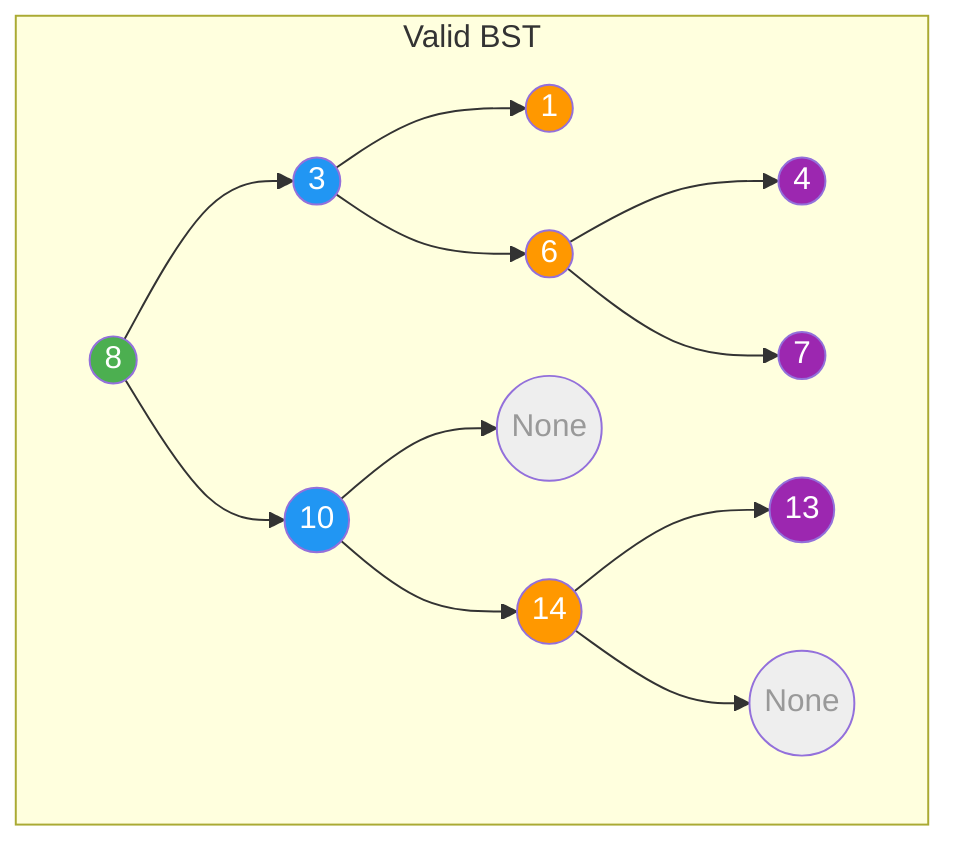

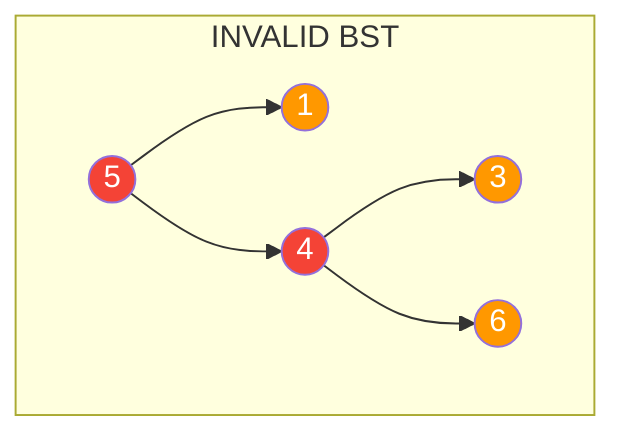

> The second tree is invalid because `4` is in the right subtree of `5`, but `4 < 5` violates the BST property.

---

## 2. Operations

### Search

To find a value, compare it with the current node and go left or right accordingly.

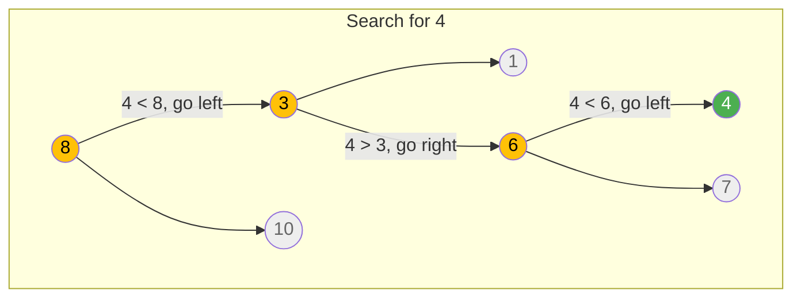

**Steps:**
1. Start at root (8). Target 4 < 8, go **left**.
2. At node 3. Target 4 > 3, go **right**.
3. At node 6. Target 4 < 6, go **left**.
4. At node 4. **Found!**

### Insert

Insert always happens at a leaf position. Traverse like search, then attach.

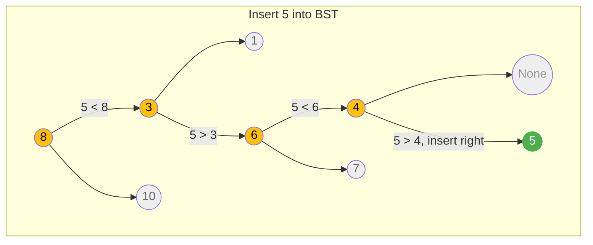

### Delete (3 Cases)

Deleting a node from a BST has three cases:

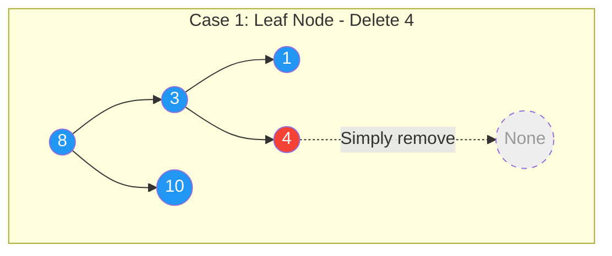

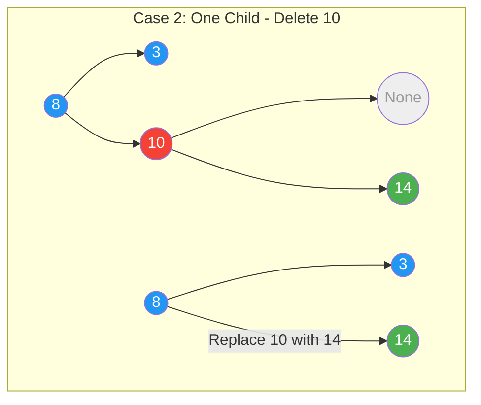

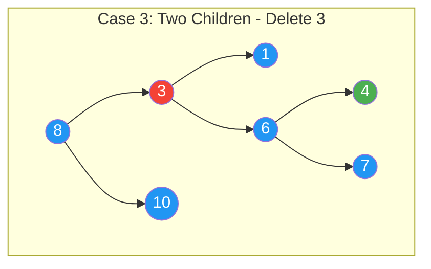

**Case 3 Steps:**
1. Find the **inorder successor** (smallest node in right subtree) = `4`
2. **Replace** the deleted node's value with the successor's value
3. **Delete** the successor from its original position (which is Case 1 or 2)

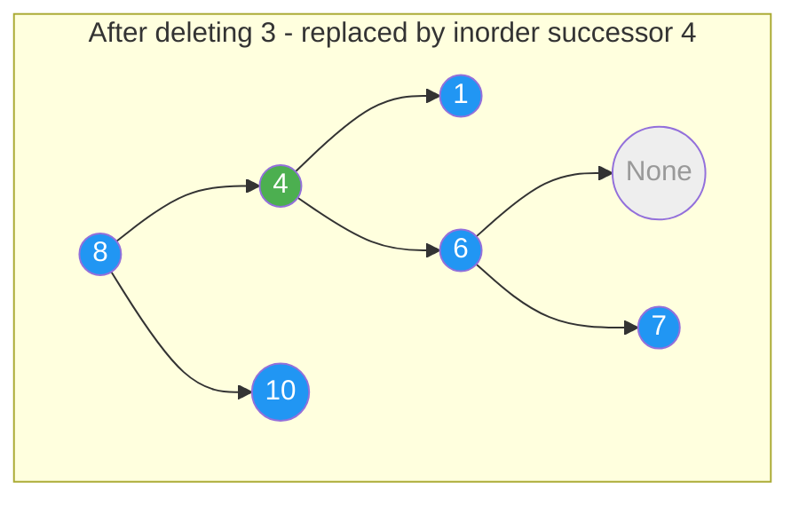

---

## 3. Time Complexities

| Operation | Average Case | Worst Case (Skewed) |
|-----------|:------------:|:-------------------:|
| Search    | O(log n)     | O(n)                |
| Insert    | O(log n)     | O(n)                |
| Delete    | O(log n)     | O(n)                |
| Traversal | O(n)         | O(n)                |
| Space     | O(n)         | O(n)                |

**Why worst case O(n)?** When the tree degenerates into a linked list (e.g., inserting sorted data: 1, 2, 3, 4, 5).

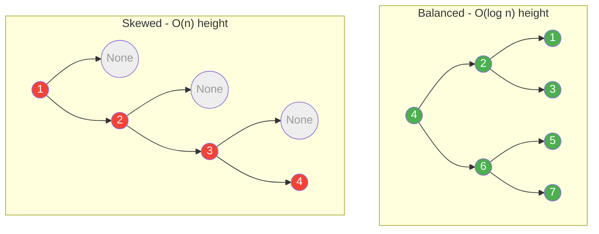

---

## 4. Inorder Traversal = Sorted Output

The **most important** BST property for interviews: **inorder traversal of a BST produces elements in sorted (ascending) order**.

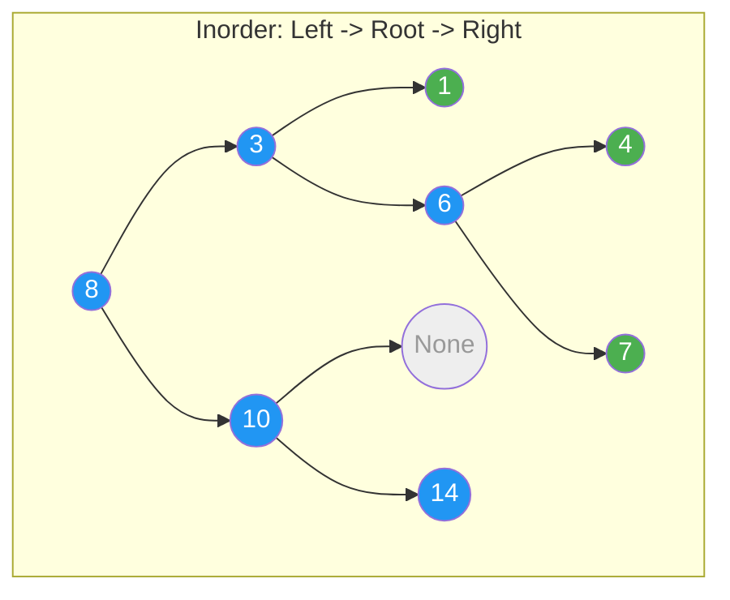

**Traversal order:** `1 -> 3 -> 4 -> 6 -> 7 -> 8 -> 10 -> 14` (sorted!)

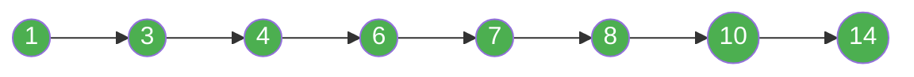

This property is used in many problems:
- Finding **kth smallest** element
- **Validating** a BST
- Converting BST to **sorted list**
- **Recovering** a BST with swapped nodes

---

## 5. Key Patterns

### Pattern 1: BST Search/Insert (Easy)

Use the BST property to decide left/right at each step.

```python
# Recursive Search
def search(root, val):
    if not root or root.val == val:
        return root
    if val < root.val:
        return search(root.left, val)
    return search(root.right, val)

# Iterative Search (preferred for O(1) space)
def search_iterative(root, val):
    while root and root.val != val:
        root = root.left if val < root.val else root.right
    return root
```

### Pattern 2: BST Validation (Medium)

Pass a valid **range** `(low, high)` down the recursion. Every node must fall within its allowed range.

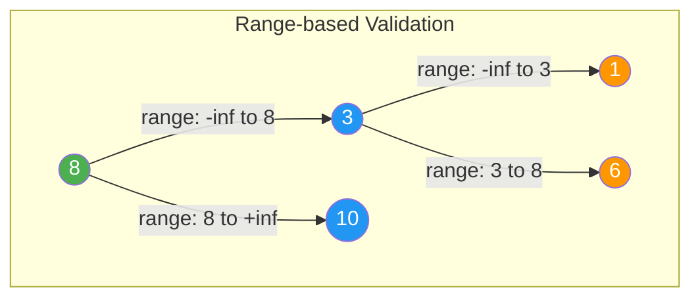

```python
def isValidBST(root, low=float('-inf'), high=float('inf')):
    if not root:
        return True
    if root.val <= low or root.val >= high:
        return False
    return (isValidBST(root.left, low, root.val) and
            isValidBST(root.right, root.val, high))
```

### Pattern 3: Inorder Successor/Predecessor (Medium)

The **inorder successor** is the node with the smallest value **greater than** the given node.

Two approaches:
1. **With parent pointer**: Go up until you find a left-child relationship.
2. **Without parent pointer**: Track the last node where you went **left** (that's a potential successor).

```python
def inorder_successor(root, target):
    successor = None
    while root:
        if target.val < root.val:
            successor = root  # potential successor
            root = root.left
        else:
            root = root.right
    return successor
```

### Pattern 4: BST to Sorted List (Medium)

Use **inorder traversal** (iterative or recursive) to collect values in sorted order, then reconstruct.

### Pattern 5: Balanced BST from Sorted Array (Medium)

Always pick the **middle element** as root. Recursively build left and right subtrees.

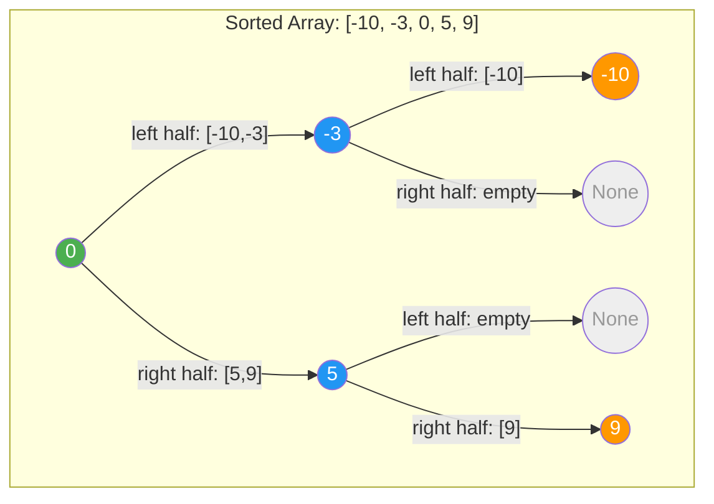

### Pattern 6: Kth Smallest (Medium)

Perform **inorder traversal** and count nodes. When count reaches k, you have the answer.

```python
def kth_smallest(root, k):
    stack = []
    while root or stack:
        while root:
            stack.append(root)
            root = root.left
        root = stack.pop()
        k -= 1
        if k == 0:
            return root.val
        root = root.right
```

---

## 6. Which Pattern to Use?

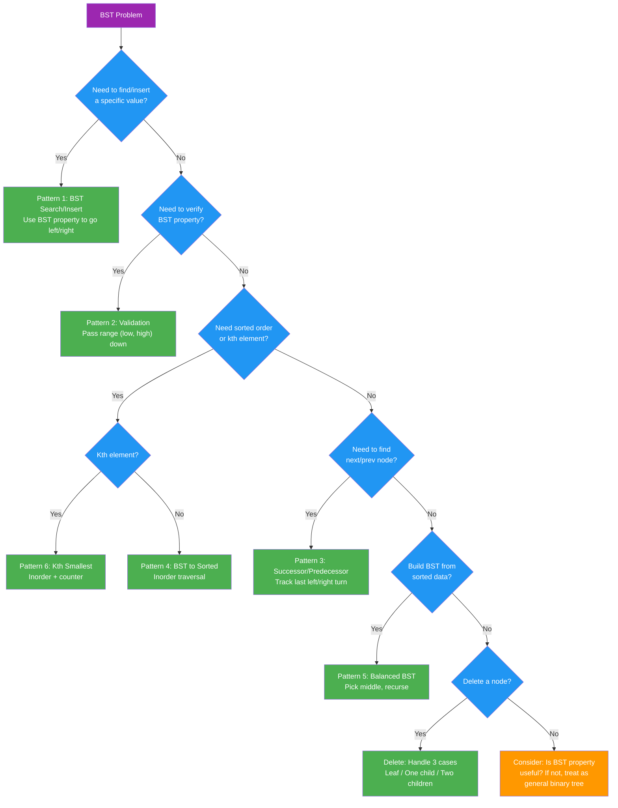

---

## 7. Day Schedule

### Day 26: BST Fundamentals + Core Problems

| Order | Problem | Difficulty | Pattern | Time |
|:-----:|---------|:----------:|---------|:----:|
| 1 | Search in BST (LC 700) | Easy | BST Search | 10 min |
| 2 | Minimum Absolute Diff (LC 530) | Easy | Inorder | 15 min |
| 3 | Range Sum of BST (LC 938) | Easy | DFS | 15 min |
| 4 | Sorted Array to BST (LC 108) | Easy | Divide & Conquer | 15 min |
| 5 | Validate BST (LC 98) | Medium | DFS with Range | 20 min |
| 6 | Kth Smallest (LC 230) | Medium | Inorder | 20 min |
| 7 | Insert into BST (LC 701) | Medium | BST Insert | 15 min |

**Focus**: Master BST search/insert pattern, understand inorder = sorted property.

### Day 27: Advanced BST Operations + Hard Problems

| Order | Problem | Difficulty | Pattern | Time |
|:-----:|---------|:----------:|---------|:----:|
| 1 | Delete Node BST (LC 450) | Medium | BST Delete | 25 min |
| 2 | Inorder Successor (LC 285) | Medium | BST Property | 20 min |
| 3 | LCA in BST (LC 235) | Medium | BST Property | 15 min |
| 4 | BST Iterator (LC 173) | Medium | Controlled Inorder | 20 min |
| 5 | Recover BST (LC 99) | Hard | Inorder | 30 min |
| 6 | Count Smaller After Self (LC 315) | Hard | BST/BIT | 35 min |
| 7 | Serialize/Deserialize BST (LC 449) | Hard | BST Property | 25 min |

**Focus**: Delete operation (3 cases), leveraging BST property for efficiency, hard pattern recognition.

---

## Quick Reference Card

```
BST Essentials:
  - left < root < right (for ALL nodes, not just immediate children)
  - Inorder traversal = sorted order
  - Average operations: O(log n), Worst: O(n)

Interview Tips:
  1. Always ask: "Can I use the BST property here?"
  2. Inorder traversal solves most BST problems
  3. For validation, pass range (low, high) -- do NOT just check left < root < right
  4. BST delete has 3 cases - know them cold
  5. Balanced BST from sorted data = always pick middle
```
