# Heap - Day 28

## 1. What is a Heap?

A **heap** is a **complete binary tree** stored as an array that satisfies the **heap property**:

- **Max-Heap**: Every parent node is **greater than or equal to** its children.
- **Min-Heap**: Every parent node is **less than or equal to** its children.

**Complete Binary Tree** means every level is fully filled except possibly the last, which is filled from left to right. This property allows us to store the tree efficiently in an array with no gaps.

### Min-Heap Example

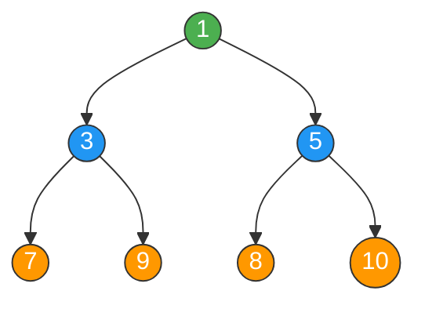

### Array Representation

```
Index:  [0]  [1]  [2]  [3]  [4]  [5]  [6]
Value:   1    3    5    7    9    8    10
         ^    ^    ^
         |    |    |
        root  |    |
          left  right
          child child
          of 0  of 0
```

### Max-Heap Example

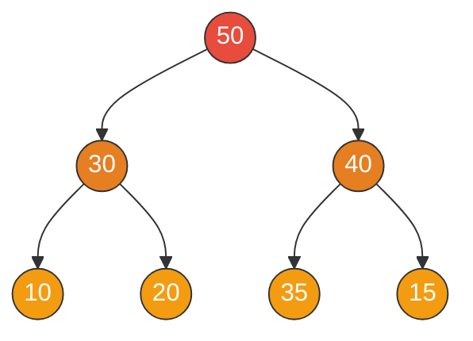

### Min-Heap vs Max-Heap at a Glance

| Property | Min-Heap | Max-Heap |
|----------|----------|----------|
| Root | Smallest element | Largest element |
| Parent vs Children | Parent <= Children | Parent >= Children |
| Python `heapq` | Default behavior | Negate values trick |
| Use case | Find minimum quickly | Find maximum quickly |

---

## 2. How It Works

### Parent-Child Index Relationships

For a node at index `i` (0-indexed):

```
Parent Index     = (i - 1) // 2
Left Child Index  = 2 * i + 1
Right Child Index = 2 * i + 2
```

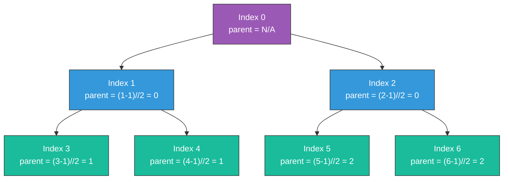

### Sift Up (Used During Insert)

When we insert a new element, we place it at the end of the array and **bubble it up** by comparing with its parent. If it violates the heap property, we swap.

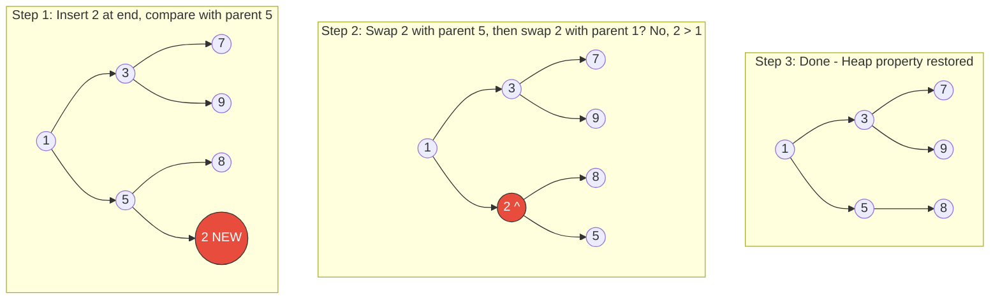

### Sift Down (Used During Extract)

When we extract the root, we replace it with the last element and **push it down** by swapping with the smaller (min-heap) or larger (max-heap) child.

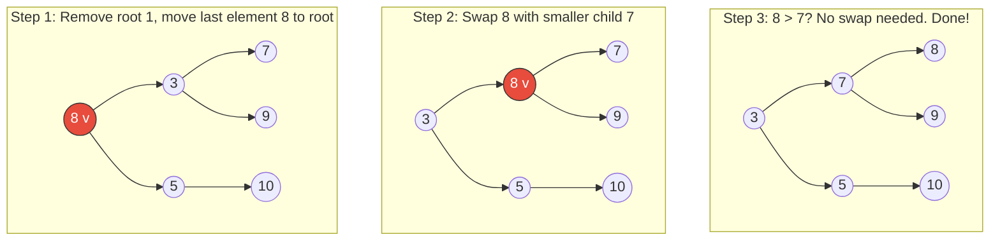

---

## 3. Python `heapq` Module

Python's `heapq` module implements a **min-heap** by default. There is no built-in max-heap, but we can simulate one by negating values.

### Core Operations

```python
import heapq

# --- Min-Heap (default) ---
heap = []
heapq.heappush(heap, 5)       # Push element
heapq.heappush(heap, 3)
heapq.heappush(heap, 7)
print(heap)                     # [3, 5, 7]

val = heapq.heappop(heap)      # Pop smallest -> 3
val = heap[0]                   # Peek smallest (don't pop) -> 5

# --- Build heap from existing list (in-place, O(n)) ---
nums = [5, 3, 7, 1, 9]
heapq.heapify(nums)             # nums is now a valid min-heap
print(nums)                     # [1, 3, 7, 5, 9]

# --- Push and Pop in one operation ---
val = heapq.heapreplace(heap, 4)  # Pop smallest, then push 4
val = heapq.heappushpop(heap, 2)  # Push 2, then pop smallest (faster)

# --- Top-K helpers ---
heapq.nlargest(3, nums)         # 3 largest elements -> [9, 7, 5]
heapq.nsmallest(3, nums)        # 3 smallest elements -> [1, 3, 5]
```

### Max-Heap Trick (Negate Values)

```python
import heapq

# Simulate max-heap by pushing negative values
max_heap = []
for val in [5, 3, 7, 1, 9]:
    heapq.heappush(max_heap, -val)

largest = -heapq.heappop(max_heap)   # 9
second  = -heapq.heappop(max_heap)   # 7
```

### Heap with Tuples (Priority Queue Style)

```python
import heapq

# Tuples are compared element by element
# (priority, data)
tasks = []
heapq.heappush(tasks, (2, "low priority"))
heapq.heappush(tasks, (1, "high priority"))
heapq.heappush(tasks, (3, "lowest priority"))

priority, task = heapq.heappop(tasks)  # (1, "high priority")
```

---

## 4. Operations & Time Complexities

| Operation | Time Complexity | Description |
|-----------|:-:|-------------|
| `heappush` (Insert) | **O(log n)** | Add element, sift up |
| `heappop` (Extract Min/Max) | **O(log n)** | Remove root, sift down |
| `heap[0]` (Peek) | **O(1)** | Access root without removal |
| `heapify` (Build Heap) | **O(n)** | Convert list to heap in-place |
| `heapreplace` | **O(log n)** | Pop then push (combined) |
| `heappushpop` | **O(log n)** | Push then pop (optimized) |
| `nlargest(k)` | **O(n log k)** | Find k largest elements |
| `nsmallest(k)` | **O(n log k)** | Find k smallest elements |

**Space Complexity**: O(n) for storing n elements.

### Why is `heapify` O(n) and not O(n log n)?

Building a heap bottom-up means most nodes are near the leaves and need very few swaps. The math works out to O(n) total swaps across all nodes, not O(log n) per node.

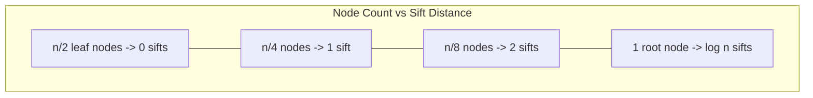

**Total work** = n/4 * 1 + n/8 * 2 + n/16 * 3 + ... = **O(n)**

---

## 5. Key Patterns

### Pattern 1: Top-K Elements (Medium)

**When to use**: "Find k largest/smallest/most frequent elements."

**Strategy**: Maintain a **min-heap of size K**. For each element, push it. If heap size exceeds K, pop the smallest. At the end, the heap contains the K largest.

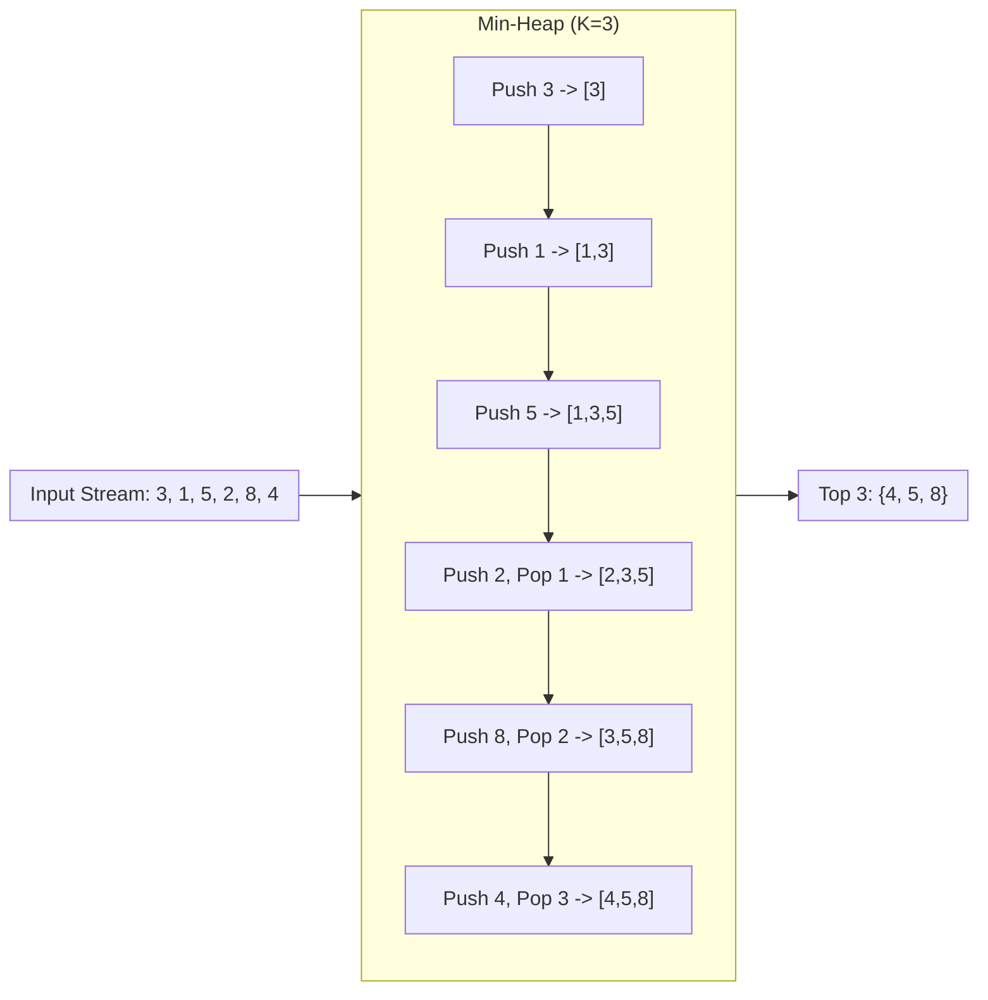

```python
def top_k_largest(nums, k):
    heap = []
    for num in nums:
        heapq.heappush(heap, num)
        if len(heap) > k:
            heapq.heappop(heap)  # Remove smallest
    return heap  # Contains k largest
```

**Problems**: LC 215, LC 347, LC 703

---

### Pattern 2: Merge K Sorted (Hard)

**When to use**: "Merge K sorted lists/arrays/streams."

**Strategy**: Use a min-heap to always track the **smallest unprocessed element** across all K lists. Pop the smallest, then push the next element from that same list.

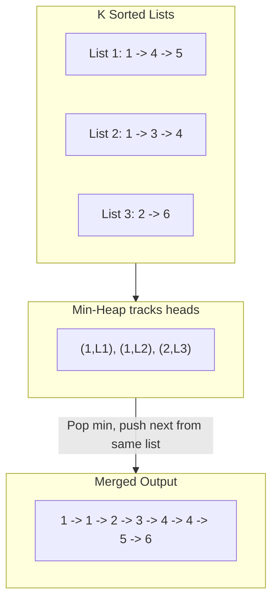

**Time**: O(N log K) where N = total elements, K = number of lists

**Problems**: LC 23, LC 632

---

### Pattern 3: Two Heaps / Median (Hard)

**When to use**: "Find median in a stream", "Balance two halves."

**Strategy**: Maintain two heaps:
- **Max-heap** (negate values) for the **lower half**
- **Min-heap** for the **upper half**

Keep them balanced so the median is always at one or both roots.

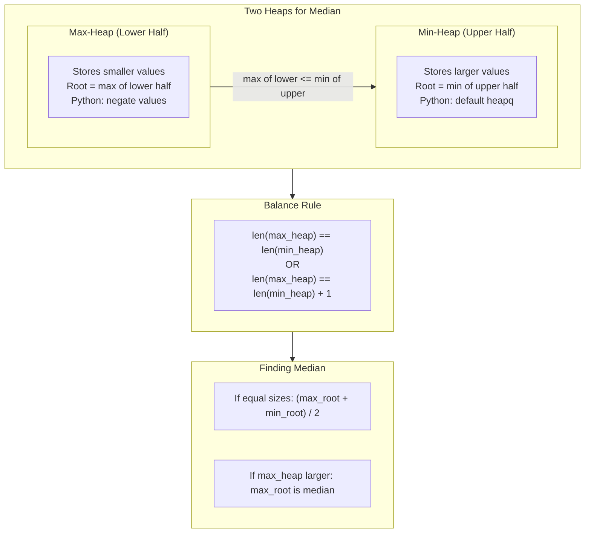

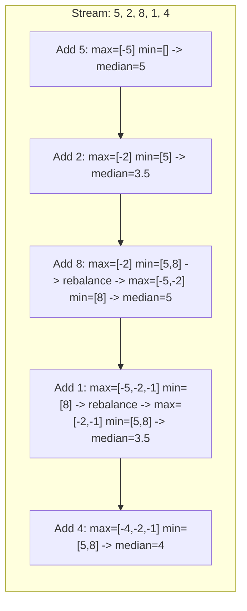

**Problems**: LC 295, LC 480

---

### Pattern 4: Priority Queue (Medium)

**When to use**: "Schedule tasks by priority", "Process elements in a specific order."

**Strategy**: Use heap as a priority queue where elements are processed by their priority value. Tuples `(priority, data)` make this natural in Python.

```python
import heapq

# Task scheduler
tasks = [(3, "email"), (1, "urgent_bug"), (2, "code_review")]
heapq.heapify(tasks)

while tasks:
    priority, task = heapq.heappop(tasks)
    print(f"Processing: {task} (priority {priority})")
# Output: urgent_bug, code_review, email
```

**Problems**: LC 767, LC 621

---

### Pattern 5: Heap Sort (Medium)

**When to use**: "Sort with O(n log n) guaranteed", "Sort a nearly sorted array."

**Strategy**: Build a heap from the array, then repeatedly extract the min/max.

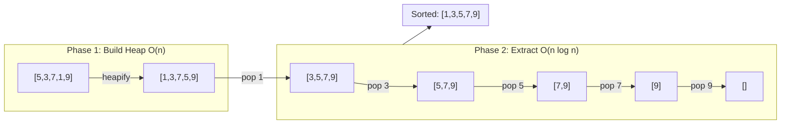

**For nearly sorted arrays (k-sorted)**: Use a heap of size K+1 for O(n log k) sorting.

**Problems**: LC 658 variant

---

## 6. Which Pattern to Use?

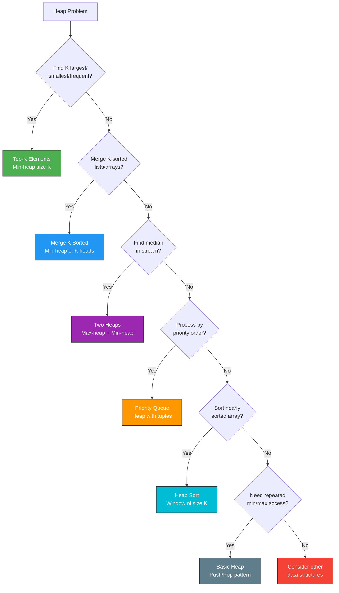

### Quick Reference

| Signal in Problem | Pattern | Heap Type |
|---|---|---|
| "K largest" / "K most frequent" | Top-K | Min-heap of size K |
| "K smallest" | Top-K | Max-heap of size K |
| "Merge K sorted" | Merge K Sorted | Min-heap of K elements |
| "Median" / "balance two halves" | Two Heaps | Max-heap + Min-heap |
| "Priority" / "schedule" / "order" | Priority Queue | Min-heap with tuples |
| "Nearly sorted" / "K-sorted" | Heap Sort | Min-heap of size K |
| "Continuously find min/max" | Basic Heap | Min or Max heap |

---

## 7. Day Schedule

### Day 28: Heaps

| # | Problem | Difficulty | Pattern | Time |
|---|---------|:---:|---------|------|
| 1 | Last Stone Weight (LC 1046) | Easy | Max Heap | 10 min |
| 2 | Kth Largest in Stream (LC 703) | Easy | Min Heap | 12 min |
| 3 | Relative Ranks (LC 506) | Easy | Heap/Sort | 10 min |
| 4 | Kth Largest Element (LC 215) | Medium | Min Heap | 12 min |
| 5 | Top K Frequent Elements (LC 347) | Medium | Heap | 15 min |
| 6 | Sort Nearly Sorted Array (LC 658 variant) | Medium | Heap Sort | 12 min |
| 7 | Reorganize String (LC 767) | Medium | Max Heap | 15 min |
| 8 | Merge K Sorted Lists (LC 23) | Hard | Merge K Sorted | 20 min |
| 9 | Find Median from Data Stream (LC 295) | Hard | Two Heaps | 20 min |
| 10 | Smallest Range (LC 632) | Hard | Heap + Sliding Window | 25 min |

**Total estimated time: ~2.5 hours**

**Suggested order**: Start with Easy problems to warm up, then Medium for pattern practice, then Hard for deep understanding. If short on time, prioritize: LC 215, LC 347, LC 295, LC 23.
