# Greedy Algorithms

## Days 29-30 | 40-Day DSA Study Guide

---

## 1. What is Greedy?

A **greedy algorithm** makes the **locally optimal choice** at each step, hoping that these local choices lead to a **globally optimal** solution. Unlike dynamic programming, greedy never reconsiders past choices.

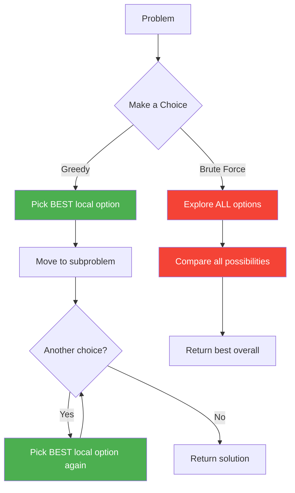

### Core Idea

```
Greedy = Make the best choice RIGHT NOW + Never look back
```

**Key Properties:**
1. **Greedy Choice Property** -- A globally optimal solution can be arrived at by making locally optimal choices.
2. **Optimal Substructure** -- An optimal solution to the problem contains optimal solutions to subproblems.

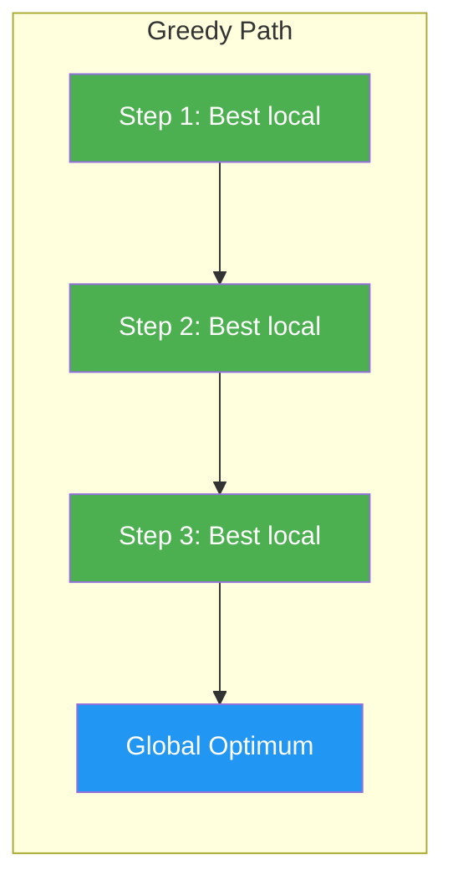

---

## 2. Greedy vs Dynamic Programming

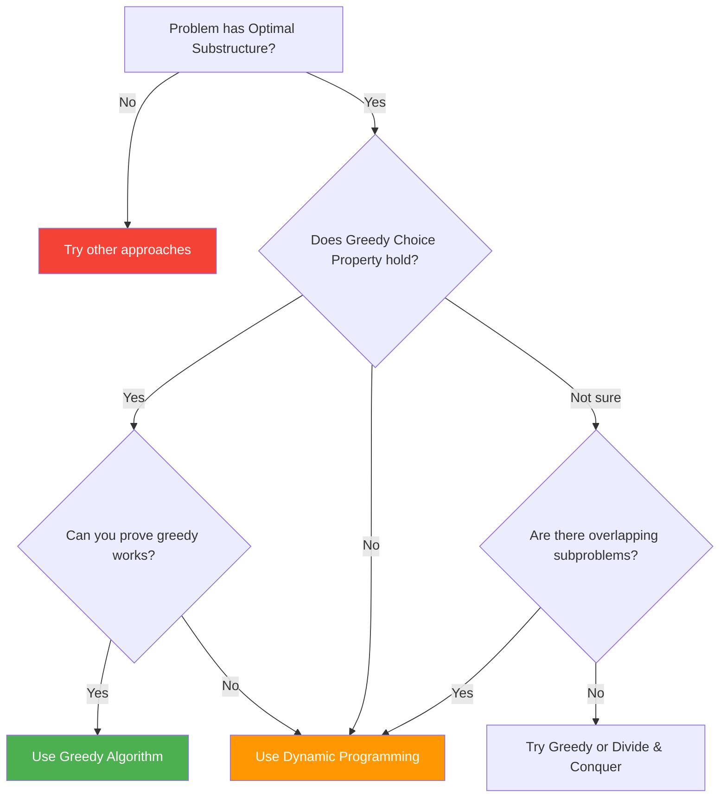

| Feature | Greedy | Dynamic Programming |
|---------|--------|-------------------|
| **Approach** | Top-down, one path | Bottom-up or top-down, all paths |
| **Choices** | Make best local choice | Consider all choices |
| **Subproblems** | One subproblem after choice | Many overlapping subproblems |
| **Revisits?** | Never looks back | Stores and reuses results |
| **Speed** | Usually O(n log n) or O(n) | Usually O(n^2) or more |
| **Correctness** | Must prove it works | Always finds optimal |
| **Example** | Fractional Knapsack | 0/1 Knapsack |

### Classic Comparison: Knapsack

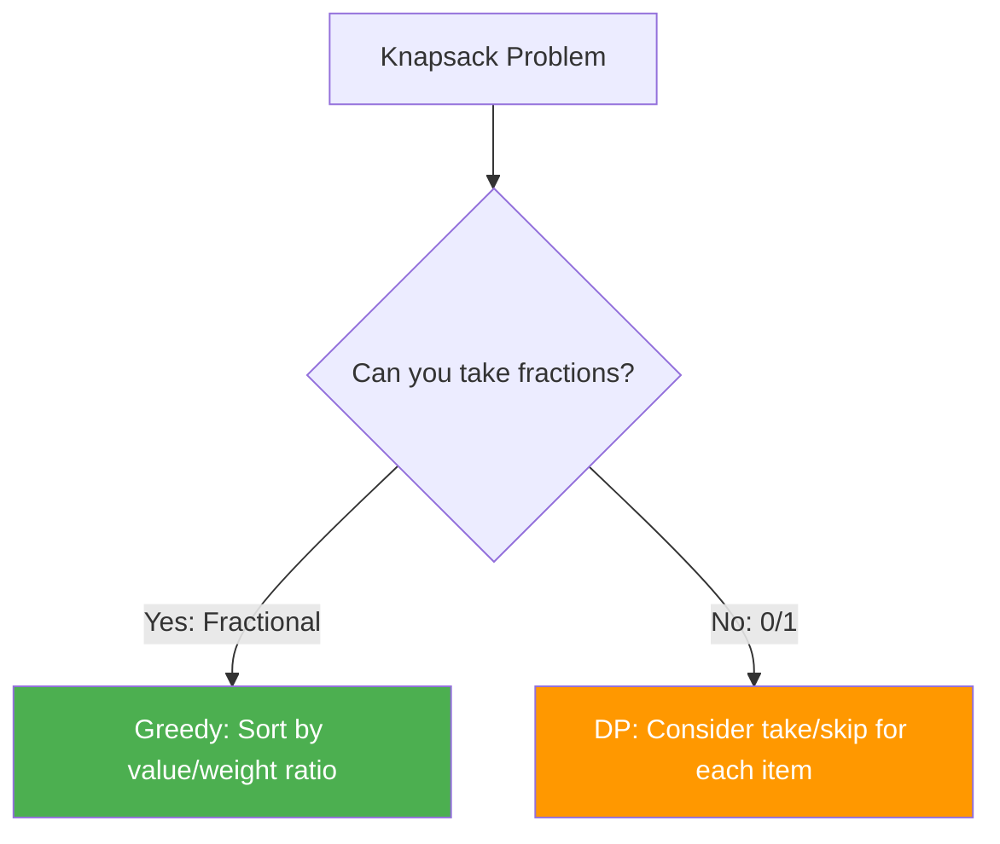

---

## 3. How to Prove Greedy Works

### Method 1: Exchange Argument

> If swapping any element in the optimal solution with the greedy choice does NOT make the solution worse, then greedy works.

```
1. Assume an optimal solution O that differs from greedy solution G.
2. Find the first point where they differ.
3. Show that swapping O's choice with G's choice does not worsen the solution.
4. Repeat until O = G. Therefore, G is also optimal.
```

### Method 2: Greedy Stays Ahead

> Show that at every step, the greedy solution is at least as good as any other solution.

```
1. Define a measure of progress (e.g., number of activities selected).
2. Show by induction that after each greedy step, greedy's measure >= any other algorithm's measure.
3. Therefore, greedy's final answer >= any other answer.
```

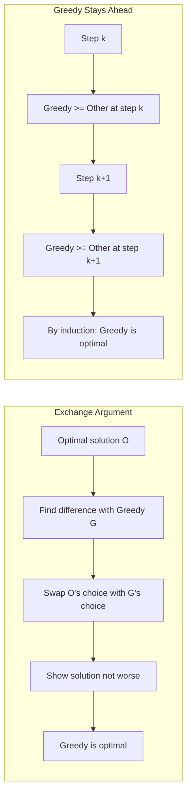

---

## 4. Key Patterns

---

### Pattern 1: Activity / Interval Selection (Medium)

**Idea:** Select the maximum number of non-overlapping activities.

**Strategy:** Sort by **end time**, always pick the activity that finishes earliest.

```mermaid
gantt
    title Activity Selection - Sort by End Time
    dateFormat X
    axisFormat %s

    section Activities
    A (1-2)     :done, a, 1, 2
    B (0-3)     :crit, b, 0, 3
    C (2-4)     :done, c, 2, 4
    D (3-5)     :crit, d, 3, 5
    E (4-6)     :done, e, 4, 6
    F (5-7)     :crit, f, 5, 7
    G (6-8)     :done, g, 6, 8
```

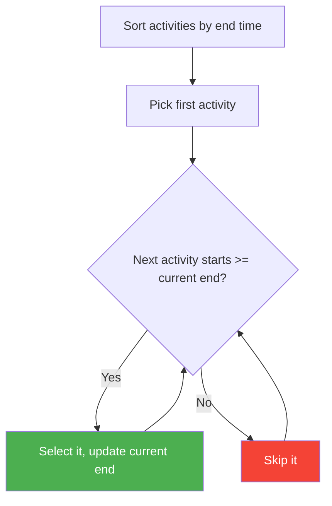

**Why it works:** By picking the earliest ending activity, we leave maximum room for future activities.

```python
def activity_selection(activities):
    # Sort by end time
    activities.sort(key=lambda x: x[1])
    selected = [activities[0]]
    last_end = activities[0][1]

    for start, end in activities[1:]:
        if start >= last_end:
            selected.append((start, end))
            last_end = end

    return selected
```

**Time:** O(n log n) for sorting | **Space:** O(1) extra

---

### Pattern 2: Fractional Knapsack (Medium)

**Idea:** Maximize value in a knapsack where items can be broken into fractions.

**Strategy:** Sort by **value/weight ratio** (descending), take as much of the best item as possible.

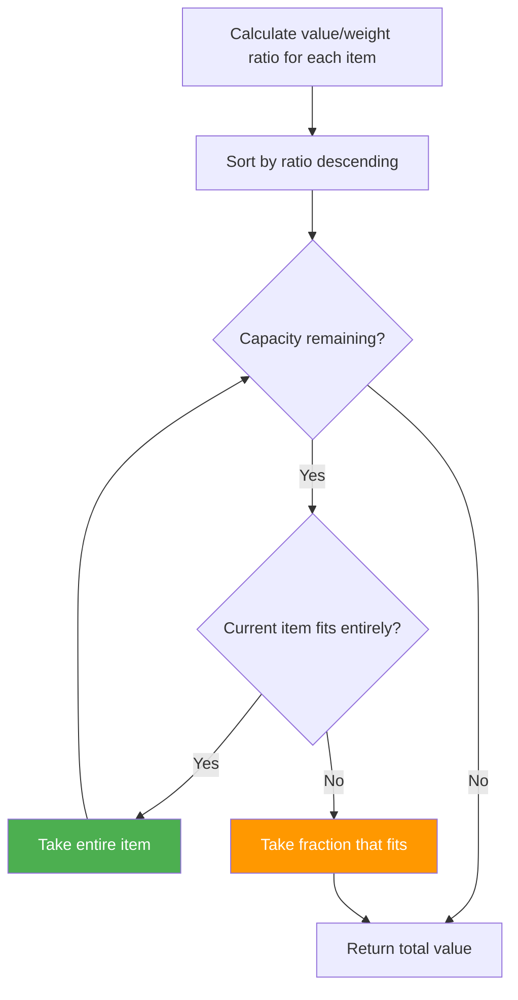

```python
def fractional_knapsack(items, capacity):
    # items = [(value, weight), ...]
    # Sort by value/weight ratio descending
    items.sort(key=lambda x: x[0]/x[1], reverse=True)

    total_value = 0
    for value, weight in items:
        if capacity >= weight:
            total_value += value
            capacity -= weight
        else:
            total_value += value * (capacity / weight)
            break

    return total_value
```

---

### Pattern 3: Huffman Coding (Medium)

**Idea:** Build an optimal prefix-free binary code. Characters with higher frequency get shorter codes.

**Strategy:** Repeatedly merge the two lowest-frequency nodes.

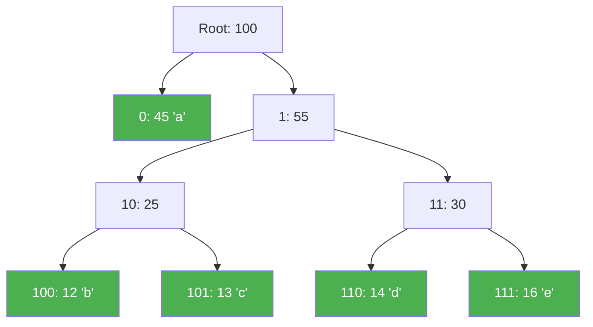

```
Character | Freq | Huffman Code
----------|------|-------------
    a     |  45  |     0
    b     |  12  |    100
    c     |  13  |    101
    d     |  14  |    110
    e     |  16  |    111
```

```python
import heapq

def huffman_coding(freq_map):
    heap = [[freq, [char, ""]] for char, freq in freq_map.items()]
    heapq.heapify(heap)

    while len(heap) > 1:
        lo = heapq.heappop(heap)
        hi = heapq.heappop(heap)
        for pair in lo[1:]:
            pair[1] = '0' + pair[1]
        for pair in hi[1:]:
            pair[1] = '1' + pair[1]
        heapq.heappush(heap, [lo[0] + hi[0]] + lo[1:] + hi[1:])

    return sorted(heapq.heappop(heap)[1:], key=lambda p: (len(p[1]), p))
```

---

### Pattern 4: Jump Game (Medium)

**Idea:** Track the **farthest reachable** index at each position.

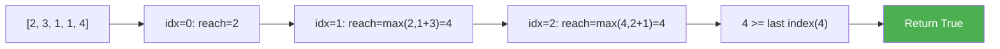

```python
def can_jump(nums):
    farthest = 0
    for i in range(len(nums)):
        if i > farthest:
            return False
        farthest = max(farthest, i + nums[i])
    return True
```

---

### Pattern 5: Gas Station / Circular Tour (Medium)

**Idea:** Find starting station for a circular trip. If total gas >= total cost, a solution always exists.

**Strategy:** Track cumulative surplus. If it drops below 0, restart from the next station.

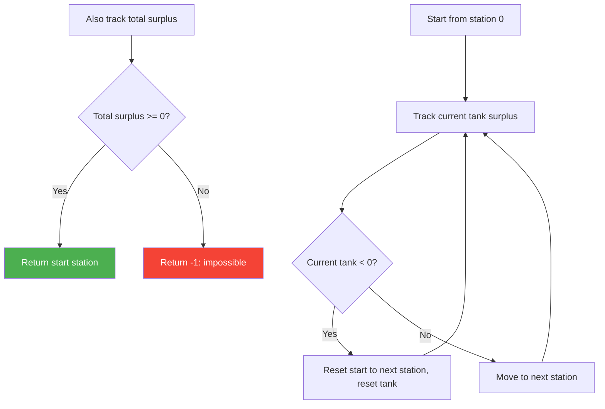

```python
def gas_station(gas, cost):
    if sum(gas) < sum(cost):
        return -1

    start = 0
    tank = 0
    for i in range(len(gas)):
        tank += gas[i] - cost[i]
        if tank < 0:
            start = i + 1
            tank = 0

    return start
```

---

### Pattern 6: Job Sequencing with Deadlines (Medium)

**Idea:** Schedule jobs to maximize profit. Each job has a deadline and profit; each job takes 1 unit of time.

**Strategy:** Sort by profit (descending), assign each job to the latest available slot before its deadline.

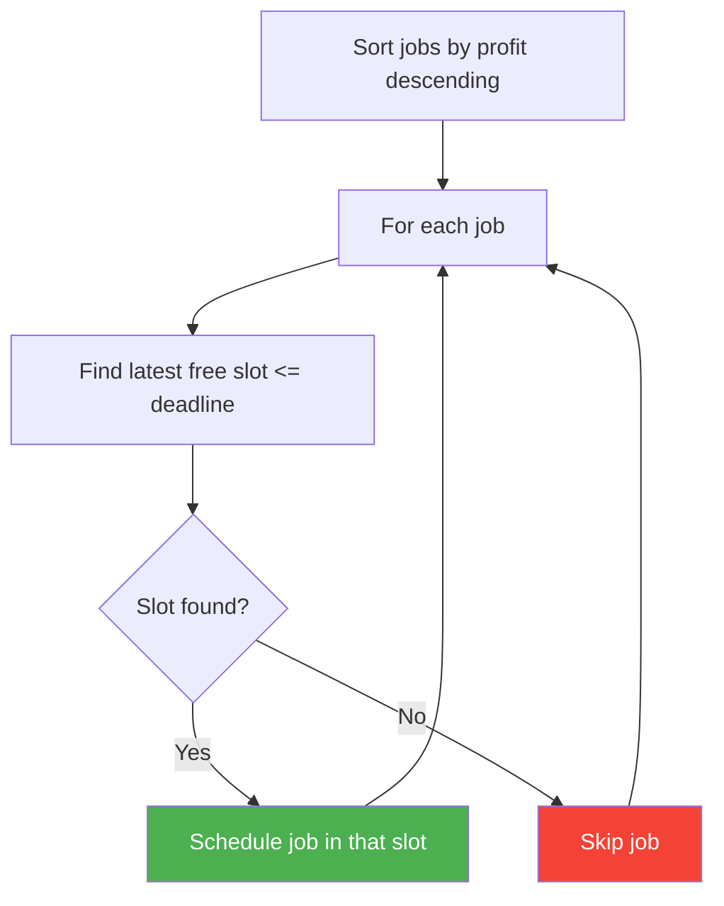

```python
def job_sequencing(jobs):
    # jobs = [(id, deadline, profit), ...]
    jobs.sort(key=lambda x: x[2], reverse=True)
    max_deadline = max(j[1] for j in jobs)
    slots = [-1] * (max_deadline + 1)

    count = 0
    total_profit = 0
    for job_id, deadline, profit in jobs:
        for slot in range(deadline, 0, -1):
            if slots[slot] == -1:
                slots[slot] = job_id
                count += 1
                total_profit += profit
                break

    return count, total_profit
```

---

## 5. Which Pattern to Use?

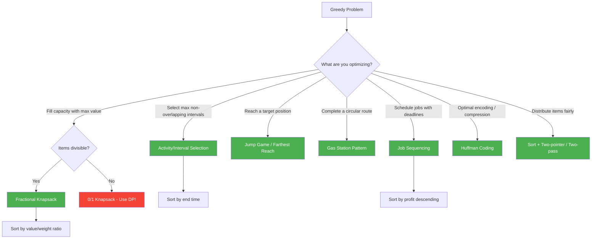

---

## 6. Common Mistakes

### Mistake 1: Applying Greedy When DP is Needed

```
Problem: 0/1 Knapsack (items cannot be split)
Wrong:   Greedy by value/weight ratio -> may miss optimal
Right:   DP considering take/skip for each item

Example: capacity=50
Items: (value=60, weight=10), (value=100, weight=20), (value=120, weight=30)
Greedy (by ratio): takes item1 + item2 = 160
DP optimal: takes item2 + item3 = 220
```

### Mistake 2: Not Proving Greedy Choice Property

Before coding, ask yourself:
- "Can I always safely make this local choice?"
- "Is there a counterexample where greedy fails?"

### Mistake 3: Wrong Sorting Criteria

| Problem | Wrong Sort | Right Sort |
|---------|-----------|------------|
| Interval scheduling | By start time | By **end time** |
| Fractional knapsack | By value only | By **value/weight ratio** |
| Job sequencing | By deadline | By **profit** (descending) |

### Mistake 4: Forgetting Edge Cases

- Empty input
- Single element
- All elements are the same
- Already sorted input (ascending or descending)

---

## 7. Day Schedule

### Day 29: Greedy Fundamentals

| Order | Problem | Difficulty | Pattern | Time |
|-------|---------|-----------|---------|------|
| 1 | Assign Cookies (LC 455) | Easy | Sort + Greedy | 10 min |
| 2 | Lemonade Change (LC 860) | Easy | Greedy simulation | 10 min |
| 3 | Maximum Units on Truck (LC 1710) | Easy | Sort + Greedy | 10 min |
| 4 | Non-overlapping Intervals (LC 435) | Medium | Interval Greedy | 20 min |
| 5 | Jump Game (LC 55) | Medium | Farthest reach | 20 min |
| 6 | Gas Station (LC 134) | Medium | Circular greedy | 20 min |

### Day 30: Advanced Greedy

| Order | Problem | Difficulty | Pattern | Time |
|-------|---------|-----------|---------|------|
| 1 | Partition Labels (LC 763) | Medium | Greedy intervals | 20 min |
| 2 | Task Scheduler (LC 621) | Medium | Greedy counting | 25 min |
| 3 | Minimum Platforms (Classic) | Medium | Sort + sweep | 20 min |
| 4 | Job Sequencing (GFG) | Hard | Greedy + slots | 25 min |
| 5 | Candy (LC 135) | Hard | Two-pass greedy | 25 min |
| 6 | Min Cost to Cut Stick (LC 1547) | Hard | Greedy/DP | 30 min |

---

## Quick Reference

```
Greedy Template:
1. SORT the input by some criteria
2. ITERATE and make locally optimal choice
3. NEVER revisit past choices

Common Sorts:
- Intervals -> by end time
- Items with value -> by value/weight ratio
- Jobs with deadlines -> by profit descending
- Generic -> by the metric you're optimizing
```
