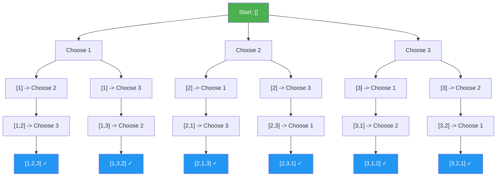
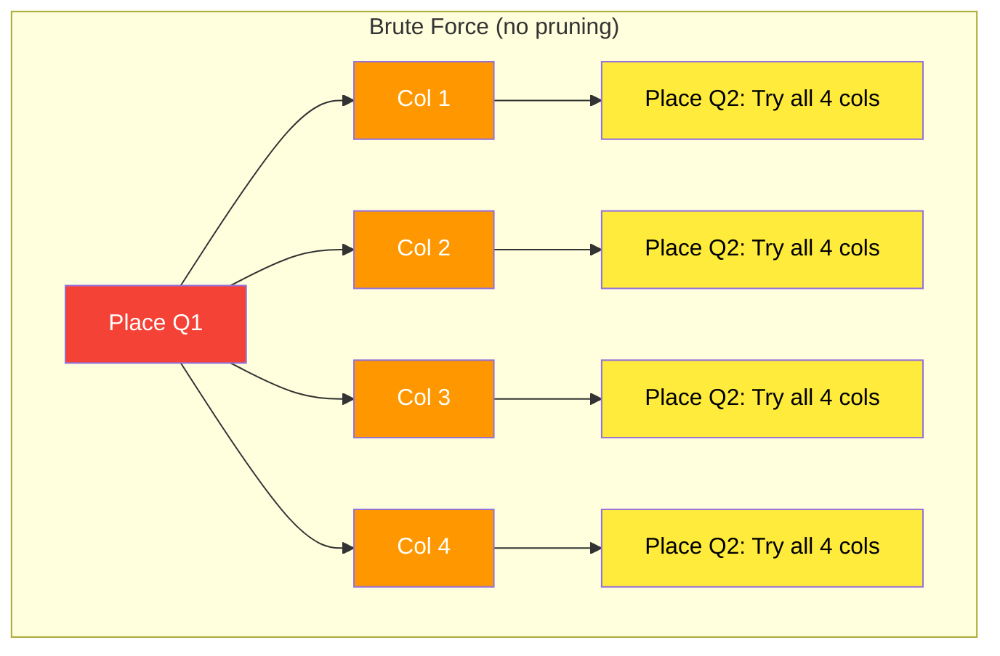
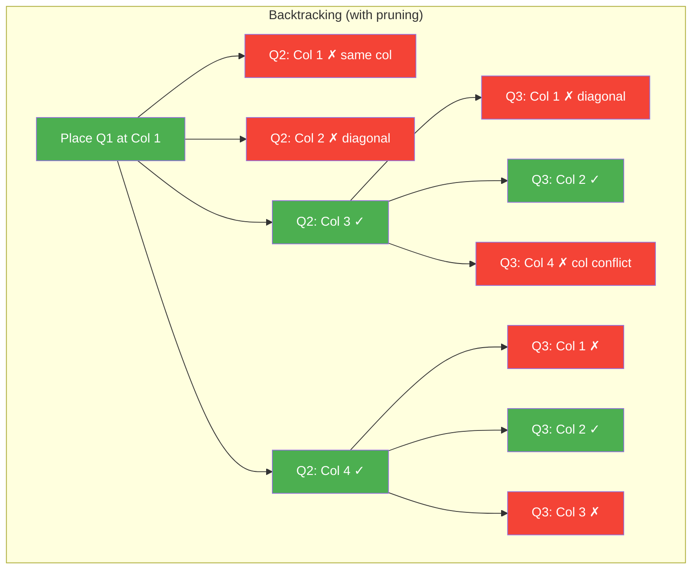
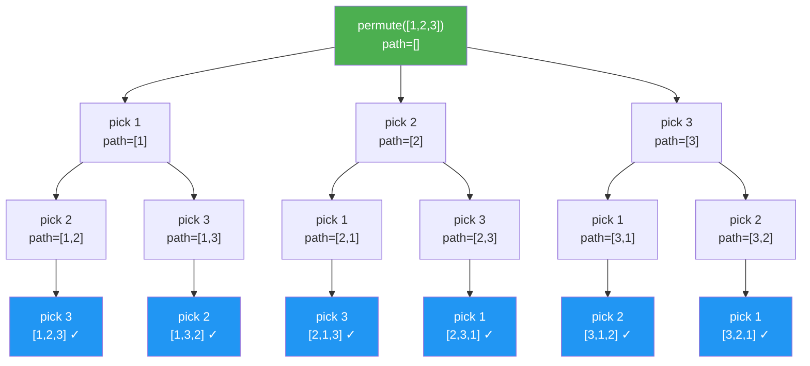
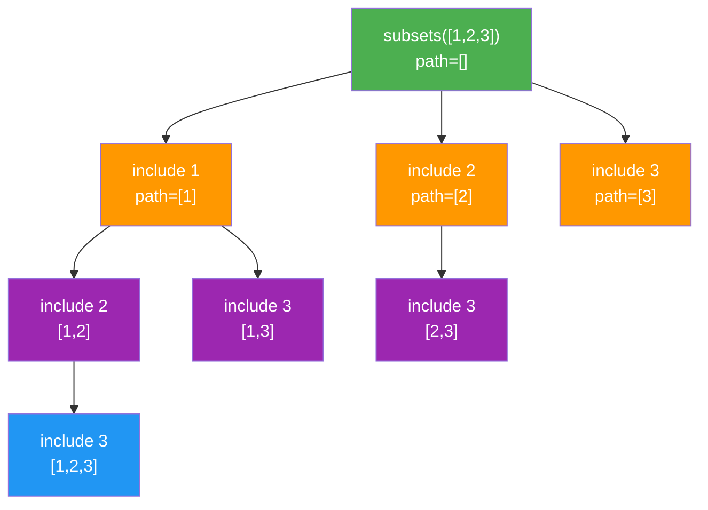
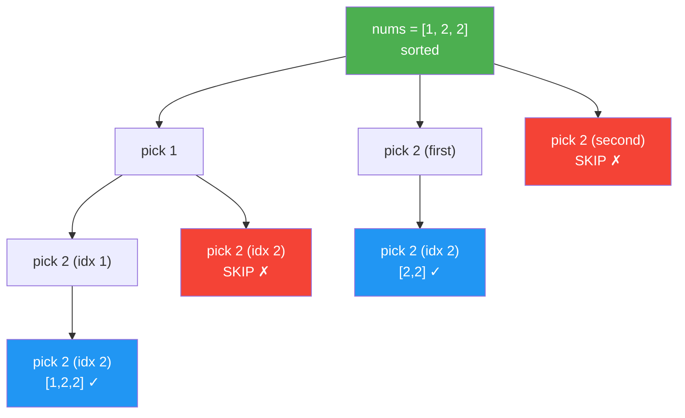
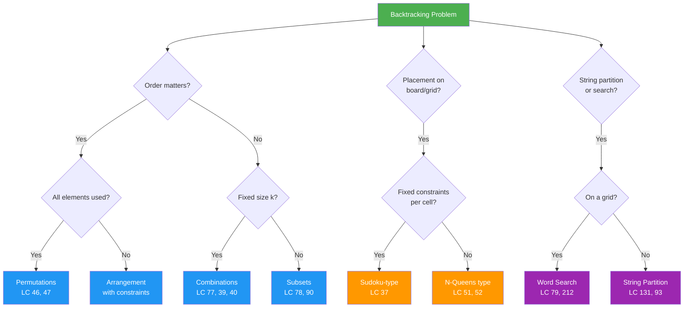

# Backtracking - Days 31-32

## 1. What is Backtracking?

**Backtracking** is a systematic way to explore all possible candidates for a solution. It builds solutions incrementally, one piece at a time, and abandons ("backtracks") a candidate as soon as it determines the candidate cannot lead to a valid solution.

The core idea is the **choose-explore-unchoose** pattern:

1. **Choose** - Make a decision (pick an element, place a queen, fill a cell)
2. **Explore** - Recurse to build on that decision
3. **Unchoose** - Undo the decision and try the next option

```python
def backtrack(state, choices):
    if is_solution(state):
        result.append(state.copy())  # Found a valid solution
        return

    for choice in choices:
        if is_valid(choice, state):   # Prune invalid branches
            make_choice(state, choice)       # Choose
            backtrack(state, next_choices)    # Explore
            undo_choice(state, choice)       # Unchoose
```



> The tree above shows generating all permutations of `[1,2,3]`. At each level we **choose** an unused element, **explore** deeper, then **unchoose** (backtrack) to try the next sibling.

---

## 2. Backtracking vs Brute Force

**Brute force** generates every possible candidate, even obviously invalid ones. **Backtracking** prunes entire subtrees early when it detects a constraint violation.

| Aspect | Brute Force | Backtracking |
|--------|-------------|--------------|
| Explores | All possibilities | Only promising paths |
| Pruning | None | Cuts invalid branches early |
| Efficiency | O(n!) or worse | Often much better in practice |
| Example | Try all queen placements, check at end | Skip column/diagonal conflicts immediately |





> With pruning, entire branches are eliminated early. Instead of checking `4^4 = 256` combinations for 4-Queens, backtracking explores far fewer nodes.

---

## 3. General Backtracking Template

### Template for collecting all solutions:

```python
def solve(problem):
    result = []

    def backtrack(path, choices):
        # Base case: found a valid solution
        if is_complete(path):
            result.append(path[:])  # Save a COPY of current path
            return

        for i, choice in enumerate(choices):
            # Pruning: skip invalid choices
            if not is_valid(choice, path):
                continue

            # Choose
            path.append(choice)

            # Explore (recurse with remaining/updated choices)
            backtrack(path, get_next_choices(choices, i))

            # Unchoose (backtrack)
            path.pop()

    backtrack([], initial_choices)
    return result
```

### Template for finding one solution (e.g., Sudoku):

```python
def solve(problem):
    def backtrack(state):
        # Base case: all positions filled
        if is_complete(state):
            return True

        pos = find_next_empty(state)
        for choice in get_choices(pos):
            if is_valid(choice, pos, state):
                place(choice, pos, state)        # Choose
                if backtrack(state):              # Explore
                    return True                   # Found solution!
                remove(choice, pos, state)        # Unchoose

        return False  # No valid choice -> backtrack

    backtrack(initial_state)
```

---

## 4. Key Patterns

### Pattern A: Permutations

Generate all arrangements of elements where **order matters** and every element is used exactly once.

**Key idea**: At each position, try each unused element.

```python
def permute(nums):
    result = []

    def backtrack(path, used):
        if len(path) == len(nums):
            result.append(path[:])
            return

        for i in range(len(nums)):
            if used[i]:
                continue
            used[i] = True          # Choose
            path.append(nums[i])
            backtrack(path, used)    # Explore
            path.pop()              # Unchoose
            used[i] = False

    backtrack([], [False] * len(nums))
    return result
```



**Time**: O(n! * n) | **Space**: O(n) for recursion stack

---

### Pattern B: Combinations / Subsets

Generate groups where **order does not matter**. Use a `start` index to avoid duplicates.

**Subsets** - collect at every node. **Combinations** - collect only when size == k.

```python
# Subsets
def subsets(nums):
    result = []

    def backtrack(start, path):
        result.append(path[:])  # Every node is a valid subset

        for i in range(start, len(nums)):
            path.append(nums[i])          # Choose
            backtrack(i + 1, path)         # Explore (i+1, not i)
            path.pop()                     # Unchoose

    backtrack(0, [])
    return result


# Combinations (choose k from n)
def combine(n, k):
    result = []

    def backtrack(start, path):
        if len(path) == k:
            result.append(path[:])
            return

        for i in range(start, n + 1):
            path.append(i)
            backtrack(i + 1, path)
            path.pop()

    backtrack(1, [])
    return result
```

**Handling duplicates** (e.g., Subsets II): Sort first, then skip consecutive duplicates at the same level.

```python
def subsets_with_dup(nums):
    nums.sort()
    result = []

    def backtrack(start, path):
        result.append(path[:])

        for i in range(start, len(nums)):
            # Skip duplicates at same recursion level
            if i > start and nums[i] == nums[i - 1]:
                continue
            path.append(nums[i])
            backtrack(i + 1, path)
            path.pop()

    backtrack(0, [])
    return result
```



> Each node in the tree is a valid subset. The `start` index ensures we only pick elements after the current one, preventing duplicate subsets like `[2,1]` and `[1,2]`.

---

### Pattern C: N-Queens (Constraint Satisfaction)

Place N queens on an NxN board so that no two queens attack each other (same row, column, or diagonal).

**Key insight**: Place one queen per row. Track which columns and diagonals are occupied.

```python
def solve_n_queens(n):
    result = []
    cols = set()        # Occupied columns
    diag1 = set()       # Occupied main diagonals (row - col)
    diag2 = set()       # Occupied anti-diagonals (row + col)

    def backtrack(row, board):
        if row == n:
            result.append(["".join(r) for r in board])
            return

        for col in range(n):
            if col in cols or (row - col) in diag1 or (row + col) in diag2:
                continue  # Pruning!

            # Choose
            board[row][col] = "Q"
            cols.add(col)
            diag1.add(row - col)
            diag2.add(row + col)

            backtrack(row + 1, board)  # Explore next row

            # Unchoose
            board[row][col] = "."
            cols.remove(col)
            diag1.remove(row - col)
            diag2.remove(row + col)

    board = [["." for _ in range(n)] for _ in range(n)]
    backtrack(0, board)
    return result
```



```mermaid
graph TD
    subgraph "4-Queens: Solution 1"
        R0[".Q..<br>Row 0: Queen at col 1"]
        R1["...Q<br>Row 1: Queen at col 3"]
        R2["Q...<br>Row 2: Queen at col 0"]
        R3["..Q.<br>Row 3: Queen at col 2"]
        R0 --> R1 --> R2 --> R3
    end

    subgraph "4-Queens: Solution 2"
        S0["..Q.<br>Row 0: Queen at col 2"]
        S1["Q...<br>Row 1: Queen at col 0"]
        S2["...Q<br>Row 2: Queen at col 3"]
        S3[".Q..<br>Row 3: Queen at col 1"]
        S0 --> S1 --> S2 --> S3
    end

    style R0 fill:#4CAF50,color:white
    style R1 fill:#4CAF50,color:white
    style R2 fill:#4CAF50,color:white
    style R3 fill:#4CAF50,color:white
    style S0 fill:#2196F3,color:white
    style S1 fill:#2196F3,color:white
    style S2 fill:#2196F3,color:white
    style S3 fill:#2196F3,color:white
```

**Diagonal tracking trick**:
- Main diagonal (`\`): all cells on the same diagonal have the same `row - col` value
- Anti-diagonal (`/`): all cells on the same diagonal have the same `row + col` value

---

### Pattern D: Sudoku (Constraint Propagation + Backtracking)

Fill a 9x9 grid so each row, column, and 3x3 box contains digits 1-9 exactly once.

**Strategy**: Find an empty cell, try digits 1-9, validate constraints, recurse. If stuck, backtrack.

```python
def solve_sudoku(board):
    def is_valid(board, row, col, num):
        # Check row
        if num in board[row]:
            return False
        # Check column
        if any(board[r][col] == num for r in range(9)):
            return False
        # Check 3x3 box
        box_r, box_c = 3 * (row // 3), 3 * (col // 3)
        for r in range(box_r, box_r + 3):
            for c in range(box_c, box_c + 3):
                if board[r][c] == num:
                    return False
        return True

    def backtrack():
        for r in range(9):
            for c in range(9):
                if board[r][c] == ".":
                    for num in "123456789":
                        if is_valid(board, r, c, num):
                            board[r][c] = num       # Choose
                            if backtrack():          # Explore
                                return True
                            board[r][c] = "."        # Unchoose
                    return False  # No valid digit -> backtrack
        return True  # All cells filled

    backtrack()
```

---

### Pattern E: String Partitioning

Partition a string such that every substring satisfies a condition (e.g., palindrome).

**Key idea**: At each position, try all substrings starting there. If valid, recurse on the remainder.

```python
def partition(s):
    result = []

    def backtrack(start, path):
        if start == len(s):
            result.append(path[:])
            return

        for end in range(start + 1, len(s) + 1):
            substring = s[start:end]
            if substring == substring[::-1]:  # Is palindrome?
                path.append(substring)
                backtrack(end, path)
                path.pop()

    backtrack(0, [])
    return result
```

---

### Pattern F: Word Search in Grid

Search for a word in a 2D grid by moving to adjacent cells (up, down, left, right).

**Key idea**: DFS with backtracking. Mark visited cells to avoid reuse, unmark when backtracking.

```python
def exist(board, word):
    rows, cols = len(board), len(board[0])

    def backtrack(r, c, idx):
        if idx == len(word):
            return True
        if r < 0 or r >= rows or c < 0 or c >= cols:
            return False
        if board[r][c] != word[idx]:
            return False

        temp = board[r][c]
        board[r][c] = "#"  # Mark visited (choose)

        for dr, dc in [(0, 1), (0, -1), (1, 0), (-1, 0)]:
            if backtrack(r + dr, c + dc, idx + 1):
                return True

        board[r][c] = temp  # Restore (unchoose)
        return False

    for r in range(rows):
        for c in range(cols):
            if backtrack(r, c, 0):
                return True
    return False
```

---

## 5. Pruning Techniques

Pruning is what makes backtracking efficient. Without it, backtracking degenerates into brute force.

### Common Pruning Strategies

| Technique | When to Use | Example |
|-----------|-------------|---------|
| **Sort + skip duplicates** | Input has duplicates | Subsets II, Permutations II |
| **Constraint check** | Placement problems | N-Queens (col/diagonal sets) |
| **Remaining sum check** | Sum-based problems | "remaining < candidates[i], break" |
| **Used array** | Permutations | `used[i] = True/False` |
| **Start index** | Combinations/Subsets | Only pick elements after current |

### Sort + Skip Duplicates Pattern

```python
nums.sort()  # Sort first!

def backtrack(start, path):
    result.append(path[:])

    for i in range(start, len(nums)):
        # Skip duplicate at same level
        if i > start and nums[i] == nums[i - 1]:
            continue
        path.append(nums[i])
        backtrack(i + 1, path)
        path.pop()
```



> Without the skip, `[2]` would appear twice in the result (once starting from index 1, once from index 2). The `i > start` condition ensures we only skip duplicates at the **same recursion level**, not across levels.

### Early Termination for Sum Problems

```python
candidates.sort()

def backtrack(start, path, remaining):
    if remaining == 0:
        result.append(path[:])
        return

    for i in range(start, len(candidates)):
        if candidates[i] > remaining:
            break  # All future candidates are larger too (sorted!)
        path.append(candidates[i])
        backtrack(i, path, remaining - candidates[i])
        path.pop()
```

---

## 6. Which Pattern to Use?



### Quick Reference

| Problem Type | Key Signal | Template Variation |
|-------------|------------|-------------------|
| Permutations | "all arrangements", "ordering" | `used[]` array, no start index |
| Combinations | "choose k items", "sum to target" | `start` index, size/sum check |
| Subsets | "all subsets", "power set" | `start` index, collect every node |
| N-Queens | "place N items, no conflicts" | Row-by-row, col/diag sets |
| Sudoku | "fill grid with constraints" | Cell-by-cell, row/col/box check |
| Partitioning | "split string into valid parts" | Try all splits, validate each |
| Grid search | "find word/path in grid" | DFS + mark/unmark visited |

---

## 7. Common Mistakes

### Mistake 1: Forgetting to Unchoose

```python
# WRONG - state leaks between branches
def backtrack(path, choices):
    for choice in choices:
        path.append(choice)
        backtrack(path, remaining)
        # Missing: path.pop()

# CORRECT
def backtrack(path, choices):
    for choice in choices:
        path.append(choice)
        backtrack(path, remaining)
        path.pop()  # Undo the choice!
```

### Mistake 2: Saving Reference Instead of Copy

```python
# WRONG - all entries in result point to same list
result.append(path)

# CORRECT - save a snapshot
result.append(path[:])        # Shallow copy
result.append(list(path))     # Also works
result.append(path.copy())    # Also works
```

### Mistake 3: Not Handling Duplicates

```python
# Input [1, 2, 2] - without dedup, [2] appears twice

# CORRECT: sort + skip
nums.sort()
for i in range(start, len(nums)):
    if i > start and nums[i] == nums[i - 1]:
        continue  # Skip duplicate at same level
```

### Mistake 4: Wrong Index in Combination Sum

```python
# Elements can be reused: recurse with i (not i+1)
backtrack(i, path, remaining - candidates[i])

# Elements used once: recurse with i+1
backtrack(i + 1, path, remaining - candidates[i])
```

### Mistake 5: Inefficient Validity Checking

```python
# SLOW - checking entire board each time for N-Queens
def is_valid(board, row, col):
    for r in range(row):
        for c in range(len(board)):
            # O(n^2) per check

# FAST - using sets for O(1) lookup
cols = set()
diag1 = set()  # row - col
diag2 = set()  # row + col
```

---

## 8. Complexity Summary

| Problem | Time Complexity | Space Complexity |
|---------|----------------|-----------------|
| Permutations | O(n! * n) | O(n) |
| Subsets | O(2^n * n) | O(n) |
| Combinations (n choose k) | O(C(n,k) * k) | O(k) |
| N-Queens | O(n!) | O(n) |
| Sudoku | O(9^m) where m = empty cells | O(m) |
| Word Search | O(m * n * 4^L) where L = word length | O(L) |

---

## 9. Day Schedule

### Day 31 - Foundations + Easy/Medium

| Order | Problem | Difficulty | Key Concept |
|-------|---------|------------|-------------|
| 1 | Letter Case Permutation (LC 784) | Easy | Backtracking on strings |
| 2 | Binary Watch (LC 401) | Easy | Enumeration with constraints |
| 3 | Permutations (LC 46) | Medium | Core permutation pattern |
| 4 | Combination Sum (LC 39) | Medium | Reusable elements + sum target |
| 5 | Subsets II (LC 90) | Medium | Duplicate handling |

### Day 32 - Advanced + Hard

| Order | Problem | Difficulty | Key Concept |
|-------|---------|------------|-------------|
| 1 | Palindrome Partitioning (LC 131) | Medium | String partitioning |
| 2 | Generate Parentheses (LC 22) | Medium | Constraint-based generation |
| 3 | N-Queens (LC 51) | Hard | Board constraint satisfaction |
| 4 | Sudoku Solver (LC 37) | Hard | Full constraint propagation |
| 5 | Word Search II (LC 212) | Hard | Trie + backtracking on grid |
