# Graphs - Days 33-35

## 1. What is a Graph?

A **graph** is a data structure consisting of **vertices** (nodes) and **edges** (connections between nodes). Graphs model relationships between objects and are one of the most versatile data structures in computer science.

**Formal Definition**: A graph G = (V, E) where V is a set of vertices and E is a set of edges connecting pairs of vertices.

### Undirected Graph

Edges have **no direction**. If there's an edge between A and B, you can go both ways.

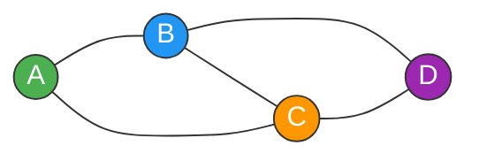

### Directed Graph (Digraph)

Edges have a **direction**. An edge from A to B does NOT mean you can go from B to A.

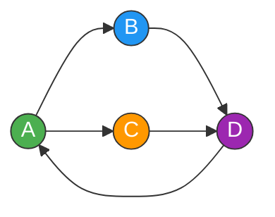

### Weighted Graph

Each edge has a **weight** (cost/distance). Used in shortest path problems.

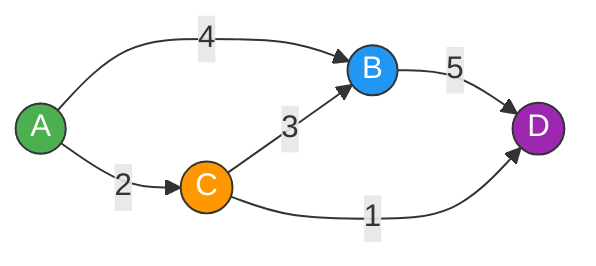

### Unweighted Graph

All edges have **equal weight** (or weight = 1). BFS finds the shortest path in unweighted graphs.

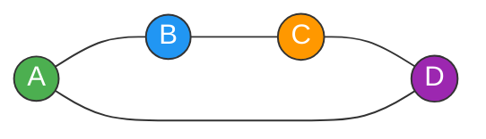

### Graph Types at a Glance

| Property | Undirected | Directed |
|----------|-----------|----------|
| Edge direction | None (A -- B) | One-way (A -> B) |
| Example | Friendship graph | Twitter follows |
| Degree | Total edges on node | In-degree + Out-degree |
| Cycle detection | Union-Find or DFS | DFS with coloring |

| Property | Weighted | Unweighted |
|----------|----------|------------|
| Edge cost | Variable per edge | All edges equal |
| Shortest path | Dijkstra's / Bellman-Ford | BFS |
| Example | Road network distances | Social network hops |

### Special Graph Types

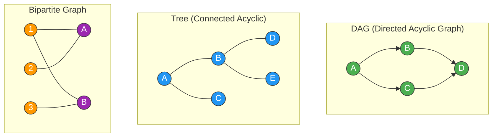

- **DAG**: Directed graph with no cycles. Used for task scheduling (topological sort).
- **Tree**: Connected graph with no cycles. Has exactly V-1 edges.
- **Bipartite**: Vertices can be split into two groups where edges only connect across groups.

---

## 2. Graph Representations

### Adjacency Matrix

A 2D array where `matrix[i][j] = 1` (or weight) if there's an edge from vertex i to vertex j.

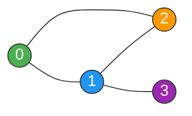

```
    0  1  2  3
0 [ 0, 1, 1, 0 ]
1 [ 1, 0, 1, 1 ]
2 [ 1, 1, 0, 0 ]
3 [ 0, 1, 0, 0 ]
```

```python
# Adjacency Matrix - Undirected Graph
def build_adj_matrix(n, edges):
    """Build adjacency matrix from edge list."""
    matrix = [[0] * n for _ in range(n)]
    for u, v in edges:
        matrix[u][v] = 1
        matrix[v][u] = 1  # Remove this line for directed graph
    return matrix

# Usage
edges = [[0, 1], [0, 2], [1, 2], [1, 3]]
matrix = build_adj_matrix(4, edges)
# Check if edge exists: O(1)
print(matrix[0][1])  # 1 (edge exists)
print(matrix[0][3])  # 0 (no edge)
```

### Adjacency List

A dictionary (or list of lists) where each vertex maps to its list of neighbors.

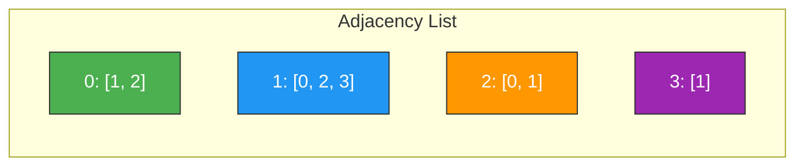

```python
# Adjacency List - Undirected Graph
from collections import defaultdict

def build_adj_list(n, edges):
    """Build adjacency list from edge list."""
    graph = defaultdict(list)
    for u, v in edges:
        graph[u].append(v)
        graph[v].append(u)  # Remove this line for directed graph
    return graph

# Usage
edges = [[0, 1], [0, 2], [1, 2], [1, 3]]
graph = build_adj_list(4, edges)
# Get neighbors: O(1) lookup
print(graph[1])  # [0, 2, 3]

# Weighted Adjacency List
def build_weighted_adj_list(n, edges):
    """Build weighted adjacency list. edges = [[u, v, weight], ...]"""
    graph = defaultdict(list)
    for u, v, w in edges:
        graph[u].append((v, w))
        graph[v].append((u, w))  # Remove for directed
    return graph
```

### Comparison Table

| Operation | Adjacency Matrix | Adjacency List |
|-----------|:---:|:---:|
| Space | O(V^2) | O(V + E) |
| Check edge exists | **O(1)** | O(degree) |
| Get all neighbors | O(V) | **O(degree)** |
| Add edge | O(1) | O(1) |
| Remove edge | O(1) | O(degree) |
| Best for | Dense graphs (E close to V^2) | **Sparse graphs (E << V^2)** |

**Rule of thumb**: Almost always use **adjacency list** in interviews. Most real-world and interview graphs are sparse.

---

## 3. Key Algorithms

### 3.1 BFS - Breadth-First Search (Medium)

BFS explores the graph **level by level**, visiting all neighbors of a node before moving deeper. It uses a **queue** and guarantees the shortest path in **unweighted** graphs.

**Time**: O(V + E) | **Space**: O(V)

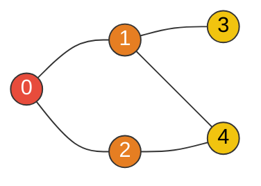

#### BFS Step-by-Step (Starting from Node 0)

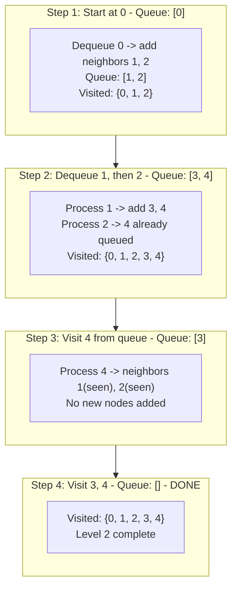

**Visit Order**: 0 -> 1 -> 2 -> 3 -> 4 (level by level)

```python
from collections import deque

def bfs(graph, start):
    """BFS traversal from start node."""
    visited = set([start])
    queue = deque([start])
    order = []

    while queue:
        node = queue.popleft()
        order.append(node)

        for neighbor in graph[node]:
            if neighbor not in visited:
                visited.add(neighbor)
                queue.append(neighbor)

    return order

def bfs_shortest_path(graph, start, end):
    """Find shortest path in unweighted graph using BFS."""
    visited = set([start])
    queue = deque([(start, [start])])  # (node, path)

    while queue:
        node, path = queue.popleft()
        if node == end:
            return path

        for neighbor in graph[node]:
            if neighbor not in visited:
                visited.add(neighbor)
                queue.append((neighbor, path + [neighbor]))

    return []  # No path found
```

**When to use BFS**:
- Shortest path in **unweighted** graph
- Level-order traversal
- Multi-source BFS (start from multiple nodes simultaneously)
- Finding connected components

---

### 3.2 DFS - Depth-First Search (Medium)

DFS explores the graph by going **as deep as possible** before backtracking. It uses a **stack** (or recursion). Good for exploring all paths, detecting cycles, and topological sorting.

**Time**: O(V + E) | **Space**: O(V)

#### DFS Step-by-Step (Starting from Node 0)

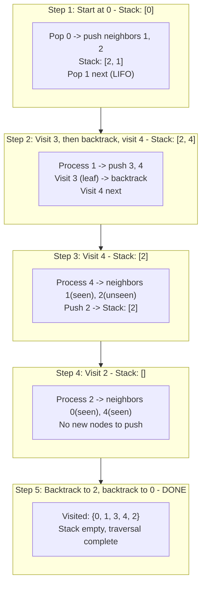

**Visit Order**: 0 -> 1 -> 3 -> 4 -> 2 (goes deep first)

```python
# Recursive DFS
def dfs_recursive(graph, node, visited=None):
    """DFS traversal using recursion."""
    if visited is None:
        visited = set()

    visited.add(node)
    result = [node]

    for neighbor in graph[node]:
        if neighbor not in visited:
            result.extend(dfs_recursive(graph, neighbor, visited))

    return result

# Iterative DFS (using explicit stack)
def dfs_iterative(graph, start):
    """DFS traversal using explicit stack."""
    visited = set()
    stack = [start]
    order = []

    while stack:
        node = stack.pop()
        if node in visited:
            continue
        visited.add(node)
        order.append(node)

        # Add neighbors in reverse order for consistent traversal
        for neighbor in reversed(graph[node]):
            if neighbor not in visited:
                stack.append(neighbor)

    return order
```

**When to use DFS**:
- Detecting cycles
- Topological sort
- Finding connected components
- Path existence
- Backtracking problems

### BFS vs DFS Comparison

| Property | BFS | DFS |
|----------|-----|-----|
| Data structure | Queue (FIFO) | Stack (LIFO) / Recursion |
| Explores | Level by level | Deep as possible first |
| Shortest path (unweighted) | **Yes** | No |
| Space | O(width of graph) | O(depth of graph) |
| Good for | Shortest path, level-order | Cycle detection, topo sort |

---

### 3.3 Topological Sort (Medium)

Topological sort produces a **linear ordering** of vertices in a **DAG** (Directed Acyclic Graph) such that for every directed edge u -> v, vertex u comes before v in the ordering.

**Use case**: Task scheduling, course prerequisites, build systems.

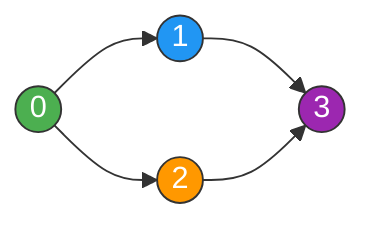

**Valid topological orders**: [0, 1, 2, 3] or [0, 2, 1, 3]

#### Kahn's Algorithm (BFS-based)

Start with nodes that have **in-degree 0** (no prerequisites). Remove them, reduce in-degrees, repeat.

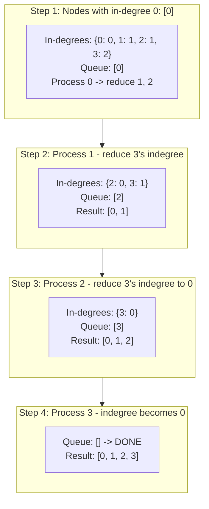

```python
from collections import deque, defaultdict

def topological_sort_kahn(num_nodes, edges):
    """Kahn's Algorithm (BFS-based topological sort).

    Returns topological order, or empty list if cycle detected.
    """
    graph = defaultdict(list)
    in_degree = [0] * num_nodes

    for u, v in edges:
        graph[u].append(v)
        in_degree[v] += 1

    # Start with all nodes that have in-degree 0
    queue = deque([i for i in range(num_nodes) if in_degree[i] == 0])
    order = []

    while queue:
        node = queue.popleft()
        order.append(node)

        for neighbor in graph[node]:
            in_degree[neighbor] -= 1
            if in_degree[neighbor] == 0:
                queue.append(neighbor)

    # If order doesn't contain all nodes, there's a cycle
    return order if len(order) == num_nodes else []
```

#### DFS-based Topological Sort

Run DFS and add nodes to result in **post-order** (after visiting all descendants). Then reverse.

```python
def topological_sort_dfs(num_nodes, edges):
    """DFS-based topological sort.

    Returns topological order, or empty list if cycle detected.
    """
    graph = defaultdict(list)
    for u, v in edges:
        graph[u].append(v)

    # 0 = unvisited, 1 = in current path, 2 = completed
    state = [0] * num_nodes
    order = []
    has_cycle = False

    def dfs(node):
        nonlocal has_cycle
        if has_cycle:
            return
        state[node] = 1  # Mark as in current path

        for neighbor in graph[node]:
            if state[neighbor] == 1:  # Back edge = cycle
                has_cycle = True
                return
            if state[neighbor] == 0:
                dfs(neighbor)

        state[node] = 2  # Mark as completed
        order.append(node)

    for i in range(num_nodes):
        if state[i] == 0:
            dfs(i)

    return order[::-1] if not has_cycle else []
```

---

### 3.4 Dijkstra's Algorithm (Medium)

Finds the **shortest path** from a source to all other vertices in a **weighted graph with non-negative weights**. Uses a **priority queue** (min-heap).

**Time**: O((V + E) log V) | **Space**: O(V)


#### Dijkstra Step-by-Step (Source = A)

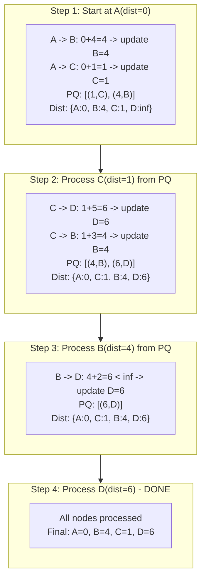

```python
import heapq
from collections import defaultdict

def dijkstra(graph, start):
    """Dijkstra's shortest path algorithm.

    graph: adjacency list where graph[u] = [(v, weight), ...]
    Returns: dict of shortest distances from start to all nodes.
    """
    dist = {start: 0}
    pq = [(0, start)]  # (distance, node)

    while pq:
        d, u = heapq.heappop(pq)

        # Skip if we've already found a shorter path
        if d > dist.get(u, float('inf')):
            continue

        for v, weight in graph[u]:
            new_dist = d + weight
            if new_dist < dist.get(v, float('inf')):
                dist[v] = new_dist
                heapq.heappush(pq, (new_dist, v))

    return dist
```

**Key points**:
- Does NOT work with **negative weights** (use Bellman-Ford instead)
- The `if d > dist[u]` check is crucial -- it skips stale entries in the priority queue
- To reconstruct the path, track `parent[v] = u` when updating distances

---

### 3.5 Union-Find / Disjoint Set Union (Medium)

Union-Find tracks **connected components** and efficiently answers "Are A and B connected?" and "Connect A and B".

**Time**: Nearly O(1) per operation (amortized with path compression + union by rank)

#### Core Operations

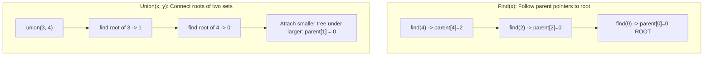

#### Path Compression

After finding the root, make every node on the path point **directly** to the root. This flattens the tree.

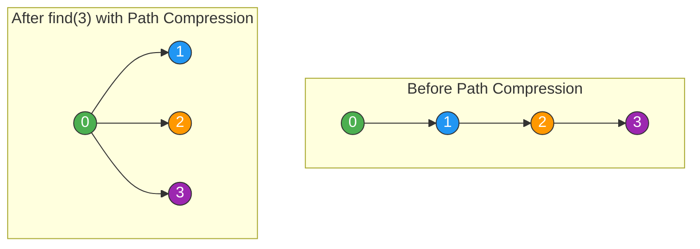

```python
class UnionFind:
    def __init__(self, n):
        self.parent = list(range(n))  # Each node is its own parent
        self.rank = [0] * n           # Rank for union by rank

    def find(self, x):
        """Find root with path compression."""
        if self.parent[x] != x:
            self.parent[x] = self.find(self.parent[x])  # Path compression
        return self.parent[x]

    def union(self, x, y):
        """Union by rank. Returns False if already connected."""
        root_x = self.find(x)
        root_y = self.find(y)

        if root_x == root_y:
            return False  # Already in same set

        # Attach smaller tree under larger tree
        if self.rank[root_x] < self.rank[root_y]:
            self.parent[root_x] = root_y
        elif self.rank[root_x] > self.rank[root_y]:
            self.parent[root_y] = root_x
        else:
            self.parent[root_y] = root_x
            self.rank[root_x] += 1

        return True

    def connected(self, x, y):
        """Check if x and y are in the same set."""
        return self.find(x) == self.find(y)
```

**When to use Union-Find**:
- "Are these nodes connected?" queries
- Counting connected components
- Detecting cycles in undirected graphs
- Kruskal's MST algorithm

---

### 3.6 Cycle Detection (Medium)

#### Cycle in Directed Graph -- DFS Coloring

Use three states: **WHITE** (unvisited), **GRAY** (in current DFS path), **BLACK** (fully processed). A back edge (to a GRAY node) means a cycle.

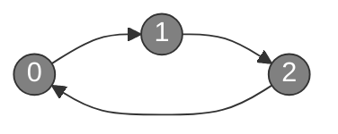

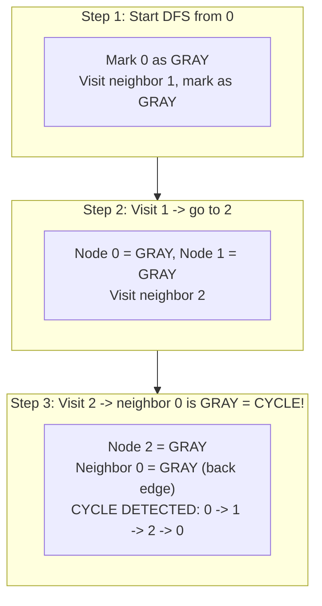

```python
def has_cycle_directed(graph, num_nodes):
    """Detect cycle in directed graph using DFS coloring.

    WHITE=0, GRAY=1, BLACK=2
    """
    color = [0] * num_nodes  # All WHITE

    def dfs(node):
        color[node] = 1  # GRAY - in current path

        for neighbor in graph[node]:
            if color[neighbor] == 1:  # Back edge to GRAY node
                return True  # Cycle found
            if color[neighbor] == 0 and dfs(neighbor):
                return True

        color[node] = 2  # BLACK - fully processed
        return False

    for i in range(num_nodes):
        if color[i] == 0:
            if dfs(i):
                return True
    return False
```

#### Cycle in Undirected Graph -- Union-Find

For each edge, check if the two endpoints are already connected. If yes, adding this edge creates a cycle.

```python
def has_cycle_undirected(n, edges):
    """Detect cycle in undirected graph using Union-Find."""
    uf = UnionFind(n)
    for u, v in edges:
        if not uf.union(u, v):  # Already connected = cycle
            return True
    return False
```

---

### 3.7 Bellman-Ford Algorithm (Hard)

Finds shortest paths from a source when **negative weights** exist. Can also detect **negative weight cycles**.

**Time**: O(V * E) | **Space**: O(V)

**Key idea**: Relax all edges V-1 times. If we can still relax on the V-th pass, there's a negative cycle.

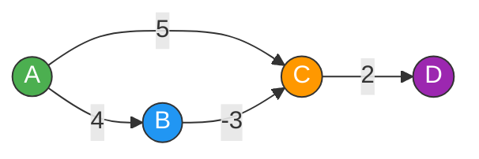

#### Bellman-Ford Step-by-Step (Source = A)

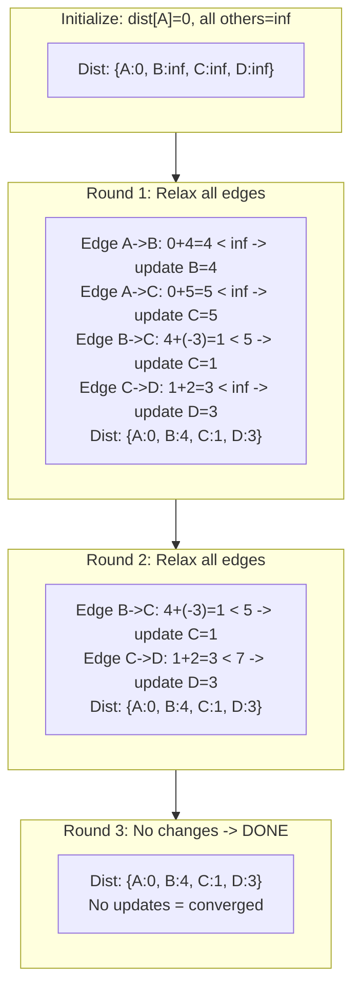

```python
def bellman_ford(n, edges, start):
    """Bellman-Ford shortest path algorithm.

    edges: list of (u, v, weight)
    Returns: distances dict, or None if negative cycle exists.
    """
    dist = [float('inf')] * n
    dist[start] = 0

    # Relax all edges V-1 times
    for _ in range(n - 1):
        for u, v, w in edges:
            if dist[u] != float('inf') and dist[u] + w < dist[v]:
                dist[v] = dist[u] + w

    # Check for negative weight cycles (V-th pass)
    for u, v, w in edges:
        if dist[u] != float('inf') and dist[u] + w < dist[v]:
            return None  # Negative cycle detected

    return dist
```

### Dijkstra vs Bellman-Ford

| Property | Dijkstra | Bellman-Ford |
|----------|----------|--------------|
| Time | O((V+E) log V) | O(V * E) |
| Negative weights | **No** | **Yes** |
| Negative cycles | Cannot detect | **Can detect** |
| Data structure | Priority queue | Simple array |
| Use when | Non-negative weights | Negative weights possible |

---

## 4. Algorithm Selection Matrix

```mermaid
flowchart TD
    Start["Graph Problem"] --> Q1{"Weighted<br/>edges?"}

    Q1 -->|No| Q2{"Shortest path<br/>needed?"}
    Q2 -->|Yes| A1["BFS<br/>(unweighted shortest path)"]
    Q2 -->|No| Q3{"Detect cycle?"}
    Q3 -->|"Directed"| A2["DFS Coloring<br/>(WHITE/GRAY/BLACK)"]
    Q3 -->|"Undirected"| A3["Union-Find"]
    Q3 -->|No| Q4{"Ordering /<br/>scheduling?"}
    Q4 -->|Yes| A4["Topological Sort<br/>(Kahn's or DFS)"]
    Q4 -->|No| Q5{"Connected<br/>components?"}
    Q5 -->|Yes| A5["BFS/DFS or Union-Find"]
    Q5 -->|No| A6["BFS or DFS traversal"]

    Q1 -->|Yes| Q6{"Negative<br/>weights?"}
    Q6 -->|No| A7["Dijkstra's Algorithm"]
    Q6 -->|Yes| Q7{"Negative<br/>cycles?"}
    Q7 -->|"Detect/Handle"| A8["Bellman-Ford"]
    Q7 -->|No| A8

    style A1 fill:#4CAF50,stroke:#333,color:#fff
    style A2 fill:#e74c3c,stroke:#333,color:#fff
    style A3 fill:#FF9800,stroke:#333,color:#fff
    style A4 fill:#9C27B0,stroke:#333,color:#fff
    style A5 fill:#2196F3,stroke:#333,color:#fff
    style A6 fill:#607D8B,stroke:#333,color:#fff
    style A7 fill:#00BCD4,stroke:#333,color:#fff
    style A8 fill:#795548,stroke:#333,color:#fff
```

### Quick Reference Table

| Problem Signal | Algorithm | Time |
|---------------|-----------|------|
| "Shortest path" + unweighted | BFS | O(V + E) |
| "Shortest path" + weighted (non-negative) | Dijkstra | O((V+E) log V) |
| "Shortest path" + negative weights | Bellman-Ford | O(V * E) |
| "Can I finish all courses?" / ordering | Topological Sort | O(V + E) |
| "Number of islands" / connected groups | BFS/DFS | O(V + E) |
| "Is there a cycle?" (directed) | DFS coloring | O(V + E) |
| "Is there a cycle?" (undirected) | Union-Find | O(V * alpha(V)) |
| "Redundant edge" / connected? | Union-Find | O(V * alpha(V)) |
| "Bipartite check" / 2-coloring | BFS/DFS | O(V + E) |
| "Bridge" / "Articulation point" | Tarjan's | O(V + E) |

---

## 5. Common Mistakes

### 1. Forgetting the Visited Set

```python
# WRONG - infinite loop on cyclic graphs!
def bfs_wrong(graph, start):
    queue = deque([start])
    while queue:
        node = queue.popleft()
        for neighbor in graph[node]:
            queue.append(neighbor)  # Will revisit nodes forever!

# RIGHT - always track visited nodes
def bfs_right(graph, start):
    visited = set([start])
    queue = deque([start])
    while queue:
        node = queue.popleft()
        for neighbor in graph[node]:
            if neighbor not in visited:
                visited.add(neighbor)
                queue.append(neighbor)
```

### 2. Directed vs Undirected Confusion

```python
# Building undirected graph - MUST add both directions
for u, v in edges:
    graph[u].append(v)
    graph[v].append(u)  # Don't forget this for undirected!

# Building directed graph - only one direction
for u, v in edges:
    graph[u].append(v)  # Only u -> v
```

### 3. 0-Indexed vs 1-Indexed Nodes

```python
# If nodes are 1-indexed (like in many LC problems)
# Make sure arrays are sized correctly
n = 4  # Nodes 1, 2, 3, 4
in_degree = [0] * (n + 1)  # Index 0 unused, but safe

# Or convert to 0-indexed
for u, v in edges:
    graph[u - 1].append(v - 1)
```

### 4. Not Handling Disconnected Graphs

```python
# WRONG - only visits component containing node 0
visited = set()
dfs(graph, 0, visited)

# RIGHT - visit ALL components
visited = set()
for node in range(n):
    if node not in visited:
        dfs(graph, node, visited)
```

### 5. Using Dijkstra with Negative Weights

```python
# WRONG - Dijkstra does NOT work with negative weights!
# It may give incorrect results because it assumes
# once a node is processed, its distance is final.

# RIGHT - Use Bellman-Ford for negative weights
dist = bellman_ford(n, edges, start)
```

### 6. Grid Graphs -- Forgetting Bounds Check

```python
# For grid-based graph problems (islands, flood fill, etc.)
directions = [(0, 1), (0, -1), (1, 0), (-1, 0)]

for dr, dc in directions:
    nr, nc = r + dr, c + dc
    # ALWAYS check bounds before accessing grid
    if 0 <= nr < rows and 0 <= nc < cols:
        if grid[nr][nc] == target and (nr, nc) not in visited:
            # process...
```

---

## 6. Day Schedule

### Day 33: BFS/DFS Basics

| # | Problem | Difficulty | Pattern | Time |
|---|---------|:---:|---------|------|
| 1 | Find if Path Exists (LC 1971) | Easy | BFS/DFS | 10 min |
| 2 | Flood Fill (LC 733) | Easy | BFS/DFS on Grid | 12 min |
| 3 | Find Town Judge (LC 997) | Easy | In/Out Degree | 10 min |
| 4 | Find Center of Star (LC 1791) | Easy | Graph Property | 8 min |
| 5 | Number of Islands (LC 200) | Medium | DFS/BFS on Grid | 15 min |
| 6 | Clone Graph (LC 133) | Medium | BFS/DFS + HashMap | 15 min |

**Total estimated time: ~1.2 hours**

### Day 34: Topological Sort & Dijkstra

| # | Problem | Difficulty | Pattern | Time |
|---|---------|:---:|---------|------|
| 1 | Course Schedule (LC 207) | Medium | Topo Sort / Cycle | 15 min |
| 2 | Course Schedule II (LC 210) | Medium | Topological Sort | 15 min |
| 3 | Rotting Oranges (LC 994) | Medium | Multi-source BFS | 15 min |
| 4 | Surrounded Regions (LC 130) | Medium | DFS from Boundary | 15 min |
| 5 | Network Delay Time (LC 743) | Medium | Dijkstra | 15 min |

**Total estimated time: ~1.25 hours**

### Day 35: Union-Find, Hard Problems & Review

| # | Problem | Difficulty | Pattern | Time |
|---|---------|:---:|---------|------|
| 1 | Redundant Connection (LC 684) | Medium | Union-Find | 15 min |
| 2 | Pacific Atlantic Water Flow (LC 417) | Medium | Multi-source DFS | 20 min |
| 3 | Is Graph Bipartite? (LC 785) | Medium | BFS/DFS Coloring | 15 min |
| 4 | Word Ladder (LC 127) | Hard | BFS | 20 min |
| 5 | Alien Dictionary (LC 269) | Hard | Topological Sort | 20 min |
| 6 | Cheapest Flights (LC 787) | Hard | Bellman-Ford | 20 min |
| 7 | Critical Connections (LC 1192) | Hard | Tarjan's Algorithm | 25 min |

**Total estimated time: ~2.25 hours**

**Suggested order**: Master BFS/DFS on Day 33, then topological sort and Dijkstra on Day 34, and tackle harder Union-Find and advanced problems on Day 35. If short on time, prioritize: LC 200, LC 207, LC 743, LC 127.
