# Dynamic Programming

## Days 36-39 | 40-Day DSA Study Guide

---

## 1. What is Dynamic Programming?

**Dynamic Programming (DP)** is an optimization technique that solves complex problems by breaking them into **overlapping subproblems** and storing their results to avoid redundant computation.

### Two Key Properties

1. **Overlapping Subproblems** -- The same subproblems are solved multiple times.
2. **Optimal Substructure** -- The optimal solution to the problem can be built from optimal solutions of its subproblems.

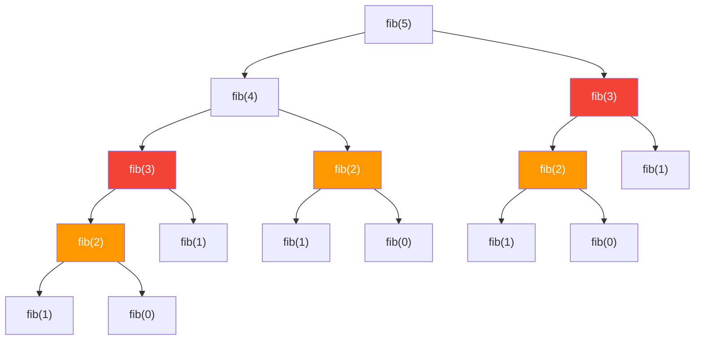

> The red/orange nodes show **repeated subproblems**. `fib(3)` is computed twice, `fib(2)` is computed three times. DP stores these results so each subproblem is solved only **once**.

### Core Idea

```
DP = Recursion + Memoization (avoid recomputation)
DP = Carefully ordering subproblems + Building solutions bottom-up
```

---

## 2. Top-Down (Memoization) vs Bottom-Up (Tabulation)

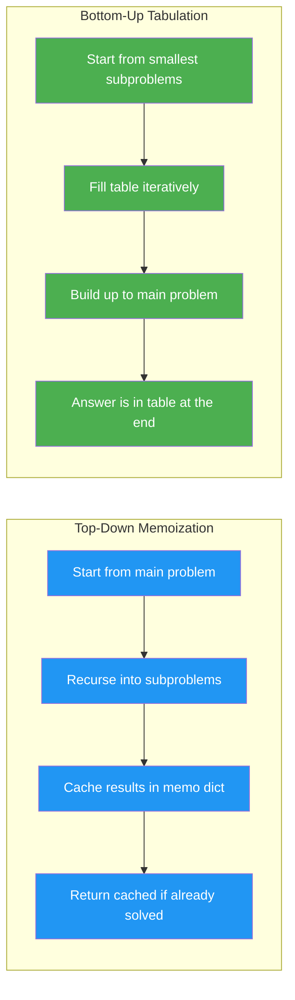

### Top-Down (Memoization) Template

```python
def solve(n, memo={}):
    if n in memo:
        return memo[n]
    if n <= 1:          # base case
        return n
    memo[n] = solve(n - 1, memo) + solve(n - 2, memo)  # recurrence
    return memo[n]
```

### Bottom-Up (Tabulation) Template

```python
def solve(n):
    if n <= 1:
        return n
    dp = [0] * (n + 1)
    dp[0], dp[1] = 0, 1      # base cases
    for i in range(2, n + 1):
        dp[i] = dp[i - 1] + dp[i - 2]  # recurrence
    return dp[n]
```

### When to Use Each

| Aspect | Top-Down (Memo) | Bottom-Up (Tab) |
|--------|----------------|-----------------|
| **Approach** | Recursive + cache | Iterative + table |
| **Implementation** | More natural/intuitive | Requires careful ordering |
| **Stack overflow risk** | Yes (deep recursion) | No |
| **Subproblem computation** | Only solves needed subproblems | Solves all subproblems |
| **Space optimization** | Harder | Easier (rolling array) |
| **Best for** | Tree-shaped subproblems, sparse states | Dense states, space optimization needed |

---

## 3. DP Problem Classification

```mermaid
graph TD
    DP["Dynamic Programming Problems"] --> A["1D DP"]
    DP --> B["2D DP"]
    DP --> C["Knapsack"]
    DP --> D["String DP"]
    DP --> E["Interval DP"]
    DP --> F["State Machine"]
    DP --> G["Tree DP"]

    A --> A1["Fibonacci"]
    A --> A2["Climbing Stairs"]
    A --> A3["House Robber"]
    A --> A4["Maximum Subarray"]

    B --> B1["Grid Paths"]
    B --> B2["LCS"]
    B --> B3["Min Path Sum"]

    C --> C1["0/1 Knapsack"]
    C --> C2["Unbounded Knapsack"]
    C --> C3["Subset Sum"]

    D --> D1["Edit Distance"]
    D --> D2["Palindromic Subsequence"]
    D --> D3["Regex Matching"]

    E --> E1["Matrix Chain Multiplication"]
    E --> E2["Burst Balloons"]

    F --> F1["Stock Buy/Sell"]
    F --> F2["With Cooldown"]

    G --> G1["House Robber III"]
    G --> G2["Longest Path"]

    style A fill:#4CAF50,color:#fff
    style B fill:#2196F3,color:#fff
    style C fill:#FF9800,color:#fff
    style D fill:#9C27B0,color:#fff
    style E fill:#f44336,color:#fff
    style F fill:#00BCD4,color:#fff
    style G fill:#795548,color:#fff
```

---

## 4. How to Approach DP Problems

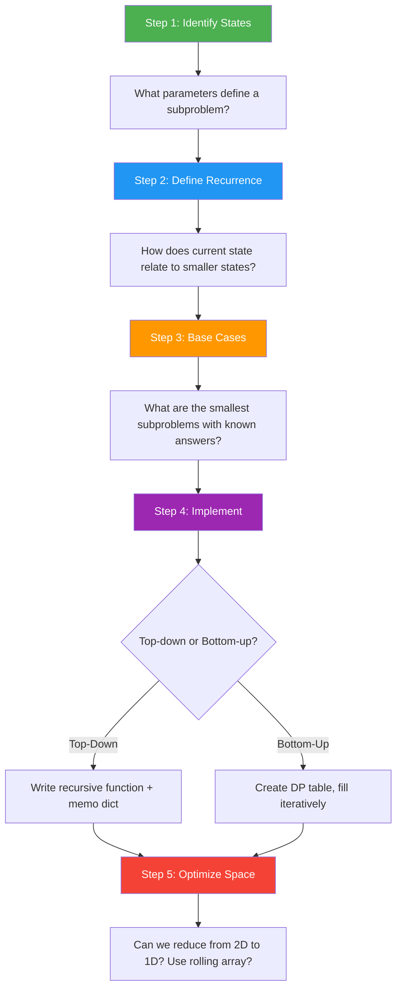

### Step-by-step Breakdown

```
1. IDENTIFY STATES
   - What changes between subproblems?
   - Index i? Amount remaining? Two indices i, j?
   - States = the arguments to your recursive function

2. DEFINE RECURRENCE
   - How do I compute dp[i] from smaller subproblems?
   - What choices do I have at each state?
   - dp[i] = max/min/sum of (choices involving dp[smaller])

3. BASE CASES
   - What are the simplest subproblems I can answer directly?
   - dp[0] = ?, dp[1] = ?

4. IMPLEMENT
   - Choose top-down (easier) or bottom-up (faster, optimizable)
   - Make sure iteration order respects dependencies

5. OPTIMIZE SPACE
   - Does dp[i] only depend on dp[i-1] and dp[i-2]?
   - Then use just 2 variables instead of an array.
   - Does dp[i][j] only depend on dp[i-1][...]?
   - Then use a 1D array instead of 2D.
```

---

## 5. Key Patterns with State Transition Diagrams

---

### Pattern 1: Fibonacci-style (Easy)

**State depends on previous 1-2 states.**

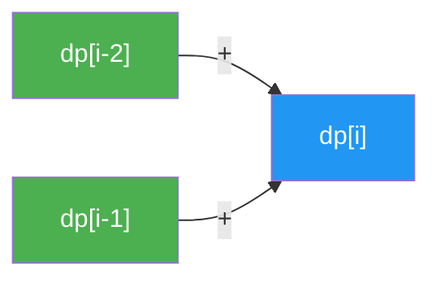

**Problems:** Climbing Stairs, Fibonacci, Min Cost Climbing Stairs, House Robber

```python
# Template: Fibonacci-style DP
def fib_style(n):
    if n <= 1:
        return n
    prev2, prev1 = 0, 1
    for i in range(2, n + 1):
        curr = prev1 + prev2   # recurrence
        prev2, prev1 = prev1, curr
    return prev1
```

**Recurrence Examples:**
- Climbing Stairs: `dp[i] = dp[i-1] + dp[i-2]`
- House Robber: `dp[i] = max(dp[i-1], dp[i-2] + nums[i])`
- Min Cost Stairs: `dp[i] = cost[i] + min(dp[i-1], dp[i-2])`

---

### Pattern 2: Knapsack (Medium)

**Include/exclude decision at each item.**

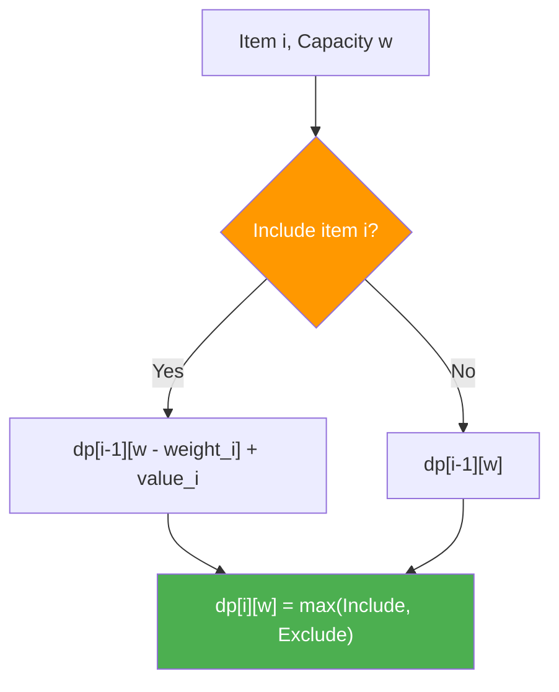

**2D Table Filling Visualization:**

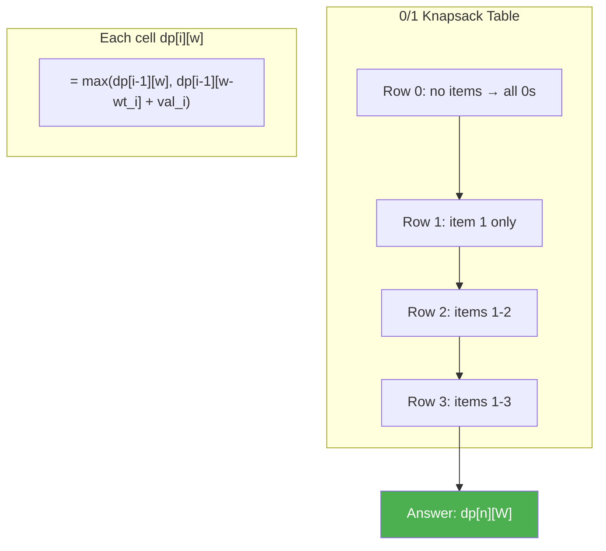

**Types:**
- **0/1 Knapsack:** Each item used at most once. Row by row: `dp[i][w] = max(dp[i-1][w], dp[i-1][w-wt] + val)`
- **Unbounded Knapsack:** Each item used unlimited times: `dp[w] = max(dp[w], dp[w-wt] + val)`
- **Subset Sum:** Can we select items summing to target? `dp[i][s] = dp[i-1][s] or dp[i-1][s-nums[i]]`

```python
# Template: 0/1 Knapsack
def knapsack_01(weights, values, capacity):
    n = len(weights)
    dp = [0] * (capacity + 1)
    for i in range(n):
        for w in range(capacity, weights[i] - 1, -1):  # reverse!
            dp[w] = max(dp[w], dp[w - weights[i]] + values[i])
    return dp[capacity]

# Template: Unbounded Knapsack (Coin Change variant)
def coin_change(coins, amount):
    dp = [float('inf')] * (amount + 1)
    dp[0] = 0
    for coin in coins:
        for a in range(coin, amount + 1):  # forward!
            dp[a] = min(dp[a], dp[a - coin] + 1)
    return dp[amount] if dp[amount] != float('inf') else -1
```

---

### Pattern 3: LCS / LIS (Medium)

**Longest Common Subsequence / Longest Increasing Subsequence**

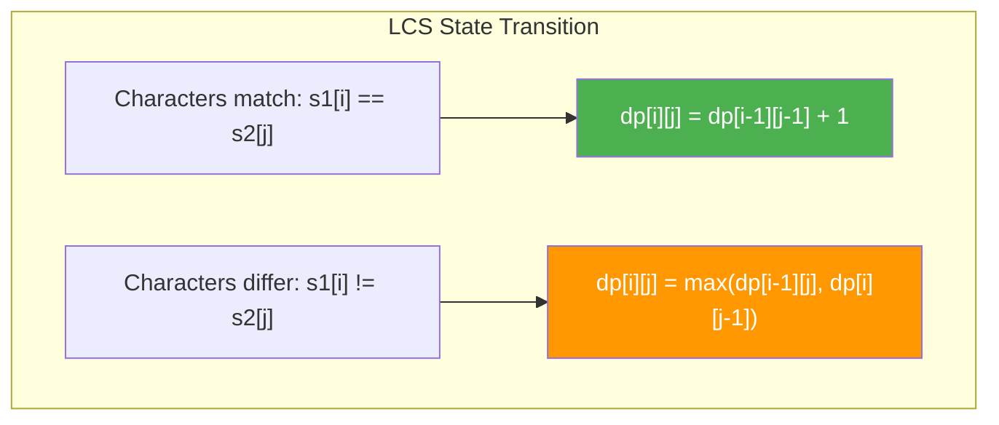

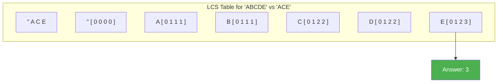

```python
# LCS Template
def lcs(s1, s2):
    m, n = len(s1), len(s2)
    dp = [[0] * (n + 1) for _ in range(m + 1)]
    for i in range(1, m + 1):
        for j in range(1, n + 1):
            if s1[i - 1] == s2[j - 1]:
                dp[i][j] = dp[i - 1][j - 1] + 1
            else:
                dp[i][j] = max(dp[i - 1][j], dp[i][j - 1])
    return dp[m][n]

# LIS Template (O(n^2))
def lis(nums):
    n = len(nums)
    dp = [1] * n
    for i in range(1, n):
        for j in range(i):
            if nums[j] < nums[i]:
                dp[i] = max(dp[i], dp[j] + 1)
    return max(dp)
```

---

### Pattern 4: Grid DP (Medium)

**Unique paths, minimum path sum -- fill grid cell by cell.**

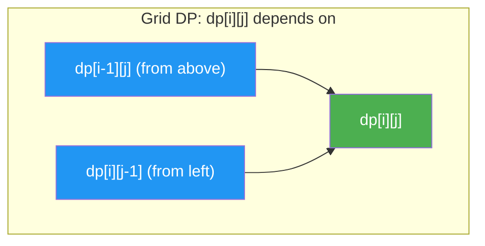

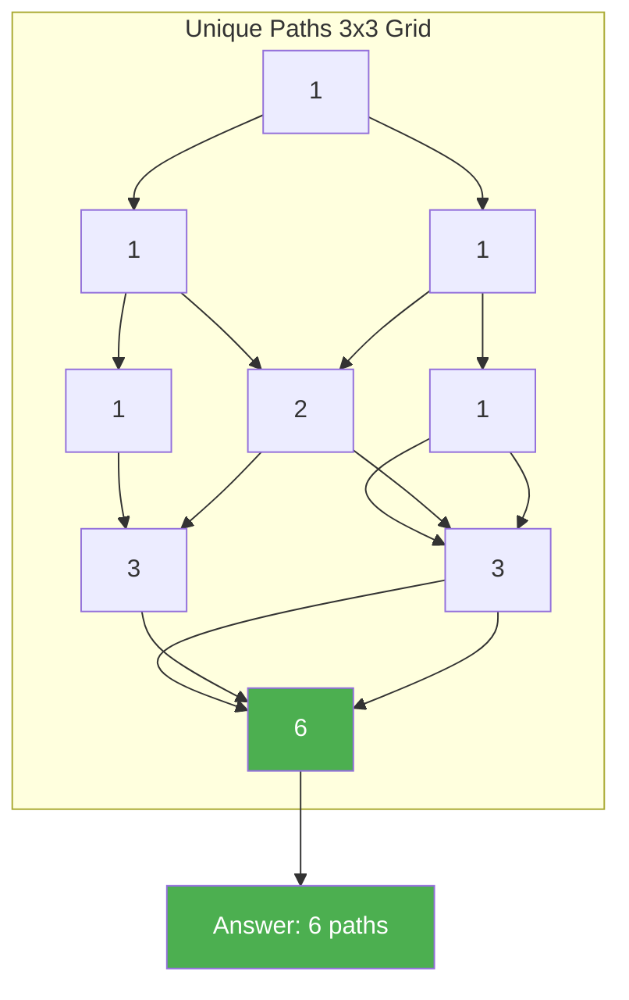

```python
# Template: Grid DP
def unique_paths(m, n):
    dp = [[1] * n for _ in range(m)]
    for i in range(1, m):
        for j in range(1, n):
            dp[i][j] = dp[i - 1][j] + dp[i][j - 1]
    return dp[m - 1][n - 1]
```

---

### Pattern 5: Partition / Subset Sum (Medium)

**Can we partition into subsets meeting a condition?**

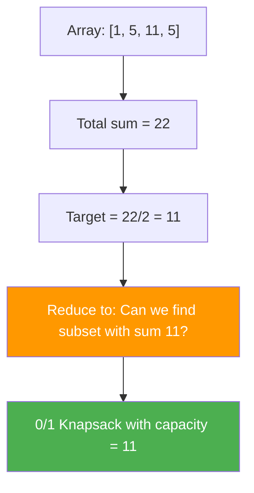

```python
# Template: Subset Sum (boolean)
def can_partition(nums):
    total = sum(nums)
    if total % 2 != 0:
        return False
    target = total // 2
    dp = [False] * (target + 1)
    dp[0] = True
    for num in nums:
        for s in range(target, num - 1, -1):  # reverse to avoid reuse
            dp[s] = dp[s] or dp[s - num]
    return dp[target]
```

---

### Pattern 6: String DP (Hard)

**Edit distance, regex matching -- compare two strings character by character.**

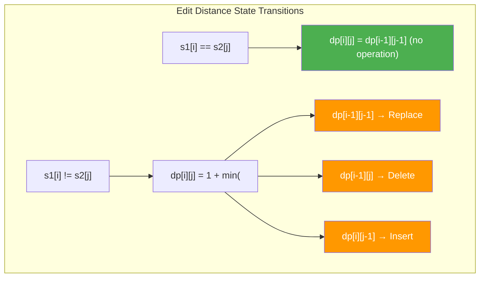

```python
# Template: Edit Distance
def edit_distance(word1, word2):
    m, n = len(word1), len(word2)
    dp = [[0] * (n + 1) for _ in range(m + 1)]
    for i in range(m + 1):
        dp[i][0] = i
    for j in range(n + 1):
        dp[0][j] = j
    for i in range(1, m + 1):
        for j in range(1, n + 1):
            if word1[i - 1] == word2[j - 1]:
                dp[i][j] = dp[i - 1][j - 1]
            else:
                dp[i][j] = 1 + min(dp[i - 1][j - 1], dp[i - 1][j], dp[i][j - 1])
    return dp[m][n]
```

---

### Pattern 7: Stock Trading / State Machine (Medium/Hard)

**Model states as a finite state machine with transitions.**

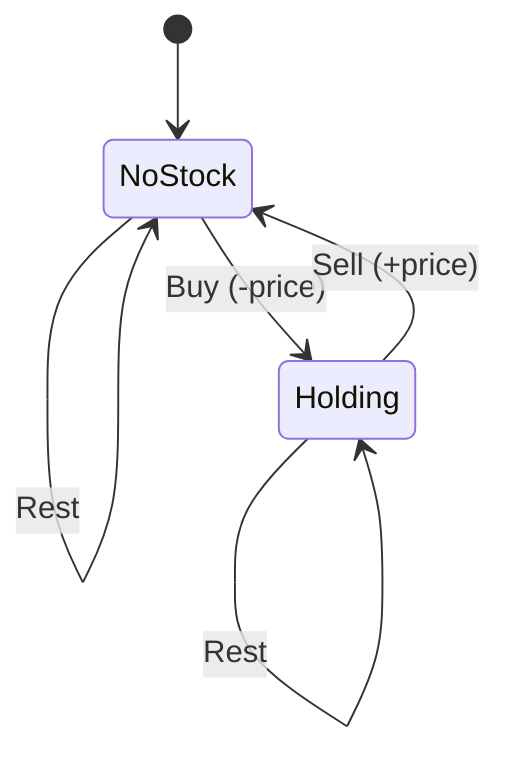

**With cooldown:**

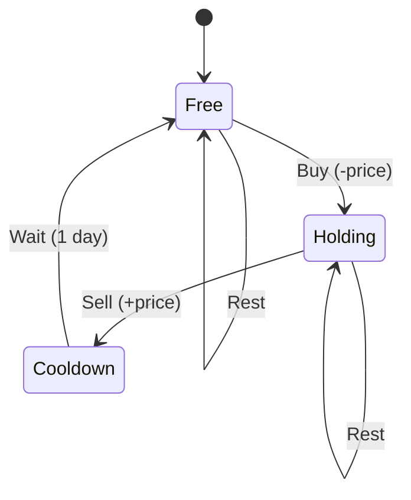

```python
# Template: Stock with Cooldown (State Machine)
def max_profit_cooldown(prices):
    n = len(prices)
    if n < 2:
        return 0
    # States: free (can buy), holding (can sell), cooldown (must wait)
    free, holding, cooldown = 0, -prices[0], 0
    for i in range(1, n):
        new_free = max(free, cooldown)
        new_holding = max(holding, free - prices[i])
        new_cooldown = holding + prices[i]
        free, holding, cooldown = new_free, new_holding, new_cooldown
    return max(free, cooldown)
```

---

## 6. Space Optimization

### Rolling Array Technique

Many DP problems only need the **previous row** (or previous 1-2 values) to compute the current row. We can reduce space from O(n*m) to O(m) or even O(1).

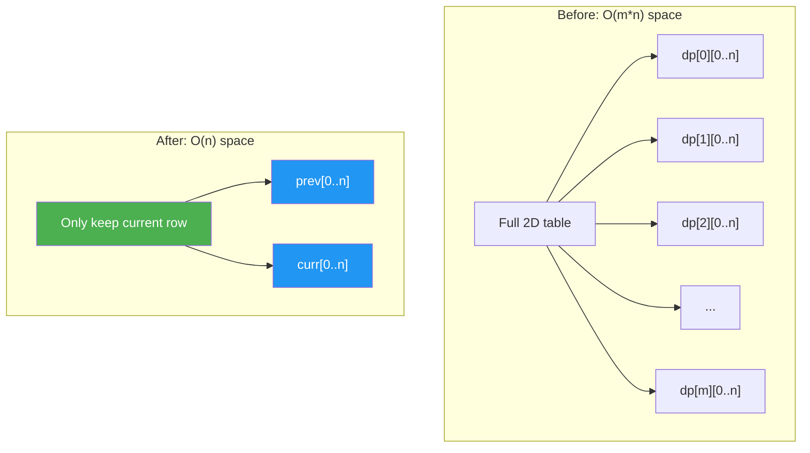

### Examples of Space Optimization

```python
# 2D DP -> 1D DP (LCS example)
def lcs_optimized(s1, s2):
    m, n = len(s1), len(s2)
    prev = [0] * (n + 1)
    for i in range(1, m + 1):
        curr = [0] * (n + 1)
        for j in range(1, n + 1):
            if s1[i - 1] == s2[j - 1]:
                curr[j] = prev[j - 1] + 1
            else:
                curr[j] = max(prev[j], curr[j - 1])
        prev = curr
    return prev[n]

# 1D DP -> O(1) (Fibonacci)
def fib_constant_space(n):
    if n <= 1:
        return n
    a, b = 0, 1
    for _ in range(2, n + 1):
        a, b = b, a + b
    return b
```

### Space Optimization Cheat Sheet

| Original | Optimized | When |
|----------|-----------|------|
| 1D array `dp[n]` | 2 variables | dp[i] depends on dp[i-1], dp[i-2] only |
| 2D array `dp[m][n]` | 1D array `dp[n]` | dp[i][j] depends only on row i and i-1 |
| 2D array `dp[m][n]` | 2 x 1D arrays | dp[i][j] depends on dp[i-1][j-1], dp[i-1][j], dp[i][j-1] |

---

## 7. Common Mistakes

### Mistake 1: Wrong Base Case

```
Problem: Climbing Stairs
Wrong:   dp[0] = 0, dp[1] = 1
Right:   dp[0] = 1, dp[1] = 1
         (There is 1 way to stand at the ground: do nothing)
```

### Mistake 2: Wrong Recurrence

```
Problem: House Robber
Wrong:   dp[i] = max(dp[i-1], dp[i-2]) + nums[i]
Right:   dp[i] = max(dp[i-1], dp[i-2] + nums[i])
         (When skipping house i, you get dp[i-1] NOT dp[i-1] + nums[i])
```

### Mistake 3: Not Considering All State Transitions

```
Problem: Edit Distance
Missing: Forgetting that "do nothing" is an option when chars match
Wrong:   dp[i][j] = 1 + min(replace, delete, insert) always
Right:   if chars match: dp[i][j] = dp[i-1][j-1] (free!)
         else: dp[i][j] = 1 + min(replace, delete, insert)
```

### Mistake 4: Wrong Iteration Direction in Space-Optimized DP

```
Problem: 0/1 Knapsack (1D optimization)
Wrong:   for w in range(weight_i, capacity + 1):  ← forward (allows reuse = unbounded)
Right:   for w in range(capacity, weight_i - 1, -1):  ← backward (prevents reuse = 0/1)
```

### Mistake 5: Forgetting to Handle Edge Cases

- Empty input / n = 0
- Single element
- Negative numbers (Kadane's algorithm)
- Very large n (need space optimization)
- String DP with empty strings (initialize first row/column)

---

## 8. Day Schedule

### Day 36: Easy + 1D DP Fundamentals

| Order | Problem | Difficulty | Pattern | Time |
|-------|---------|-----------|---------|------|
| 1 | Climbing Stairs (LC 70) | Easy | Fibonacci-style | 10 min |
| 2 | Min Cost Climbing Stairs (LC 746) | Easy | 1D DP | 10 min |
| 3 | House Robber (LC 198) | Easy | 1D DP | 15 min |
| 4 | Maximum Subarray (LC 53) | Easy | Kadane / DP | 15 min |
| 5 | Counting Bits (LC 338) | Easy | DP + Bit | 10 min |
| 6 | Divisor Game (LC 1025) | Easy | Game DP | 10 min |

### Day 37: 2D DP + Knapsack

| Order | Problem | Difficulty | Pattern | Time |
|-------|---------|-----------|---------|------|
| 1 | Unique Paths (LC 62) | Medium | Grid DP | 15 min |
| 2 | Coin Change (LC 322) | Medium | Unbounded Knapsack | 20 min |
| 3 | Longest Increasing Subsequence (LC 300) | Medium | LIS | 20 min |
| 4 | Longest Common Subsequence (LC 1143) | Medium | LCS | 20 min |
| 5 | Word Break (LC 139) | Medium | 1D DP | 20 min |
| 6 | Decode Ways (LC 91) | Medium | 1D DP | 15 min |

### Day 38: String DP + LCS/LIS + Knapsack Variants

| Order | Problem | Difficulty | Pattern | Time |
|-------|---------|-----------|---------|------|
| 1 | Partition Equal Subset Sum (LC 416) | Medium | 0/1 Knapsack | 20 min |
| 2 | Target Sum (LC 494) | Medium | 0/1 Knapsack variant | 20 min |
| 3 | Longest Palindromic Subsequence (LC 516) | Medium | String DP | 20 min |
| 4 | Min Path Sum (LC 64) | Medium | Grid DP | 15 min |
| 5 | House Robber II (LC 213) | Medium | Circular DP | 15 min |
| 6 | Perfect Squares (LC 279) | Medium | Unbounded Knapsack | 15 min |

### Day 39: Hard DP + Review

| Order | Problem | Difficulty | Pattern | Time |
|-------|---------|-----------|---------|------|
| 1 | Stock with Cooldown (LC 309) | Medium | State Machine DP | 20 min |
| 2 | Matrix Chain Multiplication (Classic) | Medium | Interval DP | 25 min |
| 3 | Count Subsets with Sum (Classic) | Medium | 0/1 Knapsack | 15 min |
| 4 | Maximal Square (LC 221) | Medium | 2D DP | 15 min |
| 5 | Edit Distance (LC 72) | Hard | String DP | 20 min |
| 6 | Regular Expression Matching (LC 10) | Hard | String DP | 25 min |
| 7 | Burst Balloons (LC 312) | Hard | Interval DP | 25 min |
| 8 | Longest Increasing Path (LC 329) | Hard | DFS + Memo | 20 min |
| 9 | Palindrome Partitioning II (LC 132) | Hard | String DP | 20 min |
| 10 | Scramble String (LC 87) | Hard | String DP | 20 min |
| 11 | Distinct Subsequences (LC 115) | Hard | String DP | 20 min |
| 12 | Interleaving String (LC 97) | Hard | 2D DP | 20 min |

---

## Quick Reference

```
DP Problem-Solving Template:
1. IDENTIFY what changes between subproblems (the state)
2. WRITE the recurrence relation
3. SET base cases
4. IMPLEMENT (top-down memo or bottom-up table)
5. OPTIMIZE space if possible

Common State Definitions:
- 1D: dp[i] = answer for first i elements / up to index i
- 2D: dp[i][j] = answer for subproblem using indices i..j
- Knapsack: dp[i][w] = best value using first i items with capacity w
- String: dp[i][j] = answer for s1[0..i] and s2[0..j]
- Interval: dp[i][j] = answer for subarray from i to j

Iteration Direction:
- 0/1 Knapsack (1D): iterate capacity BACKWARDS
- Unbounded Knapsack (1D): iterate capacity FORWARDS
- Grid DP: iterate top-to-bottom, left-to-right
- Interval DP: iterate by interval LENGTH, not by start index
```
