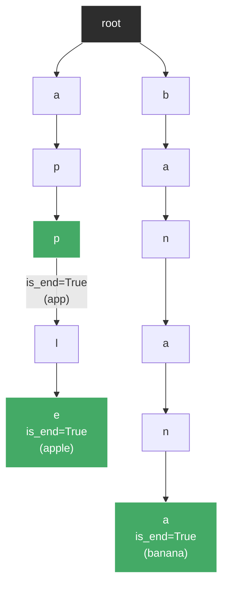
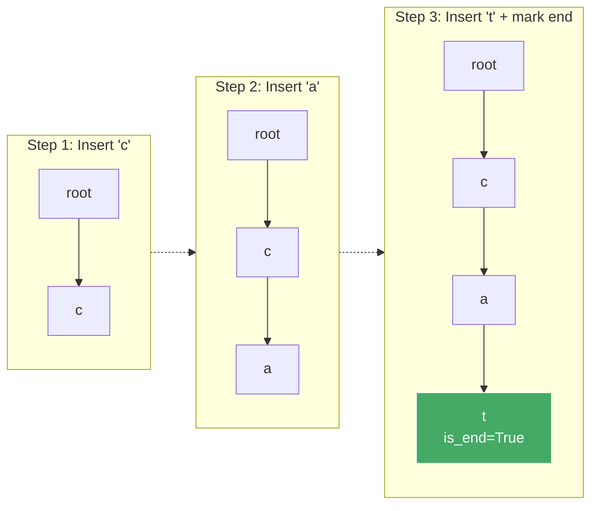
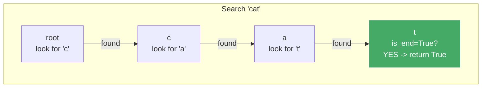
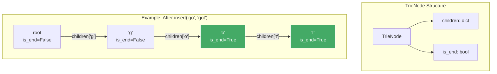
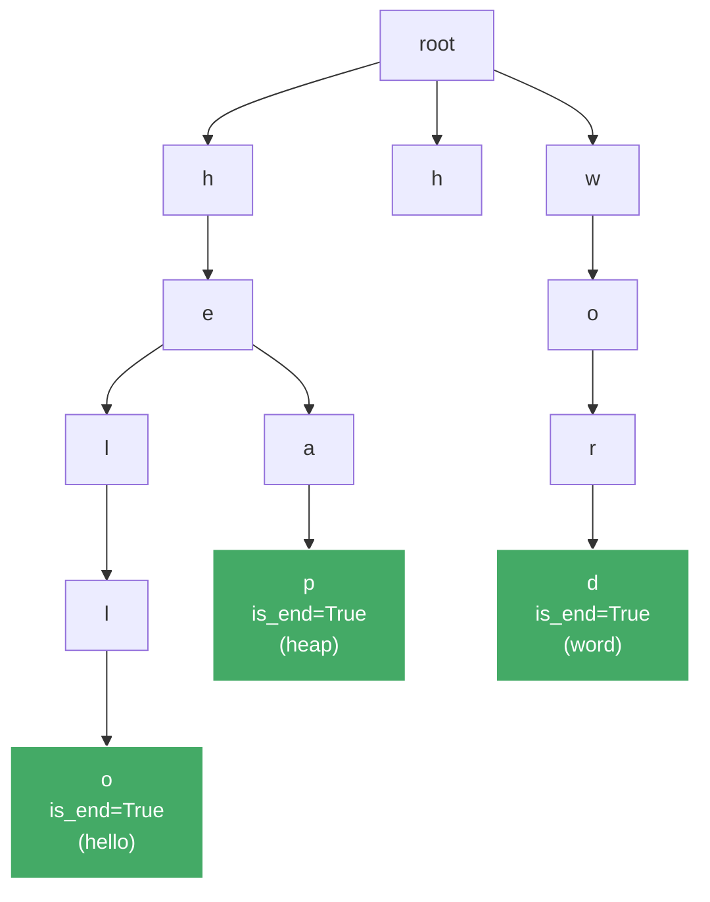
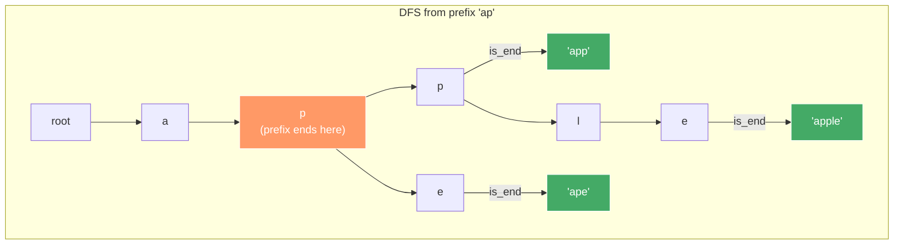
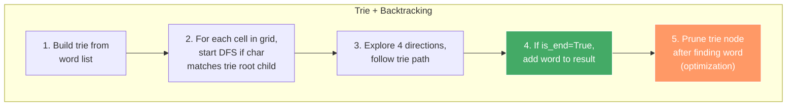
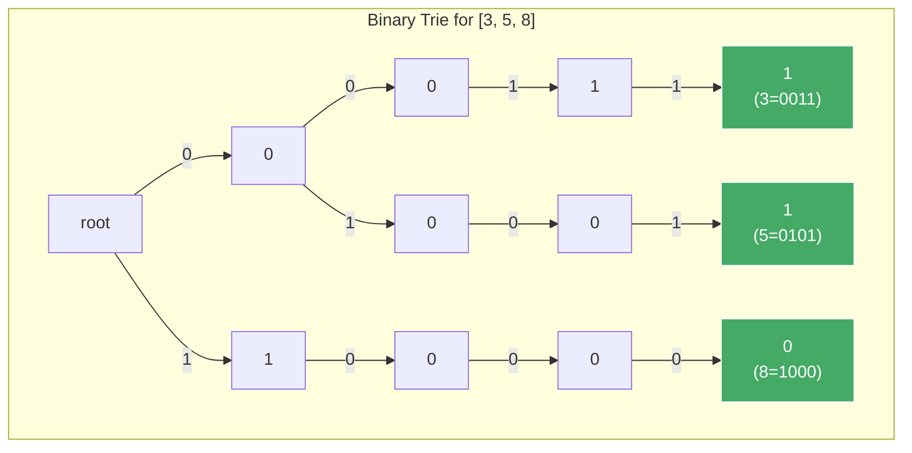
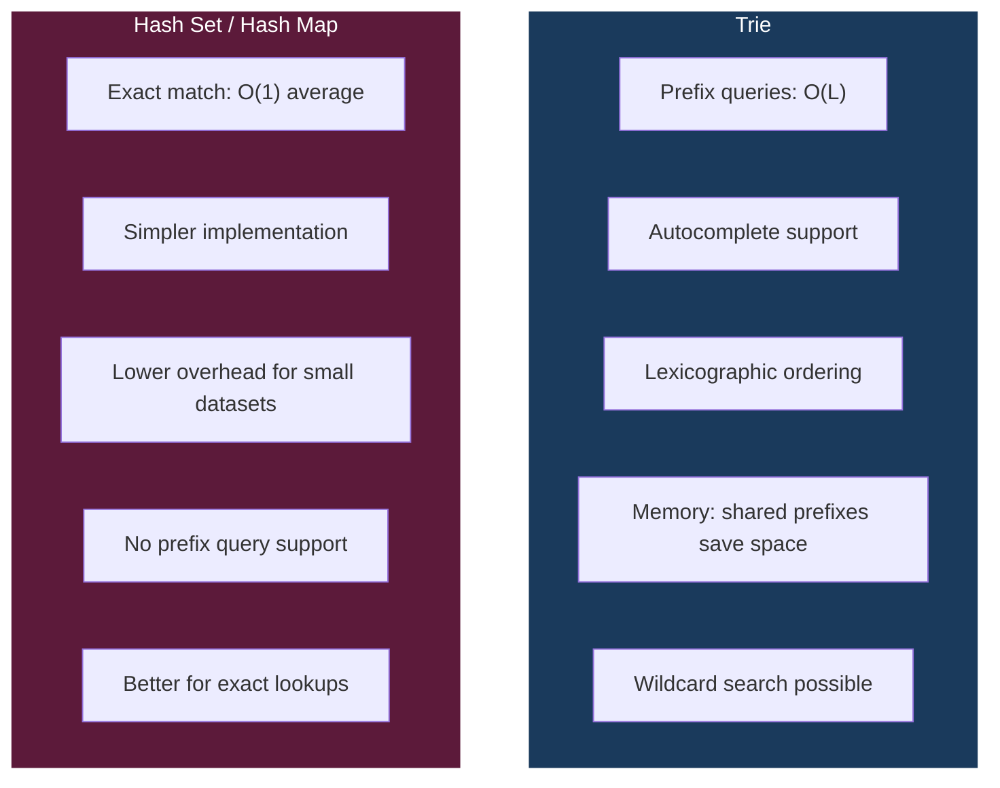
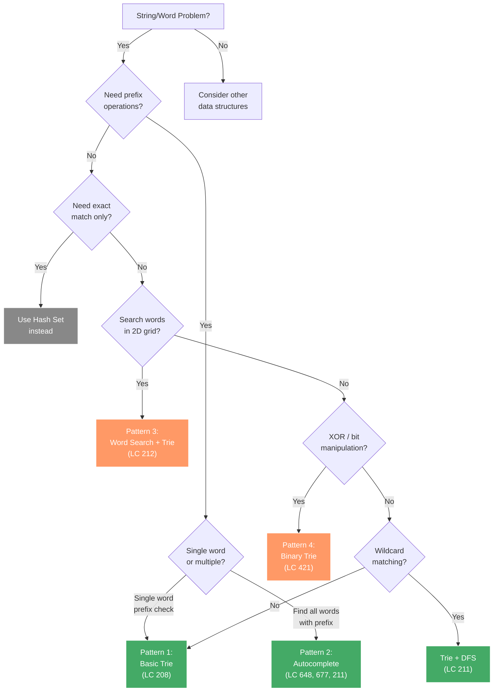

# Trie (Prefix Tree) - Day 40

## 1. What is a Trie?

A **Trie** (pronounced "try") is a tree-like data structure used to efficiently store and retrieve strings. It is also called a **prefix tree** because it organizes words by their shared prefixes.

Each node in a trie represents a single character. A path from the root to a node marked as `is_end = True` represents a complete word. Every node has:
- A **children** dictionary mapping characters to child nodes
- An **is_end** boolean flag indicating if a valid word ends at this node

### Trie After Inserting "apple", "app", "banana"



**Key insight**: Words sharing a common prefix share the same path in the trie. "apple" and "app" share the path `a -> p -> p`.

---

## 2. How It Works

### Insertion: Inserting "cat" Character by Character



**Insertion Algorithm:**
1. Start at the root node
2. For each character in the word:
   - If the character exists in current node's children, move to that child
   - If not, create a new node and add it as a child
3. After the last character, mark the node's `is_end = True`

### Search: Searching for "cat"



**Search Algorithm:**
1. Start at the root node
2. For each character in the word:
   - If the character exists in children, move to that child
   - If not, return `False` (word not in trie)
3. After traversing all characters, return the value of `is_end`

**Prefix Search (startsWith):** Same as search, but return `True` after traversing all prefix characters regardless of `is_end`.

---

## 3. TrieNode & Trie Implementation in Python

```python
class TrieNode:
    def __init__(self):
        self.children = {}   # char -> TrieNode
        self.is_end = False  # marks end of a complete word


class Trie:
    def __init__(self):
        self.root = TrieNode()

    def insert(self, word: str) -> None:
        """Insert a word into the trie."""
        node = self.root
        for char in word:
            if char not in node.children:
                node.children[char] = TrieNode()
            node = node.children[char]
        node.is_end = True

    def search(self, word: str) -> bool:
        """Return True if the word is in the trie."""
        node = self.root
        for char in word:
            if char not in node.children:
                return False
            node = node.children[char]
        return node.is_end

    def starts_with(self, prefix: str) -> bool:
        """Return True if any word in the trie starts with the given prefix."""
        node = self.root
        for char in prefix:
            if char not in node.children:
                return False
            node = node.children[char]
        return True
```

### How the Node Structure Looks in Memory



---

## 4. Operations & Time Complexities

| Operation | Time Complexity | Description |
|-----------|----------------|-------------|
| Insert | O(L) | Traverse/create L nodes for a word of length L |
| Search | O(L) | Traverse L nodes to check if word exists |
| Prefix Search (startsWith) | O(L) | Traverse L nodes to check if prefix exists |
| Delete | O(L) | Traverse L nodes, unmark/remove as needed |
| Autocomplete (all words with prefix) | O(L + K) | L to reach prefix node, K = total chars in all matching words |

**Space Complexity:** O(N * L) in the worst case, where N = number of words, L = average word length. In practice, shared prefixes significantly reduce this.

| Scenario | Space |
|----------|-------|
| No shared prefixes | O(N * L) - worst case |
| Many shared prefixes | Much less than O(N * L) |
| All words identical | O(L) - best case |

---

## 5. Key Patterns

### Pattern 1: Basic Trie (Medium)

The foundation pattern. Implement a trie with `insert`, `search`, and `startsWith`.



**When to use:** Any problem that asks you to store strings and query them by prefix.

**Problems:** LC 208 (Implement Trie)

---

### Pattern 2: Autocomplete / Prefix Search (Medium)

After reaching the prefix node, run DFS to collect all complete words below it.



**Algorithm:**
1. Navigate to the prefix node
2. Run DFS from that node
3. Whenever you reach a node with `is_end = True`, add the accumulated word to results

**When to use:** Autocomplete systems, finding all words with a given prefix.

**Problems:** LC 648 (Replace Words), LC 677 (Map Sum Pairs), LC 211 (Add and Search Word)

---

### Pattern 3: Word Search in Grid (Hard)

Combine a trie with backtracking to efficiently search for multiple words in a 2D grid.



**Why trie?** Without a trie, you would need to search for each word separately (N * M * 4^L). With a trie, you search for all words simultaneously during a single traversal.

**Problems:** LC 212 (Word Search II)

---

### Pattern 4: XOR Trie / Binary Trie (Hard)

Store numbers in binary form (bit by bit) in a trie. Used for maximum XOR problems.



**Algorithm for Maximum XOR:**
1. Insert all numbers into a binary trie (MSB to LSB)
2. For each number, greedily traverse the trie choosing the opposite bit at each level to maximize XOR
3. Track the maximum XOR found

**Problems:** LC 421 (Maximum XOR of Two Numbers in an Array)

---

## 6. Trie vs Hash Set



| Feature | Trie | Hash Set |
|---------|------|----------|
| Exact search | O(L) | O(L) average (hashing takes O(L)) |
| Prefix search | O(L) | O(N*L) - must check all strings |
| Autocomplete | Natural support | Not supported |
| Memory (many shared prefixes) | Efficient | Wasteful (stores full strings) |
| Memory (few shared prefixes) | Overhead per node | More compact |
| Implementation | More complex | Simple |
| Wildcard search | Possible with DFS | Requires regex/iteration |

**Rule of thumb:**
- Need prefix queries, autocomplete, or wildcard search? Use a **Trie**.
- Only need exact match lookups? Use a **Hash Set**.

---

## 7. Which Pattern to Use?



---

## 8. Common Mistakes

### Mistake 1: Forgetting the `is_end` Flag
```python
# WRONG: search returns True for any prefix
def search(self, word):
    node = self.root
    for char in word:
        if char not in node.children:
            return False
        node = node.children[char]
    return True  # BUG: "app" returns True even if only "apple" was inserted

# CORRECT: check is_end
def search(self, word):
    node = self.root
    for char in word:
        if char not in node.children:
            return False
        node = node.children[char]
    return node.is_end  # Only True if a word actually ends here
```

### Mistake 2: Not Handling Empty Trie / Empty String
```python
# Always consider edge cases:
# - Searching in an empty trie -> should return False
# - Inserting/searching empty string -> depends on problem constraints
# - The root node itself can have is_end=True (if empty string is inserted)
```

### Mistake 3: Memory Overhead Unawareness
- Each TrieNode creates a new dictionary object, which has overhead in Python
- For large datasets, consider using arrays of size 26 (for lowercase letters) instead of dicts
- For competitive programming, array-based tries are faster

### Mistake 4: Not Pruning in Word Search II (LC 212)
```python
# Without pruning, you re-search for words already found
# After finding a word, remove it from the trie to avoid duplicates
# and improve performance
node.is_end = False  # Unmark to avoid duplicate results
# Optionally remove empty branches (advanced optimization)
```

### Mistake 5: Off-by-One in Binary Trie
```python
# When building a binary trie, always use a fixed bit width
# e.g., 32 bits for integers
for i in range(31, -1, -1):  # MSB to LSB
    bit = (num >> i) & 1
```

---

## 9. Day Schedule

### Day 40: Trie + Final Revision

| Time Block | Task | Problems |
|-----------|------|----------|
| Morning (2h) | Learn Trie concepts, implement basic trie | LC 208, LC 14 (trie variant) |
| Afternoon (2h) | Medium trie problems with patterns | LC 211, LC 648, LC 677 |
| Evening (2h) | Hard trie problems | LC 212, LC 336, LC 421 |
| Night (1h) | Review all 40 days, identify weak areas | Revision |

### Problem Checklist

| # | Problem | Difficulty | Pattern | Status |
|---|---------|-----------|---------|--------|
| 1 | LC 208 - Implement Trie | Easy | Basic Trie | [ ] |
| 2 | LC 14 - Longest Common Prefix (Trie) | Easy | Basic Trie | [ ] |
| 3 | LC 211 - Add and Search Word | Medium | Trie + DFS | [ ] |
| 4 | LC 648 - Replace Words | Medium | Trie Prefix | [ ] |
| 5 | LC 677 - Map Sum Pairs | Medium | Trie Prefix | [ ] |
| 6 | LC 212 - Word Search II | Hard | Trie + Backtracking | [ ] |
| 7 | LC 336 - Palindrome Pairs | Hard | Trie | [ ] |
| 8 | LC 421 - Maximum XOR | Hard | Binary Trie | [ ] |

### Final Revision Strategy

After completing all 40 days:
1. **Revisit weak topics** - Go through problems you struggled with
2. **Pattern recognition drill** - Given a problem description, identify which pattern applies without coding
3. **Speed rounds** - Solve easy/medium problems within time limits (15 min easy, 25 min medium)
4. **Mock interviews** - Pick 2 random problems and solve them as if in an interview
5. **Spaced repetition** - Revisit problems after 1 day, 3 days, 7 days, 14 days
