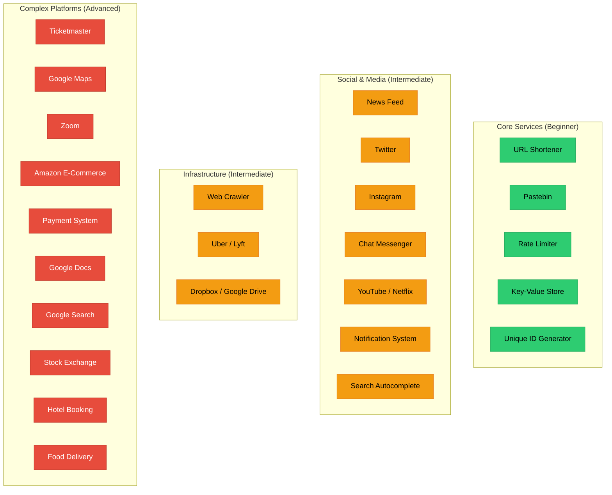
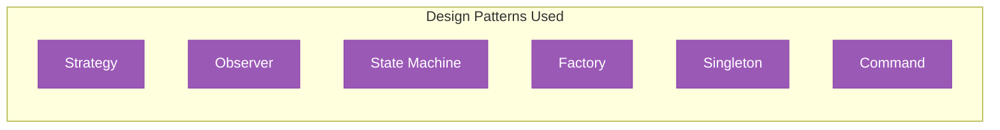

# System Design Interview Guide

A comprehensive guide covering **58 topics** across three pillars of system design interviews: core fundamentals, high-level design case studies, and low-level design problems. Master the concepts, then apply them to real-world systems.

---

## Visual Overview

```mermaid
graph TB
    SD["System Design Interview Guide<br/>58 Topics"]

    SD --> S1["Section 1: Fundamentals<br/>18 Topics"]
    SD --> S2["Section 2: HLD Case Studies<br/>25 Systems"]
    SD --> S3["Section 3: LLD Problems<br/>15 Problems"]

    S1 --> F1["Networking & APIs<br/>(Topics 1-2)"]
    S1 --> F2["Scaling & Performance<br/>(Topics 3-6)"]
    S1 --> F3["Distributed Systems<br/>(Topics 7-13)"]
    S1 --> F4["Architecture & Operations<br/>(Topics 14-18)"]

    S2 --> H1["Core Services<br/>(Systems 1-5)"]
    S2 --> H2["Social & Media<br/>(Systems 6-12)"]
    S2 --> H3["Infrastructure<br/>(Systems 13-15)"]
    S2 --> H4["Real-World Platforms<br/>(Systems 16-25)"]

    S3 --> L1["Classic OOD<br/>(Problems 1-6)"]
    S3 --> L2["Game Design<br/>(Problems 7-9)"]
    S3 --> L3["Application Design<br/>(Problems 10-15)"]

    style SD fill:#1a1a2e,stroke:#e94560,color:#eee
    style S1 fill:#16213e,stroke:#0f3460,color:#eee
    style S2 fill:#16213e,stroke:#0f3460,color:#eee
    style S3 fill:#16213e,stroke:#0f3460,color:#eee
    style F1 fill:#0f3460,stroke:#533483,color:#eee
    style F2 fill:#0f3460,stroke:#533483,color:#eee
    style F3 fill:#0f3460,stroke:#533483,color:#eee
    style F4 fill:#0f3460,stroke:#533483,color:#eee
    style H1 fill:#0f3460,stroke:#533483,color:#eee
    style H2 fill:#0f3460,stroke:#533483,color:#eee
    style H3 fill:#0f3460,stroke:#533483,color:#eee
    style H4 fill:#0f3460,stroke:#533483,color:#eee
    style L1 fill:#0f3460,stroke:#533483,color:#eee
    style L2 fill:#0f3460,stroke:#533483,color:#eee
    style L3 fill:#0f3460,stroke:#533483,color:#eee
```

---

## Section 1: Fundamentals (18 Topics)

> Build a rock-solid foundation before diving into design problems. These concepts appear in every single system design interview.

| # | Topic | Link | Difficulty | Key Concepts |
|---|-------|------|:----------:|--------------|
| 01 | Networking Basics | [concepts.md](./fundamentals/01-networking-basics.md) | `Easy` | TCP/UDP, HTTP/HTTPS, DNS, WebSockets, OSI model |
| 02 | API Design | [concepts.md](./fundamentals/02-api-design.md) | `Easy` | REST, GraphQL, gRPC, API versioning, pagination |
| 03 | Load Balancing | [concepts.md](./fundamentals/03-load-balancing.md) | `Medium` | L4 vs L7, round robin, least connections, health checks |
| 04 | Caching | [concepts.md](./fundamentals/04-caching.md) | `Medium` | Cache-aside, write-through, write-back, eviction policies, Redis |
| 05 | Databases | [concepts.md](./fundamentals/05-databases.md) | `Medium` | SQL vs NoSQL, ACID, indexing, normalization, query optimization |
| 06 | Database Scaling | [concepts.md](./fundamentals/06-database-scaling.md) | `Hard` | Sharding, replication, partitioning, read replicas, master-slave |
| 07 | Message Queues | [concepts.md](./fundamentals/07-message-queues.md) | `Medium` | Kafka, RabbitMQ, pub/sub, exactly-once delivery, dead letter queues |
| 08 | Consistent Hashing | [concepts.md](./fundamentals/08-consistent-hashing.md) | `Hard` | Hash rings, virtual nodes, data distribution, rebalancing |
| 09 | CAP Theorem | [concepts.md](./fundamentals/09-cap-theorem.md) | `Medium` | Consistency, availability, partition tolerance, PACELC |
| 10 | Rate Limiting | [concepts.md](./fundamentals/10-rate-limiting.md) | `Medium` | Token bucket, leaky bucket, sliding window, distributed rate limiting |
| 11 | Proxies & CDN | [concepts.md](./fundamentals/11-proxies-and-cdn.md) | `Easy` | Forward/reverse proxy, CDN edge nodes, cache invalidation |
| 12 | Storage & File Systems | [concepts.md](./fundamentals/12-storage-and-file-systems.md) | `Medium` | Block vs object storage, HDFS, S3, replication strategies |
| 13 | Distributed Systems Fundamentals | [concepts.md](./fundamentals/13-distributed-systems-fundamentals.md) | `Hard` | Consensus (Paxos, Raft), leader election, clock synchronization |
| 14 | Microservices Architecture | [concepts.md](./fundamentals/14-microservices-architecture.md) | `Medium` | Service discovery, API gateway, circuit breaker, saga pattern |
| 15 | Event-Driven Architecture | [concepts.md](./fundamentals/15-event-driven-architecture.md) | `Medium` | Event sourcing, CQRS, event bus, choreography vs orchestration |
| 16 | Security & Auth | [concepts.md](./fundamentals/16-security-and-auth.md) | `Medium` | OAuth 2.0, JWT, SSO, encryption at rest/transit, RBAC |
| 17 | Monitoring & Observability | [concepts.md](./fundamentals/17-monitoring-and-observability.md) | `Easy` | Metrics, logging, tracing, alerting, SLIs/SLOs/SLAs |
| 18 | Estimation & Math | [concepts.md](./fundamentals/18-estimation-and-math.md) | `Medium` | Back-of-envelope calculations, QPS, storage, bandwidth estimation |

---

## Section 2: High-Level Design Case Studies (25 Systems)

> Real-world system design problems asked in FAANG and top-tier company interviews. Each includes requirements, API design, data model, architecture, deep dives, and trade-offs.

| # | System | Link | Difficulty | Key Concepts |
|---|--------|------|:----------:|--------------|
| 01 | URL Shortener | [design.md](./hld/01-url-shortener.md) | `Easy` | Hashing, base62 encoding, redirection, analytics |
| 02 | Pastebin | [design.md](./hld/02-pastebin.md) | `Easy` | Object storage, TTL expiration, content addressing |
| 03 | Rate Limiter | [design.md](./hld/03-rate-limiter.md) | `Easy` | Token bucket, sliding window, distributed counters |
| 04 | Key-Value Store | [design.md](./hld/04-key-value-store.md) | `Medium` | Consistent hashing, replication, conflict resolution, gossip protocol |
| 05 | Unique ID Generator | [design.md](./hld/05-unique-id-generator.md) | `Easy` | Snowflake ID, UUID, clock synchronization, ordering |
| 06 | News Feed | [design.md](./hld/06-news-feed.md) | `Medium` | Fan-out on write vs read, ranking algorithm, caching |
| 07 | Twitter | [design.md](./hld/07-twitter.md) | `Medium` | Timeline generation, fan-out, celebrity problem, search |
| 08 | Instagram | [design.md](./hld/08-instagram.md) | `Medium` | Image storage, CDN, news feed, stories, explore ranking |
| 09 | Chat Messenger | [design.md](./hld/09-chat-messenger.md) | `Medium` | WebSockets, message ordering, read receipts, presence |
| 10 | YouTube / Netflix | [design.md](./hld/10-youtube-netflix.md) | `Hard` | Video transcoding, adaptive bitrate, CDN, recommendation engine |
| 11 | Notification System | [design.md](./hld/11-notification-system.md) | `Medium` | Push/SMS/email, prioritization, rate limiting, templating |
| 12 | Search Autocomplete | [design.md](./hld/12-search-autocomplete.md) | `Medium` | Trie, top-K, data collection, real-time updates |
| 13 | Web Crawler | [design.md](./hld/13-web-crawler.md) | `Medium` | BFS/DFS, URL frontier, politeness, deduplication, robots.txt |
| 14 | Uber / Lyft | [design.md](./hld/14-uber-lyft.md) | `Hard` | Geospatial indexing, matching algorithm, ETA, surge pricing |
| 15 | Dropbox / Google Drive | [design.md](./hld/15-dropbox-google-drive.md) | `Hard` | Chunked uploads, deduplication, sync conflict resolution, metadata |
| 16 | Ticketmaster | [design.md](./hld/16-ticketmaster.md) | `Hard` | Seat reservation, distributed locking, handling flash sales |
| 17 | Google Maps | [design.md](./hld/17-google-maps.md) | `Hard` | Graph algorithms (Dijkstra, A*), tile rendering, ETA calculation |
| 18 | Zoom (Video Conferencing) | [design.md](./hld/18-zoom-video-conferencing.md) | `Hard` | WebRTC, SFU vs MCU, SRTP, bandwidth adaptation |
| 19 | Amazon E-Commerce | [design.md](./hld/19-amazon-ecommerce.md) | `Hard` | Product catalog, cart, inventory management, order pipeline |
| 20 | Payment System | [design.md](./hld/20-payment-system.md) | `Hard` | Idempotency, double-entry ledger, reconciliation, PCI compliance |
| 21 | Google Docs | [design.md](./hld/21-google-docs.md) | `Hard` | OT/CRDT, real-time collaboration, conflict resolution, versioning |
| 22 | Google Search | [design.md](./hld/22-google-search.md) | `Hard` | Inverted index, PageRank, web crawling, query processing |
| 23 | Stock Exchange | [design.md](./hld/23-stock-exchange.md) | `Hard` | Order matching engine, order book, low latency, sequencer |
| 24 | Hotel Booking | [design.md](./hld/24-hotel-booking.md) | `Medium` | Inventory management, double booking prevention, search ranking |
| 25 | Food Delivery | [design.md](./hld/25-food-delivery.md) | `Hard` | Order dispatch, real-time tracking, delivery ETA, fleet management |

---

## Section 3: Low-Level Design Problems (15 Problems)

> Object-oriented design problems focusing on class diagrams, design patterns, SOLID principles, and clean code. These test your ability to translate requirements into well-structured code.

| # | Problem | Link | Difficulty | Key Concepts |
|---|---------|------|:----------:|--------------|
| 01 | Parking Lot | [design.md](./lld/01-parking-lot.md) | `Easy` | Strategy pattern, enum types, slot allocation |
| 02 | Elevator System | [design.md](./lld/02-elevator-system.md) | `Medium` | State machine, scheduling algorithms (SCAN, LOOK) |
| 03 | Library Management | [design.md](./lld/03-library-management.md) | `Easy` | CRUD operations, search, fine calculation, observer |
| 04 | Movie Ticket Booking | [design.md](./lld/04-movie-ticket-booking.md) | `Medium` | Seat locking, concurrency, payment integration |
| 05 | Chess Game | [design.md](./lld/05-chess-game.md) | `Medium` | Polymorphism, move validation, game state management |
| 06 | Hotel Management | [design.md](./lld/06-hotel-management.md) | `Medium` | Reservation system, room types, billing, observer pattern |
| 07 | Tic-Tac-Toe | [design.md](./lld/07-tic-tac-toe.md) | `Easy` | Board representation, win detection, turn management |
| 08 | ATM Machine | [design.md](./lld/08-atm-machine.md) | `Medium` | State pattern, chain of responsibility, transaction handling |
| 09 | Snake and Ladder | [design.md](./lld/09-snake-and-ladder.md) | `Easy` | Board modeling, random number generation, game loop |
| 10 | Splitwise | [design.md](./lld/10-splitwise.md) | `Medium` | Graph-based debt simplification, expense splitting strategies |
| 11 | Vending Machine | [design.md](./lld/11-vending-machine.md) | `Easy` | State pattern, inventory management, coin handling |
| 12 | Online Shopping Cart | [design.md](./lld/12-online-shopping-cart.md) | `Medium` | Cart management, pricing strategies, discount engine |
| 13 | Stack Overflow | [design.md](./lld/13-stack-overflow.md) | `Hard` | Reputation system, voting, tagging, search, moderation |
| 14 | Ride Sharing | [design.md](./lld/14-ride-sharing-lld.md) | `Hard` | Matching algorithm, fare calculation, trip state machine |
| 15 | Food Ordering | [design.md](./lld/15-food-ordering-lld.md) | `Hard` | Order state machine, restaurant management, delivery assignment |

---

## Recommended Study Order

Follow this 3-phase approach for maximum effectiveness.

### Phase 1: Foundations First (Week 1-2)

Complete all 18 fundamentals topics in order. These concepts are the building blocks referenced in every HLD and LLD problem.

| Priority | Topics | Why |
|----------|--------|-----|
| **Start here** | 01 Networking, 02 API Design | Every system communicates over a network |
| **Then** | 03 Load Balancing, 04 Caching, 18 Estimation | Core scaling tools + interview math |
| **Then** | 05 Databases, 06 DB Scaling, 08 Consistent Hashing | Data layer is the heart of every design |
| **Then** | 07 Message Queues, 09 CAP Theorem, 13 Distributed Systems | Understand trade-offs in distributed environments |
| **Then** | 10 Rate Limiting, 11 Proxies & CDN, 12 Storage | Defensive and delivery infrastructure |
| **Finally** | 14 Microservices, 15 Event-Driven, 16 Security, 17 Monitoring | Architectural patterns and operational concerns |

### Phase 2: HLD Case Studies (Week 3-6)

Start with simpler systems and progress to complex platforms. Each builds on the previous.

| Tier | Systems | Skills Practiced |
|------|---------|-----------------|
| **Tier 1 (Warm-up)** | URL Shortener, Pastebin, Rate Limiter, Unique ID Generator | Basic API + storage + single-service architecture |
| **Tier 2 (Core)** | Key-Value Store, News Feed, Twitter, Instagram, Chat Messenger | Fan-out, real-time, social graphs, caching layers |
| **Tier 3 (Intermediate)** | Notification System, Search Autocomplete, Web Crawler, Hotel Booking | Async processing, search, crawling, booking |
| **Tier 4 (Advanced)** | YouTube/Netflix, Uber/Lyft, Dropbox, Ticketmaster, Food Delivery | Streaming, geospatial, sync, concurrency |
| **Tier 5 (Expert)** | Google Maps, Zoom, Amazon, Payment System, Google Docs, Google Search, Stock Exchange | Multi-domain, low-latency, real-time collaboration |

### Phase 3: LLD Problems (Week 7-8)

Practice object-oriented design. Start with simpler problems to build confidence.

| Tier | Problems | Design Patterns |
|------|----------|-----------------|
| **Tier 1 (Warm-up)** | Parking Lot, Tic-Tac-Toe, Snake and Ladder, Vending Machine | Strategy, State, basic OOP |
| **Tier 2 (Core)** | Library Management, Elevator System, ATM Machine, Chess Game | State machine, polymorphism, scheduling |
| **Tier 3 (Advanced)** | Movie Ticket Booking, Hotel Management, Splitwise, Shopping Cart | Concurrency, observer, complex business logic |
| **Tier 4 (Expert)** | Stack Overflow, Ride Sharing, Food Ordering | Full-system OOD with multiple interacting components |

---

## Interview Day Tips

| Tip | Details |
|-----|---------|
| **Clarify requirements (2-3 min)** | Ask about scale, users, key features, constraints. Never jump into design. |
| **Estimate scale (3-5 min)** | QPS, storage, bandwidth. Show your math. Use Topic 18. |
| **Define API first (3-5 min)** | List core APIs before drawing boxes. This anchors the discussion. |
| **Start high-level, then deep-dive (15-20 min)** | Draw the big picture first, then zoom into 1-2 components the interviewer cares about. |
| **Discuss trade-offs** | Every decision has pros and cons. Mention alternatives you considered. |
| **Address bottlenecks** | Proactively identify single points of failure, hot spots, and scaling limits. |
| **Know your numbers** | Latency (L1 cache: 0.5ns, RAM: 100ns, SSD: 100us, HDD: 10ms, Network: 150ms). |

---

## Progress Tracker

| Section | Total | Completed | Remaining |
|---------|:-----:|:---------:|:---------:|
| Fundamentals | 18 | 0 | 18 |
| HLD Case Studies | 25 | 0 | 25 |
| LLD Problems | 15 | 0 | 15 |
| **Total** | **58** | **0** | **58** |
