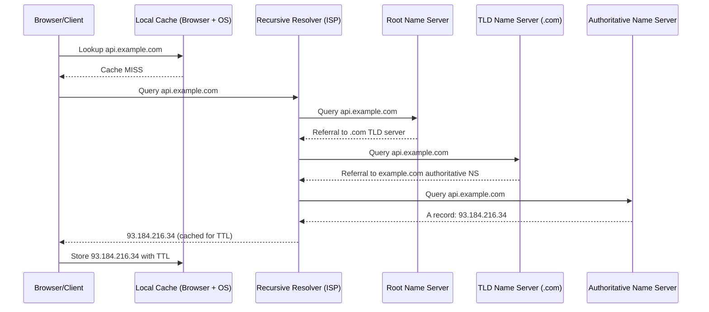
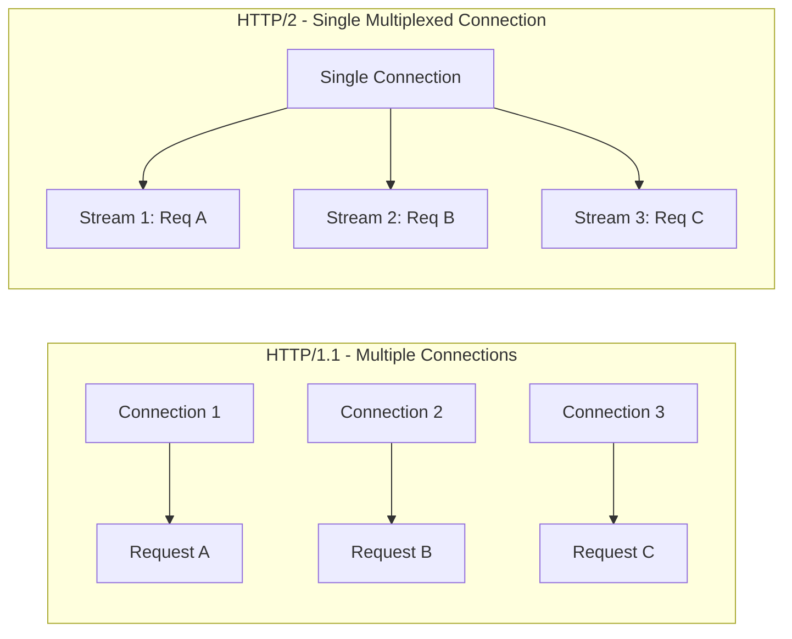
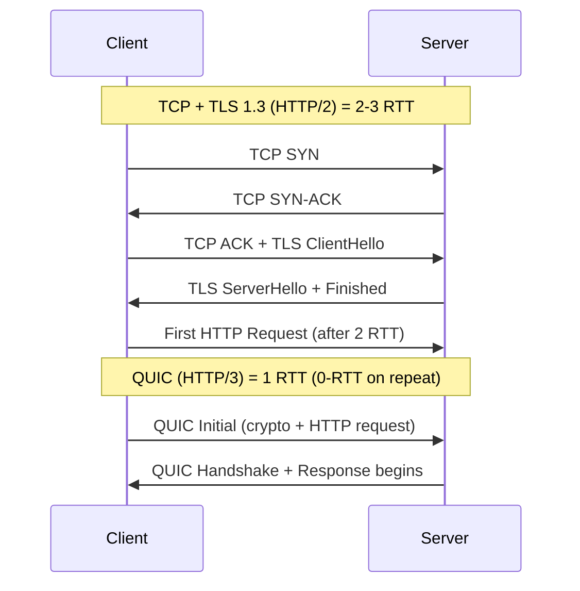
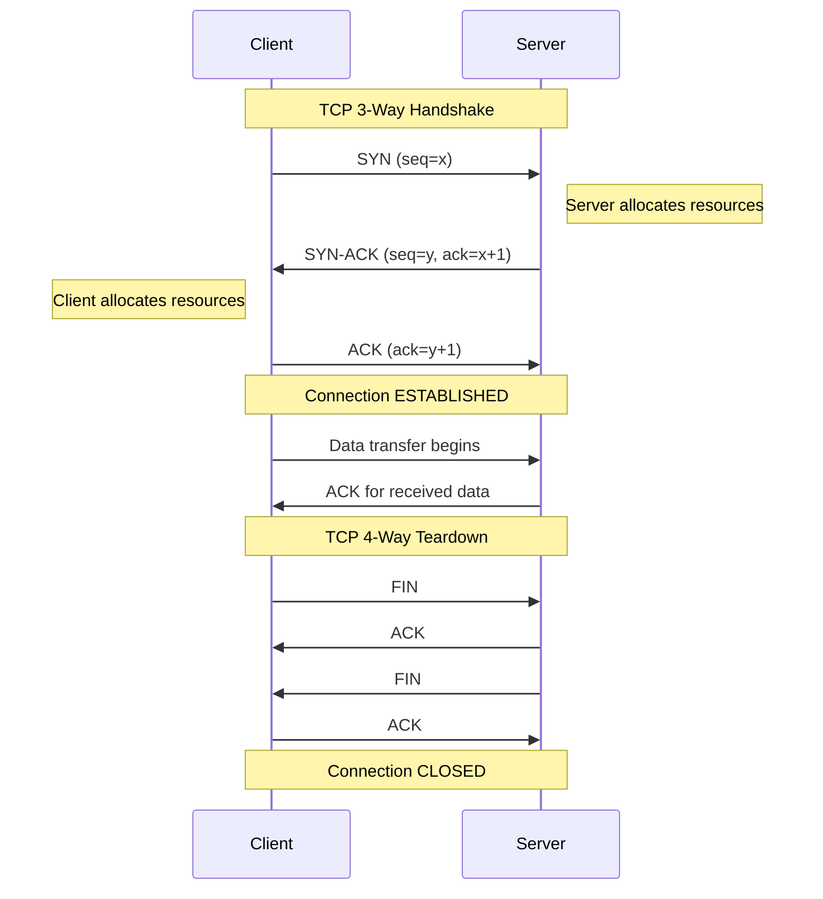
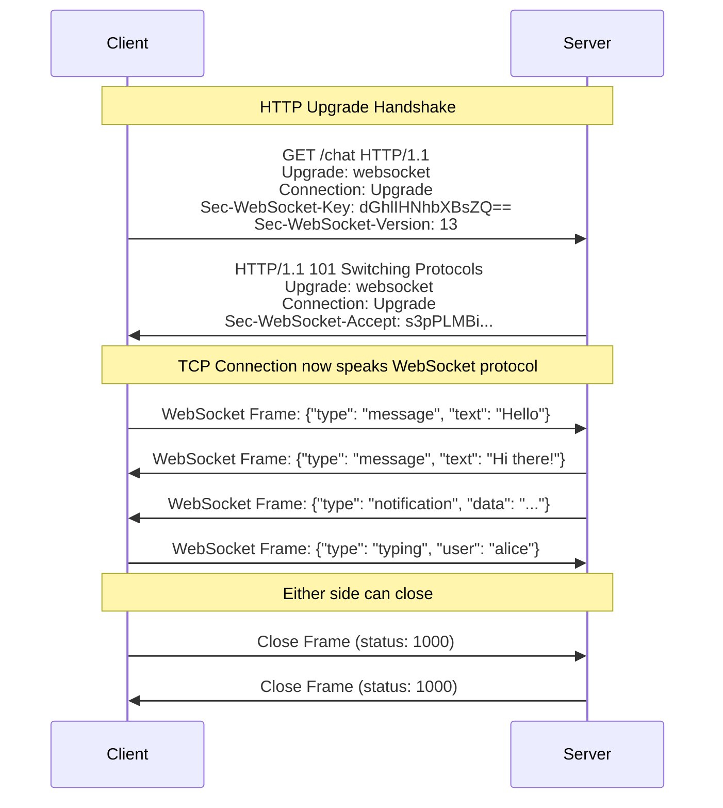
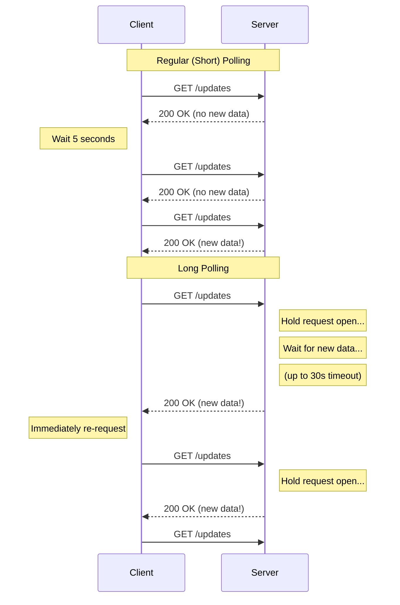
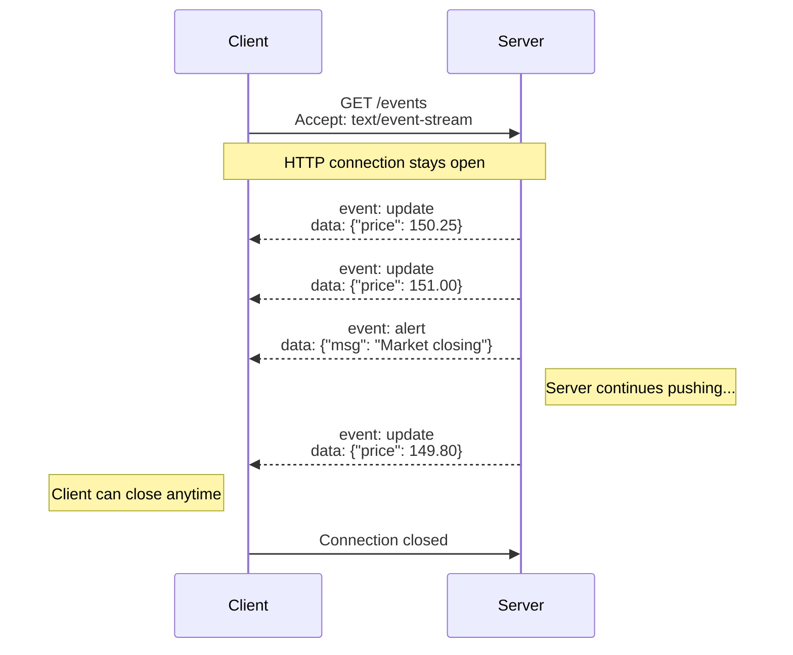
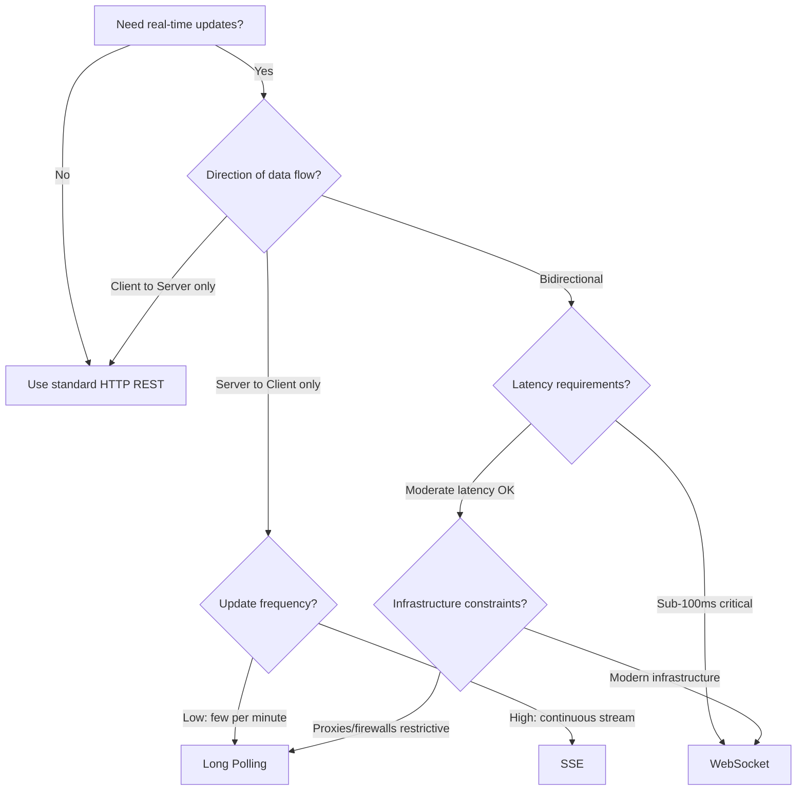

# Networking Basics

> Core networking concepts that form the foundation of every system design discussion.
> Understanding these protocols and patterns is essential for designing scalable, reliable distributed systems.

---

## 1. DNS Resolution

DNS (Domain Name System) translates human-readable domain names into IP addresses. It is one of the most critical pieces of internet infrastructure.

### How DNS Works

There are two resolution strategies:

**Recursive Resolution** - The DNS resolver takes full responsibility for resolving the query. The client sends one request and gets back a final answer. The resolver does all the heavy lifting, querying multiple servers if needed.

**Iterative Resolution** - The DNS server returns the best answer it currently has. If it doesn't know the final IP, it returns a referral to another DNS server. The resolver then queries that server, and so on until it gets the answer.

### DNS Resolution Flow



### DNS Record Types

| Record Type | Purpose | Example |
|-------------|---------|---------|
| **A** | Maps domain to IPv4 address | `example.com -> 93.184.216.34` |
| **AAAA** | Maps domain to IPv6 address | `example.com -> 2606:2800:220:1:...` |
| **CNAME** | Alias from one domain to another | `www.example.com -> example.com` |
| **MX** | Mail exchange server for the domain | `example.com -> mail.example.com (priority 10)` |
| **NS** | Authoritative name server for the domain | `example.com -> ns1.example.com` |
| **TXT** | Arbitrary text (SPF, DKIM, verification) | `example.com -> "v=spf1 include:..."` |
| **SRV** | Service location (host + port) | `_sip._tcp.example.com -> 5060 sip.example.com` |
| **PTR** | Reverse DNS lookup (IP to domain) | `34.216.184.93.in-addr.arpa -> example.com` |

### DNS Caching Layers

DNS responses are cached at multiple levels to reduce latency and load:

```
Request Flow (checked in order):

1. Browser Cache       (~1-30 min TTL, per-browser)
2. OS Cache            (systemd-resolved, dnsmasq, etc.)
3. Router Cache        (home/office router)
4. ISP Resolver Cache  (recursive resolver, respects TTL)
5. Authoritative DNS   (source of truth, sets the TTL)
```

**TTL (Time To Live)** - Each DNS record has a TTL value (in seconds) that tells caches how long to store the record before re-querying. Common values:

- Short TTL (60-300s): Used for failover, blue-green deploys, migration
- Long TTL (3600-86400s): Used for stable records, reduces DNS load
- Trade-off: Lower TTL = faster propagation but higher DNS query load

### Key Interview Points

- DNS is a hierarchical, distributed database
- A single page load may trigger dozens of DNS lookups (CDN, APIs, analytics, ads)
- DNS can be a single point of failure: use multiple providers, low TTLs for critical services
- DNS-based load balancing: Round-robin A records, weighted routing (Route 53), GeoDNS
- DNS propagation delay matters during migrations (honor old + new IPs during TTL window)

---

## 2. HTTP Protocol Evolution

### HTTP/1.1 (1997)

The workhorse of the web for nearly two decades.

**Key Features:**
- **Keep-Alive Connections** - Reuses TCP connections across multiple requests instead of opening a new connection per request (the HTTP/1.0 behavior)
- **Pipelining** - Client can send multiple requests without waiting for responses. However, responses must arrive in order (FIFO)
- **Chunked Transfer Encoding** - Server can start sending response before knowing total content length
- **Host Header** - Enables virtual hosting (multiple domains on one IP)

**Problems:**
- **Head-of-Line (HOL) Blocking** - If one response is slow, all subsequent pipelined responses are blocked behind it
- **Heavy Headers** - Headers sent as plain text on every request, often redundant (cookies, user-agent, etc.)
- **Limited Parallelism** - Browsers open 6-8 TCP connections per domain as a workaround, wasting resources

```
HTTP/1.1 Head-of-Line Blocking:

Connection 1: [--Req A--][--Resp A (slow)-----][--Req B--][--Resp B--]
Connection 2: [--Req C--][--Resp C--][--Req D--][--Resp D--]
                                     ^
                                     Blocked waiting for Resp A
```

### HTTP/2 (2015)

A major performance leap, based on Google's SPDY protocol.

**Key Features:**
- **Binary Framing Layer** - All communication split into binary frames, not text. More efficient parsing
- **Multiplexing** - Multiple requests and responses interleaved on a single TCP connection. No HOL blocking at the HTTP level
- **Header Compression (HPACK)** - Maintains a header table; sends only differences. Massive savings for repetitive headers
- **Server Push** - Server proactively sends resources it predicts the client will need (e.g., CSS/JS with HTML)
- **Stream Prioritization** - Client can assign priority/weight to streams so the server knows what to send first



**Remaining Problem:**
- **TCP-level HOL Blocking** - HTTP/2 solves HTTP-level HOL blocking, but a single lost TCP packet still stalls ALL streams on that connection (because TCP guarantees ordered delivery)

### HTTP/3 (2022)

Built on QUIC (Quick UDP Internet Connections), originally developed by Google.

**Key Features:**
- **QUIC Protocol** - Runs over UDP instead of TCP. Implements its own reliability, congestion control, and encryption
- **No TCP HOL Blocking** - Each stream is independently reliable. A lost packet on Stream A does NOT block Stream B
- **0-RTT Connection Establishment** - On repeat connections, can send data immediately (vs TCP+TLS requiring 2-3 round trips)
- **Connection Migration** - Connections identified by Connection ID, not IP:port tuple. Survives network switches (WiFi to cellular)
- **Built-in TLS 1.3** - Encryption is mandatory and integrated into the protocol, not layered on top



### HTTP Version Comparison

| Feature | HTTP/1.1 | HTTP/2 | HTTP/3 |
|---------|----------|--------|--------|
| **Transport** | TCP | TCP | QUIC (UDP) |
| **Multiplexing** | No (fake via 6-8 connections) | Yes (single connection) | Yes (single connection) |
| **Header Format** | Text, repetitive | Binary, HPACK compressed | Binary, QPACK compressed |
| **HOL Blocking** | HTTP + TCP level | TCP level only | None |
| **Server Push** | No | Yes | Yes |
| **Connection Setup** | 1 RTT (TCP) + 2 RTT (TLS) | 1 RTT (TCP) + 1 RTT (TLS 1.3) | 1 RTT (0-RTT on repeat) |
| **Connection Migration** | No | No | Yes (Connection ID) |
| **Encryption** | Optional (HTTPS) | Effectively required | Mandatory (built-in TLS 1.3) |
| **Adoption** | Universal | ~60% of top sites | ~30% and growing |

### Key Interview Points

- HTTP/2 is almost always better than HTTP/1.1; no reason not to use it
- HTTP/3 shines on unreliable networks (mobile, high-latency)
- Domain sharding (HTTP/1.1 trick) is an anti-pattern in HTTP/2 -- it prevents multiplexing
- Server Push in HTTP/2 is being deprecated in some browsers; use `103 Early Hints` instead
- gRPC uses HTTP/2 under the hood for its streaming and multiplexing capabilities

---

## 3. TCP vs UDP

### TCP (Transmission Control Protocol)

TCP provides reliable, ordered, error-checked delivery of data between applications.

#### 3-Way Handshake



#### TCP Reliability Mechanisms

**Flow Control (Receiver-side)**
- Receiver advertises a "window size" -- how much data it can buffer
- Sender never sends more than the window allows
- Prevents fast sender from overwhelming a slow receiver

**Congestion Control (Network-side)**
- Algorithms: Slow Start, Congestion Avoidance, Fast Retransmit, Fast Recovery
- Modern variants: CUBIC (Linux default), BBR (Google, used by YouTube/Google Cloud)
- Sender probes network capacity and backs off on packet loss

**Ordered Delivery**
- Each byte has a sequence number
- Receiver reorders out-of-order packets before delivering to application
- Guarantees application sees data in the exact order it was sent

**Error Detection**
- Checksum on every segment
- Retransmission on timeout or duplicate ACKs

### UDP (User Datagram Protocol)

UDP is a minimal, connectionless transport protocol. No handshake, no guaranteed delivery.

**Characteristics:**
- No connection setup -- just send packets
- No ordering guarantees
- No retransmission -- lost packets are gone
- No congestion control (by default)
- Very low overhead: 8-byte header (vs TCP's 20-byte minimum)
- Supports broadcast and multicast

**Use Cases:**
- DNS queries (small, single request-response)
- Video/audio streaming (stale data is useless; skip and move on)
- Online gaming (need latest state, not all historical states)
- VoIP (latency matters more than perfect delivery)
- IoT sensor data (high volume, acceptable loss)
- QUIC/HTTP/3 (builds its own reliability on top of UDP)

### TCP vs UDP Comparison

| Property | TCP | UDP |
|----------|-----|-----|
| **Connection** | Connection-oriented (3-way handshake) | Connectionless |
| **Reliability** | Guaranteed delivery with retransmission | Best-effort, no guarantees |
| **Ordering** | Ordered delivery (sequence numbers) | No ordering |
| **Flow Control** | Yes (sliding window) | No |
| **Congestion Control** | Yes (Slow Start, CUBIC, BBR) | No (unless app implements it) |
| **Header Size** | 20-60 bytes | 8 bytes |
| **Speed** | Slower (overhead for reliability) | Faster (minimal overhead) |
| **Broadcast/Multicast** | No | Yes |
| **Use Cases** | Web, email, file transfer, SSH, databases | DNS, streaming, gaming, VoIP |

### When to Use What

```
Use TCP when:
  - Data integrity is critical (financial transactions, file transfers)
  - Order matters (database replication, message queues)
  - You need guaranteed delivery (API calls, web pages)

Use UDP when:
  - Low latency is more important than completeness (gaming, VoIP)
  - Data becomes stale quickly (live video, sensor telemetry)
  - You want to implement custom reliability (QUIC)
  - Broadcasting/multicasting to multiple receivers
```

### Key Interview Points

- TCP's 3-way handshake adds 1 RTT of latency before any data flows
- TCP's congestion control means throughput ramps up slowly ("slow start")
- UDP is not "unreliable" -- it's "application-controlled reliability"
- QUIC proves you can build reliable protocols on UDP with better properties than TCP
- SYN flood attack exploits the 3-way handshake (server allocates resources on SYN)

---

## 4. WebSockets

WebSocket provides full-duplex, persistent communication over a single TCP connection. Once established, both client and server can send messages at any time without the overhead of HTTP request/response cycles.

### WebSocket Upgrade Handshake

WebSocket starts as an HTTP request and "upgrades" the connection:



### Client-Side Code Example

```javascript
const ws = new WebSocket('wss://api.example.com/ws');

ws.onopen = () => {
  console.log('Connected');
  ws.send(JSON.stringify({ type: 'subscribe', channel: 'updates' }));
};

ws.onmessage = (event) => {
  const data = JSON.parse(event.data);
  console.log('Received:', data);
};

ws.onclose = (event) => {
  console.log(`Closed: ${event.code} ${event.reason}`);
  // Implement reconnection logic with exponential backoff
};

ws.onerror = (error) => {
  console.error('WebSocket error:', error);
};
```

### Server-Side Considerations

```
Connection Management:
  - Each WebSocket holds a persistent TCP connection
  - Memory usage: ~2-10 KB per connection (varies by implementation)
  - A single server can handle 100K-1M+ connections with proper tuning
  - Use connection pooling and heartbeat/ping-pong to detect dead connections

Scaling WebSockets:
  - Sticky sessions required (client must reconnect to same server)
  - OR use a pub/sub backbone (Redis Pub/Sub, Kafka) so any server can
    forward messages to any connected client
  - Load balancers must support WebSocket upgrades (Layer 7)
```

### Use Cases

| Use Case | Why WebSocket? |
|----------|---------------|
| **Chat / Messaging** | Both parties send messages at any time; low latency |
| **Online Gaming** | Real-time game state updates in both directions |
| **Live Sports / Stocks** | Server pushes continuous updates; client sends interactions |
| **Collaborative Editing** | Multiple users editing same document (Google Docs, Figma) |
| **Live Notifications** | Server pushes events as they happen |

### Key Interview Points

- WebSocket is NOT HTTP after the handshake -- it's a separate protocol over TCP
- Connection is stateful -- harder to scale horizontally than stateless HTTP
- Need heartbeat mechanism (ping/pong frames) to detect broken connections
- Must implement reconnection with exponential backoff on the client
- Firewalls and proxies can sometimes block WebSocket upgrades
- For broadcast patterns, consider SSE instead (simpler, HTTP-native)

---

## 5. Long Polling

Long polling is a technique where the client makes an HTTP request and the server holds it open until new data is available or a timeout occurs. It simulates server push using standard HTTP.

### How Long Polling Works



### Implementation Pattern

```javascript
// Client-side long polling
async function longPoll(lastEventId = null) {
  try {
    const response = await fetch(`/api/updates?lastEventId=${lastEventId}`, {
      signal: AbortSignal.timeout(35000), // slightly longer than server timeout
    });

    if (response.status === 200) {
      const data = await response.json();
      handleUpdate(data);
      longPoll(data.lastEventId); // immediately poll again
    } else if (response.status === 204) {
      // Timeout with no new data, re-request immediately
      longPoll(lastEventId);
    }
  } catch (error) {
    console.error('Long poll error:', error);
    // Reconnect with backoff
    setTimeout(() => longPoll(lastEventId), 3000);
  }
}

longPoll();
```

### Timeout Handling

- Server holds the request for a maximum duration (typically 20-30 seconds)
- If no data arrives within the timeout, server responds with 204 (No Content) or empty 200
- Client immediately sends a new request upon receiving any response
- This avoids connection timeout issues with proxies and load balancers

### Pros and Cons

**Pros:**
- Works everywhere -- standard HTTP, no special protocol support needed
- Compatible with all load balancers, proxies, and firewalls
- Simple to implement
- Reduces unnecessary requests compared to short polling

**Cons:**
- Each "push" requires a full HTTP request/response cycle (headers, cookies, etc.)
- Server holds open connections, consuming resources even when idle
- Message delivery latency depends on timing (message arrives right after timeout = full round trip delay)
- Harder to handle high-frequency updates efficiently
- Not truly real-time -- there's always some lag

### Key Interview Points

- Long polling was the go-to before WebSockets existed (used by early Facebook chat, Gmail)
- Good enough for low-frequency updates where WebSocket complexity isn't justified
- Each held connection still consumes a server thread/connection (problematic at scale)
- Use `Last-Event-ID` or similar cursor for reliable message delivery

---

## 6. Server-Sent Events (SSE)

SSE provides a one-way, server-to-client streaming channel over a standard HTTP connection. The server can push events to the client continuously without the client having to re-request.

### How SSE Works



### SSE Event Format

The protocol is simple text-based:

```
event: update
data: {"userId": 123, "action": "login"}
id: 1001
retry: 5000

event: notification
data: {"message": "New comment on your post"}
id: 1002

: this is a comment (ignored by client)

data: Simple message without event type
id: 1003
```

Fields:
- `event:` - Event type (client can listen for specific types)
- `data:` - Payload (can be multi-line; each line prefixed with `data:`)
- `id:` - Event ID (used for reconnection -- client sends `Last-Event-ID` header)
- `retry:` - Reconnection interval in milliseconds
- Lines starting with `:` are comments (used as heartbeats to keep connection alive)

### Client-Side Code (EventSource API)

```javascript
const source = new EventSource('/api/events');

// Listen for all events
source.onmessage = (event) => {
  console.log('Message:', event.data);
};

// Listen for specific event types
source.addEventListener('update', (event) => {
  const data = JSON.parse(event.data);
  updateDashboard(data);
});

source.addEventListener('alert', (event) => {
  showAlert(JSON.parse(event.data));
});

// Built-in automatic reconnection
source.onerror = (event) => {
  console.log('SSE error, will auto-reconnect');
  // EventSource automatically reconnects with Last-Event-ID header
};

// Close when done
source.close();
```

### Server-Side Implementation (Node.js Example)

```javascript
app.get('/api/events', (req, res) => {
  res.writeHead(200, {
    'Content-Type': 'text/event-stream',
    'Cache-Control': 'no-cache',
    'Connection': 'keep-alive',
  });

  // Send heartbeat every 15 seconds to keep connection alive
  const heartbeat = setInterval(() => {
    res.write(': heartbeat\n\n');
  }, 15000);

  // Send events as they occur
  const onUpdate = (data) => {
    res.write(`event: update\n`);
    res.write(`data: ${JSON.stringify(data)}\n`);
    res.write(`id: ${data.id}\n\n`);
  };

  eventEmitter.on('update', onUpdate);

  // Handle client disconnect
  req.on('close', () => {
    clearInterval(heartbeat);
    eventEmitter.off('update', onUpdate);
  });
});
```

### When to Use SSE

**SSE is ideal when:**
- Data flows primarily server-to-client (dashboards, feeds, notifications)
- You want automatic reconnection and event ID tracking built-in
- You need HTTP/2 compatibility (multiplexed SSE streams are efficient)
- Simplicity matters more than bidirectional communication

**SSE is NOT ideal when:**
- You need bidirectional real-time communication (use WebSocket)
- You're sending binary data (SSE is text-only; would need Base64 encoding)
- You need to support very old browsers (IE has no support, though polyfills exist)

---

### Comparison: All Real-Time Communication Techniques

| Feature | Short Polling | Long Polling | SSE | WebSocket |
|---------|--------------|--------------|-----|-----------|
| **Direction** | Client-to-server | Client-to-server (simulated push) | Server-to-client only | Bidirectional |
| **Protocol** | HTTP | HTTP | HTTP | WS (upgraded from HTTP) |
| **Connection** | New per request | Held open, re-established | Persistent (single HTTP) | Persistent (single TCP) |
| **Latency** | High (polling interval) | Medium (held request) | Low (streaming) | Very Low (persistent) |
| **Overhead** | Very High (repeated headers) | High (repeated headers) | Low (single connection) | Very Low (small frames) |
| **Auto Reconnect** | N/A | Manual | Built-in (EventSource) | Manual |
| **Binary Data** | Yes (multipart) | Yes | No (text only) | Yes (binary frames) |
| **Browser Support** | Universal | Universal | All modern (no IE) | All modern |
| **Scalability** | High (stateless) | Medium | High (with HTTP/2) | Medium (stateful) |
| **Complexity** | Very Low | Low | Low | Medium-High |
| **Load Balancer** | Any | Any | Any | Must support upgrade |
| **Best For** | Simple checks, legacy | Moderate real-time, compatibility | Dashboards, feeds, notifications | Chat, gaming, collaboration |

### Decision Flow



---

## 7. Quick Reference Summary

### Protocol Decision Matrix

| Scenario | Recommended | Why |
|----------|-------------|-----|
| REST API for CRUD operations | HTTP/1.1 or HTTP/2 | Stateless, cacheable, simple |
| Real-time chat application | WebSocket | Bidirectional, low latency |
| Live stock ticker / dashboard | SSE | Server push, auto-reconnect |
| Online multiplayer game | WebSocket + UDP (for game state) | Bidirectional, lowest latency |
| Push notifications (web) | SSE or Long Polling | Server push, broad compatibility |
| File upload/download | HTTP/2 | Multiplexing, header compression |
| Video streaming | HTTP (HLS/DASH) over TCP, or WebRTC over UDP | Adaptive bitrate, or ultra-low latency |
| IoT sensor data ingestion | MQTT over TCP, or UDP | Lightweight, pub/sub pattern |
| Service-to-service (microservices) | gRPC (HTTP/2) | Multiplexing, streaming, strong typing |
| Mobile app on flaky network | HTTP/3 (QUIC) | 0-RTT, connection migration |

### Key Numbers to Remember

```
DNS:
  - DNS lookup:              ~20-120 ms (uncached)
  - DNS lookup (cached):     ~0-1 ms
  - Common TTL:              300s (5 min) to 86400s (24 hr)

TCP:
  - 3-way handshake:         1 RTT (~10-100 ms depending on distance)
  - TLS 1.3 handshake:       1 RTT (on top of TCP)
  - TLS 1.2 handshake:       2 RTTs (on top of TCP)
  - TCP MSS (Max Segment):   1460 bytes (typical)
  - TCP window scale:        up to ~1 GB window

HTTP:
  - HTTP/1.1 max parallel:   6-8 connections per domain (browser limit)
  - HTTP/2 max streams:      100-256 concurrent streams (configurable)
  - HTTP header size:         ~200-800 bytes typical, up to 8-16 KB limit
  - HTTP/3 0-RTT:            0 ms connection setup on repeat visits

WebSocket:
  - Frame overhead:           2-14 bytes per frame
  - Memory per connection:    ~2-10 KB
  - Connections per server:   100K-1M+ (with tuning, epoll/kqueue)

SSE:
  - Reconnection default:     ~3 seconds (configurable via retry field)
  - Max connections per domain: 6 (HTTP/1.1), unlimited (HTTP/2)
```

### Common Interview Patterns

**"Design a real-time notification system"**
- SSE for web clients (simple, auto-reconnect)
- WebSocket if clients also send data
- Long polling as fallback for restrictive environments
- Fan-out via pub/sub (Redis, Kafka) on the backend

**"How would you handle millions of concurrent connections?"**
- Use event-driven servers (Node.js, Go, Netty)
- Connection pooling and keep-alive
- Horizontal scaling with sticky sessions or pub/sub backbone
- Consider SSE over HTTP/2 (multiplexed, efficient)

**"Explain what happens when you type a URL in the browser"**
1. Browser checks HSTS list (upgrade to HTTPS if needed)
2. DNS resolution (cache hierarchy: browser -> OS -> ISP -> authoritative)
3. TCP 3-way handshake (SYN, SYN-ACK, ACK)
4. TLS handshake (ClientHello, ServerHello, key exchange)
5. HTTP request sent (GET / HTTP/2)
6. Server processes request, sends response
7. Browser parses HTML, discovers sub-resources
8. Parallel requests for CSS, JS, images (HTTP/2 multiplexing)
9. DOM construction, CSSOM, render tree, layout, paint
10. JavaScript execution, additional API calls

**"How to migrate from HTTP/1.1 to HTTP/2?"**
- Usually just a server/CDN configuration change
- Remove HTTP/1.1 optimizations: domain sharding, sprite sheets, CSS/JS concatenation
- Enable server push selectively (or use 103 Early Hints)
- Ensure load balancers support HTTP/2 (both client-facing and backend)

---

> **TL;DR**: DNS resolves names to IPs through a cached hierarchy. HTTP evolved from text-based 1.1 to multiplexed binary HTTP/2 to UDP-based HTTP/3. TCP guarantees reliability at the cost of latency; UDP trades reliability for speed. For real-time: use WebSockets for bidirectional, SSE for server push, long polling as a fallback. Always choose the simplest protocol that meets your requirements.
