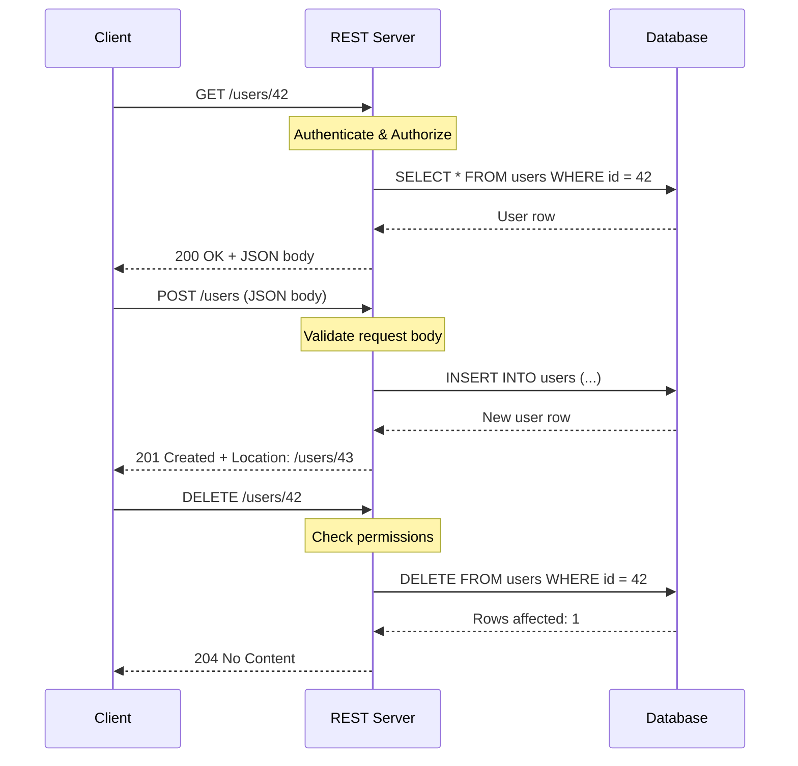
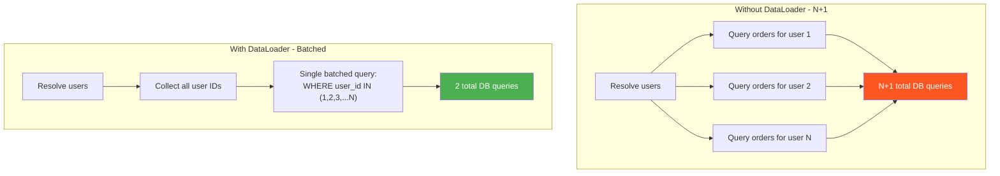
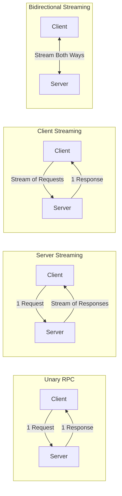
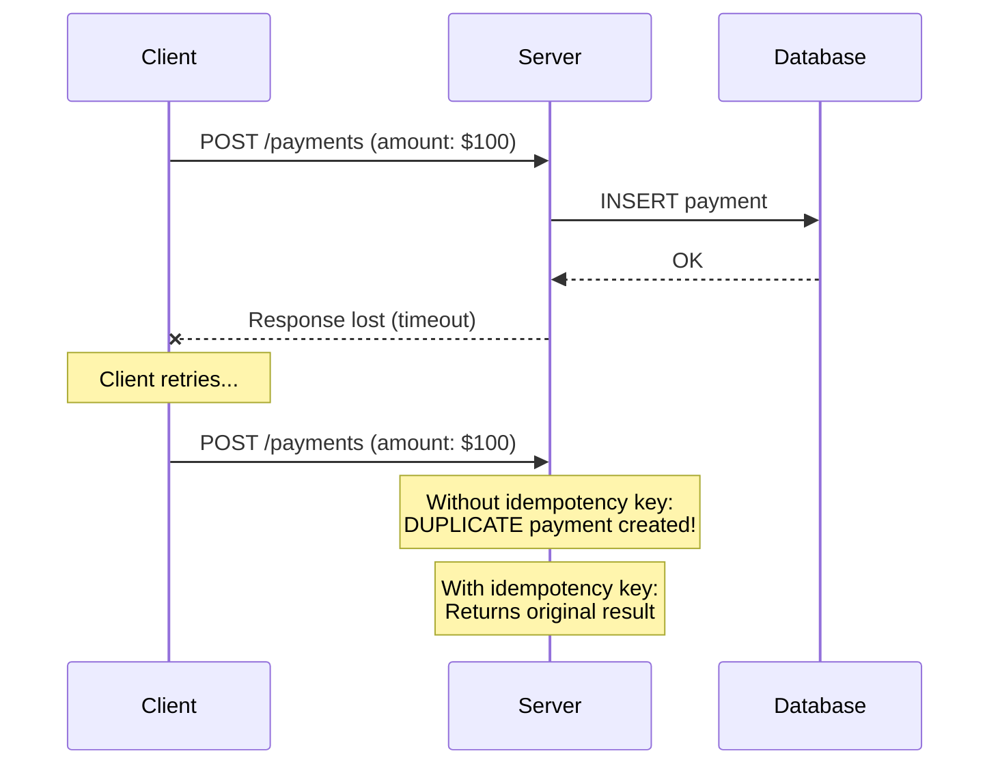
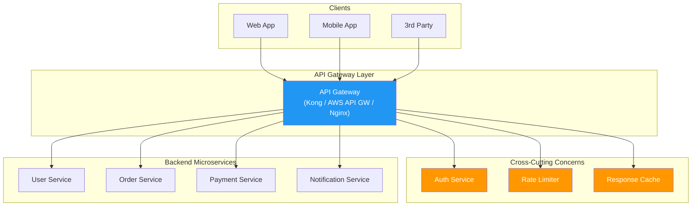
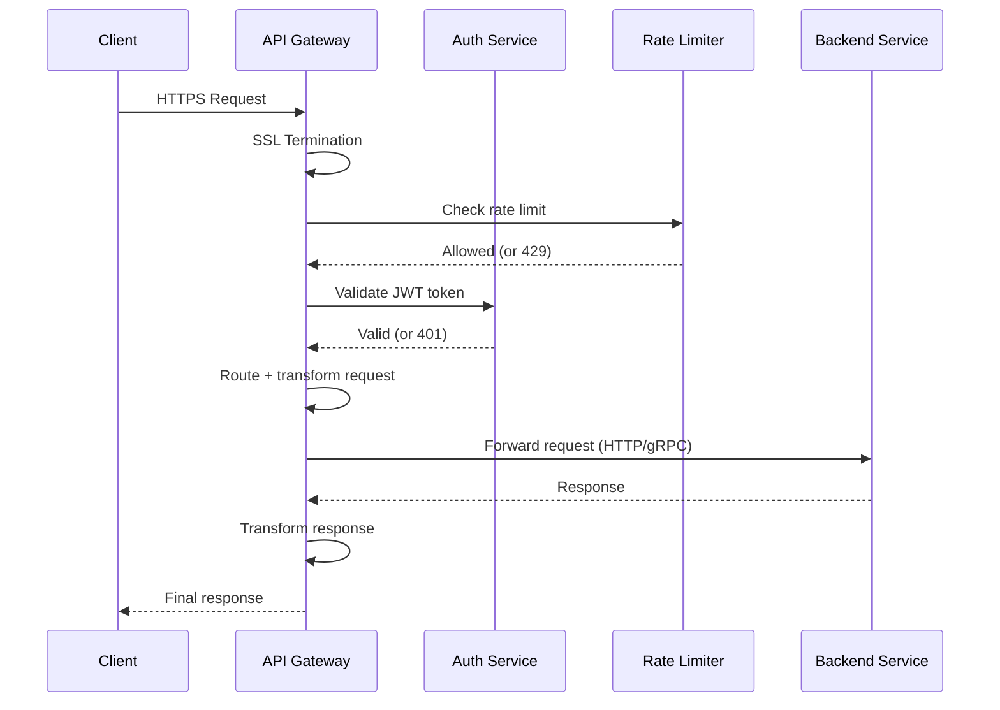

# API Design — Concepts Guide

---

## 1. REST API Design

REST (Representational State Transfer) is an architectural style for designing networked applications. It relies on a stateless, client-server communication protocol — almost always HTTP.

### 1.1 Resource Naming Conventions

Resources are the fundamental abstraction in REST. They are **nouns, not verbs**.

```
# Good — nouns representing resources
GET    /users
GET    /users/42
GET    /users/42/orders
POST   /users/42/orders

# Bad — verbs in the URL (RPC-style, not RESTful)
GET    /getUser?id=42
POST   /createOrder
POST   /deleteUser/42
```

**Naming rules:**

- Use **plural nouns** for collections: `/users`, `/orders`, `/products`
- Use **path parameters** for specific resources: `/users/{id}`
- Use **nesting** for relationships: `/users/{id}/orders`
- Keep nesting shallow (max 2-3 levels)
- Use **query parameters** for filtering/sorting/pagination: `/users?role=admin&sort=name`
- Use **kebab-case** for multi-word: `/order-items`

### 1.2 HTTP Methods

| Method | Purpose | Request Body | Idempotent | Safe |
|---|---|---|---|---|
| `GET` | Retrieve a resource | No | Yes | Yes |
| `POST` | Create a new resource | Yes | **No** | No |
| `PUT` | Replace a resource entirely | Yes | Yes | No |
| `PATCH` | Partially update a resource | Yes | **No*** | No |
| `DELETE` | Remove a resource | Optional | Yes | No |

> *PATCH can be made idempotent depending on the implementation, but is not guaranteed to be.

**PUT vs PATCH:** PUT replaces the entire resource (must send all fields). PATCH updates only specified fields.

### 1.3 HTTP Status Codes

#### 2xx — Success

| Code | Name | When to Use |
|---|---|---|
| `200` | OK | General success; GET returns data, PUT/PATCH returns updated resource |
| `201` | Created | Resource successfully created (POST); include `Location` header |
| `202` | Accepted | Request accepted for async processing; not yet completed |
| `204` | No Content | Success but no response body (common for DELETE) |

#### 3xx — Redirection

| Code | Name | When to Use |
|---|---|---|
| `301` | Moved Permanently | Resource URL changed permanently |
| `304` | Not Modified | Resource unchanged since last request (caching) |
| `307` | Temporary Redirect | Temporary redirect, preserves HTTP method |

#### 4xx — Client Error

| Code | Name | When to Use |
|---|---|---|
| `400` | Bad Request | Malformed syntax, invalid request body, validation errors |
| `401` | Unauthorized | Authentication required or failed (means "unauthenticated") |
| `403` | Forbidden | Authenticated but lacking permission |
| `404` | Not Found | Resource does not exist |
| `409` | Conflict | Request conflicts with current state (e.g., duplicate email) |
| `422` | Unprocessable Entity | Syntactically valid but semantically invalid |
| `429` | Too Many Requests | Rate limit exceeded; include `Retry-After` header |

#### 5xx — Server Error

| Code | Name | When to Use |
|---|---|---|
| `500` | Internal Server Error | Unexpected server failure |
| `502` | Bad Gateway | Upstream server returned invalid response |
| `503` | Service Unavailable | Server overloaded or in maintenance |
| `504` | Gateway Timeout | Upstream server did not respond in time |

### 1.4 HATEOAS

HATEOAS (Hypermedia As The Engine Of Application State) means API responses include **links** telling the client what actions are available next.

```json
{
  "id": 42,
  "status": "shipped",
  "_links": {
    "self": { "href": "/orders/42" },
    "cancel": { "href": "/orders/42/cancel", "method": "POST" },
    "customer": { "href": "/users/7" }
  }
}
```

HATEOAS is Richardson Maturity Model Level 3. In practice, very few APIs implement it fully — most stop at Level 2 (HTTP verbs + resources).

### 1.5 REST Request Flow



### 1.6 Error Response Design

Always return structured, consistent error responses:

```json
{
  "error": {
    "code": "VALIDATION_FAILED",
    "message": "Request validation failed",
    "details": [
      { "field": "email", "message": "Must be a valid email address" },
      { "field": "age", "message": "Must be a positive integer" }
    ],
    "request_id": "req_abc123"
  }
}
```

---

## 2. GraphQL

GraphQL is a **query language for APIs** developed by Facebook (2015). The client specifies exactly what data it needs, and the server returns precisely that.

### 2.1 Schema Definition

```graphql
type User {
  id: ID!
  name: String!
  email: String!
  orders: [Order!]!
}

type Order {
  id: ID!
  total: Float!
  status: OrderStatus!
}

enum OrderStatus {
  PENDING
  SHIPPED
  DELIVERED
  CANCELLED
}

type Query {
  user(id: ID!): User
  users(limit: Int, offset: Int): [User!]!
}

type Mutation {
  createUser(input: CreateUserInput!): User!
  updateOrder(id: ID!, status: OrderStatus!): Order!
}

input CreateUserInput {
  name: String!
  email: String!
}

type Subscription {
  orderStatusChanged(orderId: ID!): Order!
}
```

### 2.2 Queries, Mutations, and Subscriptions

```graphql
# Query — fetch data (like GET)
query GetUser {
  user(id: "42") {
    name
    email
    orders { id, total, status }
  }
}
```

```json
{
  "data": {
    "user": {
      "name": "Alice",
      "email": "alice@example.com",
      "orders": [
        { "id": "1", "total": 49.99, "status": "DELIVERED" },
        { "id": "2", "total": 29.99, "status": "SHIPPED" }
      ]
    }
  }
}
```

```graphql
# Mutation — modify data (like POST/PUT/DELETE)
mutation CreateUser {
  createUser(input: { name: "Bob", email: "bob@example.com" }) {
    id
    name
  }
}

# Subscription — real-time updates via WebSocket
subscription WatchOrder {
  orderStatusChanged(orderId: "1") { id, status }
}
```

### 2.3 The N+1 Problem and DataLoader

The N+1 problem is the most critical performance issue in GraphQL. When resolving a list of users and each user's orders, a naive resolver fires 1 query for users + N individual queries for each user's orders.

```
-- 1 query for users
SELECT * FROM users LIMIT 10;

-- N queries for orders (one per user)
SELECT * FROM orders WHERE user_id = 1;
SELECT * FROM orders WHERE user_id = 2;
... (10 queries total)
```

**Solution: DataLoader** — batches and caches individual loads within a single request.

```python
order_loader = DataLoader(batch_fn=load_orders_batch)

async def load_orders_batch(user_ids):
    # Single query: SELECT * FROM orders WHERE user_id IN (1, 2, 3, ...)
    orders = await db.query(
        "SELECT * FROM orders WHERE user_id IN (?)", user_ids
    )
    return [
        [o for o in orders if o.user_id == uid]
        for uid in user_ids
    ]

class UserResolver:
    def resolve_orders(self, user):
        return order_loader.load(user.id)  # batched automatically
```



### 2.4 REST vs GraphQL

| Aspect | REST | GraphQL |
|---|---|---|
| **Endpoints** | Multiple (one per resource) | Single endpoint (`/graphql`) |
| **Data fetching** | Fixed structure per endpoint | Client specifies exact fields |
| **Over-fetching** | Common (returns all fields) | Eliminated |
| **Under-fetching** | Requires multiple requests | Single request for nested data |
| **Caching** | Simple (HTTP caching by URL) | Complex (query-level caching) |
| **Versioning** | URL/header versioning | Schema evolution (deprecate fields) |
| **File uploads** | Native support | Requires workarounds |
| **Error handling** | HTTP status codes | Always 200; errors in response body |
| **Real-time** | Polling / SSE / WebSocket | Subscriptions built-in |

### 2.5 When to Use Each

**Use REST when:**
- Simple CRUD with well-defined resources
- Strong HTTP caching requirements
- Public APIs consumed by third parties
- File upload/download is a core feature

**Use GraphQL when:**
- Multiple clients (web, mobile, IoT) need different data shapes
- Frontend team wants autonomy over data requirements
- Deep nested relationships fetched in one round-trip
- Rapid frontend iteration without backend changes

---

## 3. gRPC

gRPC is a high-performance RPC framework developed by Google. It uses **Protocol Buffers** for serialization and **HTTP/2** for transport.

### 3.1 Protocol Buffers (Protobuf)

Protobuf is a language-neutral, binary serialization format — much smaller and faster than JSON.

```protobuf
syntax = "proto3";

service UserService {
  rpc GetUser (GetUserRequest) returns (User);
  rpc CreateUser (CreateUserRequest) returns (User);
  rpc ListUsers (ListUsersRequest) returns (stream User);          // server streaming
  rpc UploadActivity (stream Activity) returns (Summary);           // client streaming
  rpc Chat (stream Message) returns (stream Message);               // bidirectional
}

message User {
  string id = 1;
  string name = 2;
  string email = 3;
  repeated Order orders = 4;
}

message Order {
  string id = 1;
  double total = 2;
  OrderStatus status = 3;
}

enum OrderStatus {
  PENDING = 0;
  SHIPPED = 1;
  DELIVERED = 2;
  CANCELLED = 3;
}
```

### 3.2 Communication Patterns



| Pattern | Client | Server | Use Case |
|---|---|---|---|
| **Unary** | 1 request | 1 response | Simple request-response (like REST) |
| **Server streaming** | 1 request | Stream | Live feeds, large result sets, real-time updates |
| **Client streaming** | Stream | 1 response | File upload, sensor data, log aggregation |
| **Bidirectional** | Stream | Stream | Chat, multiplayer games, collaborative editing |

### 3.3 Why gRPC is Fast

1. **Binary serialization** (Protobuf): ~10x smaller than JSON, ~20-100x faster to serialize/deserialize
2. **HTTP/2**: Multiplexing (multiple requests over one TCP connection), header compression
3. **Code generation**: Client/server stubs auto-generated from `.proto` files
4. **Streaming**: First-class support avoids request/response overhead for continuous data

### 3.4 gRPC vs REST vs GraphQL

| Aspect | REST | GraphQL | gRPC |
|---|---|---|---|
| **Protocol** | HTTP/1.1 or HTTP/2 | HTTP/1.1 or HTTP/2 | HTTP/2 (required) |
| **Data format** | JSON (text) | JSON (text) | Protobuf (binary) |
| **Schema** | OpenAPI (optional) | SDL (required) | `.proto` files (required) |
| **Code generation** | Optional | Optional | Built-in (required) |
| **Streaming** | Limited (SSE, WebSocket) | Subscriptions | Native (4 patterns) |
| **Browser support** | Native | Native | Requires gRPC-Web proxy |
| **Performance** | Good | Good | Excellent |
| **Human readability** | High (JSON) | High (JSON) | Low (binary) |
| **Best for** | Public APIs | Flexible frontends | Microservices, internal APIs |

**When to use gRPC:**
- Internal microservice-to-microservice communication
- Low-latency, high-throughput requirements
- Polyglot environments (auto-generated clients for any language)
- Streaming is a core requirement

---

## 4. API Versioning

APIs evolve over time. Breaking changes need versioning strategies to avoid disrupting existing clients.

### 4.1 Versioning Strategies

**URI Path Versioning** (most common — used by Stripe, Twitter, Google):
```
GET /v1/users/42
GET /v2/users/42
```

**Header Versioning:**
```
GET /users/42
Accept: application/vnd.myapi.v2+json
```

**Query Parameter Versioning:**
```
GET /users/42?version=2
```

### 4.2 Comparison Table

| Strategy | Pros | Cons |
|---|---|---|
| **URI Path** (`/v1/users`) | Simple, explicit, cacheable, easy to route | URL changes; technically version is not a resource |
| **Header** (`Accept: vnd.api.v2`) | Clean URLs, follows HTTP semantics | Hidden, harder to test/debug, harder to cache |
| **Query Param** (`?version=2`) | Easy to implement and test | Can be forgotten, pollutes query string |

### 4.3 Best Practices

- **Use URI path versioning** unless you have a strong reason not to
- **Only version for breaking changes** — additive changes (new fields, new endpoints) do not require it
- **Support at most 2-3 versions simultaneously**
- **Communicate deprecation timelines clearly** — months of notice before sunsetting
- **GraphQL avoids versioning** — deprecated fields coexist with new ones:

```graphql
type User {
  email: String! @deprecated(reason: "Use contactEmail instead")
  contactEmail: String!
}
```

---

## 5. Pagination

When a collection is too large to return in a single response, pagination splits it into manageable chunks.

### 5.1 Offset-Based Pagination

```
GET /users?offset=20&limit=10
```

```json
{
  "data": [
    { "id": 21, "name": "User 21" },
    { "id": 30, "name": "User 30" }
  ],
  "pagination": { "offset": 20, "limit": 10, "total": 1000 }
}
```

```sql
SELECT * FROM users ORDER BY id LIMIT 10 OFFSET 20;
```

**Problem:** As offset grows, the database scans and discards all skipped rows. `OFFSET 100000` means scanning 100K rows just to throw them away.

### 5.2 Cursor-Based Pagination

Uses an opaque cursor (typically an encoded identifier) to mark position. The client passes the cursor from the previous response to get the next page.

```
GET /users?limit=10&after=eyJpZCI6MjB9
```

(`eyJpZCI6MjB9` = Base64-encoded `{"id":20}`)

```json
{
  "data": [
    { "id": 21, "name": "User 21" },
    { "id": 30, "name": "User 30" }
  ],
  "pagination": { "next_cursor": "eyJpZCI6MzB9", "has_next": true }
}
```

```sql
SELECT * FROM users WHERE id > 20 ORDER BY id LIMIT 10;
```

Uses an indexed `WHERE` clause instead of `OFFSET` — performance is consistent regardless of page depth.

### 5.3 Keyset Pagination

Similar to cursor-based but uses actual sort column values directly instead of an opaque cursor. The `WHERE` clause uses the last seen values: `WHERE (created_at, id) > ('2025-01-15', 500) ORDER BY created_at, id LIMIT 10`.

### 5.4 Comparison Table

| Aspect | Offset-Based | Cursor-Based | Keyset |
|---|---|---|---|
| **Implementation** | Simple | Moderate | Moderate |
| **Jump to page N** | Yes | No | No |
| **Deep page performance** | Degrades (O(offset)) | Constant (O(limit)) | Constant (O(limit)) |
| **Consistency** | Missed/duplicate items on insert/delete | Stable (anchored to cursor) | Stable (anchored to column values) |
| **Total count** | Easy to provide | Expensive to compute | Expensive to compute |
| **Sorting flexibility** | Any sort order | Must be deterministic + indexed | Must match indexed columns |
| **Use case** | Small datasets, admin dashboards | Social feeds, timelines, infinite scroll | Time-series data, logs, events |
| **Used by** | Basic CRUD apps | Facebook, Slack (Relay-style) | Twitter timeline, analytics |

> **Interview tip:** Start with cursor-based pagination. Explain why offset breaks down at scale, then discuss trade-offs.

---

## 6. Idempotency

An operation is **idempotent** if performing it multiple times produces the same result as performing it once.

### 6.1 Why It Matters

In distributed systems, networks are unreliable. Clients retry due to timeouts, load balancer retries, or client-side exponential backoff. Without idempotency, a retry could create a **duplicate order**, **charge a customer twice**, or **send double notifications**.



### 6.2 HTTP Method Idempotency

| Method | Idempotent? | Safe? | Explanation |
|---|---|---|---|
| `GET` | Yes | Yes | Reading data multiple times has no side effects |
| `PUT` | Yes | No | Replaces entire resource; same result each time |
| `DELETE` | Yes | No | First call deletes; subsequent calls return 404 (same end state) |
| `POST` | **No** | No | Creates new resource each time — duplicates possible |
| `PATCH` | **No** | No | Depends on implementation (e.g., `increment counter` is not idempotent) |

### 6.3 Idempotency Keys

For non-idempotent operations (like POST), use an **idempotency key** — a unique client-generated UUID sent with the request.

```
POST /payments
Idempotency-Key: 550e8400-e29b-41d4-a716-446655440000
Content-Type: application/json

{
  "amount": 100.00,
  "currency": "USD",
  "customer_id": "cust_42"
}
```

**Server-side logic:**

```python
def process_payment(request):
    key = request.headers["Idempotency-Key"]

    # Check if we already processed this key
    existing = cache.get(f"idempotency:{key}")
    if existing:
        return existing  # Return the original response

    result = payment_gateway.charge(request.body)

    # Store result mapped to key (TTL 24 hours)
    cache.set(f"idempotency:{key}", result, ttl=86400)
    return result
```

**Key implementation details:**
- Store key-to-response mapping in Redis or a database with a TTL (24-48 hours)
- Use database-level locking to prevent race conditions on simultaneous identical requests
- Stripe, PayPal, and most payment APIs use this pattern

### 6.4 Making Operations Idempotent by Design

| Operation | Non-Idempotent | Idempotent |
|---|---|---|
| Increment counter | `SET count = count + 1` | `SET count = 5` (absolute value) |
| Add item to list | `INSERT INTO cart (item)` | `INSERT ... ON CONFLICT DO NOTHING` |
| Send notification | `send_email(user, msg)` | `send_email_if_not_sent(user, msg, dedup_key)` |
| Transfer money | `debit(A); credit(B)` | Use transaction ID; check if already processed |

---

## 7. API Gateway

An API Gateway is a **single entry point** for all client requests. It sits between clients and backend services, handling cross-cutting concerns.

### 7.1 Core Responsibilities

| Function | Description |
|---|---|
| **Request routing** | Routes requests to the appropriate backend microservice |
| **Authentication** | Validates tokens (JWT, OAuth), checks permissions before forwarding |
| **Rate limiting** | Protects backends from traffic spikes; enforces usage quotas |
| **Load balancing** | Distributes requests across service instances |
| **Protocol translation** | Translates protocols (REST to gRPC), reshapes payloads |
| **Caching** | Caches frequent responses to reduce backend load |
| **SSL termination** | Handles HTTPS encryption at the edge |
| **Circuit breaking** | Stops forwarding to a failing service |
| **Observability** | Centralized logging, metrics, distributed tracing |

### 7.2 Architecture



### 7.3 Request Flow Through Gateway



### 7.4 Popular API Gateways

| Gateway | Type | Strengths |
|---|---|---|
| **Kong** | Open source / Enterprise | Plugin ecosystem, Lua-based, runs on Nginx |
| **AWS API Gateway** | Managed (cloud) | AWS integration, serverless (Lambda), auto-scaling |
| **Envoy** | Open source | gRPC-native, service mesh sidecar (used by Istio) |
| **Traefik** | Open source | Docker/Kubernetes native, auto-discovery |
| **Apigee** | Managed (Google) | Analytics, monetization, developer portal |

### 7.5 BFF Pattern (Backend for Frontend)

A variation with **one API gateway per client type** instead of a single gateway. Each client (web, mobile, TV) has different data needs, so each BFF tailors the API surface — mobile gets smaller payloads, web dashboards get richer data.

---

## 8. Quick Reference Summary

### API Style Decision Matrix

```
Is it a public API for external developers?
├── Yes → REST (widely understood, easy to document)
└── No → Is it internal microservice-to-microservice?
    ├── Yes → gRPC (fast, typed, streaming)
    └── No → Do multiple clients need different data shapes?
        ├── Yes → GraphQL (flexible queries)
        └── No → REST (simplest default)
```

### Key Design Decisions at a Glance

| Decision | Recommendation |
|---|---|
| API style | REST for public, gRPC for internal, GraphQL for flexible frontends |
| Versioning | URI path (`/v1/`) for simplicity |
| Pagination | Cursor-based for feeds/timelines; offset for admin/search |
| Idempotency | Idempotency keys for all non-idempotent write operations |
| Auth | OAuth 2.0 + JWT for most cases; API keys for simple integrations |
| Rate limiting | Token bucket or sliding window; return `429` + `Retry-After` |
| Error format | Consistent JSON with error code, message, and details |
| Gateway | Use one; do not let clients talk directly to microservices |

### Common Interview Questions

| Question | Key Points to Cover |
|---|---|
| "Design a REST API for X" | Resources, endpoints, methods, status codes, pagination, error handling |
| "REST vs GraphQL?" | Over/under-fetching, caching, versioning, complexity trade-offs |
| "How do you handle retries?" | Idempotency keys, exponential backoff, at-least-once vs exactly-once |
| "How do you version your API?" | URI path (most common), header versioning, only for breaking changes |
| "How do you paginate?" | Cursor-based for performance, offset for simplicity; explain trade-offs |
| "What does an API gateway do?" | Single entry point, auth, rate limiting, routing, transformation |
| "gRPC vs REST?" | Binary vs JSON, HTTP/2 vs HTTP/1.1, streaming, internal vs external |

### HTTP Methods Cheat Sheet

```
GET     /resources          → List all        → 200 + array
GET     /resources/{id}     → Get one         → 200 + object (or 404)
POST    /resources          → Create           → 201 + Location header
PUT     /resources/{id}     → Full replace    → 200 + updated object
PATCH   /resources/{id}     → Partial update   → 200 + updated object
DELETE  /resources/{id}     → Remove           → 204 No Content
```

### Status Code Cheat Sheet

```
200 OK           → Read/update success    400 Bad Request  → Invalid input
201 Created      → Create success (POST)  401 Unauthorized → Not authenticated
204 No Content   → Delete success         403 Forbidden    → Not authorized
404 Not Found    → Resource missing        409 Conflict     → Duplicate/state conflict
429 Too Many     → Rate limited            500 Server Error → Server bug
503 Unavailable  → Overloaded/maintenance
```
