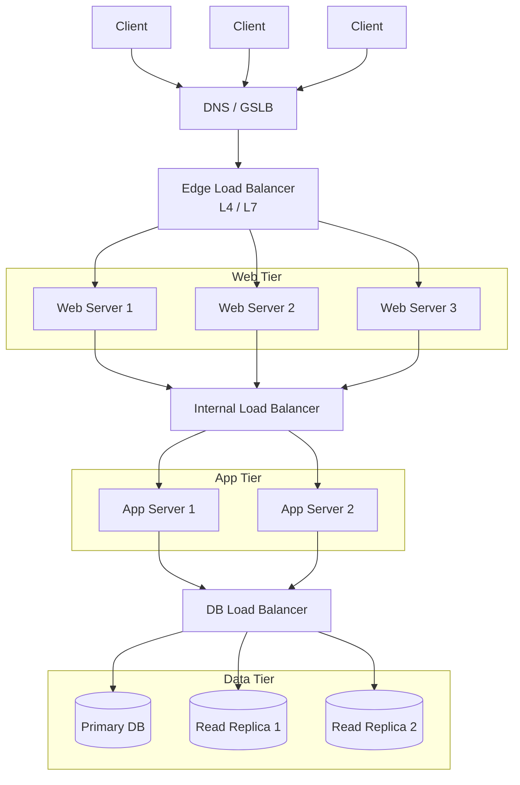
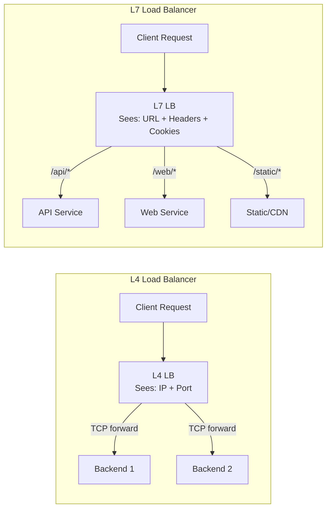
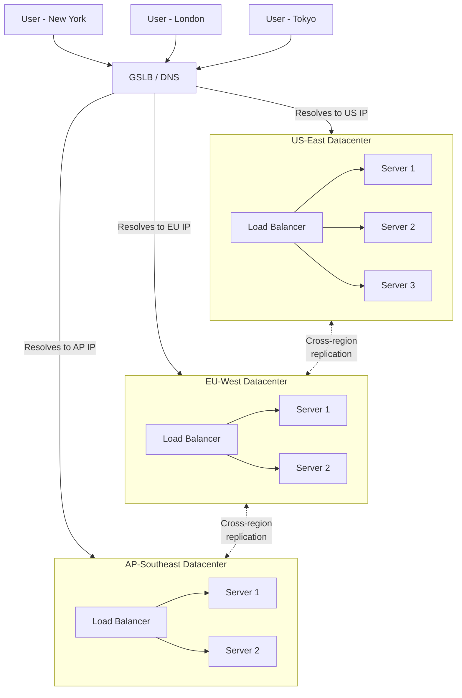

# Load Balancing — Comprehensive System Design Guide

---

## Table of Contents

1. [What is Load Balancing](#1-what-is-load-balancing)
2. [L4 vs L7 Load Balancing](#2-l4-vs-l7-load-balancing)
3. [Load Balancing Algorithms](#3-load-balancing-algorithms)
4. [Health Checks](#4-health-checks)
5. [Sticky Sessions (Session Affinity)](#5-sticky-sessions-session-affinity)
6. [Global Server Load Balancing (GSLB)](#6-global-server-load-balancing-gslb)
7. [Software vs Hardware Load Balancers](#7-software-vs-hardware-load-balancers)
8. [Quick Reference Summary](#8-quick-reference-summary)

---

## 1. What is Load Balancing

### Definition

A **load balancer** is a component that distributes incoming network traffic across multiple
backend servers (also called a server pool or server farm). It acts as a reverse proxy, sitting
between clients and servers, making the pool of servers appear as a single endpoint.

### Why Load Balancing is Needed

**Availability (Fault Tolerance)**
- If one server goes down, traffic is automatically redirected to healthy servers.
- Eliminates single points of failure in the serving tier.
- Enables zero-downtime deployments (rolling updates).

**Scalability (Horizontal Scaling)**
- Add or remove servers from the pool without downtime.
- Scale capacity to match demand — handle traffic spikes gracefully.
- Enables auto-scaling: cloud providers can add instances behind a load balancer automatically.

**Performance**
- Prevents any single server from becoming a bottleneck.
- Reduces response times by distributing work evenly.
- Enables geographic routing — send users to the nearest datacenter.

**Security**
- Hides internal server IPs from clients.
- Can terminate SSL/TLS at the load balancer (SSL offloading).
- Acts as a choke point where you can enforce rate limiting, WAF rules, etc.

### Where Load Balancers Sit in Architecture

Load balancers can be placed at multiple tiers:

| Placement              | What it Balances                         |
|------------------------|------------------------------------------|
| Edge / DNS level       | Routes users to the correct datacenter   |
| Between client and web | Distributes HTTP requests to web servers |
| Between web and app    | Distributes to application servers       |
| Between app and DB     | Distributes read queries across replicas |

### Architecture Diagram — LB Placement



### Key Terminology

| Term              | Meaning                                                     |
|-------------------|-------------------------------------------------------------|
| **Backend/Origin**| The actual servers that handle requests                     |
| **Pool/Farm**     | The group of backends behind a load balancer                |
| **VIP**           | Virtual IP — the single IP exposed to clients               |
| **Health Check**  | Periodic probe to determine if a backend is alive           |
| **Draining**      | Gracefully removing a server — finish in-flight, stop new   |
| **Failover**      | Automatic switch to a standby when the primary fails        |

---

## 2. L4 vs L7 Load Balancing

Load balancers operate at different layers of the OSI model. The two most relevant are
**Layer 4 (Transport)** and **Layer 7 (Application)**.

### L4 — Transport Layer Load Balancing

Operates at the TCP/UDP level. It sees only:
- Source IP and port
- Destination IP and port
- Protocol (TCP/UDP)

**How it works:**
1. Client opens a TCP connection to the VIP.
2. The L4 LB selects a backend based on IP/port tuple.
3. It either forwards packets directly (DSR) or proxies the TCP connection.
4. All packets in the same TCP flow go to the same backend.

**Characteristics:**
- Very fast — minimal packet inspection, often hardware-accelerated.
- Cannot inspect HTTP headers, URLs, cookies, or body content.
- Cannot do content-based routing (e.g., route `/api` to service A, `/web` to service B).
- Works for any TCP/UDP protocol (databases, gRPC, custom protocols).
- Lower latency, higher throughput.

### L7 — Application Layer Load Balancing

Operates at the HTTP/HTTPS level. It can inspect:
- URL path, query parameters
- HTTP headers (Host, User-Agent, Authorization, custom headers)
- Cookies
- Request body (in some implementations)
- HTTP method (GET, POST, etc.)

**How it works:**
1. Client opens a TCP connection and sends an HTTP request.
2. The L7 LB parses the full HTTP request.
3. Based on rules (URL path, headers, cookies), it selects a backend.
4. It opens a separate connection to the backend (full proxy).
5. Responses flow back through the LB to the client.

**Characteristics:**
- Can do content-based routing (microservices routing, A/B testing, canary deploys).
- Can rewrite URLs, add/remove headers, modify cookies.
- Supports SSL termination natively.
- Can do request buffering, compression, caching.
- Higher latency than L4 due to full request parsing.
- Only works for HTTP/HTTPS (or protocols it understands, like gRPC over HTTP/2).

### Comparison Table

| Feature                    | L4 (Transport)              | L7 (Application)                  |
|----------------------------|-----------------------------|------------------------------------|
| **OSI Layer**              | Layer 4 (TCP/UDP)           | Layer 7 (HTTP/HTTPS)               |
| **Inspects**               | IP, port, protocol          | URL, headers, cookies, body        |
| **Routing decisions**      | IP hash, port               | URL path, header values, cookies   |
| **Performance**            | Faster, lower latency       | Slower due to parsing overhead     |
| **SSL termination**        | Pass-through or terminate   | Full termination and re-encryption |
| **Content-based routing**  | No                          | Yes                                |
| **Protocol support**       | Any TCP/UDP                 | HTTP, HTTPS, gRPC, WebSocket       |
| **Connection to backend**  | Same connection (or NAT)    | New connection (full proxy)        |
| **Use cases**              | DB, gaming, non-HTTP        | Web apps, APIs, microservices      |
| **Examples**               | AWS NLB, HAProxy (TCP mode) | AWS ALB, Nginx, Envoy              |

### L4 vs L7 Diagram



### When to Use Which

**Choose L4 when:**
- You need maximum throughput and minimum latency.
- Traffic is non-HTTP (databases, game servers, custom TCP protocols).
- You don't need content-based routing.
- You need to handle millions of concurrent connections.

**Choose L7 when:**
- You need to route based on URL, headers, or cookies.
- You run microservices and need path-based routing.
- You want to do A/B testing, canary deployments, or blue-green deployments.
- You need SSL termination, header manipulation, or request rewriting.
- You want built-in WAF, rate-limiting, or authentication at the LB layer.

---

## 3. Load Balancing Algorithms

The algorithm determines **which backend** receives the next request.

### 3.1 Round Robin

**How it works:** Requests are distributed sequentially across servers in order.
Server 1, Server 2, Server 3, Server 1, Server 2, Server 3, ...

**Pros:**
- Simplest to implement and understand.
- Works well when all servers have identical capacity and requests have similar cost.

**Cons:**
- Ignores server load — a slow server gets the same share as a fast one.
- Ignores request cost — a heavy query counts the same as a lightweight one.

**Best for:** Homogeneous server pools with uniform request costs.

```
Request 1 --> Server A
Request 2 --> Server B
Request 3 --> Server C
Request 4 --> Server A  (wraps around)
Request 5 --> Server B
...
```

### 3.2 Weighted Round Robin

**How it works:** Each server is assigned a weight. Servers with higher weights receive
proportionally more requests.

**Example:** Server A (weight 5), Server B (weight 3), Server C (weight 2).
Out of every 10 requests: A gets 5, B gets 3, C gets 2.

**Pros:**
- Accounts for heterogeneous server capacities.
- Still simple to implement.

**Cons:**
- Weights are static — doesn't adapt to real-time load.
- Requires manual tuning of weights.

**Best for:** Mixed hardware environments where servers have different capacities.

### 3.3 Least Connections

**How it works:** New requests go to the server with the fewest active connections.

**Pros:**
- Adapts to real-time server load.
- Handles variable request durations well (long-lived connections, WebSockets).

**Cons:**
- Slightly more overhead — must track connection counts.
- Doesn't account for server capacity differences.

**Best for:** Workloads with variable request durations (WebSocket, streaming, long-polling).

```
Server A: 12 active connections
Server B:  7 active connections  <-- next request goes here
Server C: 15 active connections
```

### 3.4 Weighted Least Connections

**How it works:** Combines least connections with server weights.
The ratio `active_connections / weight` is computed, and the server with the lowest ratio wins.

**Example:**
- Server A: 10 connections, weight 5 --> ratio = 2.0
- Server B: 8 connections, weight 2 --> ratio = 4.0
- Server C: 6 connections, weight 3 --> ratio = 2.0
- Next request goes to A or C (lowest ratio).

**Best for:** Heterogeneous servers with variable request durations.

### 3.5 IP Hash

**How it works:** A hash of the client's IP address determines which server handles the request.
`server = hash(client_ip) % number_of_servers`

**Pros:**
- Same client always hits the same server (natural session affinity).
- No need for shared session state between servers.

**Cons:**
- Uneven distribution if client IP distribution is skewed (NAT, proxies).
- Adding/removing servers reshuffles assignments (mitigated with consistent hashing).
- Doesn't account for server load.

**Best for:** When you need simple session affinity without cookies, or for caching layers
where you want cache locality.

### 3.6 Least Response Time

**How it works:** Routes to the server with the lowest average response time
(and sometimes fewest active connections as a tiebreaker).

**Pros:**
- Adapts to real-time server performance.
- Naturally routes away from overloaded or degraded servers.

**Cons:**
- Requires continuous latency measurement.
- Can cause herding — all requests flood the fastest server, making it slow.
- Response time may vary by request type, not just server load.

**Best for:** Latency-sensitive workloads where you want to minimize p99 response times.

### 3.7 Random

**How it works:** Each request is assigned to a randomly chosen server.

**Pros:**
- Zero state — no need to track connections or response times.
- Statistically approaches even distribution at scale.

**Cons:**
- Can produce short-term imbalances.
- No awareness of server load or capacity.

**Variant — Power of Two Choices:** Pick two random servers, send to the one with fewer
connections. This is remarkably effective — it reduces max load from O(log n / log log n)
to O(log log n).

**Best for:** Very large server pools where simplicity matters, or as the foundation for
"power of two choices."

### Algorithm Comparison Table

| Algorithm               | Complexity | Stateful? | Adapts to Load? | Session Affinity? | Best Use Case                        |
|-------------------------|------------|-----------|------------------|--------------------|--------------------------------------|
| Round Robin             | O(1)       | No        | No               | No                 | Homogeneous pools, uniform requests  |
| Weighted Round Robin    | O(1)       | Minimal   | No               | No                 | Heterogeneous server capacities      |
| Least Connections       | O(n)       | Yes       | Yes              | No                 | Variable request durations           |
| Weighted Least Conn.    | O(n)       | Yes       | Yes              | No                 | Mixed hardware + variable durations  |
| IP Hash                 | O(1)       | No        | No               | Yes                | Caching, simple session affinity     |
| Least Response Time     | O(n)       | Yes       | Yes              | No                 | Latency-sensitive workloads          |
| Random                  | O(1)       | No        | No               | No                 | Large pools, simplicity              |
| Power of Two Choices    | O(1)       | Minimal   | Partially        | No                 | Large pools, good balance            |

---

## 4. Health Checks

Health checks determine whether a backend server is capable of handling requests.
Without health checks, a load balancer would send traffic to dead or degraded servers.

### Active vs Passive Health Checks

**Active Health Checks:**
- The load balancer proactively sends probe requests to each backend at regular intervals.
- Example: Send an HTTP GET to `/health` every 10 seconds.
- If a server fails N consecutive checks, it is marked unhealthy and removed from the pool.
- When it passes M consecutive checks, it is re-added.

**Passive Health Checks:**
- The load balancer monitors real traffic responses.
- If a server returns too many 5xx errors or connection timeouts on actual requests, it is
  marked unhealthy.
- No additional probe traffic — uses real user requests as the signal.
- Risk: some real user requests will fail before the server is marked unhealthy.

**Best practice:** Use both together. Active checks detect servers that are completely down.
Passive checks detect servers that are up but misbehaving (returning errors, slow responses).

### Types of Health Checks

| Type         | How it Works                                        | Thoroughness |
|--------------|-----------------------------------------------------|--------------|
| **TCP**      | Attempts TCP connection to port. Success = healthy. | Low — server  |
|              |                                                     | may accept TCP|
|              |                                                     | but return 500|
| **HTTP**     | Sends GET to `/health`, checks status code (200).   | High — tests  |
|              | Can also inspect response body.                     | app logic     |
| **Custom**   | Runs a script checking DB, disk, queue depth, etc.  | Highest —     |
|              |                                                     | most complex  |

### Health Check Configuration Parameters

| Parameter             | Description                                        | Typical Value  |
|-----------------------|----------------------------------------------------|----------------|
| **Interval**          | Time between consecutive checks                    | 5-30 seconds   |
| **Timeout**           | Max time to wait for a response                    | 2-5 seconds    |
| **Unhealthy threshold** | Consecutive failures before marking unhealthy    | 2-5 failures   |
| **Healthy threshold** | Consecutive successes before marking healthy again | 2-3 successes  |
| **Grace period**      | Initial delay before first check (server startup)  | 30-120 seconds |

### Grace Periods and Thresholds

**Grace period (initial delay):**
When a new server is added to the pool (e.g., during auto-scaling), it may need time to
start up, load caches, warm JIT compilers, etc. The grace period prevents the LB from
immediately checking a server that isn't ready yet.

**Unhealthy threshold:**
A single failed check shouldn't remove a server — it could be a transient network blip.
Requiring 2-5 consecutive failures prevents flapping (rapidly toggling between healthy
and unhealthy).

**Healthy threshold:**
Similarly, a server that was marked unhealthy shouldn't be immediately re-added after one
successful check. It should prove stability with several consecutive successes.

### Designing a Good Health Check Endpoint

A `/health` endpoint should return `200` when healthy, `503` when not. Include checks for
critical dependencies (DB, cache) but keep it lightweight. Distinguish between **liveness**
(is the process running?) and **readiness** (can it serve traffic?) — Kubernetes makes this
distinction explicit with separate probe types.

---

## 5. Sticky Sessions (Session Affinity)

### What Are Sticky Sessions?

Sticky sessions ensure that all requests from a particular client are always routed to the
**same backend server** for the duration of a session. This is needed when session state is
stored locally on the server (in-memory sessions).

### Implementation Methods

| Method            | How it Works                                           | Reliability     |
|-------------------|--------------------------------------------------------|-----------------|
| **Cookie-based**  | LB sets a cookie (`SERVERID=backend-2`), client sends  | High — most     |
|                   | it on subsequent requests                              | common method   |
| **IP-based**      | Hash of client IP determines backend (like IP Hash)    | Lower — NAT and |
|                   |                                                        | proxies break it|
| **Header-based**  | Route on a custom header (`X-User-ID`, auth token)     | High — needs L7 |

### When Sticky Sessions Are Needed

- **In-memory session storage:** Server stores session data in local memory (no shared store).
- **WebSocket connections:** The persistent connection must stay with the same server.
- **File uploads (multi-part):** Chunked uploads where the server holds partial state.
- **Shopping carts (legacy):** Older systems that store cart state server-side in memory.

### When to Avoid Sticky Sessions

- **Stateless applications:** If session state is in Redis, a database, or JWT tokens,
  sticky sessions are unnecessary.
- **Auto-scaling environments:** Sticky sessions make scaling down harder — you can't remove
  a server that has active sessions without disrupting users.
- **Uneven load distribution:** A popular user generates disproportionate load, and their
  requests can't be spread across servers.
- **Fault tolerance:** If a server dies, all its sticky sessions are lost.

### Impact on Scaling

| Aspect            | With Sticky Sessions            | Without (Stateless)              |
|-------------------|---------------------------------|----------------------------------|
| Scale up          | Works, but new server gets no   | Works seamlessly                 |
|                   | existing sessions               |                                  |
| Scale down        | Must drain sessions first or    | Remove any server instantly      |
|                   | lose them                       |                                  |
| Server failure    | Users lose their session state  | No impact — any server can serve |
| Load distribution | Can become uneven               | Even distribution                |
| Deployment        | Rolling deploys more complex    | Simple rolling deploys           |

**Best practice:** Design stateless backends. Store session data in an external store
(Redis, Memcached, database). Use JWT tokens for authentication state. This eliminates
the need for sticky sessions entirely.

---

## 6. Global Server Load Balancing (GSLB)

GSLB distributes traffic across **multiple datacenters or regions**, not just multiple servers
within a single datacenter. It ensures users are routed to the nearest or most optimal
datacenter.

### DNS-Based GSLB

**How it works:**
1. Client queries DNS for `app.example.com`.
2. The authoritative DNS server (acting as GSLB) returns the IP of the nearest/best datacenter.
3. It considers: geographic proximity, datacenter health, current load, network latency.
4. DNS TTL controls how frequently clients re-resolve (trade-off: freshness vs DNS load).

**Pros:**
- Simple to implement — leverages existing DNS infrastructure.
- Works for any protocol (HTTP, TCP, UDP).
- No additional hardware in the traffic path.

**Cons:**
- DNS caching means changes are not immediate (TTL delay).
- Limited granularity — can't route individual requests, only DNS resolutions.
- Client resolvers may not be geographically close to the client (EDNS Client Subnet helps).

### Anycast-Based GSLB

The same IP address is announced from multiple datacenters via BGP. The network naturally
routes packets to the nearest datacenter. Near-instant failover (BGP reconverges in seconds),
no DNS TTL concerns. Requires BGP control — typically only large providers (Cloudflare,
Google, AWS CloudFront). Caveat: BGP reconvergence can break in-flight TCP connections.

### Geo-Routing

Route users based on their geographic location:

| User Location   | Routed To        | Rationale                    |
|-----------------|------------------|------------------------------|
| North America   | us-east-1        | Lowest latency               |
| Europe          | eu-west-1        | Data sovereignty (GDPR)      |
| Asia-Pacific    | ap-southeast-1   | Lowest latency               |
| Everywhere else | us-east-1        | Default / largest capacity   |

Geo-routing decisions can also factor in:
- **Latency:** Route to the datacenter with lowest measured RTT.
- **Capacity:** Route away from datacenters near capacity.
- **Compliance:** Keep EU user data in EU datacenters (GDPR).
- **Cost:** Route to cheaper regions when latency is similar.

### GSLB Architecture Diagram



### GSLB Failover

When a datacenter goes down, GSLB health checks detect the failure and DNS responses are
updated to exclude it. Failover time with DNS-based GSLB equals the DNS TTL (set to 30-60s
for fast failover). With anycast, BGP reconverges automatically in seconds.

---

## 7. Software vs Hardware Load Balancers

### Software Load Balancers

Software LBs run on commodity hardware or virtual machines. They are the dominant choice
in modern cloud-native architectures.

#### Nginx

- Originally a web server, now widely used as a reverse proxy and load balancer.
- Supports L7 load balancing (HTTP, HTTPS, gRPC, WebSocket).
- Can also do L4 (TCP/UDP stream proxying).
- Configuration-driven (static config files, reload on change).
- Very high performance — event-driven, non-blocking architecture.
- Open source (Nginx) and commercial (Nginx Plus with health checks, dashboard, etc.).

```nginx
# Nginx L7 load balancing example
upstream backend {
    least_conn;
    server backend1.example.com:8080 weight=3;
    server backend2.example.com:8080 weight=2;
    server backend3.example.com:8080 weight=1;
}

server {
    listen 80;
    location / {
        proxy_pass http://backend;
    }
}
```

#### HAProxy

- Purpose-built for load balancing and proxying.
- Supports both L4 (TCP mode) and L7 (HTTP mode).
- Known for extreme performance and reliability — used in high-traffic production systems.
- Rich health checking, detailed stats dashboard.
- Advanced features: connection draining, stick tables, ACLs.
- Open source (HAProxy) and commercial (HAProxy Enterprise).

```haproxy
# HAProxy L7 load balancing example
frontend http_front
    bind *:80
    default_backend http_back

backend http_back
    balance roundrobin
    option httpchk GET /health
    server srv1 10.0.0.1:8080 check weight 3
    server srv2 10.0.0.2:8080 check weight 2
    server srv3 10.0.0.3:8080 check weight 1
```

#### Envoy

- Modern, cloud-native proxy designed for microservices (originated at Lyft).
- L4 and L7 support with advanced observability built in.
- Dynamic configuration via xDS API — no restarts needed.
- Native support for HTTP/2, gRPC, WebSocket.
- Built-in distributed tracing, metrics, circuit breaking, retry logic.
- Foundation of service meshes like Istio.
- Written in C++ for high performance.

#### Software LB Comparison

| Feature              | Nginx                 | HAProxy               | Envoy                  |
|----------------------|-----------------------|-----------------------|------------------------|
| **Primary use**      | Web server + LB       | Dedicated LB          | Service mesh proxy     |
| **L4 support**       | Yes (stream module)   | Yes (TCP mode)        | Yes                    |
| **L7 support**       | Yes                   | Yes (HTTP mode)       | Yes                    |
| **Config model**     | Static files          | Static files          | Static + dynamic (xDS) |
| **Hot reload**       | Yes (graceful)        | Yes (graceful)        | Yes (dynamic API)      |
| **HTTP/2**           | Yes                   | Yes                   | Native                 |
| **gRPC**             | Yes                   | Limited               | Native                 |
| **Observability**    | Basic (logs)          | Good (stats page)     | Excellent (built-in)   |
| **Circuit breaking**  | No (native)          | Limited               | Yes                    |
| **Service mesh**     | No (but Nginx Mesh)   | No                    | Yes (Istio, etc.)      |
| **Performance**      | Excellent             | Excellent             | Very good              |
| **Learning curve**   | Low                   | Medium                | High                   |

### Hardware Load Balancers

Physical appliances purpose-built for load balancing. They include specialized ASICs
and network processors for maximum throughput.

| Product               | Key Features                                        |
|-----------------------|-----------------------------------------------------|
| **F5 BIG-IP**         | L4-L7, SSL offloading, WAF, DDoS. Millions of conn. |
| **Citrix ADC**        | Similar to F5, strong in Microsoft/Citrix envs.     |

**When to use hardware:** Extreme throughput (100+ Gbps), compliance mandates, legacy enterprise.

**Why they are declining:** Cloud managed LBs, software LBs are sufficient for most workloads,
hardware is expensive and creates vendor lock-in.

### AWS Load Balancer Comparison

| Feature               | CLB (Classic)         | ALB (Application)      | NLB (Network)           | GWLB (Gateway)        |
|-----------------------|-----------------------|------------------------|--------------------------|------------------------|
| **OSI Layer**         | L4 + L7               | L7                     | L4                       | L3 + L4               |
| **Protocols**         | HTTP, HTTPS, TCP, SSL | HTTP, HTTPS, gRPC      | TCP, UDP, TLS            | IP (all protocols)     |
| **Routing**           | Basic                 | Path, host, header,    | Port-based               | Inline traffic         |
|                       |                       | query string           |                          | inspection             |
| **Performance**       | Moderate              | Good                   | Ultra-high (millions rps)| High                   |
| **Static IP**         | No                    | No (use with Global    | Yes (Elastic IP per AZ)  | Yes                    |
|                       |                       | Accelerator)           |                          |                        |
| **WebSocket**         | No                    | Yes                    | Yes                      | N/A                    |
| **SSL termination**   | Yes                   | Yes                    | Yes (TLS)                | N/A                    |
| **Target types**      | EC2 instances         | IP, instance, Lambda   | IP, instance, ALB        | IP, instance           |
| **Health checks**     | TCP, HTTP             | HTTP, HTTPS, gRPC      | TCP, HTTP, HTTPS         | TCP, HTTP, HTTPS       |
| **Status**            | Legacy (deprecated)   | Recommended for HTTP   | Recommended for TCP/UDP  | For 3rd-party          |
|                       |                       |                        |                          | appliances             |
| **Pricing model**     | Per hour + data       | Per hour + LCU         | Per hour + NLCU          | Per hour + GLCU        |

**When to use which AWS LB:**
- **ALB:** Web applications, REST APIs, microservices, gRPC. Most common choice.
- **NLB:** Gaming, IoT, real-time communication, extreme performance needs. Also useful
  when you need a static IP or need to preserve the client source IP.
- **GWLB:** Inline security appliances (firewalls, IDS/IPS).
- **CLB:** Don't — it's legacy. Migrate to ALB or NLB.

---

## 8. Quick Reference Summary

### Load Balancing Decision Tree

```
Need to distribute traffic across servers?
|
+-- What protocol?
|   |
|   +-- HTTP/HTTPS/gRPC --> L7 Load Balancer
|   |   |
|   |   +-- Need path/header routing? --> ALB / Nginx / Envoy
|   |   +-- Simple round robin? --> Nginx / HAProxy
|   |
|   +-- TCP/UDP (non-HTTP) --> L4 Load Balancer
|       |
|       +-- AWS? --> NLB
|       +-- Self-hosted? --> HAProxy (TCP mode)
|
+-- Multiple datacenters?
|   |
|   +-- Yes --> GSLB (DNS-based or Anycast)
|   +-- No --> Single LB is sufficient
|
+-- Need session affinity?
    |
    +-- Yes --> Can you move to stateless? (preferred)
    |   +-- No --> Cookie-based sticky sessions
    +-- No --> Standard algorithms (least conn, round robin)
```

### Algorithm Cheat Sheet

| Scenario                                     | Recommended Algorithm       |
|----------------------------------------------|-----------------------------|
| All servers identical, uniform requests      | Round Robin                 |
| Servers have different capacities            | Weighted Round Robin        |
| Long-lived connections (WebSocket, streaming)| Least Connections           |
| Mixed servers + variable durations           | Weighted Least Connections  |
| Need simple session affinity                 | IP Hash                     |
| Latency-critical application                 | Least Response Time         |
| Very large server pool, simplicity needed    | Random / Power of Two       |

### Key Numbers to Know (Interview)

| Metric                                | Approximate Value              |
|---------------------------------------|--------------------------------|
| Nginx max concurrent connections      | ~100,000+ (single instance)    |
| HAProxy max concurrent connections    | ~1,000,000+ (tuned)           |
| AWS NLB throughput                    | Millions of requests/sec       |
| AWS ALB throughput                    | Thousands of new conn/sec/AZ   |
| DNS TTL for fast GSLB failover       | 30-60 seconds                  |
| Health check interval (typical)      | 5-30 seconds                   |
| L4 LB added latency                  | < 1 ms                        |
| L7 LB added latency                  | 1-5 ms                        |

### Interview Tips

1. **Always mention LB when designing any scalable system.** It is the first step in
   horizontal scaling.

2. **Clarify L4 vs L7.** State which layer you are choosing and why.

3. **Mention health checks.** Interviewers want to know you think about failure handling.

4. **Avoid sticky sessions if possible.** Explain why stateless backends are preferred.

5. **Know the AWS LB types.** ALB for HTTP, NLB for TCP/UDP, and why.

6. **GSLB for multi-region.** If the system is global, mention DNS-based or anycast GSLB.

7. **Common follow-up questions:**
   - "What happens when a server goes down?" -- Health checks detect it, LB stops routing.
   - "How do you handle session state?" -- External store (Redis), not sticky sessions.
   - "How do you deploy without downtime?" -- Rolling deploy behind LB with health checks.
   - "How do you handle a traffic spike?" -- Auto-scaling group behind LB.
   - "What if the load balancer itself goes down?" -- Active-passive LB pair, or managed
     LB service (AWS ALB is inherently HA).

8. **LB is not a silver bullet.** It only helps if the backend can be horizontally scaled.
   If the bottleneck is a single database, adding more app servers behind a LB won't help.
   You need to address the bottleneck (read replicas, sharding, caching).

---

### Further Reading Connections

| Topic                    | Related Section                              |
|--------------------------|----------------------------------------------|
| Consistent Hashing       | `08-consistent-hashing/` — for IP hash + server changes |
| Caching                  | `04-caching/` — cache-aware routing          |
| CDN and Proxies          | `11-proxies-and-cdn/` — reverse proxies      |
| Database Scaling         | `06-database-scaling/` — read replica LB     |
| Microservices            | `14-microservices-architecture/` — service mesh LB |
| Rate Limiting            | `10-rate-limiting/` — rate limiting at the LB layer |
