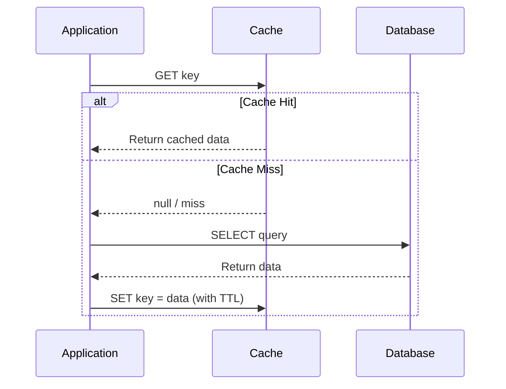
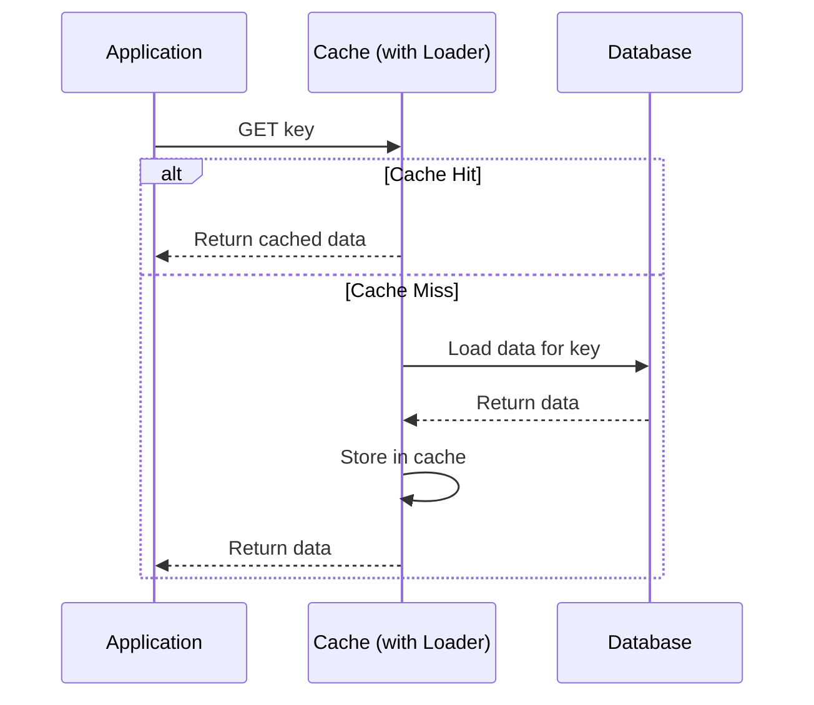
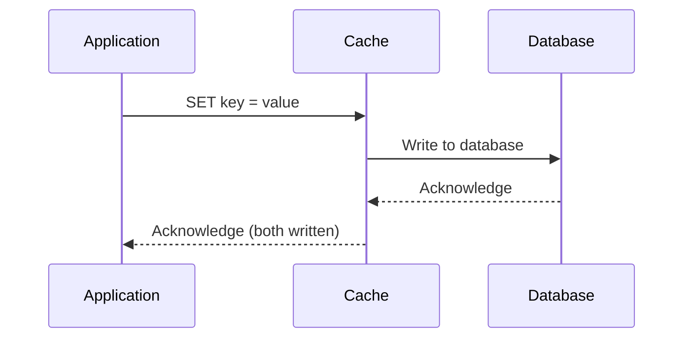
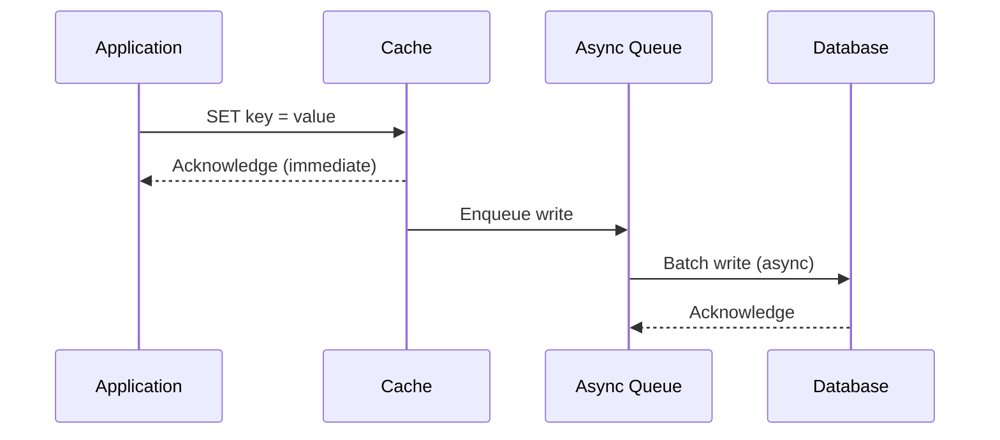
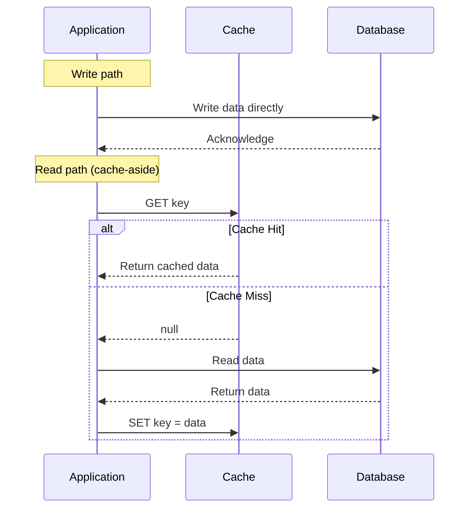
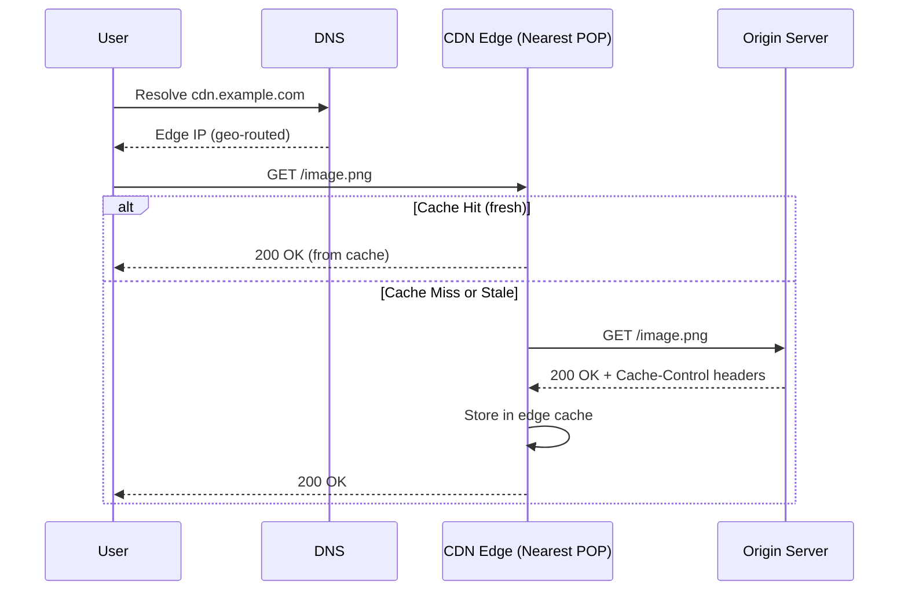
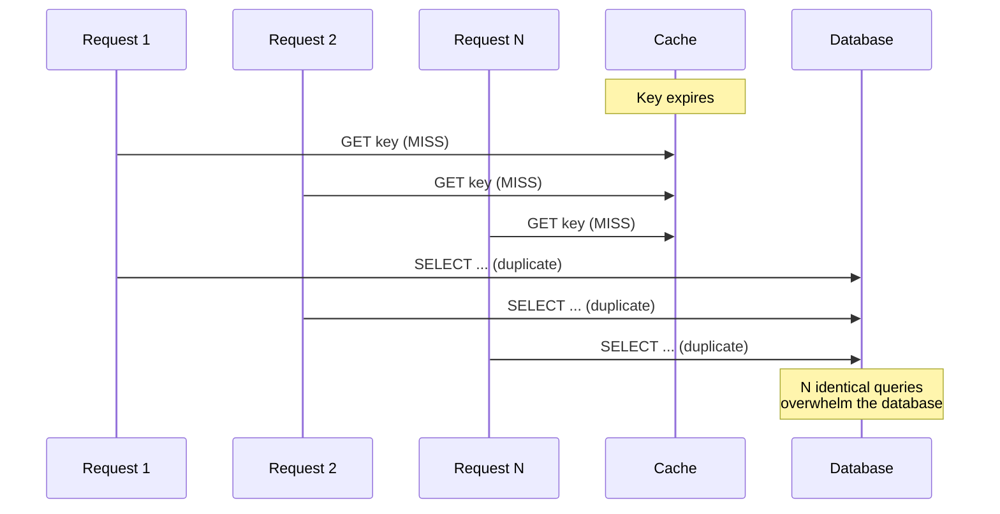
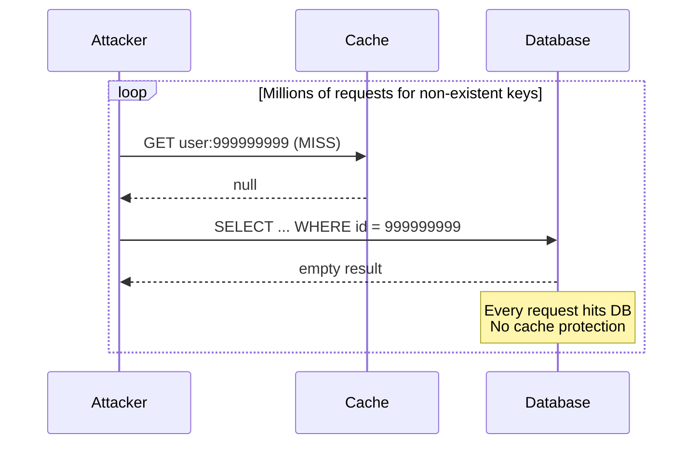
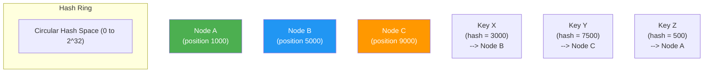
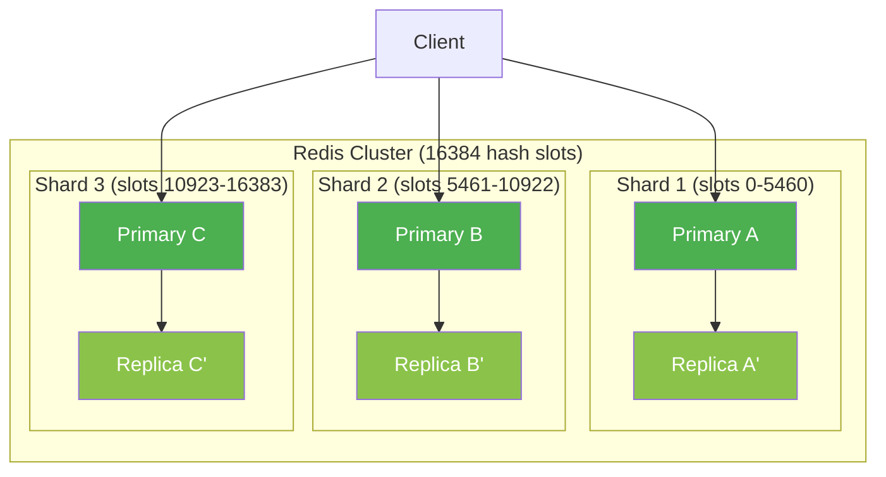

# Caching -- System Design Interview Guide

---

## Table of Contents

1. [Why Caching Matters](#1-why-caching-matters)
2. [Caching Strategies](#2-caching-strategies)
3. [Cache Eviction Policies](#3-cache-eviction-policies)
4. [CDN (Content Delivery Network)](#4-cdn-content-delivery-network)
5. [Redis vs Memcached](#5-redis-vs-memcached)
6. [Cache Problems and Solutions](#6-cache-problems-and-solutions)
7. [Distributed Caching](#7-distributed-caching)
8. [Quick Reference Summary](#8-quick-reference-summary)

---

## 1. Why Caching Matters

### The Core Problem

Every system has a speed hierarchy. Accessing data from RAM is roughly **100x faster** than reading
from an SSD and **1,000,000x faster** than a round trip to a remote database over the network. Caching
exploits this hierarchy by keeping frequently accessed data in a faster storage layer.

### Key Benefits

| Benefit | Description |
|---|---|
| **Latency Reduction** | Serve responses in microseconds instead of milliseconds. A cache hit on Redis (~0.5ms) vs a PostgreSQL query (~5-50ms) is a 10-100x improvement. |
| **Throughput Improvement** | Offload read traffic from the database. A single Redis node handles ~100k ops/sec; a typical RDBMS handles ~5-10k queries/sec. |
| **Cost Savings** | Fewer database replicas, smaller DB instances, reduced compute. |
| **Availability** | Serve stale data during downstream outages (graceful degradation). |
| **Reduced Backend Load** | Protect databases from traffic spikes and repeated identical queries. |

### Cache Hit Ratio

The **cache hit ratio** is the single most important metric for evaluating cache effectiveness.

```
Hit Ratio = Cache Hits / (Cache Hits + Cache Misses)
```

| Hit Ratio | Assessment | Action |
|---|---|---|
| > 95% | Excellent | Monitor, maintain |
| 85-95% | Good | Fine-tune TTLs and eviction |
| 70-85% | Acceptable | Review key design, consider pre-warming |
| < 70% | Poor | Re-evaluate caching strategy entirely |

**Cost-Benefit Analysis**: Caching is most effective when:
- Read-to-write ratio is high (e.g., 100:1 or more)
- Data changes infrequently relative to how often it is read
- Recomputing or refetching data is expensive
- Slight staleness is acceptable

### Caching Layers in a Typical System


**Layer Breakdown**:

| Layer | Latency | Scope | Example |
|---|---|---|---|
| Browser Cache | ~0ms | Per user | HTTP cache headers, localStorage |
| CDN | 5-30ms | Global edge | CloudFront, Cloudflare, Akamai |
| API Gateway Cache | 1-5ms | Per region | AWS API Gateway cache |
| Application In-Memory | <1ms | Per instance | HashMap, Guava Cache, Caffeine |
| Distributed Cache | 0.5-2ms | Shared across instances | Redis, Memcached |
| Database Query Cache | 1-5ms | Per DB node | MySQL query cache (deprecated), materialized views |

---

## 2. Caching Strategies

### 2.1 Cache-Aside (Lazy Loading)

The **application** is responsible for all cache interactions. It checks the cache first; on a miss,
it reads from the database and then populates the cache.



**Pros**:
- Only requested data is cached (no wasted memory)
- Cache failure does not break the application (resilient)
- Simple to implement and reason about

**Cons**:
- Cache miss incurs a triple penalty: cache lookup + DB read + cache write
- Data can become stale (must rely on TTL or explicit invalidation)
- "Cold start" problem: empty cache after restart causes a flood of DB reads

**Best For**: General-purpose reads, user profiles, product catalogs.

---

### 2.2 Read-Through

The **cache** is responsible for loading data from the database on a miss. The application only
talks to the cache -- never directly to the database for reads.



**Key Difference from Cache-Aside**: The cache library/framework has a built-in loader function.
The application code is cleaner because it does not manage cache population.

**Pros**:
- Cleaner application code (separation of concerns)
- Cache population logic is centralized in the cache layer

**Cons**:
- Tighter coupling between cache and data source
- Harder to customize loading logic per call site
- Cache library must support loader callbacks

**Best For**: Read-heavy workloads with a uniform data access pattern.

---

### 2.3 Write-Through

Every write goes to both the **cache and the database synchronously**. The write is only considered
successful when both stores confirm it.



**Pros**:
- Cache is always consistent with the database
- No stale reads (strong consistency)
- Simplifies cache invalidation (data is always fresh)

**Cons**:
- Higher write latency (write to two stores synchronously)
- Cache is populated with data that may never be read (wasted memory)
- Write throughput is bottlenecked by the slower store (DB)

**Best For**: Use cases where consistency is critical and writes are not the bottleneck (e.g., user
session data, configuration data).

---

### 2.4 Write-Back (Write-Behind)

Writes go to the **cache first** and are asynchronously flushed to the database after a delay
or when a batch threshold is met.



**Pros**:
- Extremely low write latency (only cache write is synchronous)
- Batch writes to DB reduce total I/O operations
- Absorbs write spikes (buffer effect)

**Cons**:
- Risk of data loss if cache crashes before flushing to DB
- Complex to implement correctly (ordering, deduplication, failure handling)
- Eventual consistency between cache and DB

**Best For**: High write throughput systems (analytics counters, gaming leaderboards, IoT telemetry).

---

### 2.5 Write-Around

Writes go **directly to the database**, bypassing the cache entirely. The cache is only populated on
subsequent reads (via cache-aside or read-through).



**Pros**:
- Cache is not flooded with data that is written but rarely read
- Good for write-heavy workloads where recent writes are not immediately re-read

**Cons**:
- Higher read latency on recently written data (always a cache miss after write)
- Must still handle cache invalidation for stale entries

**Best For**: Log-style data, write-heavy workloads with deferred reads.

---

### Strategy Comparison Table

| Strategy | Read Latency | Write Latency | Consistency | Data Loss Risk | Complexity | Use Case |
|---|---|---|---|---|---|---|
| **Cache-Aside** | Low (hit) / High (miss) | N/A (writes bypass cache) | Eventual | None | Low | General purpose |
| **Read-Through** | Low (hit) / Medium (miss) | N/A | Eventual | None | Medium | Uniform read patterns |
| **Write-Through** | Low | High (sync write to both) | Strong | None | Medium | Consistency-critical writes |
| **Write-Back** | Low | Very Low | Eventual | **Yes** (cache crash) | High | High write throughput |
| **Write-Around** | High (after write) | Medium | Eventual | None | Low | Write-heavy, rarely re-read |

**Common Combinations**:
- **Cache-Aside + Write-Around**: Most common. Reads are cached lazily; writes go to DB directly.
- **Read-Through + Write-Through**: Fully cache-mediated. Simpler app code, strong consistency.
- **Read-Through + Write-Back**: Maximum performance. Accept eventual consistency and data loss risk.

---

## 3. Cache Eviction Policies

When the cache is full, an eviction policy determines which entry to remove to make room for new data.

### 3.1 LRU (Least Recently Used)

Evicts the entry that has not been **accessed** for the longest time.

**How It Works**: Maintain a doubly linked list + hash map. On every access, move the entry to the
head. On eviction, remove from the tail.

```
Access order: A, B, C, D, A, E (capacity = 4)

After A, B, C, D:  [D] <-> [C] <-> [B] <-> [A]
After A accessed:   [A] <-> [D] <-> [C] <-> [B]
After E (evict B):  [E] <-> [A] <-> [D] <-> [C]
```

**Time Complexity**: O(1) for get and put.

**Pros**: Simple, effective for most workloads with temporal locality.
**Cons**: A full scan (e.g., batch job) can evict all "hot" entries.

---

### 3.2 LFU (Least Frequently Used)

Evicts the entry that has been **accessed the fewest times**.

**How It Works**: Maintain a frequency counter for each key. On eviction, remove the key with the
lowest frequency. Break ties by evicting the least recently used among the least frequent.

```
Access history: A(5), B(2), C(8), D(1)
Evict: D (frequency = 1)
```

**Pros**: Better than LRU for workloads where some items are consistently popular.
**Cons**: Frequency counters consume extra memory. New entries start at frequency=1 and may be
evicted immediately. A once-popular item that is no longer relevant remains cached.

**Mitigation**: Use **LFU with aging** -- decay frequencies over time so old popularity does not
block new entries.

---

### 3.3 FIFO (First In First Out)

Evicts the **oldest inserted** entry, regardless of access patterns.

**How It Works**: Simple queue. New entries go to the back; evictions remove from the front.

**Pros**: Simplest to implement (just a queue). Zero overhead per access.
**Cons**: Does not adapt to access patterns. Frequently accessed items are evicted if they were
inserted early.

---

### 3.4 TTL-Based Expiration

Each entry has a **time-to-live** (TTL). After the TTL expires, the entry is considered invalid.

**Two Approaches**:
- **Active Expiration**: A background thread periodically scans and removes expired entries.
- **Lazy Expiration**: Entries are checked for expiry only when accessed. Expired entries are
  evicted on the next read.

Redis uses both: lazy expiration on every read + active expiration sampling 20 random keys 10
times per second.

**Pros**: Guarantees a bound on staleness. Simple mental model.
**Cons**: Does not manage memory pressure (expired entries may linger). Does not prioritize by
access frequency or recency.

---

### Eviction Policy Comparison

| Policy | Evicts | Time Complexity | Memory Overhead | Best For |
|---|---|---|---|---|
| **LRU** | Least recently accessed | O(1) | Moderate (linked list + map) | General purpose, temporal locality |
| **LFU** | Least frequently accessed | O(1) amortized | Higher (frequency counters) | Stable popularity distribution |
| **FIFO** | Oldest inserted | O(1) | Low (queue) | Simple use cases, uniform access |
| **TTL** | Expired entries | O(1) per check | Low (timestamp per entry) | Time-sensitive data, sessions |
| **Random** | Random entry | O(1) | None | Surprisingly effective baseline |

**Interview Tip**: Redis supports these policies via `maxmemory-policy`:
- `allkeys-lru` -- LRU across all keys (most common)
- `volatile-lru` -- LRU only among keys with a TTL set
- `allkeys-lfu` -- LFU across all keys
- `volatile-ttl` -- evict keys with the shortest remaining TTL
- `noeviction` -- return errors on writes when memory is full

---

## 4. CDN (Content Delivery Network)

A CDN is a **geographically distributed network of edge servers** that cache content close to end
users, reducing latency and offloading origin servers.

### CDN Request Flow



### Push CDN vs Pull CDN

| Aspect | Push CDN | Pull CDN |
|---|---|---|
| **How content arrives** | Origin pushes content to edge servers proactively | Edge server pulls from origin on first request (cache miss) |
| **Cache population** | Pre-populated before any user requests | Populated lazily on demand |
| **Origin traffic** | Minimal after initial push | Spikes on cold start or cache expiry |
| **Storage cost** | Higher (content on all edges, even if rarely accessed) | Lower (only caches what is requested) |
| **Freshness control** | Origin controls when to push new versions | Controlled by TTL / Cache-Control headers |
| **Best for** | Small, static content that changes infrequently (firmware, critical CSS/JS) | Large catalogs where only a subset is popular (e-commerce images, user uploads) |
| **Examples** | Akamai NetStorage, S3 + CloudFront with origin push | Cloudflare, Fastly, CloudFront (default) |

### Edge Caching

Edge caching extends the CDN concept by running **application logic at the edge** (Cloudflare
Workers, Lambda@Edge) -- not just serving static files but also dynamic content caching, A/B
testing, and geo-routing.

**Cache-Control Headers** (critical for CDN behavior):

```
Cache-Control: public, max-age=86400, s-maxage=3600, stale-while-revalidate=600
```

| Directive | Meaning |
|---|---|
| `public` | Any cache (browser, CDN) may store the response |
| `private` | Only the end-user's browser may cache (not CDN) |
| `max-age=N` | Browser may reuse for N seconds |
| `s-maxage=N` | CDN/shared cache may reuse for N seconds (overrides max-age for CDN) |
| `no-cache` | Must revalidate with origin before using cached copy |
| `no-store` | Never cache this response anywhere |
| `stale-while-revalidate=N` | Serve stale content for N seconds while fetching fresh copy in background |

---

## 5. Redis vs Memcached

### Feature Comparison

| Feature | Redis | Memcached |
|---|---|---|
| **Data Structures** | Strings, Lists, Sets, Sorted Sets, Hashes, Streams, Bitmaps, HyperLogLog, Geospatial | Strings only (key-value) |
| **Persistence** | RDB snapshots + AOF (append-only file) | None (pure in-memory) |
| **Replication** | Built-in master-replica replication | None (use client-side sharding) |
| **Clustering** | Redis Cluster (automatic sharding across nodes) | Client-side sharding only |
| **Memory Efficiency** | Less efficient due to data structure overhead | More efficient for simple key-value (slab allocator) |
| **Max Value Size** | 512 MB | 1 MB (default, configurable) |
| **Threading** | Single-threaded event loop (I/O threads in Redis 6+) | Multi-threaded |
| **Pub/Sub** | Built-in | Not supported |
| **Lua Scripting** | Supported | Not supported |
| **Transactions** | MULTI/EXEC (optimistic locking with WATCH) | CAS (Compare-and-Swap) |
| **TTL Granularity** | Per-key, millisecond precision | Per-key, second precision |
| **Typical Throughput** | ~100k-200k ops/sec (single node) | ~200k-700k ops/sec (multi-threaded) |

### When to Use Each

**Choose Redis when you need**:
- Rich data structures (sorted sets for leaderboards, lists for queues, hashes for objects)
- Persistence (survive restarts without cold cache)
- Pub/sub messaging
- Atomic operations on complex data types
- Built-in clustering and replication
- Lua scripting for server-side logic

**Choose Memcached when you need**:
- Simple key-value caching with maximum throughput
- Multi-threaded performance on multi-core machines
- Minimal memory overhead per key
- Horizontal scaling via client-side consistent hashing
- A simpler operational model (no persistence, no replication to manage)

**Rule of Thumb**: Default to Redis unless you specifically need multi-threaded simple key-value
caching at maximum throughput with no persistence requirements.

---

## 6. Cache Problems and Solutions

### 6.1 Cache Stampede (Thundering Herd)

**Problem**: A popular cache key expires, and hundreds of concurrent requests simultaneously miss
the cache and all hit the database to rebuild the same entry.



**Solutions**:

| Solution | How It Works | Trade-off |
|---|---|---|
| **Locking (Mutex)** | First request acquires a lock, rebuilds cache. Others wait or return stale data. | Adds latency for waiting requests. Lock management complexity. |
| **Request Coalescing** | Collapse duplicate in-flight requests into one. Only one DB call; all waiters receive the same result. | Requires coordination layer (e.g., singleflight in Go). |
| **Pre-warming / Proactive Refresh** | Refresh cache entries before they expire (e.g., at 80% of TTL). | Background overhead. Must predict which keys to refresh. |
| **Stale-While-Revalidate** | Return stale data immediately while asynchronously refreshing in the background. | Serves slightly stale data during refresh window. |

**Locking Pattern**: Use `SET lock:{key} 1 NX EX 10` in Redis. First requester acquires the lock,
rebuilds cache, then deletes the lock. Others either wait and retry, or return stale data.

---

### 6.2 Cache Penetration

**Problem**: Requests for data that **does not exist** in either the cache or the database. Every
request is a cache miss that hits the database, which also returns nothing. Attackers can exploit
this to overload the DB.



**Solutions**:

| Solution | How It Works | Trade-off |
|---|---|---|
| **Cache Null Values** | On DB miss, cache a null/empty sentinel value with a short TTL (e.g., 30-60s). | Wastes some cache memory on null entries. |
| **Bloom Filter** | Before querying cache/DB, check a Bloom filter. If the key is definitely not in the dataset, reject immediately. | False positives are possible (extra DB queries). Bloom filter must be kept in sync with DB. |
| **Input Validation** | Validate key format before lookup (e.g., UUID format, range checks). | Only prevents trivially invalid keys. |

**Bloom Filter Pattern**: At startup, populate a Bloom filter with all valid IDs from the database.
On each request, check `bloom.might_contain(key)` -- if false, reject immediately without hitting
cache or DB. False positives are possible but false negatives are not.

---

### 6.3 Cache Avalanche

**Problem**: A large number of cache keys expire at the **same time**, causing a massive spike of
database queries all at once.

**Common Causes**: All keys loaded with identical TTLs, cache server restart, or bulk invalidation.

**Solutions**:

| Solution | How It Works |
|---|---|
| **Staggered TTLs** | Add random jitter to TTLs: `ttl = base_ttl + random(0, max_jitter)`. This spreads expirations over time. |
| **Multi-Layer Caching** | Use L1 (local) + L2 (distributed) caches with different TTLs. If L2 expires, L1 may still serve. |
| **Circuit Breaker** | When DB error rate spikes, stop forwarding requests and return cached stale data or error responses. |
| **Pre-warming** | Before a known cache flush event, proactively populate the cache in the background. |
| **Rate Limiting DB Reads** | Limit the number of concurrent cache-miss-to-DB queries using a semaphore or token bucket. |

**Staggered TTL**: `ttl = base_ttl + random(0, max_jitter)`. For example, base TTL of 1 hour with
a random jitter of 0-10 minutes ensures keys expire gradually rather than all at once.

---

### 6.4 Cache Inconsistency

**Problem**: The cache and the database hold **different versions** of the same data. Reads from
the cache return stale data that does not reflect recent writes.

**Common Causes**:
- Race conditions between concurrent read and write operations
- Failed cache invalidation after a database update
- Network partitions between application, cache, and database

**Invalidation Strategies**:

| Strategy | How It Works | Consistency | Complexity |
|---|---|---|---|
| **TTL Expiry** | Let entries expire naturally. Accept staleness up to TTL duration. | Eventual (bounded by TTL) | Low |
| **Explicit Invalidation** | After DB write, explicitly delete the cache key. Next read triggers a cache-aside load. | Strong (if no race) | Medium |
| **Pub/Sub Invalidation** | DB write triggers a message (via Kafka, Redis Pub/Sub). All app instances invalidate their local caches. | Strong | High |
| **Write-Through** | Write to cache and DB atomically. Cache is always up to date. | Strong | Medium |
| **Versioned Keys** | Include a version number in the cache key. On update, increment the version. Old key is never read again. | Strong | Medium |

**The "Delete vs Update" Debate**:

| Approach | Pros | Cons |
|---|---|---|
| **Delete key after DB write** (preferred) | Simpler, avoids race conditions between concurrent writes | Next read incurs a cache miss |
| **Update key after DB write** | No cache miss penalty on next read | Risk of out-of-order writes leaving stale data in cache |

**Why delete is safer**: Two concurrent updates can arrive at the cache out of order, leaving an
older version. Delete avoids this -- the next read simply reloads from DB. Use a short delay
("delayed double-delete") or versioned keys to handle edge cases where a concurrent reader
repopulates the cache with stale data between the DB write and the delete.

---

## 7. Distributed Caching

### Consistent Hashing for Cache Distribution

When scaling a cache across multiple nodes, you need a way to determine which node holds a given
key. Naive modular hashing (`node = hash(key) % N`) breaks badly when nodes are added or removed
(nearly all keys get remapped).

**Consistent hashing** solves this by mapping both keys and nodes onto a circular hash ring.



**How It Works**:
1. Hash each cache node to a position on the ring.
2. Hash each key to a position on the ring.
3. Walk clockwise from the key's position; the first node encountered is responsible for that key.
4. When a node is added/removed, only the keys between the new/removed node and its predecessor
   are affected (~1/N of total keys).

**Virtual Nodes**: Each physical node is mapped to multiple positions on the ring (e.g., 100-200
virtual nodes per physical node). This ensures even distribution of keys, especially when the
number of physical nodes is small.

| Approach | Keys Remapped on Node Change | Distribution Uniformity |
|---|---|---|
| Modular hash (`% N`) | ~100% of keys | Poor with few nodes |
| Consistent hashing | ~1/N of keys | Moderate |
| Consistent hashing + virtual nodes | ~1/N of keys | Excellent |

---

### Replication for Availability

To survive cache node failures, cache data is replicated across multiple nodes.

**Replication Models**:

| Model | Description | Trade-off |
|---|---|---|
| **Primary-Replica** | Writes go to primary; replicas receive async copies. Reads can be served from replicas. | Slight staleness on replicas. Simple failover. |
| **Multi-Primary** | Any node accepts writes. Conflict resolution needed. | Complex. Used in Redis Cluster for different key ranges (each key has one primary). |
| **Client-Side Replication** | Application writes the same key to N cache nodes. Reads from any. | Simple but increases write amplification. |

**Redis Cluster Architecture**:



---

### Near-Cache vs Remote Cache

| Aspect | Near-Cache (Local / In-Process) | Remote Cache (Distributed) |
|---|---|---|
| **Location** | Same process / JVM / container as the application | Separate server(s), accessed over network |
| **Latency** | Sub-microsecond (memory access) | 0.5-2ms (network round trip) |
| **Capacity** | Limited by application's heap/memory | Can be terabytes across cluster |
| **Consistency** | Stale across instances (each instance has its own copy) | Single source of truth for all instances |
| **Failure Impact** | Lost on application restart | Survives app restarts; has its own failure domain |
| **Examples** | Caffeine (Java), `functools.lru_cache` (Python), in-memory HashMap | Redis, Memcached, Hazelcast |

**Two-Level Caching (L1 + L2)**:

A common production pattern combines both:

```
Request --> L1 (Near-Cache, in-process)
    HIT --> return
    MISS --> L2 (Redis, remote)
        HIT --> populate L1, return
        MISS --> Database
            --> populate L2, populate L1, return
```

**Benefits**: L1 shields L2 from hot-key traffic; L2 provides shared consistency and survives
restarts. Main challenge is L1 invalidation -- typically solved via pub/sub notifications when
L2 is updated.

---

## 8. Quick Reference Summary

### Decision Framework: Choosing a Caching Strategy

```
Is the read-to-write ratio high (>10:1)?
    YES --> Is strong consistency required?
        YES --> Write-Through + Read-Through
        NO  --> Cache-Aside + Write-Around
    NO  --> Is write latency critical?
        YES --> Write-Back (accept data loss risk)
        NO  --> Write-Through
```

### Key Numbers to Remember

| Metric | Value |
|---|---|
| Redis single-node throughput | ~100-200k ops/sec |
| Memcached single-node throughput | ~200-700k ops/sec |
| Redis GET latency | ~0.5ms |
| DB query latency | ~5-50ms |
| CDN edge latency | ~5-30ms |
| Good cache hit ratio | > 90% |
| Keys remapped (consistent hashing) | ~1/N on node change |

### Common Interview Patterns

| Scenario | Recommended Approach |
|---|---|
| User profile / session data | Redis (hash data structure) + Cache-Aside + TTL |
| Product catalog (e-commerce) | Redis + Cache-Aside + Write-Around + CDN for images |
| Real-time leaderboard | Redis Sorted Sets + Write-Through |
| News feed / timeline | Redis Lists + Write-Back for aggregation |
| Rate limiting | Redis (INCR + EXPIRE) or sliding window with sorted set |
| Distributed lock | Redis (SET NX EX) or Redlock algorithm |
| Static assets (images, CSS, JS) | CDN (Pull) + long Cache-Control headers |
| API response caching | CDN or API Gateway cache + short TTL |
| Database query results | Redis/Memcached + Cache-Aside + staggered TTLs |
| Session store | Redis with persistence (RDB + AOF) |

### Caching Checklist for System Design Interviews

1. **Identify what to cache**: Which data is read-heavy and can tolerate staleness?
2. **Choose the caching layer**: Browser, CDN, API Gateway, application (local), distributed cache?
3. **Pick a caching strategy**: Cache-aside, read-through, write-through, write-back, write-around?
4. **Select the cache technology**: Redis vs Memcached vs in-process?
5. **Define eviction policy**: LRU, LFU, TTL-based? What TTL values?
6. **Handle cache problems**: Stampede (locking), penetration (bloom filter), avalanche (jitter)?
7. **Plan for consistency**: How will you invalidate stale data? Delete vs update?
8. **Consider distributed concerns**: Consistent hashing, replication, near-cache + remote cache?
9. **Estimate capacity**: Key count * average value size = total memory needed.
10. **Monitor**: Track hit ratio, latency percentiles, eviction rate, memory usage.
