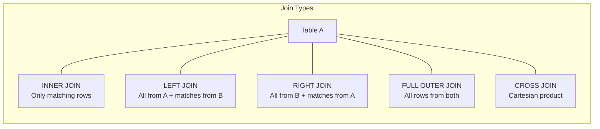
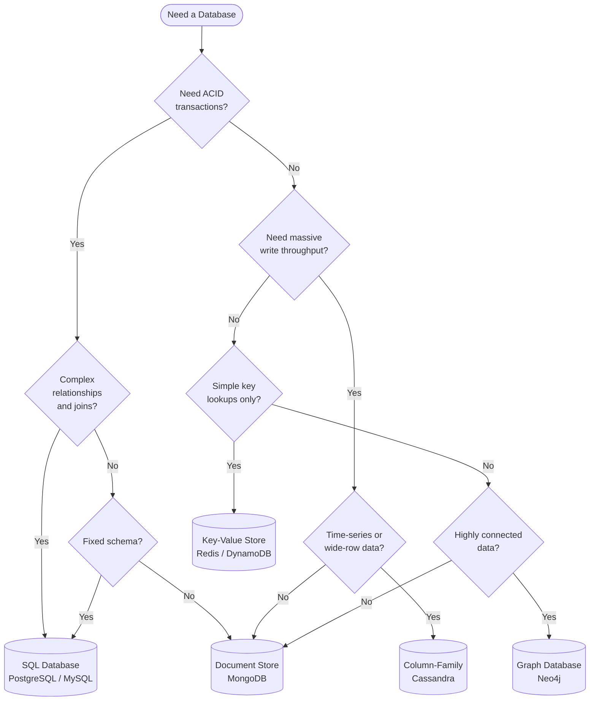
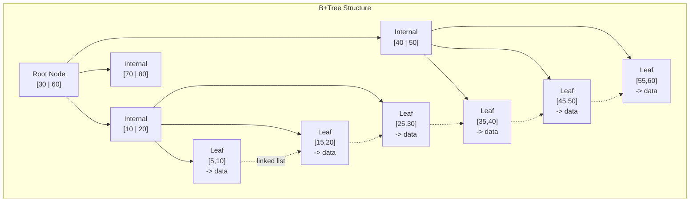
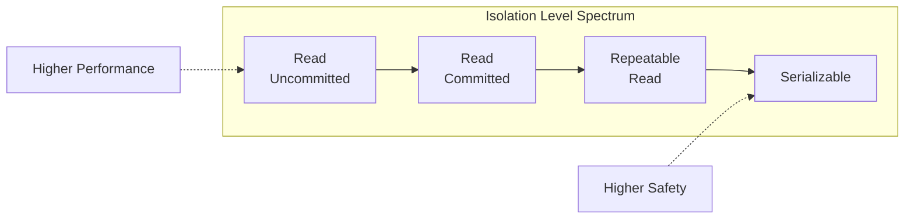
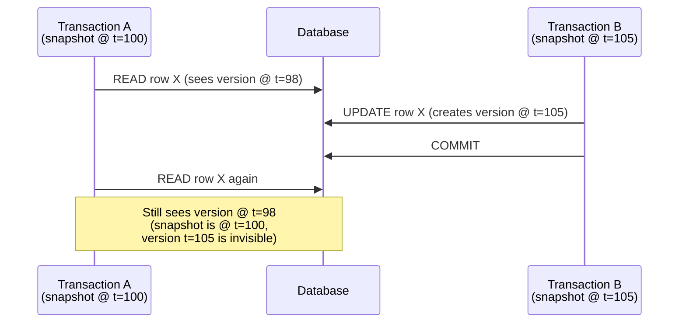

# Databases

> Everything you need to know about databases for system design interviews:
> relational vs NoSQL, indexing internals, transactions, isolation levels,
> and storage engine trade-offs.

---

## 1. SQL (Relational) Databases

Relational databases store data in **tables** (relations) with predefined schemas.
Every row has the same set of columns, and relationships between tables are expressed
through foreign keys. SQL is the standard query language.

### 1.1 ACID Properties

ACID guarantees are the foundation of relational database reliability.

| Property      | Meaning                                                                 | Example                                                    |
|---------------|-------------------------------------------------------------------------|------------------------------------------------------------|
| **Atomicity** | A transaction is all-or-nothing. If any part fails, the entire txn rolls back. | Transfer $100: debit Account A **and** credit Account B, or neither. |
| **Consistency** | A transaction moves the database from one valid state to another. Constraints (PK, FK, CHECK) are never violated. | Balance can never go negative if a CHECK constraint exists. |
| **Isolation** | Concurrent transactions behave as if they were executed serially.        | Two simultaneous transfers on the same account do not corrupt the balance. |
| **Durability** | Once a transaction commits, the data survives crashes (written to disk / WAL). | Server power loss after COMMIT does not lose the write.    |

> **Interview tip:** ACID is the single biggest reason to pick a relational DB.
> If the interviewer asks "why Postgres over Mongo?", ACID + joins is the answer
> 90% of the time.

### 1.2 Normalization

Normalization eliminates data redundancy and update anomalies by decomposing tables.

| Normal Form | Rule                                                                                   | Violation Example                                         |
|-------------|----------------------------------------------------------------------------------------|-----------------------------------------------------------|
| **1NF**     | Every column holds atomic (indivisible) values; no repeating groups.                   | A `phone_numbers` column storing `"555-1234, 555-5678"`.  |
| **2NF**     | 1NF + every non-key column depends on the **entire** primary key (no partial deps).    | Composite key `(order_id, product_id)` with `customer_name` depending only on `order_id`. |
| **3NF**     | 2NF + no transitive dependencies (non-key column depends on another non-key column).   | `zip_code -> city` stored in the `customers` table.       |
| **BCNF**    | Every determinant is a candidate key. Stricter than 3NF.                                | Rare edge cases with overlapping candidate keys.          |

**In practice:** Most production schemas are in 3NF. Over-normalization causes excessive
joins; under-normalization causes update anomalies. System design interviews usually
target 3NF unless you are explicitly optimizing read performance (denormalization).

### 1.3 Joins



| Join Type        | Returns                                       | Use Case                                  |
|------------------|-----------------------------------------------|-------------------------------------------|
| `INNER JOIN`     | Rows with matches in **both** tables           | Fetch orders with their customers         |
| `LEFT JOIN`      | All rows from left + matched rows from right   | All customers, even those with no orders  |
| `RIGHT JOIN`     | All rows from right + matched rows from left   | All products, even those never ordered    |
| `FULL OUTER JOIN`| All rows from both, NULLs where no match       | Reconciliation reports                    |
| `CROSS JOIN`     | Every row in A paired with every row in B      | Generate combinations (sizes x colors)   |

> **Performance note:** Joins become expensive at scale. In a distributed system
> you often denormalize data to avoid cross-shard joins entirely.

### 1.4 Popular Relational Databases

| Database       | Strengths                                            | Common Use Cases                      |
|----------------|------------------------------------------------------|---------------------------------------|
| **PostgreSQL** | Advanced types (JSONB, arrays), extensions (PostGIS), MVCC | General purpose, geospatial, analytics |
| **MySQL**      | Mature replication, wide hosting support, InnoDB engine   | Web apps, read-heavy workloads        |
| **SQL Server** | Enterprise integration, BI tooling                   | Enterprise / .NET ecosystems          |
| **SQLite**     | Embedded, zero-config, serverless                    | Mobile apps, local caches, testing    |

---

## 2. NoSQL Databases

NoSQL (Not Only SQL) databases trade some relational guarantees for horizontal
scalability, flexible schemas, and optimized access patterns. There are four
major categories.

### 2.1 Key-Value Stores

Data is stored as simple key-value pairs. Think of it as a giant hash map.

**Characteristics:**
- O(1) lookups by key
- No queries by value (unless you build secondary indexes)
- Extremely high throughput and low latency
- Ideal for caching, sessions, counters, feature flags

**Examples:**
- **Redis** -- In-memory, supports data structures (lists, sets, sorted sets, hashes).
  Sub-millisecond latency. Used as a cache layer, rate limiter, pub/sub broker.
- **DynamoDB** -- Fully managed by AWS. Single-digit millisecond reads at any scale.
  Partition key + optional sort key. Supports auto-scaling and global tables.
- **etcd** -- Distributed key-value store used for service discovery and config
  (Kubernetes uses etcd as its backing store).

### 2.2 Document Stores

Data is stored as semi-structured documents (JSON, BSON). Each document can have
a different structure.

**Characteristics:**
- Schema-flexible: fields can vary between documents
- Rich query language (filters, projections, aggregations)
- Documents map naturally to application objects
- Horizontal scaling via sharding

**Examples:**
- **MongoDB** -- BSON documents, flexible schema, aggregation pipeline, change streams.
  Good for content management, catalogs, user profiles.
- **CouchDB** -- JSON documents, HTTP/REST API, master-master replication. Good for
  offline-first applications (via PouchDB sync).

### 2.3 Column-Family Stores

Data is stored in column families (groups of columns). Rows can have different
columns. Optimized for writes and sequential reads of wide rows.

**Characteristics:**
- Partition key determines which node stores the data
- Clustering columns define sort order within a partition
- Excellent write throughput (append-only / LSM-Tree based)
- Tunable consistency (per-query: ONE, QUORUM, ALL)

**Examples:**
- **Apache Cassandra** -- Masterless (peer-to-peer), linearly scalable, tunable
  consistency. Ideal for time-series data, IoT, messaging.
- **HBase** -- Built on HDFS, strong consistency, good for random read/write
  access to big data. Used by Facebook Messages (historically).

### 2.4 Graph Databases

Data is stored as nodes and edges (relationships). Optimized for traversing
connections.

**Characteristics:**
- First-class support for relationships (no expensive joins)
- Query language designed for graph traversal (Cypher, Gremlin)
- Excellent for highly connected data
- Less suited for bulk analytics or simple key lookups

**Examples:**
- **Neo4j** -- Property graph model, Cypher query language. Used for social networks,
  recommendation engines, fraud detection, knowledge graphs.
- **Amazon Neptune** -- Managed graph DB supporting both property graph and RDF models.

### 2.5 NoSQL Comparison Table

| Feature            | Key-Value            | Document             | Column-Family        | Graph                |
|--------------------|----------------------|----------------------|----------------------|----------------------|
| **Data Model**     | Key -> Value         | Key -> Document (JSON) | Row key -> Column families | Nodes + Edges      |
| **Schema**         | None                 | Flexible             | Flexible per row     | Flexible             |
| **Query Pattern**  | GET/PUT by key       | Rich queries on fields | Scan by partition + range | Graph traversal    |
| **Scaling**        | Horizontal           | Horizontal           | Horizontal           | Vertical (mostly)    |
| **Best For**       | Caching, sessions    | Content, catalogs    | Time-series, IoT     | Social graphs, fraud |
| **Worst For**      | Complex queries      | Many-to-many relations | Ad-hoc queries      | Bulk analytics       |
| **Example**        | Redis, DynamoDB      | MongoDB, CouchDB     | Cassandra, HBase     | Neo4j, Neptune       |

---

## 3. SQL vs NoSQL

### 3.1 Comparison Table

| Dimension            | SQL (Relational)                        | NoSQL                                       |
|----------------------|-----------------------------------------|---------------------------------------------|
| **Schema**           | Fixed schema, enforced by DDL           | Dynamic / schema-less                       |
| **Scaling**          | Primarily vertical; horizontal is hard  | Built for horizontal scaling (sharding)     |
| **ACID**             | Full ACID by default                    | Varies: eventual consistency is common      |
| **Query Flexibility**| Arbitrary SQL queries, joins, subqueries| Limited to access patterns designed upfront |
| **Data Model**       | Tables with rows and columns            | Documents, key-value, graphs, wide columns  |
| **Joins**            | Native, efficient (within a node)       | Application-level or not supported          |
| **Maturity**         | Decades of tooling, ORMs, backup tools  | Rapidly maturing but less standardized      |
| **Best For**         | Complex relationships, transactions     | High scale, flexible schema, specific access patterns |

### 3.2 When to Use Each

**Choose SQL when:**
- You need ACID transactions (financial systems, inventory management)
- Your data has complex relationships requiring joins
- You need ad-hoc query flexibility (analytics, reporting)
- Data integrity and consistency are paramount
- Your schema is well-defined and unlikely to change frequently

**Choose NoSQL when:**
- You need massive horizontal scalability (millions of writes/sec)
- Your schema evolves rapidly (startup MVPs, A/B testing metadata)
- Your access patterns are simple and well-known (key lookups, append-only)
- You need low-latency at extreme scale
- You are storing unstructured or semi-structured data (logs, events, IoT)

### 3.3 Decision Flowchart



---

## 4. Indexing

Indexes are auxiliary data structures that speed up reads at the cost of slower
writes and additional storage. Understanding index internals is critical for
system design.

### 4.1 B-Tree Index

The most common index type in relational databases.

**Properties:**
- Self-balancing tree where every leaf is at the same depth
- Each node can hold multiple keys (high fan-out, typically 100-200 keys/node)
- Both internal nodes and leaf nodes store data pointers
- Supports point queries, range queries, and ORDER BY
- Read and write: O(log n)

### 4.2 B+Tree Index

A variant of B-Tree used by most modern databases (InnoDB, PostgreSQL, etc.).

**Differences from B-Tree:**
- Only leaf nodes store data pointers (internal nodes store only keys)
- Leaf nodes are linked in a doubly-linked list for efficient range scans
- Higher fan-out in internal nodes (since they do not store data)



### 4.3 B-Tree vs B+Tree Comparison

| Feature            | B-Tree                         | B+Tree                                  |
|--------------------|--------------------------------|-----------------------------------------|
| Data pointers      | In all nodes                   | Only in leaf nodes                      |
| Range queries      | Requires tree traversal        | Follow leaf-level linked list           |
| Fan-out            | Lower (nodes store data)       | Higher (internal nodes are key-only)    |
| Disk I/O           | Potentially fewer for point queries | Fewer for range scans               |
| Used by            | Older systems                  | PostgreSQL, MySQL InnoDB, most modern DBs |

### 4.4 Hash Index

- Maps keys to values using a hash function
- O(1) average-case lookups for exact-match queries
- **Cannot** support range queries or ORDER BY
- Used by: hash indexes in PostgreSQL, memcached, Redis internals

**When to use:** Only when you exclusively need exact-match lookups
(e.g., `WHERE email = 'user@example.com'`).

### 4.5 Composite Index

An index on multiple columns: `CREATE INDEX idx ON orders(user_id, created_at)`.

**Leftmost prefix rule:** The index can be used for queries that filter on:
- `user_id` alone
- `user_id` AND `created_at`
- But NOT `created_at` alone (skips the leftmost column)

```
-- Uses the composite index:
SELECT * FROM orders WHERE user_id = 42;
SELECT * FROM orders WHERE user_id = 42 AND created_at > '2025-01-01';
SELECT * FROM orders WHERE user_id = 42 ORDER BY created_at DESC;

-- Does NOT use the composite index:
SELECT * FROM orders WHERE created_at > '2025-01-01';
```

> **Interview tip:** Column order in a composite index matters enormously.
> Put the most selective (highest cardinality) column first, or the column
> that appears in equality filters before range filters.

### 4.6 Covering Index

An index that contains all columns needed by a query, so the database can
answer the query entirely from the index without touching the table (an
"index-only scan").

```sql
-- If the index is (user_id, created_at, total):
SELECT created_at, total FROM orders WHERE user_id = 42;
-- This is an index-only scan: no table lookup needed.
```

**Benefit:** Dramatically reduces I/O for read-heavy queries.

### 4.7 When Indexes Hurt Performance

Indexes are not free. They have costs:

| Cost                | Explanation                                                       |
|---------------------|-------------------------------------------------------------------|
| **Write overhead**  | Every INSERT/UPDATE/DELETE must update all relevant indexes        |
| **Storage**         | Indexes consume disk space (can be 10-30% of table size)          |
| **Lock contention** | Index page splits can cause brief locks                           |
| **Unused indexes**  | Indexes that no query uses waste write cycles and storage         |
| **Over-indexing**   | Too many indexes on a write-heavy table destroy write throughput  |

**Rule of thumb:**
- Read-heavy workloads: more indexes are beneficial
- Write-heavy workloads: minimize indexes to essential ones only
- Monitor slow query logs and use `EXPLAIN ANALYZE` to verify index usage

---

## 5. Transactions & Isolation Levels

### 5.1 Concurrency Problems

When multiple transactions run concurrently, three anomalies can occur:

| Anomaly                 | Description                                                                        | Example                                                      |
|-------------------------|------------------------------------------------------------------------------------|--------------------------------------------------------------|
| **Dirty Read**          | Txn reads data written by another uncommitted txn                                  | Txn A writes balance=50, Txn B reads 50, Txn A rolls back   |
| **Non-Repeatable Read** | Txn reads the same row twice and gets different values (another txn committed in between) | Txn A reads balance=100, Txn B updates to 50 and commits, Txn A reads again and gets 50 |
| **Phantom Read**        | Txn re-executes a query and finds new rows inserted by another committed txn       | Txn A counts 10 orders, Txn B inserts a new order, Txn A counts again and gets 11 |

### 5.2 Isolation Levels

SQL defines four standard isolation levels, each preventing progressively more anomalies:

| Isolation Level        | Dirty Read | Non-Repeatable Read | Phantom Read | Performance |
|------------------------|------------|---------------------|--------------|-------------|
| **Read Uncommitted**   | Possible   | Possible            | Possible     | Fastest     |
| **Read Committed**     | Prevented  | Possible            | Possible     | Fast        |
| **Repeatable Read**    | Prevented  | Prevented           | Possible     | Moderate    |
| **Serializable**       | Prevented  | Prevented           | Prevented    | Slowest     |

**Defaults by database:**
- PostgreSQL: Read Committed
- MySQL InnoDB: Repeatable Read
- SQL Server: Read Committed
- Oracle: Read Committed



### 5.3 Detailed Breakdown

**Read Uncommitted:**
- No locks on reads. A transaction can see uncommitted writes from other transactions.
- Almost never used in production. Useful only for approximate analytics where
  accuracy does not matter.

**Read Committed:**
- Each query sees only data committed before the query began.
- The most common default. Good balance of safety and performance.
- Two reads within the same transaction can return different results if another
  transaction commits between them.

**Repeatable Read:**
- The transaction sees a snapshot of the database as of the start of the transaction.
- The same SELECT always returns the same rows (for rows that existed at txn start).
- MySQL InnoDB uses gap locks to also prevent phantom reads at this level.
- PostgreSQL uses MVCC snapshots but technically allows phantoms (though its
  Repeatable Read is closer to Snapshot Isolation).

**Serializable:**
- Transactions behave as if they were executed one after another.
- Most databases implement this via either:
  - **Two-Phase Locking (2PL):** Shared and exclusive locks held until txn end.
  - **Serializable Snapshot Isolation (SSI):** Optimistic approach used by PostgreSQL.
- Highest safety but lowest concurrency. Use only when absolutely necessary
  (e.g., financial ledger entries, seat reservations).

### 5.4 MVCC (Multi-Version Concurrency Control)

MVCC is the mechanism most modern databases use to implement isolation without
heavy locking.

**How it works:**
1. Every row has a hidden `created_at_txn_id` and `deleted_at_txn_id` (version info).
2. When a row is updated, the DB creates a **new version** of the row rather than
   overwriting the old one.
3. Each transaction gets a consistent snapshot: it can only see row versions
   committed before the snapshot was taken.
4. Old versions are garbage-collected by a background process (VACUUM in PostgreSQL,
   purge thread in InnoDB).

**Benefits:**
- Readers never block writers, writers never block readers
- Consistent snapshots without read locks
- Enables Repeatable Read and Snapshot Isolation efficiently

**Trade-offs:**
- Storage overhead from multiple row versions
- Need for periodic cleanup (VACUUM / purge)
- Write-write conflicts must still be detected and resolved



---

## 6. Storage Engines

The storage engine is the component that determines how data is physically stored
on disk and retrieved. The choice of storage engine has profound implications for
read/write performance.

### 6.1 B-Tree Based Engines (Read-Optimized)

**How writes work:**
1. Find the correct page (disk block) in the B-Tree
2. Update the page in place
3. Write ahead to WAL (Write-Ahead Log) for crash recovery

**How reads work:**
1. Traverse the B-Tree from root to leaf
2. Typically 3-4 disk I/Os for a point query (root is cached in memory)

**Characteristics:**
- Reads are fast: O(log n) with high fan-out
- Writes involve random I/O (finding and updating the correct page)
- Good for read-heavy and mixed workloads
- Used by: **InnoDB** (MySQL), PostgreSQL, SQL Server

### 6.2 LSM-Tree Based Engines (Write-Optimized)

**How writes work:**
1. Write to an in-memory buffer (memtable), typically a red-black tree or skip list
2. When the memtable is full, flush it to disk as a sorted immutable file (SSTable)
3. Background compaction merges SSTables to maintain read performance

**How reads work:**
1. Check the memtable first
2. Check each SSTable level (use Bloom filters to skip SSTables that do not contain the key)
3. Merge results from multiple levels

**Characteristics:**
- Writes are sequential I/O (appending SSTables) -- extremely fast
- Reads may require checking multiple SSTables -- slower than B-Tree for point queries
- Background compaction uses CPU and I/O
- Used by: **RocksDB**, LevelDB, Cassandra, HBase

```mermaid
graph TD
    subgraph "LSM-Tree Write Path"
        W[Write Request] --> MEM[Memtable<br/>in-memory sorted structure]
        MEM -->|"Full? Flush"| L0["Level 0 SSTable<br/>(unsorted between files)"]
        L0 -->|"Compaction"| L1["Level 1 SSTables<br/>(sorted, non-overlapping)"]
        L1 -->|"Compaction"| L2["Level 2 SSTables<br/>(sorted, non-overlapping)"]
    end

    subgraph "LSM-Tree Read Path"
        R[Read Request] --> MEM2[Check Memtable]
        MEM2 -->|miss| BF0["Bloom Filter L0"]
        BF0 -->|maybe| SS0["Search L0 SSTables"]
        SS0 -->|miss| BF1["Bloom Filter L1"]
        BF1 -->|maybe| SS1["Search L1 SSTables"]
    end
```



### 6.3 B-Tree vs LSM-Tree Comparison

| Dimension              | B-Tree (e.g., InnoDB)                | LSM-Tree (e.g., RocksDB)                 |
|------------------------|--------------------------------------|-------------------------------------------|
| **Write Performance**  | Moderate (random I/O)                | Excellent (sequential I/O)                |
| **Read Performance**   | Excellent (single tree traversal)    | Moderate (may check multiple levels)      |
| **Space Efficiency**   | Some fragmentation from page splits  | More compact after compaction             |
| **Write Amplification**| Lower (update in place)              | Higher (compaction rewrites data)         |
| **Read Amplification** | Lower (one tree)                     | Higher (multiple levels + Bloom filters)  |
| **Predictable Latency**| More predictable                     | Compaction can cause latency spikes       |
| **Concurrency**        | Row-level locks, MVCC               | Lock-free writes to memtable              |
| **Best For**           | OLTP, mixed read/write              | Write-heavy, time-series, logs            |

### 6.4 Notable Storage Engines

| Engine         | Type     | Used By                    | Key Feature                               |
|----------------|----------|----------------------------|-------------------------------------------|
| **InnoDB**     | B-Tree   | MySQL (default)            | ACID, MVCC, clustered indexes             |
| **WiredTiger** | B-Tree   | MongoDB (default since 3.2)| Document-level locking, compression       |
| **RocksDB**    | LSM-Tree | CockroachDB, TiKV, Flink  | Embeddable, tunable compaction, compression |
| **LevelDB**    | LSM-Tree | Bitcoin Core, Chrome       | Simple embedded KV store by Google        |
| **MyISAM**     | B-Tree   | MySQL (legacy)             | No transactions, table-level locks, full-text search |

### 6.5 Write-Ahead Log (WAL)

Both B-Tree and LSM-Tree engines use a WAL for durability:

1. Before modifying data structures, the change is appended to a sequential log file.
2. If the database crashes, the WAL is replayed on startup to recover uncommitted changes.
3. WAL writes are sequential I/O (fast), even if the actual data structure requires random I/O.

> **Interview tip:** When discussing storage engines, mention the WAL. It shows
> you understand crash recovery. Also mention that the WAL is the basis for
> replication: replicas apply the leader's WAL entries to stay in sync.

---

## 7. Quick Reference Summary

### 7.1 Database Selection Cheat Sheet

| Scenario                                  | Recommended DB                | Why                                              |
|-------------------------------------------|-------------------------------|--------------------------------------------------|
| E-commerce with orders + inventory        | PostgreSQL                    | ACID transactions, complex joins                 |
| User sessions / caching                   | Redis                         | Sub-ms latency, TTL support, in-memory           |
| Content management / user profiles        | MongoDB                       | Flexible schema, rich queries on documents       |
| Time-series / IoT sensor data             | Cassandra or TimescaleDB      | High write throughput, partitioned by time        |
| Social network (friends, followers)       | Neo4j + PostgreSQL            | Graph traversal for relationships, SQL for core data |
| Real-time leaderboard                     | Redis (Sorted Sets)           | O(log n) insert, O(log n) rank queries           |
| Analytics / data warehouse                | ClickHouse or BigQuery        | Columnar storage, aggregation-optimized          |
| Chat messaging                            | Cassandra                     | Partition by conversation, clustering by timestamp |
| Full-text search                          | Elasticsearch                 | Inverted index, relevance scoring, fuzzy match   |
| Configuration / service discovery         | etcd or ZooKeeper             | Strong consistency, distributed consensus        |

### 7.2 Indexing Cheat Sheet

| Index Type       | Point Query | Range Query | Sort     | Best For                          |
|------------------|-------------|-------------|----------|-----------------------------------|
| B+Tree           | O(log n)    | Efficient   | Yes      | General purpose (default choice)  |
| Hash             | O(1)        | No          | No       | Exact-match only lookups          |
| Composite        | O(log n)    | Efficient   | Yes      | Multi-column filters              |
| Covering         | O(log n)    | Efficient   | Yes      | Avoiding table lookups entirely   |
| GIN (Inverted)   | Varies      | Varies      | No       | Full-text search, JSONB, arrays   |
| GiST (Generalized)| Varies    | Varies      | Varies   | Geospatial, range types           |

### 7.3 Isolation Levels Cheat Sheet

| Level              | Dirty Read | Non-Repeatable Read | Phantom | Lock Cost |
|--------------------|------------|---------------------|---------|-----------|
| Read Uncommitted   | Yes        | Yes                 | Yes     | None      |
| Read Committed     | No         | Yes                 | Yes     | Low       |
| Repeatable Read    | No         | No                  | Yes*    | Medium    |
| Serializable       | No         | No                  | No      | High      |

*MySQL InnoDB prevents phantoms at Repeatable Read via gap locks.

### 7.4 Storage Engine Cheat Sheet

| Dimension     | B-Tree Engine         | LSM-Tree Engine         |
|---------------|-----------------------|-------------------------|
| Reads         | Fast                  | Moderate                |
| Writes        | Moderate              | Fast                    |
| Space         | Moderate              | Compact                 |
| Use case      | Mixed OLTP            | Write-heavy workloads   |
| Example       | InnoDB, WiredTiger    | RocksDB, LevelDB        |

### 7.5 Key Numbers to Remember

| Metric                                    | Value                             |
|-------------------------------------------|-----------------------------------|
| Redis GET latency                         | ~0.1 ms (in-memory)              |
| PostgreSQL simple query                   | ~1-5 ms (indexed, warm cache)    |
| MongoDB document read                     | ~1-5 ms (indexed, warm cache)    |
| Cassandra write latency                   | ~1-2 ms (single DC, CL=ONE)     |
| Cassandra write throughput (per node)     | ~10-20K writes/sec               |
| B+Tree levels for 1 billion rows          | ~4 levels (fan-out ~500)         |
| Disk seek time (SSD)                      | ~0.1 ms                          |
| Disk seek time (HDD)                      | ~5-10 ms                         |
| Sequential read throughput (SSD)          | ~500 MB/s                        |
| Sequential read throughput (HDD)          | ~100 MB/s                        |

### 7.6 Interview Talking Points

1. **Always justify your database choice.** "We use PostgreSQL because we need
   ACID transactions for financial data" is better than "We use PostgreSQL."

2. **Mention indexing strategy.** After choosing a DB, discuss which columns
   you would index and why. Mention composite indexes for common query patterns.

3. **Know the trade-offs of denormalization.** In distributed systems, you often
   denormalize to avoid cross-shard joins. Acknowledge the update anomaly risk.

4. **Discuss write vs read optimization.** If the workload is write-heavy,
   mention LSM-Tree engines (Cassandra, RocksDB). If read-heavy, mention
   B-Tree engines with read replicas.

5. **Connect databases to CAP theorem.** SQL databases are typically CP
   (consistent + partition-tolerant). NoSQL databases like Cassandra are AP
   (available + partition-tolerant) by default but can be tuned.

6. **Explain MVCC when discussing concurrency.** It shows depth beyond just
   knowing isolation level names.

7. **Mention the WAL.** It is the foundation of both durability and replication.
   "Writes go to the WAL first, then the WAL is replicated to followers for
   high availability."
