# Database Scaling

A comprehensive guide to database scaling strategies for system design interviews. Covers
replication, sharding, partitioning, federation, denormalization, and advanced patterns like
CQRS and event sourcing.

---

## Table of Contents

1. [Vertical vs Horizontal Scaling](#1-vertical-vs-horizontal-scaling)
2. [Replication](#2-replication)
3. [Sharding (Horizontal Partitioning)](#3-sharding-horizontal-partitioning)
4. [Partitioning](#4-partitioning)
5. [Read Replicas](#5-read-replicas)
6. [Database Federation](#6-database-federation)
7. [Denormalization](#7-denormalization)
8. [Common Patterns](#8-common-patterns)
9. [Quick Reference Summary](#9-quick-reference-summary)

---

## 1. Vertical vs Horizontal Scaling

### 1.1 Scale Up (Vertical Scaling)

Add more resources (CPU, RAM, disk, faster I/O) to a **single machine**.

**Advantages:**
- Simple to implement -- no application changes required
- No data distribution complexity
- Strong consistency is trivial (single node)
- Easier operational model (backups, monitoring, upgrades)

**Disadvantages:**
- Hard ceiling -- there is a maximum machine size you can buy
- Single point of failure
- Cost grows super-linearly (2x RAM != 2x price; often 3-4x)
- Downtime required for hardware upgrades

### 1.2 Scale Out (Horizontal Scaling)

Distribute the database across **multiple machines** (nodes).

**Advantages:**
- Near-linear cost scaling
- No single hardware ceiling
- Better fault tolerance (data survives node failures)
- Geographic distribution possible

**Disadvantages:**
- Application must handle data distribution
- Cross-node queries are expensive (distributed joins)
- Consistency is harder (CAP theorem trade-offs)
- Operational complexity: more nodes to monitor, upgrade, secure

### 1.3 Comparison Table

| Aspect                 | Vertical Scaling          | Horizontal Scaling             |
|------------------------|---------------------------|--------------------------------|
| Approach               | Bigger machine            | More machines                  |
| Complexity             | Low                       | High                           |
| Cost curve             | Super-linear              | Near-linear                    |
| Downtime for upgrade   | Usually yes               | Rolling upgrades possible      |
| Fault tolerance        | Single point of failure   | Built-in redundancy            |
| Max capacity           | Hardware ceiling          | Virtually unlimited            |
| Consistency            | Easy (single node)        | Requires coordination          |
| Application changes    | None                      | Significant                    |
| Data distribution      | N/A                       | Sharding / partitioning needed |

### 1.4 Scaling Decision Diagram

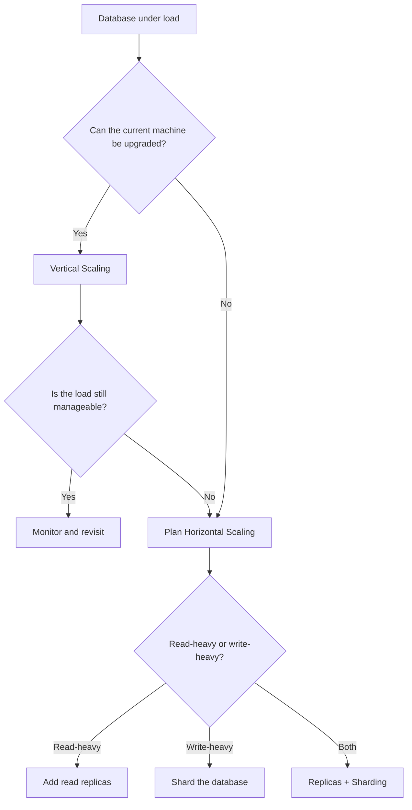

### 1.5 Interview Tip

> Most real-world systems start with vertical scaling and move to horizontal scaling when
> they hit the ceiling. Always mention this progression in interviews -- it shows practical
> awareness. The inflection point is typically around **1-10 TB of data** or **50,000+
> queries per second**, depending on the workload.

---

## 2. Replication

Replication copies data from one database server to one or more other servers. The primary
goals are **high availability**, **fault tolerance**, and **read scalability**.

### 2.1 Master-Slave (Primary-Replica) Replication

The most common replication topology. A single **primary** (master) handles all writes.
One or more **replicas** (slaves) receive copies of the data and serve read queries.

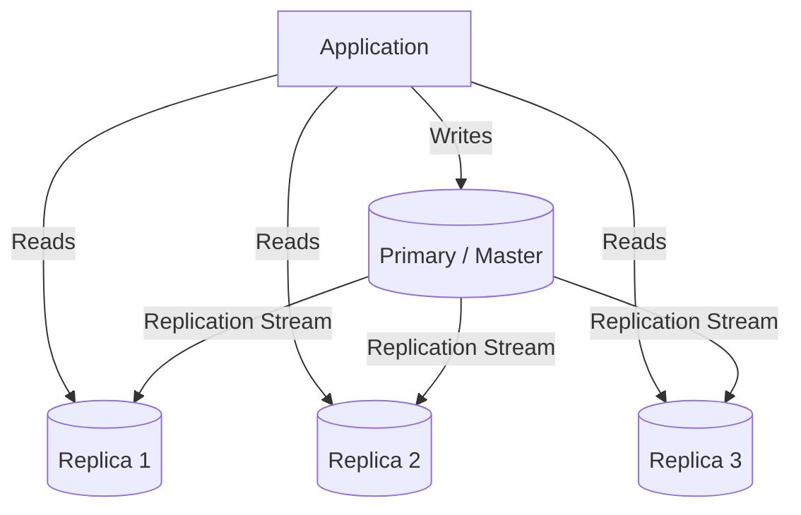

**How it works:**
1. Client sends all writes (INSERT, UPDATE, DELETE) to the primary.
2. Primary records changes in a write-ahead log (WAL) or binary log.
3. Replicas pull (or are pushed) the log entries and apply them locally.
4. Read queries are distributed across replicas.

**Replication Lag:**
- The time between a write on the primary and its visibility on a replica.
- Typical lag: milliseconds to seconds under normal load.
- Under heavy write load or network issues, lag can grow to minutes.
- **Stale reads** are the main consequence -- a user writes data then reads from a replica
  that hasn't caught up yet.

**Mitigating replication lag:**
- **Read-your-own-writes consistency**: Route the writing user's subsequent reads to the
  primary for a short window (e.g., 5 seconds).
- **Monotonic reads**: Pin a user session to a single replica so they never see time go
  backward.
- **Causal consistency**: Track a logical timestamp and ensure the replica has caught up
  to that point before serving the read.

**Failover strategies:**
- **Automatic failover**: A health-check system promotes a replica to primary if the
  current primary fails. Tools: Orchestrator (MySQL), Patroni (PostgreSQL).
- **Manual failover**: An operator promotes a replica. Simpler but slower recovery.
- Pitfall: if the old primary comes back, it must be demoted to a replica to avoid
  split-brain.

### 2.2 Multi-Master Replication

Multiple nodes accept writes. Each node replicates its changes to all other nodes.

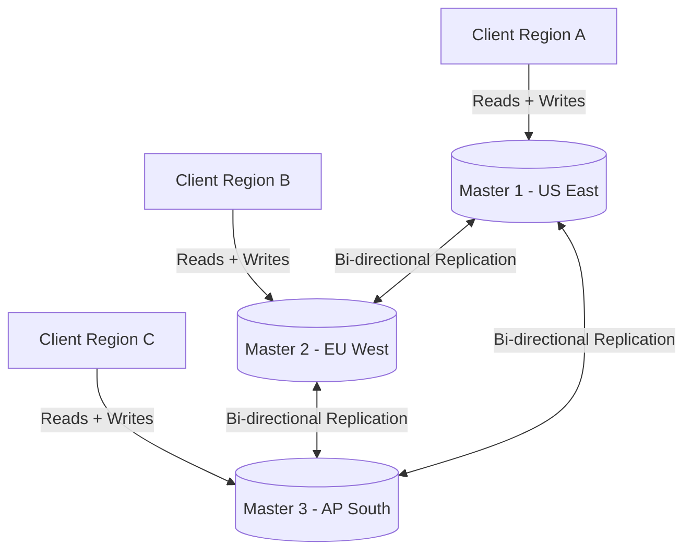

**Conflict Resolution Strategies:**

| Strategy               | Description                                             | Pros                  | Cons                            |
|------------------------|---------------------------------------------------------|-----------------------|---------------------------------|
| Last-Write-Wins (LWW)  | Highest timestamp wins                                  | Simple                | Data loss if clocks drift       |
| Application-level      | App logic merges conflicts                              | Most accurate         | Complex to implement            |
| CRDTs                  | Conflict-free replicated data types                     | Automatic convergence | Limited data structure support  |
| Version vectors        | Track causal history per node                           | Preserves causality   | Storage overhead                |

**Use cases for multi-master:**
- **Multi-region deployments** where local writes are required for latency.
- **Offline-first applications** (e.g., mobile apps that sync later).
- **High-availability systems** where write downtime is unacceptable.

**Drawbacks:**
- Conflict resolution adds complexity.
- Cross-node consistency is eventually consistent at best.
- Debugging replication issues is significantly harder.

### 2.3 Synchronous vs Asynchronous Replication

| Aspect                  | Synchronous                          | Asynchronous                        |
|-------------------------|--------------------------------------|-------------------------------------|
| Write acknowledged when | All (or quorum of) replicas confirm  | Primary writes locally              |
| Write latency           | Higher (network round-trip)          | Lower (local write only)            |
| Data durability         | Strong -- no data loss on failure    | Risk of data loss on primary crash  |
| Availability impact     | Replica failure can block writes     | Replica failure is transparent      |
| Consistency             | Strong consistency possible          | Eventual consistency                |
| Use case                | Financial systems, inventory         | Social media feeds, analytics       |
| Example systems         | PostgreSQL sync replication, Raft    | MySQL async replication, Cassandra  |

**Semi-synchronous replication** is a practical middle ground: the primary waits for **at
least one** replica to acknowledge before confirming the write. This gives durability without
the latency penalty of full synchronous replication. MySQL supports this natively.

### 2.4 Replication Topologies at a Glance

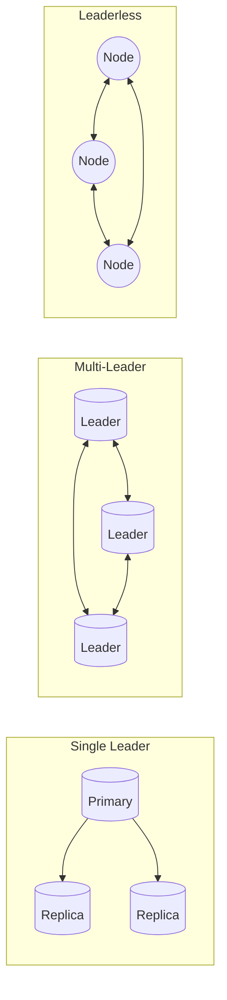

**Leaderless replication** (e.g., Cassandra, DynamoDB): Any node accepts reads and writes.
Uses quorum reads/writes (R + W > N) to ensure consistency. Excellent availability but
weaker consistency guarantees.

---

## 3. Sharding (Horizontal Partitioning)

Sharding splits a single logical dataset across multiple databases (shards), each holding a
**subset of the rows**. Each shard is an independent database that can live on its own server.

**Why shard?**
- Single database cannot hold all the data (storage limit).
- Single database cannot handle the query throughput (compute limit).
- Need to reduce query latency by working with smaller datasets.

### 3.1 Hash-Based Sharding

A hash function determines which shard a row belongs to.

```
shard_id = hash(shard_key) % number_of_shards
```

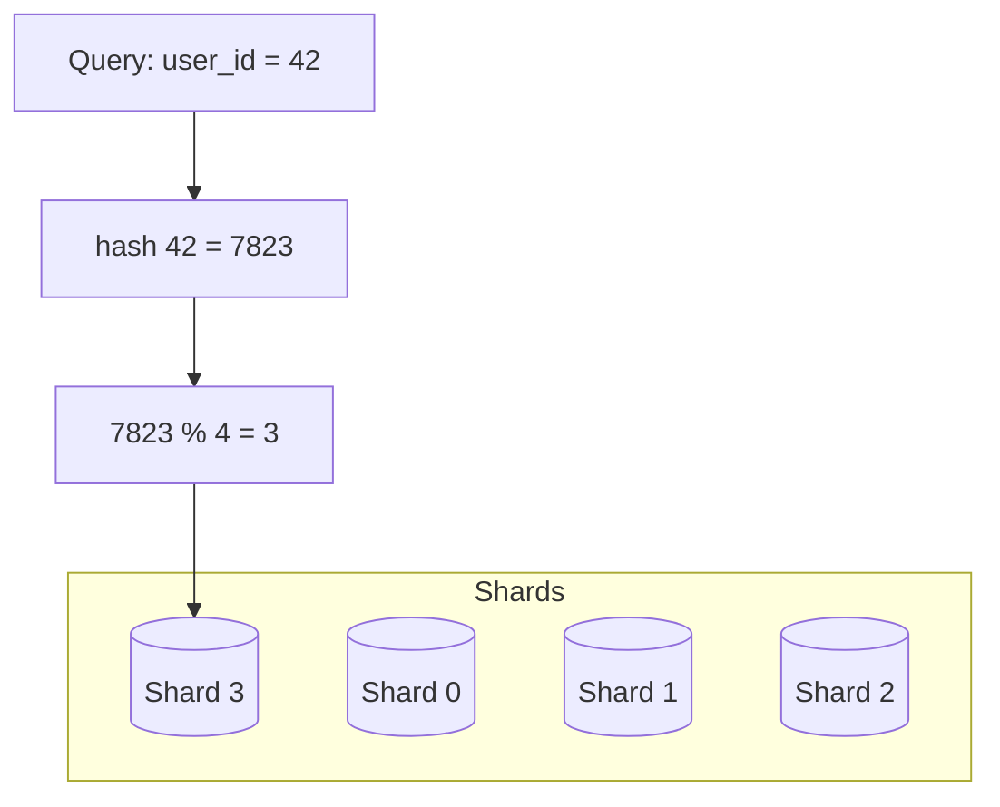

**Modulo-based hashing:**
- Simple: `shard = hash(key) % N`
- Problem: Adding or removing a shard (changing N) causes **massive data redistribution**.
  Almost every key maps to a different shard.

**Consistent hashing:**
- Keys and shards are placed on a hash ring (0 to 2^32 - 1).
- A key is assigned to the next shard clockwise on the ring.
- Adding a shard only moves keys from the adjacent shard, not from all shards.
- Virtual nodes (vnodes) improve balance -- each physical shard gets multiple positions on
  the ring.

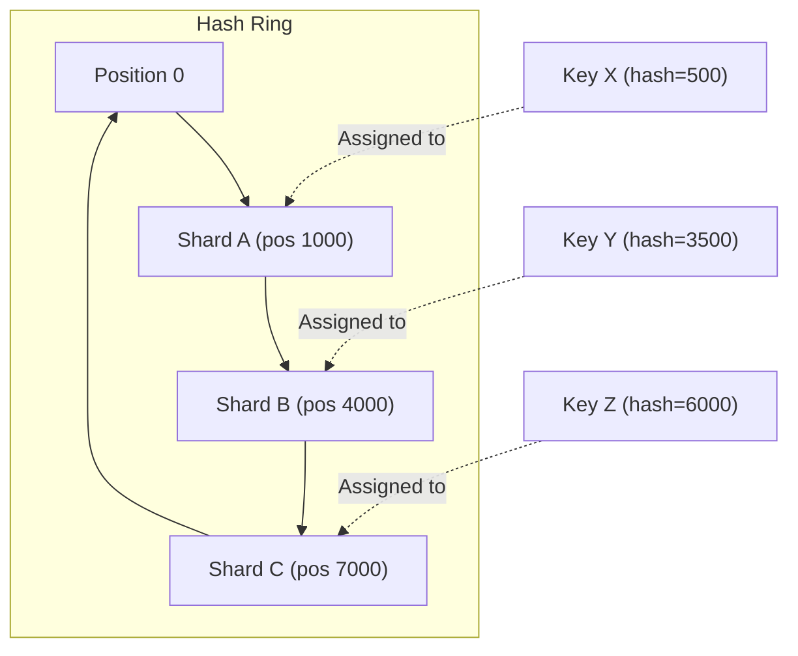

**Pros of hash-based sharding:**
- Even data distribution (with a good hash function).
- No need to understand data semantics.

**Cons of hash-based sharding:**
- Range queries are expensive (data for a range spans multiple shards).
- Resharding (modulo) is painful without consistent hashing.

### 3.2 Range-Based Sharding

Rows are assigned to shards based on value ranges of the shard key.

Example with a `created_at` timestamp:
- Shard 1: January - March
- Shard 2: April - June
- Shard 3: July - September
- Shard 4: October - December

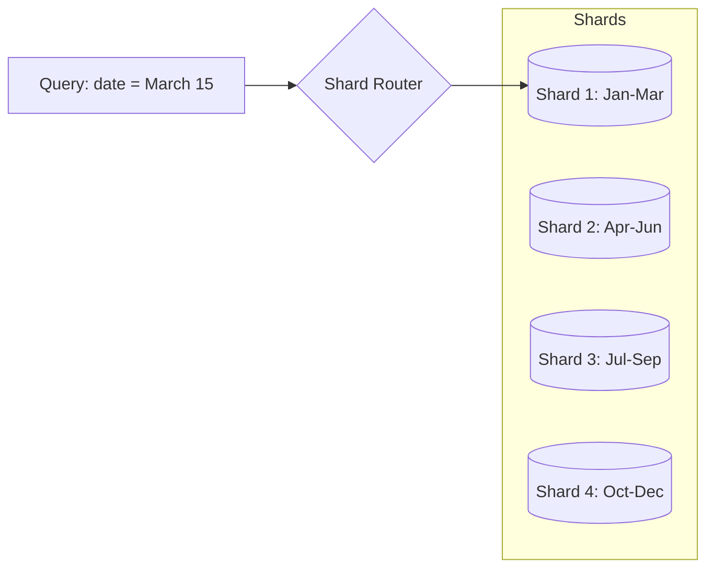

**The hotspot problem:**
- If the shard key is monotonically increasing (e.g., auto-increment ID, timestamp), all
  new writes go to the **last shard**, creating an unbalanced load.
- Solution: Prefix the key with a hash or use a composite shard key to spread writes.
- Example: Instead of sharding by `created_at`, shard by `hash(user_id)` and use
  `created_at` as a secondary sort within each shard.

**Pros of range-based sharding:**
- Range queries are efficient (scan one or a few shards).
- Easy to understand and implement.

**Cons of range-based sharding:**
- Prone to hotspots if not designed carefully.
- Uneven data distribution is common.

### 3.3 Directory-Based Sharding

A separate **lookup service** (directory) maintains a mapping from each shard key to its
shard location.

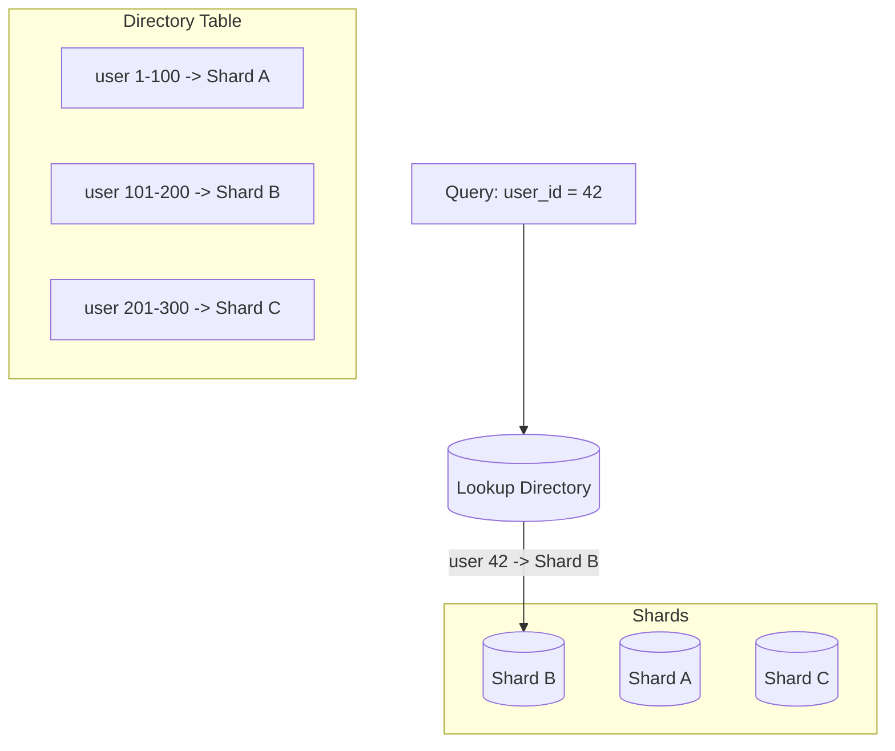

**How it works:**
1. Every query first consults the directory to find the correct shard.
2. The directory can be a database table, a distributed cache (Redis), or an in-memory map.
3. To reshard, you only update the directory and migrate the data -- no application logic
   changes.

**Pros:**
- Maximum flexibility -- can move data between shards without changing the hash function.
- Supports heterogeneous shards (different sizes, different regions).

**Cons:**
- The directory itself becomes a single point of failure and a bottleneck.
- Extra network hop for every query.
- Directory must be highly available and fast (usually cached aggressively).

### 3.4 Sharding Strategy Comparison

| Aspect               | Hash-Based              | Range-Based              | Directory-Based         |
|-----------------------|-------------------------|--------------------------|-------------------------|
| Data distribution     | Even                    | Can be uneven            | Flexible                |
| Range queries         | Expensive (scatter)     | Efficient                | Depends on mapping      |
| Resharding ease       | Hard (modulo) / OK (consistent hash) | Moderate    | Easy (update directory) |
| Hotspot risk          | Low                     | High                     | Controllable            |
| Implementation        | Moderate                | Simple                   | Moderate                |
| Extra infrastructure  | None                    | None                     | Lookup service needed   |
| Example systems       | Cassandra, DynamoDB     | HBase, MongoDB (range)   | Custom implementations  |

### 3.5 Cross-Shard Operations

The biggest challenge with sharding is operations that span multiple shards:

**Cross-shard joins:**
- Not natively supported. You must query each shard and join in the application layer.
- Mitigation: Denormalize data so that related data lives on the same shard.

**Cross-shard transactions:**
- Require two-phase commit (2PC) or saga patterns.
- 2PC is slow and reduces availability.
- Prefer designing shard keys so that transactions stay within a single shard.

**Global secondary indexes:**
- A local index per shard only covers that shard's data.
- A global index must be updated on every write and queried for every read on that index.
- Some databases (e.g., DynamoDB GSI, CockroachDB) handle this automatically.

### 3.6 Choosing a Shard Key

The shard key is the **most important design decision** in a sharded system.

**Good shard key properties:**
- High cardinality (many distinct values).
- Even distribution of writes and reads.
- Aligns with the most common query pattern (queries should hit one shard, not all).
- Doesn't change over time (shard key updates require moving rows between shards).

**Examples:**

| Application        | Good shard key   | Bad shard key    | Reason                              |
|--------------------|------------------|------------------|-------------------------------------|
| Social network     | user_id          | country          | Country is low cardinality, uneven  |
| E-commerce orders  | order_id         | created_at       | Timestamp causes hotspots           |
| Multi-tenant SaaS  | tenant_id        | user_id          | Tenant keeps related data together  |
| Chat application   | channel_id       | message_id       | Queries are per-channel             |

---

## 4. Partitioning

Partitioning divides a table into smaller pieces. It can be done **within a single
database** (unlike sharding, which distributes across multiple databases/servers).

### 4.1 Horizontal Partitioning

Splits rows into separate partitions based on a partition key. Each partition has the
same columns but different rows.

Example: An `orders` table partitioned by year.

```
orders_2023  ->  rows where year = 2023
orders_2024  ->  rows where year = 2024
orders_2025  ->  rows where year = 2025
```

**Use cases:**
- Time-series data: query recent data frequently, archive old data cheaply.
- Regulatory compliance: keep data from different regions in separate partitions.
- Performance: queries with a partition key filter only scan the relevant partition.

### 4.2 Vertical Partitioning

Splits columns into separate tables. Each partition has different columns but the same
rows (joined by primary key).

Example: A `users` table split into:
- `users_core`: id, name, email (accessed frequently)
- `users_profile`: id, bio, avatar_url, preferences (accessed less often)
- `users_audit`: id, created_at, last_login, ip_history (accessed rarely)

**Use cases:**
- Hot/cold column separation: keep frequently accessed columns in a smaller, faster table.
- Large columns (BLOBs, text): separate them so they don't slow down queries that don't
  need them.
- Security: isolate sensitive columns (PII) into a separate partition with stricter access
  controls.

### 4.3 Horizontal vs Vertical Partitioning Comparison

| Aspect               | Horizontal Partitioning       | Vertical Partitioning         |
|-----------------------|-------------------------------|-------------------------------|
| What is split         | Rows                          | Columns                       |
| Schema per partition  | Same columns                  | Different columns             |
| Primary use case      | Large tables, time-series     | Wide tables, hot/cold columns |
| Query impact          | Partition pruning on key      | Fewer columns per scan        |
| Complexity            | Low (built into most DBs)     | Moderate (requires joins)     |
| Example               | PostgreSQL table partitioning | Splitting a wide table        |

### 4.4 Partitioning vs Sharding

| Aspect        | Partitioning                       | Sharding                            |
|---------------|------------------------------------|--------------------------------------|
| Scope         | Single database / single server    | Multiple databases / multiple servers|
| Transparency  | Usually transparent to application | Application must be shard-aware      |
| Scalability   | Limited by single server           | Scales beyond single server          |
| Complexity    | Low                                | High                                 |
| Use when      | Table is large but server is fine  | Server capacity is exhausted         |

---

## 5. Read Replicas

Read replicas are a specific application of primary-replica replication focused on
**offloading read traffic** from the primary.

### 5.1 When to Use Read Replicas

- **Read-heavy workloads**: >90% of queries are reads (common in web applications).
- **Reporting and analytics**: Run heavy analytical queries on a replica without impacting
  the primary's write performance.
- **Geographic distribution**: Place replicas close to users in different regions to reduce
  read latency.
- **Disaster recovery**: A replica in another availability zone can be promoted to primary
  if the original fails.

### 5.2 Architecture

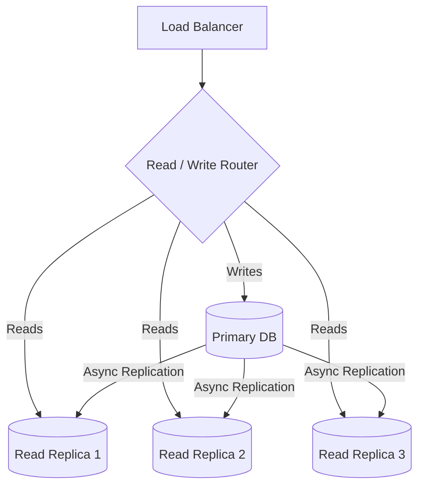

### 5.3 Consistency Concerns

**Problem**: A user writes data, then immediately reads it. If the read goes to a replica
that hasn't received the write yet, the user sees stale data.

**Solutions:**

| Strategy                    | How it works                                          | Trade-off                    |
|-----------------------------|-------------------------------------------------------|------------------------------|
| Read-after-write from primary| Route reads to primary for N seconds after a write    | Reduces read scaling benefit |
| Session stickiness          | Pin a user to one replica for the session             | Uneven load distribution     |
| Causal consistency tokens   | Track a version; replica waits until it has that version | Adds latency for stale replicas |
| Synchronous replication     | Replica confirms before write is acknowledged         | Higher write latency         |

### 5.4 Replication Lag Handling in Practice

```
Scenario: E-commerce product page
- User updates product price from $10 to $15.
- Immediately refreshes the product page.
- If the read goes to a stale replica, they see $10 and think the update failed.

Fix: After the price update API call, include a version token in the response.
     The frontend sends this token on the next read. The read router ensures the
     replica serving the read is at least at that version.
```

**Monitoring replication lag:**
- MySQL: `SHOW SLAVE STATUS` -> `Seconds_Behind_Master`
- PostgreSQL: `SELECT pg_last_wal_replay_lsn()` vs `pg_last_wal_receive_lsn()`
- Alert threshold: typically >1 second for user-facing replicas, >30 seconds for analytics.

---

## 6. Database Federation

Federation (also called **functional partitioning**) splits databases by **function or
domain**, rather than by rows or columns.

### 6.1 How It Works

Instead of one monolithic database for the entire application, each major feature or
service gets its own database.

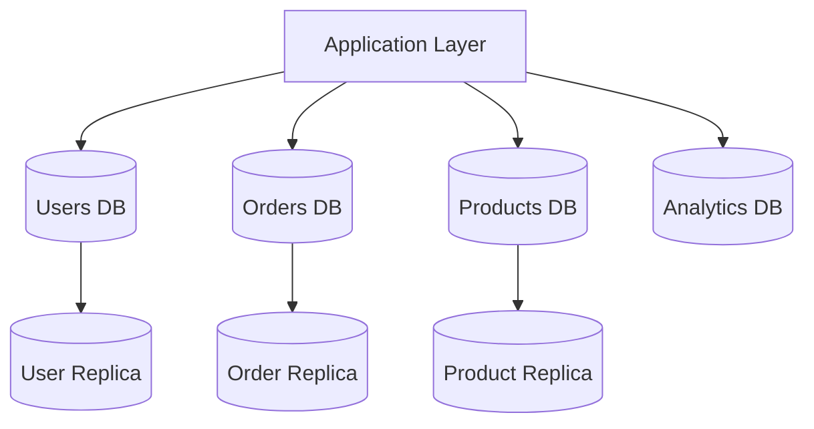

### 6.2 Benefits

- **Independent scaling**: Scale the orders database independently of the users database.
- **Technology diversity**: Use PostgreSQL for users (relational), Elasticsearch for
  products (search), ClickHouse for analytics (OLAP).
- **Fault isolation**: A failure in the analytics database doesn't affect order processing.
- **Smaller datasets per database**: Queries are faster, indexes are smaller, backups are
  quicker.
- **Team autonomy**: In a microservices architecture, each team owns its database.

### 6.3 Drawbacks

- **Cross-domain joins are gone**: You cannot `JOIN users ON orders` in SQL. Joins must
  happen in the application layer or via an API.
- **Distributed transactions**: Updating both the orders and users databases atomically
  requires 2PC or saga patterns.
- **Data duplication**: Some data (e.g., user name) may need to be stored in multiple
  databases for query convenience.
- **Operational overhead**: More databases to manage, monitor, back up, and upgrade.

### 6.4 Federation vs Sharding

| Aspect               | Federation                              | Sharding                                |
|-----------------------|-----------------------------------------|-----------------------------------------|
| Split criterion       | By domain / function                    | By rows (same schema)                   |
| Schema per database   | Different schemas                       | Same schema                             |
| Cross-database queries| Joins across domains                    | Joins across shards                     |
| Typical use case      | Microservices, SOA                      | Single large table                      |
| Scaling dimension     | Scale each domain independently         | Scale a single domain horizontally      |

---

## 7. Denormalization

Denormalization intentionally adds redundant data to reduce the need for joins, improving
**read performance** at the cost of **write complexity**.

### 7.1 When to Denormalize

- Read-to-write ratio is very high (100:1 or more).
- Joins are the primary bottleneck in query performance.
- Data changes infrequently relative to how often it is read.
- You are moving to a NoSQL database that doesn't support joins.
- You need sub-millisecond read latency (caching layer, materialized views).

### 7.2 Common Denormalization Techniques

**1. Duplicate columns across tables:**
```sql
-- Normalized: orders table references users table
SELECT o.id, o.total, u.name
FROM orders o
JOIN users u ON o.user_id = u.id;

-- Denormalized: user_name stored directly in orders
SELECT id, total, user_name
FROM orders;
```

**2. Pre-computed aggregates:**
```sql
-- Instead of: SELECT COUNT(*) FROM followers WHERE user_id = 42
-- Store follower_count directly in the users table
SELECT follower_count FROM users WHERE id = 42;
```

**3. Materialized views (database-managed denormalization):**
```sql
CREATE MATERIALIZED VIEW order_summary AS
SELECT u.id, u.name, COUNT(o.id) as order_count, SUM(o.total) as total_spent
FROM users u
LEFT JOIN orders o ON u.id = o.user_id
GROUP BY u.id, u.name;

-- Refresh periodically
REFRESH MATERIALIZED VIEW order_summary;
```

### 7.3 Trade-offs

| Aspect                | Normalized                         | Denormalized                       |
|-----------------------|------------------------------------|------------------------------------|
| Read performance      | Slower (joins required)            | Faster (pre-joined data)          |
| Write performance     | Faster (update one place)          | Slower (update multiple places)   |
| Storage               | Less (no redundancy)               | More (redundant data)             |
| Data consistency      | Single source of truth             | Risk of inconsistency             |
| Schema flexibility    | Easier to change                   | Harder to change                  |
| Query complexity      | Complex queries with joins         | Simple queries                    |
| Best for              | Write-heavy, evolving schemas      | Read-heavy, stable schemas        |

### 7.4 Keeping Denormalized Data Consistent

- **Application-level updates**: When the source data changes, update all copies in the
  same transaction (or using eventual consistency with events).
- **Database triggers**: Automatically update denormalized fields when source data changes.
  Simple but can impact write performance and are hard to debug.
- **Change Data Capture (CDC)**: Tools like Debezium capture changes from the database log
  and propagate them to denormalized stores asynchronously.
- **Periodic refresh**: For materialized views, refresh on a schedule (acceptable when
  slight staleness is tolerable).

---

## 8. Common Patterns

### 8.1 CQRS (Command Query Responsibility Segregation)

CQRS separates the **write model** (commands) from the **read model** (queries) into
different data stores optimized for each workload.

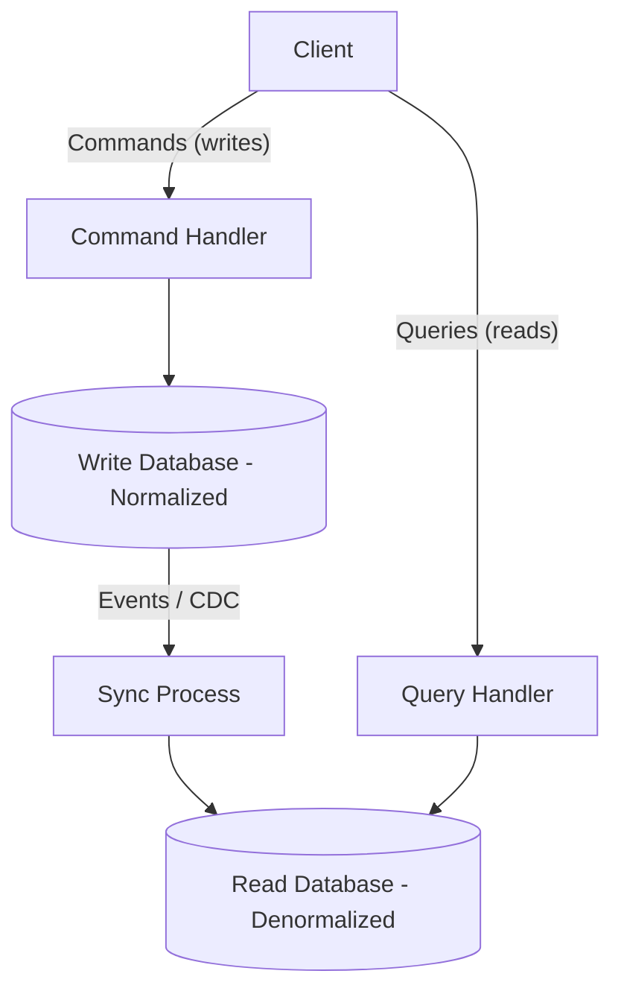

**How it works:**
1. **Commands** (create, update, delete) go to a write-optimized database (e.g., normalized
   PostgreSQL).
2. Changes are propagated (via events, CDC, or messaging) to a read-optimized store (e.g.,
   Elasticsearch, Redis, denormalized views).
3. **Queries** are served from the read store, which is structured for fast retrieval.

**Benefits:**
- Each store is optimized for its workload.
- Read and write models can scale independently.
- Read models can be rebuilt from the event stream if corrupted.

**Drawbacks:**
- Eventual consistency between write and read stores.
- More infrastructure to maintain.
- Increased system complexity.

**When to use CQRS:**
- Read and write patterns are significantly different.
- Read:write ratio is very high.
- You need different data models for reads (e.g., search index, graph, denormalized view).

### 8.2 Event Sourcing for Data

Instead of storing the **current state** of an entity, store the **sequence of events**
that led to the current state.

```
Traditional:  Account { balance: 150 }

Event Sourced:
  Event 1: AccountCreated  { initial_balance: 0 }
  Event 2: MoneyDeposited  { amount: 200 }
  Event 3: MoneyWithdrawn  { amount: 50 }
  Current state: replay events -> balance = 0 + 200 - 50 = 150
```

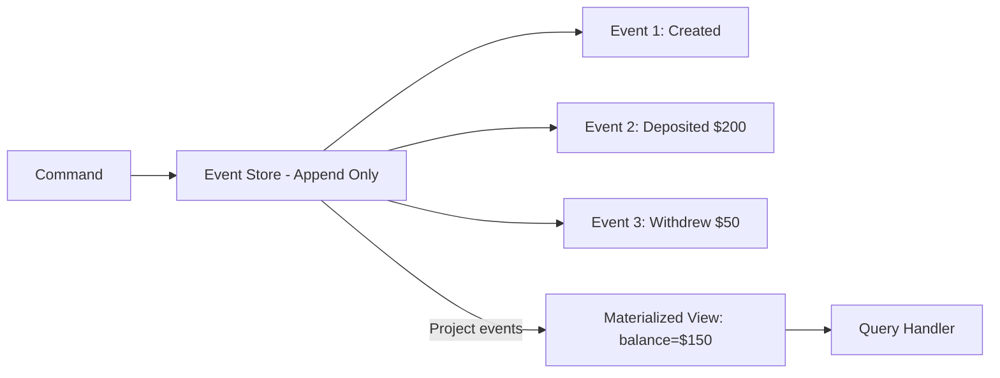

**Benefits:**
- **Complete audit trail**: Every change is recorded, nothing is lost.
- **Temporal queries**: "What was the account balance on March 1st?"
- **Rebuild projections**: If the read model is wrong, replay events to rebuild it.
- **Debug and replay**: Reproduce bugs by replaying the exact sequence of events.

**Drawbacks:**
- Event store grows indefinitely (snapshotting mitigates this).
- Querying current state requires projection (rebuilding from events or maintaining a
  materialized view).
- Schema evolution of events is tricky (versioning events is required).
- Eventual consistency is inherent.

**Event sourcing pairs naturally with CQRS**: events are the mechanism for syncing the
write model to the read model.

### 8.3 Materialized Views

A **materialized view** is a pre-computed query result stored as a table. Unlike a regular
view (which runs the query on every access), a materialized view stores the results
physically and is refreshed periodically or on trigger.

**Database-native materialized views:**
```sql
-- PostgreSQL
CREATE MATERIALIZED VIEW dashboard_stats AS
SELECT
    date_trunc('day', created_at) AS day,
    COUNT(*) AS total_orders,
    SUM(amount) AS total_revenue,
    AVG(amount) AS avg_order_value
FROM orders
GROUP BY day;

-- Refresh strategies
REFRESH MATERIALIZED VIEW dashboard_stats;                    -- Full refresh
REFRESH MATERIALIZED VIEW CONCURRENTLY dashboard_stats;       -- Non-blocking refresh
```

**Application-level materialized views:**
- Use a separate read-optimized store (Redis, Elasticsearch) as a "materialized view."
- Update it via CDC, event handlers, or cron jobs.
- This approach is more flexible and scales better than database-native views.

**When to use:**
- Dashboard or reporting queries that aggregate large datasets.
- Queries that join many tables and are run frequently.
- Data that doesn't need to be real-time (staleness of seconds to minutes is acceptable).

---

## 9. Quick Reference Summary

### 9.1 Scaling Strategy Decision Matrix

| Problem                       | Solution                     | Notes                                |
|-------------------------------|------------------------------|--------------------------------------|
| Reads are slow                | Read replicas                | Easiest first step                   |
| Single table too large        | Partitioning                 | Single server, built-in support      |
| Single server at capacity     | Sharding                     | Significant complexity               |
| Different features need different scale | Federation          | Aligns with microservices            |
| Joins are the bottleneck      | Denormalization              | Trade write complexity for read speed|
| Read and write patterns differ| CQRS                         | Separate read/write stores           |
| Need complete audit trail     | Event sourcing               | Append-only event store              |
| Single node failure = downtime| Replication                  | Primary-replica or multi-master      |

### 9.2 Scaling Progression (Typical Path)

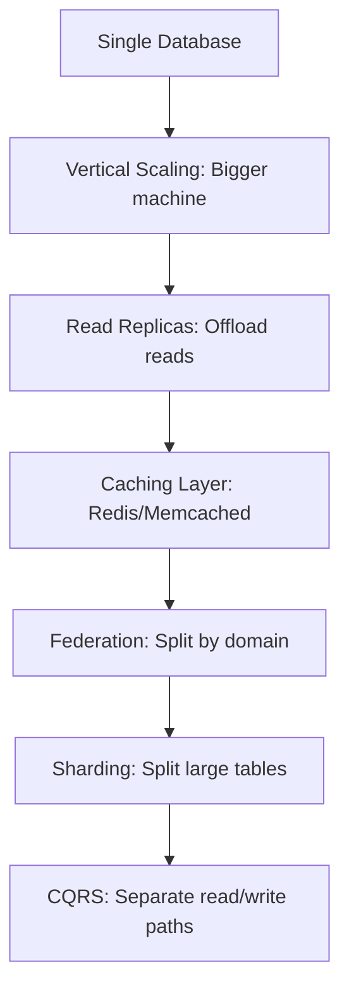

Most applications follow this progression. **Do not jump to sharding** until you have
exhausted simpler options. Each step introduces complexity, so only advance when the
current step is insufficient.

### 9.3 Key Numbers to Know

| Metric                            | Typical Threshold                         |
|-----------------------------------|-------------------------------------------|
| Single PostgreSQL read capacity   | ~10,000 - 50,000 QPS (depending on query) |
| Single MySQL write capacity       | ~5,000 - 20,000 QPS (depending on schema) |
| Replication lag (healthy)         | < 1 second                                |
| Replication lag (concerning)      | > 5 seconds                               |
| Read replicas per primary         | 5-15 (practical limit)                    |
| Shard count (starting point)      | 4-16 shards                               |
| Vertical scaling ceiling          | ~1-10 TB RAM, 128 cores                   |
| Typical cache hit ratio target    | > 95%                                     |

### 9.4 Interview Checklist

When discussing database scaling in a system design interview:

1. **Start with the workload**: Is it read-heavy, write-heavy, or balanced?
2. **Estimate the scale**: How much data? How many QPS?
3. **Start simple**: Can vertical scaling or caching solve it?
4. **Add read replicas** if read-heavy.
5. **Consider federation** if the system has distinct domains.
6. **Shard only when necessary** and choose the shard key carefully.
7. **Address consistency**: What level of consistency does each feature need?
8. **Discuss trade-offs**: Every scaling technique has downsides -- mention them.
9. **Mention monitoring**: Replication lag, shard balance, query latency.
10. **Think about failure modes**: What happens when a primary fails? A shard goes down?

### 9.5 Technology Quick Reference

| Category           | Technologies                                            |
|--------------------|---------------------------------------------------------|
| Relational + Sharding | Vitess (MySQL), Citus (PostgreSQL), CockroachDB      |
| NoSQL (auto-sharded)  | Cassandra, DynamoDB, MongoDB, ScyllaDB               |
| Time-series        | TimescaleDB, InfluxDB, QuestDB                          |
| OLAP / Analytics   | ClickHouse, BigQuery, Redshift, Snowflake               |
| Event Store        | EventStoreDB, Apache Kafka (as event log)               |
| CDC                | Debezium, Maxwell, AWS DMS                              |
| Orchestration      | Patroni (PG), Orchestrator (MySQL), Vitess              |
| Caching layer      | Redis, Memcached, HAProxy (query routing)               |

---

## Further Reading

- Martin Kleppmann, *Designing Data-Intensive Applications* -- Chapters 5 (Replication),
  6 (Partitioning), 7 (Transactions)
- Alex Xu, *System Design Interview* -- Chapter on database scaling
- AWS Well-Architected Framework -- Database pillar
- Google Spanner paper (external consistency at global scale)
- Amazon Dynamo paper (leaderless replication, consistent hashing)
