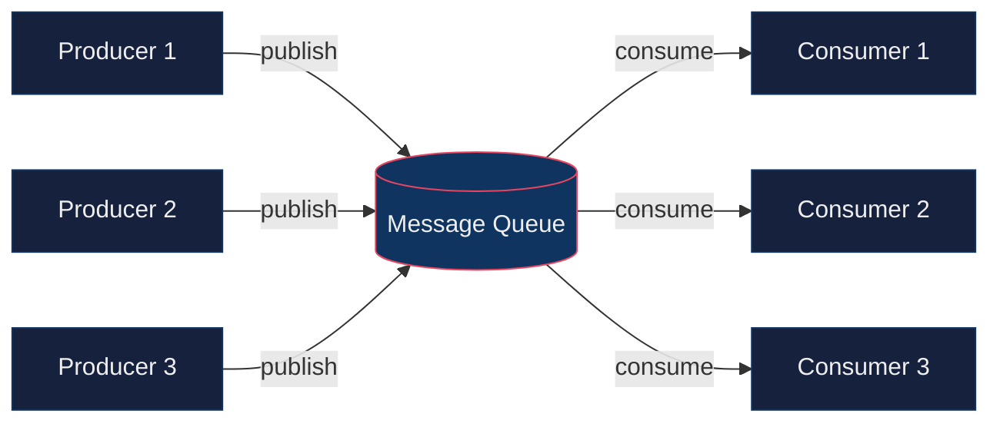
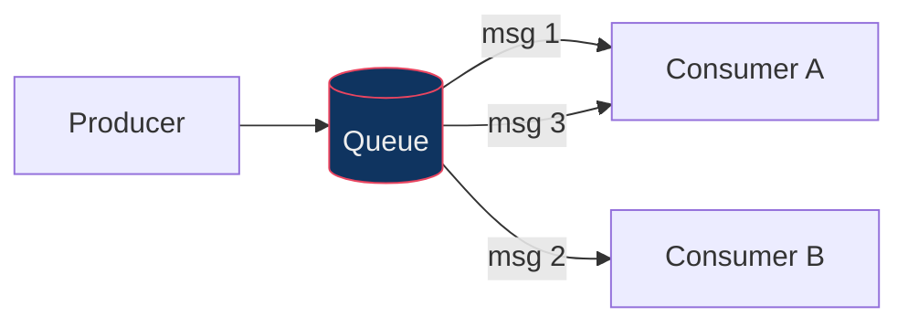
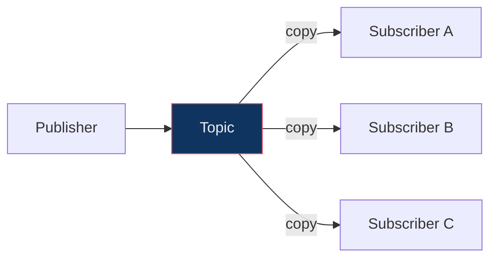
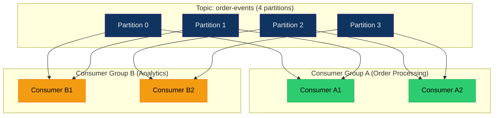
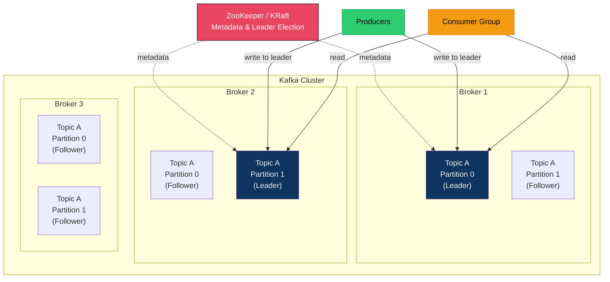
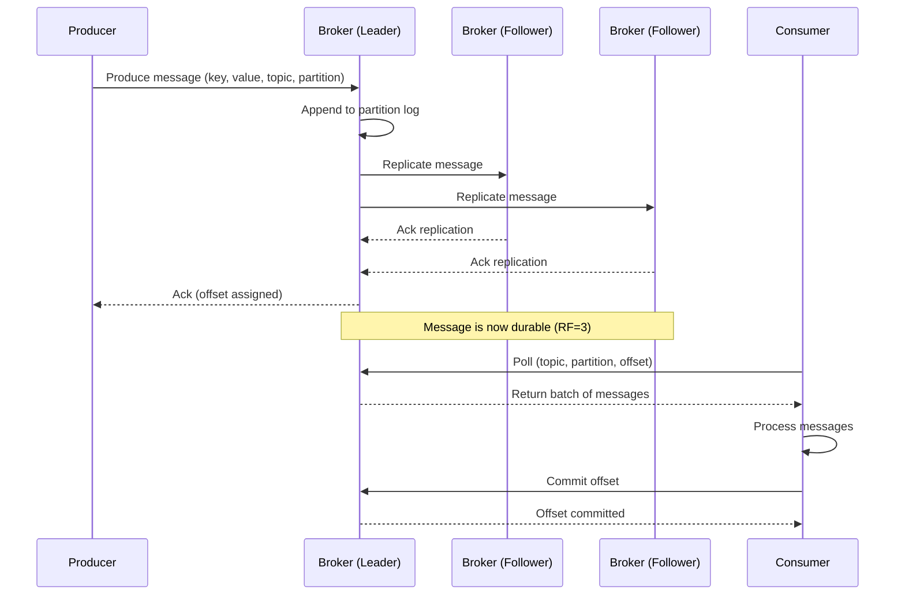
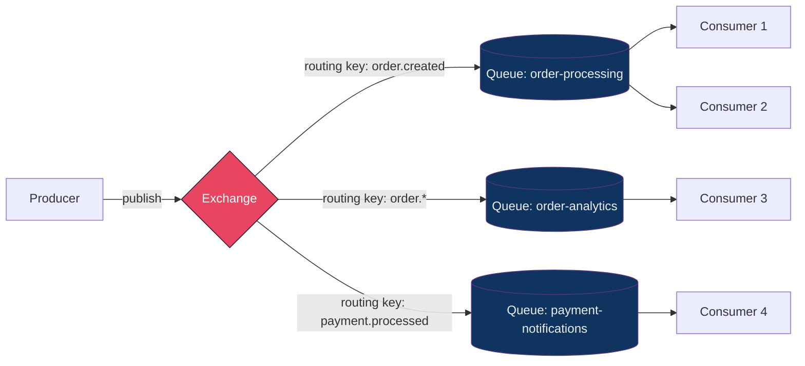
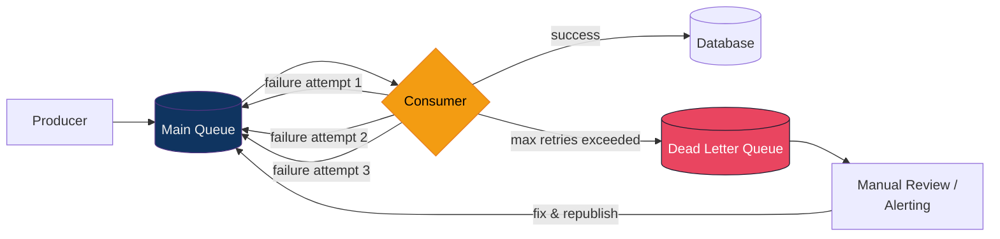

# Message Queues

> Message queues are the backbone of asynchronous communication in distributed systems. They decouple producers from consumers, enable reliable message delivery, absorb traffic spikes, and unlock horizontal scalability. Every system design interview that involves background processing, event-driven workflows, or inter-service communication will touch on message queues.

---

## 1. Why Message Queues

In a synchronous architecture, Service A calls Service B directly and waits for a response. This creates tight coupling, cascading failures, and throughput bottlenecks. Message queues break this chain.

### 1.1 Key Benefits

| Benefit | Explanation |
|---------|-------------|
| **Decoupling** | Producers and consumers evolve independently. A change in the consumer's logic does not require redeploying the producer. |
| **Asynchronous Processing** | The producer fires a message and returns immediately. Heavy work (video transcoding, email sending, analytics) happens in the background. |
| **Load Leveling** | Queues act as buffers. If the producer generates 10K messages/sec but the consumer can only handle 2K/sec, the queue absorbs the burst and the consumer drains at its own pace. |
| **Reliability** | Messages are persisted on disk (Kafka) or acknowledged before deletion (RabbitMQ). If a consumer crashes, the message is not lost. |
| **Scalability** | Adding more consumer instances lets you scale processing horizontally without touching the producer. |
| **Retry & Fault Isolation** | Failed messages can be retried or routed to a dead letter queue. A failing downstream service does not bring down the upstream service. |

### 1.2 Producer-Queue-Consumer Pattern



### 1.3 Real-World Examples

| Use Case | How Queues Help |
|----------|-----------------|
| Order placement (Amazon) | Order service publishes an event; payment, inventory, and notification services consume independently. |
| Video upload (YouTube) | Upload service enqueues a transcoding job; worker pools process videos asynchronously. |
| Log aggregation | Application servers push logs to Kafka; Elasticsearch consumers index them for search. |
| Email/SMS notifications | API server enqueues notification requests; a dedicated service handles rate-limited delivery. |
| Analytics pipelines | Clickstream events flow through Kafka into data warehouses for batch/real-time analytics. |

---

## 2. Core Concepts

### 2.1 Messaging Models

There are two fundamental messaging models.

#### Point-to-Point (Competing Consumers)

Each message is consumed by **exactly one** consumer. Multiple consumers can listen on the same queue, but only one will process a given message. This is ideal for work distribution (task queues).



#### Publish-Subscribe (Pub/Sub)

Each message is delivered to **all** subscribers. Every subscriber gets its own copy of every message. This is ideal for event broadcasting (notifications, event sourcing).



### 2.2 Key Terminology

| Term | Definition |
|------|-----------|
| **Topic** | A named category/feed to which messages are published. Think of it as a logical channel (e.g., `order-events`, `user-signups`). |
| **Partition** | A topic is split into partitions for parallelism. Each partition is an ordered, immutable sequence of messages. (Kafka-specific but widely adopted.) |
| **Offset** | A sequential ID assigned to each message within a partition. Consumers track their position using offsets. |
| **Producer** | The application that publishes messages to a topic or queue. |
| **Consumer** | The application that reads and processes messages. |
| **Consumer Group** | A set of consumers that cooperate to consume a topic. Each partition is assigned to exactly one consumer in the group, enabling parallel processing. |
| **Broker** | A server that stores messages and serves clients. A cluster consists of multiple brokers for fault tolerance. |
| **Acknowledgement (Ack)** | Confirmation from the consumer that a message has been successfully processed. Unacknowledged messages can be redelivered. |
| **Dead Letter Queue (DLQ)** | A special queue where messages that fail processing repeatedly are moved for manual inspection. |

### 2.3 Consumer Groups Explained

Consumer groups are the mechanism that enables both point-to-point and pub/sub models simultaneously in systems like Kafka.



- **Within a group**: point-to-point. Each partition is assigned to exactly one consumer. Message is processed once.
- **Across groups**: pub/sub. Each group independently consumes all messages from the topic.
- If you add more consumers than partitions in a group, the extra consumers sit idle.

---

## 3. Apache Kafka Deep Dive

Apache Kafka is a distributed event streaming platform designed for high-throughput, fault-tolerant, durable message processing. It is the go-to choice for event-driven architectures, log aggregation, and real-time data pipelines.

### 3.1 Architecture Overview



### 3.2 Core Components

| Component | Role |
|-----------|------|
| **Broker** | A Kafka server that stores data and serves clients. A typical production cluster has 3-12+ brokers. |
| **Topic** | A logical stream of records. A topic is divided into partitions. |
| **Partition** | An ordered, append-only log. Each message gets a monotonically increasing offset. Partitions are distributed across brokers. |
| **Replication Factor** | Number of copies of each partition. RF=3 means 3 brokers hold a copy. One is the **leader** (handles reads/writes), the others are **followers** (ISR = In-Sync Replicas). |
| **ZooKeeper / KRaft** | Manages cluster metadata, broker registration, and leader election. KRaft (Kafka Raft) is replacing ZooKeeper in newer versions. |
| **Producer** | Publishes records to topic partitions. Can choose partition via key hashing, round-robin, or custom partitioner. |
| **Consumer Group** | Consumers sharing a `group.id`. Kafka assigns partitions to consumers in the group for parallel processing. |

### 3.3 How Partitions Enable Parallelism

Partitions are Kafka's unit of parallelism. The maximum parallelism for a consumer group equals the number of partitions.

```
Topic: payment-events (6 partitions)

Consumer Group with 3 consumers:
  Consumer 1 -> Partition 0, Partition 1
  Consumer 2 -> Partition 2, Partition 3
  Consumer 3 -> Partition 4, Partition 5

Consumer Group with 6 consumers:
  Consumer 1 -> Partition 0
  Consumer 2 -> Partition 1
  Consumer 3 -> Partition 2
  Consumer 4 -> Partition 3
  Consumer 5 -> Partition 4
  Consumer 6 -> Partition 5

Consumer Group with 8 consumers:
  Consumer 1-6 -> one partition each
  Consumer 7   -> IDLE (no partition to assign)
  Consumer 8   -> IDLE (no partition to assign)
```

**Key rules:**
- One partition can only be assigned to one consumer within a group.
- One consumer can handle multiple partitions.
- More partitions = more parallelism = higher throughput, but also more overhead (file handles, rebalancing time).
- Rule of thumb: start with `2x expected consumer count` partitions.

### 3.4 Offset Management

Offsets track how far a consumer has read in a partition.

| Strategy | How It Works | Pros | Cons |
|----------|-------------|------|------|
| **Auto Commit** | Kafka periodically commits the latest offset (default: every 5 seconds). | Simple, no extra code. | Risk of message loss (offset committed but processing failed) or duplicates (processing succeeded but offset not yet committed). |
| **Manual Commit (Sync)** | Consumer explicitly calls `commitSync()` after processing. | Guarantees offset is committed before moving on. | Slower throughput due to blocking commit call. |
| **Manual Commit (Async)** | Consumer calls `commitAsync()` with a callback. | Non-blocking, higher throughput. | Offset may fail to commit silently; need retry logic. |

**Best practice for at-least-once delivery:**
1. Poll messages.
2. Process the batch.
3. Commit offsets only after successful processing.

### 3.5 Log Compaction

Standard retention deletes messages after a time/size limit. Log compaction is different: it keeps the **latest value for each key** and removes older records with the same key.

```
Before compaction:
  Offset 0: key=user-1, value={name: "Alice"}
  Offset 1: key=user-2, value={name: "Bob"}
  Offset 2: key=user-1, value={name: "Alice Smith"}   <-- newer
  Offset 3: key=user-2, value={name: "Robert"}         <-- newer
  Offset 4: key=user-3, value={name: "Charlie"}

After compaction:
  Offset 2: key=user-1, value={name: "Alice Smith"}
  Offset 3: key=user-2, value={name: "Robert"}
  Offset 4: key=user-3, value={name: "Charlie"}
```

**Use cases:** changelog topics, maintaining a materialized view, CDC (Change Data Capture) streams.

### 3.6 Message Flow (Sequence Diagram)



### 3.7 Kafka Configuration Cheat Sheet

| Config | Default | Recommended | Purpose |
|--------|---------|-------------|---------|
| `replication.factor` | 1 | 3 | Number of partition replicas |
| `min.insync.replicas` | 1 | 2 | Minimum ISR for a write to succeed |
| `acks` | 1 | `all` | Producer waits for all ISR to ack |
| `retries` | 0 | 3-5 | Producer retry count on failure |
| `enable.auto.commit` | true | false | Use manual commit for at-least-once |
| `max.poll.records` | 500 | tune | Max records per poll batch |
| `session.timeout.ms` | 10000 | 30000 | Consumer heartbeat timeout |

> **Interview tip:** Setting `acks=all` + `min.insync.replicas=2` + `replication.factor=3` gives you strong durability. If 2 of 3 brokers go down, writes are rejected (availability trade-off per CAP theorem).

---

## 4. RabbitMQ

RabbitMQ is a traditional message broker implementing the AMQP (Advanced Message Queuing Protocol). It excels at complex routing, task distribution, and request-reply patterns.

### 4.1 Architecture



### 4.2 Exchange Types

The exchange is the routing layer in RabbitMQ. Producers never publish directly to a queue. They publish to an exchange, which routes messages to queues based on **bindings** and **routing keys**.

| Exchange Type | Routing Logic | Use Case |
|---------------|--------------|----------|
| **Direct** | Message is routed to queues whose binding key **exactly matches** the routing key. | Task distribution by type (e.g., `email`, `sms`, `push`). |
| **Topic** | Message is routed based on **wildcard pattern matching** on the routing key. `*` matches one word, `#` matches zero or more words. | Event routing (e.g., `order.*.created` matches `order.us.created`). |
| **Fanout** | Message is broadcast to **all** bound queues regardless of routing key. | Broadcasting events to all consumers (e.g., cache invalidation). |
| **Headers** | Routes based on **message header attributes** instead of routing key. Supports `all` or `any` matching. | Complex routing based on multiple attributes. |

### 4.3 Routing Example (Topic Exchange)

```
Exchange type: topic
Bindings:
  Queue "order-service"  bound with "order.#"
  Queue "us-analytics"   bound with "*.us.*"
  Queue "all-events"     bound with "#"

Message with routing key "order.us.created":
  -> order-service   (matches "order.#")
  -> us-analytics    (matches "*.us.*")
  -> all-events      (matches "#")

Message with routing key "payment.eu.processed":
  -> all-events      (matches "#")
```

### 4.4 Acknowledgements

RabbitMQ uses explicit acknowledgements to ensure reliable delivery.

| Ack Mode | Behavior | Risk |
|----------|----------|------|
| **Auto Ack** (`autoAck=true`) | Message is removed from queue immediately upon delivery. | Message lost if consumer crashes before processing. |
| **Manual Ack** (`basicAck`) | Consumer explicitly acknowledges after processing. Message stays in queue until acked. | Safer, but consumer must handle acks. |
| **Negative Ack** (`basicNack`) | Consumer rejects the message. Can be requeued or sent to DLQ. | Useful for transient errors (retry) vs permanent errors (DLQ). |
| **Reject** (`basicReject`) | Like nack but for a single message. Can requeue or discard. | Simpler API for single-message rejection. |

**Prefetch count:** Controls how many unacknowledged messages the broker sends to a consumer. Setting `prefetch=1` means the consumer processes one message at a time (fair dispatch). Higher values improve throughput but increase memory usage.

### 4.5 RabbitMQ Key Features

| Feature | Details |
|---------|---------|
| **Message TTL** | Messages can expire after a configured time. Expired messages are discarded or routed to DLQ. |
| **Priority Queues** | Messages can have priority levels (0-255). Higher priority messages are delivered first. |
| **Quorum Queues** | Raft-based replicated queues for durability. Replacement for classic mirrored queues. |
| **Lazy Queues** | Messages stored on disk instead of RAM. Good for very long queues (millions of messages). |
| **Shovel & Federation** | Replicate messages across RabbitMQ clusters in different data centers. |

---

## 5. Kafka vs RabbitMQ

This is one of the most commonly asked comparisons in system design interviews. The answer is never "one is better than the other" -- it depends on the use case.

### 5.1 Detailed Comparison

| Dimension | Apache Kafka | RabbitMQ |
|-----------|-------------|----------|
| **Model** | Distributed log (append-only) | Message broker (AMQP) |
| **Message Retention** | Messages are retained for a configured period (days/weeks) regardless of consumption. Consumers can replay. | Messages are deleted once acknowledged. No replay by default. |
| **Throughput** | Very high (millions of msgs/sec per cluster). Sequential disk I/O, zero-copy transfers. | Moderate (tens of thousands of msgs/sec per node). Optimized for low-latency delivery. |
| **Latency** | Low but not ultra-low. Batching adds milliseconds. Typically 5-50 ms end-to-end. | Very low for single messages. Sub-millisecond delivery possible. Typically 1-10 ms. |
| **Ordering** | Guaranteed within a partition. No global ordering across partitions. | Guaranteed within a single queue. |
| **Routing** | Minimal. Producers choose partition via key or round-robin. | Rich. Exchanges with direct, topic, fanout, headers routing. |
| **Consumer Model** | Pull-based. Consumers poll for messages. | Push-based (with pull option). Broker pushes messages to consumers. |
| **Replay** | Yes. Consumers can seek to any offset and re-read messages. | No. Once acknowledged, messages are gone. |
| **Protocol** | Custom binary protocol over TCP. | AMQP 0-9-1 (also supports STOMP, MQTT). |
| **Scaling** | Add partitions + brokers. Horizontal scaling is native. | Add nodes to cluster. Scaling requires careful queue distribution. |
| **Message Size** | Optimized for small messages (1 KB). Max default 1 MB (configurable). | Handles larger messages more gracefully. No hard limit but performance degrades. |
| **Ecosystem** | Kafka Streams, ksqlDB, Kafka Connect, Schema Registry. | Management UI, plugins, Shovel, Federation. |
| **Operational Complexity** | Higher. ZooKeeper/KRaft, partition management, ISR monitoring. | Lower. Simpler to set up and operate for smaller scales. |

### 5.2 When to Use Each

| Choose **Kafka** When | Choose **RabbitMQ** When |
|------------------------|--------------------------|
| You need event streaming / event sourcing | You need complex routing logic |
| You need message replay capability | You need request-reply patterns |
| Throughput is in millions of msgs/sec | Throughput is in thousands of msgs/sec |
| You are building real-time data pipelines | You need priority queues |
| Multiple consumer groups need the same data | You need per-message TTL |
| You need long-term message retention | You want simple setup and operations |
| You are already in a Kafka ecosystem (Streams, Connect) | Message acknowledgement per message is critical |
| Log aggregation, metrics collection, CDC | Task queues, job scheduling, RPC |

### 5.3 Can They Work Together?

Yes. A common pattern in large systems:

- **Kafka** for the event backbone (high-throughput, replay-capable, event sourcing).
- **RabbitMQ** for task queues and complex routing within individual microservices.

---

## 6. Delivery Guarantees

Delivery guarantees define how many times a message is delivered to the consumer. This is one of the most important concepts to understand for interviews.

### 6.1 The Three Guarantees

#### At-Most-Once

The message is delivered **zero or one time**. It may be lost, but it is never duplicated.

```
How it works:
1. Producer sends message (fire and forget, acks=0).
2. Broker may or may not persist it.
3. Consumer receives message, offset auto-committed before processing.
4. If consumer crashes mid-processing, message is not redelivered.

Trade-off: Fast, but messages can be lost.
Use case: Metrics, logs where occasional loss is acceptable.
```

#### At-Least-Once

The message is delivered **one or more times**. It is never lost, but it may be duplicated.

```
How it works:
1. Producer sends message with acks=all and retries.
2. Broker persists to all ISR.
3. Consumer processes message, then commits offset.
4. If consumer crashes after processing but before committing,
   the message is redelivered upon recovery -> duplicate.

Trade-off: No message loss, but consumer must handle duplicates.
Use case: Order processing, payments (with idempotency).
```

#### Exactly-Once

The message is delivered **exactly one time**. No loss, no duplication.

```
How it works (Kafka):
1. Idempotent producer: Kafka assigns a producer ID and sequence number.
   Duplicate sends (due to retries) are detected and deduplicated by the broker.
2. Transactional producer: Wraps produce + offset commit in an atomic transaction.
   Either both happen or neither happens.
3. Consumer uses read_committed isolation level.

Trade-off: Highest correctness, but adds latency and complexity.
Use case: Financial transactions, billing, inventory updates.
```

### 6.2 Comparison Table

| Guarantee | Message Loss | Duplicates | Performance | Complexity | Use Case |
|-----------|:----------:|:----------:|:-----------:|:----------:|----------|
| At-Most-Once | Possible | No | Fastest | Lowest | Metrics, non-critical logs |
| At-Least-Once | No | Possible | Fast | Medium | Most production workloads |
| Exactly-Once | No | No | Slowest | Highest | Financial, billing |

### 6.3 Idempotency: The Practical Solution

In practice, **at-least-once + idempotent consumers** is the most common production pattern. Exactly-once semantics are hard to achieve end-to-end (Kafka supports it within Kafka, but not across external systems).

**Making consumers idempotent:**

| Strategy | How It Works |
|----------|-------------|
| **Idempotency Key** | Each message carries a unique ID. Before processing, check if this ID was already processed (store in DB). |
| **Database Upsert** | Use `INSERT ... ON CONFLICT DO NOTHING` or `UPSERT`. Processing the same message twice has no effect. |
| **Conditional Update** | Use optimistic locking: `UPDATE ... WHERE version = expected_version`. Second processing attempt fails the version check. |
| **Deduplication Table** | Maintain a table of processed message IDs with a TTL. Check before processing. |

---

## 7. Dead Letter Queues (DLQ)

A Dead Letter Queue is a special queue that stores messages that could not be processed successfully after a defined number of attempts.

### 7.1 Why DLQs Exist

Without a DLQ, a "poison pill" message (one that always fails) blocks the queue forever. The consumer keeps retrying, other messages pile up behind it, and the system grinds to a halt.

### 7.2 DLQ Flow



### 7.3 Retry Strategies

| Strategy | Delay Pattern | Example (base=1s, max=60s) | Best For |
|----------|--------------|---------------------------|----------|
| **Immediate Retry** | No delay | 0s, 0s, 0s | Transient network blips |
| **Fixed Delay** | Same delay each time | 5s, 5s, 5s | Simple retry logic |
| **Linear Backoff** | Delay increases linearly | 1s, 2s, 3s, 4s | Moderate load sensitivity |
| **Exponential Backoff** | Delay doubles each time | 1s, 2s, 4s, 8s, 16s, 32s, 60s | Rate-limited APIs, overloaded services |
| **Exponential Backoff + Jitter** | Exponential with random jitter | 1.2s, 2.7s, 5.1s, 9.8s | Preventing thundering herd problem |

**Exponential backoff with jitter** is the industry standard. AWS, Google, and most production systems use it.

```
delay = min(max_delay, base_delay * 2^attempt) + random(0, base_delay)
```

### 7.4 DLQ Implementation Patterns

| Pattern | Description |
|---------|-------------|
| **Kafka** | No built-in DLQ. Implement by catching exceptions in consumer and producing failed messages to a separate `*.dlq` topic. |
| **RabbitMQ** | Native DLQ support. Configure `x-dead-letter-exchange` and `x-dead-letter-routing-key` on the queue. Messages exceeding `x-max-retries` or TTL are automatically routed. |
| **AWS SQS** | Native DLQ support. Configure a redrive policy with `maxReceiveCount`. After N failed receives, the message moves to the DLQ. |

### 7.5 DLQ Best Practices

1. **Always set up alerting** on DLQ depth. A growing DLQ means something is broken.
2. **Preserve the original message** metadata (original topic, timestamp, error reason, stack trace).
3. **Build a replay mechanism** to re-publish DLQ messages back to the main queue after fixing the issue.
4. **Set a retention period** on the DLQ itself. Do not let it grow unbounded.
5. **Classify errors**: transient errors (network timeout) should retry; permanent errors (malformed payload) should go directly to DLQ.

---

## 8. Message Ordering

Ordering guarantees are critical for many use cases (financial transactions, event sourcing, state machines) but are surprisingly difficult to achieve in distributed systems.

### 8.1 Partition-Level Ordering (Kafka)

Kafka guarantees ordering **within a single partition**. Messages with the same key always go to the same partition (via key hashing), so they are consumed in order.

```
Producer sends:
  (key=user-1, value=signup)     -> Partition 0
  (key=user-1, value=verify)     -> Partition 0  (same key = same partition)
  (key=user-2, value=signup)     -> Partition 1
  (key=user-1, value=purchase)   -> Partition 0  (same key = same partition)

Consumer for Partition 0 sees in order:
  1. signup
  2. verify
  3. purchase
```

### 8.2 Global Ordering Challenges

| Challenge | Why It Is Hard |
|-----------|---------------|
| **Single partition bottleneck** | To guarantee global ordering, you need a single partition. This limits throughput to a single consumer. |
| **Network delays** | Messages from different producers may arrive at different partitions at different times. |
| **Consumer rebalancing** | When partitions are reassigned during rebalancing, there is a brief window where ordering may be disrupted. |
| **Retries and failures** | A failed and retried message may arrive out of order relative to subsequent messages. |

### 8.3 Strategies for Ordering Guarantees

| Strategy | How It Works | Trade-off |
|----------|-------------|-----------|
| **Partition Key** | Use a meaningful key (e.g., `user_id`, `order_id`) so all related events land in the same partition. | Ordering per entity, not global. Works for most use cases. |
| **Single Partition** | Create a topic with exactly 1 partition. | Global ordering guaranteed but throughput is limited to one consumer. |
| **Sequence Numbers** | Embed a sequence number in the message. Consumer reorders out-of-sequence messages in a buffer. | Complex consumer logic. Buffer adds latency. |
| **Kafka `max.in.flight.requests.per.connection=1`** | Producer sends only one request at a time. No out-of-order sends due to retries. | Reduces producer throughput significantly. |
| **Idempotent Producer** | Enable `enable.idempotence=true`. Kafka deduplicates and orders retried messages correctly within a partition. | Slight overhead but no throughput penalty. Recommended approach. |
| **External Sequencer** | A dedicated service assigns global sequence numbers before messages enter the queue. Consumers process in sequence order. | Adds a single point of coordination (bottleneck). |

### 8.4 Ordering in RabbitMQ

RabbitMQ guarantees message ordering within a **single queue** when there is a **single consumer**. With multiple competing consumers, ordering is not guaranteed because different consumers process at different speeds.

**Strategies for ordered processing in RabbitMQ:**
- Use a single consumer per queue (limits throughput).
- Use consistent hashing exchange to route related messages to the same queue.
- Use message grouping (JMS-style) where messages with the same group ID are processed sequentially.

---

## 9. Advanced Topics

### 9.1 Backpressure

When consumers cannot keep up with producers, the queue grows unbounded. Backpressure mechanisms prevent this.

| Mechanism | How It Works |
|-----------|-------------|
| **Bounded Queue** | Queue has a max size. Producer blocks or gets an error when full. |
| **Rate Limiting** | Producer throttles its send rate based on consumer lag. |
| **Consumer Lag Monitoring** | Track the difference between the latest offset and the consumer's committed offset. Alert when lag exceeds a threshold. |
| **Auto-scaling** | Spin up more consumer instances when lag increases. |

### 9.2 Schema Evolution

As systems evolve, message formats change. Schema management prevents breaking changes.

| Approach | Tool | How It Works |
|----------|------|-------------|
| **Schema Registry** | Confluent Schema Registry | Stores Avro/Protobuf/JSON schemas. Producers and consumers validate against the registry. Supports backward/forward compatibility checks. |
| **Versioned Topics** | N/A | Create new topics for new schemas (`orders-v2`). Migrate consumers gradually. |
| **Envelope Pattern** | N/A | Wrap messages in an envelope with a `schema_version` field. Consumer routes to the correct deserializer. |

### 9.3 Message Queues in Cloud

| Cloud Provider | Service | Model | Key Feature |
|---------------|---------|-------|-------------|
| AWS | SQS | Queue (point-to-point) | Fully managed, auto-scaling, DLQ support |
| AWS | SNS | Pub/Sub | Fan-out to SQS, Lambda, HTTP endpoints |
| AWS | Kinesis | Streaming (Kafka-like) | Real-time streaming, replay, shard-based |
| AWS | MSK | Managed Kafka | Fully managed Kafka clusters |
| GCP | Pub/Sub | Pub/Sub | Serverless, global, exactly-once delivery |
| GCP | Cloud Tasks | Task queue | HTTP-based task dispatch with retry |
| Azure | Service Bus | Queue + Pub/Sub | Sessions, transactions, DLQ |
| Azure | Event Hubs | Streaming (Kafka-like) | Kafka-compatible API, capture to storage |

---

## 10. Quick Reference Summary

### 10.1 Decision Flowchart

```
Need message queue?
|
|-- Need event replay / streaming?
|   |-- Yes -> Kafka (or Kinesis / Pulsar)
|   |-- No  -> Continue
|
|-- Need complex routing logic?
|   |-- Yes -> RabbitMQ
|   |-- No  -> Continue
|
|-- Need simple cloud-managed queue?
|   |-- Yes -> SQS + SNS (AWS) / Pub/Sub (GCP)
|   |-- No  -> Continue
|
|-- Need ultra-low latency?
|   |-- Yes -> RabbitMQ or Redis Streams
|   |-- No  -> Kafka (default choice for most large-scale systems)
```

### 10.2 Interview Cheat Sheet

| Topic | Key Points to Mention |
|-------|----------------------|
| **Why queues** | Decoupling, async processing, load leveling, reliability, scalability |
| **Kafka** | Distributed log, partitions for parallelism, consumer groups, offset management, log compaction, high throughput |
| **RabbitMQ** | AMQP broker, exchanges (direct/topic/fanout/headers), ack/nack, priority queues, lower throughput but richer routing |
| **Delivery** | At-most-once (fast, lossy), at-least-once (safe, duplicates), exactly-once (Kafka transactions, complex) |
| **Ordering** | Partition-level ordering via key hashing. Global ordering requires single partition (throughput bottleneck). Idempotent producer for safe retries. |
| **DLQ** | Failed messages after max retries. Exponential backoff + jitter. Always alert on DLQ depth. |
| **Scaling** | Add partitions + consumers (Kafka). Add nodes + queues (RabbitMQ). Monitor consumer lag. |

### 10.3 Common Interview Questions

| Question | Key Answer Points |
|----------|------------------|
| "How do you ensure no messages are lost?" | Use `acks=all`, `replication.factor=3`, `min.insync.replicas=2`, manual offset commit after processing. |
| "How do you handle duplicate messages?" | At-least-once delivery + idempotent consumers (idempotency key, upsert, dedup table). |
| "How do you handle a slow consumer?" | Monitor consumer lag, auto-scale consumers, increase partitions, use backpressure. |
| "Kafka or RabbitMQ for a notification system?" | RabbitMQ: complex routing (email/sms/push via exchange), priority support, message TTL. Or Kafka if you need replay and audit trail. |
| "How does Kafka achieve high throughput?" | Sequential disk I/O, zero-copy, batching, compression, partitioned parallelism. |
| "What happens when a Kafka broker goes down?" | Leader election for affected partitions. ISR followers become leaders. Producers/consumers redirect. Temporary unavailability if min.insync.replicas not met. |
| "How do you handle message ordering?" | Use partition key for per-entity ordering. Enable idempotent producer. Avoid `max.in.flight > 1` without idempotence. |
| "What is consumer lag and why does it matter?" | Difference between latest offset and consumer offset. Growing lag means consumers cannot keep up. Leads to stale data and eventual queue overflow. |

---

> **Summary:** Message queues are essential infrastructure for any non-trivial distributed system. For interviews, master the Kafka vs RabbitMQ trade-offs, understand delivery guarantees deeply (especially at-least-once + idempotency), know how partitions drive parallelism, and always mention DLQs and monitoring. The choice between Kafka and RabbitMQ is never absolute -- frame it as a trade-off discussion with the interviewer.
