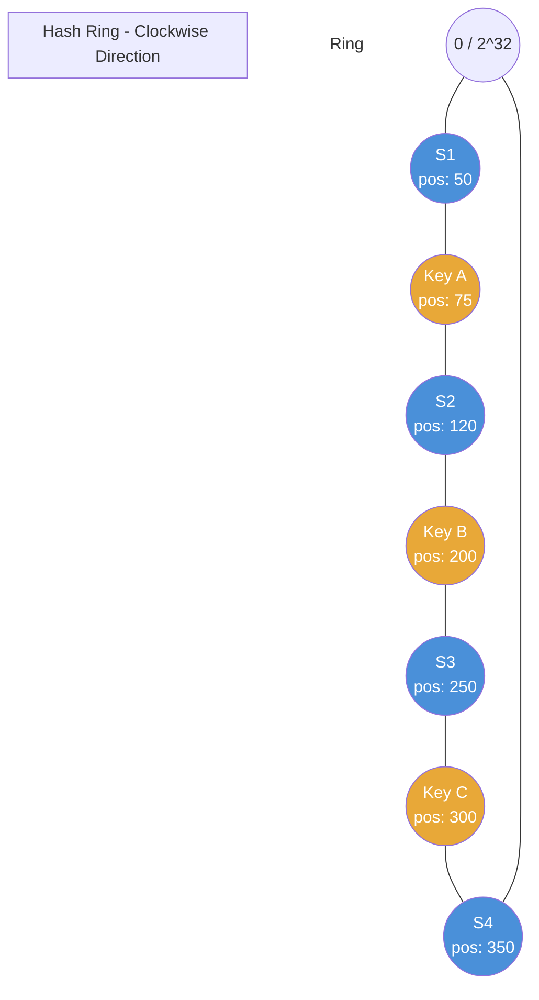
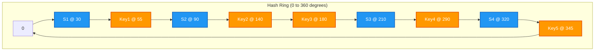
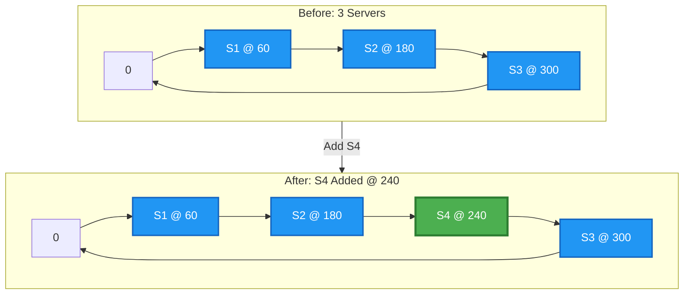
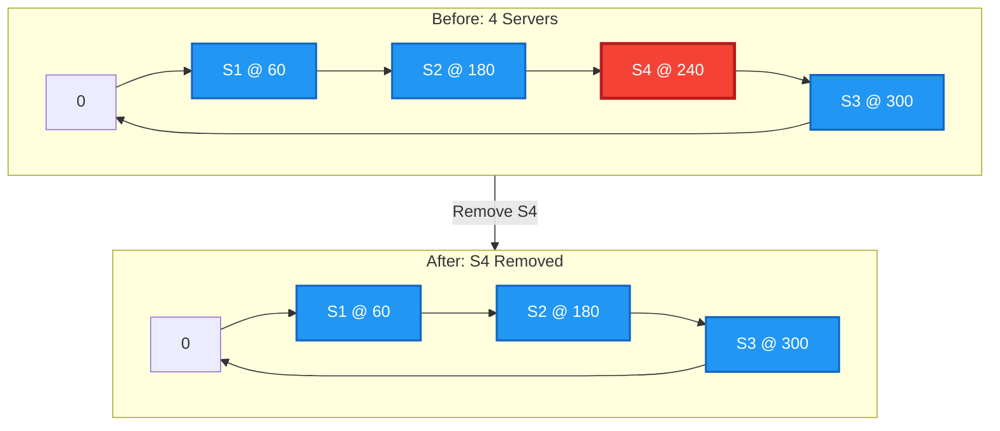
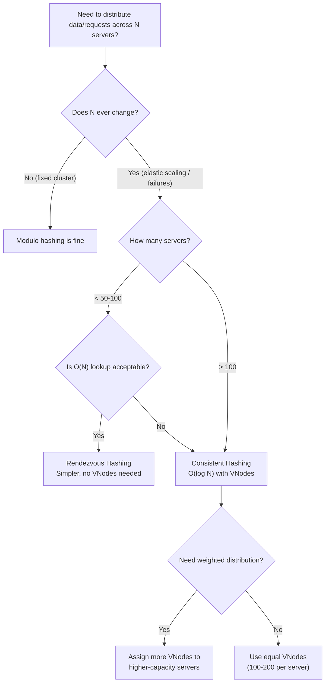

# Consistent Hashing

## Table of Contents

1. [The Problem with Simple Hashing](#1-the-problem-with-simple-hashing)
2. [How Consistent Hashing Works](#2-how-consistent-hashing-works)
3. [Virtual Nodes (VNodes)](#3-virtual-nodes-vnodes)
4. [Adding and Removing Nodes](#4-adding-and-removing-nodes)
5. [Real-World Usage](#5-real-world-usage)
6. [Implementation](#6-implementation)
7. [Consistent Hashing vs Rendezvous Hashing](#7-consistent-hashing-vs-rendezvous-hashing)
8. [Quick Reference Summary](#8-quick-reference-summary)

---

## 1. The Problem with Simple Hashing

### Modulo-Based Hashing

The most straightforward way to distribute data across `N` servers is modulo hashing:

```
server = hash(key) % N
```

This works well **as long as N never changes**. Every key deterministically maps to exactly one server, and lookups are O(1).

### What Happens When N Changes

Suppose you have **4 cache servers** and these keys:

| Key       | hash(key) | hash(key) % 4 | Server |
|-----------|-----------|----------------|--------|
| "user:1"  | 17        | 1              | S1     |
| "user:2"  | 42        | 2              | S2     |
| "user:3"  | 63        | 3              | S3     |
| "user:4"  | 80        | 0              | S0     |
| "user:5"  | 95        | 3              | S3     |
| "user:6"  | 29        | 1              | S1     |
| "user:7"  | 54        | 2              | S2     |
| "user:8"  | 11        | 3              | S3     |

Now you **add one server** (N goes from 4 to 5):

| Key       | hash(key) | hash(key) % 5 | Server | Changed? |
|-----------|-----------|----------------|--------|----------|
| "user:1"  | 17        | 2              | S2     | YES      |
| "user:2"  | 42        | 2              | S2     | NO       |
| "user:3"  | 63        | 3              | S3     | NO       |
| "user:4"  | 80        | 0              | S0     | NO       |
| "user:5"  | 95        | 0              | S0     | YES      |
| "user:6"  | 29        | 4              | S4     | YES      |
| "user:7"  | 54        | 4              | S4     | YES      |
| "user:8"  | 11        | 1              | S1     | YES      |

**5 out of 8 keys (62.5%) moved to a different server.**

### The Mathematical Reality

When you change from N to N+1 servers with modulo hashing, on average:

```
Fraction of keys that move = (N) / (N + 1)
```

For typical scenarios:
- 4 -> 5 servers: ~80% of keys move
- 10 -> 11 servers: ~91% of keys move
- 100 -> 101 servers: ~99% of keys move

This is catastrophic for caching systems. When a cache server goes down or you scale up, nearly **every cached entry becomes a miss**, causing a **thundering herd** to the database layer.

### Why This Matters in Production

- **Cache stampede**: All clients simultaneously hit the backing store
- **Database overload**: Sudden spike in queries can bring down the DB
- **Latency spike**: P99 latency explodes while caches warm up
- **Cascading failure**: Overloaded DB causes timeouts, which cause retries, which cause more load

This is exactly the problem consistent hashing was designed to solve.

---

## 2. How Consistent Hashing Works

Consistent hashing was introduced by Karger et al. in 1997 (originally for distributed caching in the web). The core idea: instead of `hash(key) % N`, place everything on a **ring** (circular hash space) and find the nearest server by walking clockwise.

### The Hash Ring Concept

Imagine a circle representing the full output range of your hash function (e.g., 0 to 2^32 - 1 for a 32-bit hash). The "ends" connect: after the maximum value, you wrap back to 0.

**Step 1**: Hash each server identifier onto the ring.

```
position_of_server = hash(server_id) % 2^32
```

**Step 2**: Hash each key onto the same ring.

```
position_of_key = hash(key) % 2^32
```

**Step 3**: For each key, walk **clockwise** around the ring until you hit a server. That server owns the key.

### Hash Ring Diagram



```
Ring visualization (linearized for clarity):

0 ----[S1:50]----(KeyA:75)----[S2:120]----(KeyB:200)----[S3:250]----(KeyC:300)----[S4:350]---- 2^32 (wraps to 0)

Assignments:
  Key A (pos 75)  -> walks clockwise -> hits S2 (pos 120)  => stored on S2
  Key B (pos 200) -> walks clockwise -> hits S3 (pos 250)  => stored on S3
  Key C (pos 300) -> walks clockwise -> hits S4 (pos 350)  => stored on S4
```

### Detailed Ring Diagram



**Key assignments** (walk clockwise from each key to the next server):

| Key  | Position | Next Server Clockwise | Assigned To |
|------|----------|-----------------------|-------------|
| Key1 | 55       | S2 @ 90               | **S2**      |
| Key2 | 140      | S3 @ 210              | **S3**      |
| Key3 | 180      | S3 @ 210              | **S3**      |
| Key4 | 290      | S4 @ 320              | **S4**      |
| Key5 | 345      | S1 @ 30 (wraps)       | **S1**      |

### Why This Helps

When you add or remove a server, **only the keys between the affected server and its predecessor on the ring need to move**. All other keys remain on their current server. This is the fundamental advantage.

### Properties of Consistent Hashing

| Property               | Value                                                    |
|------------------------|----------------------------------------------------------|
| Keys moved on change   | ~K/N (K = total keys, N = total servers)                 |
| Lookup complexity       | O(log N) with sorted structure                          |
| Space complexity        | O(N) for server positions                               |
| Balance (basic)         | Poor with few nodes, good with virtual nodes            |
| Monotonicity            | Yes -- adding a node only causes keys to move TO the new node |

---

## 3. Virtual Nodes (VNodes)

### The Problem with Basic Consistent Hashing

With only a few physical servers, the distribution of keys is likely to be **very uneven**. Consider 3 servers placed on a ring:

```
Ring with 3 servers (uneven spacing):

0 ------[S1: 30]---------------------------------------------------[S2: 250]------[S3: 280]------ 360
         |<---- S2 owns this huge arc (220 units) ---->|            |<-- S3 (30) -->|<- S1 (110) ->|

S2 is responsible for ~61% of the key space
S3 is responsible for ~8% of the key space
S1 is responsible for ~31% of the key space
```

This is a **hotspot problem**. One server gets dramatically more traffic than others, defeating the purpose of distributing load.

### How Virtual Nodes Solve This

Instead of mapping each physical server to **one** position on the ring, we map it to **many** positions (virtual nodes). Each physical server gets multiple "tokens" spread around the ring.

```
Physical Server S1 -> Virtual Nodes: S1_v0, S1_v1, S1_v2, S1_v3, ...
Physical Server S2 -> Virtual Nodes: S2_v0, S2_v1, S2_v2, S2_v3, ...
Physical Server S3 -> Virtual Nodes: S3_v0, S3_v1, S3_v2, S3_v3, ...
```

Each virtual node is hashed independently:

```
position = hash(server_id + "_v" + str(i))   for i in range(num_vnodes)
```

### Virtual Nodes on the Ring

```mermaid
flowchart LR
    subgraph ring ["Hash Ring with Virtual Nodes (3 physical servers, 4 vnodes each)"]
        direction LR
        p0["0"] --> v1a["S1_v0 @ 15"]
        v1a --> v2a["S2_v0 @ 45"]
        v2a --> v3a["S3_v0 @ 80"]
        v3a --> v1b["S1_v1 @ 110"]
        v1b --> v2b["S2_v1 @ 150"]
        v2b --> v3b["S3_v1 @ 185"]
        v3b --> v1c["S1_v2 @ 220"]
        v1c --> v2c["S2_v2 @ 260"]
        v2c --> v3c["S3_v2 @ 295"]
        v3c --> v1d["S1_v3 @ 320"]
        v1d --> v2d["S2_v3 @ 340"]
        v2d --> v3d["S3_v3 @ 355"]
        v3d --> p0
    end

    v1a:::s1
    v1b:::s1
    v1c:::s1
    v1d:::s1
    v2a:::s2
    v2b:::s2
    v2c:::s2
    v2d:::s2
    v3a:::s3
    v3b:::s3
    v3c:::s3
    v3d:::s3

    classDef s1 fill:#2196F3,color:white,stroke:#1565C0,stroke-width:2px
    classDef s2 fill:#4CAF50,color:white,stroke:#2E7D32,stroke-width:2px
    classDef s3 fill:#FF5722,color:white,stroke:#BF360C,stroke-width:2px
```



Now the ring has **12 points** (4 virtual nodes per server) instead of 3. The arcs are much more evenly distributed.

### Typical VNode Counts

| System              | VNodes per Physical Node | Notes                                     |
|---------------------|--------------------------|-------------------------------------------|
| Apache Cassandra    | 256 (default, older)     | Newer versions use token-aware allocation |
| Amazon DynamoDB     | ~100-200                 | Varies by partition strategy              |
| Riak                | 64 (default)             | Configurable per ring                     |
| General guideline   | 100-200                  | More VNodes = better balance, more memory |

### Trade-offs of Virtual Nodes

| More VNodes                         | Fewer VNodes                        |
|-------------------------------------|-------------------------------------|
| Better load balance                 | Less memory overhead                |
| Smoother redistribution             | Faster ring membership lookups      |
| Higher memory for ring metadata     | More uneven distribution            |
| More data to replicate on failure   | Simpler failure recovery            |

### Statistical Analysis

With `V` virtual nodes per physical server and `N` physical servers:

```
Total ring points = V * N
Expected load per server = 1/N of total keys
Standard deviation of load ~ O(1 / sqrt(V))
```

With 200 virtual nodes, the load imbalance is typically within **5-10%** of the ideal even split -- far better than the 2-10x imbalance you see with basic consistent hashing.

---

## 4. Adding and Removing Nodes

### Adding a New Node

When a new server joins, it takes responsibility for portions of the ring that were previously owned by other servers. Only the keys in those specific arc segments need to move.

**Before adding S4** (3 servers, simplified ring 0-360):

```
0 -----[S1: 60]-------------------[S2: 180]-------------------[S3: 300]------ 360 (wraps to 0)

S1 owns: (300, 60]    -> 120 units
S2 owns: (60, 180]    -> 120 units
S3 owns: (180, 300]   -> 120 units
```

**After adding S4 at position 240**:

```
0 -----[S1: 60]-------------------[S2: 180]---------[S4: 240]---------[S3: 300]------ 360

S1 owns: (300, 60]    -> 120 units  (unchanged)
S2 owns: (60, 180]    -> 120 units  (unchanged)
S4 owns: (180, 240]   ->  60 units  (taken from S3)
S3 owns: (240, 300]   ->  60 units  (reduced from 120)
```



**Only keys in the range (180, 240] move** from S3 to S4. Every other key stays exactly where it was.

### Removing a Node

When S4 is removed, the reverse happens. Keys that belonged to S4 flow to the next server clockwise (S3), and nothing else moves.



### Quantitative Comparison

| Metric                         | Simple Hash (mod N)           | Consistent Hashing            |
|--------------------------------|-------------------------------|-------------------------------|
| Keys moved when adding 1 node | ~(N-1)/N of all keys (~80-99%)| ~K/N (only affected arc)      |
| Keys moved when removing 1 node| ~(N-1)/N of all keys         | ~K/N (only affected arc)      |
| With 10 servers, adding 1      | ~91% of keys move            | ~9% of keys move              |
| With 100 servers, adding 1     | ~99% of keys move            | ~1% of keys move              |
| Cache miss storm               | Severe                       | Minimal                       |
| Database impact                | Potential cascading failure   | Negligible spike              |

### Step-by-Step Example with Real Keys

**Setup**: 3 servers, 12 keys, ring of size 360.

Servers: S1 @ 60, S2 @ 180, S3 @ 300

| Key   | Hash Position | Assigned Server |
|-------|---------------|-----------------|
| k1    | 10            | S1 (next: 60)   |
| k2    | 35            | S1 (next: 60)   |
| k3    | 70            | S2 (next: 180)  |
| k4    | 100           | S2 (next: 180)  |
| k5    | 130           | S2 (next: 180)  |
| k6    | 170           | S2 (next: 180)  |
| k7    | 190           | S3 (next: 300)  |
| k8    | 210           | S3 (next: 300)  |
| k9    | 230           | S3 (next: 300)  |
| k10   | 260           | S3 (next: 300)  |
| k11   | 310           | S1 (next: 60)   |
| k12   | 340           | S1 (next: 60)   |

**Now add S4 @ 240**:

| Key   | Hash Position | Old Server | New Server | Moved? |
|-------|---------------|------------|------------|--------|
| k1    | 10            | S1         | S1         | No     |
| k2    | 35            | S1         | S1         | No     |
| k3    | 70            | S2         | S2         | No     |
| k4    | 100           | S2         | S2         | No     |
| k5    | 130           | S2         | S2         | No     |
| k6    | 170           | S2         | S2         | No     |
| k7    | 190           | S3         | S4         | **YES**|
| k8    | 210           | S3         | S4         | **YES**|
| k9    | 230           | S3         | S4         | **YES**|
| k10   | 260           | S3         | S3         | No     |
| k11   | 310           | S1         | S1         | No     |
| k12   | 340           | S1         | S1         | No     |

**Result**: Only 3 out of 12 keys (25%) moved, and they all went to the new server S4. Compare this to modulo hashing where ~75% would have moved.

---

## 5. Real-World Usage

### Amazon DynamoDB

DynamoDB uses consistent hashing as the foundation of its partitioning scheme. Each table's data is split across partitions based on the partition key's hash value mapped onto a ring. When partitions split due to throughput or storage growth, consistent hashing ensures minimal data movement.

Key details:
- Partition keys are hashed using a 128-bit hash function
- Partitions split automatically when they exceed 10 GB or provisioned throughput limits
- The ring structure allows DynamoDB to add capacity incrementally

### Apache Cassandra

Cassandra uses consistent hashing for its distributed data placement:
- Each node is assigned a set of token ranges on the ring
- The default partitioner (`Murmur3Partitioner`) uses MurmurHash3 for 64-bit hashes
- Historically used 256 virtual nodes per physical node; newer versions support token-aware allocation with fewer tokens
- The ring topology is gossip-propagated so all nodes know the full ring layout

### Memcached (Client-Side)

Memcached itself has no built-in distribution -- the clients implement consistent hashing:
- `libmemcached` (C library) implements Ketama consistent hashing
- The Ketama algorithm was created by Last.fm to solve cache redistribution problems
- Each server gets 100-200 points on a continuum based on MD5 hashes of `server_ip:port-index`

### Load Balancers

Consistent hashing is used in load balancers for session affinity:
- **Nginx**: `upstream` directive with `hash` and `consistent` option
- **HAProxy**: `balance source` with `hash-type consistent`
- **Envoy Proxy**: built-in ring hash load balancer with configurable virtual nodes
- Ensures the same client IP or session token hits the same backend (useful for local caches, WebSocket connections)

### CDN Routing

Content Delivery Networks use consistent hashing to:
- Route requests for the same URL to the same edge server (maximizing cache hit rate)
- Handle edge server failures with minimal cache disruption
- Akamai's original consistent hashing paper (Karger et al.) was motivated by this exact use case

### Systems Using Consistent Hashing

| System / Technology       | Role of Consistent Hashing                  | Hash Function       | Virtual Nodes |
|---------------------------|----------------------------------------------|----------------------|---------------|
| Amazon DynamoDB           | Partition data across storage nodes          | MD5 (128-bit)        | Yes           |
| Apache Cassandra          | Token-based data placement                   | MurmurHash3 (64-bit) | Yes (256 default) |
| Memcached (Ketama)        | Client-side cache server selection           | MD5                  | Yes (100-200) |
| Riak                      | Ring-based key distribution                  | SHA-1 (160-bit)      | Yes (64 default) |
| Amazon S3                 | Internal data placement (rumored)            | Unknown              | Unknown       |
| Nginx                     | Upstream server selection                    | CRC32 / custom       | Configurable  |
| Envoy Proxy               | Ring hash load balancing                     | xxHash               | Configurable  |
| Akamai CDN                | Edge server request routing                  | Custom               | Yes           |
| Varnish Cache             | Director backend selection                   | SHA-256              | Configurable  |
| Discord                   | Guild (server) to backend mapping            | Custom               | Yes           |

---

## 6. Implementation

### Python Implementation

```python
import hashlib
from bisect import bisect_right, insort

class ConsistentHashRing:
    """
    Consistent hash ring with virtual nodes.

    Usage:
        ring = ConsistentHashRing(num_vnodes=150)
        ring.add_node("server-1")
        ring.add_node("server-2")
        ring.add_node("server-3")

        server = ring.get_node("user:12345")
        # Returns "server-2" (or whichever server owns that key)
    """

    def __init__(self, num_vnodes=150):
        self.num_vnodes = num_vnodes
        self.ring = {}              # hash_value -> node_id
        self.sorted_keys = []       # sorted list of hash values on the ring
        self.nodes = set()          # set of physical node identifiers

    def _hash(self, key: str) -> int:
        """Generate a consistent hash for a given key."""
        digest = hashlib.md5(key.encode("utf-8")).hexdigest()
        return int(digest, 16)

    def add_node(self, node_id: str):
        """Add a physical node with its virtual nodes to the ring."""
        if node_id in self.nodes:
            return
        self.nodes.add(node_id)
        for i in range(self.num_vnodes):
            vnode_key = f"{node_id}:vnode{i}"
            hash_val = self._hash(vnode_key)
            self.ring[hash_val] = node_id
            insort(self.sorted_keys, hash_val)

    def remove_node(self, node_id: str):
        """Remove a physical node and all its virtual nodes from the ring."""
        if node_id not in self.nodes:
            return
        self.nodes.discard(node_id)
        for i in range(self.num_vnodes):
            vnode_key = f"{node_id}:vnode{i}"
            hash_val = self._hash(vnode_key)
            del self.ring[hash_val]
            self.sorted_keys.remove(hash_val)

    def get_node(self, key: str) -> str:
        """Find which node a given key maps to."""
        if not self.ring:
            raise Exception("Hash ring is empty")

        hash_val = self._hash(key)
        # Find the first ring position >= hash_val (clockwise walk)
        idx = bisect_right(self.sorted_keys, hash_val)
        # Wrap around if we've gone past the end
        if idx == len(self.sorted_keys):
            idx = 0
        return self.ring[self.sorted_keys[idx]]

    def get_nodes_for_replication(self, key: str, replicas: int = 3) -> list:
        """
        Get multiple distinct physical nodes for replication.
        Walks clockwise, skipping virtual nodes of already-selected physical nodes.
        """
        if len(self.nodes) < replicas:
            replicas = len(self.nodes)

        hash_val = self._hash(key)
        idx = bisect_right(self.sorted_keys, hash_val)
        result = []
        seen = set()

        for _ in range(len(self.sorted_keys)):
            if idx == len(self.sorted_keys):
                idx = 0
            node_id = self.ring[self.sorted_keys[idx]]
            if node_id not in seen:
                result.append(node_id)
                seen.add(node_id)
                if len(result) == replicas:
                    break
            idx += 1

        return result
```

### Java-Style Pseudocode (using TreeMap)

```java
public class ConsistentHashRing<T> {
    private final int numVnodes;
    private final TreeMap<Long, T> ring = new TreeMap<>();
    private final Set<T> nodes = new HashSet<>();

    public ConsistentHashRing(int numVnodes) {
        this.numVnodes = numVnodes;
    }

    private long hash(String key) {
        // Use MD5, MurmurHash, or xxHash
        byte[] digest = MessageDigest.getInstance("MD5").digest(key.getBytes());
        return ByteBuffer.wrap(digest).getLong();  // Take first 8 bytes as long
    }

    public void addNode(T node) {
        nodes.add(node);
        for (int i = 0; i < numVnodes; i++) {
            long h = hash(node.toString() + ":vnode" + i);
            ring.put(h, node);
        }
    }

    public void removeNode(T node) {
        nodes.remove(node);
        for (int i = 0; i < numVnodes; i++) {
            long h = hash(node.toString() + ":vnode" + i);
            ring.remove(h);
        }
    }

    public T getNode(String key) {
        if (ring.isEmpty()) throw new IllegalStateException("Ring is empty");
        long h = hash(key);
        // ceilingEntry returns the entry with the least key >= h
        Map.Entry<Long, T> entry = ring.ceilingEntry(h);
        // Wrap around: if null, take the first entry (smallest key)
        if (entry == null) {
            entry = ring.firstEntry();
        }
        return entry.getValue();
    }
}
```

### Key Data Structure: Why TreeMap / SortedList?

The "walk clockwise to find the next server" operation is a **ceiling/successor query**:

> Given hash value H, find the smallest ring position >= H.

| Data Structure  | Ceiling Query | Add/Remove Node | Space     |
|-----------------|---------------|-----------------|-----------|
| Sorted Array    | O(log N)      | O(N)            | O(N)      |
| Balanced BST    | O(log N)      | O(log N)        | O(N)      |
| TreeMap (Java)  | O(log N)      | O(log N)        | O(N)      |
| Skip List       | O(log N)      | O(log N)        | O(N)      |
| Hash Table      | O(N) (scan)   | O(1)            | O(N)      |

**TreeMap / Balanced BST** is the standard choice because both lookup and mutation are O(log N). For a ring with 1000 physical nodes and 150 VNodes each, that is 150,000 entries -- `log2(150000) ~ 17` comparisons per lookup.

### Hash Function Considerations

| Hash Function   | Output Size | Speed    | Collision Resistance | Use Case                         |
|-----------------|-------------|----------|----------------------|----------------------------------|
| MD5             | 128 bits    | Moderate | Broken (crypto)      | Fine for consistent hashing (non-crypto) |
| SHA-1           | 160 bits    | Moderate | Weak (crypto)        | Fine for consistent hashing      |
| MurmurHash3     | 32/128 bits | Fast     | Not cryptographic    | Preferred for performance        |
| xxHash          | 32/64 bits  | Very fast| Not cryptographic    | Best throughput for large inputs |
| FNV-1a          | 32/64 bits  | Fast     | Not cryptographic    | Simple, good distribution        |

For consistent hashing, **cryptographic strength is not required**. You need:
1. **Uniform distribution** -- hash values should spread evenly across the output space
2. **Determinism** -- same input always produces same output
3. **Speed** -- hashing happens on every request

MurmurHash3 and xxHash are the most common production choices.

---

## 7. Consistent Hashing vs Rendezvous Hashing

### How Rendezvous (Highest Random Weight) Hashing Works

Rendezvous hashing (HRW hashing), proposed by Thaler and Ravishankar in 1998, takes a completely different approach. Instead of a ring, it computes a score for every server and picks the one with the highest score.

**Algorithm**:

```
function get_server(key, servers):
    best_server = None
    best_score  = -infinity
    for server in servers:
        score = hash(key + server)
        if score > best_score:
            best_score = score
            best_server = server
    return best_server
```

For each key, you hash the *combination* of the key and each server, and pick the server that produces the highest hash. This is sometimes called "highest random weight" because `hash(key + server)` acts as a random weight for that key-server pair.

### Why Rendezvous Hashing Also Achieves Minimal Disruption

When a server is removed, only the keys that were assigned to that server need to move. For those keys, the new assignment is the server with the **second highest** score -- which is the same as the highest score among the remaining servers. No other keys are affected.

This achieves the same O(K/N) redistribution guarantee as consistent hashing.

### Python Example

```python
import hashlib

def rendezvous_hash(key: str, servers: list) -> str:
    """
    Pick the server with the highest hash(key + server) score.
    O(N) per lookup where N = number of servers.
    """
    best_server = None
    best_score = -1
    for server in servers:
        combined = f"{key}:{server}"
        score = int(hashlib.md5(combined.encode()).hexdigest(), 16)
        if score > best_score:
            best_score = score
            best_server = server
    return best_server
```

### Comparison Table

| Property                      | Consistent Hashing          | Rendezvous (HRW) Hashing     |
|-------------------------------|-----------------------------|-------------------------------|
| Lookup time                   | O(log N) with BST           | O(N) -- must check all servers|
| Keys moved on node change     | ~K/N                        | ~K/N                          |
| Memory overhead               | O(N * V) for ring           | O(N) -- just the server list  |
| Virtual nodes needed?         | Yes (for balance)           | No (naturally balanced)       |
| Implementation complexity     | Moderate (ring + BST)       | Simple (loop + hash)          |
| Load balance                  | Good with VNodes            | Naturally uniform             |
| Adding a node                 | O(V * log(NV)) to update ring| O(1) -- just add to list     |
| Weighted nodes                | More VNodes = more weight   | Multiply score by weight      |
| Replication selection         | Walk ring clockwise         | Take top-K scoring servers    |
| Used by                       | DynamoDB, Cassandra, Memcached | GitHub load balancer, some CDNs |

### When to Use Each

**Choose Consistent Hashing when**:
- You have a large number of servers (100+) and need fast O(log N) lookups
- Lookup latency is critical (every microsecond counts)
- The ring structure is already well-understood by your team
- You are building something similar to DynamoDB or Cassandra

**Choose Rendezvous Hashing when**:
- You have a moderate number of servers (< 100) where O(N) lookup is acceptable
- You want simpler implementation with no virtual nodes to manage
- Memory is constrained and you cannot afford ring overhead
- You need naturally perfect balance without tuning VNode counts
- You want straightforward weighted distribution (just multiply scores)

### Lookup Time: Practical Impact

```
Consistent Hashing with 100 servers, 150 VNodes each:
  Ring size = 15,000 entries
  Lookup = ~14 comparisons (log2 15000)

Rendezvous Hashing with 100 servers:
  Lookup = 100 hash computations

At 10 ns per hash comparison and 50 ns per hash computation:
  Consistent: ~140 ns
  Rendezvous: ~5000 ns

At 1000 servers:
  Consistent: ~17 comparisons = ~170 ns
  Rendezvous: 1000 computations = ~50,000 ns
```

For very large clusters, consistent hashing's O(log N) is a clear winner. For small clusters, the difference is negligible and rendezvous hashing's simplicity can be more valuable.

---

## 8. Quick Reference Summary

### One-Paragraph Explanation

Consistent hashing maps both servers and keys onto a circular hash space (ring). Each key is assigned to the first server found by walking clockwise from the key's position. When a server is added or removed, only the keys in the affected arc segment need to be reassigned (~K/N keys), unlike modulo hashing where nearly all keys must move. Virtual nodes (multiple ring positions per physical server) ensure even load distribution.

### Consistent Hashing at a Glance

```
+-----------------------------------------------------------------------+
|                     CONSISTENT HASHING CHEAT SHEET                    |
+-----------------------------------------------------------------------+
|                                                                       |
|  PROBLEM:  hash(key) % N breaks when N changes (80-99% keys move)    |
|                                                                       |
|  SOLUTION: Hash ring -- walk clockwise to find server                 |
|            Only K/N keys move on topology change                      |
|                                                                       |
|  VIRTUAL NODES: 100-200 per server for even distribution              |
|                                                                       |
|  LOOKUP: O(log N) using TreeMap / sorted structure                    |
|                                                                       |
|  USED BY: DynamoDB, Cassandra, Memcached, CDNs, Load Balancers       |
|                                                                       |
|  ALTERNATIVE: Rendezvous hashing (O(N) lookup, no ring needed)        |
|                                                                       |
+-----------------------------------------------------------------------+
```

### Key Numbers for Interviews

| What                                    | Number / Formula         |
|-----------------------------------------|--------------------------|
| Keys moved with modulo hash (add 1 node)| ~(N-1)/N of all keys    |
| Keys moved with consistent hash         | ~K/N                     |
| Virtual nodes per physical node          | 100-200 (typical)       |
| Lookup complexity (consistent hash)      | O(log N)                |
| Lookup complexity (rendezvous hash)      | O(N)                    |
| Space for ring (with VNodes)             | O(N * V)                |
| Cassandra default VNodes                 | 256                     |

### Common Interview Questions

**Q: Why not just use modulo hashing?**
A: When the number of servers changes, modulo hashing redistributes nearly all keys (80-99%), causing cache stampedes and potential cascading failures.

**Q: How does consistent hashing minimize redistribution?**
A: By mapping servers and keys to a ring, only keys in the arc between the changed server and its predecessor need to move -- approximately K/N keys.

**Q: What is the purpose of virtual nodes?**
A: With few physical servers, the ring positions are unevenly spaced, causing load imbalance. Virtual nodes (100-200 per server) spread each server across many ring positions, ensuring even distribution.

**Q: How do you handle replication with consistent hashing?**
A: Walk clockwise from the key's position and assign it to the next N *distinct physical* servers (skipping virtual nodes of the same physical server). This is how Cassandra and DynamoDB handle replication.

**Q: What happens when a server fails?**
A: The failed server's keys are automatically served by the next server clockwise. Only ~K/N keys need to be re-routed. If you use replication, the data is already available on replica nodes.

**Q: How does weighted consistent hashing work?**
A: Assign more virtual nodes to servers with more capacity. A server with 2x the resources gets 2x the virtual nodes, and therefore owns approximately 2x the arc length on the ring.

### Decision Flowchart


