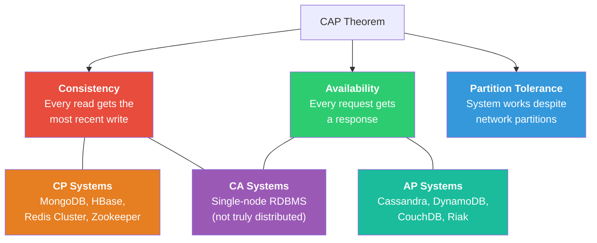
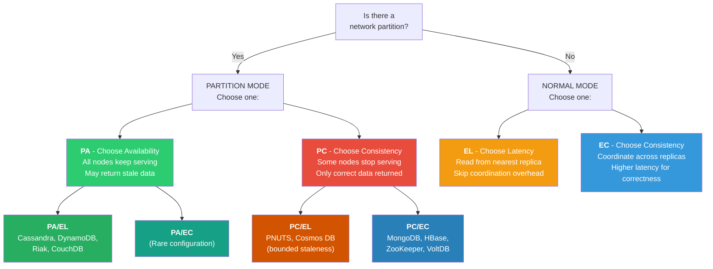
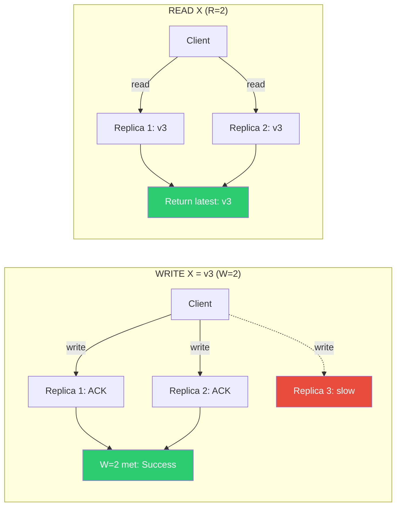

# CAP Theorem - Comprehensive Guide for System Design Interviews

---

## Table of Contents

1. [CAP Theorem Explained](#1-cap-theorem-explained)
2. [CP vs AP Systems](#2-cp-vs-ap-systems)
3. [PACELC Theorem](#3-pacelc-theorem)
4. [Consistency Models](#4-consistency-models)
5. [Quorum Consensus](#5-quorum-consensus)
6. [Real-World Trade-offs](#6-real-world-trade-offs)
7. [Quick Reference Summary](#7-quick-reference-summary)

---

## 1. CAP Theorem Explained

The CAP Theorem, introduced by Eric Brewer in 2000 and formally proven by Seth Gilbert and Nancy Lynch
in 2002, states that a distributed data store can only simultaneously provide **two out of three** of
the following guarantees:

### 1.1 Consistency (C)

Every read receives the **most recent write** or an error. All nodes in the system see the same data
at the same time. When a write completes successfully, all subsequent reads (from any node) must
reflect that write.

**Key characteristics:**
- Linearizability: operations appear to execute atomically in some sequential order
- All clients see the same view of data at any point in time
- After a write returns success, every reader sees the updated value
- If a write has not completed, no reader sees partial results

**Example:** In a banking system, after transferring $100 from Account A to Account B, any query
to either account must reflect the updated balance. There is no moment where the money "disappears"
or "duplicates."

### 1.2 Availability (A)

Every request (read or write) received by a **non-failing node** must result in a response. The
system remains operational and responsive 100% of the time. No request is allowed to hang
indefinitely or return an error due to the system being unavailable.

**Key characteristics:**
- Every request gets a (non-error) response, regardless of the state of any individual node
- No timeout-based failures from the client's perspective
- The system can process both reads and writes at all times
- Even if some nodes are down, remaining nodes still respond

**Example:** A social media feed should always return posts to the user, even if some backend
servers are unreachable. Returning slightly stale posts is acceptable; returning nothing is not.

### 1.3 Partition Tolerance (P)

The system continues to operate despite an **arbitrary number of messages being dropped or delayed**
by the network between nodes. Network partitions are inevitable in distributed systems (cables get
cut, switches fail, cloud availability zones lose connectivity).

**Key characteristics:**
- The system functions even when network communication between nodes is unreliable
- Nodes can be split into groups that cannot communicate with each other
- The system must handle message loss, message delay, and network splits
- No set of failures less than total network failure causes the system to respond incorrectly

**Example:** If a database cluster spans two data centers and the link between them goes down,
partition tolerance means the system still processes requests rather than shutting down entirely.

### 1.4 Why You Can Only Guarantee 2 of 3

In any distributed system, **network partitions will happen**. This is not a theoretical concern;
it is an operational reality. Therefore, Partition Tolerance is not truly optional. The real choice
becomes: **when a partition occurs, do you sacrifice Consistency or Availability?**

**Proof by contradiction:**

1. Assume a system guarantees all three: C, A, and P.
2. A network partition occurs, splitting nodes into Group X and Group Y.
3. A client writes value V1 to a node in Group X.
4. Another client reads from a node in Group Y.
5. For **Consistency**: Group Y must return V1, but it cannot communicate with Group X (partition).
6. For **Availability**: Group Y must return *something* (not an error).
7. Group Y can only return the old value (violating C) or block/error (violating A).
8. Contradiction: C and A cannot both hold during a partition.

Therefore, during a partition, you must choose either:
- **CP**: Refuse to respond (sacrifice Availability) to maintain Consistency
- **AP**: Respond with potentially stale data (sacrifice Consistency) to maintain Availability



### 1.5 Important Nuances

**CAP is not all-or-nothing.** Real systems make nuanced trade-offs:

- The theorem applies **per operation**, not to the entire system. A system can be CP for writes
  and AP for reads.
- CAP is relevant **only during a partition**. When the network is healthy, a system can provide
  all three guarantees.
- "Consistency" in CAP means **linearizability** (strong consistency), not the "C" in ACID
  (which refers to database integrity constraints).
- Most modern systems allow you to **tune** the consistency/availability trade-off per request
  (e.g., Cassandra's consistency levels).

---

## 2. CP vs AP Systems

### 2.1 CP Systems (Consistency + Partition Tolerance)

When a network partition occurs, CP systems **sacrifice availability** to ensure consistency. Nodes
that cannot confirm they have the latest data will refuse to serve requests (return errors or
timeouts) rather than risk returning stale data.

#### MongoDB (CP)
- Single primary for writes; minority partition's primary steps down during a split
- New primary elected in majority partition; writes unavailable during election (10-30s)

#### HBase (CP)
- Single RegionServer per region; ZooKeeper for coordination
- Regions unavailable during failover until reassigned (seconds to minutes)

#### Redis Cluster (CP by default)
- Hash slots across masters; minority partition nodes become unavailable
- `CLUSTER-REQUIRE-FULL-COVERAGE`: entire cluster stops writes if any slot uncovered

#### ZooKeeper (CP)
- ZAB consensus; requires quorum (majority) for writes
- Minority partition is completely unavailable; guarantees linearizable writes

### 2.2 AP Systems (Availability + Partition Tolerance)

When a network partition occurs, AP systems **sacrifice consistency** to remain available. Every
node continues to accept reads and writes, even if it cannot communicate with other nodes. Data
is reconciled after the partition heals.

#### Cassandra (AP)
- Peer-to-peer; every node accepts reads/writes; tunable CL (`ONE`, `QUORUM`, `ALL`)
- Last-write-wins conflict resolution; anti-entropy via read repair, Merkle trees, hinted handoff

#### DynamoDB (AP)
- Managed multi-region DB; eventually consistent reads (default) or strongly consistent reads
- Global tables replicate across regions with eventual consistency; last-writer-wins resolution

#### CouchDB (AP)
- Multi-master replication with MVCC conflict detection; designed for offline-first apps
- Conflicts stored and resolved by application logic

### 2.3 CA Systems (Consistency + Availability)

A CA system provides both consistency and availability but **cannot tolerate network partitions**.
In practice, this means it must be a **single-node system** or a system on a network that is
guaranteed never to partition.

#### Single-Node RDBMS (e.g., standalone PostgreSQL, MySQL)

- A single-node database trivially provides C and A: there is only one copy of the data,
  and it is always available (as long as the node is up)
- No network partition is possible because there is only one node
- Trade-off: no fault tolerance; if the node dies, the system is completely unavailable

**Why CA does not exist in distributed systems:** In any multi-node system, partitions **will**
happen. You cannot opt out of P. CA is only meaningful for single-node or shared-memory systems.

### 2.4 Comparison Table

| Property | CP Systems | AP Systems | CA Systems |
|---|---|---|---|
| **During partition** | Some nodes stop serving | All nodes keep serving | N/A (no partitions) |
| **Consistency** | Strong (linearizable) | Eventual (or tunable) | Strong |
| **Availability** | Partial (majority only) | Full (all nodes) | Full (single node) |
| **Write path** | Requires leader/quorum | Any node can accept | Single node |
| **Conflict resolution** | Prevention (consensus) | Detection (reconcile) | N/A |
| **Typical latency** | Higher (coordination) | Lower (no coordination) | Lowest (local) |
| **Examples** | MongoDB, HBase, ZK | Cassandra, Dynamo, Couch | Standalone PostgreSQL |
| **Best for** | Financial, inventory | Social, analytics, IoT | Small-scale apps |

### 2.5 Detailed System Classification

| System | Category | Consistency Model | Partition Behavior | Notes |
|---|---|---|---|---|
| MongoDB | CP | Strong (default) | Minority partition unavailable | Tunable via read preference |
| HBase | CP | Strong | Region unavailable during failover | ZooKeeper coordinated |
| Redis Cluster | CP | Strong | Minority partition unavailable | Configurable coverage |
| ZooKeeper | CP | Linearizable writes | Minority partition unavailable | Used as coordination service |
| etcd | CP | Linearizable | Minority partition unavailable | Raft consensus |
| Consul | CP | Linearizable | Minority partition unavailable | Raft consensus |
| Cassandra | AP | Tunable | All nodes keep serving | CL=ONE is AP, CL=QUORUM approaches CP |
| DynamoDB | AP | Eventual (default) | All regions keep serving | Strongly consistent reads optional |
| CouchDB | AP | Eventual | All nodes keep serving | Conflict detection via MVCC |
| Riak | AP | Eventual | All nodes keep serving | Vector clocks for versioning |
| Voldemort | AP | Eventual | All nodes keep serving | Based on Dynamo paper |
| PostgreSQL (single) | CA | Strong | N/A | Not distributed |
| MySQL (single) | CA | Strong | N/A | Not distributed |

---

## 3. PACELC Theorem

### 3.1 Overview

The PACELC theorem, proposed by Daniel Abadi in 2012, extends CAP to address system behavior
**when there is no partition** (the common case). CAP only describes what happens during a
partition, but systems make trade-offs all the time, even when the network is healthy.

**PACELC states:**

> If there is a **P**artition, choose between **A**vailability and **C**onsistency;
> **E**lse (normal operation), choose between **L**atency and **C**onsistency.

This is significant because even without partitions, achieving strong consistency requires
**coordination** between nodes (e.g., synchronous replication, distributed locks), which adds
**latency**. Systems that relax consistency during normal operation can achieve lower latency.

### 3.2 The Four PACELC Categories

#### PA/EL (Partition: Availability, Else: Latency)
Sacrifice consistency in both scenarios. Available during partitions; low-latency reads from
nearest replica during normal operation.
- Examples: Cassandra (CL=ONE), DynamoDB (eventual reads), Riak

#### PC/EC (Partition: Consistency, Else: Consistency)
Prioritize correctness at all times. Unavailable during partitions; coordinated reads during
normal operation.
- Examples: MongoDB (default), HBase, ZooKeeper, VoltDB

#### PA/EC (Partition: Availability, Else: Consistency)
Available during partitions but strongly consistent during normal operation. Unusual; requires
configuration (e.g., MongoDB with majority write concern + secondary reads during partition).

#### PC/EL (Partition: Consistency, Else: Latency)
Consistent during partitions; optimize for low latency during normal operation via local reads.
- Examples: PNUTS (Yahoo, per-record mastering), Cosmos DB (bounded staleness)

### 3.3 PACELC Decision Tree



### 3.4 PACELC Classification Table

| System | P → A or C | E → L or C | PACELC | Reasoning |
|---|---|---|---|---|
| DynamoDB | PA | EL | PA/EL | Eventual reads default; replicate async |
| Cassandra (CL=ONE) | PA | EL | PA/EL | Any node serves; closest replica reads |
| Riak | PA | EL | PA/EL | Dynamo-style; vector clocks for reconciliation |
| CouchDB | PA | EL | PA/EL | Multi-master; async replication |
| MongoDB (default) | PC | EC | PC/EC | Primary reads/writes; quorum elections |
| HBase | PC | EC | PC/EC | Single RegionServer; ZK coordination |
| ZooKeeper | PC | EC | PC/EC | Quorum writes; linearizable reads |
| VoltDB | PC | EC | PC/EC | Synchronous replication; ACID |
| etcd | PC | EC | PC/EC | Raft consensus for all operations |
| PNUTS | PC | EL | PC/EL | Per-record master; local reads |
| Cosmos DB (strong) | PC | EC | PC/EC | Strong consistency across regions |
| Cosmos DB (eventual) | PA | EL | PA/EL | Eventual consistency, low latency |

### 3.5 Why PACELC Matters More Than CAP

1. **CAP only describes failure mode**: Partitions are rare. PACELC covers the 99.99%+ normal case.
2. **Latency is a practical concern**: Consistency trade-offs during normal operation directly
   impact user experience on every request.
3. **Better classification**: CAP groups Cassandra and DynamoDB together (AP). PACELC differentiates
   their normal-operation behavior.
4. **Design guidance**: Choose systems based on full requirements, not just failure-mode behavior.

---

## 4. Consistency Models

Consistency models define the **contract** between a distributed data store and its clients
regarding what values reads can return after writes. They form a spectrum from strongest (most
intuitive, highest cost) to weakest (least intuitive, lowest cost).

### 4.1 Strong Consistency (Linearizability)

**Definition:** Every read returns the value of the most recent completed write. All operations
appear to execute atomically and in real-time order. If operation A completes before operation B
begins, then B sees A's effects.

**How it works:**
- All writes must be acknowledged by a quorum (or all replicas) before returning success
- All reads must check with a quorum (or the leader) to ensure they have the latest value
- Uses consensus protocols (Paxos, Raft, ZAB) or synchronous replication

**Guarantees:**
- Total order of all operations
- Real-time ordering: if A finishes before B starts, B sees A
- No stale reads ever

**Cost:**
- Higher latency (must coordinate on every operation)
- Lower throughput (bottleneck on consensus leader)
- Reduced availability during partitions

**Use cases:**
- Financial transactions (account balances, transfers)
- Inventory management (stock counts)
- Leader election / distributed locking
- Configuration management

**Systems:** ZooKeeper, etcd, Spanner, CockroachDB, single-node RDBMS

### 4.2 Eventual Consistency

**Definition:** If no new writes are made, eventually all reads will return the last written value.
The system guarantees that replicas will **converge** to the same state, but provides no bound
on when this convergence happens.

**How it works:**
- Writes are accepted by any node and propagated asynchronously to other replicas
- Reads may return stale values if the local replica has not yet received the latest write
- Background processes (anti-entropy, gossip protocols) propagate updates

**Guarantees:**
- All replicas will eventually converge (given no new writes and sufficient time)
- No guarantee on the staleness window

**Cost:**
- Lowest latency (no coordination required)
- Highest throughput and availability
- Application must handle stale reads and conflicts

**Use cases:**
- DNS propagation
- Social media feeds (likes, comments counts)
- Shopping cart (merge on checkout)
- Analytics counters
- Caching layers

**Systems:** Cassandra (CL=ONE), DynamoDB (default reads), CouchDB, DNS

### 4.3 Causal Consistency

**Definition:** Operations that are **causally related** are seen by all nodes in the same order.
Concurrent operations (no causal relationship) may be seen in different orders by different nodes.

**How it works:**
- The system tracks causal dependencies between operations (often via vector clocks or
  Lamport timestamps)
- Before a node can apply an operation, all of its causal predecessors must have been applied
- Concurrent (causally independent) operations can be applied in any order

**Guarantees:**
- If operation A causally precedes B (A happened-before B), every node sees A before B
- Respects the "happens-before" relation from Lamport's logical clocks
- Stronger than eventual consistency but weaker than strong consistency

**Example:** User A posts "Going to the park." User B replies "Sounds fun!" Causal consistency
ensures every reader who sees the reply also sees the original post.

**Use cases:**
- Social media comment threads
- Collaborative editing
- Chat applications
- Any system where "reply" or "reference" relationships exist

**Systems:** MongoDB (causal sessions), COPS, Eiger

### 4.4 Read-Your-Writes Consistency (Session Consistency)

**Definition:** A process that has written a value will always see that value (or a more recent
one) in subsequent reads. Other processes may still see stale values.

**How it works:**
- The system tracks which writes a client has performed (via session tokens or timestamps)
- When the client reads, the system ensures the read reflects at least all of the client's
  own writes
- Implementation: sticky sessions (route to same replica) or read-after-write tokens

**Guarantees:**
- A client always sees its own writes
- No guarantee about seeing other clients' writes in real-time
- Prevents the confusing scenario where you update your profile and then see the old version

**Example:**
- You update your display name from "John" to "Johnny"
- Immediately after, you refresh your profile page
- Read-your-writes guarantees you see "Johnny," not "John"
- Other users may still see "John" temporarily

**Use cases:**
- User profile updates
- Form submissions (seeing your submitted data)
- Configuration changes
- Any user-facing write operation where the writer expects immediate confirmation

**Systems:** DynamoDB (with consistent read on same partition), Cassandra (with LOCAL_QUORUM)

### 4.5 Monotonic Reads

**Definition:** If a process reads a value V at time T, it will never see a value older than V
in any subsequent read. Reads never "go back in time."

**How it works:**
- The system tracks the version/timestamp of the last value each client has read
- Subsequent reads are served from a replica that is at least as up-to-date
- Implementation: sticky sessions, version vectors, or read timestamps

**Guarantees:**
- Reads by a single process are non-decreasing in freshness
- Prevents the "time travel" anomaly where a client sees newer data then older data
- Does NOT guarantee you see the latest write, only that you do not go backward

**Example:** Without monotonic reads, Replica A returns $100 (fresh), then Replica B returns $50
(stale). User sees balance decrease. With monotonic reads, after seeing $100, all subsequent
reads return >= $100.

**Use cases:**
- Any user-facing read pattern where seeing stale data after fresh data is confusing
- Dashboards and monitoring
- News feeds

**Systems:** Can be layered on top of eventually consistent systems via session management

### 4.6 Consistency Models Comparison Table

| Model | Guarantee | Latency | Availability | Coordination Required |
|---|---|---|---|---|
| **Strong (Linearizable)** | Always latest write | Highest | Lowest | Every read & write |
| **Sequential** | Total order agreed upon | High | Low | Writes coordinated |
| **Causal** | Causal order preserved | Medium | Medium | Dependency tracking |
| **Read-Your-Writes** | See own writes | Low-Medium | High | Session tracking |
| **Monotonic Reads** | Never go backward | Low | High | Version tracking |
| **Bounded Staleness** | Max K stale | Low-Medium | High | Timestamp tracking |
| **Eventual** | Will converge someday | Lowest | Highest | None |

### 4.7 Consistency Spectrum Diagram

```mermaid
graph LR
    Strong["<b>Strong</b><br/>(Linearizable)<br/>ZooKeeper, Spanner"]
    Sequential["<b>Sequential</b><br/>Total order but<br/>not real-time"]
    Causal["<b>Causal</b><br/>Preserves<br/>cause-effect"]
    RYW["<b>Read-Your-<br/>Writes</b><br/>See own writes"]
    Monotonic["<b>Monotonic<br/>Reads</b><br/>Never go backward"]
    Bounded["<b>Bounded<br/>Staleness</b><br/>Max K stale"]
    Eventual["<b>Eventual</b><br/>Converges<br/>eventually"]

    Strong --> Sequential --> Causal --> RYW --> Monotonic --> Bounded --> Eventual

    style Strong fill:#c0392b,color:#fff
    style Sequential fill:#d35400,color:#fff
    style Causal fill:#e67e22,color:#fff
    style RYW fill:#f39c12,color:#fff
    style Monotonic fill:#27ae60,color:#fff
    style Bounded fill:#2980b9,color:#fff
    style Eventual fill:#8e44ad,color:#fff
```



**Direction: left = stronger (more guarantees, higher cost) | right = weaker (fewer guarantees,
lower cost)**

---

## 5. Quorum Consensus

Quorum consensus is the most common mechanism used by distributed systems to balance consistency
and availability. It defines how many nodes must participate in a read or write for the operation
to be considered successful.

### 5.1 Core Concepts

**Parameters:**
- **N** = Total number of replicas for a given piece of data
- **W** = Number of replicas that must acknowledge a **write** before it is considered successful
- **R** = Number of replicas that must respond to a **read** before a value is returned

**The Quorum Rule:**

> **W + R > N** guarantees strong consistency

When W + R > N, the set of nodes that acknowledged the write and the set of nodes that participate
in the read must **overlap** by at least one node. That overlapping node has the latest value,
ensuring the read returns the most recent write.

### 5.2 Quorum Read/Write Flow



### 5.3 Common Quorum Configurations

#### Strong Consistency: N=3, W=2, R=2

```
W + R = 4 > N = 3  (overlap of at least 1 node guaranteed)
```

- **Write:** Must be acknowledged by 2 of 3 replicas
- **Read:** Must query 2 of 3 replicas and return the latest
- **Overlap:** At least 1 node participated in both the write and the read
- **Guarantees:** Strong consistency (linearizability with additional mechanisms)
- **Trade-off:** Can tolerate 1 node failure for both reads and writes

**This is the most common configuration.** Used by default in many systems.

#### Eventual Consistency: N=3, W=1, R=1

- W + R = 2 < N = 3 (no overlap guaranteed); may read stale data
- Maximum performance and availability; minimum consistency

#### Read-Heavy: N=3, W=3, R=1

- All replicas must ACK writes (slow writes); any single replica serves reads (fast reads)
- Good for: config data, reference tables. Trade-off: one node failure blocks ALL writes

#### Write-Heavy: N=3, W=1, R=3

- Fast writes (1 ACK); slow reads (must check all replicas)
- Good for: logging, event streaming, write-ahead logs

### 5.5 Quorum Configurations Summary Table

| Config | W + R > N? | Consistency | Write Speed | Read Speed | Fault Tolerance (Write) | Fault Tolerance (Read) |
|---|---|---|---|---|---|---|
| N=3, W=2, R=2 | 4 > 3 Yes | Strong | Medium | Medium | 1 failure | 1 failure |
| N=3, W=3, R=1 | 4 > 3 Yes | Strong | Slow | Fast | 0 failures | 2 failures |
| N=3, W=1, R=3 | 4 > 3 Yes | Strong | Fast | Slow | 2 failures | 0 failures |
| N=3, W=1, R=1 | 2 < 3 No | Eventual | Fast | Fast | 2 failures | 2 failures |
| N=5, W=3, R=3 | 6 > 5 Yes | Strong | Medium | Medium | 2 failures | 2 failures |
| N=5, W=1, R=1 | 2 < 5 No | Eventual | Fast | Fast | 4 failures | 4 failures |

### 5.6 Sloppy Quorum and Hinted Handoff

In a **strict quorum**, W and R must come from the designated N replicas. In a **sloppy quorum**,
if some home replicas are unreachable, the system writes to **other available nodes** temporarily.

**Example:** Key K maps to {A, B, C}. C is down. System writes to D instead. W=2 satisfied (A+D).
When C recovers, D sends data to C (**hinted handoff**) and deletes its copy.

**Trade-off:** Sloppy quorum increases write availability, but W + R > N no longer guarantees
strong consistency since reads only check home replicas (not temporary nodes). Hinted handoff is
best-effort; if D fails before handing off, anti-entropy repair must catch it.

**Systems:** Dynamo, Riak, Cassandra (configurable), Voldemort

### 5.8 Read Repair

Read repair is a mechanism to fix inconsistencies discovered during quorum reads.

**Process:**
1. Client reads from R replicas
2. One replica returns v2 (latest), another returns v1 (stale)
3. The system detects the inconsistency
4. The coordinator sends v2 to the stale replica, bringing it up-to-date
5. Client receives v2

This is a **lazy repair** mechanism that fixes inconsistencies opportunistically during reads.
It helps convergence but does not guarantee all replicas are consistent at all times.

---

## 6. Real-World Trade-offs

### 6.1 Banking and Financial Systems

**Requirement:** Strong consistency is non-negotiable.

**Why:**
- Account balances must be accurate at all times
- Double-spending must be prevented
- Regulatory compliance demands auditability and correctness
- A user transferring $500 must never see the debit without the corresponding credit (or vice versa)

**Architecture choices:**
- CP systems (e.g., Spanner, CockroachDB, single-primary PostgreSQL with synchronous replication)
- Quorum writes with W = majority, R = majority
- Distributed transactions with 2PC or consensus-based commit
- Sacrifice some availability during partitions (block transactions rather than risk inconsistency)

**Real-world example — Google Spanner:** Uses TrueTime (GPS + atomic clocks) for globally
consistent timestamps. Accepts ~10-15ms cross-region latency for external consistency. Used for
AdWords billing where monetary accuracy is critical.

### 6.2 Social Media Platforms

**Requirement:** High availability and low latency; eventual consistency is acceptable.

**Why:**
- Users expect the platform to always be available (downtime = user churn)
- Slightly stale data is acceptable (seeing a like count of 1042 vs 1043 is fine)
- The scale is massive (billions of reads per second); strong consistency would be prohibitively expensive
- Most data is not "critical" in the financial sense

**Architecture choices:**
- AP systems (e.g., Cassandra, DynamoDB) for user feeds, likes, follows
- Caching layers (Redis, Memcached) that are inherently eventually consistent
- Async fan-out for feed generation
- Strong consistency ONLY for critical operations (authentication, payments)

**Real-world example — Twitter/X:** Eventually consistent tweet storage with async fan-out for
timelines. Strong consistency only for auth and DMs. Accepts stale like counts and delayed feed
propagation.

### 6.3 E-Commerce and Inventory Management

**Requirement:** Mixed — strong consistency for inventory counts, eventual consistency for product catalog.

**Why:**
- Overselling is expensive (refunds, customer dissatisfaction, reputation damage)
- Product descriptions, reviews, and images can be eventually consistent
- Cart contents need read-your-writes consistency (user expects to see added items)

**Architecture choices:**
- CP system for inventory (e.g., PostgreSQL with serializable isolation)
- AP system for product catalog (e.g., Elasticsearch, DynamoDB)
- Session consistency for shopping cart
- Distributed transactions only for checkout (inventory decrement + payment)

**Real-world example — Amazon:** DynamoDB (AP) for cart and catalog; strong consistency with
distributed locks for inventory at checkout; session consistency for add-to-cart.

### 6.4 Decision Framework

Use this framework when choosing between consistency models for a system design interview:

| Question | If Yes → | If No → |
|---|---|---|
| Does incorrect data cause financial loss? | Strong consistency | Consider weaker models |
| Is human safety involved? | Strong consistency | Consider weaker models |
| Do users directly compare data across sessions? | At least read-your-writes | Eventual may suffice |
| Is the data frequently read by the same user? | Monotonic reads | Eventual may suffice |
| Does causal ordering matter (replies, comments)? | Causal consistency | Eventual may suffice |
| Is maximum throughput the primary goal? | Eventual consistency | Consider stronger models |
| Can the business tolerate stale data for N seconds? | Bounded staleness | Need stronger model |
| Is the system global (multi-region)? | Accept latency or weaken consistency | Strong consistency easier |

### 6.6 Consistency Requirements by Domain

| Domain | Critical Data | Consistency Needed | Non-Critical Data | Consistency Needed |
|---|---|---|---|---|
| **Banking** | Balances, transfers | Strong | Notifications, history | Eventual |
| **E-Commerce** | Inventory, payments | Strong | Reviews, recommendations | Eventual |
| **Social Media** | Auth, DMs | Strong | Feeds, likes, follows | Eventual |
| **Healthcare** | Patient records, meds | Strong | Appointment scheduling | Session |
| **Gaming** | Currency, inventory | Strong | Leaderboards, chat | Eventual |
| **Ride-sharing** | Pricing, assignment | Strong | Driver location, ETA | Eventual |
| **Messaging** | Message delivery | Causal | Read receipts, typing | Eventual |
| **DNS** | Zone records | Eventual (by design) | N/A | N/A |

---

## 7. Quick Reference Summary

### 7.1 CAP Theorem at a Glance

| Concept | Definition |
|---|---|
| **Consistency** | Every read gets the most recent write or an error |
| **Availability** | Every request gets a non-error response |
| **Partition Tolerance** | System operates despite network splits |
| **The Trade-off** | During a partition, choose C (block) or A (serve stale) |
| **In practice** | P is mandatory in distributed systems; real choice is CP vs AP |

### 7.2 Key Formulas

```
Quorum Strong Consistency:   W + R > N
Quorum Eventual Consistency: W + R <= N
Common Configuration:        N=3, W=2, R=2
Max Failures (Write):        N - W
Max Failures (Read):         N - R
Overlap Guarantee:           W + R - N >= 1 (for strong consistency)
```

### 7.3 PACELC Quick Reference

```
PA/EL → Maximize performance (Cassandra, DynamoDB, Riak)
PC/EC → Maximize correctness (MongoDB, HBase, ZooKeeper, Spanner)
PA/EC → Available during partition, consistent otherwise (rare)
PC/EL → Consistent during partition, fast otherwise (PNUTS)
```

### 7.4 System Classification Quick Reference

| System | CAP | PACELC | Consistency Model | Key Mechanism |
|---|---|---|---|---|
| MongoDB | CP | PC/EC | Strong (default) | Single primary + replica set |
| Cassandra | AP | PA/EL | Tunable | Gossip + tunable CL |
| DynamoDB | AP | PA/EL | Eventual (default) | Consistent hashing + vector clocks |
| HBase | CP | PC/EC | Strong | RegionServer + ZK |
| Redis Cluster | CP | PC/EC | Strong | Hash slots + master-replica |
| ZooKeeper | CP | PC/EC | Linearizable | ZAB consensus |
| etcd | CP | PC/EC | Linearizable | Raft consensus |
| CockroachDB | CP | PC/EC | Serializable | Raft + distributed SQL |
| Spanner | CP | PC/EC | External | Paxos + TrueTime |
| CouchDB | AP | PA/EL | Eventual | MVCC + multi-master |
| Riak | AP | PA/EL | Eventual | Dynamo-style + CRDTs |
| Cosmos DB | Tunable | Tunable | 5 levels | Multi-model, multi-API |

### 7.5 Interview Tips

1. **Never say "CA distributed system."** CA only applies to single-node systems. If an
   interviewer asks about CA in a distributed context, explain why it does not exist.

2. **CAP is about partitions, PACELC is about everyday.** When discussing system design,
   use PACELC to explain your normal-operation trade-offs, not just failure scenarios.

3. **Mention tunable consistency.** Many modern systems (Cassandra, DynamoDB, Cosmos DB) let
   you choose consistency per operation. This shows depth of understanding.

4. **Connect to the business requirement.** "We need strong consistency for the payment service
   because financial correctness is non-negotiable, but we can use eventual consistency for the
   product recommendation service where stale data is acceptable."

5. **Know the quorum formula.** W + R > N is one of the most commonly tested formulas in
   system design interviews. Be ready to explain why it guarantees consistency and calculate
   fault tolerance.

6. **Understand that CAP is per-operation.** A single system can have different consistency
   guarantees for different operations. MongoDB with `readPreference: secondary` is AP for
   reads but CP for writes.

7. **Always mention conflict resolution.** When choosing AP systems, explain how conflicts
   are resolved: last-write-wins, vector clocks, CRDTs, or application-level resolution.

### 7.6 Common Interview Questions

**Q: Can a distributed system be CA?**
A: No. Network partitions are inevitable, so P is mandatory. CA only applies to single-node systems.

**Q: Is Cassandra AP or CP?**
A: Tunable. CL=ONE is AP; CL=QUORUM approaches CP behavior.

**Q: How does DynamoDB handle consistency?**
A: Eventually consistent reads (default, AP) or strongly consistent reads (from leader). Global
tables are always eventually consistent across regions.

**Q: What consistency model for a chat app?**
A: Causal consistency for message ordering + read-your-writes so users see their own sent messages.

**Q: How to achieve strong consistency in distributed systems?**
A: Quorum (W + R > N), consensus protocols (Raft/Paxos), or synchronized clocks (Spanner TrueTime).

**Q: CAP consistency vs ACID consistency?**
A: CAP = linearizability (all nodes see same data). ACID = database constraint satisfaction
(foreign keys, unique constraints). Different concepts entirely.
