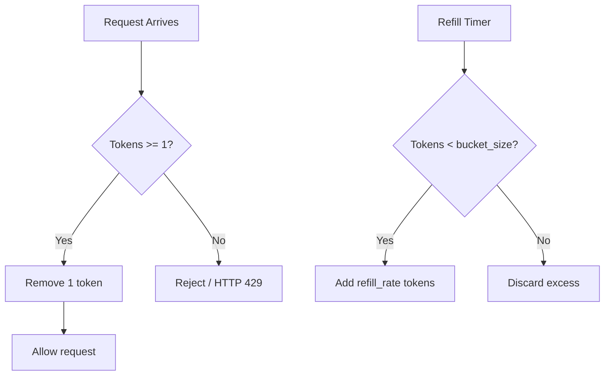
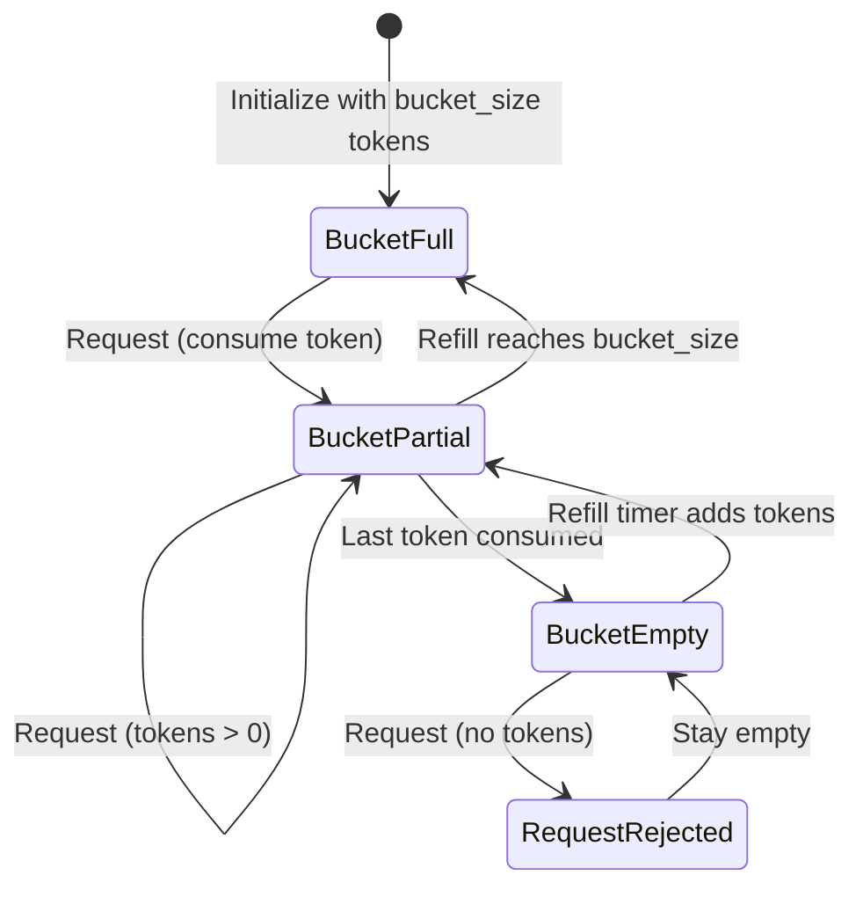
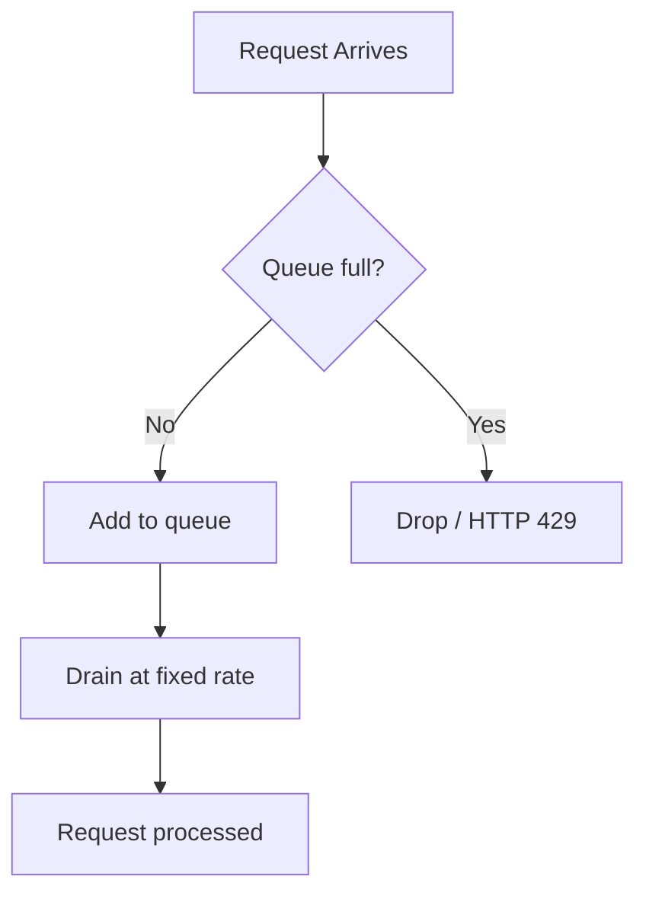
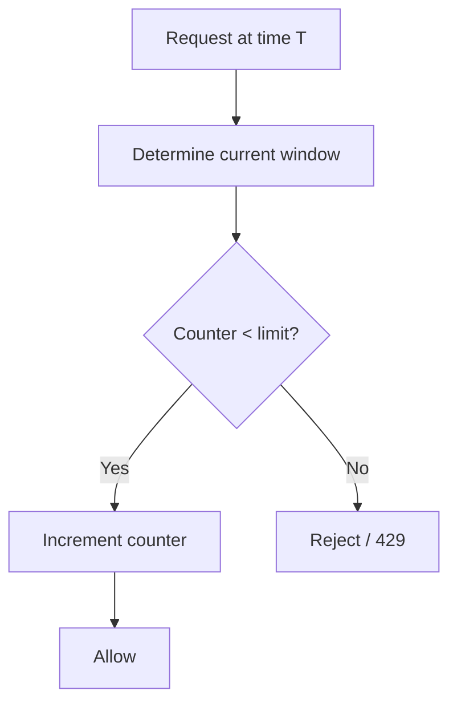
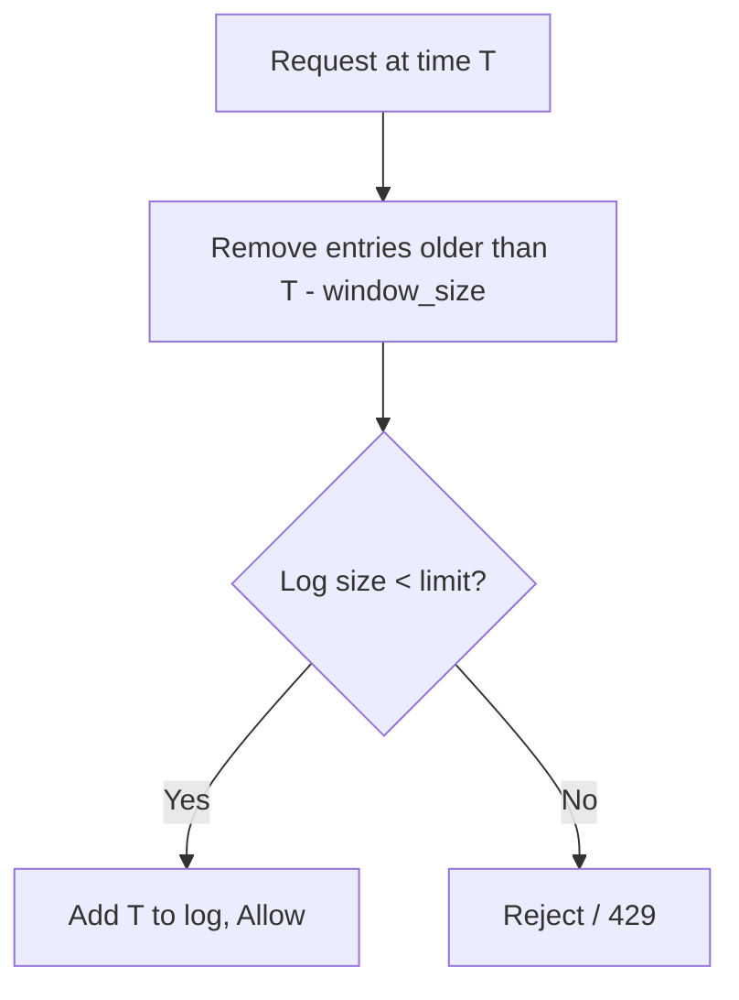
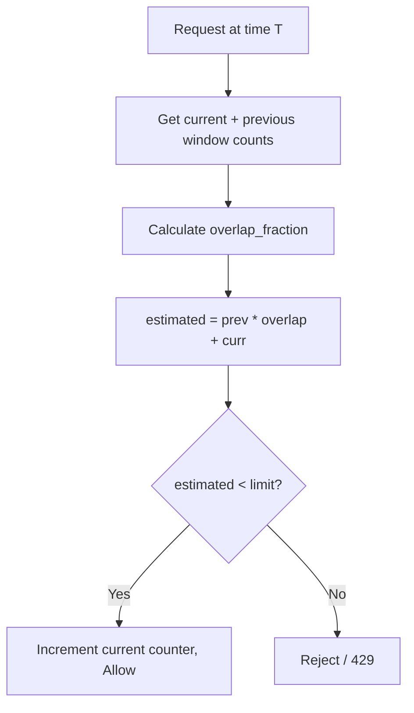
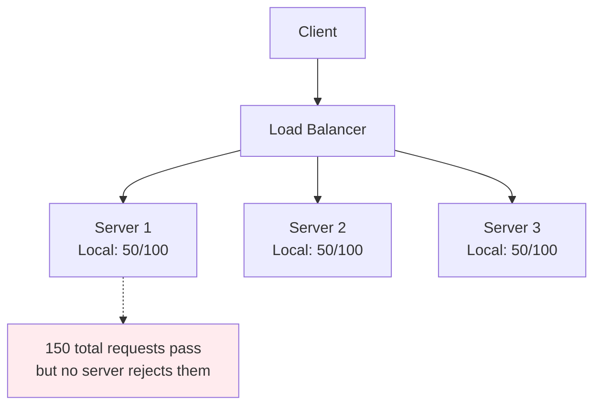
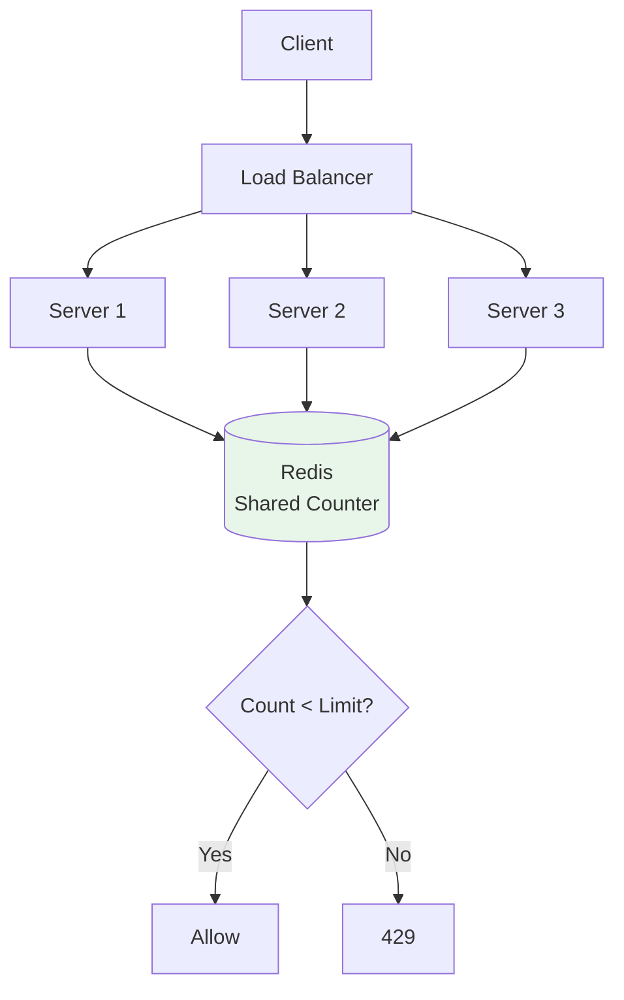

```mermaid
gantt
    title Fixed Window Boundary Burst Problem
    dateFormat HH:mm:ss
    axisFormat %H:%M:%S
    section Window 1
    Idle period           :done, 12:00:00, 50s
    100 requests at end   :crit, 12:00:50, 10s
    section Window 2
    100 requests at start :crit, 12:01:00, 10s
    Idle period           :done, 12:01:10, 50s
```

# Rate Limiting

## Table of Contents

1. [Why Rate Limiting](#1-why-rate-limiting)
2. [Token Bucket Algorithm](#2-token-bucket-algorithm)
3. [Leaky Bucket Algorithm](#3-leaky-bucket-algorithm)
4. [Fixed Window Counter](#4-fixed-window-counter)
5. [Sliding Window Log](#5-sliding-window-log)
6. [Sliding Window Counter](#6-sliding-window-counter)
7. [Algorithm Comparison](#7-algorithm-comparison)
8. [Distributed Rate Limiting](#8-distributed-rate-limiting)
9. [HTTP Rate Limit Headers](#9-http-rate-limit-headers)
10. [Quick Reference Summary](#10-quick-reference-summary)

---

## 1. Why Rate Limiting

Rate limiting controls how many requests a client can make to a service within a given
time period. It is one of the most critical defensive mechanisms in any production system.

### Core Motivations

| Motivation | Description |
|---|---|
| **Prevent Abuse** | Stop DDoS, brute-force login, scraping |
| **Protect Resources** | Keep CPU, memory, DB connections from exhaustion by a single noisy client |
| **Cost Control** | Cloud infra is pay-per-use; runaway traffic = runaway bills |
| **Fair Usage** | No single tenant monopolizes shared resources |
| **Security** | Slow down credential stuffing, API key enumeration |

### Where to Apply

```
                 ┌──────────────────────┐
  Internet ───> │   CDN / Edge          │  Per-IP, geographic
                 ├──────────────────────┤
                 │   API Gateway         │  Per-API-key, per-route
                 ├──────────────────────┤
                 │   Load Balancer       │  Connection-level limits
                 ├──────────────────────┤
                 │   Application Layer   │  Per-user, per-action, business rules
                 ├──────────────────────┤
                 │   Database / Cache    │  Query rate, connection pool limits
                 └──────────────────────┘
```

- **API Gateway (most common):** Centralized enforcement before business logic runs.
- **Application Layer:** Fine-grained rules (free = 100/hr, paid = 10,000/hr).
- **Per-IP:** Protects against unauthenticated abuse; bypassable with proxies.
- **Per-User / Per-API-Key:** Most precise; requires authentication first.
- **Per-Route:** Different limits for `/api/search` (expensive) vs `/api/health` (cheap).

### When the Limit Is Exceeded

1. **Hard reject** -- return HTTP 429 immediately
2. **Throttle** -- queue the request and process later (leaky bucket style)
3. **Degrade** -- serve a cached or lower-quality response
4. **Log and alert** -- allow the request but flag for review

---

## 2. Token Bucket Algorithm

The **most widely used** rate limiting algorithm. AWS, Stripe, and most API gateways
use variants of it.

### How It Works

1. A bucket holds tokens up to a maximum capacity (`bucket_size`).
2. Tokens are added at a constant rate (`refill_rate` tokens/sec).
3. Each request consumes one (or more) tokens.
4. If enough tokens exist, the request is allowed and tokens are removed.
5. If not, the request is rejected.
6. Tokens never exceed `bucket_size` (overflow is discarded).

### Key Parameters

| Parameter | Meaning | Example |
|---|---|---|
| `bucket_size` | Max tokens; determines **burst capacity** | 10 |
| `refill_rate` | Tokens/sec; determines **sustained throughput** | 5/sec |

### Burst Behavior Example

`bucket_size = 10`, `refill_rate = 2/sec`:

```
Time 0s: Bucket full [10 tokens]. Client sends 10 requests instantly. All pass.
Time 1s: 2 tokens refilled. Client can send 2 requests.
Time 2s: 2 more tokens. Sustains at 2 req/sec after the initial burst.
```

### Flow Diagram



### State Diagram



### Implementation

```python
import time

class TokenBucket:
    def __init__(self, bucket_size: int, refill_rate: float):
        self.bucket_size = bucket_size
        self.refill_rate = refill_rate
        self.tokens = bucket_size
        self.last_refill = time.monotonic()

    def _refill(self):
        now = time.monotonic()
        self.tokens = min(self.bucket_size,
                          self.tokens + (now - self.last_refill) * self.refill_rate)
        self.last_refill = now

    def allow_request(self, cost: int = 1) -> bool:
        self._refill()
        if self.tokens >= cost:
            self.tokens -= cost
            return True
        return False
```

**Key interview insight:** The refill does NOT need a background thread. Lazily compute
tokens at each request via `elapsed * refill_rate`. This is the standard production approach.

---

## 3. Leaky Bucket Algorithm

A **FIFO queue with a fixed drain rate**. Water drips out at a constant rate regardless
of how fast you pour it in.

### How It Works

1. Requests enter a queue (the bucket) with a fixed capacity.
2. Requests are drained at a constant rate.
3. If the queue is full, the new request is dropped.
4. Output rate is always constant.

### Flow Diagram



### Conceptual Diagram

```
     Incoming requests (bursty)
          │ │ │ │ │
          ▼ ▼ ▼ ▼ ▼
    ┌─────────────────┐
    │   ○ ○ ○ ○ ○     │  <-- Queue, fixed capacity
    │   ○ ○ ○         │
    └────────┬────────┘
             │  constant drip rate
        ○    ○    ○    ○    ○   (evenly spaced output)
```

### Implementation

```python
import time
from collections import deque

class LeakyBucket:
    def __init__(self, capacity: int, leak_rate: float):
        self.capacity = capacity
        self.leak_rate = leak_rate
        self.queue = deque()
        self.last_leak = time.monotonic()

    def _leak(self):
        now = time.monotonic()
        leaked = int((now - self.last_leak) * self.leak_rate)
        for _ in range(min(leaked, len(self.queue))):
            self.queue.popleft()
        if leaked > 0:
            self.last_leak = now

    def allow_request(self) -> bool:
        self._leak()
        if len(self.queue) < self.capacity:
            self.queue.append(time.monotonic())
            return True
        return False
```

### Token Bucket vs Leaky Bucket

| Aspect | Token Bucket | Leaky Bucket |
|---|---|---|
| Burst handling | Allows bursts up to bucket_size | Smooths all traffic to constant rate |
| Output shape | Variable (bursty then steady) | Always constant |
| Use case | APIs tolerating occasional bursts | Strict uniform throughput (traffic shaping) |
| Data structure | Counter + timestamp | FIFO queue |

---

## 4. Fixed Window Counter

The simplest rate limiting algorithm. Divide time into windows and count requests per window.

### How It Works

1. Time is divided into fixed windows (e.g., 60-second intervals).
2. Each window has a counter starting at 0.
3. Each request increments the counter.
4. If counter exceeds the limit, reject.
5. Counter resets when window expires.

### Flow Diagram



### The Boundary Burst Problem

This is the **critical weakness** and a favorite interview question.

**Scenario:** Limit = 100 requests/minute.

```
   Window 1: 12:00:00 - 12:00:59      Window 2: 12:01:00 - 12:01:59
   ┌──────────────────────────────┐   ┌──────────────────────────────┐
   │                         ████ │   │ ████                         │
   │                         ████ │   │ ████                         │
   └──────────────────────────────┘   └──────────────────────────────┘
                         ▲                 ▲
                    100 requests      100 requests
                   at 12:00:50       at 12:01:01

   200 requests pass within ~11 seconds! (2x the intended limit)
```



### Implementation

```python
import time

class FixedWindowCounter:
    def __init__(self, limit: int, window_size: int):
        self.limit = limit
        self.window_size = window_size
        self.counters = {}

    def allow_request(self, client_id: str) -> bool:
        window = int(time.time()) // self.window_size
        key = f"{client_id}:{window}"
        count = self.counters.get(key, 0)
        if count >= self.limit:
            return False
        self.counters[key] = count + 1
        return True
```

| Pros | Cons |
|---|---|
| Very simple | Boundary burst (up to 2x traffic at edges) |
| Memory efficient | Not accurate for bursts at window boundaries |
| Works well with Redis INCR + EXPIRE | -- |

---

## 5. Sliding Window Log

Trades memory for perfect precision. Eliminates the boundary burst problem by tracking
the exact timestamp of every request.

### How It Works

1. Maintain a sorted list of request timestamps per client.
2. On new request: remove entries older than `now - window_size`.
3. If remaining count < limit, add timestamp and allow.
4. Otherwise reject.

### Step-by-Step Example

**Limit:** 3 requests per 60 seconds

```
12:00:10 - Req 1  Log: [12:00:10]           Count=1 < 3 --> ALLOW
12:00:25 - Req 2  Log: [12:00:10, :25]      Count=2 < 3 --> ALLOW
12:00:50 - Req 3  Log: [12:00:10, :25, :50] Count=3 = 3 --> ALLOW
12:01:05 - Req 4  Purge before 12:00:05     Count=3 = 3 --> REJECT
12:01:15 - Req 5  Purge before 12:00:15
                   12:00:10 removed          Count=2 < 3 --> ALLOW
```

### Flow Diagram



### Redis Implementation

```
ZREMRANGEBYSCORE  user:123:req  0  (now - window_size)
ZCARD             user:123:req
-- if count < limit:
ZADD              user:123:req  now  request_uuid
EXPIRE            user:123:req  window_size
```

| Pros | Cons |
|---|---|
| Perfectly accurate | High memory: stores every timestamp |
| No boundary burst problem | O(n) storage per client, n = limit |
| Easy to reason about | Doesn't scale for high-throughput endpoints |

---

## 6. Sliding Window Counter

The **best practical compromise** between accuracy and memory. A hybrid of fixed window
counter and sliding window log.

### How It Works

Uses counts from the **current** and **previous** fixed windows, weighted by position
in the current window.

**Formula:**

```
estimated = (prev_window_count * overlap_fraction) + curr_window_count
overlap_fraction = 1 - (elapsed_in_current_window / window_size)
```

### Example

**Limit:** 100 requests/minute

```
Previous window (12:00-12:01): 84 requests
Current window  (12:01-12:02): 36 requests so far
Current time: 12:01:40 (40 seconds into current window)

overlap = 1 - (40/60) = 0.333
estimated = (84 * 0.333) + 36 = 28 + 36 = 64

64 < 100 --> ALLOW
```

### Visual Explanation

```
  Previous Window          Current Window
  ┌──────────────────┐     ┌──────────────────┐
  │   84 requests    │     │  36 requests     │
  └──────────────────┘     └──────────────────┘
              ◄─── overlap ───►
              ┌──────────────────────┐
              │   Sliding window     │
              │   (last 60 seconds)  │
              └──────────────────────┘
  We estimate 33.3% of the previous window falls in our sliding window.
```

### Flow Diagram



### Implementation

```python
import time

class SlidingWindowCounter:
    def __init__(self, limit: int, window_size: int):
        self.limit = limit
        self.window_size = window_size
        self.windows = {}

    def allow_request(self, client_id: str) -> bool:
        now = time.time()
        curr_window = int(now) // self.window_size
        prev_window = curr_window - 1
        elapsed = now - (curr_window * self.window_size)
        overlap = 1 - (elapsed / self.window_size)

        prev_count = self.windows.get((client_id, prev_window), 0)
        curr_count = self.windows.get((client_id, curr_window), 0)
        estimated = (prev_count * overlap) + curr_count

        if estimated < self.limit:
            self.windows[(client_id, curr_window)] = curr_count + 1
            return True
        return False
```

| Pros | Cons |
|---|---|
| Good accuracy (~99%) | Uses estimation, not exact |
| Low memory (2 counters per client) | Slightly more complex than fixed window |
| Best balance for production systems | Can occasionally allow ~1% over limit |

Cloudflare uses a variant of this for their rate limiting product.

---

## 7. Algorithm Comparison

### Comprehensive Comparison Table

| Algorithm | Accuracy | Memory/Client | Burst Handling | Complexity | Best For |
|---|---|---|---|---|---|
| **Token Bucket** | High | Very Low | Allows controlled bursts | Low | API rate limiting with burst tolerance |
| **Leaky Bucket** | High | Medium (queue) | Smooths all bursts | Low-Medium | Constant-rate processing |
| **Fixed Window** | Low (boundary) | Very Low | 2x burst at boundary | Very Low | Simple, non-critical limiting |
| **Sliding Log** | Perfect | High | No boundary burst | Medium | Low-volume, precision-critical |
| **Sliding Counter** | ~99% | Low | Minimal boundary burst | Medium | High-volume production APIs |

### Decision Matrix

```
Need burst tolerance?
  ├── Yes --> Token Bucket
  └── No
       ├── Need constant output rate? --> Leaky Bucket
       └── Need per-window counting?
            ├── Low volume + perfect accuracy? --> Sliding Window Log
            ├── High volume + good accuracy? --> Sliding Window Counter
            └── Simplest possible? --> Fixed Window Counter
```

### Performance

| Algorithm | Time (per request) | Space |
|---|---|---|
| Token Bucket | O(1) | O(1) per client |
| Leaky Bucket | O(1) amortized | O(capacity) per client |
| Fixed Window | O(1) | O(1) per client per window |
| Sliding Log | O(log n) sorted set | O(n) per client, n = limit |
| Sliding Counter | O(1) | O(1) per client |

---

## 8. Distributed Rate Limiting

In production you have multiple servers. A per-server limit of 100/min across 10 servers
means a client can actually send 1,000/min. You need **shared, centralized state**.

### The Problem



### Solution: Redis as Centralized Store



### Basic Redis Implementation

```python
import redis, time
r = redis.Redis()

def is_rate_limited(client_id: str, limit: int, window: int) -> bool:
    key = f"rl:{client_id}:{int(time.time()) // window}"
    current = r.incr(key)
    if current == 1:
        r.expire(key, window)
    return current > limit
```

### Race Condition: INCR + EXPIRE

If the server crashes between `INCR` and `EXPIRE`, the key persists forever and
permanently blocks the client.

**Fix: Lua script for atomicity**

```lua
local current = redis.call('INCR', KEYS[1])
if current == 1 then
    redis.call('EXPIRE', KEYS[1], ARGV[2])
end
if current > tonumber(ARGV[1]) then
    return 0  -- rejected
end
return 1      -- allowed
```

### Redis Token Bucket (Lua)

```lua
local bucket_size = tonumber(ARGV[1])
local refill_rate = tonumber(ARGV[2])
local now = tonumber(ARGV[3])
local requested = tonumber(ARGV[4])

local bucket = redis.call('HMGET', KEYS[1], 'tokens', 'last_refill')
local tokens = tonumber(bucket[1]) or bucket_size
local last_refill = tonumber(bucket[2]) or now

local new_tokens = math.min(bucket_size, tokens + ((now - last_refill) * refill_rate))

if new_tokens >= requested then
    new_tokens = new_tokens - requested
    redis.call('HMSET', KEYS[1], 'tokens', new_tokens, 'last_refill', now)
    redis.call('EXPIRE', KEYS[1], math.ceil(bucket_size / refill_rate) * 2)
    return 1
else
    redis.call('HMSET', KEYS[1], 'tokens', new_tokens, 'last_refill', now)
    redis.call('EXPIRE', KEYS[1], math.ceil(bucket_size / refill_rate) * 2)
    return 0
end
```

### Architecture Considerations

| Concern | Solution |
|---|---|
| **Single point of failure** | Redis Sentinel or Redis Cluster |
| **Network latency** | Accept ~1-2ms; use connection pooling |
| **Redis downtime** | Fail open (allow all) or fail closed (reject all) |
| **Clock skew** | Use Redis `TIME` command, not app server time |
| **Atomicity** | Lua scripts execute atomically in Redis |
| **Multi-region** | Local Redis per region, or accept per-region limits |

### Local + Global Hybrid

For ultra-low-latency: check a local in-memory limiter first (set to
`global_limit / num_servers`), only call Redis if the local check passes.

```
Request --> Local limiter (no network hop)
              |
            Allowed? --> Global limiter (Redis)
              |
            Allowed? --> Process request
```

---

## 9. HTTP Rate Limit Headers

### Standard Headers

| Header | Description | Example |
|---|---|---|
| `X-RateLimit-Limit` | Max requests in current window | `1000` |
| `X-RateLimit-Remaining` | Requests left | `742` |
| `X-RateLimit-Reset` | Unix timestamp when window resets | `1709164800` |
| `Retry-After` | Seconds to wait (on 429 responses) | `30` |

### Successful Response

```http
HTTP/1.1 200 OK
X-RateLimit-Limit: 1000
X-RateLimit-Remaining: 742
X-RateLimit-Reset: 1709164800
```

### Rate Limited Response

```http
HTTP/1.1 429 Too Many Requests
X-RateLimit-Limit: 1000
X-RateLimit-Remaining: 0
Retry-After: 45

{"error": {"code": "RATE_LIMIT_EXCEEDED", "retry_after": 45}}
```

### Client-Side: Exponential Backoff with Jitter

When `Retry-After` is absent, use exponential backoff with full jitter:

```python
import random

def backoff_with_jitter(attempt: int, base: float = 1.0, cap: float = 60.0) -> float:
    return random.uniform(0, min(cap, base * (2 ** attempt)))

# Attempt 0: sleep 0-1s | Attempt 1: 0-2s | Attempt 2: 0-4s | ...capped at 60s
```

### Server-Side Middleware (Express.js)

```javascript
function rateLimitMiddleware(limiter) {
    return async (req, res, next) => {
        const clientId = req.headers['x-api-key'] || req.ip;
        const result = await limiter.check(clientId);

        res.set('X-RateLimit-Limit', result.limit);
        res.set('X-RateLimit-Remaining', Math.max(0, result.remaining));
        res.set('X-RateLimit-Reset', result.resetTime);

        if (!result.allowed) {
            const retryAfter = Math.ceil((result.resetTime * 1000 - Date.now()) / 1000);
            res.set('Retry-After', Math.max(1, retryAfter));
            return res.status(429).json({
                error: { code: 'RATE_LIMIT_EXCEEDED', retry_after: retryAfter }
            });
        }
        next();
    };
}
```

---

## 10. Quick Reference Summary

### Algorithm Cheat Sheet

```
┌──────────────────┬───────────────────────────────────────────────────┐
│ Token Bucket     │ Tokens refill at fixed rate. Allows bursts.      │
│                  │ Most popular. Used by Stripe, AWS.               │
├──────────────────┼───────────────────────────────────────────────────┤
│ Leaky Bucket     │ Queue + constant drain rate. Smooths traffic.    │
│                  │ Used by Shopify.                                  │
├──────────────────┼───────────────────────────────────────────────────┤
│ Fixed Window     │ Counter per time window. Simple but has 2x       │
│                  │ boundary burst problem.                           │
├──────────────────┼───────────────────────────────────────────────────┤
│ Sliding Log      │ Store every timestamp. Perfect accuracy.         │
│                  │ High memory. O(n) per client.                    │
├──────────────────┼───────────────────────────────────────────────────┤
│ Sliding Counter  │ Weighted average of current + previous window.   │
│                  │ Best balance. ~99% accurate. Used by Cloudflare. │
└──────────────────┴───────────────────────────────────────────────────┘
```

### Interview Talking Points

1. **"Which algorithm?"** -- Token Bucket for most APIs (burst-tolerant, simple).
   Leaky Bucket for constant throughput. Sliding Window Counter for best accuracy/memory.

2. **"Distributed rate limiting?"** -- Centralized Redis with Lua scripts for atomicity.
   Mention connection pooling, fail-open vs fail-closed, clock skew.

3. **"What headers?"** -- `X-RateLimit-Limit`, `Remaining`, `Reset` on every response.
   HTTP 429 + `Retry-After`. Clients use exponential backoff with jitter.

4. **"What if Redis goes down?"** -- Fail open (no protection), fail closed (total outage),
   or graceful degradation with local in-memory limits (`global_limit / num_servers`).

5. **"Different limits per tier?"** -- Look up tier after auth, before rate limit check.
   Free = 100/hr, Pro = 10,000/hr, Enterprise = custom.

### Key Formulas

```
Token Bucket:
  tokens = min(bucket_size, tokens + elapsed * refill_rate)

Sliding Window Counter:
  overlap = 1 - (time_into_current_window / window_size)
  estimated = (prev_count * overlap) + curr_count

Exponential Backoff:
  sleep = random(0, min(cap, base * 2^attempt))
```

### Rate Limits in the Wild

| Service | Limit | Algorithm |
|---|---|---|
| GitHub API | 5,000 req/hr (authenticated) | Sliding Window |
| Twitter/X API | 300 req/15min (per endpoint) | Fixed + Sliding |
| Stripe API | 100 req/sec (live) | Token Bucket |
| AWS API Gateway | Default 10,000 req/sec | Token Bucket |
| Shopify API | 2 req/sec (REST) | Leaky Bucket |

### Production Checklist

- [ ] Choose algorithm based on burst tolerance and accuracy needs
- [ ] Use centralized state (Redis) for distributed rate limiting
- [ ] Wrap Redis operations in Lua scripts for atomicity
- [ ] Return rate limit headers on every response (not just 429s)
- [ ] Implement graceful degradation if rate limit backend fails
- [ ] Set different limits per endpoint based on cost
- [ ] Set different limits per user tier
- [ ] Log rate limit events for monitoring and alerting
- [ ] Use exponential backoff with jitter on the client side
- [ ] Test boundary conditions (window edges, Redis failures, clock skew)
