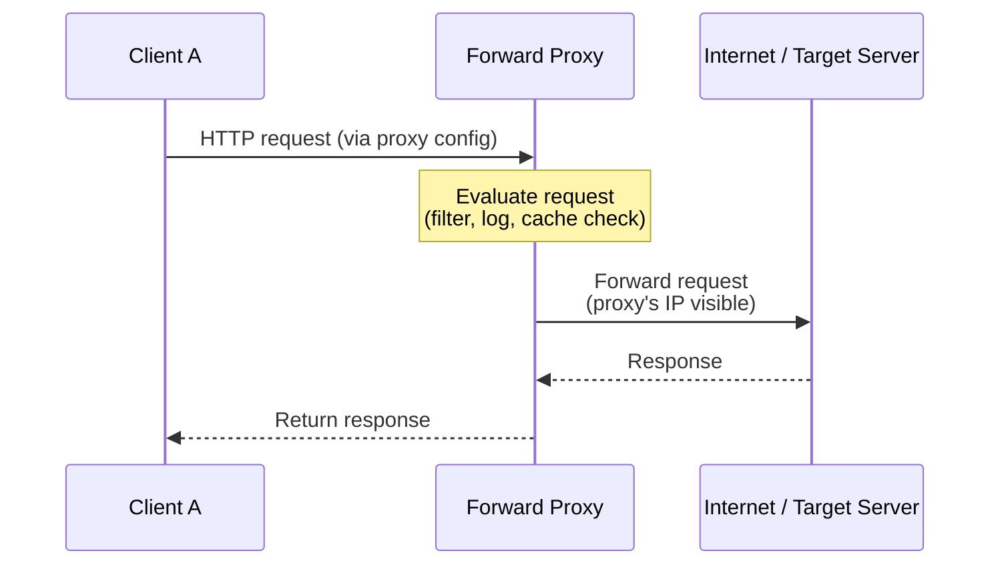
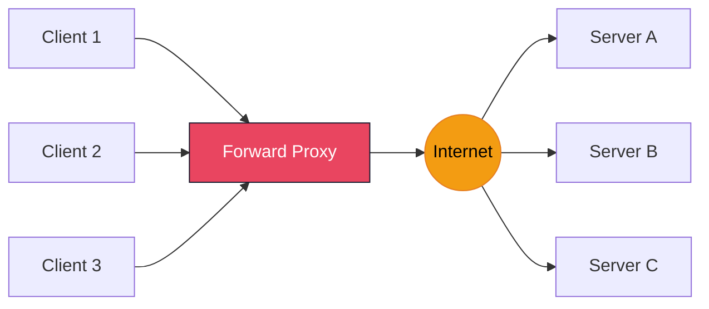
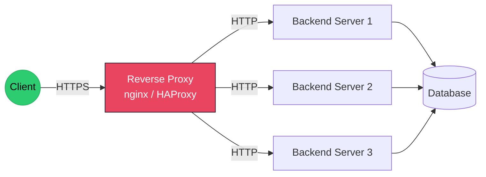
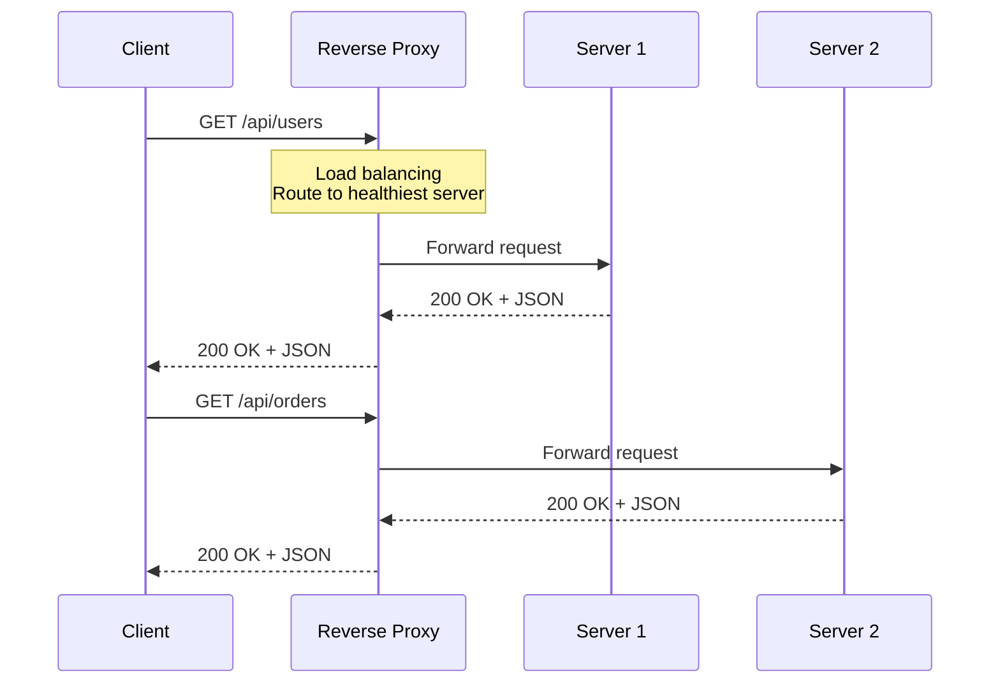
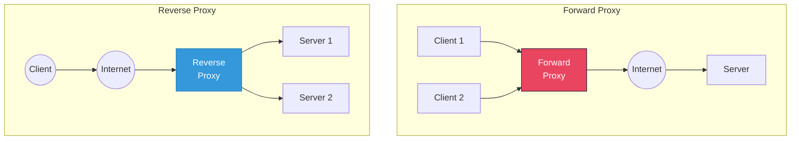
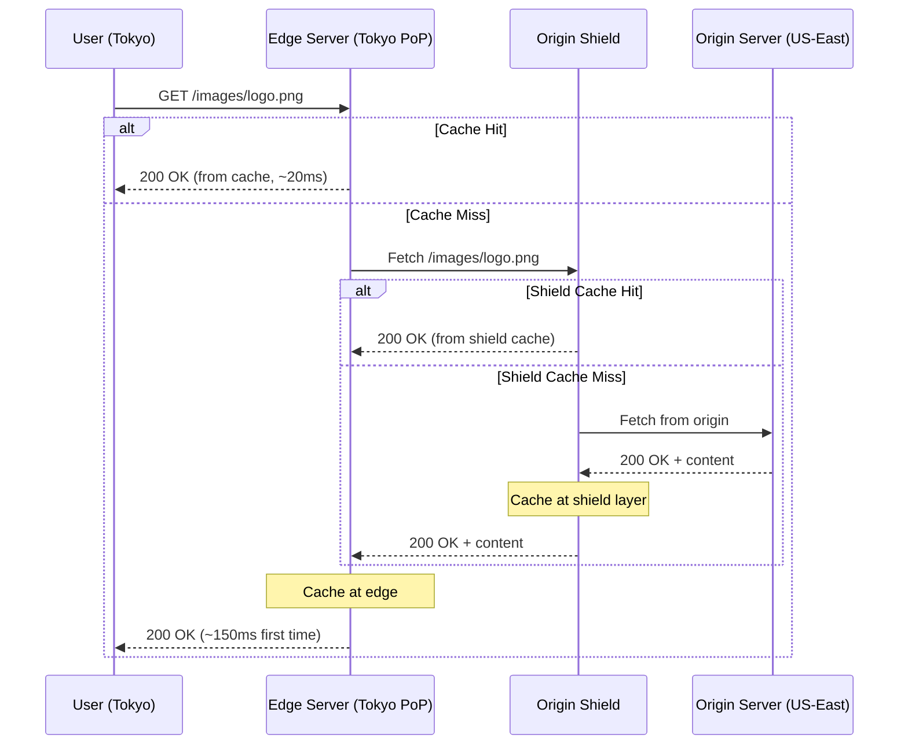
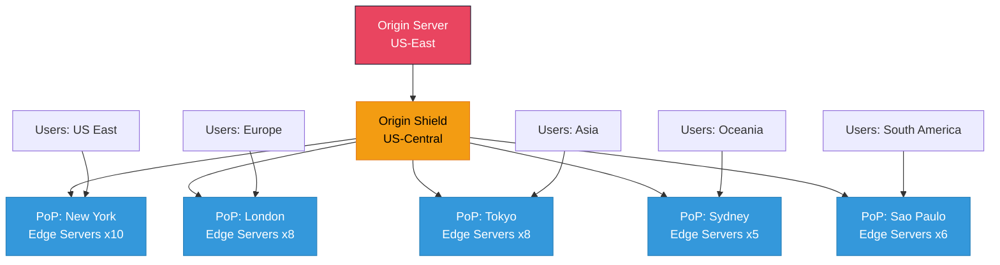
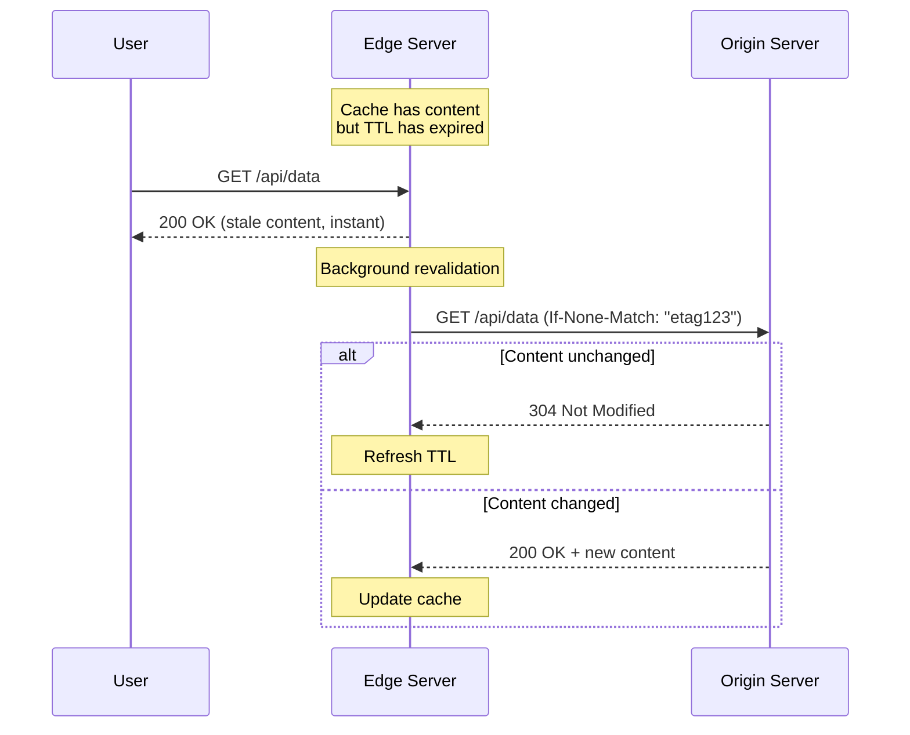
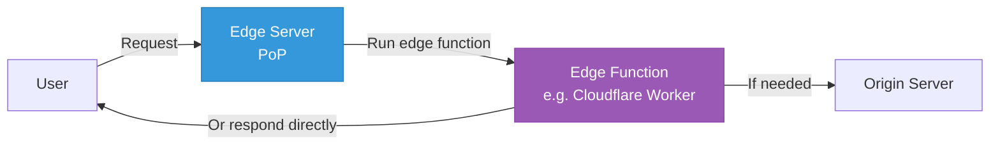

# Proxies & CDN

> Proxies and CDNs are foundational infrastructure components that sit between clients and
> origin servers. Understanding how they work, when to use each type, and the trade-offs
> involved is essential for any system design interview. This guide covers forward proxies,
> reverse proxies, CDN architecture, caching strategies, and edge computing.

---

## Table of Contents

1. [Forward Proxy](#1-forward-proxy)
2. [Reverse Proxy](#2-reverse-proxy)
3. [Forward vs Reverse Proxy](#3-forward-vs-reverse-proxy)
4. [Popular Proxy Software](#4-popular-proxy-software)
5. [CDN (Content Delivery Network)](#5-cdn-content-delivery-network)
6. [Push vs Pull CDN](#6-push-vs-pull-cdn)
7. [CDN Caching Strategies](#7-cdn-caching-strategies)
8. [Edge Computing](#8-edge-computing)
9. [Real-World CDN Providers](#9-real-world-cdn-providers)
10. [Quick Reference Summary](#10-quick-reference-summary)

---

## 1. Forward Proxy

### What Is a Forward Proxy?

A forward proxy is an intermediary server that sits **between the client and the internet**.
The client sends requests to the proxy, and the proxy forwards them to the destination
server on the client's behalf. The destination server sees the proxy's IP address, not the
client's.

Think of it as a gateway that the **client is aware of and explicitly configured to use**.

### Architecture Diagram





### Use Cases

| Use Case | Description |
|----------|-------------|
| **Anonymity / Privacy** | Hides the client's real IP address from the destination server. VPNs use this principle. |
| **Content Filtering** | Corporate or school networks use forward proxies to block access to certain websites (social media, gambling). |
| **Caching** | Frequently accessed resources are cached at the proxy, reducing bandwidth and improving latency for all clients behind it. |
| **Access Control** | Restrict which external services internal users can reach. Enforce compliance policies. |
| **Logging & Monitoring** | All outbound traffic passes through the proxy, enabling centralized audit trails. |
| **Bypassing Geo-restrictions** | Route traffic through a proxy in a different country to access region-locked content. |

### Real-World Examples

- **Squid Proxy** -- open-source caching proxy widely used in ISPs and organizations.
- **Zscaler / Blue Coat** -- enterprise forward proxies for security and compliance.
- **SOCKS5 proxies** -- protocol-agnostic proxies for tunneling traffic.
- **Tor Network** -- multi-hop forward proxy chain for maximum anonymity.

---

## 2. Reverse Proxy

### What Is a Reverse Proxy?

A reverse proxy sits **in front of one or more backend servers** and intercepts requests
from clients. Unlike a forward proxy (which serves clients), a reverse proxy serves
**servers**. The client typically does not know that a reverse proxy exists -- it believes
it is communicating directly with the origin server.

### Architecture Diagram





### Use Cases

| Use Case | Description |
|----------|-------------|
| **Load Balancing** | Distribute incoming traffic across multiple backend servers using algorithms like round-robin, least connections, or weighted routing. |
| **SSL/TLS Termination** | Handle SSL decryption at the proxy level so backend servers deal only with plain HTTP, reducing their CPU overhead. |
| **Caching** | Cache static assets and API responses at the proxy layer to reduce load on backends. |
| **Compression** | Compress responses (gzip, Brotli) before sending to clients, reducing bandwidth. |
| **Security & DDoS Protection** | Hide backend server IPs, filter malicious traffic, enforce rate limiting, and add WAF (Web Application Firewall) rules. |
| **A/B Testing & Canary Deployments** | Route a percentage of traffic to new server versions for gradual rollouts. |
| **URL Rewriting** | Modify request URLs, add headers, or redirect traffic based on rules. |
| **Connection Pooling** | Maintain persistent connections to backends, avoiding TCP handshake overhead for every request. |

---

## 3. Forward vs Reverse Proxy

### Comparison Table

| Aspect | Forward Proxy | Reverse Proxy |
|--------|---------------|---------------|
| **Position** | Between client and internet | Between internet and backend servers |
| **Serves** | Clients (outbound traffic) | Servers (inbound traffic) |
| **Client awareness** | Client knows about and configures the proxy | Client is unaware of the proxy |
| **Server awareness** | Server does not know about the proxy | Server knows about the proxy |
| **IP hidden** | Client's IP is hidden from the server | Server's IP is hidden from the client |
| **Primary purpose** | Privacy, filtering, caching for clients | Load balancing, security, caching for servers |
| **Deployed by** | Client-side organization (company, ISP) | Server-side organization (service provider) |
| **Examples** | Squid, corporate proxy, VPN | Nginx, HAProxy, Cloudflare, AWS ALB |
| **SSL** | May intercept SSL (MITM for inspection) | Terminates SSL on behalf of backend servers |
| **Scaling impact** | Reduces outbound bandwidth for clients | Distributes inbound load across servers |

### Visual Comparison



### When to Use Each

- **Forward proxy**: When you need to control, monitor, or anonymize **outbound** traffic
  from your organization's clients.
- **Reverse proxy**: When you need to protect, load-balance, or optimize **inbound** traffic
  to your backend servers. This is by far the more common configuration in system design
  interviews.

---

## 4. Popular Proxy Software

### 4.1 Nginx

Nginx is the most widely used reverse proxy and web server. It handles millions of
concurrent connections with low memory usage using an event-driven, asynchronous architecture.

**Key Features:**
- HTTP and TCP/UDP reverse proxy and load balancing
- SSL/TLS termination
- Static file serving and caching
- HTTP/2 and gRPC support
- Rate limiting and access control
- URL rewriting and redirection

**Example Configuration (Reverse Proxy + Load Balancing):**

```nginx
upstream backend_servers {
    # Load balancing with weights
    server 10.0.0.1:8080 weight=3;
    server 10.0.0.2:8080 weight=2;
    server 10.0.0.3:8080 weight=1;

    # Health check: mark server as down after 3 failures
    # Try again after 30 seconds
    server 10.0.0.4:8080 backup;
}

server {
    listen 443 ssl http2;
    server_name api.example.com;

    ssl_certificate     /etc/ssl/certs/api.crt;
    ssl_certificate_key /etc/ssl/private/api.key;

    # Gzip compression
    gzip on;
    gzip_types application/json text/plain text/css;

    # Caching for static assets
    location /static/ {
        proxy_cache my_cache;
        proxy_cache_valid 200 1h;
        proxy_pass http://backend_servers;
    }

    # Reverse proxy to backends
    location /api/ {
        proxy_pass http://backend_servers;
        proxy_set_header Host $host;
        proxy_set_header X-Real-IP $remote_addr;
        proxy_set_header X-Forwarded-For $proxy_add_x_forwarded_for;
        proxy_set_header X-Forwarded-Proto $scheme;

        # Timeouts
        proxy_connect_timeout 5s;
        proxy_read_timeout 30s;
    }
}
```

### 4.2 HAProxy

HAProxy (High Availability Proxy) is a high-performance TCP/HTTP load balancer and proxy.
It is known for its reliability and is used by companies like GitHub, Reddit, and Stack
Overflow.

**Key Features:**
- Layer 4 (TCP) and Layer 7 (HTTP) load balancing
- Advanced health checking (HTTP, TCP, scripted)
- Connection draining for graceful shutdowns
- Sticky sessions (cookie-based, source IP)
- Detailed stats dashboard and metrics
- ACL-based routing

**L4 vs L7 Load Balancing:**

| Aspect | Layer 4 (TCP) | Layer 7 (HTTP) |
|--------|---------------|----------------|
| **Operates on** | IP + port (transport layer) | HTTP headers, URL, cookies (application layer) |
| **Speed** | Faster (no payload inspection) | Slower (must parse HTTP) |
| **Routing logic** | IP hash, round-robin | URL path, headers, cookies, query params |
| **SSL** | Pass-through (no termination) | Can terminate SSL |
| **Use case** | Database proxying, raw TCP services | API routing, A/B testing, canary deploys |
| **Protocol support** | Any TCP protocol | HTTP/HTTPS only |

### 4.3 Envoy Proxy

Envoy is a modern, high-performance proxy designed for cloud-native applications and
service mesh architectures. Originally built at Lyft, it is now a CNCF graduated project.

**Key Features:**
- L3/L4 and L7 proxy with extensible filter chains
- First-class gRPC support
- Automatic service discovery and dynamic configuration (xDS API)
- Circuit breaking, retries, rate limiting built-in
- Distributed tracing integration (Zipkin, Jaeger, OpenTelemetry)
- Rich observability: metrics, access logs, tracing out of the box
- Hot restart with zero downtime
- Used as the data plane in Istio service mesh

**Where Envoy Shines:**
- Microservices architectures (sidecar proxy pattern)
- Service-to-service communication (east-west traffic)
- When you need deep observability into inter-service calls
- As the data plane in a service mesh (Istio, Consul Connect)

### Proxy Software Comparison

| Feature | Nginx | HAProxy | Envoy |
|---------|-------|---------|-------|
| **Primary use** | Web server + reverse proxy | Load balancer + proxy | Service mesh data plane |
| **L4 load balancing** | Yes | Yes (excellent) | Yes |
| **L7 load balancing** | Yes | Yes (excellent) | Yes |
| **Configuration** | Static config files | Static config files | Dynamic via xDS API |
| **gRPC support** | Yes (since 1.13) | Limited | First-class |
| **Service discovery** | Manual / DNS | Manual / DNS | Built-in (xDS, EDS) |
| **Observability** | Access logs, basic metrics | Stats dashboard, detailed metrics | Distributed tracing, rich metrics |
| **Hot reload** | Yes (graceful) | Yes | Yes (hot restart) |
| **Sidecar pattern** | Uncommon | Uncommon | Designed for it |
| **Community** | Massive | Large | Growing (CNCF) |
| **Best for** | General web serving, reverse proxy | High-throughput TCP/HTTP LB | Microservices, service mesh |

---

## 5. CDN (Content Delivery Network)

### What Is a CDN?

A CDN is a geographically distributed network of servers (called **edge servers**) that
cache and deliver content to users from the location **closest to them**. The goal is to
reduce latency, improve load times, and decrease the load on origin servers.

### Key Terminology

| Term | Definition |
|------|------------|
| **Origin Server** | The original server where content lives (your application server or object storage). |
| **Edge Server** | A CDN server at a PoP that caches and serves content to nearby users. |
| **PoP (Point of Presence)** | A physical location with a cluster of edge servers. Major CDNs have 200+ PoPs worldwide. |
| **Cache Hit** | The requested content is found in the edge server's cache and served directly. |
| **Cache Miss** | The content is not cached; the edge server fetches it from the origin, caches it, and then serves it. |
| **TTL (Time to Live)** | How long a cached resource remains valid before the edge server must revalidate or refetch it. |
| **Cache Invalidation** | The process of removing or updating stale content from edge caches before TTL expires. |
| **Origin Shield** | An intermediate cache layer between edge servers and the origin to reduce origin load. |

### How a CDN Works



### CDN Architecture (Global View)



### What CDNs Serve

| Content Type | Examples | Cache Duration |
|--------------|----------|----------------|
| **Static assets** | Images, CSS, JS, fonts, videos | Long (hours to days) |
| **Dynamic API responses** | JSON from read-heavy endpoints | Short (seconds to minutes) |
| **Streaming media** | Video chunks (HLS/DASH segments) | Medium (minutes to hours) |
| **Software downloads** | Binaries, packages, updates | Long (days to weeks) |
| **HTML pages** | Pre-rendered or server-side rendered pages | Short (seconds to minutes) |

### Benefits of a CDN

| Benefit | Explanation |
|---------|-------------|
| **Reduced latency** | Content served from nearby edge servers (~20-50ms vs ~200-500ms from distant origin). |
| **Decreased origin load** | Edge servers handle the majority of requests; origin only serves cache misses. |
| **Higher availability** | If one PoP goes down, traffic is routed to the next closest PoP. |
| **DDoS protection** | CDNs absorb distributed attacks across their massive global network. |
| **Bandwidth cost savings** | Edge caching reduces data transfer from the origin, lowering egress costs. |
| **Improved SEO** | Faster page loads improve search engine rankings (Core Web Vitals). |

---

## 6. Push vs Pull CDN

### Pull CDN (Lazy / On-Demand)

In a **pull CDN**, the edge server fetches content from the origin **only when a client
requests it** and the content is not already cached. This is the most common CDN model.

**How it works:**
1. User requests a resource from the CDN edge.
2. Edge checks its local cache.
3. On a cache miss, the edge pulls the content from the origin.
4. The edge caches the content with a TTL and serves it to the user.
5. Subsequent requests for the same content are served from the edge cache.

**Advantages:**
- Zero upfront effort -- content is cached automatically on demand.
- Storage efficient -- only popular content is cached.
- Simple to configure -- just point your DNS to the CDN.

**Disadvantages:**
- First request for any resource is slow (cache miss penalty).
- Rarely accessed content may be evicted, causing repeated cache misses.
- Origin must handle burst traffic for cache misses after TTL expiry (thundering herd).

### Push CDN (Proactive / Pre-populated)

In a **push CDN**, you **upload content to the CDN's edge servers proactively** before any
user requests it. The origin pushes content to the CDN during deployment or content creation.

**How it works:**
1. Content creator or CI/CD pipeline uploads assets directly to the CDN.
2. The CDN replicates content across all (or selected) PoPs.
3. When a user makes a request, the content is already at the edge.
4. No origin fetch is needed -- every request is a cache hit.

**Advantages:**
- No cold-start latency -- content is available immediately at all edges.
- Origin is never hit for cached content, reducing origin load to near zero.
- Full control over what is cached and when.

**Disadvantages:**
- Requires explicit upload step -- adds complexity to deployment pipelines.
- Storage costs are higher (content replicated everywhere, including unused PoPs).
- You must manage cache invalidation and updates manually.
- Not practical for dynamic or user-generated content.

### Comparison Table

| Aspect | Pull CDN | Push CDN |
|--------|----------|----------|
| **Content loading** | On-demand (lazy) | Proactive (pre-populated) |
| **First request latency** | High (cache miss) | Low (always cached) |
| **Origin load** | Moderate (serves cache misses) | Minimal (only for updates) |
| **Storage efficiency** | High (only popular content cached) | Lower (everything replicated) |
| **Setup complexity** | Simple (DNS change) | Complex (upload pipeline) |
| **Best for** | Dynamic sites, user-generated content, large catalogs | Static sites, known asset sets, critical resources |
| **Cache invalidation** | Automatic via TTL | Manual purge + re-push |
| **Cost model** | Pay for bandwidth (egress from origin + CDN) | Pay for storage + replication |
| **Thundering herd risk** | Yes (mass TTL expiry) | No |

### When to Use Each

**Use Pull CDN when:**
- Your content catalog is large and only a subset is popular (e.g., e-commerce with
  millions of product images).
- Content changes frequently and unpredictably (e.g., news sites, social media).
- You want simplicity -- minimal changes to your deployment pipeline.
- You are serving user-generated content.

**Use Push CDN when:**
- You have a known, finite set of critical assets (e.g., JS bundles, CSS, fonts).
- Latency on the very first request matters (e.g., marketing landing pages).
- Your origin server is fragile or expensive to scale.
- Content is large and does not change often (e.g., software binaries, video files).

**Hybrid approach (most common in practice):**
- Push critical assets (JS, CSS, fonts) during deployment.
- Pull everything else (images, API responses) on demand.

---

## 7. CDN Caching Strategies

### 7.1 Cache-Control Headers

The `Cache-Control` HTTP header is the primary mechanism for controlling CDN caching
behavior. It is set by the origin server and tells both CDN edges and browsers how to
cache the response.

**Common Directives:**

| Directive | Meaning |
|-----------|---------|
| `public` | Any cache (CDN, browser, proxy) can store the response. |
| `private` | Only the end user's browser may cache this (not CDN). Use for user-specific data. |
| `no-cache` | Cache may store the response but must revalidate with the origin before serving. |
| `no-store` | Do not cache the response at all. Used for sensitive data (banking, PII). |
| `max-age=N` | Cache is valid for N seconds from the time of the request. |
| `s-maxage=N` | Like max-age but only for shared caches (CDN). Overrides max-age for CDN. |
| `must-revalidate` | Once stale, cache must not serve the content without revalidation. |
| `immutable` | Content will never change. Browser should never revalidate (e.g., fingerprinted assets). |
| `stale-while-revalidate=N` | Serve stale content for up to N seconds while revalidating in the background. |

**Example Headers for Different Content Types:**

```
# Fingerprinted static assets (app.a1b2c3.js)
Cache-Control: public, max-age=31536000, immutable

# Dynamic API response with short cache
Cache-Control: public, s-maxage=60, stale-while-revalidate=30

# User-specific data (do not cache on CDN)
Cache-Control: private, no-cache

# Sensitive data (never cache anywhere)
Cache-Control: no-store
```

### 7.2 TTL and Cache Invalidation

**TTL (Time to Live):**

The TTL determines how long a cached resource is considered fresh. After the TTL expires,
the edge server must revalidate or refetch the content.

| Content Type | Recommended TTL | Rationale |
|--------------|-----------------|-----------|
| Fingerprinted assets (JS, CSS) | 1 year (31536000s) | Filename changes on content change, so cache forever. |
| Images and media | 1 hour to 1 day | Balance freshness with cache hit ratio. |
| API responses | 5 seconds to 5 minutes | Depends on how stale the data can be. |
| HTML pages | 0 to 5 minutes | Often personalized or time-sensitive. |

**Cache Invalidation Methods:**

| Method | How It Works | Pros | Cons |
|--------|-------------|------|------|
| **TTL expiry** | Content automatically becomes stale after TTL. | Zero effort. | No control over timing; stale data served until expiry. |
| **Purge** | Explicitly remove specific URLs from all edge caches via API call. | Immediate invalidation. | Requires API integration; can be slow across all PoPs. |
| **Purge by tag/key** | Assign tags to cached objects; purge all objects with a given tag. | Bulk invalidation. | Not all CDNs support this. |
| **Cache busting** | Change the URL (e.g., add version hash to filename: `app.v2.js`). | Guaranteed fresh fetch. | Requires build pipeline changes. |
| **Soft purge** | Mark content as stale but serve it while revalidating in the background. | No latency spike. | Brief period of stale content. |

### 7.3 Cache Key Design

The **cache key** determines what makes a cached response unique. Two requests with the
same cache key will receive the same cached response.

**Default cache key:** `URL path + query string`

**Components you can include in the cache key:**

| Component | Example | When to Include |
|-----------|---------|-----------------|
| URL path | `/api/users/123` | Always (default). |
| Query parameters | `?page=2&sort=name` | When query params change the response. Exclude tracking params (utm_*). |
| Headers | `Accept-Language: fr` | When response varies by language, encoding, or device type. |
| Cookies | `session_id=abc` | Rarely -- this effectively makes the cache per-user (low hit ratio). |
| Device type | Mobile vs Desktop | When serving different content/layouts per device. |
| Country/Region | Geolocation | When content varies by region (pricing, legal notices). |

**Best Practices:**
- Keep cache keys as simple as possible to maximize hit ratio.
- Normalize query parameters (sort alphabetically, remove tracking params).
- Use the `Vary` header to tell CDNs which request headers affect the response.
- Avoid including cookies in cache keys unless absolutely necessary.

### 7.4 Stale-While-Revalidate

This strategy lets the CDN serve a stale (expired) response immediately while
**asynchronously revalidating** the content with the origin in the background.



**Benefits:**
- Users always get a fast response (no waiting for origin).
- Content stays reasonably fresh (updated in the background).
- Origin sees a steady trickle of revalidation requests instead of a thundering herd.

**Combine with:**
```
Cache-Control: public, s-maxage=60, stale-while-revalidate=300
```
This means: cache for 60 seconds, then serve stale for up to 300 more seconds while
revalidating in the background.

---

## 8. Edge Computing

### What Is Edge Computing?

Edge computing extends the CDN concept beyond caching. Instead of just serving cached
content, edge servers can **run code** (compute logic) at the edge, close to the user.
This means request processing, data transformation, authentication, and even database
queries can happen at the edge PoP rather than traveling to a centralized origin.

### How It Works



### Edge Function Platforms

| Platform | Provider | Runtime | Cold Start | Limits |
|----------|----------|---------|------------|--------|
| **Cloudflare Workers** | Cloudflare | V8 isolates (JS/Wasm) | ~0ms (no cold start) | 10ms CPU / request (free), 50ms (paid) |
| **Lambda@Edge** | AWS CloudFront | Node.js, Python | 5-50ms | 5s execution (viewer), 30s (origin) |
| **CloudFront Functions** | AWS CloudFront | JavaScript | ~0ms | 1ms execution, 10KB code limit |
| **Fastly Compute** | Fastly | Wasm (Rust, Go, JS) | ~0ms | 50ms CPU, 128MB memory |
| **Vercel Edge Functions** | Vercel (Cloudflare) | V8 isolates | ~0ms | 25ms CPU on hobby tier |
| **Deno Deploy** | Deno | V8 isolates (Deno runtime) | ~0ms | 50ms CPU per request |

### Use Cases for Edge Computing

| Use Case | Description | Why at the Edge? |
|----------|-------------|------------------|
| **A/B testing** | Route users to different page variants based on cookies or headers. | No origin round trip for routing decisions. |
| **Authentication / JWT validation** | Verify tokens at the edge; reject unauthorized requests before they hit origin. | Reduces origin load, faster auth checks. |
| **Geolocation-based routing** | Serve different content based on user's country (pricing, language, compliance). | Edge knows user's geographic location. |
| **Image optimization** | Resize, compress, and convert images on-the-fly at the edge (WebP, AVIF). | Reduces bandwidth; serves optimized format per client. |
| **Bot detection** | Identify and block bots, scrapers, and abuse at the edge. | Stops bad traffic before it reaches origin. |
| **Personalization** | Inject user-specific content into cached pages (ESI - Edge Side Includes). | Combine cached pages with dynamic personalization. |
| **API gateway** | Rate limiting, request routing, header manipulation at the edge. | Offload gateway logic from centralized infrastructure. |
| **Feature flags** | Toggle features per user segment without redeploying. | Instant global flag changes. |

### Edge vs Origin Computing

| Aspect | Edge Computing | Origin Computing |
|--------|---------------|------------------|
| **Latency** | Very low (10-50ms) | Higher (100-500ms) |
| **Compute power** | Limited (short execution time) | Unlimited |
| **State / Storage** | Limited (KV store, small DBs) | Full database access |
| **Deployment** | Globally distributed automatically | Single or multi-region |
| **Cost model** | Per-request (cheap per invocation) | Per-server (fixed cost) |
| **Best for** | Lightweight, latency-sensitive logic | Complex business logic, transactions |

---

## 9. Real-World CDN Providers

- **Cloudflare** -- 300+ cities, free tier, Workers (edge compute), integrated DNS/WAF/DDoS.
- **Akamai** -- Largest CDN (4,000+ PoPs), enterprise-grade, serves ~30% of web traffic.
- **AWS CloudFront** -- Deep AWS integration (S3, Lambda@Edge), 450+ PoPs, pay-as-you-go.
- **Fastly** -- Instant purge (<150ms), Varnish-based, Wasm edge compute. Used by GitHub.

### Provider Comparison Table

| Feature | Cloudflare | Akamai | AWS CloudFront | Fastly |
|---------|------------|--------|----------------|--------|
| **Global PoPs** | 300+ cities | 4,000+ locations | 450+ PoPs | 80+ PoPs |
| **Edge compute** | Workers (V8) | EdgeWorkers | Lambda@Edge, CF Functions | Compute@Edge (Wasm) |
| **Purge speed** | ~seconds | ~5 seconds | Minutes (or instant w/ invalidation) | <150ms |
| **Free tier** | Yes (generous) | No | 1TB/month (12 months) | Limited trial |
| **DDoS protection** | Built-in (unmetered) | Built-in (enterprise) | AWS Shield Standard (free) | Built-in |
| **WAF** | Yes | Yes (enterprise) | AWS WAF (separate) | Yes |
| **DNS** | Integrated | Separate (Edge DNS) | Route 53 (separate) | Limited |
| **Origin shield** | Tiered caching | Yes | Yes | Shielding PoPs |
| **Real-time logs** | Yes | Yes | Near real-time (via Kinesis) | Yes (streaming) |
| **Pricing** | Competitive, transparent | Premium, custom quotes | Pay-as-you-go | Usage-based |
| **Best for** | Full-stack web performance + security | Enterprise, media, large scale | AWS-native architectures | Developer control, instant purge |

---

## 10. Quick Reference Summary

### Key Concepts at a Glance

```
Forward Proxy:  Client --> [Proxy] --> Internet --> Server
                (Client knows about proxy, server does not)

Reverse Proxy:  Client --> Internet --> [Proxy] --> Server(s)
                (Server knows about proxy, client does not)

CDN:            Client --> [Nearest Edge Server] --> Origin (on miss only)
                (Geographically distributed cache network)
```

### Interview Cheat Sheet

| Topic | Key Points to Mention |
|-------|----------------------|
| **Forward Proxy** | Client-side, anonymity, content filtering, corporate networks. |
| **Reverse Proxy** | Server-side, load balancing, SSL termination, security, caching. |
| **Nginx vs HAProxy** | Nginx = web server + proxy; HAProxy = pure LB with better L4 support. |
| **Envoy** | Service mesh sidecar, dynamic config, observability, gRPC-native. |
| **CDN basics** | Edge servers at PoPs, cache hits vs misses, origin shield. |
| **Pull CDN** | Content cached on first request. Simple setup. Thundering herd risk. |
| **Push CDN** | Content pre-populated. No cold start. Higher storage cost. |
| **Cache-Control** | `public`, `s-maxage`, `stale-while-revalidate`, `immutable`. |
| **Cache invalidation** | TTL expiry, purge API, cache busting (fingerprinted filenames). |
| **Cache key** | URL + query params. Normalize. Use `Vary` header for multi-variant caching. |
| **Edge computing** | Run code at CDN edge. Good for auth, A/B testing, personalization. |
| **CDN providers** | Cloudflare (best free tier), Akamai (largest), CloudFront (AWS-native), Fastly (instant purge). |

### Common Interview Questions

**Q: Why would you put a reverse proxy in front of your servers?**
> Load balancing across multiple backends, SSL termination (offload crypto from app servers),
> caching static responses, DDoS protection, and hiding internal server topology.

**Q: How does a CDN improve performance?**
> By caching content at edge servers close to users, reducing latency from hundreds of
> milliseconds (cross-continent) to tens of milliseconds (same city). Also reduces origin
> server load and bandwidth costs.

**Q: When would you NOT use a CDN?**
> For highly personalized or sensitive content that cannot be cached (e.g., banking
> transactions, real-time stock prices), or when your user base is geographically
> concentrated near your origin server.

**Q: How do you handle cache invalidation in a CDN?**
> Use fingerprinted filenames for static assets (cache forever, new filename = new fetch).
> For dynamic content, use short TTLs with `stale-while-revalidate`. For urgent updates,
> use the CDN's purge API. Avoid relying solely on TTL for time-sensitive data.

**Q: Explain the thundering herd problem with CDNs.**
> When a popular resource's TTL expires at the same time across many edge servers, they all
> simultaneously request the origin, causing a traffic spike. Mitigations: stagger TTLs with
> jitter, use origin shield (single intermediate cache), use `stale-while-revalidate` to
> serve stale content while one request revalidates, or implement request coalescing
> (collapse duplicate origin fetches into one).

**Q: What is the difference between L4 and L7 load balancing?**
> L4 (transport layer) routes based on IP and port without inspecting payload -- faster but
> less flexible. L7 (application layer) can inspect HTTP headers, URLs, cookies, and make
> content-aware routing decisions like path-based routing or A/B testing.

### Numbers to Remember

| Metric | Value |
|--------|-------|
| Typical CDN edge latency | 10-50ms |
| Origin fetch latency (cross-continent) | 150-300ms |
| Cloudflare global PoPs | 300+ cities |
| Akamai global PoPs | 4,000+ locations |
| Nginx concurrent connections | 10,000+ per worker process |
| HAProxy max connections | 2,000,000+ (kernel tuned) |
| CDN cache hit ratio (well-tuned) | 85-99% |
| Fastly purge propagation | <150ms globally |

---

> **In system design interviews:** Always mention a reverse proxy / load balancer at the
> entry point of your architecture and a CDN for serving static assets. These are expected
> components in almost every design. Be ready to explain cache-control headers, TTL
> strategies, and the trade-offs of push vs pull CDN when the interviewer digs deeper.
