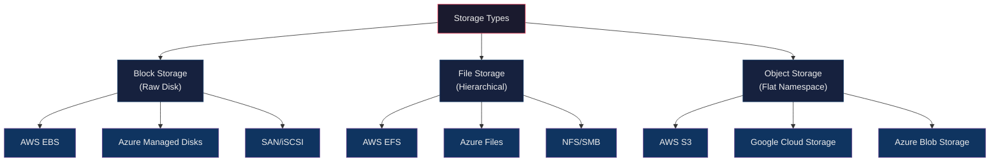
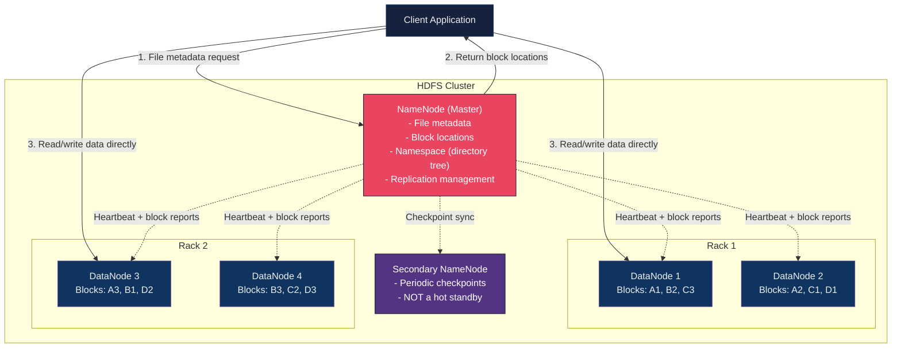
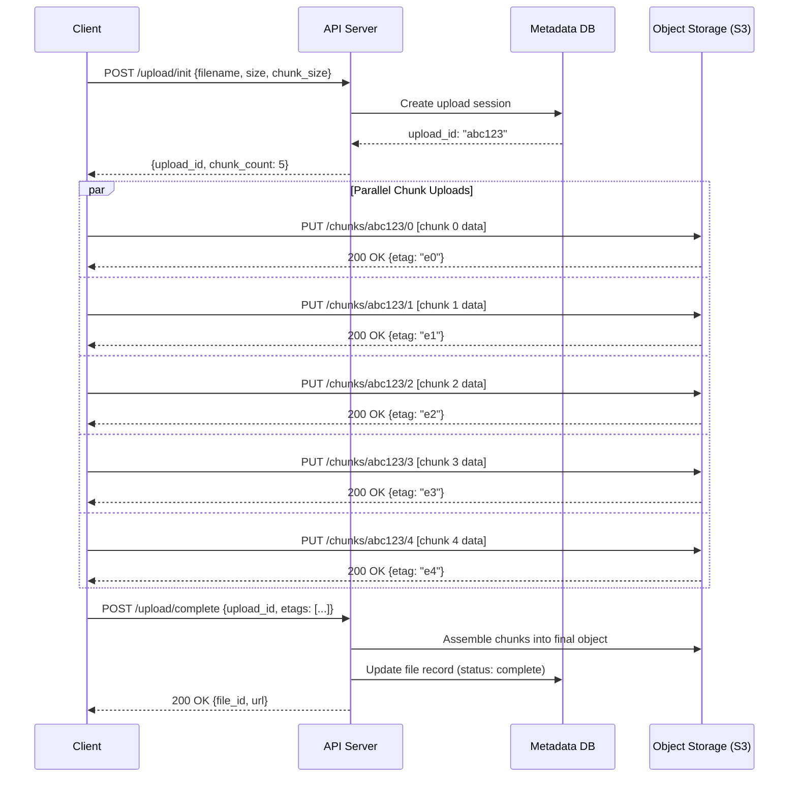
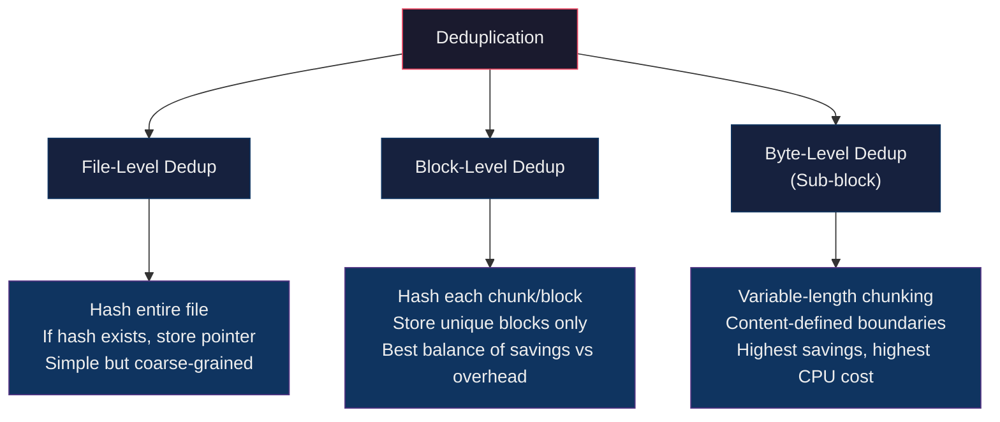
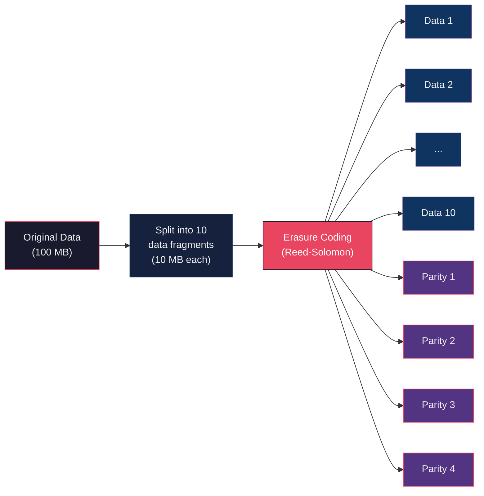

# Storage & File Systems

> Understanding storage types, distributed file systems, and data management strategies is essential for system design interviews. Nearly every system you design will need to store data -- choosing the right storage layer impacts performance, cost, scalability, and durability.

---

## 1. Storage Types Overview

There are three fundamental storage paradigms. Each serves different access patterns and workloads.



### Comparison Table

| Dimension | Block Storage | File Storage | Object Storage |
|-----------|--------------|-------------|----------------|
| **Access Method** | Raw blocks via LBA (Logical Block Address) | Hierarchical paths (`/dir/file.txt`) | HTTP API (`PUT/GET/DELETE` by key) |
| **Protocol** | iSCSI, Fibre Channel, NVMe | NFS, SMB/CIFS | REST / HTTP(S) |
| **Data Unit** | Fixed-size blocks (512B - 4KB) | Files and directories | Objects (data + metadata + key) |
| **Performance** | Lowest latency (~0.1-1 ms) | Moderate latency (~1-10 ms) | Higher latency (~10-100 ms) |
| **Max Scalability** | Limited (single volume) | Moderate (PB scale) | Virtually unlimited (EB scale) |
| **Cost** | Highest ($/GB) | Moderate | Lowest ($/GB) |
| **Best For** | Databases, VMs, boot volumes | Shared file access, home dirs, CMS | Images, videos, backups, data lakes |
| **Mutability** | In-place updates | In-place updates | Immutable (replace entire object) |
| **Metadata** | Minimal (filesystem level) | File attributes (permissions, timestamps) | Rich custom metadata per object |

> **Interview tip:** When asked "where should we store X?", think about the access pattern first. Random read/write with low latency = block storage. Hierarchical shared access = file storage. Write-once-read-many with HTTP access = object storage.

---

## 2. Block Storage

Block storage divides data into fixed-size blocks, each with a unique Logical Block Address (LBA). The storage device has no knowledge of what the blocks contain -- it is up to the operating system or application to impose structure (filesystem, database pages, etc.).

### How It Works

```
Physical Disk / Volume
+--------+--------+--------+--------+--------+--------+
| Block  | Block  | Block  | Block  | Block  | Block  |
| LBA 0  | LBA 1  | LBA 2  | LBA 3  | LBA 4  | LBA 5  |
+--------+--------+--------+--------+--------+--------+
   |                   |
   v                   v
 OS/Filesystem maps blocks to files, DB pages, etc.
```

- **Block size:** Typically 512 bytes or 4 KB (modern drives).
- **LBA (Logical Block Address):** Linear address space the OS uses to reference blocks.
- **No built-in metadata:** The storage layer does not understand files -- that is the filesystem's job.
- **In-place updates:** Any block can be overwritten without touching other blocks.

### Performance Characteristics

| Metric | HDD (Spinning Disk) | SSD (NAND Flash) | NVMe SSD |
|--------|---------------------|-------------------|----------|
| **Random Read Latency** | ~5-10 ms | ~0.1 ms (100 us) | ~0.02 ms (20 us) |
| **Sequential Throughput** | 100-200 MB/s | 500-550 MB/s | 3,000-7,000 MB/s |
| **Random IOPS** | 100-200 | 10,000-100,000 | 100,000-1,000,000 |
| **Durability** | Mechanical failure | Write endurance (TBW) | Write endurance (TBW) |

### Key Metrics (Know These)

- **IOPS (I/O Operations Per Second):** Number of read/write operations per second. Critical for databases.
- **Throughput (MB/s):** Volume of data transferred per second. Critical for streaming workloads.
- **Latency:** Time from issuing a request to receiving a response. Critical for interactive applications.

> **Rule of thumb:** Databases care about IOPS. Media streaming cares about throughput. User-facing services care about latency.

### Use Cases

- **Databases:** PostgreSQL, MySQL, MongoDB all store data in pages that map directly to disk blocks.
- **Virtual Machines:** VM disk images (VMDK, qcow2) are stored as block devices.
- **Boot Volumes:** Operating systems require block-level access to boot.
- **Transaction Logs:** Write-ahead logs (WAL) benefit from low-latency sequential writes.

### Cloud Examples

| Service | Provider | Key Features |
|---------|----------|-------------|
| **EBS (Elastic Block Store)** | AWS | gp3 (general), io2 (provisioned IOPS), st1 (throughput) |
| **Managed Disks** | Azure | Premium SSD, Standard SSD, Ultra Disk |
| **Persistent Disk** | GCP | Balanced, SSD, Extreme |

### EBS Volume Types (Common Interview Knowledge)

| Type | IOPS | Throughput | Use Case |
|------|------|-----------|----------|
| gp3 (General Purpose SSD) | 3,000 - 16,000 | 125 - 1,000 MB/s | Default for most workloads |
| io2 Block Express | Up to 256,000 | 4,000 MB/s | High-performance databases (Oracle, SAP HANA) |
| st1 (Throughput HDD) | 500 | 500 MB/s | Big data, data warehousing, log processing |
| sc1 (Cold HDD) | 250 | 250 MB/s | Infrequent access, lowest cost |

---

## 3. File Storage

File storage organizes data in a hierarchical tree of directories and files, which is the model most humans and applications are familiar with. A file server (or managed service) exposes this hierarchy over the network using standard protocols.

### Hierarchical Directory Structure

```
/
├── home/
│   ├── alice/
│   │   ├── documents/
│   │   │   └── report.pdf
│   │   └── photos/
│   │       └── vacation.jpg
│   └── bob/
│       └── scripts/
│           └── deploy.sh
├── shared/
│   └── datasets/
│       ├── train.csv
│       └── test.csv
└── logs/
    ├── app.log
    └── error.log
```

### Network File Protocols

| Protocol | Full Name | OS Support | Port | Notes |
|----------|-----------|-----------|------|-------|
| **NFS** | Network File System | Linux, macOS, Windows | 2049 | Stateless (v3) / stateful (v4), POSIX semantics |
| **SMB/CIFS** | Server Message Block | Windows, Linux (Samba), macOS | 445 | Native Windows, supports locking, named pipes |
| **AFP** | Apple Filing Protocol | macOS (legacy) | 548 | Deprecated in favor of SMB |

### Performance Characteristics

- **Latency:** 1-10 ms for network file operations (compared to <1 ms for local block storage).
- **Throughput:** Depends on network bandwidth and protocol efficiency. NFS v4.1 supports parallel NFS (pNFS) for higher throughput.
- **Concurrent Access:** Multiple clients can read/write the same filesystem simultaneously.
- **Locking:** NFS v4 and SMB support file locking for concurrent writes.

### Use Cases

- **Shared file systems:** Multiple application servers reading the same config files, templates, or assets.
- **Home directories:** User home directories mounted over NFS in enterprise environments.
- **Content management:** CMS platforms storing articles, images, and templates.
- **Machine learning:** Shared training data accessible by multiple GPU instances.
- **Legacy applications:** Software that expects a POSIX filesystem interface.

### Cloud Examples

| Service | Provider | Key Features |
|---------|----------|-------------|
| **EFS (Elastic File System)** | AWS | Managed NFS, auto-scaling, pay per use, multi-AZ |
| **Azure Files** | Azure | Managed SMB/NFS shares, Azure AD integration |
| **Filestore** | GCP | Managed NFS, high performance for HPC workloads |
| **FSx for Lustre** | AWS | High-performance parallel filesystem for HPC/ML |

> **When to choose file storage over object storage:** When your application uses standard filesystem APIs (`open()`, `read()`, `write()`, `seek()`), needs POSIX compliance, or requires shared concurrent access with locking semantics.

---

## 4. Object Storage

Object storage is the dominant storage model for modern cloud-native applications. It stores data as objects in a flat namespace, accessed via HTTP APIs. Each object consists of three components: the data itself, rich metadata, and a globally unique key.

### Object Anatomy

```
Object
├── Key:      "images/2024/vacation/photo-001.jpg"
├── Data:     [binary content of the image - up to 5 TB]
├── Metadata:
│   ├── System:  Content-Type, Content-Length, ETag, Last-Modified
│   └── Custom:  x-amz-meta-photographer: "Alice"
│                x-amz-meta-camera: "Canon EOS R5"
│                x-amz-meta-resolution: "8192x5464"
└── Version ID: "3sL4kqtJlcpXroDTDmJ+rmSpXd3dIbrHY"
```

### How It Works

- **Flat namespace:** Despite the appearance of `/` in keys, there are no real directories. The key `images/2024/photo.jpg` is a single flat string.
- **HTTP API:** All access is via standard HTTP methods:
  - `PUT` -- Upload/replace an object
  - `GET` -- Retrieve an object
  - `DELETE` -- Remove an object
  - `HEAD` -- Retrieve metadata only
  - `LIST` -- List objects by prefix
- **Immutability:** Objects cannot be partially updated. To modify data, you replace the entire object.
- **Versioning:** When enabled, every `PUT` creates a new version; deleted objects can be recovered.
- **Eventual consistency:** Historically S3 was eventually consistent for overwrites; since December 2020, S3 provides strong read-after-write consistency for all operations.

### Use Cases

- **Media storage:** Images, videos, audio files served via CDN.
- **Backups and archives:** Database dumps, log archives, compliance records.
- **Data lakes:** Raw data storage for analytics (Parquet, ORC, CSV files queried by Athena/Spark).
- **Static website hosting:** HTML, CSS, JS served directly from S3 + CloudFront.
- **Machine learning:** Training datasets, model artifacts, experiment outputs.

### Cloud Examples

| Service | Provider | Max Object Size | Durability |
|---------|----------|----------------|------------|
| **S3** | AWS | 5 TB | 99.999999999% (11 nines) |
| **Cloud Storage** | GCP | 5 TB | 99.999999999% |
| **Blob Storage** | Azure | 4.75 TB (block blob) | 99.999999999% (LRS 16 nines with GRS) |

### S3 Storage Classes

S3 offers multiple storage classes to optimize cost based on access patterns. This is frequently asked in interviews.

| Storage Class | Access Pattern | Min Duration | Retrieval Time | Cost ($/GB/month) | Use Case |
|---------------|---------------|-------------|----------------|-------------------|----------|
| **S3 Standard** | Frequent access | None | Instant | ~$0.023 | Active application data, websites |
| **S3 Standard-IA** | Infrequent access (>30 days) | 30 days | Instant | ~$0.0125 | Backups, disaster recovery |
| **S3 One Zone-IA** | Infrequent, single AZ | 30 days | Instant | ~$0.010 | Secondary backups, re-creatable data |
| **S3 Glacier Instant** | Archive, instant access | 90 days | Instant (milliseconds) | ~$0.004 | Medical images, news archives |
| **S3 Glacier Flexible** | Archive, flexible retrieval | 90 days | 1-5 min (Expedited), 3-5 hr (Standard) | ~$0.0036 | Long-term backups, compliance |
| **S3 Glacier Deep Archive** | Rare access, long-term | 180 days | 12-48 hours | ~$0.00099 | Regulatory compliance (7+ years) |
| **S3 Intelligent-Tiering** | Unknown/changing access | None | Instant | ~$0.023 + monitoring fee | Unpredictable access patterns |

> **Interview tip:** S3 Lifecycle Policies automatically transition objects between classes. Example: Move to Standard-IA after 30 days, Glacier after 90 days, Deep Archive after 365 days.

### Pre-Signed URLs

A critical pattern for system design interviews:

```
1. Client requests upload URL from your API server
2. API server generates pre-signed S3 PUT URL (valid 15 min)
3. Client uploads directly to S3 (bypasses your server)
4. S3 notifies your server via event notification (SQS/SNS/Lambda)
```

This avoids routing large file uploads through your application servers, saving bandwidth and compute.

---

## 5. HDFS (Hadoop Distributed File System)

HDFS is a distributed file system designed for storing very large datasets (petabytes) across clusters of commodity hardware. It follows a write-once-read-many access model, optimized for batch processing workloads.

### Architecture



### Key Components

| Component | Role | Details |
|-----------|------|---------|
| **NameNode** | Master server | Stores all metadata: file names, directory tree, block-to-DataNode mapping. Runs in memory for fast lookups. Single point of failure (mitigated by HA NameNode). |
| **DataNode** | Worker server | Stores actual data blocks on local disks. Sends heartbeats and block reports to NameNode every 3 seconds. |
| **Secondary NameNode** | Checkpoint helper | Periodically merges the edit log with the fsimage. **Not** a failover node. |
| **HA NameNode** | Standby master | Active/Standby pair using shared edit log (QJM or NFS). Automatic failover via ZooKeeper. |

### Block Replication

- **Default block size:** 128 MB (was 64 MB in Hadoop 1.x).
- **Default replication factor:** 3 copies.
- **Rack awareness:** HDFS places replicas intelligently:
  - 1st replica: same node as the writer (or a random node).
  - 2nd replica: different rack (survives rack failure).
  - 3rd replica: same rack as 2nd, different node (reduces cross-rack traffic).

```
File: /data/logs/access.log (256 MB)

Block A (128 MB)                Block B (128 MB)
├── Replica 1: Rack1/DN1        ├── Replica 1: Rack1/DN2
├── Replica 2: Rack2/DN3        ├── Replica 2: Rack2/DN4
└── Replica 3: Rack2/DN4        └── Replica 3: Rack2/DN3
```

### HDFS Read Flow

1. Client asks NameNode for block locations of the target file.
2. NameNode returns an ordered list of DataNodes for each block (sorted by proximity to the client).
3. Client reads directly from the closest DataNode for each block.
4. If a DataNode fails mid-read, the client transparently retries with the next replica.

### HDFS Write Flow

1. Client asks NameNode to create the file.
2. NameNode checks permissions, creates the file entry, and returns a list of DataNodes for the first block.
3. Client writes to the first DataNode, which pipelines the data to the 2nd and 3rd DataNodes.
4. Acknowledgements flow back through the pipeline.
5. After all blocks are written, the client tells the NameNode the file is complete.

### When to Use HDFS vs Object Storage

| Criteria | HDFS | Object Storage (S3) |
|----------|------|-------------------|
| **Access pattern** | Sequential reads, batch processing | Random access via HTTP |
| **File size** | Large files (100 MB+) | Any size (bytes to 5 TB) |
| **Processing model** | Data locality (move compute to data) | Decouple compute and storage |
| **Latency** | Higher (not designed for low-latency) | Moderate (10-100 ms) |
| **Scalability** | 10K+ nodes, PB scale | Virtually unlimited (EB scale) |
| **Cost** | Higher (dedicated cluster) | Lower (pay per use) |
| **Ecosystem** | Hadoop, Spark, Hive, HBase | Any HTTP client, serverless |
| **Mutability** | Append-only (no random writes) | Immutable (replace entire object) |
| **Modern trend** | Declining (replaced by cloud object storage + Spark) | Dominant for new architectures |

> **Interview insight:** Modern data architectures are moving away from HDFS toward object storage (S3) with compute engines like Spark, Presto, and Trino that read directly from S3. This decouples compute and storage, allowing independent scaling.

---

## 6. File Chunking

Chunking is the practice of splitting a large file into smaller, fixed-size pieces for upload, download, or storage. It is a fundamental technique in systems like Dropbox, Google Drive, YouTube, and any file-sharing platform.

### Why Chunking Matters

| Problem | How Chunking Solves It |
|---------|----------------------|
| **Network failures** | Only re-upload the failed chunk, not the entire file |
| **Large file limits** | HTTP and cloud APIs often limit single-request size (e.g., S3 max 5 GB per PUT) |
| **Parallel transfers** | Upload/download multiple chunks simultaneously for higher throughput |
| **Deduplication** | Identical chunks across files are stored only once |
| **Progress tracking** | Show accurate upload progress (chunk N of M) |
| **Bandwidth optimization** | Only sync changed chunks on file modification |

### Chunk Size Considerations

| Chunk Size | Pros | Cons |
|-----------|------|------|
| **Small (256 KB - 1 MB)** | Better dedup ratio, finer progress tracking, less wasted bandwidth on retry | More metadata overhead, more HTTP requests, higher NameNode/metadata load |
| **Medium (4 MB - 16 MB)** | Good balance of dedup and overhead | -- |
| **Large (64 MB - 128 MB)** | Fewer requests, lower metadata overhead, better sequential throughput | Poor dedup ratio, more wasted bandwidth on retry, coarser progress tracking |

> **Industry standards:** Dropbox uses 4 MB chunks. Google Drive uses variable chunk sizes. AWS S3 multipart upload recommends 8-100 MB parts.

### Chunked Upload Flow



### Resumable Uploads

Resumable uploads allow clients to continue uploading after a network interruption without starting over.

**How it works:**

1. Client initiates an upload session, receives an `upload_id`.
2. Client uploads chunks, server tracks which chunks have been received.
3. If the connection drops, the client queries the server: "Which chunks have you received for upload_id X?"
4. Server responds with a list of completed chunks.
5. Client resumes uploading only the missing chunks.

**Implementation considerations:**

- Store chunk status in a durable metadata store (not just in-memory).
- Set expiry on incomplete uploads (e.g., 24 hours) to reclaim storage.
- Use content hashing (MD5/SHA-256) per chunk to verify integrity.
- Support idempotent chunk uploads (re-uploading the same chunk is safe).

### Parallel Download

For downloads, chunking enables parallel retrieval:

1. Client requests file metadata (total size, chunk count).
2. Client spawns N parallel download threads, each fetching a different chunk range using HTTP `Range` headers.
3. Client reassembles chunks in order on the local filesystem.

> **Interview connection:** This is directly relevant to the Dropbox/Google Drive HLD problem. Chunking + deduplication + delta sync are the three pillars of efficient file synchronization.

---

## 7. Deduplication

Deduplication (dedup) eliminates redundant copies of data, reducing storage costs and network bandwidth. It is critical in backup systems, file sync services, and storage platforms.

### Types of Deduplication



### File-Level vs Block-Level Deduplication

| Aspect | File-Level Dedup | Block-Level Dedup |
|--------|-----------------|-------------------|
| **Granularity** | Entire file | Fixed or variable-size blocks (4 KB - 16 MB) |
| **Hash computation** | One hash per file | One hash per block |
| **Space savings** | Only if entire file is identical | Saves space even if files share some blocks |
| **Example** | 100 users upload the same 10 MB PDF = 10 MB stored (not 1 GB) | Two 100 MB files with 90% overlap = ~110 MB stored (not 200 MB) |
| **Use cases** | Email attachments, document management | Backup systems (Veeam, Commvault), Dropbox |

### Content-Addressable Storage (CAS)

CAS stores data based on a hash of its content rather than a user-assigned name. If two objects have the same content, they produce the same hash, and only one copy is stored.

```
File A (10 MB)          File B (10 MB, modified)

Chunk 1: SHA256 = aaa   Chunk 1: SHA256 = aaa  (same - already stored)
Chunk 2: SHA256 = bbb   Chunk 2: SHA256 = bbb  (same - already stored)
Chunk 3: SHA256 = ccc   Chunk 3: SHA256 = xxx  (different - store new chunk)
Chunk 4: SHA256 = ddd   Chunk 4: SHA256 = ddd  (same - already stored)

Storage without dedup: 80 MB (8 chunks)
Storage with dedup:    50 MB (5 unique chunks)
Savings:               37.5%
```

**Hash functions used:**
- **SHA-256:** Cryptographically secure, no known collisions. Used when data integrity is paramount.
- **MD5:** Faster but collision-prone. Suitable only as a quick pre-check.
- **xxHash / BLAKE3:** Very fast non-cryptographic/hybrid hashes for performance-sensitive pipelines.

### Inline vs Post-Process Deduplication

| Aspect | Inline Dedup | Post-Process Dedup |
|--------|-------------|-------------------|
| **When** | During write (before data hits disk) | After data is written, as a background job |
| **Latency impact** | Higher write latency (hash + lookup on every write) | No impact on write path |
| **Storage impact** | Never stores duplicates | Temporarily stores duplicates until background job runs |
| **CPU overhead** | On the critical path | Background, can be throttled |
| **Use case** | Primary storage, real-time dedup | Backup storage, archival |

### Space Savings Calculation

```
Dedup Ratio = Total Data Size / Unique Data Stored
Space Savings = 1 - (1 / Dedup Ratio)

Example:
  Total data written:   100 TB
  Unique data stored:    25 TB
  Dedup ratio:          4:1
  Space savings:        75%

Typical dedup ratios by workload:
  General file servers:     1.5:1 to 3:1
  Virtual machine images:   3:1 to 6:1
  Backup data:              10:1 to 50:1
  Email archives:           3:1 to 5:1
  Database backups:         2:1 to 4:1
```

> **Interview insight:** Dropbox achieves massive storage savings through block-level dedup. When a user uploads a file, the client first sends chunk hashes. If the server already has those chunks, no data transfer is needed -- the server just updates the metadata to reference existing chunks.

---

## 8. Data Replication & Durability

Durability is the guarantee that once data is written and acknowledged, it will not be lost. Replication and erasure coding are the two primary strategies for achieving durability.

### Replication

Replication creates identical copies of data on multiple disks, servers, or geographic regions.

```
Replication Factor = 3

Write Request
     |
     v
+---------+     +---------+     +---------+
| Replica  |     | Replica  |     | Replica  |
|    1     |     |    2     |     |    3     |
| (Primary)|     | (AZ-2)  |     | (AZ-3)  |
+---------+     +---------+     +---------+
  Region A        Region A        Region A
```

**Key concepts:**

- **Replication factor:** Number of copies. Typically 3 for production systems.
- **Synchronous replication:** Write is acknowledged only after all replicas confirm. Guarantees zero data loss (RPO = 0) but higher latency.
- **Asynchronous replication:** Write is acknowledged after primary confirms. Replicas catch up later. Lower latency but potential data loss on failure.
- **Quorum-based:** Write succeeds when W out of N replicas confirm. Read succeeds when R replicas respond. W + R > N ensures consistency.

**Durability math for replication:**

```
If disk failure probability = 1% per year (p = 0.01)
With replication factor 3 (independent failures):
P(all 3 fail) = p^3 = (0.01)^3 = 0.000001 = 10^-6

With replication factor 3 across different racks:
P(data loss) is even lower due to independent failure domains.

AWS S3 claims 99.999999999% (11 nines) durability using a combination
of replication and erasure coding across multiple AZs.
```

### Erasure Coding

Erasure coding is a mathematical technique that splits data into fragments, expands them with redundant pieces, and can reconstruct the original data from a subset of fragments. It provides durability similar to replication but with significantly less storage overhead.

**How it works (Reed-Solomon example):**

```
Original Data: split into k data fragments
Parity: generate m parity fragments using Reed-Solomon math
Total fragments: k + m (stored across k + m different nodes)
Recovery: any k out of (k + m) fragments can reconstruct the data

Example: RS(10,4)
  10 data fragments + 4 parity fragments = 14 total
  Can tolerate up to 4 simultaneous node failures
  Storage overhead: 14/10 = 1.4x (vs 3x for triple replication)
```



### Replication vs Erasure Coding

| Criteria | Replication (3x) | Erasure Coding RS(10,4) |
|----------|-----------------|----------------------|
| **Storage overhead** | 3x (200% overhead) | 1.4x (40% overhead) |
| **Fault tolerance** | Tolerates 2 failures | Tolerates 4 failures |
| **Read performance** | Fast (read any single replica) | Slower (must read k fragments and decode) |
| **Write performance** | Fast (simple copy) | Slower (encoding computation) |
| **Repair cost** | Copy entire object from surviving replica | Read k fragments, re-encode, write 1 fragment |
| **CPU overhead** | Minimal | Encoding/decoding computation |
| **Best for** | Hot data, low-latency reads | Cold/warm data, archival, cost-sensitive storage |
| **Used by** | HDFS, Kafka, MongoDB, Cassandra | AWS S3 (internally), Azure Blob, Google Colossus, HDFS (optional) |

> **Interview tip:** When an interviewer asks "How does S3 achieve 11 nines of durability?", the answer is: erasure coding across multiple Availability Zones, combined with continuous integrity checking and automatic repair of degraded fragments.

### Choosing a Durability Strategy

```
Decision Framework:

Is the data hot (frequently accessed)?
├── YES: Use replication (3x)
│        - Fast reads from any replica
│        - Accept higher storage cost for lower latency
│
└── NO: Is cost a major concern?
    ├── YES: Use erasure coding
    │        - 1.4x storage vs 3x for replication
    │        - Accept higher read latency (decode overhead)
    │
    └── NO: Use replication for simplicity
             - Simpler operations, faster recovery
```

---

## 9. Quick Reference Summary

### Storage Type Selection Guide

```
What kind of data are you storing?

Structured data needing low-latency random I/O?
  --> Block Storage (EBS/Persistent Disk) + Database

Files needing shared access by multiple servers?
  --> File Storage (EFS/Azure Files/NFS)

Unstructured blobs (images, videos, backups)?
  --> Object Storage (S3/GCS/Azure Blob)

Petabyte-scale batch processing datasets?
  --> HDFS or Object Storage + Spark
```

### Key Numbers to Memorize

| Metric | Value |
|--------|-------|
| S3 durability | 99.999999999% (11 nines) |
| S3 max object size | 5 TB |
| S3 multipart min part size | 5 MB |
| EBS gp3 baseline IOPS | 3,000 |
| HDFS default block size | 128 MB |
| HDFS default replication factor | 3 |
| HDD random read latency | 5-10 ms |
| SSD random read latency | 0.1 ms (100 us) |
| NVMe random read latency | 0.02 ms (20 us) |
| Typical dedup ratio (backups) | 10:1 to 50:1 |
| Erasure coding RS(10,4) overhead | 1.4x |
| Triple replication overhead | 3.0x |

### Interview Cheat Sheet

| When the interviewer says... | Think about... |
|------------------------------|---------------|
| "Store user-uploaded images" | Object storage (S3) + CDN + pre-signed URLs |
| "Store database files" | Block storage (EBS io2/gp3) |
| "Multiple servers need same files" | File storage (EFS/NFS) or object storage |
| "Large file upload (GB+)" | Chunked upload, multipart, resumable |
| "Reduce storage costs" | Deduplication, compression, S3 lifecycle policies, erasure coding |
| "Ensure data is never lost" | Replication factor 3, cross-AZ, erasure coding, 11 nines durability |
| "Process petabytes of logs" | HDFS or S3 + Spark/Presto (modern approach) |
| "Sync files across devices" | Chunking + block-level dedup + delta sync (Dropbox pattern) |
| "Archive data for compliance" | S3 Glacier Deep Archive, lifecycle policies |
| "Low-latency database storage" | NVMe SSD block storage, provisioned IOPS |

### Systems That Use These Concepts

| System Design Problem | Storage Concepts Used |
|-----------------------|----------------------|
| **Dropbox / Google Drive** | Chunking, block-level dedup, object storage, metadata DB, delta sync |
| **YouTube / Netflix** | Object storage for videos, CDN, chunked upload, transcoding pipeline |
| **Instagram** | Object storage for images, CDN, pre-signed URLs, S3 lifecycle |
| **Web Crawler** | Object storage for crawled pages, dedup for URL and content |
| **Data Warehouse** | Object storage (data lake), columnar formats (Parquet), HDFS (legacy) |
| **Backup Service** | Dedup, erasure coding, Glacier archival, incremental backups |
| **Chat Messenger** | Object storage for media attachments, block storage for message DB |

---

> **Final thought:** Storage decisions are rarely about choosing the "best" option -- they are about choosing the right trade-off between latency, throughput, durability, scalability, and cost for your specific workload. In an interview, always justify your storage choice with the access pattern and scale requirements of the system you are designing.
