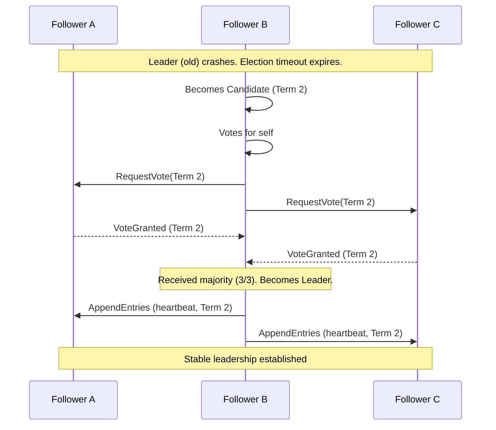
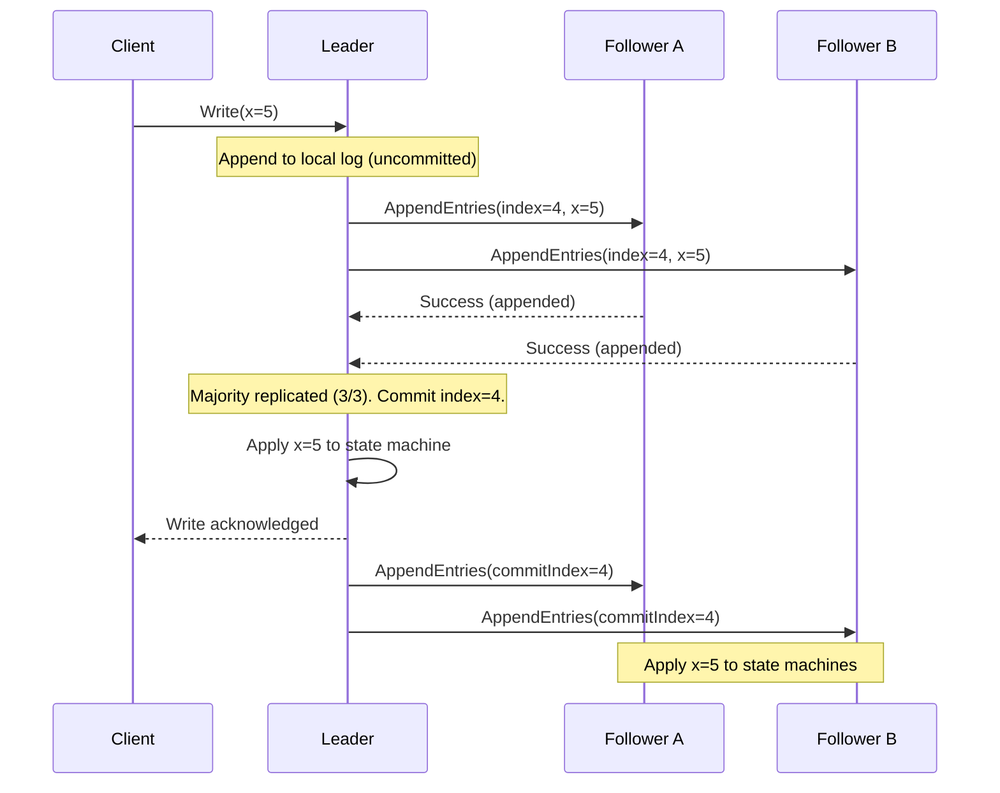
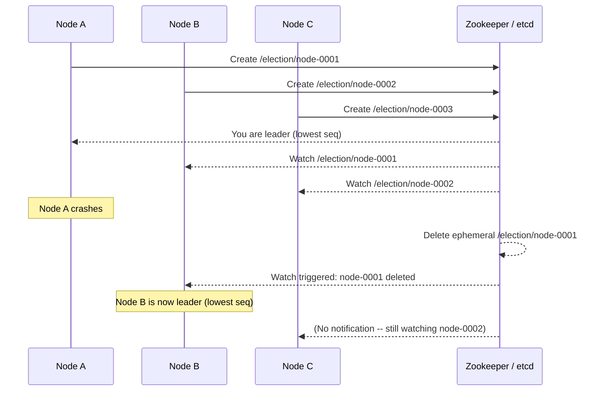
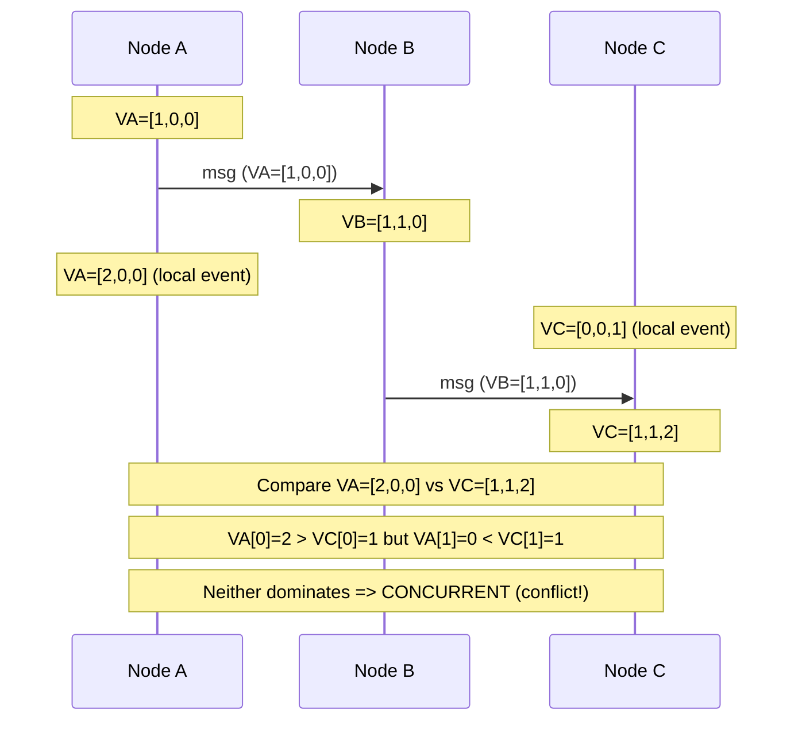
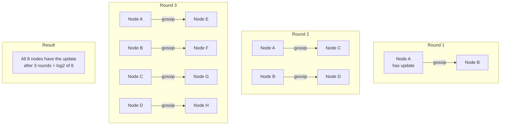
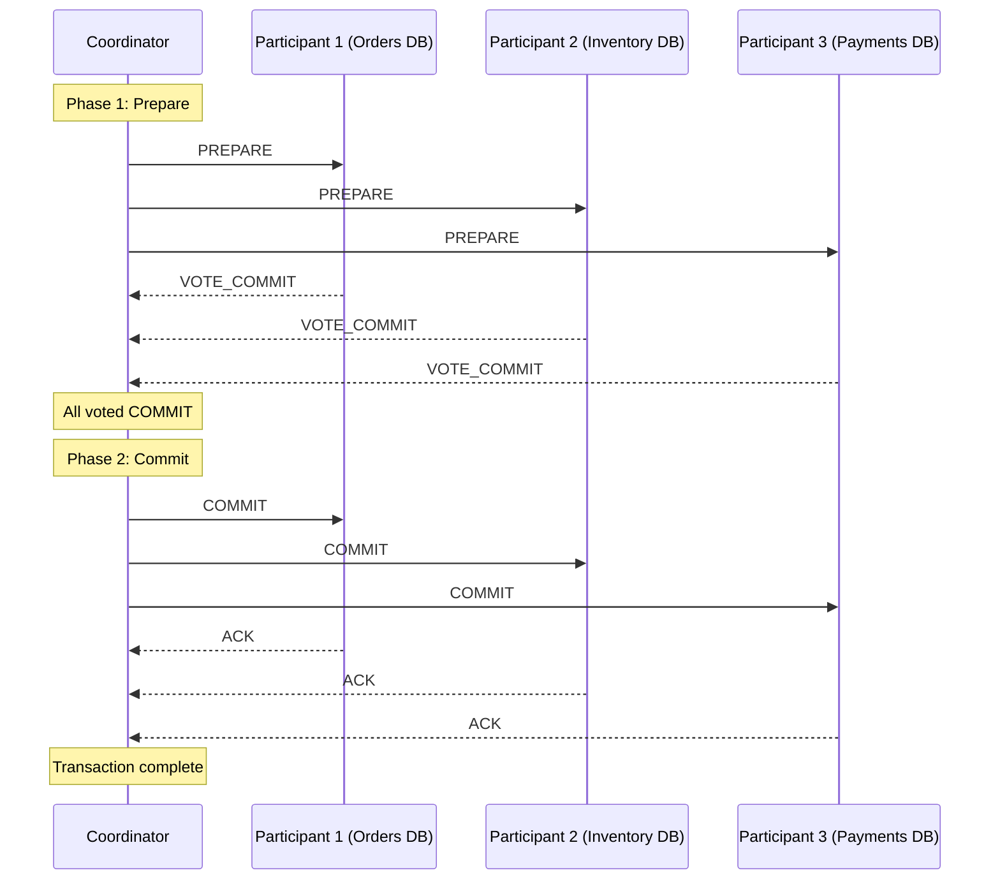
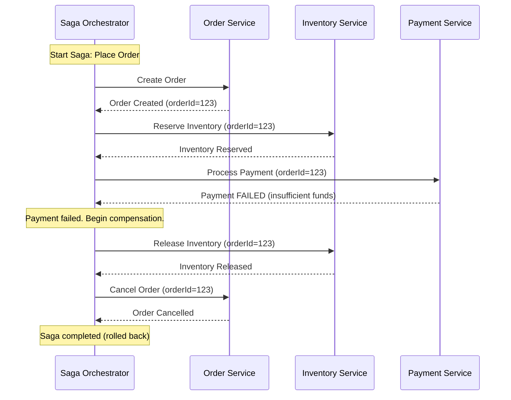

# Distributed Systems Fundamentals

> Core concepts behind distributed computing -- the backbone of every modern large-scale system.
> Understanding consensus, ordering, failure detection, and distributed transactions is essential for system design interviews.

---

## 1. What Makes Systems Distributed

A distributed system is a collection of independent computers that appears to its users as a single coherent system. Components are located on networked computers and communicate by passing messages.

### Why Distributed?

**Scalability** - A single machine has finite CPU, memory, disk, and network bandwidth. Distributing work across many machines allows you to scale horizontally, handling far more load than any single machine ever could.

**Reliability / Fault Tolerance** - If your system runs on one machine and that machine dies, everything is down. Distributing across multiple machines (and multiple data centers) means the system can survive individual failures.

**Geographic Distribution** - Users are spread across the globe. Placing servers close to users reduces latency. A user in Tokyo should not have to round-trip to Virginia for every request.

**Performance** - Parallelism across machines. Tasks that can be partitioned (search indexing, data processing, map-reduce) execute faster when spread across hundreds or thousands of nodes.

### Challenges of Distribution

The moment you split a system across a network, you introduce an entirely new class of problems:

- **Network Partitions** - Machines cannot communicate with each other. You must design for this case because it will happen.
- **Partial Failures** - Some nodes fail while others continue. Unlike a single machine where either everything works or nothing does, partial failure is the norm.
- **Clock Skew** - No two machines have perfectly synchronized clocks. Even with NTP, clocks can drift by milliseconds, making "what happened first?" a surprisingly hard question.
- **Unbounded Latency** - Messages can be delayed arbitrarily. A network call that usually takes 1ms might take 10 seconds.
- **Ordering** - Without a shared clock or memory, determining the order of events across machines requires explicit protocols.
- **Split Brain** - Two parts of the system may independently believe they are the leader, leading to conflicting decisions and data corruption.

### The Eight Fallacies of Distributed Computing

These are assumptions that developers new to distributed systems incorrectly make:

| # | Fallacy | Reality |
|---|---------|---------|
| 1 | The network is reliable | Packets get dropped, connections time out, cables get cut |
| 2 | Latency is zero | Cross-datacenter calls take 50-150ms; even local network calls are microseconds, not nanoseconds |
| 3 | Bandwidth is infinite | Large data transfers saturate network links, especially across regions |
| 4 | The network is secure | Every network hop is an attack surface |
| 5 | Topology does not change | Servers are added/removed, routes change, switches fail over |
| 6 | There is one administrator | Multiple teams, multiple cloud providers, different policies |
| 7 | Transport cost is zero | Serialization, encryption, network I/O all cost CPU and money |
| 8 | The network is homogeneous | Different hardware, different OS versions, different network speeds |

### Key Interview Points

- Distributed does not always mean better -- it adds complexity. Only distribute when you must.
- Every network call can fail, be slow, or return stale data.
- Design for partial failure: every component should handle the case where its dependencies are unavailable.
- The CAP theorem (covered in Section 09) directly follows from these challenges.

---

## 2. Consensus Algorithms

Consensus is the problem of getting multiple nodes to agree on a single value, even in the presence of failures. This is the foundation of replicated state machines, distributed databases, and configuration management.

### 2.1 Raft

Raft was designed to be understandable. It decomposes consensus into three sub-problems: leader election, log replication, and safety.

**Core Concepts:**

- **Terms** - Raft divides time into terms, each beginning with an election. Terms act as a logical clock. If a node sees a higher term, it immediately steps down.
- **Roles** - Every node is in one of three states: Leader, Follower, or Candidate.
- **Leader** - Exactly one leader per term. All client requests go through the leader. The leader replicates log entries to followers.
- **Heartbeats** - The leader sends periodic heartbeats (empty AppendEntries RPCs) to maintain authority. If followers do not hear from the leader within an election timeout, they start a new election.

#### Leader Election



**Election rules:**
- A node votes for at most one candidate per term (first-come-first-served).
- A candidate must receive votes from a majority of nodes.
- Randomized election timeouts (e.g., 150-300ms) prevent split votes.
- If a candidate discovers a leader with a term >= its own, it steps down.

#### Log Replication



**Replication rules:**
- The leader appends the entry to its own log first.
- It sends AppendEntries RPCs to all followers in parallel.
- Once a majority of nodes have replicated the entry, it is committed.
- Committed entries are guaranteed to be durable and never lost.
- Followers apply entries in log order once they learn the commit index.

**Safety guarantees:**
- **Election Safety** - At most one leader per term.
- **Leader Append-Only** - A leader never overwrites or deletes entries in its log.
- **Log Matching** - If two logs contain an entry with the same index and term, then the logs are identical up to and including that entry.
- **Leader Completeness** - If an entry is committed in a given term, it will be present in the logs of all leaders for all subsequent terms.
- **State Machine Safety** - If a server applies a log entry at a given index, no other server will apply a different entry at the same index.

### 2.2 Paxos

Paxos is the original consensus algorithm, proposed by Leslie Lamport. It is provably correct but notoriously difficult to understand and implement.

**Roles:**
- **Proposer** - Proposes values. Usually the node that received the client request.
- **Acceptor** - Votes on proposals. A quorum (majority) of acceptors must agree for a value to be chosen.
- **Learner** - Learns the chosen value. Often all nodes act as learners.

Note: In practice, a single node often plays all three roles simultaneously.

**Phase 1: Prepare / Promise**

1. Proposer selects a proposal number `n` (globally unique, monotonically increasing).
2. Proposer sends `Prepare(n)` to a majority of acceptors.
3. Each acceptor responds with:
   - `Promise(n)` -- promises to never accept proposals numbered less than `n`.
   - If it has already accepted a proposal, it includes the highest-numbered accepted value.

**Phase 2: Accept / Accepted**

1. If the proposer receives promises from a majority:
   - If any acceptor reported a previously accepted value, the proposer must propose that value (the one with the highest proposal number).
   - Otherwise, the proposer can propose its own value.
2. Proposer sends `Accept(n, value)` to the same majority of acceptors.
3. Each acceptor accepts the proposal unless it has already promised a higher proposal number.
4. Once a majority of acceptors accept, the value is chosen.
5. Learners are notified of the chosen value.

**Multi-Paxos:**

Basic Paxos requires two round trips per decision, which is expensive. Multi-Paxos optimizes for the common case:

- A stable leader is elected (using Paxos itself or a simpler mechanism).
- The leader skips Phase 1 for subsequent proposals (it already holds the highest proposal number).
- This reduces consensus to a single round trip -- essentially identical to Raft's log replication.
- Multi-Paxos is what production systems actually use (e.g., Google's Chubby, Spanner).

### 2.3 Raft vs Paxos Comparison

| Aspect | Raft | Paxos |
|--------|------|-------|
| **Understandability** | Designed for clarity; easy to teach | Notoriously difficult to understand |
| **Leader** | Explicit, mandatory strong leader | No inherent leader (Multi-Paxos adds one) |
| **Log Structure** | Logs must be contiguous, no gaps | Allows gaps in the log (slots can be filled independently) |
| **Phases per Decision** | 1 round trip (leader already elected) | 2 round trips (basic), 1 round trip (Multi-Paxos with stable leader) |
| **Correctness Proof** | Straightforward, follows from design | Proven correct, but proofs are complex |
| **Reconfiguration** | Joint consensus (built into the protocol) | Requires additional protocol (e.g., Vertical Paxos) |
| **Implementation Complexity** | Lower -- etcd, Consul use Raft | Higher -- few correct implementations exist |
| **Production Use** | etcd, Consul, CockroachDB, TiKV | Chubby, Spanner (Multi-Paxos), Megastore |
| **Flexibility** | Less flexible; rigid leader-based approach | More flexible; can have multiple concurrent proposers |
| **Performance (stable)** | Similar to Multi-Paxos | Similar to Raft |
| **Failure Handling** | Leader crash triggers election; brief unavailability | Can recover without explicit election (basic Paxos) |

**When to choose what:**
- Raft: When you want simplicity, a well-understood protocol, and strong tooling (etcd, Consul).
- Paxos: When you need maximum flexibility (e.g., out-of-order commits, multiple proposers) or are building a database engine like Spanner.

---

## 3. Leader Election

Leader election is the process by which a group of nodes selects exactly one node to act as the coordinator. The leader handles writes, makes decisions, or coordinates tasks so that the system avoids conflicting actions.

### Why Leader Election is Needed

- **Single writer** - Avoids write conflicts. Only the leader writes; followers replicate.
- **Coordination** - A single coordinator simplifies task assignment, sequencing, and conflict resolution.
- **Consensus** - Algorithms like Raft require a leader to drive log replication.
- **Lease-based locking** - Leader holds a lease; others back off until the lease expires.

### Bully Algorithm

One of the simplest leader election algorithms, designed for systems where each node has a unique numeric ID.

**How it works:**
1. When a node detects the leader has failed, it starts an election.
2. It sends an "Election" message to all nodes with higher IDs.
3. If any higher-ID node responds with "OK", the initiator backs off (the higher node will take over).
4. If no higher-ID node responds within a timeout, the initiator declares itself the leader.
5. The new leader broadcasts a "Coordinator" message to all nodes.

**Pros:** Simple to implement and understand.
**Cons:** Biased toward highest ID. The highest-ID node always wins, even if it is the slowest. O(n^2) messages in the worst case. Not partition-tolerant.

### Ring Algorithm

Designed for systems organized in a logical ring topology.

**How it works:**
1. When a node detects the leader has failed, it sends an "Election" message around the ring containing its own ID.
2. Each node that receives the message appends its own ID and forwards it.
3. When the message returns to the initiator, it contains all live node IDs.
4. The node with the highest ID in the list is declared the leader.
5. A "Coordinator" message is sent around the ring announcing the result.

**Pros:** O(n) messages. Works well in ring-structured overlay networks.
**Cons:** Assumes a reliable ring. Slow if the ring is large.

### Leader Election with Zookeeper / etcd

Production systems almost never use Bully or Ring algorithms. Instead, they rely on a distributed coordination service:

**Zookeeper (Ephemeral Sequential Nodes):**
1. Each node creates an ephemeral sequential znode under `/election/` (e.g., `/election/node-0001`).
2. The node with the lowest sequence number is the leader.
3. All other nodes set a watch on the znode immediately before theirs (herd effect avoidance).
4. When the leader crashes, its ephemeral node is deleted. The next-lowest node is notified and becomes leader.

**etcd (Lease-Based):**
1. A node attempts to create a key (e.g., `/leader`) with a lease (TTL).
2. If the key does not exist, the node becomes the leader and periodically refreshes the lease.
3. Other nodes watch the key. When the lease expires (leader crashed or failed to renew), a new node creates the key.
4. etcd's built-in concurrency primitives (`concurrency.Election`) handle this pattern natively.



### Key Interview Points

- Leader election is a specific application of consensus.
- In practice, always use a coordination service (Zookeeper, etcd, Consul) rather than implementing election yourself.
- Fencing tokens / lease epochs prevent "zombie leaders" (a node that was leader but was partitioned and did not realize it lost leadership).
- Leader election introduces a single point of bottleneck (all writes go through leader) -- this is a trade-off for simplicity.

---

## 4. Clocks & Ordering

In a distributed system, there is no global clock. Determining the order of events is one of the hardest fundamental problems.

### 4.1 Lamport Timestamps

Proposed by Leslie Lamport in 1978, Lamport timestamps provide a logical clock that gives a partial ordering of events.

**Rules:**
1. Each process maintains a counter `C` (initialized to 0).
2. Before executing an event, increment `C`: `C = C + 1`.
3. When sending a message, attach the current `C` to the message.
4. When receiving a message with timestamp `T`: `C = max(C, T) + 1`.

**Happens-Before Relation (->):**
- If `a` and `b` are events in the same process and `a` comes before `b`, then `a -> b`.
- If `a` is a send event and `b` is the corresponding receive event, then `a -> b`.
- If `a -> b` and `b -> c`, then `a -> c` (transitivity).

**Properties:**
- If `a -> b`, then `L(a) < L(b)` (Lamport timestamp of `a` is less than `b`).
- The converse is NOT true: `L(a) < L(b)` does NOT imply `a -> b`. The events could be concurrent.
- Lamport timestamps cannot detect concurrency. They only provide a partial order.

**Use Cases:**
- Ordering events in a distributed log.
- Assigning monotonically increasing IDs (combined with node ID for uniqueness).

### 4.2 Vector Clocks

Vector clocks extend Lamport timestamps to detect concurrency. Each node maintains a vector of counters, one per node in the system.

**Rules (for a system with N nodes):**
1. Each node `i` maintains a vector `V[0..N-1]` (initialized to all zeros).
2. Before executing an event, node `i` increments `V[i]`.
3. When sending a message, node `i` attaches its entire vector `V`.
4. When node `i` receives a message with vector `V_msg`:
   - `V[j] = max(V[j], V_msg[j])` for all `j`.
   - Then increment `V[i]`.

**Comparing Vector Clocks:**
- `V1 <= V2` if `V1[i] <= V2[i]` for ALL `i`. This means `V1` happened before or equals `V2`.
- `V1 < V2` (strictly) if `V1 <= V2` and `V1 != V2`. This means `V1` happened before `V2`.
- `V1 || V2` (concurrent) if neither `V1 <= V2` nor `V2 <= V1`. This means the events are concurrent and potentially conflicting.

**Conflict Detection:**

Vector clocks are used in systems like Amazon Dynamo to detect conflicting writes. When two writes have concurrent vector clocks, the system knows they conflict and can present both versions to the application for resolution (or use last-writer-wins, CRDTs, etc.).



**Limitations:**
- Vector size grows with the number of nodes. For large clusters, this is impractical.
- Garbage collection of old entries requires careful coordination.
- In practice, systems use techniques like dotted version vectors or bounded vector clocks.

### 4.3 Hybrid Logical Clocks (HLC)

HLCs combine physical (wall clock) time with logical counters to get the best of both worlds.

**Structure of an HLC timestamp:** `(physical_time, logical_counter, node_id)`

**Rules:**
1. On a local event or send: `physical = max(local_clock, hlc.physical)`. If `physical` did not advance, increment `logical`; otherwise reset `logical` to 0.
2. On receive with HLC `(pt_msg, lc_msg)`:
   - `physical = max(local_clock, hlc.physical, pt_msg)`.
   - Adjust `logical` based on which of the three was the max.

**Properties:**
- HLC timestamps are always close to real wall clock time (bounded drift).
- They provide causal ordering like Lamport timestamps.
- They can be used as drop-in replacements for physical timestamps in databases.
- Used in CockroachDB, MongoDB, and other distributed databases.

**Why HLC over pure Lamport or Vector Clocks?**
- Lamport timestamps have no connection to real time.
- Vector clocks are expensive (O(n) per timestamp).
- HLC gives you causal ordering with timestamps that are meaningful in real time, using only O(1) space.

### Clock Comparison

| Property | Lamport | Vector | HLC |
|----------|---------|--------|-----|
| **Size** | O(1) -- single integer | O(n) -- one entry per node | O(1) -- physical + logical + node |
| **Detects Causality** | Partial (one direction only) | Full | Partial (same as Lamport) |
| **Detects Concurrency** | No | Yes | No |
| **Connected to Real Time** | No | No | Yes |
| **Bounded Drift from Wall Clock** | No | No | Yes |
| **Production Use** | Ordering events, IDs | Amazon Dynamo, Riak | CockroachDB, MongoDB |

---

## 5. Gossip Protocol

Gossip (also called epidemic protocol) is a peer-to-peer communication mechanism where nodes periodically exchange state with random peers. Information spreads through the cluster like a rumor or virus.

### How It Works

1. Each node maintains some local state (e.g., membership list, health status, key-value data).
2. Periodically (every T seconds, typically 1-2s), each node selects `k` random peers (usually `k=1` to `k=3`).
3. The node sends its state to the selected peer(s).
4. The receiving node merges the incoming state with its own (using timestamps, version numbers, or set union).
5. Over successive rounds, all nodes converge to the same state.

### Convergence Time

- In a cluster of `N` nodes, gossip converges in `O(log N)` rounds.
- With 1000 nodes and a 1-second gossip interval, full convergence takes roughly 10 seconds (log2(1000) ~ 10).
- This is remarkably fast and scales logarithmically.

### Gossip Variants

| Variant | Mechanism | Use Case |
|---------|-----------|----------|
| **Push** | Sender pushes its state to a random peer | Fast initial spread |
| **Pull** | Node asks a random peer for its state | Good for catching up after being offline |
| **Push-Pull** | Both nodes exchange state in a single round | Fastest convergence; most common in practice |

### Use Cases

**Membership / Failure Detection:**
- Each node gossips a membership list with heartbeat counters.
- If a node's heartbeat counter has not increased after a threshold, it is suspected of failure.
- Used by Cassandra, Consul, and SWIM (see Section 7).

**Data Dissemination:**
- Spread configuration changes, schema updates, or small data items.
- Used by Amazon's Dynamo for membership and routing table updates.

**Aggregate Computation:**
- Compute distributed averages, counts, sums via gossip.
- Each node gossips its local value; nodes compute running averages when they merge.



### Pros and Cons

**Pros:**
- Scalable: O(log N) convergence, O(1) per-node cost per round.
- Fault-tolerant: No single point of failure. Works even with partitions (eventual convergence).
- Simple: Easy to implement and reason about.

**Cons:**
- Eventually consistent, not strongly consistent. Not suitable when you need immediate agreement.
- Redundant messages: The same information is sent multiple times as nodes gossip overlapping state.
- Convergence time is probabilistic, not deterministic.

### Key Interview Points

- Gossip is used for background, non-critical-path dissemination (membership, failure detection, configuration).
- It is NOT used for consensus or strong consistency.
- Cassandra uses gossip for cluster membership and failure detection.
- Consul uses a SWIM-based gossip protocol (Serf) for membership.

---

## 6. Distributed Transactions

When a single logical transaction spans multiple services or databases, you need a protocol to ensure atomicity: either all participants commit or all abort.

### 6.1 Two-Phase Commit (2PC)

The classic protocol for distributed atomic commits. A single coordinator drives the decision.

**Phase 1: Prepare (Voting)**
1. Coordinator sends `PREPARE` to all participants.
2. Each participant executes the transaction locally (acquires locks, writes to WAL) but does NOT commit.
3. Each participant responds with `VOTE_COMMIT` (ready) or `VOTE_ABORT` (cannot proceed).

**Phase 2: Commit / Abort (Decision)**
1. If ALL participants voted `COMMIT`: coordinator sends `COMMIT` to all.
2. If ANY participant voted `ABORT`: coordinator sends `ABORT` to all.
3. Participants execute the decision and release locks.



**The Blocking Problem:**

2PC's critical flaw is that it is a blocking protocol:
- If the coordinator crashes after sending `PREPARE` but before sending the decision, all participants are stuck.
- Participants have voted `COMMIT` and are holding locks, but they do not know the final decision.
- They cannot unilaterally commit (another participant might have voted `ABORT`) or abort (the coordinator might have decided to commit).
- They must wait for the coordinator to recover. This can hold locks indefinitely.

**Other issues:**
- Coordinator is a single point of failure.
- Latency: 2 round trips in the happy path.
- Lock contention: Locks are held for the entire duration of both phases.

### 6.2 Three-Phase Commit (3PC)

3PC adds an intermediate phase to make the protocol non-blocking under certain failure assumptions.

**Phases:**
1. **CanCommit** - Coordinator asks participants if they can commit. Participants respond yes/no. (Same as 2PC Phase 1 but without acquiring locks.)
2. **PreCommit** - If all said yes, coordinator sends `PRE_COMMIT`. Participants acquire locks and prepare. They acknowledge. This is the key difference: all participants now know that every other participant voted yes.
3. **DoCommit** - Coordinator sends `DO_COMMIT`. Participants finalize.

**Why it helps:**
- If the coordinator crashes after Phase 2, any participant that received `PRE_COMMIT` knows the decision was to commit (because all participants voted yes). It can safely proceed.
- If a participant did NOT receive `PRE_COMMIT`, it knows the transaction should abort.
- The protocol is non-blocking as long as there are no network partitions.

**Limitations:**
- 3PC is NOT safe under network partitions. A partition can cause some nodes to commit and others to abort (split brain).
- Adds an extra round trip (3 phases vs 2).
- Rarely used in practice. Most systems prefer 2PC with a highly available coordinator, or use alternative patterns (Saga).

### 6.3 Saga Pattern

The Saga pattern replaces a single distributed transaction with a sequence of local transactions, each with a compensating action. If any step fails, the previously completed steps are undone via their compensating transactions.

**Key Idea:** Instead of locking resources across services for the duration of a distributed transaction, each service commits locally and publishes an event. If a downstream step fails, compensating transactions roll back the effects of prior steps.

**Two coordination styles:**

**Choreography (Event-Driven):**
- Each service listens for events and decides what to do next.
- No central coordinator.
- Services are loosely coupled.
- Harder to track overall saga status and debug failures.

**Orchestration (Central Coordinator):**
- A saga orchestrator tells each service what to do next.
- Easier to understand, test, and monitor.
- The orchestrator is a potential single point of failure (mitigate with replication).



**Compensating Transactions Examples:**

| Forward Action | Compensating Action |
|---------------|---------------------|
| Create Order | Cancel Order |
| Reserve Inventory | Release Inventory |
| Charge Payment | Refund Payment |
| Send Email | Send Cancellation Email |
| Ship Package | Initiate Return |

**Saga vs 2PC:**

| Aspect | 2PC | Saga |
|--------|-----|------|
| **Consistency** | Strong (ACID) | Eventual (BASE) |
| **Isolation** | Full (locks held) | Partial (intermediate states visible) |
| **Locking** | Locks held across services | No cross-service locks |
| **Latency** | Higher (blocking) | Lower (non-blocking) |
| **Complexity** | Lower (one protocol) | Higher (compensating logic per step) |
| **Scalability** | Lower (lock contention) | Higher (no distributed locks) |
| **Failure Recovery** | Coordinator recovery | Compensating transactions |
| **Use Case** | Databases (XA), short-lived txns | Microservices, long-running workflows |

### Key Interview Points

- 2PC is used within a single database cluster (e.g., Postgres distributed commits) but rarely across microservices.
- Saga is the go-to pattern for microservice architectures where you cannot hold distributed locks.
- Sagas require careful design of compensating transactions -- not all actions are easily reversible (e.g., sending an email).
- Idempotency is critical in Sagas. Steps and compensations may be retried, so they must be safe to execute multiple times.

---

## 7. Failure Detection

Detecting whether a remote node is alive or dead is a fundamental problem. You cannot distinguish between a dead node and a slow node -- you can only suspect failure.

### Heartbeat-Based Detection

The simplest approach: nodes periodically send heartbeat messages.

**How it works:**
1. Every node sends a heartbeat (e.g., "I'm alive" message with a counter) to a monitor or peers at a fixed interval (e.g., every 1 second).
2. If the monitor does not receive a heartbeat from a node within a timeout (e.g., 5 seconds), it marks the node as failed.

**Trade-offs:**
- Short timeout: Faster failure detection, but more false positives (a slow node or network hiccup triggers false failure).
- Long timeout: Fewer false positives, but slower detection of actual failures.
- Fixed thresholds do not adapt to changing network conditions.

**Common configuration:**
- Heartbeat interval: 1-5 seconds.
- Failure threshold: 3-5 missed heartbeats.
- Example: Heartbeat every 2 seconds, mark failed after 3 misses = 6-second detection time.

### Phi Accrual Failure Detector

An adaptive failure detector that outputs a suspicion level (phi) rather than a binary alive/dead decision.

**How it works:**
1. The detector maintains a sliding window of inter-arrival times of heartbeats from each node.
2. It computes the probability that the next heartbeat is late, given the observed distribution.
3. It outputs `phi = -log10(P(late))`. Higher phi = more suspicious.
4. The application sets a threshold (e.g., phi > 8 means failed). Different applications can use different thresholds.

**Advantages:**
- Adapts to network conditions automatically. If heartbeats are normally noisy (variable latency), the detector is more tolerant.
- No fixed timeout to tune.
- Provides a continuous suspicion metric rather than a binary decision.

**Used by:** Cassandra, Akka.

### SWIM Protocol (Scalable Weakly-consistent Infection-style Membership)

SWIM is a gossip-based membership protocol optimized for large clusters.

**How it works:**
1. Each node periodically picks a random peer and sends a `PING`.
2. If the peer responds with `ACK`, it is alive.
3. If no `ACK` within a timeout, the node sends `PING-REQ` to `k` random other nodes, asking them to ping the suspect on its behalf.
4. If any of the `k` nodes get an `ACK` from the suspect, the suspect is alive (the original ping failure was a network issue between two specific nodes).
5. If none of the `k` nodes get an `ACK`, the suspect is marked as failed.
6. Failure information is disseminated via piggybacking on regular gossip messages.

**Why SWIM is better than all-to-all heartbeats:**
- All-to-all heartbeats: O(n^2) messages per round. Does not scale.
- SWIM: O(n) messages per round. Each node sends O(1) pings.
- The indirect probing (PING-REQ) reduces false positives caused by asymmetric network issues.

**SWIM Variants:**
- **Lifeguard (Hashicorp):** Extension used by Consul's Serf library. Adds self-awareness: if a node is suspected, it proactively refutes by broadcasting its own liveness. Reduces false positive rate.

### Failure Detection Comparison

| Aspect | Heartbeat | Phi Accrual | SWIM |
|--------|-----------|-------------|------|
| **Scalability** | O(n) to O(n^2) | O(n) | O(n) |
| **False Positives** | Fixed threshold, can be high | Adaptive, lower | Low (indirect probing) |
| **Detection Speed** | Fixed (timeout-based) | Adaptive | Configurable |
| **Network Overhead** | Moderate to high | Moderate | Low |
| **Complexity** | Very low | Moderate | Moderate |
| **Used By** | Zookeeper, Redis Sentinel | Cassandra, Akka | Consul (Serf), Memberlist |

### Key Interview Points

- You can never be 100% sure a node is dead -- you can only suspect.
- The fundamental trade-off: detection speed vs. false positive rate.
- SWIM is the state of the art for large-scale membership and failure detection.
- Failure detection feeds into leader election, replication, and rebalancing. Getting it wrong (false positives) causes unnecessary failovers and data movement.

---

## 8. Quick Reference Summary

### Core Concepts at a Glance

| Concept | What It Solves | Key Algorithm/Protocol | Production Systems |
|---------|---------------|----------------------|-------------------|
| **Consensus** | Agreement among nodes | Raft, Paxos | etcd, Consul, Zookeeper, Spanner |
| **Leader Election** | Single coordinator | Raft election, ZK ephemeral nodes | etcd, Consul, Zookeeper |
| **Ordering** | Event sequencing without global clock | Lamport, Vector, HLC | Dynamo (vector), CockroachDB (HLC) |
| **Gossip** | Decentralized information spread | Push-Pull epidemic | Cassandra, Consul (Serf) |
| **Distributed Txn** | Atomicity across services | 2PC, Saga | XA (databases), microservices (Saga) |
| **Failure Detection** | Detecting dead nodes | SWIM, Phi Accrual | Consul, Cassandra |

### Decision Matrix for Common Scenarios

| Scenario | Recommended Approach | Why |
|----------|---------------------|-----|
| Replicated key-value store | Raft consensus | Strong consistency, well-understood, good tooling |
| Configuration management | Zookeeper / etcd (Raft-based) | Reliable leader election, watches, distributed locking |
| Cluster membership | Gossip (SWIM) | Scales to thousands of nodes, no SPOF |
| Cross-service transaction | Saga pattern (orchestration) | No distributed locks, works with microservices |
| Single-database distributed commit | 2PC (XA) | Strong ACID within a database cluster |
| Conflict detection in AP system | Vector clocks | Detects concurrent writes for resolution |
| Timestamp ordering in NewSQL DB | Hybrid Logical Clocks | Causal ordering with real-time semantics |
| Failure detection in large cluster | SWIM + Phi Accrual | Low overhead, adaptive, few false positives |

### Key Numbers to Remember

```
Consensus:
  - Raft election timeout:       150-300 ms (randomized)
  - Raft heartbeat interval:     50-100 ms
  - Minimum quorum (N nodes):    floor(N/2) + 1
  - 3-node cluster tolerates:    1 failure
  - 5-node cluster tolerates:    2 failures
  - 7-node cluster tolerates:    3 failures

Gossip:
  - Convergence time:            O(log N) rounds
  - 1000 nodes, 1s interval:    ~10 seconds to full convergence
  - Per-node messages per round: O(1)

Clocks:
  - NTP accuracy:                1-10 ms (LAN), 10-100 ms (WAN)
  - Google TrueTime accuracy:    ~7 ms (atomic clocks + GPS)
  - Clock drift rate:            ~10-20 ppm (parts per million)
  - 20 ppm drift:                ~1.7 seconds/day

Failure Detection:
  - Typical heartbeat interval:  1-5 seconds
  - Typical failure threshold:   3-5 missed heartbeats
  - SWIM detection time:         ~2-5 seconds (configurable)

Distributed Transactions:
  - 2PC latency:                 2 round trips (prepare + commit)
  - 3PC latency:                 3 round trips
  - Saga step:                   1 local transaction + 1 event/message
```

### Common Interview Patterns

**"Design a distributed key-value store"**
- Use Raft for consensus (leader-based writes, follower reads).
- Partition data using consistent hashing.
- Use gossip for membership and failure detection.
- Use vector clocks or HLC for conflict detection (if AP).

**"How does your system handle a network partition?"**
- CP systems: Minority partition becomes unavailable. Majority continues operating.
- AP systems: Both partitions continue serving reads/writes. Conflicts resolved on merge (vector clocks, CRDTs, last-writer-wins).
- Raft: Only the partition with the majority quorum can elect a leader and make progress.

**"How do you ensure exactly-once delivery across services?"**
- You cannot achieve exactly-once in the general case. Aim for at-least-once delivery + idempotent processing.
- Use idempotency keys, deduplication tables, or transactional outbox patterns.
- Saga pattern: Ensure each step and its compensation are idempotent.

**"How does Google Spanner achieve strong consistency globally?"**
- Uses Multi-Paxos for consensus.
- TrueTime API (atomic clocks + GPS) provides bounded clock uncertainty (~7ms).
- Commit-wait: After a write, wait out the clock uncertainty bound before reporting success. Guarantees external consistency (linearizability).

**"Compare Zookeeper vs etcd for coordination"**

| Feature | Zookeeper | etcd |
|---------|-----------|------|
| Consensus | ZAB (Zookeeper Atomic Broadcast) | Raft |
| Data Model | Hierarchical (znodes, like filesystem) | Flat key-value (with prefix ranges) |
| Watch Mechanism | One-time triggers (must re-register) | Persistent watches (streams) |
| Language | Java | Go |
| API | Custom TCP protocol | gRPC + HTTP/JSON |
| Ecosystem | Hadoop, Kafka, HBase | Kubernetes, Consul, CoreDNS |
| Ephemeral Data | Ephemeral znodes (session-based) | Leases (TTL-based) |

---

> **TL;DR**: Distributed systems trade simplicity for scalability and reliability. Use Raft for consensus (simpler) or Paxos (more flexible). Leader election via Zookeeper/etcd avoids split brain. Lamport timestamps order events; vector clocks detect conflicts; HLCs bridge logical and physical time. Gossip spreads information in O(log N) rounds. Use 2PC within databases, Sagas across microservices. SWIM and Phi Accrual detect failures adaptively. Always design for partial failure, network partitions, and clock skew.
