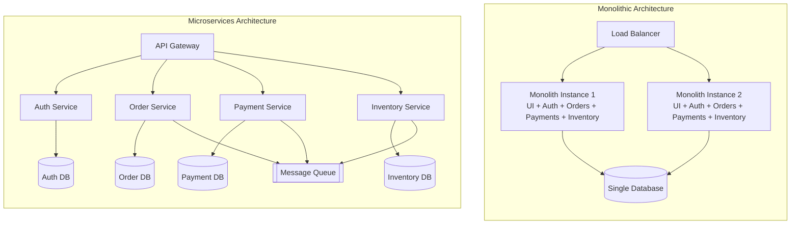
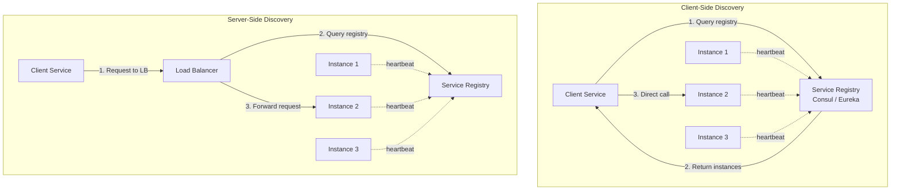
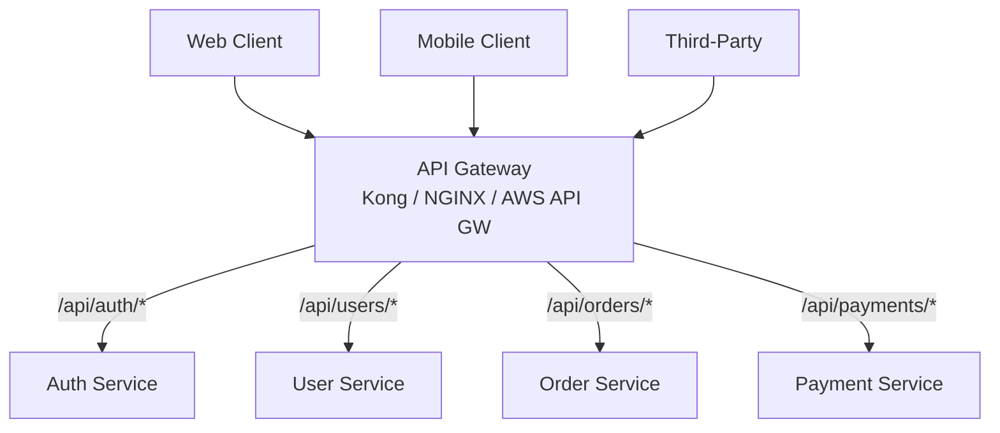
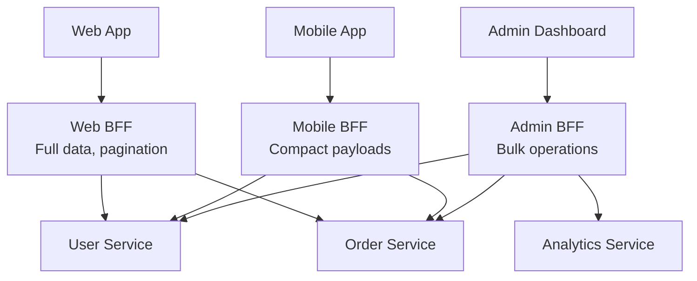
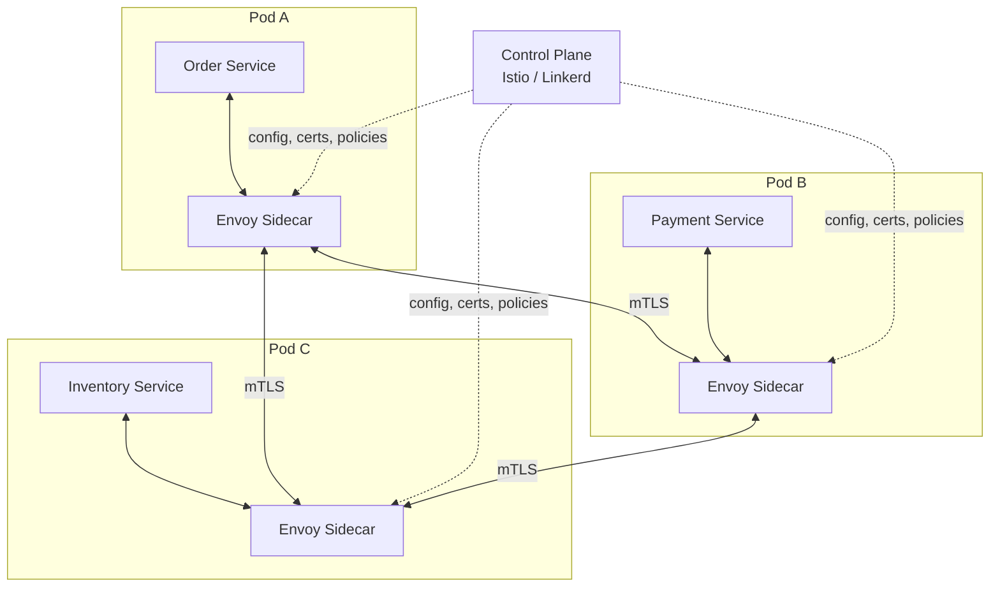
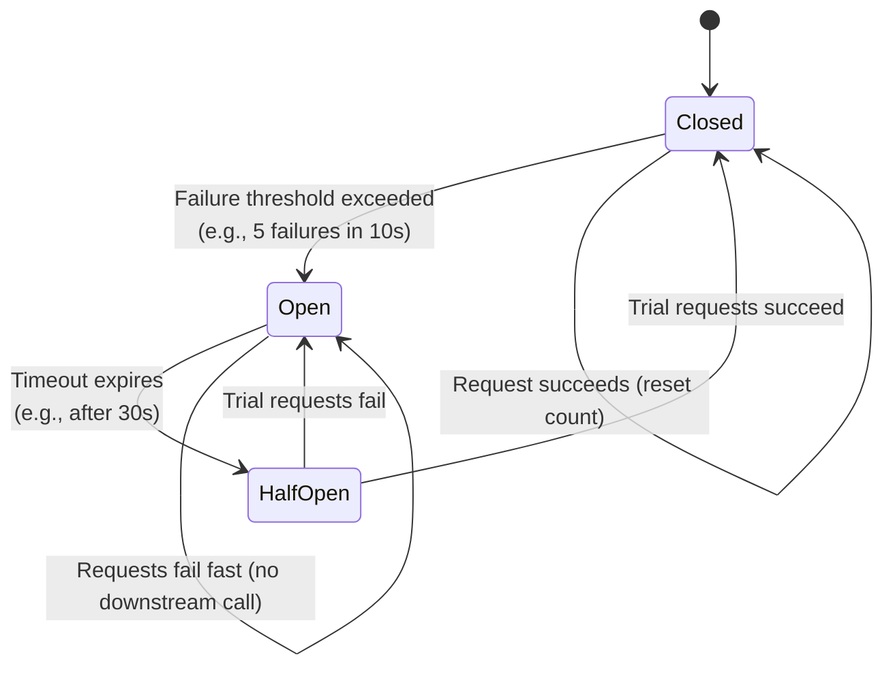
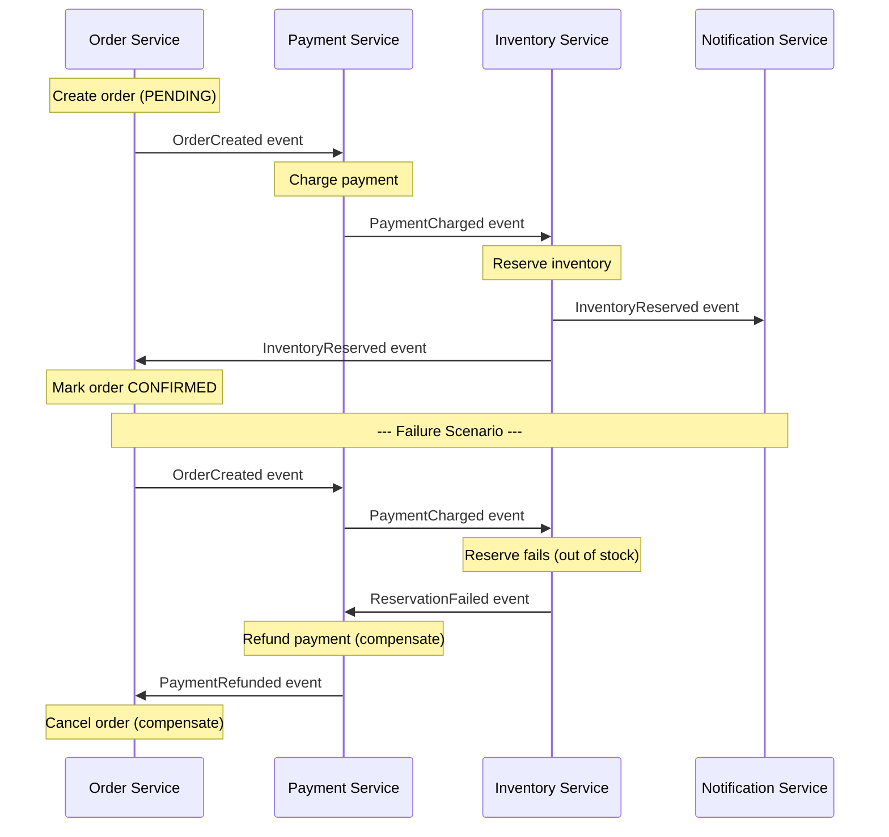
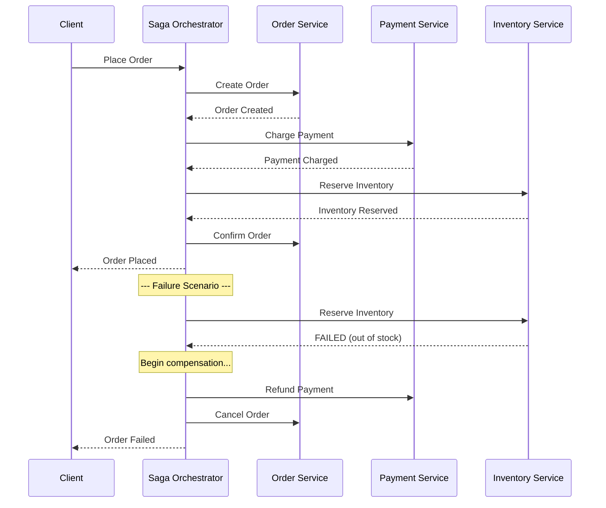

# Microservices Architecture

> Comprehensive guide to microservices architecture for system design interviews.
> Covers service communication, discovery, resilience patterns, data management, and decomposition strategies.

---

## 1. Monolith vs Microservices

### 1.1 Monolithic Architecture

A monolith is a single deployable unit where all components — UI, business logic, data access — are packaged together into one application.

**Advantages:** Simple to develop, test, and deploy. Single codebase. No network latency between components (in-process calls). Strong data consistency with ACID transactions. One thing to monitor and scale.

**Disadvantages:** Deployment coupling (small change = full redeploy). All-or-nothing scaling. Technology lock-in. A bug in one module can crash the entire app. Large teams face merge conflicts and coordination overhead.

### 1.2 Microservices Architecture

Microservices decompose an application into small, independently deployable services. Each service owns its own data, runs in its own process, and communicates over the network.

**Advantages:** Independent deployment and scaling. Technology freedom per service. Team autonomy. Fault isolation.

**Disadvantages:** Distributed system complexity (network failures, partial failures). Data consistency is hard. Operational overhead (many services to deploy, monitor, debug). A single request may span 10+ services (need distributed tracing).

### 1.3 Architecture Comparison



### 1.4 Comparison Table

| Aspect | Monolith | Microservices |
|---|---|---|
| **Deployment** | Single unit, all-or-nothing | Independent per service |
| **Scaling** | Scale entire application | Scale individual services |
| **Tech Stack** | Single language/framework | Polyglot (per-service choice) |
| **Team Structure** | Large team, shared codebase | Small teams, service ownership |
| **Data Management** | Single shared database | Database per service |
| **Consistency** | Strong (ACID transactions) | Eventual (saga pattern) |
| **Debugging** | Single process, stack traces | Distributed tracing required |
| **Operational Cost** | Low | High (many services to manage) |
| **Initial Velocity** | Fast | Slower (infrastructure overhead) |
| **Long-term Velocity** | Slows as codebase grows | Stays high with good boundaries |
| **Fault Isolation** | Low (one crash = all down) | High (failure is contained) |
| **Best For** | Small teams, early-stage | Large orgs, complex domains, scale |

> **Interview Tip:** Don't default to microservices. Start with why — team size, scaling needs, deployment frequency, domain complexity. Many successful companies started as monoliths and migrated later (Shopify, Etsy).

---

## 2. Service Communication

### 2.1 Synchronous Communication

The caller sends a request and blocks (or awaits) until it receives a response.

**REST (HTTP/JSON)** — Services expose HTTP endpoints using JSON payloads. Simple, widely understood, human-readable. Higher latency due to text-based serialization. Best for public APIs.

**gRPC (HTTP/2 + Protocol Buffers)** — High-performance RPC using binary serialization and HTTP/2. 5-10x faster than REST. Built-in streaming (unary, server, client, bidirectional). Strong typing via proto files. Not human-readable. Best for internal service-to-service.

```protobuf
service InventoryService {
  rpc GetStock(StockRequest) returns (StockResponse);
  rpc WatchStock(StockRequest) returns (stream StockUpdate);
}
```

| Feature | REST | gRPC |
|---|---|---|
| **Protocol** | HTTP/1.1 (or HTTP/2) | HTTP/2 |
| **Serialization** | JSON (text) | Protocol Buffers (binary) |
| **Performance** | Moderate | High (5-10x faster) |
| **Streaming** | Limited (SSE, WebSocket) | Built-in (4 patterns) |
| **Schema** | Optional (OpenAPI) | Required (proto files) |
| **Browser Support** | Native | Requires gRPC-Web |
| **Best For** | Public APIs, simple CRUD | Internal service-to-service |

### 2.2 Asynchronous Communication

The caller sends a message and does not wait for a response.

**Message Queues (Point-to-Point)** — A producer sends a message to a queue. One consumer picks it up. Message removed after consumption. Tools: RabbitMQ, SQS, Redis Streams.

**Event Streaming (Pub/Sub)** — A producer publishes to a topic. Multiple subscribers consume independently. Events retained for a configurable period. Tools: Kafka, Google Pub/Sub, NATS.

| Feature | Message Queue | Event Streaming |
|---|---|---|
| **Delivery** | One consumer per message | Multiple subscribers per event |
| **Retention** | Removed after consumption | Retained for configurable period |
| **Ordering** | FIFO within queue | Per-partition ordering |
| **Replay** | Not supported | Supported (replay from offset) |
| **Use Case** | Task distribution, work queues | Event sourcing, data pipelines |

### 2.3 When to Use Which

| Scenario | Recommended | Reason |
|---|---|---|
| Need immediate response | Synchronous (REST/gRPC) | Caller needs data now |
| Fire-and-forget (send email) | Async (message queue) | No need to wait |
| Fan-out to multiple services | Async (pub/sub) | Decouple producers from consumers |
| High-throughput internal calls | gRPC | Binary serialization, HTTP/2 |
| Public-facing API | REST | Universally understood |
| Long-running workflows | Async (queue + saga) | Avoid blocking the caller |

---

## 3. Service Discovery

In a dynamic microservices environment, service instances are created and destroyed constantly. Service discovery maintains a live registry of available instances.

### 3.1 Client-Side vs Server-Side Discovery

**Client-Side:** Client queries the registry directly and picks an instance (load balancing in the client). No extra network hop, but couples discovery logic into every client. Examples: Netflix Eureka + Ribbon.

**Server-Side:** Client sends request to a load balancer, which queries the registry and forwards. Client stays simple but adds an extra hop. Examples: AWS ALB + ECS, Kubernetes Service.

### 3.2 Service Discovery Diagram



### 3.3 Service Registry Tools

| Tool | Consensus | Health Checks | Notes |
|---|---|---|---|
| **Consul** | Raft | HTTP, TCP, gRPC, script | Multi-datacenter support |
| **Eureka** | Peer replication | Heartbeat-based | AP system (favors availability) |
| **etcd** | Raft | TTL leases | Used by Kubernetes |
| **ZooKeeper** | ZAB | Ephemeral nodes | Battle-tested, operationally heavy |
| **K8s DNS** | etcd-backed | Readiness/liveness probes | Built-in on Kubernetes |

> **Interview Tip:** In Kubernetes, service discovery is built-in via DNS (`order-service.default.svc.cluster.local`). Mention this if the context is K8s.

---

## 4. API Gateway

A single entry point for all client requests, handling cross-cutting concerns.

### 4.1 Core Responsibilities

| Responsibility | Description |
|---|---|
| **Routing** | Route requests to the correct microservice based on path/headers |
| **Authentication** | Validate tokens (JWT, OAuth) before reaching services |
| **Rate Limiting** | Throttle requests per client/IP |
| **Protocol Translation** | REST from clients, gRPC to internal services |
| **SSL Termination** | HTTPS at gateway, HTTP internally |
| **Load Balancing** | Distribute traffic across instances |
| **Circuit Breaking** | Fail fast when downstream is unhealthy |

### 4.2 API Gateway Architecture



### 4.3 BFF (Backend for Frontend) Pattern

Create a dedicated gateway for each client type, tailored to its needs.



**Why BFF?** Mobile needs compact payloads; web handles richer data. Admin needs aggregated views. Different auth per client type (cookie vs token vs API key). Each BFF evolves with its frontend team.

> **Interview Tip:** Avoid making the API Gateway a "god service" with business logic. It should handle only cross-cutting infrastructure concerns.

---

## 5. Service Mesh

A dedicated infrastructure layer for service-to-service communication. Moves networking concerns (retries, mTLS, observability) out of application code.

### 5.1 Sidecar Proxy Pattern

Every service gets a sidecar proxy (Envoy). All traffic flows through the sidecar. Application code is unaware of the mesh.



### 5.2 What It Handles

| Capability | Description |
|---|---|
| **Traffic Management** | Load balancing, traffic splitting (canary), retries, timeouts |
| **Security** | mTLS between all services, identity-based access policies |
| **Observability** | Distributed tracing, metrics, access logs — no code changes |
| **Resilience** | Retries, circuit breaking, rate limiting, fault injection |

### 5.3 Service Mesh Tools

| Tool | Data Plane | Notes |
|---|---|---|
| **Istio** | Envoy | Most feature-rich, complex to operate |
| **Linkerd** | linkerd2-proxy (Rust) | Lighter weight, simpler |
| **Consul Connect** | Envoy or built-in | Multi-platform, not K8s-only |
| **AWS App Mesh** | Envoy | Managed, integrates with ECS/EKS |

**Use when:** Dozens+ services, need mTLS everywhere, centralized traffic policies.
**Avoid when:** < 5-10 services, team lacks K8s expertise, sidecar latency (~1-2ms/hop) is unacceptable.

---

## 6. Circuit Breaker Pattern

Prevents a service from repeatedly calling a failing downstream dependency. "Trips" when failures exceed a threshold — subsequent calls fail fast.

### 6.1 State Diagram



| State | Behavior |
|---|---|
| **Closed** | Normal. Failures counted. If threshold exceeded, transition to Open. |
| **Open** | All requests fail immediately. After timeout, transition to Half-Open. |
| **Half-Open** | Limited trial requests. Success = Closed. Failure = Open. |

### 6.2 Configuration

| Parameter | Example Value |
|---|---|
| Failure threshold | 5 failures |
| Time window | 10 seconds |
| Open timeout | 30 seconds |
| Half-Open trial count | 3 requests |
| Success threshold (Half-Open) | 3 consecutive |

### 6.3 Tools

Resilience4j (Java), Polly (.NET), opossum (Node.js), gobreaker (Go), Envoy/Istio (infrastructure-level).

### 6.4 Related Resilience Patterns

**Bulkhead** — Isolate resources per dependency. Each downstream gets its own thread pool/semaphore. If one hangs, others continue normally.

```
Order Service
├── Thread Pool: Payment Service (max 20 threads)
├── Thread Pool: Inventory Service (max 10 threads)
└── Thread Pool: Notification Service (max 5 threads)
```

**Retry with Exponential Backoff** — Retry with increasing delays. Add jitter to avoid thundering herd: `delay = base * 2^attempt + random(0, base)`.

**Timeout** — Always set timeouts on outbound calls. Missing timeouts cause cascading failures as threads pile up.

> **Interview Tip:** Circuit breaker + retry + timeout + bulkhead form a "resilience stack." In practice, they are often configured in the service mesh rather than in application code.

---

## 7. Saga Pattern

In microservices, each service has its own database — no distributed ACID transactions. Sagas manage consistency through a sequence of local transactions, each with a compensating transaction for rollback.

### 7.1 Choreography (Event-Driven)

No central coordinator. Each service listens for events and reacts.



### 7.2 Orchestration (Central Coordinator)

A Saga Orchestrator tells each service what to do and handles compensation on failure.



### 7.3 Compensating Transactions

| Step | Action | Compensating Action |
|---|---|---|
| 1 | Create order (PENDING) | Cancel order |
| 2 | Charge payment | Refund payment |
| 3 | Reserve inventory | Release inventory |
| 4 | Ship order | Initiate return |

Compensating transactions are not "rollbacks" — they are new transactions that semantically reverse the effect.

### 7.4 Choreography vs Orchestration

| Aspect | Choreography | Orchestration |
|---|---|---|
| **Coordinator** | None (decentralized) | Central orchestrator |
| **Coupling** | Loose (services know events) | Tighter (orchestrator knows all steps) |
| **Visibility** | Hard to track flow | Clear workflow view |
| **Single Point of Failure** | None | Orchestrator (mitigate with HA) |
| **Best For** | Simple flows (2-4 services) | Complex workflows (5+ services) |
| **Tools** | Kafka, RabbitMQ | Temporal, Camunda, AWS Step Functions |

> **Interview Tip:** For e-commerce order flows, discuss orchestration — easier to reason about and explain compensation. Mention Temporal or AWS Step Functions.

---

## 8. Data Management

### 8.1 Database per Service

Each service has its own private database. No other service can access it directly — only through the service's API.

```
Order Service    --> PostgreSQL (relational, transactions)
Product Catalog  --> MongoDB (flexible schema, read-heavy)
Search Service   --> Elasticsearch (full-text search)
Session Store    --> Redis (fast key-value lookups)
Analytics        --> ClickHouse (columnar, time-series)
```

**Advantages:** True independence, polyglot persistence, independent scaling.
**Challenges:** Cross-service queries need API composition or CQRS. No distributed ACID (use sagas). Data duplication.

### 8.2 Shared Database (Anti-Pattern)

Multiple services reading/writing the same database. Causes tight coupling (schema change breaks multiple services), deployment coupling, scaling coupling, and ownership ambiguity.

**Acceptable:** During monolith migration (temporary) or very small systems.

### 8.3 Event Sourcing

Store a sequence of state-changing events instead of current state. Current state is derived by replaying events.

```
Traditional:  accounts table → id=1, balance=750

Event Sourcing:
  1. AccountCreated  { balance: 0 }
  2. MoneyDeposited  { amount: 1000 }
  3. MoneyWithdrawn  { amount: 200 }
  4. MoneyWithdrawn  { amount: 50 }
  → Replay: balance = 750
```

**Advantages:** Complete audit trail, temporal queries, event replay, natural fit for event-driven systems.
**Challenges:** Event schema evolution, querying needs projections, unbounded growth (need snapshots).

### 8.4 CQRS (Command Query Responsibility Segregation)

Separate the write model (commands) from the read model (queries). Write side processes commands and emits events. Read side builds optimized projections from those events.

```
Commands (Create, Update) --> Write Model --> [Event Store]
                                                    │ (async projection)
                                                    v
Queries (Get, Search)     <-- Read Model (Optimized Views)
```

**Why:** Read/write workloads differ. Scale them independently. Denormalize reads for speed. Natural companion to event sourcing.

**Trade-off:** Eventual consistency between write and read models (milliseconds to seconds).

> **Interview Tip:** CQRS + Event Sourcing is powerful but adds complexity. Use when you have clear read/write asymmetry or need an audit trail. Not for simple CRUD.

---

## 9. Decomposition Strategies

### 9.1 By Business Domain (DDD Bounded Contexts)

A **Bounded Context** is a boundary within which a domain model is defined and applicable.

| Concept | Description | Example |
|---|---|---|
| **Subdomain** | Distinct area within the domain | Orders, Payments, Shipping |
| **Bounded Context** | Boundary around a cohesive model | "Order" means different things in Order vs Shipping context |
| **Aggregate** | Cluster of entities as a single unit | Order + OrderItems + ShippingAddress |

```
E-Commerce Domain
├── Catalog Context → Product, Category, Review
├── Order Context → Order, OrderItem, OrderStatus
├── Payment Context → Payment, Refund, PaymentMethod
├── Shipping Context → Shipment, TrackingInfo, Carrier
├── Identity Context → User, Role, Permission
└── Notification Context → Template, Channel
```

### 9.2 By Subdomain Type

| Type | Description | Strategy | Example |
|---|---|---|---|
| **Core** | Competitive advantage | Build in-house | Recommendation engine |
| **Supporting** | Necessary, not differentiating | Build simple or buy | Customer management |
| **Generic** | Commodity functionality | Use SaaS | Stripe, Auth0, SendGrid |

### 9.3 Strangler Fig Pattern (Migration)

Incremental migration from monolith to microservices. Named after the strangler fig vine.

```
Phase 1: Monolith handles everything
Phase 2: Extract one bounded context to new service
         API Gateway routes that context's traffic to new service
Phase 3: Extract more services
Phase N: Monolith is gone (or a thin shell)
```

**Best practices:** Start with the least coupled context. Run old and new in parallel. Use anti-corruption layer. Do not extract everything at once.

### 9.4 Common Decomposition Mistakes

| Mistake | Solution |
|---|---|
| Too fine-grained (service per entity) | Group by bounded context |
| Distributed monolith (coupled deploys) | Ensure independent deployment |
| Shared database | Database per service + events |
| Circular dependencies (A calls B, B calls A) | Introduce events or merge |
| Chatty communication (10+ calls per operation) | Merge services or use async |
| Premature decomposition | Start monolithic, split when boundaries are clear |

> **Interview Tip:** "I would start with a well-structured modular monolith and extract services as the team and domain understanding grows."

---

## 10. Quick Reference Summary

### Pattern Selection Guide

| Problem | Pattern / Tool |
|---|---|
| Single entry point for clients | API Gateway |
| Different APIs per client type | BFF (Backend for Frontend) |
| Services need to find each other | Service Discovery (Consul, K8s DNS) |
| mTLS + observability without code changes | Service Mesh (Istio, Linkerd) |
| Downstream service failing | Circuit Breaker |
| Distributed transactions | Saga (Choreography / Orchestration) |
| Query data across services | CQRS + API Composition |
| Full audit trail | Event Sourcing |
| Migrating from monolith | Strangler Fig Pattern |
| Isolate failures | Bulkhead Pattern |
| Finding service boundaries | DDD Bounded Contexts |

### Communication Decision Matrix

```
Need immediate response?
├── Yes → Synchronous
│   ├── Public API → REST (HTTP/JSON)
│   └── Internal, high throughput → gRPC
└── No → Asynchronous
    ├── One consumer → Message Queue (SQS, RabbitMQ)
    └── Multiple consumers → Event Streaming (Kafka)
```

### Interview Answer Template

```
1. Identify bounded contexts (major domains)
2. Define service boundaries (one per context)
3. Choose communication: sync (REST/gRPC) vs async (Kafka/SQS)
4. Data management: DB per service, sagas, CQRS if needed
5. Infrastructure: API Gateway, service discovery, circuit breakers
6. Observability: distributed tracing, centralized logs, metrics
7. Plan for failure: what if Service X is down? Partial failures?
```

### Key Numbers

| Metric | Typical Value |
|---|---|
| Sidecar proxy latency | ~1-2ms per hop |
| Circuit breaker open timeout | 15-60 seconds |
| Service discovery heartbeat | 10-30 seconds |
| Kafka consumer lag (real-time) | < 1 second |
| API Gateway p99 overhead | 1-5ms |
| Saga step timeout | 5-30 seconds |
| Retry backoff max | 30-60s, 3-5 attempts |
