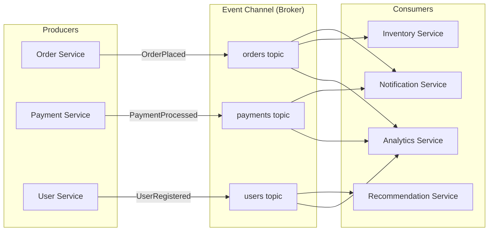
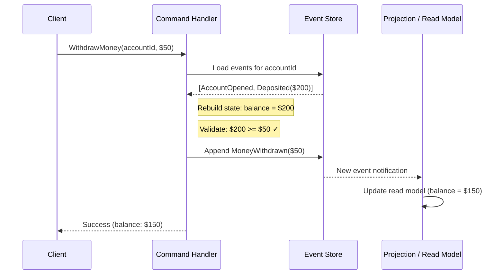
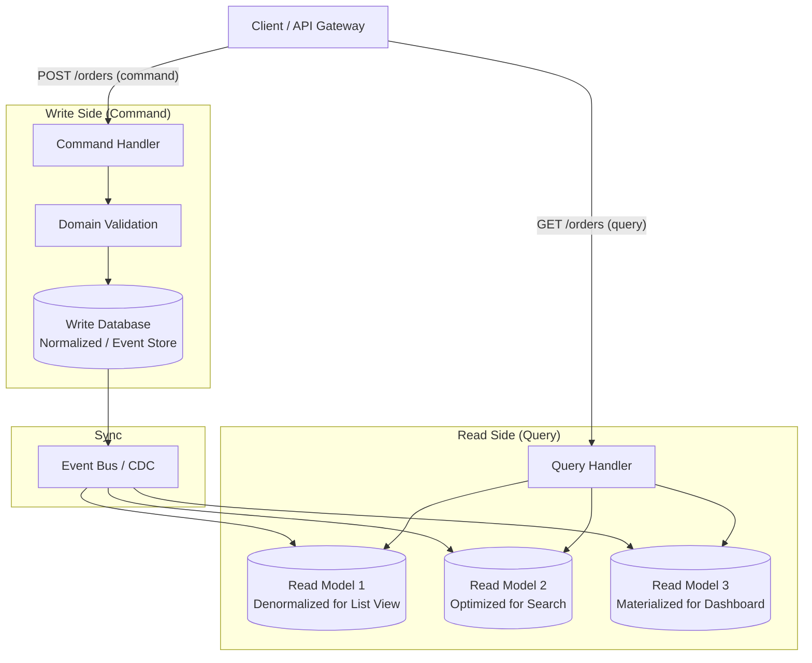
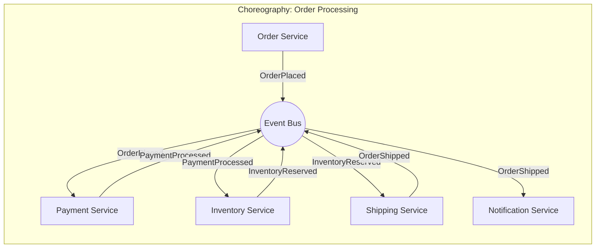
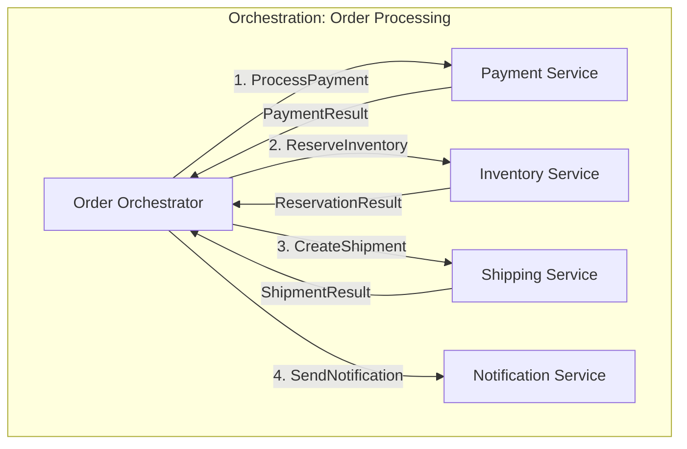
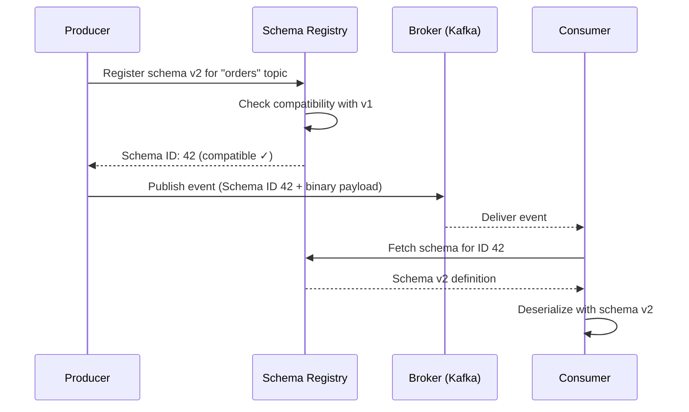

# Event-Driven Architecture

> A comprehensive guide to event-driven architecture patterns for system design interviews.
> Covers event sourcing, CQRS, choreography vs orchestration, schema evolution, and idempotency.

---

## 1. What is Event-Driven Architecture

Event-Driven Architecture (EDA) is a software design paradigm where the flow of the program is determined by events -- significant changes in state that the system recognizes and reacts to. Instead of services calling each other directly (request/response), they communicate by producing and consuming events.

### Events as First-Class Citizens

An **event** is an immutable record of something that happened in the system. It is not a command (a request to do something) nor a query (a request for data). It is a statement of fact.

```
Event examples:
  - OrderPlaced { orderId: 123, userId: 456, total: 99.99 }
  - PaymentProcessed { paymentId: 789, orderId: 123, status: "success" }
  - InventoryReserved { sku: "WIDGET-A", quantity: 2, warehouseId: "US-WEST" }

Key properties:
  - Immutable: once emitted, never changed
  - Past tense: describes what already happened
  - Self-contained: carries enough context to be meaningful
  - Timestamped: when the event occurred
```

### Core Components

There are three fundamental building blocks in any event-driven system:

**Event Producers** - Services that detect state changes and publish events. A producer does not know (or care) who will consume its events.

**Event Consumers** - Services that subscribe to events and react to them. A consumer does not know (or care) who produced the event.

**Event Channels** - The infrastructure that transports events from producers to consumers. This can be a message broker (Kafka, RabbitMQ), an event bus, or a streaming platform.

### Event-Driven Architecture Overview



### Benefits of Event-Driven Architecture

**Loose Coupling** - Producers and consumers are decoupled. Adding a new consumer (e.g., a fraud detection service) requires zero changes to existing producers. Services can be developed, deployed, and scaled independently.

**Scalability** - Consumers can be scaled horizontally by adding more instances to a consumer group. Event channels (like Kafka) can partition events across multiple brokers for parallel processing.

**Real-Time Processing** - Events are processed as they occur, enabling real-time dashboards, alerts, and workflows instead of batch processing on a schedule.

**Resilience** - If a consumer goes down, events are retained in the channel and processed when the consumer recovers. The producer is never blocked.

**Auditability** - Events provide a natural audit trail. Every state change is recorded with a timestamp.

### Key Interview Points

- EDA shifts the mental model from "call this service" to "announce what happened"
- Not everything should be event-driven -- synchronous request/response is simpler for queries
- Event ordering matters: most brokers guarantee order within a partition, not across partitions

---

## 2. Event Sourcing

Event sourcing is a pattern where state changes are persisted as a sequence of immutable events rather than storing only the current state. The event log becomes the source of truth, and the current state is derived by replaying events.

### Traditional vs Event Sourcing

```
Traditional:  DB stores current state { balance: 150 }. History is lost.

Event Sourcing:  Event store records every change:
  1. AccountOpened  { balance: 0 }
  2. MoneyDeposited { amount: 200 }
  3. MoneyWithdrawn { amount: 50 }
  Current state derived: 0 + 200 - 50 = 150. Full history preserved.
```

### Event Store as Source of Truth

The event store is an append-only log of events. It supports:

- **Append**: Write new events to the end of the log
- **Read**: Read events for a specific aggregate (entity) in order
- **Subscribe**: Get notified of new events as they are appended

Events are never updated or deleted. If a correction is needed, a new compensating event is appended (e.g., `BalanceCorrected`).

### Rebuilding State from Events (Replay)

To get the current state of an entity, replay all its events from the beginning:

```javascript
function rebuildAccount(events) {
  let state = { balance: 0, status: 'inactive' };

  for (const event of events) {
    switch (event.type) {
      case 'AccountOpened':
        state.status = 'active';
        state.balance = event.data.initialDeposit || 0;
        break;
      case 'MoneyDeposited':
        state.balance += event.data.amount;
        break;
      case 'MoneyWithdrawn':
        state.balance -= event.data.amount;
        break;
      case 'AccountClosed':
        state.status = 'closed';
        break;
    }
  }

  return state;
}
```

### Snapshots for Performance

Replaying thousands of events every time is expensive. Snapshots solve this:

- Periodically save the current state at a known event position
- To rebuild, load the latest snapshot and replay only events after it
- Snapshots are an optimization, not a source of truth -- they can always be rebuilt from events

### Event Sourcing Flow



### Pros and Cons

| Aspect | Pros | Cons |
|--------|------|------|
| **Audit Trail** | Complete history of every change; natural audit log | Log grows indefinitely; requires storage management |
| **Debugging** | Can replay events to reproduce exact state at any point in time | Debugging event replay logic can be complex |
| **Flexibility** | Can create new read models/projections from existing events retroactively | Must handle schema evolution for old events |
| **Temporal Queries** | Can answer "what was the state at time T?" trivially | Requires careful event design upfront |
| **Performance** | Append-only writes are fast (no contention on rows) | Reads require replay (mitigated by snapshots/projections) |
| **Complexity** | Naturally fits domains with complex state transitions | Significant learning curve; overkill for simple CRUD |
| **Consistency** | Events are the single source of truth | Eventual consistency between event store and projections |
| **Correction** | Compensating events maintain history integrity | Cannot simply "fix" bad data; must append corrections |

### Key Interview Points

- Event sourcing is not required for event-driven architecture -- they are separate patterns that work well together
- Best suited for domains where audit trails matter (finance, healthcare, legal)
- Event replay enables powerful capabilities: retroactive bug fixes, new analytics, time-travel debugging
- The event store is typically implemented using Kafka, EventStoreDB, or a database with append-only semantics
- Be cautious with personally identifiable information (PII) in events -- GDPR "right to be forgotten" conflicts with immutability (use crypto-shredding)

---

## 3. CQRS (Command Query Responsibility Segregation)

CQRS separates the write side (commands) from the read side (queries) of an application into distinct models. Instead of a single model for both reads and writes, each side is optimized independently.

### Why Separate Read and Write Models

```
Write side: Enforces business rules, validates input, strong consistency, lower throughput
Read side:  Joins/aggregates across entities, serves dashboards, tolerates staleness, 10-100x throughput
```

### CQRS Architecture



### Why Combine CQRS with Event Sourcing

CQRS and event sourcing are complementary:

- **Event sourcing** provides the write model: all changes are stored as events
- **CQRS read models** (projections) are built by consuming those events and materializing them into query-optimized views
- Adding a new read model is easy: replay all events from the event store into the new projection
- Each read model can use a different database technology (Elasticsearch for search, Redis for caching, Postgres for relational queries)

### When to Use CQRS

```
Use CQRS when:
  ✓ Read and write workloads have very different scaling needs
  ✓ Read models require complex joins/aggregations across multiple domains
  ✓ You need multiple representations of the same data (list, search, dashboard)
  ✓ Combined with event sourcing for full audit trail
  ✓ Read-to-write ratio is heavily skewed (100:1 or more)

Avoid CQRS when:
  ✗ Simple CRUD with no complex read patterns
  ✗ Strong consistency is required on reads (CQRS introduces eventual consistency)
  ✗ Small team that cannot maintain two separate models
  ✗ Low data volume where a single database handles both read/write fine
  ✗ The added complexity is not justified by the problem domain
```

### Key Interview Points

- CQRS does not require event sourcing (and vice versa), but they pair naturally
- The eventual consistency between write and read models is the biggest trade-off
- Read models can be rebuilt from scratch by replaying events (if using event sourcing)
- CQRS is a pattern, not a framework -- it can be applied at the module level, not just system-wide
- Common at companies like LinkedIn (read-optimized feeds), Twitter (timeline service), and trading platforms

---

## 4. Choreography vs Orchestration

When multiple services need to collaborate for a business workflow (e.g., order processing), there are two fundamental coordination patterns.

### Choreography: Services React to Events Independently

In choreography, there is no central coordinator. Each service knows what to do when it receives an event and publishes its own events for others to react to.



Each service:
1. Listens for events it cares about
2. Performs its own logic
3. Publishes new events announcing what it did
4. Has no knowledge of the overall workflow

### Orchestration: Central Coordinator Manages Workflow

In orchestration, a central service (the orchestrator) explicitly controls the workflow by sending commands to each service and handling their responses.



The orchestrator:
1. Knows the full workflow definition
2. Sends commands to services in the correct order
3. Handles responses, errors, and compensations
4. Maintains workflow state

### Comparison

| Aspect | Choreography | Orchestration |
|--------|-------------|---------------|
| **Coupling** | Very loose -- services are independent | Tighter -- orchestrator depends on all services |
| **Complexity** | Distributed across services | Centralized in the orchestrator |
| **Visibility** | Hard to see the full workflow; spread across services | Easy to see; workflow is defined in one place |
| **Error Handling** | Each service handles its own failures; compensating events | Orchestrator handles retries, timeouts, compensations centrally |
| **Adding Steps** | Add a new consumer, no changes elsewhere | Modify the orchestrator |
| **Debugging** | Difficult; must trace events across services (need distributed tracing) | Easier; orchestrator logs the full workflow state |
| **Single Point of Failure** | No (decentralized) | Yes (orchestrator); mitigated by making it stateless + durable |
| **Scalability** | Each service scales independently | Orchestrator can become a bottleneck |
| **Best For** | Simple, linear flows; few services; high autonomy | Complex workflows; many conditional branches; saga patterns |
| **Real-World Examples** | Microservices reacting to domain events | AWS Step Functions, Temporal, Uber Cadence, Netflix Conductor |

### Key Interview Points

- In practice, most systems use both: choreography for loose reactions (analytics, notifications) and orchestration for critical workflows (order fulfillment)

- Neither pattern is universally better -- choose based on workflow complexity and team structure
- Choreography can lead to "event spaghetti" if too many services react to too many events
- Orchestration makes the saga pattern (distributed transactions with compensations) much easier to implement
- Distributed tracing (OpenTelemetry, Jaeger) is essential for debugging choreography
- Temporal and AWS Step Functions are popular orchestration frameworks

---

## 5. Event Types

Not all events serve the same purpose. Understanding the different types helps in designing clean event-driven systems.

### Domain Events

Business-meaningful events that describe something significant that happened within a bounded context. They use the ubiquitous language of the domain.

```
Examples:
  - OrderPlaced
  - PaymentAuthorized
  - ShipmentDelivered
  - AccountSuspended
  - PrescriptionFilled
```

Domain events are the most important category. They capture business intent and are the foundation of event sourcing.

### Integration Events

Events designed for cross-service communication. They carry enough context for external services to react without needing to call back to the source service. Integration events often transform internal domain details into a stable, versioned contract.

```
Examples:
  - order-service.v1.OrderCompleted { orderId, userId, total, items[], shippingAddress }
  - user-service.v1.ProfileUpdated { userId, displayName, avatarUrl }
  - inventory-service.v1.StockLevelChanged { sku, warehouseId, newQuantity }
```

### Command Events

Messages that instruct a service to do something. Technically these are commands, not events, but they often flow through the same messaging infrastructure. They target a specific consumer.

```
Examples:
  - SendEmail { to, subject, body, templateId }
  - ProcessRefund { orderId, amount, reason }
  - GenerateReport { reportType, dateRange, format }
```

### Notification Events

Lightweight events that signal something happened but carry minimal data. Consumers must call back to the source service for full details. Useful when the full payload is large or sensitive.

```
Examples:
  - OrderUpdated { orderId }  (consumer fetches full order details via API)
  - FileUploaded { fileId }   (consumer fetches file metadata via API)
  - CacheInvalidated { key }
```

### Comparison Table

| Type | Purpose | Payload Size | Target | Coupling | Example |
|------|---------|-------------|--------|----------|---------|
| **Domain Event** | Record business facts within a bounded context | Medium | Internal subscribers | Low | `OrderPlaced { orderId, items, total }` |
| **Integration Event** | Cross-service communication with stable contracts | Large (self-contained) | External services | Low (via contract) | `order.v1.OrderCompleted { full details }` |
| **Command Event** | Instruct a specific service to perform an action | Medium | Single target service | Higher (knows the target) | `SendEmail { to, subject, body }` |
| **Notification Event** | Signal that something changed, minimal data | Small (just IDs) | Any interested party | Medium (requires callback) | `OrderUpdated { orderId }` |

### Key Interview Points

- Domain events should be named in past tense (something that already happened)
- Integration events need versioning and backward compatibility (see Schema Evolution)
- Command events should be named as imperatives (do this thing)
- Notification events trade smaller payloads for additional API calls (chatty vs chunky trade-off)
- A single business action often produces multiple event types: a domain event internally and an integration event externally

---

## 6. Schema Evolution

As systems evolve, event schemas change. Handling schema evolution correctly is critical because old events in the store must remain readable, and old consumers must not break when new fields are added.

### Backward Compatibility

A new schema is **backward compatible** if it can read data written with the old schema. This is the most important compatibility guarantee.

```
Rules for backward compatibility:
  ✓ New fields must have default values
  ✓ No removing required fields
  ✓ No renaming fields
  ✓ No changing field types

Example:
  v1: { orderId, total, currency }
  v2: { orderId, total, currency, discount: 0 }    ← backward compatible
      New consumers can read old events (discount defaults to 0)
```

### Forward Compatibility

An old schema can read data written with the new schema. Old consumers gracefully ignore unknown fields.

```
Rules for forward compatibility:
  ✓ Consumers must ignore unknown fields
  ✓ No removing fields that old consumers depend on
  ✓ No changing the meaning of existing fields

Example:
  v2: { orderId, total, currency, discount, loyaltyPoints }
      Old v1 consumers ignore discount and loyaltyPoints
```

### Schema Registry

A schema registry is a centralized service that stores and validates event schemas. It enforces compatibility rules before allowing new schema versions to be registered.

**Popular formats:**

- **Apache Avro** - Binary format with schema evolution built-in. Schema stored separately from data. Compact on the wire. Default choice for Kafka.
- **Protocol Buffers (Protobuf)** - Google's binary format. Uses numbered fields for evolution. Excellent tooling and language support.
- **JSON Schema** - Human-readable. Larger payloads. Easier to debug but less efficient.



### Versioning Strategies

| Strategy | Description | Pros | Cons |
|----------|-------------|------|------|
| **Schema Evolution** | Single topic, evolve schema with compatibility rules | Simple, no topic proliferation | Limited to compatible changes |
| **Topic Versioning** | New topic per breaking change (`orders.v1`, `orders.v2`) | Clean separation, full flexibility | Must migrate consumers, dual-publish during transition |
| **Envelope Versioning** | Wrap events in an envelope with version field | Consumers route by version | Complex deserialization logic |
| **Upcasting** | Transform old events to new schema on read | Old events look new to consumers | Added read-time processing |

### Key Interview Points

- Always design events with evolution in mind from day one
- Confluent Schema Registry is the most widely used registry for Kafka
- Avro and Protobuf handle schema evolution natively; JSON requires manual validation
- Never make breaking changes to event schemas -- always evolve or create new event types
- Schema registry acts as a contract between producers and consumers

---

## 7. Event Processing Patterns

Different business requirements call for different event processing approaches, ranging from simple one-at-a-time processing to complex pattern detection across streams.

### Simple Event Processing

Each event is processed independently as it arrives. No correlation with other events.

```
Example: New user signs up → send welcome email
  - Trigger: UserRegistered event
  - Action: Send email
  - No context from other events needed
```

This is the most common pattern. A consumer reads an event, performs some logic, and optionally produces a new event.

### Complex Event Processing (CEP)

CEP detects patterns across multiple events over time. It correlates, aggregates, and matches events to identify meaningful situations.

```
Example: Fraud detection
  - Pattern: 3+ failed login attempts from different IPs within 5 minutes
  - Events: LoginFailed { userId, ip, timestamp }
  - CEP engine watches the stream, detects the pattern, emits FraudAlertRaised

Example: IoT monitoring
  - Pattern: Temperature > 100°C for 30+ seconds across 2+ sensors in same zone
  - Events: TemperatureReading { sensorId, zone, value, timestamp }
  - CEP detects sustained anomaly, emits OverheatAlertRaised
```

CEP engines: Esper, Apache Flink CEP, AWS EventBridge Rules, Drools Fusion.

### Event Streaming

Continuous processing of event streams with stateful transformations. Unlike simple event processing, streaming maintains state across events (counts, aggregations, joins).

```
Popular frameworks:
  - Apache Kafka Streams: Library (not a cluster), runs within your application
  - Apache Flink: Distributed stream processing engine, exactly-once semantics
  - Apache Spark Structured Streaming: Micro-batch (not true streaming) but simpler
  - AWS Kinesis Data Analytics: Managed streaming with SQL-like queries
```

### Windowing Strategies

When processing streams, you often need to group events by time. Windowing defines how events are grouped.

**Tumbling Window** - Fixed-size, non-overlapping windows. Every event belongs to exactly one window.

```
Time: |---Window 1---|---Window 2---|---Window 3---|
       0            5s            10s            15s
Events: e1 e2 e3    e4 e5         e6 e7 e8 e9

Use case: Count orders per 1-minute interval
```

**Sliding Window** - Fixed-size windows that overlap. Defined by size and slide interval. An event can belong to multiple windows.

```
Time:  |---Window 1---|
            |---Window 2---|
                 |---Window 3---|
       0   2s   4s   6s   8s   10s
       Size: 5s, Slide: 2s

Use case: Moving average of stock price over last 5 minutes, updated every 30 seconds
```

**Session Window** - Dynamic windows based on activity. A window closes after a period of inactivity (gap). Events close together in time are grouped into the same session.

```
Time:  |--Session 1--|  gap  |----Session 2----|  gap  |--Session 3--|
       e1  e2  e3           e4  e5  e6  e7           e8  e9

Use case: User browsing sessions (gap = 30 minutes of inactivity)
```

### Key Interview Points

- Simple event processing covers 80% of use cases
- CEP is powerful but complex -- use only when pattern detection across events is genuinely needed
- Kafka Streams is simpler to deploy (library, not a cluster) but Flink is more powerful for complex stateful processing
- Windowing choice depends on the business question: fixed intervals (tumbling), continuous monitoring (sliding), user behavior (session)
- Late-arriving events are a major challenge in stream processing -- watermarks and allowed lateness handle this

---

## 8. Idempotency in Event Processing

In distributed systems, events may be delivered more than once. Consumers must be designed to handle duplicate deliveries without producing incorrect results.

### Why Events May Be Delivered Multiple Times

```
Scenarios causing duplicate delivery:

1. At-least-once delivery semantics:
   - Most message brokers default to at-least-once
   - Broker delivers, consumer processes, ACK is lost
   - Broker re-delivers the same event

2. Consumer crash after processing, before committing offset:
   - Consumer reads event, processes it, crashes
   - On restart, consumer reads from last committed offset
   - Same event processed again

3. Producer retries:
   - Producer sends event, network timeout
   - Producer retries, broker now has two copies

4. Rebalancing in consumer groups:
   - Kafka consumer group rebalances
   - Events in-flight may be re-assigned to another consumer
```

### Idempotency Keys

An idempotency key is a unique identifier for each event that allows consumers to detect and skip duplicates.

```javascript
async function handleEvent(event) {
  // Check if already processed using event's unique ID
  const exists = await db.query(
    "SELECT 1 FROM processed_events WHERE event_id = $1",
    [event.eventId]
  );
  if (exists) return; // skip duplicate

  // Process the event
  await processPayment(event.data);

  // Record as processed (in same transaction if possible)
  await db.query(
    "INSERT INTO processed_events (event_id, processed_at) VALUES ($1, NOW())",
    [event.eventId]
  );
}
```

### Deduplication Strategies

**1. Idempotency Table (Inbox Pattern)**

Store processed event IDs in a dedicated table. Check before processing. Process and record in the same database transaction for atomicity.

```
Pros: Simple, reliable with transactional guarantees
Cons: Table grows; needs cleanup of old entries
```

**2. Natural Idempotency**

Design operations to be naturally idempotent -- applying them multiple times produces the same result as applying once.

```
Idempotent operations:
  - SET balance = 150          (same result every time)
  - INSERT ... ON CONFLICT DO NOTHING
  - PUT /resource/123 { full state }
  - DELETE FROM orders WHERE id = 123

NOT idempotent (dangerous with duplicates):
  - INCREMENT balance BY 50    (doubles on retry!)
  - INSERT INTO orders (...)   (creates duplicates!)
  - POST /resource { data }
```

**3. Optimistic Concurrency / Version Checks**

Include a version number or expected state in the event. Reject processing if the current state does not match.

```sql
-- Only process if account is at expected version
UPDATE accounts
SET balance = balance - 50, version = version + 1
WHERE account_id = 123 AND version = 5;
-- Rows affected = 0 means duplicate or conflict
```

**4. Deduplication Window**

For high-throughput systems, maintain an in-memory set (or bloom filter) of recently processed event IDs with a time-based expiration.

```
Pros: Very fast (in-memory lookup)
Cons: Window must be large enough; risk of false negatives after window expires
Tools: Redis with TTL, Bloom filters, Kafka Streams dedup
```

### Key Interview Points

- Design for at-least-once delivery and make consumers idempotent, rather than relying on exactly-once delivery
- Kafka supports exactly-once semantics within its ecosystem (idempotent producer + transactional consumer) but cross-system exactly-once is effectively impossible
- The inbox pattern (idempotency table) is the most reliable general-purpose approach
- Natural idempotency is the gold standard -- prefer SET over INCREMENT, PUT over POST
- Clean up the idempotency table periodically (events older than the broker's retention period are safe to remove)

---

## 9. Quick Reference Summary

### Event-Driven Architecture Decision Matrix

| Scenario | Pattern | Why |
|----------|---------|-----|
| Decouple microservices | Choreography with domain events | Loose coupling, independent scaling |
| Complex multi-step workflow | Orchestration (Saga) | Visibility, error handling, compensations |
| Full audit trail required | Event sourcing | Immutable history, replay capability |
| Read-heavy with complex views | CQRS | Optimize reads independently from writes |
| Real-time fraud detection | CEP over event streams | Pattern detection across events |
| Simple async notification | Simple event processing | Lowest complexity |
| Cross-service data consistency | Integration events + idempotent consumers | Eventual consistency without 2PC |

### Technology Choices

| Component | Options | When to Choose |
|-----------|---------|---------------|
| **Event Broker** | Kafka | High throughput, ordering, replay, streaming |
| | RabbitMQ | Complex routing, priority queues |
| | AWS SNS/SQS | Managed, fan-out + reliable delivery |
| **Schema Registry** | Confluent Schema Registry | Kafka ecosystem, Avro/Protobuf |
| **Stream Processing** | Kafka Streams | Library-based, simple, Kafka-native |
| | Apache Flink | Complex stateful processing, exactly-once |
| **Orchestration** | Temporal | Long-running workflows, code-based |
| | AWS Step Functions | Serverless, visual workflow designer |
| **Event Store** | EventStoreDB | Purpose-built, projections, subscriptions |
| | Kafka (with compaction) | Dual use as broker and event store |
| | PostgreSQL (append-only) | Simple, existing infrastructure |

### Common Interview Patterns

**"Design an order processing system"**
- Event-driven with saga pattern for the workflow (place order -> payment -> inventory -> shipping)
- Orchestration for the critical path (order fulfillment)
- Choreography for side effects (notifications, analytics, recommendations)
- Idempotency keys on all state-changing consumers
- CQRS for order status queries (denormalized read model)

**"How do you handle distributed transactions?"**
- Avoid distributed transactions (2PC) whenever possible
- Use the saga pattern: sequence of local transactions with compensating actions
- Choreography saga: each service publishes events, others react and compensate on failure
- Orchestration saga: central coordinator manages the workflow and triggers compensations
- Ensure idempotency at every step

**"How do you ensure no events are lost?"**
- Transactional outbox pattern: write event to an outbox table in the same DB transaction as the state change
- CDC (Change Data Capture) reads from the outbox and publishes to the broker
- Broker persistence and replication (Kafka replication factor >= 3)
- Consumer offset management (commit after processing, not before)
- Dead letter queue for events that fail after retries

**"How do you handle event ordering?"**
- Kafka guarantees ordering within a partition
- Use a consistent partition key (e.g., orderId) to ensure related events go to the same partition
- If global ordering is required, use a single partition (sacrifices parallelism)
- For cross-partition ordering, use timestamps + sequence numbers and reorder on the consumer side

### Key Numbers to Remember

```
Kafka:            millions msg/sec per cluster, 2-10 ms latency, 7-day default retention
RabbitMQ:         ~50K-100K msg/sec per node, ~1 ms latency (in-memory)
Event Sourcing:   snapshot every 50-100 events, ~0.5-5 KB per event
Idempotency:      cleanup after broker retention period (e.g., 7 days)
Consumer target:  < 100 ms per event processing time
```

---

> **TL;DR**: Event-driven architecture decouples services through events, enabling scalability and real-time processing. Event sourcing stores all state changes as immutable events. CQRS separates reads from writes for independent optimization. Choose choreography for simple flows and orchestration for complex workflows. Always design for schema evolution and idempotent consumers. The hardest parts are not the architecture itself but the operational concerns: ordering, deduplication, schema evolution, and debugging distributed event flows.
