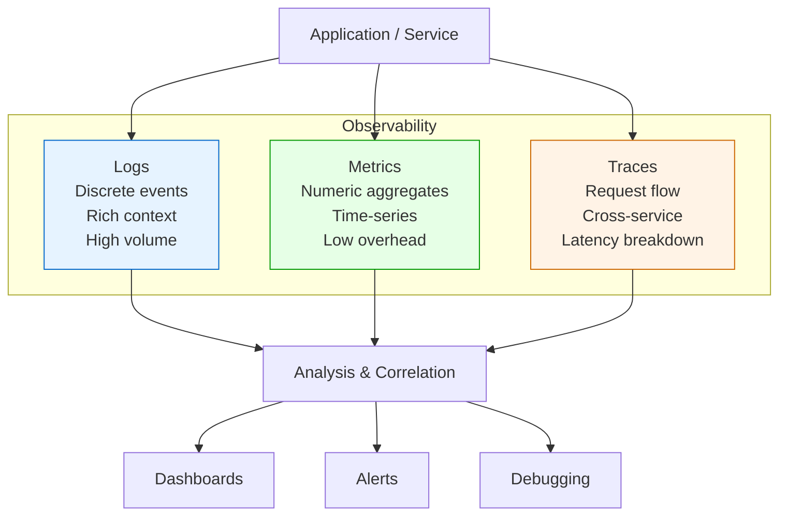
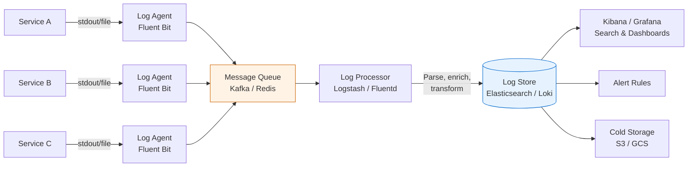
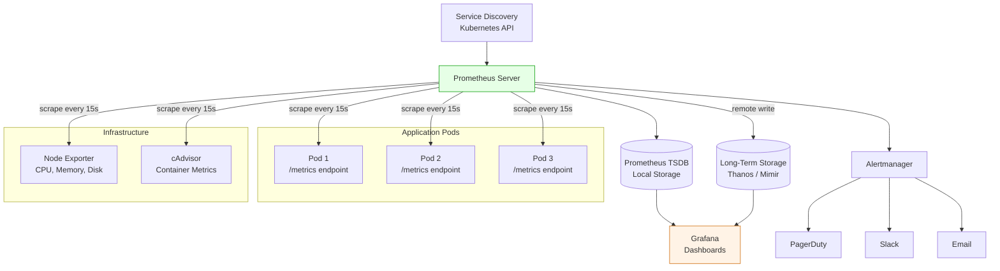
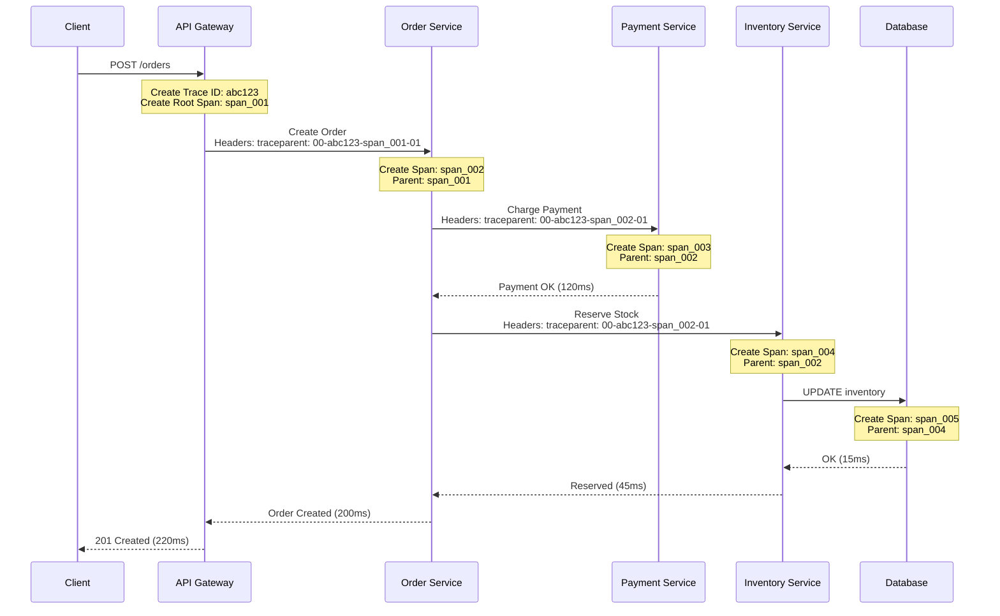
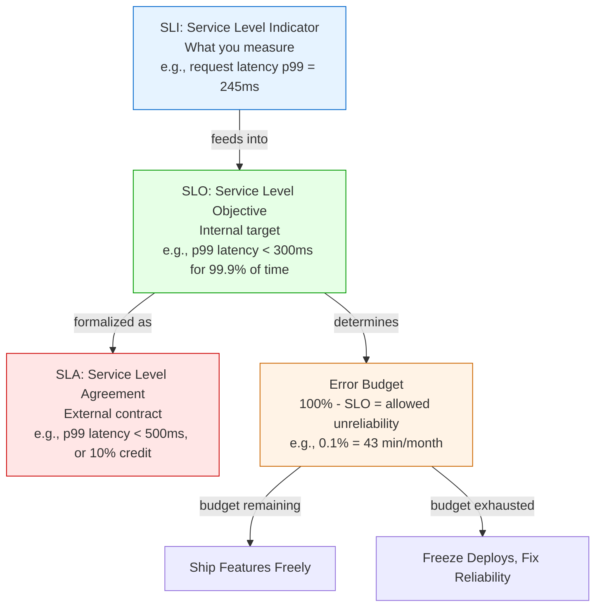

# Monitoring & Observability — Comprehensive System Design Guide

---

## Table of Contents

1. [Monitoring vs Observability](#1-monitoring-vs-observability)
2. [Logs](#2-logs)
3. [Metrics](#3-metrics)
4. [Distributed Tracing](#4-distributed-tracing)
5. [SLI, SLO, SLA](#5-sli-slo-sla)
6. [Alerting](#6-alerting)
7. [Health Checks & Dashboards](#7-health-checks--dashboards)
8. [Observability in Practice](#8-observability-in-practice)
9. [Quick Reference Summary](#9-quick-reference-summary)

---

## 1. Monitoring vs Observability

### Monitoring — Definition

**Monitoring** is the practice of collecting, analyzing, and using predefined data points to track
the health of a system. It answers **known questions**: "Is CPU above 90%?", "Are error rates
above threshold?", "Is the database connection pool saturated?"

Monitoring is reactive by nature — you decide in advance what to watch, create dashboards, and
set up alerts for those specific conditions.

**Key characteristics:** Predefined dashboards and alerts, answers questions you already know
to ask, focuses on failure detection, built around thresholds and rules.

### Observability — Definition

**Observability** is the ability to understand the internal state of a system by examining its
external outputs — without needing to deploy new code or configuration. It answers **unknown
questions**: "Why is this particular user experiencing high latency?", "Why did this request
fail while others didn't?"

Observability is exploratory by nature — you can ask arbitrary questions about system behavior
after the fact, using high-cardinality, high-dimensionality data.

**Key characteristics:** Explore unknown unknowns, ask arbitrary ad-hoc questions, requires
rich contextualized telemetry data, driven by high-cardinality data (user IDs, request IDs).

### Monitoring vs Observability — Comparison

| Aspect             | Monitoring                         | Observability                            |
|--------------------|------------------------------------|------------------------------------------|
| **Purpose**        | Detect known failure modes         | Understand unknown system behavior       |
| **Approach**       | Predefined dashboards/alerts       | Ad-hoc exploration and querying          |
| **Questions**      | Known questions                    | Unknown questions                        |
| **Data**           | Aggregated metrics                 | High-cardinality, contextualized data    |
| **Trigger**        | Threshold-based alerts             | Hypothesis-driven investigation          |
| **Example Tool**   | Grafana dashboards, Nagios         | Honeycomb, Jaeger, OpenTelemetry         |
| **Analogy**        | Car dashboard warning lights       | Full engine diagnostic computer          |

> **Interview Tip:** Monitoring tells you *that* something is broken. Observability helps you
> understand *why* it is broken. Modern systems need both.

### The Three Pillars of Observability

Observability is built on three foundational types of telemetry data:

1. **Logs** — Immutable, timestamped records of discrete events.
2. **Metrics** — Numeric measurements aggregated over time.
3. **Traces** — Records of requests as they flow across distributed services.



Each pillar has different strengths:

| Pillar    | Cardinality | Volume   | Cost     | Best For                          |
|-----------|-------------|----------|----------|-----------------------------------|
| Logs      | High        | Very High| High     | Debugging, audit trails, forensics|
| Metrics   | Low         | Low      | Low      | Alerting, dashboards, trending    |
| Traces    | Medium      | Medium   | Medium   | Latency analysis, dependency maps |

---

## 2. Logs

### What Are Logs?

Logs are **immutable, timestamped records of discrete events** that happened in a system. Every
application produces logs — they are the most fundamental form of telemetry. A log entry records
what happened, when it happened, and (ideally) the context around it.

### Structured vs Unstructured Logging

**Unstructured logs** are free-form text strings. They are easy to produce but hard to parse,
search, and analyze at scale.

```
2024-03-15 14:23:45 ERROR Failed to process payment for user john@example.com, amount $49.99, reason: card declined
```

**Structured logs** use a consistent format (typically JSON) with named fields. They are
machine-parseable, searchable, and can be indexed efficiently.

```json
{
  "timestamp": "2024-03-15T14:23:45.123Z",
  "level": "ERROR",
  "service": "payment-service",
  "event": "payment_failed",
  "user_id": "usr_12345",
  "email": "john@example.com",
  "amount": 49.99,
  "currency": "USD",
  "reason": "card_declined",
  "trace_id": "abc123def456",
  "span_id": "span_789"
}
```

| Aspect          | Unstructured                    | Structured                         |
|-----------------|---------------------------------|------------------------------------|
| Format          | Free-form text                  | JSON, key-value pairs              |
| Searchability   | Regex, full-text only           | Field-level queries                |
| Parsing cost    | High (regex extraction)         | Low (direct field access)          |
| Human readable  | Easy to read directly           | Slightly verbose but clear         |
| Machine parsing | Fragile, breaks on format change| Robust, schema-based               |
| Best practice   | Legacy systems, quick debugging | Production systems, always prefer  |

> **Interview Tip:** Always recommend structured logging in system design interviews. It enables
> log aggregation, searching, and correlation across services.

### Log Levels

Log levels indicate the severity of an event. They allow filtering and routing — for example,
only alerting on ERROR and above in production, while capturing DEBUG logs in development.

| Level     | When to Use                                                   | Example                                    |
|-----------|---------------------------------------------------------------|---------------------------------------------|
| **FATAL** | System is unusable, immediate attention required              | Database connection pool exhausted           |
| **ERROR** | Operation failed, needs investigation                         | Payment processing failed                    |
| **WARN**  | Something unexpected, but system continues functioning         | Cache miss rate above threshold              |
| **INFO**  | Normal operational events worth recording                      | User login successful, order placed          |
| **DEBUG** | Detailed information for diagnosing problems                   | SQL query executed, cache hit/miss           |
| **TRACE** | Extremely detailed, step-by-step execution flow                | Entering/exiting function, variable values   |

**Production strategy:** INFO and above in production, DEBUG in staging. Dynamically adjust
log levels at runtime without redeploying (via feature flags or config).

### Centralized Logging — The ELK Stack

In a distributed system with dozens or hundreds of services, logs must be **centralized** into a
single searchable system. The most widely used open-source stack is **ELK**:

| Component         | Role                                                      |
|-------------------|-----------------------------------------------------------|
| **Elasticsearch** | Distributed search and analytics engine. Stores and indexes logs. |
| **Logstash**      | Data processing pipeline. Ingests, transforms, and routes logs.   |
| **Kibana**        | Visualization layer. Dashboards, search UI, and analytics.        |

Modern variants often replace Logstash with **Fluentd** or **Fluent Bit** (the "EFK" stack)
for lighter-weight log forwarding, or use **Loki** (by Grafana Labs) as a cost-effective
alternative to Elasticsearch.

### Log Aggregation Pipeline



**Pipeline stages explained:**

1. **Collection** — A lightweight agent (Fluent Bit, Filebeat) runs as a sidecar or DaemonSet
   on each node. It tails log files or reads from stdout.
2. **Buffering** — Logs are sent to a message queue (Kafka) to decouple producers from consumers
   and handle traffic spikes.
3. **Processing** — Logstash or Fluentd parses, enriches (adds metadata like hostname, region),
   filters (drop noisy logs), and transforms (convert formats) log entries.
4. **Storage** — Processed logs land in Elasticsearch or Loki for indexing and querying.
5. **Visualization** — Kibana or Grafana provides search, dashboards, and alerting.
6. **Archival** — Old logs are moved to cheap cold storage (S3) for compliance and forensics.

**Key design considerations:** backpressure handling (buffer or drop gracefully, never crash
the app), retention policies (hot 7-30 days, warm 30-90 days, cold 1+ years), sampling for
high-volume services, and PII redaction in the processing stage.

---

## 3. Metrics

### What Are Metrics?

Metrics are **numeric measurements collected at regular intervals** and stored as time-series
data. Unlike logs (which record individual events), metrics represent aggregated state — counts,
averages, percentiles, rates — over time windows.

Metrics are the backbone of dashboards and alerting: low overhead (counter increment is far
cheaper than a log line), fixed cost (storage depends on unique time series, not traffic),
and highly compressible.

### Metric Types

| Type          | Description                                            | Example                                     |
|---------------|--------------------------------------------------------|---------------------------------------------|
| **Counter**   | Monotonically increasing value. Only goes up (or resets to 0). | Total HTTP requests, total errors, bytes sent |
| **Gauge**     | Value that can go up or down. Represents current state. | Current CPU usage, memory in use, queue depth |
| **Histogram** | Samples observations and counts them in configurable buckets. | Request latency distribution, response sizes  |
| **Summary**   | Similar to histogram but calculates quantiles client-side. | P50, P95, P99 latency (pre-computed)          |

**Counter vs Gauge:** Counter = "How many requests total?" (always increases). Gauge = "How
many requests in-flight right now?" (fluctuates).

**Histogram vs Summary:** Histograms can be aggregated across instances (combine buckets for
global distribution). Summaries compute quantiles per-instance and cannot be aggregated --
the P99 of P99s is not the true P99. Always prefer histograms.

> **Interview Tip:** Always recommend histograms over summaries for latency metrics. Mention that
> summaries cannot be aggregated across instances, which is critical in distributed systems.

### Time-Series Databases

Metrics are stored in specialized time-series databases (TSDBs) optimized for high write
throughput, time-range queries, and data retention with downsampling.

| Database       | Model        | Query Language | Notes                                 |
|----------------|--------------|----------------|---------------------------------------|
| **Prometheus** | Pull-based   | PromQL         | De facto standard for cloud-native    |
| **InfluxDB**   | Push-based   | InfluxQL/Flux  | Good for IoT, high cardinality        |
| **Thanos**     | Pull (Prometheus extension) | PromQL | Long-term storage for Prometheus |
| **Cortex/Mimir**| Pull (Prometheus extension)| PromQL | Multi-tenant, horizontally scalable  |
| **Datadog**    | Push-based   | Custom         | SaaS, full observability platform     |

### Prometheus + Grafana Stack

Prometheus is the most widely used open-source metrics system in the cloud-native ecosystem.
Grafana provides the visualization layer.

**Pull vs Push model:**

| Aspect          | Pull Model (Prometheus)                     | Push Model (StatsD, InfluxDB)            |
|-----------------|---------------------------------------------|------------------------------------------|
| How it works    | Prometheus scrapes `/metrics` endpoint      | Application pushes metrics to collector  |
| Service discovery| Prometheus discovers targets                | Application must know collector address  |
| Failure detection| Scrape failure = target is down             | Silent failure if push fails             |
| Short-lived jobs| Needs Pushgateway workaround                | Naturally supported                      |
| Network         | Prometheus initiates connections             | Application initiates connections        |
| Scaling         | Federation, remote write                    | Load balance the collector               |

### Metrics Collection Architecture



### PromQL Basics

PromQL (Prometheus Query Language) is used to query metrics in Prometheus and Grafana.

```promql
# Request rate per second over 5 minutes
rate(http_requests_total[5m])

# Error rate as percentage
sum(rate(http_requests_total{status=~"5.."}[5m])) / sum(rate(http_requests_total[5m])) * 100

# P99 latency from histogram
histogram_quantile(0.99, rate(http_request_duration_seconds_bucket[5m]))

# Memory usage percentage
container_memory_usage_bytes / container_spec_memory_limit_bytes * 100
```

**Key functions:** `rate()` = per-second rate for counters, `histogram_quantile()` = percentiles
from buckets, `sum by (label)` = aggregate by label, `{label="value"}` = label filter.

---

## 4. Distributed Tracing

### Why Distributed Tracing is Needed

In a monolith, a single request flows through one process — a stack trace tells you everything.
In a microservices architecture, a single user request can touch 10, 20, or more services. When
that request is slow or fails, you need to know:

- **Which service** is the bottleneck?
- **What is the call graph** — which services called which?
- **Where is the time spent** — network latency vs processing time?

Logs alone cannot answer these questions because they are isolated per service. Metrics show
aggregate behavior but not individual request paths. **Distributed tracing connects the dots**
by tracking a request across all services it touches.

### Core Concepts

| Concept                | Description                                                        |
|------------------------|--------------------------------------------------------------------|
| **Trace**              | End-to-end journey of a single request through the system.         |
| **Span**               | A single unit of work within a trace (e.g., one service call, one DB query). |
| **Trace ID**           | Unique identifier for the entire trace, shared by all spans.       |
| **Span ID**            | Unique identifier for a single span.                               |
| **Parent Span ID**     | Links a span to its parent, forming a tree structure.              |
| **Context Propagation**| Mechanism for passing trace/span IDs across service boundaries.    |
| **Baggage**            | Key-value pairs propagated along with the trace context.           |

A trace is a **tree of spans**. The root span represents the initial request (e.g., an API
gateway receiving an HTTP request). Each downstream call creates a child span.

### Trace Propagation Across Services



**How context propagation works:** The first service generates a Trace ID and Root Span ID,
injected into outgoing request headers. Each downstream service extracts the context, creates
a child span, and propagates further. All spans share the same Trace ID, so they can be
assembled into a single trace view.

### W3C Trace Context Standard

The **W3C Trace Context** specification defines a standard HTTP header format for propagating
trace context. It ensures interoperability between different tracing systems.

```
traceparent: 00-<trace-id>-<parent-span-id>-<trace-flags>
              |      |            |               |
          version  32-hex      16-hex         flags (01 = sampled)

Example:
traceparent: 00-4bf92f3577b34da6a3ce929d0e0e4736-00f067aa0ba902b7-01
```

The `tracestate` header carries vendor-specific data:
```
tracestate: congo=t61rcWkgMzE,rojo=00f067aa0ba902b7
```

### Tracing Tools

| Tool               | Type        | Notes                                            |
|--------------------|-------------|--------------------------------------------------|
| **Jaeger**         | Open source | Originally from Uber. CNCF graduated project.    |
| **Zipkin**         | Open source | Originally from Twitter. Mature and widely used.  |
| **OpenTelemetry**  | Standard    | Vendor-neutral SDK for all telemetry (logs, metrics, traces). |
| **AWS X-Ray**      | Cloud       | Native AWS tracing.                               |
| **Datadog APM**    | SaaS        | Full-featured commercial tracing.                 |
| **Tempo**          | Open source | Grafana Labs. Cost-effective, object-storage backend. |

> **Interview Tip:** OpenTelemetry (OTel) is the industry standard. It provides a single SDK
> that instruments your code and can export to any backend (Jaeger, Tempo, Datadog, etc.).
> Always mention OTel when discussing tracing.

### Sampling Strategies

In production, tracing every single request is prohibitively expensive. Sampling controls which
requests get traced.

| Strategy               | How It Works                                              | Pros                              | Cons                              |
|------------------------|-----------------------------------------------------------|-----------------------------------|-----------------------------------|
| **Head-based sampling**| Decision made at the start of the request (e.g., sample 1% of traffic). | Simple, low overhead              | May miss interesting/failing requests |
| **Tail-based sampling**| Decision made after the request completes (keep traces with errors or high latency). | Captures all interesting traces   | Requires buffering all spans temporarily |
| **Priority sampling**  | Certain request types always sampled (e.g., errors, admin operations). | Guarantees important traces       | Must define priority rules        |
| **Adaptive sampling**  | Adjusts sample rate based on traffic volume.              | Cost-effective at scale           | More complex to implement         |

**Head-based** is simpler but blindly discards traces. **Tail-based** is smarter but requires
buffering all spans. Most production systems combine both: head-based for the majority plus
tail-based for errors and high-latency requests.

---

## 5. SLI, SLO, SLA

### Definitions

These three concepts form a hierarchy for defining and measuring service reliability.

| Term  | Full Name                    | What It Is                                               |
|-------|------------------------------|----------------------------------------------------------|
| **SLI** | Service Level Indicator    | A **quantitative measurement** of a specific aspect of service behavior. |
| **SLO** | Service Level Objective    | A **target value or range** for an SLI that the team aims to meet.       |
| **SLA** | Service Level Agreement    | A **contractual commitment** with defined consequences (penalties, credits) if violated. |

**Relationship:** SLIs are measured -> compared against SLOs -> SLOs are formalized into SLAs.

### SLI — Service Level Indicator

SLIs are the actual metrics you measure. Good SLIs are directly tied to user experience
and expressed as a ratio (good events / total events).

**Common SLIs:**

| SLI Category   | Measurement                                      | Formula                                     |
|----------------|--------------------------------------------------|---------------------------------------------|
| **Availability** | Proportion of successful requests               | successful requests / total requests        |
| **Latency**    | Proportion of requests faster than a threshold    | requests < 300ms / total requests           |
| **Throughput** | Rate of requests served                           | requests per second                         |
| **Error rate** | Proportion of requests that fail                  | failed requests / total requests            |
| **Correctness**| Proportion of correct responses                   | correct responses / total responses         |

### SLO — Service Level Objective

SLOs are the targets. They define "good enough" — not perfection.

| Service          | SLI                     | SLO                            |
|------------------|-------------------------|--------------------------------|
| API Gateway      | Availability            | 99.95% of requests succeed     |
| API Gateway      | Latency (p99)           | 99% of requests < 500ms       |
| Payment Service  | Availability            | 99.99% of transactions succeed |
| Search Service   | Latency (p50)           | 95% of queries < 200ms        |
| Email Service    | Delivery                | 99.9% of emails delivered within 5 min |
| Data Pipeline    | Freshness               | 99% of data available within 10 min    |

### SLA — Service Level Agreement

SLAs are external contracts, typically less aggressive than internal SLOs (e.g., internal SLO
of 99.95% with SLA promising 99.9%). The gap provides a safety margin.

**SLA penalty structures:**

| Availability   | Monthly Downtime | Typical SLA Credit         |
|----------------|------------------|----------------------------|
| 99.99% (4 nines) | 4.3 minutes   | —                          |
| 99.95%         | 21.6 minutes     | —                          |
| 99.9%          | 43.2 minutes     | 10% credit                 |
| 99.5%          | 3.6 hours        | 25% credit                 |
| 99.0%          | 7.2 hours        | 50% credit                 |
| < 99.0%        | > 7.2 hours      | 100% credit or contract termination |

### Error Budgets

An error budget is **the amount of unreliability you are allowed** before violating your SLO.

```
Error Budget = 100% - SLO
```

| SLO        | Error Budget | Meaning                                |
|------------|--------------|----------------------------------------|
| 99.99%     | 0.01%        | ~4.3 minutes downtime/month            |
| 99.95%     | 0.05%        | ~21.6 minutes downtime/month           |
| 99.9%      | 0.1%         | ~43.2 minutes downtime/month           |
| 99.5%      | 0.5%         | ~3.6 hours downtime/month              |
| 99%        | 1%           | ~7.2 hours downtime/month              |

**How error budgets are used:** Budget remaining = deploy new features freely. Budget
exhausted = freeze deployments, focus on reliability. Error budgets align product teams
(want features) and SRE teams (want reliability) around a shared framework.

### SLI/SLO/SLA Relationship Diagram



---

## 6. Alerting

Alerting is how monitoring systems notify humans that something needs attention. Done poorly,
it creates **alert fatigue** -- engineers ignore all alerts, including critical ones.

### Alert Fatigue — Causes and Solutions

| Cause                           | Solution                                                     |
|---------------------------------|--------------------------------------------------------------|
| Too many alerts                 | Set meaningful thresholds; eliminate noisy alerts             |
| Alerts for non-actionable events| Every alert must have a clear action; if no action, delete it|
| Duplicate alerts                | Deduplicate and group related alerts                         |
| Alerts that auto-resolve        | Suppress alerts for transient spikes (add evaluation window) |
| No severity levels              | Classify alerts by severity; only page for critical          |
| Missing runbooks                | Every alert must link to a runbook with remediation steps    |

### Severity Levels

| Severity     | Response Time     | Notification Channel    | Example                                      |
|--------------|-------------------|-------------------------|----------------------------------------------|
| **P1 / Critical** | Immediate (wake people up) | PagerDuty phone call | Production is down, data loss occurring   |
| **P2 / High**     | Within 1 hour     | PagerDuty push + Slack | Significant degradation, error rate > 5%  |
| **P3 / Medium**   | Next business day  | Slack channel           | Non-critical service degraded, elevated latency |
| **P4 / Low**      | Backlog / sprint   | Email / ticket          | Disk usage trending up, certificate expiring in 30 days |

### Alert on Symptoms, Not Causes

This is a critical principle. Alert on what the **user experiences**, not on internal system
details.

| Bad (Alerting on Cause)               | Good (Alerting on Symptom)                        |
|----------------------------------------|---------------------------------------------------|
| CPU usage > 90%                        | P99 latency > 500ms                               |
| Memory usage > 85%                     | Error rate > 1%                                    |
| Thread pool utilization > 80%          | Requests per second dropped by 50%                 |
| Kafka consumer lag > 10000             | Data freshness SLO violated (data > 10 min stale) |
| One pod restarting                     | Availability dropped below SLO threshold           |

**Why?** CPU at 90% might be fine if latency is good. CPU at 30% with p99 at 5s is a real
problem. Users care about symptoms, not internal details.

### Alerting Tools

| Tool            | Type       | Key Features                                   |
|-----------------|------------|------------------------------------------------|
| **PagerDuty**   | SaaS       | On-call scheduling, escalation policies, incident management |
| **OpsGenie**    | SaaS       | Similar to PagerDuty, part of Atlassian suite  |
| **Alertmanager**| Open source| Prometheus companion, grouping, silencing, routing |
| **VictorOps**   | SaaS       | Now Splunk On-Call. Incident response.         |

### Runbooks

Every alert should link to a **runbook** containing: what the alert means (plain English),
user impact, diagnosis steps (dashboards/queries to check), remediation steps, and escalation
path if the runbook doesn't resolve it.

---

## 7. Health Checks & Dashboards

### Liveness vs Readiness Probes

In Kubernetes (and other orchestration systems), health checks determine whether a container
is functioning correctly.

| Probe         | Question It Answers              | Failure Action                             |
|---------------|----------------------------------|--------------------------------------------|
| **Liveness**  | "Is the process alive and not deadlocked?" | Kill and restart the container       |
| **Readiness** | "Is the service ready to accept traffic?"  | Remove from load balancer (no restart) |
| **Startup**   | "Has the service finished initializing?"   | Give more time before liveness checks  |

**Key distinction:** A service can be alive but not ready (e.g., loading a large cache). Liveness
probe succeeds (don't restart), readiness probe fails (don't send traffic yet).

```
GET /healthz  ->  200 OK                           # Liveness: process is alive
GET /readyz   ->  200 OK | 503 Service Unavailable  # Readiness: dependencies healthy?
```

### Monitoring Methodologies

Several frameworks help you decide **what to monitor**. The three most important are:

#### RED Method (for request-driven services)

| Signal        | What to Measure                    | Example Metric                        |
|---------------|------------------------------------|---------------------------------------|
| **R**ate      | Requests per second                | `rate(http_requests_total[5m])`       |
| **E**rrors    | Failed requests per second         | `rate(http_requests_total{status=~"5.."}[5m])` |
| **D**uration  | Distribution of request latency    | `histogram_quantile(0.99, ...)` |

**Best for:** API servers, web services, microservices — anything that handles requests.

#### USE Method (for infrastructure resources)

| Signal            | What to Measure                         | Example                             |
|-------------------|-----------------------------------------|-------------------------------------|
| **U**tilization   | Percentage of resource capacity in use  | CPU at 75%, disk at 60%             |
| **S**aturation    | Amount of work queued / waiting         | Run queue length, swap usage        |
| **E**rrors        | Count of error events                   | Disk errors, network packet drops   |

**Best for:** Hardware and infrastructure — CPU, memory, disk, network, GPUs.

#### Google's Four Golden Signals

| Signal         | Description                                    |
|----------------|------------------------------------------------|
| **Latency**    | Time to serve a request (distinguish success vs error latency) |
| **Traffic**    | Demand on the system (requests/sec, sessions, data volume)     |
| **Errors**     | Rate of failed requests (explicit 5xx + implicit slow responses) |
| **Saturation** | How "full" the service is (CPU, memory, queue depth)           |

### Comparison of Monitoring Methodologies

| Methodology        | Focus Area          | When to Use                                | Originated From |
|--------------------|---------------------|--------------------------------------------|-----------------|
| **RED**            | Services            | Monitoring request-handling services        | Tom Wilkie (Grafana) |
| **USE**            | Resources           | Monitoring infrastructure and hardware      | Brendan Gregg (Netflix) |
| **Golden Signals** | Services + Resources| General-purpose, covers all bases           | Google SRE Book  |

> **Interview Tip:** For a typical system design answer, start with the **Four Golden Signals**
> for a comprehensive approach. If asked to go deeper, apply RED to services and USE to
> infrastructure.

---

## 8. Observability in Practice

### Correlation IDs

A **correlation ID** (also called request ID) is a unique identifier generated at the entry
point of a request and propagated through every service, log entry, and metric event.

**How it works:** API Gateway generates a UUID (`X-Request-ID: req_abc123`), every service
includes this ID in all log entries and passes it in outgoing requests. When debugging, search
logs across all services using this single ID.

**Correlation ID vs Trace ID:** Correlation IDs are a simpler, application-level header.
Trace IDs are part of a full tracing system with spans and timing. In practice, you can use
the Trace ID as the Correlation ID.

### Canary Deployment Monitoring

When deploying new code via canary deployment (rolling out to a small percentage of traffic
first), monitoring is critical:

**What to monitor during canary rollout:**

| Metric                          | Compare                                      |
|---------------------------------|----------------------------------------------|
| Error rate                      | Canary pods vs baseline pods                 |
| P50 / P99 latency              | Canary vs baseline                           |
| CPU and memory usage            | Canary vs baseline                           |
| Business metrics (conversion)   | Canary vs baseline                           |

**Automated canary analysis:** Tools like **Kayenta** (Netflix/Google) or **Flagger** auto-compare
canary vs baseline. If metrics degrade, rollout is auto-rolled back; if comparable, it proceeds.

### Feature Flag Monitoring

Feature flags decouple deployment from release. Monitoring must track the impact of each flag:
emit metrics with flag state as a label, compare latency/error rates for flag on vs off,
monitor degradation as you increase rollout percentage (1% -> 5% -> 25% -> 100%), and alert
on stale flags that have been 100% on for > 30 days.

### Chaos Engineering

Chaos engineering is the practice of **intentionally injecting failures** to verify that
monitoring and alerting work correctly. If you inject a failure and no alert fires, your
monitoring has a gap.

**Common experiments:** kill a service instance (does LB reroute?), inject network latency
(does the caller timeout correctly?), fill disk to 95% (does alerting fire?), exhaust DB
connections (does the circuit breaker open?).

**Tools:** Netflix Chaos Monkey, Gremlin, Litmus (Kubernetes-native), AWS FIS.

---

## 9. Quick Reference Summary

### Key Concepts at a Glance

| Concept              | One-Liner                                                              |
|----------------------|------------------------------------------------------------------------|
| Monitoring           | Predefined dashboards and alerts for known failure modes.              |
| Observability        | Ask arbitrary questions about system state from external outputs.      |
| Structured Logging   | JSON logs with named fields for machine parsing and searching.         |
| ELK Stack            | Elasticsearch + Logstash + Kibana for centralized log management.      |
| Prometheus           | Pull-based time-series database and monitoring system.                 |
| PromQL               | Prometheus query language for metrics and alerting rules.              |
| Histogram            | Records distribution of values in buckets (latency percentiles).       |
| Distributed Trace    | End-to-end record of a request across multiple services.               |
| OpenTelemetry        | Vendor-neutral SDK for instrumenting logs, metrics, and traces.        |
| SLI / SLO / SLA      | Measurement -> Internal target -> External contract with penalties.   |
| Error Budget         | Allowed unreliability: 100% - SLO.                                     |
| RED Method           | Rate, Errors, Duration -- for monitoring services.                     |
| USE Method           | Utilization, Saturation, Errors -- for monitoring resources.           |
| Golden Signals       | Latency, Traffic, Errors, Saturation -- Google SRE's four signals.     |

### System Design Interview Cheat Sheet

When discussing monitoring and observability in a system design interview:

1. **Start with the Golden Signals** — mention latency, traffic, errors, saturation.
2. **Propose a tech stack** — Prometheus + Grafana for metrics, ELK/Loki for logs,
   Jaeger/Tempo for traces, OpenTelemetry for instrumentation.
3. **Define SLIs and SLOs** — pick 2-3 SLIs relevant to the system being designed.
4. **Mention alerting strategy** — alert on symptoms, link to runbooks, use severity levels.
5. **Add distributed tracing** — correlation IDs, context propagation for debugging.
6. **Health checks** — liveness and readiness probes for container orchestration.
7. **Discuss trade-offs** — log volume vs cost, sampling rate vs visibility, push vs pull.

### Tool Ecosystem Summary

| Category            | Open Source                        | Commercial / SaaS                  |
|---------------------|------------------------------------|------------------------------------|
| Metrics             | Prometheus, Thanos, Mimir          | Datadog, New Relic, CloudWatch     |
| Logs                | ELK, Loki, Fluentd                 | Splunk, Datadog, Sumo Logic        |
| Traces              | Jaeger, Zipkin, Tempo              | Datadog APM, Lightstep, Honeycomb  |
| Instrumentation     | OpenTelemetry                      | (OTel is the universal standard)   |
| Dashboards          | Grafana                            | Datadog, New Relic, Dynatrace      |
| Alerting            | Alertmanager                       | PagerDuty, OpsGenie, VictorOps    |
| Chaos Engineering   | Chaos Monkey, Litmus, Chaos Mesh   | Gremlin, AWS FIS                   |
