# Back-of-Envelope Estimation for System Design

Back-of-envelope estimation is a critical skill in system design interviews. You are expected
to estimate system capacity, determine resource requirements, and validate that your design
can handle the expected load -- all within minutes using rough but reasonable calculations.

This guide covers every number, method, and worked example you need.

---

## 1. Powers of 2

Every engineer should know powers of 2 by heart. These form the foundation of all storage
and memory calculations.

### Core Table

| Power | Exact Value            | Approx. Value | Unit        | Name     |
|-------|------------------------|---------------|-------------|----------|
| 2^10  | 1,024                  | ~1 Thousand   | 1 KB        | Kilobyte |
| 2^20  | 1,048,576              | ~1 Million    | 1 MB        | Megabyte |
| 2^30  | 1,073,741,824          | ~1 Billion    | 1 GB        | Gigabyte |
| 2^40  | 1,099,511,627,776      | ~1 Trillion   | 1 TB        | Terabyte |
| 2^50  | 1,125,899,906,842,624  | ~1 Quadrillion| 1 PB        | Petabyte |

### Intermediate Values Worth Knowing

| Power | Value   | Practical Meaning                        |
|-------|---------|------------------------------------------|
| 2^7   | 128     | ASCII character set size                  |
| 2^8   | 256     | Number of values in a byte               |
| 2^16  | 65,536  | Max TCP port number + 1                  |
| 2^32  | ~4.3B   | Max 32-bit integer, IPv4 address space   |
| 2^64  | ~1.8×10^19 | Max 64-bit integer                    |

### Quick Conversion Rules

```
1 KB = 10^3 bytes    (use 1,000 for estimation)
1 MB = 10^6 bytes    (use 1,000,000)
1 GB = 10^9 bytes    (use 1,000,000,000)
1 TB = 10^12 bytes
1 PB = 10^15 bytes

Shortcut: each step up is ×1,000
```

**Tip:** In interviews, treat 2^10 as exactly 10^3. The 2.4% error is irrelevant for estimation.

### Useful Byte-Size References

| Data Type              | Typical Size      |
|------------------------|-------------------|
| 1 ASCII character      | 1 byte            |
| 1 Unicode character    | 2-4 bytes         |
| UUID / GUID            | 16 bytes          |
| MD5 hash               | 16 bytes          |
| SHA-256 hash           | 32 bytes          |
| IPv4 address (stored)  | 4 bytes           |
| IPv6 address (stored)  | 16 bytes          |
| Unix timestamp         | 4-8 bytes         |
| 64-bit integer (long)  | 8 bytes           |
| Average tweet (text)   | ~140-280 bytes    |
| Average URL            | ~100 bytes        |
| Average email          | ~50 KB            |
| Average web page       | ~2 MB             |
| Average photo (JPEG)   | ~2 MB             |
| 1 minute of HD video   | ~150 MB           |
| 1 minute of 4K video   | ~350 MB           |

---

## 2. Latency Numbers Every Programmer Should Know

These numbers were originally compiled by Jeff Dean and later popularized by many others.
They are approximate but give you the right order of magnitude.

### Full Latency Table

| Operation                                  | Latency        | Relative Scale          |
|--------------------------------------------|----------------|-------------------------|
| L1 cache reference                         | 0.5 ns         | 1x (baseline)           |
| Branch mispredict                          | 5 ns           | 10x                     |
| L2 cache reference                         | 7 ns           | 14x                     |
| Mutex lock/unlock                          | 25 ns          | 50x                     |
| Main memory reference                      | 100 ns         | 200x                    |
| Compress 1KB with Zippy/Snappy            | 3 μs           | 6,000x                  |
| Send 1 KB over 1 Gbps network             | 10 μs          | 20,000x                 |
| Read 4 KB randomly from SSD               | 150 μs         | 300,000x                |
| Read 1 MB sequentially from memory        | 250 μs         | 500,000x                |
| Round trip within same datacenter          | 500 μs (0.5 ms)| 1,000,000x              |
| Read 1 MB sequentially from SSD           | 1 ms           | 2,000,000x              |
| HDD disk seek                             | 10 ms          | 20,000,000x             |
| Read 1 MB sequentially from HDD           | 20 ms          | 40,000,000x             |
| Send packet CA → Netherlands → CA         | 150 ms         | 300,000,000x            |

### Latency Groupings (Mental Model)

```
NANOSECONDS (ns) — CPU-level operations
├── L1 cache:        ~1 ns
├── L2 cache:        ~10 ns
└── Main memory:     ~100 ns

MICROSECONDS (μs) — In-machine operations
├── SSD random read: ~100 μs
├── Compress 1 KB:   ~3 μs
└── Memcached get:   ~100 μs

MILLISECONDS (ms) — Network and disk operations
├── Datacenter RTT:  ~0.5 ms
├── SSD 1 MB read:   ~1 ms
├── HDD seek:        ~10 ms
├── HDD 1 MB read:   ~20 ms
└── Cross-continent: ~150 ms
```

### Latency Scale Visualization

```mermaid
graph LR
    subgraph "Nanoseconds (10^-9 s)"
        A["L1 Cache<br/>0.5 ns"] --> B["L2 Cache<br/>7 ns"]
        B --> C["Main Memory<br/>100 ns"]
    end

    subgraph "Microseconds (10^-6 s)"
        D["Compress 1KB<br/>3 μs"] --> E["Send 1KB/1Gbps<br/>10 μs"]
        E --> F["SSD Random Read<br/>150 μs"]
        F --> G["Read 1MB RAM<br/>250 μs"]
    end

    subgraph "Milliseconds (10^-3 s)"
        H["Datacenter RTT<br/>0.5 ms"] --> I["Read 1MB SSD<br/>1 ms"]
        I --> J["HDD Seek<br/>10 ms"]
        J --> K["Read 1MB HDD<br/>20 ms"]
        K --> L["Cross-country RTT<br/>150 ms"]
    end

    C -.->|"1000x slower"| D
    G -.->|"2x slower"| H
```



### Key Takeaways for Design

| Insight                                      | Implication                                     |
|----------------------------------------------|-------------------------------------------------|
| Memory is 200x slower than L1 cache          | Locality of reference matters enormously         |
| SSD random read is 1,000x slower than memory | Cache aggressively in RAM                        |
| HDD seek is 100x slower than SSD             | Use SSDs for random access workloads             |
| Datacenter RTT is 500 μs                     | Every network hop adds ~0.5 ms                   |
| Cross-country RTT is 150 ms                  | Put data close to users (CDN, edge, multi-region)|
| Sequential reads are much faster than random | Design for sequential access where possible       |
| Compression is cheap (3 μs for 1 KB)        | Compress data before sending over network         |

---

## 3. Availability Numbers

Availability is expressed as "nines." Each additional nine reduces allowed downtime by 10x.

### Availability Table

| Availability | Common Name    | Downtime/Year    | Downtime/Month  | Downtime/Week    |
|--------------|----------------|------------------|-----------------|------------------|
| 99%          | Two nines      | 3.65 days        | 7.31 hours      | 1.68 hours       |
| 99.5%        | Two-and-a-half | 1.83 days        | 3.65 hours      | 50.4 minutes     |
| 99.9%        | Three nines    | 8.77 hours       | 43.8 minutes    | 10.1 minutes     |
| 99.95%       | Three-and-a-half| 4.38 hours      | 21.9 minutes    | 5.04 minutes     |
| 99.99%       | Four nines     | 52.6 minutes     | 4.38 minutes    | 1.01 minutes     |
| 99.999%      | Five nines     | 5.26 minutes     | 26.3 seconds    | 6.05 seconds     |
| 99.9999%     | Six nines      | 31.6 seconds     | 2.63 seconds    | 0.605 seconds    |

### How to Calculate Downtime

```
Downtime = (1 - Availability) × Total Time

Example: 99.99% availability in a year
= (1 - 0.9999) × 365.25 × 24 × 60 minutes
= 0.0001 × 525,960 minutes
= 52.6 minutes/year
```

### Combined Availability of Components

**Components in series** (both must work):
```
A_total = A1 × A2

Example: Web server (99.9%) → Database (99.9%)
A_total = 0.999 × 0.999 = 0.998001 ≈ 99.8%
```

**Components in parallel** (either can work / redundancy):
```
A_total = 1 - (1 - A1) × (1 - A2)

Example: Two databases in active-active (each 99.9%)
A_total = 1 - (0.001 × 0.001) = 1 - 0.000001 = 99.9999%
```

### SLA Targets by Service Type

| Service Type             | Typical Target | Why                                          |
|--------------------------|---------------|----------------------------------------------|
| Internal tools           | 99%           | Some downtime acceptable                     |
| Standard SaaS            | 99.9%         | Industry standard                            |
| Payment systems          | 99.99%        | Revenue-critical                             |
| Infrastructure (AWS/GCP) | 99.99%        | Customers depend on it                       |
| Emergency services (911) | 99.999%       | Life-critical                                |

---

## 4. QPS Estimation

QPS (Queries Per Second) is the most fundamental capacity metric. Here is the step-by-step
method you should follow every time.

### Step-by-Step Method

```
Step 1: Start with Monthly Active Users (MAU)
Step 2: Estimate Daily Active Users (DAU) = MAU × daily_active_ratio
Step 3: Estimate actions per user per day
Step 4: Total daily requests = DAU × actions_per_user_per_day
Step 5: Average QPS = daily_requests / 86,400 (seconds in a day)
Step 6: Peak QPS = Average QPS × peak_factor (typically 2x-3x)
```

### Key Constants

| Constant              | Value      | Rounded For Estimation |
|-----------------------|------------|------------------------|
| Seconds in a day      | 86,400     | ~100,000 (~10^5)       |
| Seconds in a month    | 2,592,000  | ~2.5 × 10^6           |
| Seconds in a year     | 31,536,000 | ~3 × 10^7             |

**Pro tip:** Use 10^5 for seconds in a day. It makes mental division trivial.

### Worked Example: Twitter-like Service

**Given assumptions:**
- 300M Monthly Active Users (MAU)
- 50% are Daily Active Users (DAU)
- Each user reads 100 tweets/day and writes 2 tweets/day

**Read QPS:**
```
DAU = 300M × 0.5 = 150M

Daily read requests = 150M × 100 = 15B (15 × 10^9)

Average Read QPS = 15 × 10^9 / 10^5
                 = 15 × 10^4
                 = 150,000 QPS

Peak Read QPS = 150,000 × 3 = 450,000 QPS (~500K)
```

**Write QPS:**
```
Daily write requests = 150M × 2 = 300M (3 × 10^8)

Average Write QPS = 3 × 10^8 / 10^5
                  = 3,000 QPS

Peak Write QPS = 3,000 × 3 = 9,000 QPS (~10K)
```

**Summary:**

| Metric          | Value       |
|-----------------|-------------|
| DAU             | 150M        |
| Avg Read QPS    | 150K        |
| Peak Read QPS   | ~450K       |
| Avg Write QPS   | 3K          |
| Peak Write QPS  | ~10K        |
| Read:Write Ratio| 50:1        |

### QPS Rules of Thumb

| Scenario                        | Typical QPS Range   |
|---------------------------------|---------------------|
| Single web server (simple API)  | 1,000 - 10,000      |
| Single database (relational)    | 1,000 - 5,000       |
| Single cache server (Redis)     | 100,000 - 500,000   |
| Single NoSQL node (Cassandra)   | 10,000 - 50,000     |

---

## 5. Storage Estimation

Storage estimation determines how much disk space your system needs over time.

### Step-by-Step Method

```
Step 1: Identify the data entities (users, posts, media, etc.)
Step 2: Estimate per-record size in bytes
Step 3: Estimate number of new records per day
Step 4: Daily storage = records_per_day × record_size
Step 5: Yearly storage = daily_storage × 365
Step 6: Multi-year storage (3-5 years for planning)
Step 7: Add replication factor (typically 3x)
```

### Worked Example: Instagram-like Photo Sharing

**Given assumptions:**
- 500M photos uploaded per day
- Average photo size: 2 MB (after compression)
- Store metadata per photo: ~500 bytes
- Replication factor: 3

**Photo storage per day:**
```
Daily photo storage = 500M × 2 MB
                    = 500 × 10^6 × 2 × 10^6 bytes
                    = 10^12 × 1 bytes
                    = 1 × 10^12 bytes
                    = 1 TB/day (raw)

With 3x replication = 3 TB/day
```

**Photo storage per year:**
```
Yearly = 1 TB/day × 365 = 365 TB/year (raw)
With replication         = ~1.1 PB/year
```

**Metadata storage per day:**
```
Daily metadata = 500M × 500 bytes
               = 500 × 10^6 × 500
               = 250 × 10^9
               = 250 GB/day
```

**5-year projection:**

| Component    | Daily (raw) | Yearly (raw)  | 5-Year (raw)  | 5-Year (3x repl.) |
|-------------|-------------|---------------|----------------|---------------------|
| Photos      | 1 TB        | 365 TB        | 1.8 PB         | 5.4 PB              |
| Metadata    | 250 GB      | 91 TB         | 455 TB         | 1.4 PB              |
| **Total**   | **1.25 TB** | **456 TB**    | **2.3 PB**     | **6.8 PB**          |

### Worked Example: Chat Application

**Given assumptions:**
- 100M DAU
- Each user sends 40 messages/day
- Average message size: 200 bytes (text only)
- 10% of messages include media (average 500 KB)

**Text storage per day:**
```
Daily messages = 100M × 40 = 4B messages

Text storage = 4 × 10^9 × 200 bytes
             = 8 × 10^11 bytes
             = 800 GB/day
```

**Media storage per day:**
```
Messages with media = 4B × 0.10 = 400M

Media storage = 400 × 10^6 × 500 KB
              = 400 × 10^6 × 500 × 10^3 bytes
              = 200 × 10^12 bytes
              = 200 TB/day
```

**Summary:**

| Component    | Daily       | Yearly        | 5-Year         |
|-------------|-------------|---------------|----------------|
| Text         | 800 GB      | 292 TB        | 1.46 PB        |
| Media        | 200 TB      | 73 PB         | 365 PB         |
| **Total**    | **~200 TB** | **~73 PB**    | **~366 PB**    |

**Observation:** Media dominates storage by 250:1. This is why chat apps compress and
re-encode media aggressively and often use lower-cost object storage (S3-style) for media.

---

## 6. Bandwidth Estimation

Bandwidth determines how much network capacity your system needs.

### Step-by-Step Method

```
Step 1: Calculate incoming bandwidth (writes/uploads)
        = Write QPS × average request size

Step 2: Calculate outgoing bandwidth (reads/downloads)
        = Read QPS × average response size

Step 3: Total bandwidth = incoming + outgoing
Step 4: Express in Mbps or Gbps
```

### Unit Conversions

| Unit   | Bytes/sec       | Bits/sec         |
|--------|-----------------|------------------|
| 1 Mbps | 125 KB/s        | 10^6 bits/s      |
| 1 Gbps | 125 MB/s        | 10^9 bits/s      |
| 10 Gbps| 1.25 GB/s       | 10^10 bits/s     |

**Note:** Network bandwidth is measured in bits per second (bps), not bytes. 1 byte = 8 bits.

### Worked Example: Twitter-like Service

**Given (from QPS section above):**
- Write QPS: 3,000 (tweet creation)
- Read QPS: 150,000 (timeline loads)
- Average tweet size: 300 bytes (text + metadata)
- Average timeline response: 5 KB (batch of tweets with metadata)

**Incoming bandwidth (writes):**
```
= 3,000 QPS × 300 bytes
= 900,000 bytes/sec
= 900 KB/s
= ~7.2 Mbps
```

**Outgoing bandwidth (reads):**
```
= 150,000 QPS × 5 KB
= 750,000 KB/s
= 750 MB/s
= ~6 Gbps
```

**Summary:**

| Direction | QPS     | Avg Size | Bandwidth  |
|-----------|---------|----------|------------|
| Incoming  | 3K      | 300 B    | ~7 Mbps    |
| Outgoing  | 150K    | 5 KB     | ~6 Gbps    |

### Worked Example: Video Streaming Platform

**Given assumptions:**
- 10M concurrent viewers at peak
- Average video bitrate: 5 Mbps (1080p)
- Video upload: 500 videos/minute, average 500 MB each

**Outgoing bandwidth (streaming):**
```
= 10M × 5 Mbps
= 50 × 10^6 Mbps
= 50 Tbps (Terabits per second)
```

**Incoming bandwidth (uploads):**
```
= 500 videos/min × 500 MB per video
= 250,000 MB/min
= 4,167 MB/s
= ~33 Gbps
```

This illustrates why CDNs are essential for video: no single datacenter can serve 50 Tbps
from origin. Content must be cached at hundreds of edge locations.

---

## 7. Memory / Cache Estimation

Caching is the most common way to reduce latency and database load. You need to estimate
how much memory to provision for your cache layer.

### The 80-20 Rule (Pareto Principle)

In most systems, 20% of the data serves 80% of the requests. Therefore:

```
Cache size = 20% of daily data volume
```

This is the default starting assumption unless you have reason to believe otherwise.

### Step-by-Step Method

```
Step 1: Calculate daily data volume that is read
        = Read QPS × average response size × 86,400

Step 2: Apply the 80-20 rule
        Cache size = daily_data_volume × 0.20

Step 3: Account for overhead (data structures, pointers, etc.)
        Effective cache size = cache_size × 1.2 (add 20% overhead)

Step 4: Determine number of cache servers
        = Total cache size / memory per server (e.g., 64-128 GB)
```

### Worked Example: URL Shortener Cache Sizing

**Given assumptions:**
- 500M URL redirections per day
- Average URL mapping size: 200 bytes (short_url → long_url)
- Want to cache 20% of daily traffic

**Daily data volume:**
```
= 500M × 200 bytes
= 100 × 10^9 bytes
= 100 GB
```

**Cache size (20% rule):**
```
= 100 GB × 0.20
= 20 GB
```

**With overhead:**
```
= 20 GB × 1.2
= 24 GB
```

**Number of cache servers:**
```
Using 64 GB Redis servers:
= 24 GB / 64 GB = 1 server (with room to spare)

In practice, use at least 2 for redundancy.
```

### Worked Example: Social Media Feed Cache

**Given assumptions:**
- 150K read QPS (from Twitter example)
- Average response size: 5 KB

**Daily data volume:**
```
= 150,000 × 5 KB × 86,400
= 150,000 × 5,000 × 100,000  (rounding 86,400 to 10^5)
= 7.5 × 10^13 bytes
= 75 TB
```

**Cache size (20% rule):**
```
= 75 TB × 0.20
= 15 TB
```

**Number of cache servers:**
```
Using 128 GB Redis servers:
= 15,000 GB / 128 GB
= ~117 servers
≈ 120 cache servers
```

### Cache Hit Rate Impact

| Cache Hit Rate | DB QPS (from 150K total) | Implication                     |
|---------------|--------------------------|----------------------------------|
| 0% (no cache) | 150,000                  | Database is crushed              |
| 80%           | 30,000                   | Still heavy but manageable       |
| 95%           | 7,500                    | Comfortable for a DB cluster     |
| 99%           | 1,500                    | Single DB could handle this      |

---

## 8. Number of Servers Estimation

### QPS per Server (Rules of Thumb)

The number of requests a single server can handle depends heavily on the type of work.

| Workload Type              | QPS per Server  | Why                                        |
|----------------------------|-----------------|--------------------------------------------|
| CPU-bound (compression)    | 100 - 1,000     | CPU cycles are the bottleneck              |
| API server (lightweight)   | 5,000 - 50,000  | Little computation, mostly I/O forwarding  |
| Database (relational)      | 1,000 - 5,000   | Disk I/O and query processing              |
| In-memory cache (Redis)    | 100K - 500K     | Everything in RAM, single-threaded but fast|
| Static file serving        | 10K - 100K      | Depends on file size and network           |

### Step-by-Step Method

```
Step 1: Determine peak QPS for your service
Step 2: Choose QPS-per-server based on workload type
Step 3: Number of servers = Peak QPS / QPS_per_server
Step 4: Add buffer (20-30% extra for headroom)
Step 5: Consider redundancy (N+2 or 3x for critical services)
```

### Worked Example

**Given:** Peak QPS = 450,000 (Twitter read path, from earlier)

**Application servers** (lightweight API, 20K QPS each):
```
= 450,000 / 20,000
= 22.5
≈ 23 servers

With 30% headroom: 23 × 1.3 = 30 servers
```

**Database servers** (after 95% cache hit rate, 3K QPS each):
```
DB QPS = 450,000 × 0.05 = 22,500
= 22,500 / 3,000
= 7.5
≈ 8 servers

With replication (3x): 8 × 3 = 24 database servers
```

### CPU-bound vs I/O-bound

| Characteristic       | CPU-bound                     | I/O-bound                     |
|----------------------|-------------------------------|-------------------------------|
| Bottleneck           | CPU cycles                    | Network / Disk I/O            |
| Example operations   | Encryption, compression,      | Database queries, API calls,  |
|                      | video transcoding, ML inference| file reads, cache lookups     |
| Scaling strategy     | More CPUs / bigger machines   | More I/O threads, async I/O   |
| QPS per server       | Lower (100 - 1K)              | Higher (5K - 50K)             |
| Scaling direction    | Vertical then horizontal      | Horizontal                    |

---

## 9. Worked Examples (Full Estimations)

### 9.1 URL Shortener (like bit.ly)

**Assumptions:**

| Parameter                 | Value             |
|---------------------------|-------------------|
| MAU                       | 100M              |
| DAU (50% of MAU)          | 50M               |
| URLs shortened per day    | 100M (2 per user) |
| URL redirections per day  | 10B (read-heavy)  |
| Read:Write ratio          | 100:1             |
| Average long URL          | 100 bytes         |
| Short URL (hash)          | 7 bytes           |
| Metadata per record       | 50 bytes          |
| Total per record          | ~160 bytes        |
| Data retention            | 5 years           |

**QPS:**
```
Write QPS = 100M / 10^5         = 1,000 QPS
Peak Write QPS                  = 1,000 × 3 = 3,000 QPS

Read QPS = 10B / 10^5           = 100,000 QPS
Peak Read QPS                   = 100,000 × 3 = 300,000 QPS
```

**Storage (5 years):**
```
Daily new records = 100M
Record size = 160 bytes

Daily storage = 100 × 10^6 × 160 = 16 × 10^9 = 16 GB/day
Yearly storage = 16 GB × 365 = ~6 TB/year
5-year storage = 6 TB × 5 = 30 TB (raw)
With 3x replication = 90 TB
```

**Bandwidth:**
```
Incoming = 1,000 QPS × 160 bytes = 160 KB/s ≈ 1.3 Mbps
Outgoing = 100,000 QPS × 160 bytes = 16 MB/s ≈ 128 Mbps
```

**Cache:**
```
Daily read data = 100,000 QPS × 160 bytes × 86,400 = ~1.4 TB
Cache (20%) = 1.4 TB × 0.20 = 280 GB
Cache servers (64 GB each) = 280 / 64 = ~5 servers
```

**Servers:**
```
App servers (20K QPS each) = 300,000 / 20,000 = 15 servers (+ buffer = 20)
DB servers (after 95% cache hit) = 15,000 × 0.05 / 3,000 = 2.5 → 3 primary + 6 replicas
Cache servers = 5 (as calculated)
```

**Full Summary:**

| Resource         | Estimate         |
|------------------|------------------|
| Write QPS        | 1K (peak 3K)     |
| Read QPS         | 100K (peak 300K) |
| Storage (5 yr)   | 30 TB (90 TB w/ repl.) |
| Bandwidth (out)  | ~128 Mbps        |
| Cache             | ~280 GB (5 servers)|
| App servers      | ~20              |
| DB servers       | ~9               |

---

### 9.2 Twitter / Social Feed Service

**Assumptions:**

| Parameter                    | Value              |
|------------------------------|--------------------|
| MAU                          | 300M               |
| DAU (50%)                    | 150M               |
| Tweets per user per day      | 2                  |
| Timeline reads per user/day  | 10 (each loads ~10 tweets) |
| Avg tweet text               | 280 bytes          |
| Avg tweet metadata           | 200 bytes          |
| 20% tweets have images       | Avg image 200 KB   |
| 5% tweets have video links   | Stored as URL ref  |
| Follower fanout avg          | 200 followers      |

**QPS:**
```
Tweet Write QPS:
= 150M × 2 / 10^5 = 3,000 QPS
Peak = 3,000 × 3 = 9,000 QPS

Timeline Read QPS:
= 150M × 10 / 10^5 = 15,000 QPS (timeline fetches)
Each fetch loads ~10 tweets from cache/DB
Effective tweet-read QPS = 150,000
Peak = 150,000 × 3 = 450,000 QPS
```

**Storage (per year):**
```
Text + metadata per tweet = 280 + 200 = 480 bytes ≈ 500 bytes
Daily tweets = 150M × 2 = 300M

Text storage/day = 300M × 500 bytes = 150 GB/day
Text storage/year = 150 GB × 365 = ~55 TB/year

Image storage/day = 300M × 0.20 × 200 KB = 12 TB/day
Image storage/year = 12 TB × 365 = ~4.4 PB/year
```

**Bandwidth:**
```
Incoming (tweets + images):
Text: 3,000 × 500 B = 1.5 MB/s
Images: 3,000 × 0.20 × 200 KB = 120 MB/s
Total incoming = ~122 MB/s ≈ 1 Gbps

Outgoing (timeline reads):
Text: 150,000 × 500 B = 75 MB/s
Images: assume 50% cache hit, 150,000 × 0.20 × 200 KB × 0.5 = 3 GB/s
Total outgoing = ~3.1 GB/s ≈ 25 Gbps
```

**Cache:**
```
Daily text data read = 150,000 QPS × 500 B × 86,400 = ~6.5 TB
Cache (20%) = 1.3 TB
Cache servers (128 GB each) = 1,300 / 128 ≈ 11 servers
```

**Servers:**
```
App servers (20K QPS each): 450,000 / 20,000 = 23 → 30 with headroom
DB servers: (450K × 0.05) / 3,000 = 7.5 → 8 primary + replicas = ~24
Cache: 11 servers (+ replicas = ~22)
```

**Full Summary:**

| Resource         | Estimate             |
|------------------|----------------------|
| Write QPS        | 3K (peak 9K)         |
| Read QPS         | 150K (peak 450K)     |
| Storage/year     | ~55 TB text, ~4.4 PB images |
| Bandwidth (out)  | ~25 Gbps             |
| Cache            | ~1.3 TB (11+ servers)|
| App servers      | ~30                  |
| DB servers       | ~24                  |

---

### 9.3 Video Streaming Platform (like YouTube/Netflix)

**Assumptions:**

| Parameter                     | Value              |
|-------------------------------|---------------------|
| MAU                           | 1B                 |
| DAU (60%)                     | 600M               |
| Videos watched per user/day   | 5                  |
| Average video length          | 5 minutes          |
| Video uploads per day         | 500K               |
| Avg uploaded video size (raw) | 500 MB             |
| Transcoded to 3 resolutions   | 3x storage         |
| Average streaming bitrate     | 5 Mbps (1080p)     |
| Average concurrent viewers    | 10M                |

**QPS:**
```
Video view requests:
= 600M × 5 / 10^5 = 30,000 QPS
Peak = 30,000 × 3 = 90,000 QPS

Video upload requests:
= 500K / 10^5 = 5 QPS
(uploads are few but very large)

Search/browse QPS:
= 600M × 20 (page views) / 10^5 = 120,000 QPS
Peak = 120,000 × 3 = 360,000 QPS
```

**Storage (per year):**
```
Daily upload (raw) = 500K × 500 MB = 250 TB/day
With 3 transcoded versions = 250 TB × 3 = 750 TB/day
Yearly = 750 TB × 365 = ~274 PB/year

With replication factor 3 = ~822 PB/year ≈ 0.8 EB/year
```

**Bandwidth:**
```
Outgoing (streaming):
= 10M concurrent × 5 Mbps
= 50 Tbps (Terabits per second)

This REQUIRES CDN distribution.
If 95% served from CDN edge:
Origin bandwidth = 50 Tbps × 0.05 = 2.5 Tbps

Incoming (uploads):
= 5 QPS × 500 MB = 2.5 GB/s = 20 Gbps
```

**Cache:**
```
Video metadata cache:
Total videos (assume 500M) × 1 KB metadata = 500 GB
Cache all metadata = 500 GB (fits in ~4 servers at 128 GB each)

Hot video segment cache:
Top 1% of videos serve 80% of traffic
CDN handles most; origin cache = ~100 TB distributed across edge servers
```

**Servers:**
```
API servers (browse/search, 20K QPS): 360,000 / 20,000 = 18 → 24 servers
Streaming servers: Handled by CDN (thousands of edge nodes)
Transcoding servers (CPU-bound, 200 QPS each): assume 5 × uploads = 25 QPS → ~1 server
                    But each transcode takes ~30 min, so need parallel workers
                    500K videos/day ÷ 48 (30-min slots/day) = ~10,400 parallel jobs
                    With 4 jobs/server = ~2,600 transcoding servers
Upload/storage servers: dedicated cluster, ~50 servers
```

**Full Summary:**

| Resource                | Estimate                     |
|-------------------------|------------------------------|
| Video View QPS          | 30K (peak 90K)               |
| Search/Browse QPS       | 120K (peak 360K)             |
| Upload QPS              | 5                            |
| Storage/year (raw)      | ~274 PB                      |
| Streaming bandwidth     | ~50 Tbps (CDN-distributed)   |
| Origin bandwidth        | ~2.5 Tbps                    |
| Metadata cache          | ~500 GB                      |
| API servers             | ~24                          |
| Transcoding servers     | ~2,600                       |
| CDN edge nodes          | Thousands (managed by CDN)   |

---

## 10. Estimation Tips for Interviews

### The Process (Follow This Every Time)

```
1. CLARIFY requirements and scope
2. STATE your assumptions out loud
3. CALCULATE step by step on the whiteboard
4. ROUND aggressively — precision is not the goal
5. SANITY CHECK your results
6. SUMMARIZE with a clean table
```

### Rounding Rules

| Instead of...        | Use...      | Error   |
|----------------------|-------------|---------|
| 86,400 sec/day       | 10^5        | +16%    |
| 2,592,000 sec/month  | 2.5 × 10^6 | -3.5%   |
| 31,536,000 sec/year  | 3 × 10^7   | -4.8%   |
| 2^10 = 1,024         | 10^3        | -2.3%   |
| 365 days/year        | 400         | +9.6%   |

These errors are well within the acceptable range for estimation.

### Common Gotchas

| Gotcha                              | What Goes Wrong                                    | How to Avoid                          |
|-------------------------------------|---------------------------------------------------|---------------------------------------|
| Forgetting replication              | Storage estimate is 3x too low                     | Always multiply by replication factor |
| Ignoring peak vs average            | System crashes during traffic spikes               | Always calculate peak QPS (2-3x avg)  |
| Confusing bits and bytes            | Bandwidth estimate off by 8x                       | Network = bits, storage = bytes       |
| Ignoring metadata overhead          | Storage for indexes, headers, pointers is missed   | Add 20-30% overhead                   |
| Single point of failure             | Not accounting for redundancy                      | Always plan N+2 servers minimum       |
| Ignoring media in storage           | Media dominates storage but is often forgotten      | Always ask: does the system store media? |
| Using exact math                    | Wastes time, looks unconfident                     | Round aggressively, show you know how  |
| Not stating assumptions             | Interviewer cannot follow your reasoning            | Say every assumption out loud          |
| Forgetting CDN for large media      | Bandwidth estimate at origin is impossibly high     | CDNs serve 95%+ of static content      |
| Confusing MAU and DAU               | Overestimating active load by 2-5x                 | Clarify which metric you are using     |

### Magic Numbers for Quick Estimation

| Scenario                        | Quick Number              |
|---------------------------------|---------------------------|
| 1 server handles                | ~10K-50K simple API requests/sec |
| 1 Redis instance handles        | ~100K-500K operations/sec |
| 1 relational DB handles         | ~1K-5K queries/sec        |
| 1 GB RAM holds                  | ~250K records of 4 KB each|
| 1 TB disk holds                 | ~250M records of 4 KB each|
| Compress data by                | ~10x (text), ~2x (images already compressed) |
| CDN cache hit rate               | 90-99% for static content |

---

## 11. Quick Reference Cheat Sheet

### Time Constants

| Period        | Seconds          | For Estimation   |
|---------------|------------------|------------------|
| 1 minute      | 60               | 60               |
| 1 hour        | 3,600            | 3.6 × 10^3      |
| 1 day         | 86,400           | ~10^5            |
| 1 month       | 2,592,000        | ~2.5 × 10^6     |
| 1 year        | 31,536,000       | ~3 × 10^7       |

### Storage Sizes

| Data                    | Size            |
|-------------------------|-----------------|
| 1 character (ASCII)     | 1 B             |
| 1 integer (64-bit)      | 8 B             |
| 1 UUID                  | 16 B            |
| 1 URL                   | ~100 B          |
| 1 tweet (text)          | ~300 B          |
| 1 email                 | ~50 KB          |
| 1 web page              | ~2 MB           |
| 1 photo (compressed)    | ~2 MB           |
| 1 minute HD video       | ~150 MB         |
| 1 hour HD video         | ~9 GB           |

### Throughput per Machine

| Component               | Throughput         |
|-------------------------|--------------------|
| API server (simple)     | 10K-50K QPS        |
| Relational DB           | 1K-5K QPS          |
| NoSQL (Cassandra)       | 10K-50K QPS        |
| Redis / Memcached       | 100K-500K QPS      |
| Message queue (Kafka)   | 100K-1M events/sec |

### Latency Cheat Sheet

| Operation                   | Latency     |
|-----------------------------|-------------|
| L1 cache                    | ~1 ns       |
| L2 cache                    | ~7 ns       |
| RAM                         | ~100 ns     |
| SSD random read             | ~150 μs     |
| Datacenter RTT              | ~500 μs     |
| SSD sequential 1 MB         | ~1 ms       |
| HDD seek                    | ~10 ms      |
| HDD sequential 1 MB         | ~20 ms      |
| Cross-country RTT           | ~150 ms     |

### Availability

| Nines   | Downtime/Year   |
|---------|-----------------|
| 99%     | 3.65 days       |
| 99.9%   | 8.77 hours      |
| 99.99%  | 52.6 minutes    |
| 99.999% | 5.26 minutes    |

### The Estimation Formula Card

```
QPS       = DAU × actions_per_user / 10^5
Peak QPS  = QPS × 3
Storage   = records_per_day × record_size × 365 × years × replication_factor
Bandwidth = QPS × response_size × 8 (for bits)
Cache     = QPS × response_size × 86,400 × 0.20
Servers   = Peak_QPS / QPS_per_server × 1.3 (headroom)
```

---

## Final Note

The goal of estimation is not to get the exact right answer. It is to demonstrate that you
can reason about scale, identify bottlenecks, and make informed design decisions. Always
show your work, state your assumptions, and round aggressively. The interviewer is evaluating
your thought process, not your arithmetic.
