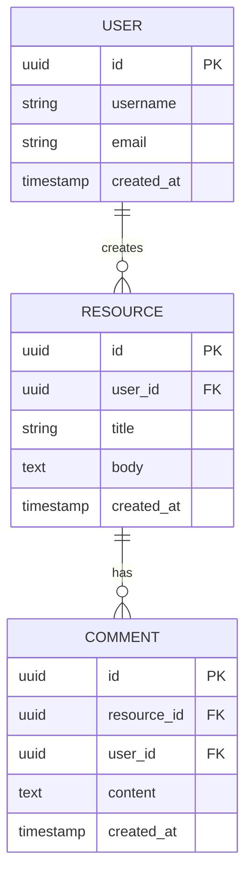
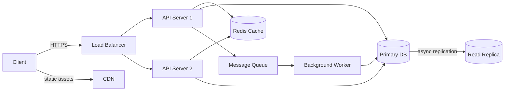
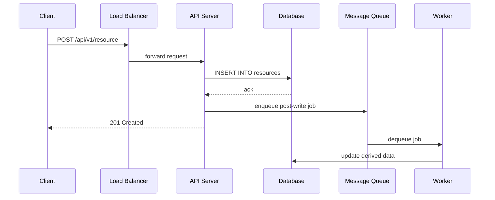
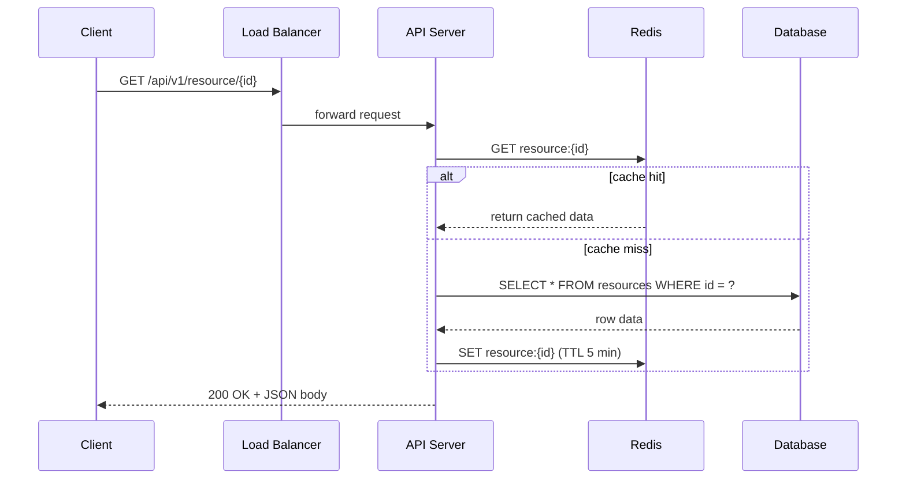

# Design [System Name]

> **How to use this template:** Copy this file, replace `[System Name]` with your system,
> and fill in each section. Sections are ordered to mirror a typical 45-minute system design
> interview. Spend roughly 5 min on requirements, 5 min on API + data model, 15 min on
> architecture + core flows, 10 min on scaling/reliability, and 5 min on trade-offs.

---

## 1. Problem Statement & Requirements

State the problem in one or two sentences. Then split requirements into three buckets.

### 1.1 Functional Requirements

List the core features the system **must** support. Keep it to 4-6 bullets max.

- FR-1: ...
- FR-2: ...
- FR-3: ...

> **Guidance:** Ask clarifying questions before writing these. Interviewers expect you to
> narrow scope yourself. Prioritise the top 2-3 features for the deep dive.

### 1.2 Non-Functional Requirements

- **Availability:** 99.9% uptime (~8.7 h downtime/year)
- **Latency:** p99 read < 200 ms, write < 500 ms
- **Throughput:** X requests per second (derive from estimations below)
- **Consistency model:** eventual / strong / causal (pick one, justify)
- **Durability:** zero data loss for writes that have been acknowledged

### 1.3 Out of Scope

Explicitly list what you will **not** design (authentication, analytics dashboard, etc.).

### 1.4 Assumptions & Estimations (Back-of-Envelope Math)

Walk through numbers step by step. Example for a URL shortener:

```
Total users          = 500 M
Daily active users   = 100 M  (20%)
URLs shortened / day = 100 M  (1 per DAU)
Read:Write ratio     = 100:1
Reads / day          = 10 B
Reads / second       = 10 B / 86 400 ~ 115 K RPS
Writes / second      = 115 K / 100  ~ 1.15 K WPS

Storage per record   = 500 bytes (short URL + long URL + metadata)
Daily new storage    = 100 M * 500 B = 50 GB / day
5-year storage       = 50 GB * 365 * 5 ~ 91 TB
```

> **Tip:** Round aggressively. The point is order-of-magnitude reasoning, not precision.
> Memorise: 86 400 sec/day, 2.6 M sec/month, ~31.5 M sec/year.

---

## 2. API Design

Define the primary REST (or gRPC) endpoints. Include HTTP method, path, request body,
response body, and status codes.

```
POST /api/v1/resource
  Request:  { "field_a": "value", "field_b": 123 }
  Response: 201 { "id": "abc123", "created_at": "..." }

GET /api/v1/resource/{id}
  Response: 200 { "id": "abc123", "field_a": "value", ... }

DELETE /api/v1/resource/{id}
  Response: 204 No Content
```

> **Guidance:**
>
> - Version your API (`/v1/`).
> - Use pagination for list endpoints (`?cursor=...&limit=20`).
> - Mention rate limiting headers (`X-RateLimit-Remaining`).
> - For real-time features, note WebSocket or SSE endpoints separately.

---

## 3. Data Model

### 3.1 Schema

| Table / Collection | Column       | Type         | Notes                   |
| ------------------ | ------------ | ------------ | ----------------------- |
| `resources`        | `id`         | UUID / PK    | Generated via Snowflake |
| `resources`        | `field_a`    | VARCHAR(255) |                         |
| `resources`        | `created_at` | TIMESTAMP    | Indexed                 |

### 3.2 ER Diagram



### 3.3 Database Choice Justification

| Requirement          | Choice        | Reason                                 |
| -------------------- | ------------- | -------------------------------------- |
| Structured relations | PostgreSQL    | ACID, joins, mature ecosystem          |
| High-write counters  | Redis         | In-memory, atomic INCR, sub-ms latency |
| Full-text search     | Elasticsearch | Inverted index, relevance scoring      |
| Blob storage         | S3 / GCS      | Cheap, durable, CDN-friendly           |

> **Guidance:** Always justify _why_ a particular DB, not just _which_ one.

---

## 4. High-Level Architecture

### 4.1 Architecture Diagram



### 4.2 Component Walkthrough

| Component         | Responsibility                                      |
| ----------------- | --------------------------------------------------- |
| Load Balancer     | Distributes traffic, TLS termination, health checks |
| API Server        | Stateless request handling, validation, auth        |
| Cache (Redis)     | Hot-path reads, session store, rate limit counters  |
| Primary DB        | Source of truth for all writes                      |
| Read Replica      | Offloads read traffic from primary                  |
| Message Queue     | Decouples heavy/async work (emails, notifications)  |
| Background Worker | Processes queue jobs (fan-out, analytics ingestion) |
| CDN               | Serves static assets, reduces origin load           |

> **Guidance:** Walk through the diagram left-to-right, explaining each hop.
> Mention protocol (HTTP, gRPC, TCP) at each boundary when relevant.

---

## 5. Deep Dive: Core Flows

### 5.1 Write Path



### 5.2 Read Path



> **Guidance:** Draw at least two flows (read + write). For complex systems add
> a third flow for the most interesting feature (e.g., fan-out for a news feed).

---

## 6. Scaling & Performance

### 6.1 Database Scaling

- **Vertical scaling** first (bigger instance) until cost or IO ceiling.
- **Read replicas** to handle read-heavy traffic (async replication lag ~ 10-100 ms).
- **Sharding** by a shard key (e.g., `user_id % N`). Discuss hot-shard mitigation.

### 6.2 Caching Strategy

- **Cache-aside** (lazy population) for most read paths.
- **Write-through** for data that must be immediately consistent in cache.
- **TTL policy:** short TTL (1-5 min) for mutable data, long TTL for immutable.

### 6.3 CDN & Static Assets

- Push images/videos to object storage, serve via CDN.
- Use signed URLs for private content.

### 6.4 Load Balancing

- Layer 7 (application) LB for path-based routing.
- Consistent hashing for sticky sessions if needed.
- Auto-scaling groups behind the LB, scale on CPU / request count.

> **Tip:** Mention specific numbers: "With 115 K RPS, a single Redis node (100 K ops/s)
> is borderline; we need a Redis Cluster with 2-3 shards."

---

## 7. Reliability & Fault Tolerance

### 7.1 Single Points of Failure (SPOFs)

| Component     | SPOF?   | Mitigation                              |
| ------------- | ------- | --------------------------------------- |
| Load Balancer | Yes     | Active-passive pair, DNS failover       |
| API Server    | No      | Stateless, multiple instances           |
| Primary DB    | Yes     | Synchronous replica, automatic failover |
| Cache         | Partial | Redis Sentinel / Cluster                |
| Message Queue | Yes     | Replicated broker (Kafka 3-node ISR)    |

### 7.2 Replication & Failover

- DB: synchronous replication to one standby, async to read replicas.
- Automatic failover via orchestrator (Patroni for Postgres, etc.).
- RTO < 30 s, RPO = 0 for sync standby.

### 7.3 Monitoring & Alerting

- Metrics: latency percentiles (p50, p95, p99), error rate, queue depth.
- Distributed tracing (Jaeger / OpenTelemetry) for cross-service debugging.
- Alerting thresholds: error rate > 1%, p99 > 500 ms, queue depth > 10 K.

> **Guidance:** Interviewers love hearing about graceful degradation: "If the cache
> goes down, reads still work but latency increases from 20 ms to 200 ms."

---

## 8. Trade-offs & Alternatives

| Decision                 | Chosen               | Alternative          | Why chosen                          |
| ------------------------ | -------------------- | -------------------- | ----------------------------------- |
| SQL vs NoSQL             | PostgreSQL           | DynamoDB             | Need joins + transactions           |
| Push vs Pull for feeds   | Push (fan-out write) | Pull (fan-out read)  | Faster reads, acceptable write cost |
| Sync vs Async processing | Async via queue      | Sync in request path | Lower latency for the user          |

> **Guidance:** Frame every decision as "we chose X over Y because of Z." Interviewers
> care more about your reasoning than the specific technology.

---

## 9. Interview Tips

### What Interviewers Look For

1. **Structured approach** -- do you follow a logical sequence or jump around?
2. **Scope management** -- did you clarify requirements before designing?
3. **Trade-off reasoning** -- can you articulate _why_ behind every choice?
4. **Quantitative thinking** -- did you use numbers to drive decisions?
5. **Communication** -- did you explain your diagram clearly?

### Common Follow-up Questions

- "What happens if [component] goes down?"
- "How would you handle a 10x traffic spike?"
- "What changes if consistency is more important than availability?"
- "How do you handle data migration when re-sharding?"

### Common Pitfalls

- Diving into code or low-level details too early.
- Picking technologies without justification ("I'll use Kafka" -- why?).
- Ignoring non-functional requirements entirely.
- Not drawing diagrams (always draw, even in a phone screen).
- Over-engineering: adding components you cannot justify.

---

> **Checklist before finishing your design:**
>
> - [ ] Requirements are scoped and written down.
> - [ ] Back-of-envelope numbers computed and referenced in decisions.
> - [ ] At least one Mermaid diagram for architecture and one for a core flow.
> - [ ] Database choice justified.
> - [ ] Scaling strategy addresses the computed RPS / storage.
> - [ ] SPOFs identified and mitigated.
> - [ ] At least 2-3 trade-offs explicitly stated.
