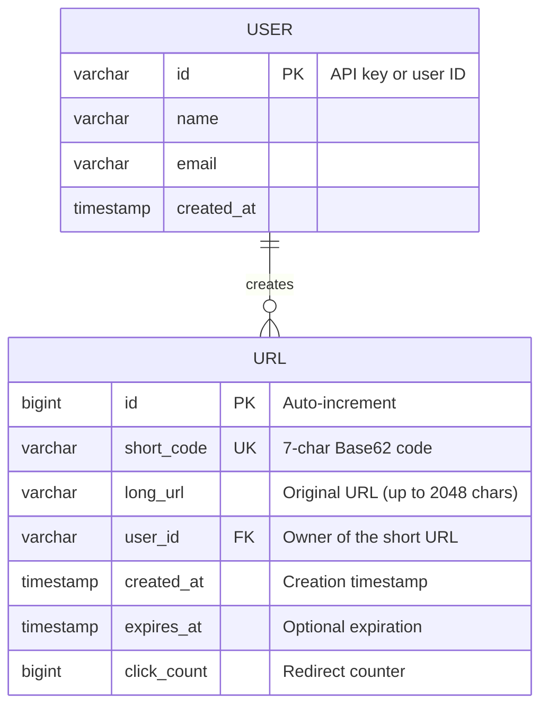
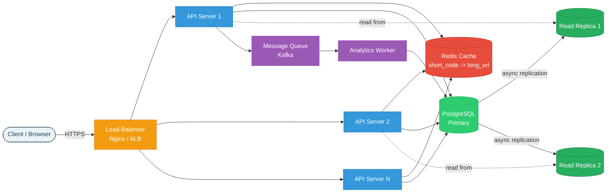
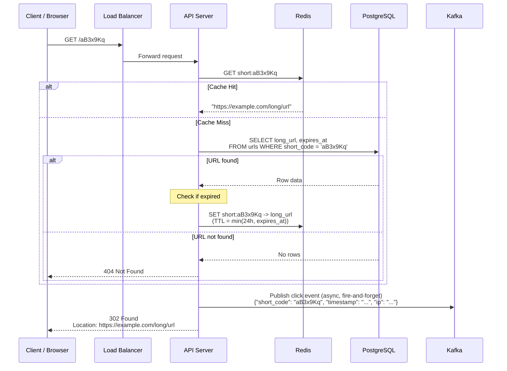
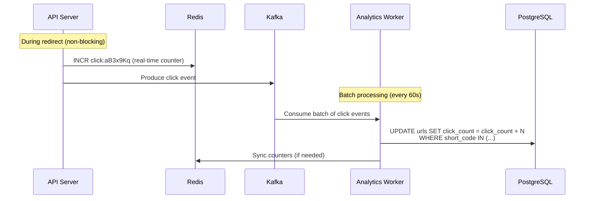

# Design a URL Shortener (bit.ly / TinyURL)

> A URL shortening service takes a long URL and generates a unique, compact short URL
> that redirects users to the original destination. It is one of the most frequently asked
> system design interview questions because it covers hashing, encoding, caching, database
> design, and horizontal scaling in a compact problem space.

---

## 1. Problem Statement & Requirements

Given a long URL, the system should generate a short, unique alias. When a user visits the
short URL, the system should redirect them to the original long URL. The system must handle
billions of redirects per day with low latency.

### 1.1 Functional Requirements

- **FR-1:** Given a long URL, generate a short URL (e.g., `https://short.ly/aB3x9Kq`).
- **FR-2:** Given a short URL, redirect the user to the original long URL (HTTP 301/302).
- **FR-3:** Users can optionally specify a custom alias (e.g., `short.ly/my-brand`).
- **FR-4:** Users can optionally set an expiration time for the short URL.
- **FR-5:** Track analytics -- at minimum, click count per short URL.

### 1.2 Non-Functional Requirements

- **Availability:** 99.99% uptime -- redirection is the core product; downtime = broken links everywhere.
- **Latency:** p99 redirect latency < 50 ms (users expect instant redirects).
- **Throughput:** Read-heavy system with a 100:1 read-to-write ratio.
- **Consistency model:** Eventual consistency is acceptable for analytics. Short URL creation
  must be strongly consistent (no duplicate short codes).
- **Durability:** Once a short URL is created, it must never be lost (until it expires).
- **Unpredictability:** Short URLs should not be sequential or guessable to prevent enumeration attacks.

### 1.3 Out of Scope

- User authentication and account management (assume API key-based access).
- Advanced analytics dashboard (geo, device, referrer breakdowns).
- URL preview or safety scanning (malware/phishing detection).
- Paid subscription tiers and billing.
- UI/frontend design.

### 1.4 Assumptions & Estimations (Back-of-Envelope Math)

#### Traffic Estimates

```
Write (URL creation):
  URLs shortened / day     = 100 M
  Writes / second          = 100 M / 86,400  ~  1,160 WPS
  Peak writes / second     = 1,160 * 3       ~  3,500 WPS (3x peak factor)

Read (Redirects):
  Read:Write ratio         = 100:1
  Redirects / day          = 100 M * 100     = 10 B
  Reads / second           = 10 B / 86,400   ~  115,740 RPS (~116 K RPS)
  Peak reads / second      = 116 K * 3       ~  348 K RPS
```

#### Storage Estimates

```
Average record size:
  short_code (7 chars)     =     7 bytes
  long_url (avg)           =   200 bytes
  user_id                  =     8 bytes (bigint)
  created_at               =     8 bytes
  expires_at               =     8 bytes
  click_count              =     8 bytes
  overhead (indexes etc.)  =   ~60 bytes
  -----------------------------------
  Total per record         ~  300 bytes

Daily new storage          = 100 M * 300 B   = 30 GB / day
Monthly storage            = 30 GB * 30      = 900 GB / month
5-year storage             = 30 GB * 365 * 5 = 54.75 TB ~ 55 TB
Total records in 5 years   = 100 M * 365 * 5 = 182.5 B records
```

#### Bandwidth Estimates

```
Incoming (writes):
  1,160 WPS * 300 B        = 348 KB/s  (negligible)

Outgoing (redirects):
  116 K RPS * 300 B         = 34.8 MB/s ~ 35 MB/s
  Peak                      = 105 MB/s
```

#### Cache Estimates (80-20 Rule)

```
20% of daily URLs generate 80% of traffic.
Cache 20% of daily read requests:

Daily unique URLs accessed  = 10 B / avg_clicks_per_url
Assuming top 20% of URLs    = 100 M * 0.20 = 20 M URLs to cache
Cache memory                = 20 M * 300 B = 6 GB (fits in a single Redis node)
```

#### Short Code Length

```
Using Base62 (a-z, A-Z, 0-9):
  6 chars  = 62^6 = 56.8 B combinations
  7 chars  = 62^7 = 3.52 T combinations

With 182.5 B records in 5 years, 7 characters provides
~19x headroom (3.52 T / 182.5 B). Use 7 characters.
```

---

## 2. API Design

### 2.1 Create Short URL

```
POST /api/v1/urls
Headers:
  Content-Type: application/json
  X-API-Key: <api_key>

Request Body:
{
  "long_url": "https://www.example.com/very/long/path?query=string&foo=bar",
  "custom_alias": "my-brand",          // optional, 4-16 alphanumeric chars
  "expires_at": "2026-12-31T23:59:59Z" // optional, ISO 8601
}

Response: 201 Created
{
  "short_code": "aB3x9Kq",
  "short_url": "https://short.ly/aB3x9Kq",
  "long_url": "https://www.example.com/very/long/path?query=string&foo=bar",
  "expires_at": "2026-12-31T23:59:59Z",
  "created_at": "2026-02-28T10:30:00Z"
}

Error Responses:
  400 Bad Request     -- invalid URL format or custom alias format
  409 Conflict        -- custom alias already taken
  429 Too Many Reqs   -- rate limit exceeded
```

### 2.2 Redirect Short URL

```
GET /{shortCode}

Response: 302 Found (or 301 Moved Permanently)
Headers:
  Location: https://www.example.com/very/long/path?query=string&foo=bar

Error Responses:
  404 Not Found       -- short code does not exist
  410 Gone            -- short URL has expired
```

### 2.3 Get URL Analytics

```
GET /api/v1/urls/{shortCode}/stats
Headers:
  X-API-Key: <api_key>

Response: 200 OK
{
  "short_code": "aB3x9Kq",
  "short_url": "https://short.ly/aB3x9Kq",
  "long_url": "https://www.example.com/very/long/path?query=string&foo=bar",
  "click_count": 15482,
  "created_at": "2026-02-28T10:30:00Z",
  "expires_at": "2026-12-31T23:59:59Z"
}
```

### 2.4 Delete Short URL

```
DELETE /api/v1/urls/{shortCode}
Headers:
  X-API-Key: <api_key>

Response: 204 No Content

Error Responses:
  404 Not Found
  403 Forbidden       -- API key does not own this URL
```

### 2.5 Rate Limiting

All endpoints include rate-limiting headers:

```
X-RateLimit-Limit: 100
X-RateLimit-Remaining: 87
X-RateLimit-Reset: 1709125200
```

---

## 3. Data Model

### 3.1 Schema

| Table / Collection | Column        | Type            | Notes                                    |
| ------------------ | ------------- | --------------- | ---------------------------------------- |
| `urls`             | `id`          | BIGINT / PK     | Auto-increment, internal only            |
| `urls`             | `short_code`  | VARCHAR(16)     | Unique index, the 7-char code            |
| `urls`             | `long_url`    | VARCHAR(2048)   | The original URL                         |
| `urls`             | `user_id`     | VARCHAR(64)     | API key or user identifier, nullable     |
| `urls`             | `created_at`  | TIMESTAMP       | Indexed for TTL cleanup                  |
| `urls`             | `expires_at`  | TIMESTAMP       | Nullable, indexed for expiration queries |
| `urls`             | `click_count` | BIGINT          | Default 0, incremented on redirect       |

### 3.2 ER Diagram



### 3.3 Database Choice Justification

| Requirement                | Choice          | Reason                                                                |
| -------------------------- | --------------- | --------------------------------------------------------------------- |
| Core URL storage           | **PostgreSQL**  | ACID guarantees ensure no duplicate short codes; mature, battle-tested |
| Hot-path redirect cache    | **Redis**       | Sub-ms lookups, 6 GB fits in memory, supports TTL natively            |
| Click count aggregation    | **Redis**       | Atomic `INCR`, batch-flush to Postgres periodically                   |
| Blob/static asset storage  | Not needed      | No files to store in a URL shortener                                  |

**Why PostgreSQL over NoSQL (DynamoDB)?**

- The data model is simple (one primary table) -- no need for flexible schemas.
- We need a unique constraint on `short_code` to prevent collisions at the DB level.
- PostgreSQL handles 3,500 WPS easily (single node can handle 10K+ TPS).
- Read replicas offload the 116K RPS read traffic.
- If scale exceeds single-node limits, we shard by hash of `short_code`.

**When DynamoDB would be better:**

- If the system needed to scale beyond a single region with built-in global tables.
- If operational overhead of managing PostgreSQL at scale is a concern.
- DynamoDB offers predictable single-digit-ms latency at any scale.

> Both are valid choices. In an interview, pick one and justify it confidently.

---

## 4. High-Level Architecture

### 4.1 Architecture Diagram



### 4.2 Component Walkthrough

| Component              | Responsibility                                                                  |
| ---------------------- | ------------------------------------------------------------------------------- |
| **Load Balancer**      | Distributes traffic across API servers. TLS termination. Health checks.          |
| **API Server**         | Stateless application servers. Handle URL creation and redirect logic.           |
| **Redis Cache**        | Stores `short_code -> long_url` mappings. Cache-aside pattern. TTL-based eviction. |
| **PostgreSQL Primary** | Source of truth. Handles all writes (URL creation). Enforces unique constraints.   |
| **Read Replicas**      | Serve read queries (analytics, fallback on cache miss). Async replication.         |
| **Kafka / MQ**         | Buffers click events for async processing. Decouples redirect path from analytics. |
| **Analytics Worker**   | Consumes click events from Kafka. Batch-updates `click_count` in Postgres.         |

### 4.3 Request Routing

```
Redirect requests:  GET /{shortCode}
  -> Client -> LB -> API Server -> Redis (cache hit? return) -> DB (cache miss) -> respond

Create requests:    POST /api/v1/urls
  -> Client -> LB -> API Server -> Generate short_code -> Write to DB -> Set in Cache -> respond

Analytics requests: GET /api/v1/urls/{shortCode}/stats
  -> Client -> LB -> API Server -> Read Replica (or Cache) -> respond
```

---

## 5. Deep Dive: Core Flows

### 5.1 URL Shortening (Write Path)

#### Short Code Generation Strategies

There are three main approaches, each with different trade-offs:

**Approach 1: Counter-Based (Auto-Increment ID -> Base62)**

```
1. Insert row into DB, get auto-increment ID (e.g., 12345678)
2. Convert ID to Base62: 12345678 -> "dnh6"
3. Pad to 7 characters: "000dnh6" or let it grow naturally
4. Store the Base62 string as short_code
```

| Pros                                     | Cons                                          |
| ---------------------------------------- | --------------------------------------------- |
| Zero collisions (IDs are unique)         | Predictable / sequential (security concern)   |
| Simple implementation                    | Single point of failure (ID generator)        |
| No DB lookups to check for collisions    | Requires a distributed counter at scale       |

**Approach 2: MD5/SHA256 Hash + First 7 Characters**

```
1. Hash the long URL: MD5("https://example.com/...") = "e4d909c290d0fb1ca068..."
2. Take first 43 bits (7 Base62 chars worth): "e4d909c"
3. Convert to Base62 or use the hex directly
4. If collision exists in DB, append a counter and re-hash
```

| Pros                                     | Cons                                          |
| ---------------------------------------- | --------------------------------------------- |
| Deterministic (same URL -> same hash)    | Collisions possible, need resolution strategy |
| No central counter needed                | Extra DB lookup to check for collision        |
| Works well in distributed systems        | Hash + collision handling adds complexity      |

**Approach 3: Pre-Generated Random Keys (Key Generation Service - KGS)**

```
1. A background service pre-generates millions of unique 7-char Base62 keys
2. Stores them in a "keys" table with status: available / used
3. On URL creation, pop a key from the available pool
4. Mark it as used
```

| Pros                                     | Cons                                              |
| ---------------------------------------- | ------------------------------------------------- |
| Zero collisions at creation time         | Requires a separate KGS service                   |
| No hashing or encoding needed            | KGS itself becomes a potential SPOF                |
| Unpredictable URLs by design             | Must pre-generate and store billions of keys       |
| Very fast -- just a key lookup           | Synchronization needed for multi-node KGS          |

#### Recommended: Counter-Based with Randomization

Use a **distributed counter** (e.g., Twitter Snowflake-style ID) and encode it with Base62.
To avoid predictability, apply a **bijective shuffle** (or use a range-based approach where
each server gets a different ID range).

```python
# Base62 encoding
CHARSET = "0123456789abcdefghijklmnopqrstuvwxyzABCDEFGHIJKLMNOPQRSTUVWXYZ"

def base62_encode(num: int) -> str:
    if num == 0:
        return CHARSET[0]
    result = []
    while num > 0:
        result.append(CHARSET[num % 62])
        num //= 62
    return ''.join(reversed(result))

def base62_decode(s: str) -> int:
    num = 0
    for char in s:
        num = num * 62 + CHARSET.index(char)
    return num

# Example: base62_encode(12345678901) -> "dnh6POr" (7 chars)
```

#### Collision Handling

Even with the counter approach, custom aliases can collide. For hash-based approaches:

1. **Bloom Filter (first check):** In-memory probabilistic check. If the bloom filter says
   "not present," the key is guaranteed unique. If it says "maybe present," check the DB.
2. **DB Unique Constraint (final check):** The `short_code` column has a UNIQUE index.
   If insertion fails with a duplicate key error, retry with a new code.

```
Collision probability with random 7-char Base62:
  After 100B URLs: 100B / 3.52T = 2.84% of key space used
  Birthday paradox collision probability is negligible with counter-based approach
```

#### Write Flow Sequence Diagram

```mermaid
sequenceDiagram
    participant C as Client
    participant LB as Load Balancer
    participant API as API Server
    participant Counter as ID Generator<br/>(Snowflake)
    participant DB as PostgreSQL
    participant Cache as Redis

    C->>LB: POST /api/v1/urls<br/>{"long_url": "https://example.com/..."}
    LB->>API: Forward request

    alt Custom alias provided
        API->>DB: SELECT FROM urls WHERE short_code = 'custom'
        alt Alias available
            DB-->>API: Not found (available)
        else Alias taken
            DB-->>API: Row exists
            API-->>C: 409 Conflict
        end
    else No custom alias
        API->>Counter: Get next unique ID
        Counter-->>API: ID = 12345678901
        Note over API: Base62 encode:<br/>12345678901 -> "dnh6POr"
    end

    API->>DB: INSERT INTO urls (short_code, long_url, ...)
    DB-->>API: Success (row inserted)

    API->>Cache: SET short:dnh6POr -> long_url (TTL 24h)
    Cache-->>API: OK

    API-->>C: 201 Created<br/>{"short_url": "https://short.ly/dnh6POr"}
```



### 5.2 URL Redirect (Read Path)

#### 301 vs 302 Redirect: A Critical Decision

| Aspect                | 301 (Moved Permanently)              | 302 (Found / Temporary)              |
| --------------------- | ------------------------------------ | ------------------------------------ |
| **Browser behavior**  | Caches the redirect                  | Does NOT cache the redirect          |
| **Subsequent visits**  | Browser goes directly to long URL    | Browser hits our server every time   |
| **Server load**       | Lower (browser caches)              | Higher (every click hits us)         |
| **Analytics**         | Cannot track clicks after first one | Can track every single click         |
| **SEO**               | Passes link juice to long URL       | Retains link juice on short URL      |
| **Our recommendation** | --                                  | **Use 302** (need analytics)         |

**Decision: Use 302 (Temporary Redirect)**

We need to track every click for analytics. With 301, after the browser caches the redirect,
subsequent visits bypass our servers entirely and we lose visibility. Since analytics (click
count) is a core requirement, 302 is the right choice.

> If analytics were not required, 301 would reduce server load significantly.

#### Cache-Aside Pattern

The read path uses the **cache-aside** (lazy loading) pattern:

1. Check Redis for `short_code -> long_url` mapping.
2. **Cache hit:** Return the long URL immediately (sub-ms latency).
3. **Cache miss:** Query the database, populate the cache, then return.

```
Expected cache hit rate: ~80-90%
  (80-20 rule: 20% of URLs generate 80% of traffic)

With 90% cache hit rate:
  Redis handles:  ~104 K RPS (90% of 116K)
  DB handles:     ~12 K RPS  (10% of 116K) -- spread across replicas
```

#### Read Flow Sequence Diagram



### 5.3 Analytics (Click Tracking) Flow

Click tracking should NOT be on the critical path of the redirect. We use an async approach:



**Why async?**

- The redirect (302 response) is time-critical -- users should not wait for a DB write.
- Click events are buffered in Kafka and batch-processed.
- Redis `INCR` is atomic and sub-ms, giving real-time approximate counts.
- The DB is updated in batches (every 30-60 seconds), reducing write pressure.

---

## 6. Scaling & Performance

### 6.1 Database Scaling

#### Sharding Strategy

With 182.5 B records over 5 years and 55 TB of data, a single PostgreSQL node will not
suffice. We shard by **hash of `short_code`**.

```
Shard key:    hash(short_code) % num_shards
Num shards:   Start with 16, expand to 64 as data grows

Why short_code?
  - Redirect queries always have short_code (direct shard lookup, no scatter-gather)
  - Evenly distributed (Base62 codes are pseudo-random)
  - No hot shards (unlike sharding by user_id where a viral user overloads one shard)

Per-shard data (16 shards, 5 years):
  Records:  182.5 B / 16 = 11.4 B per shard
  Storage:  55 TB / 16   = 3.4 TB per shard (manageable)
```

#### Read Replicas

```
Each shard has 2 read replicas:
  Total DB instances = 16 shards * 3 (1 primary + 2 replicas) = 48 instances

Read RPS per replica (with 90% cache hit rate):
  12 K RPS / 32 read replicas = 375 RPS per replica (very comfortable)
```

### 6.2 Caching Strategy

#### Redis Cluster Setup

```
Cache size:  6 GB (20M URLs * 300 bytes)
Redis nodes: 3-node cluster (2 GB per node + headroom)
Replication: Each node has 1 replica = 6 Redis instances total

Eviction policy: allkeys-LRU (evict least recently used keys when memory is full)
Default TTL:     24 hours (re-populate on next cache miss)
Max TTL:         min(24 hours, URL expiration time)
```

#### What to Cache

| Data                     | Cache Key              | TTL     | Why                              |
| ------------------------ | ---------------------- | ------- | -------------------------------- |
| short_code -> long_url   | `short:{code}`         | 24h     | Hot-path redirect, highest QPS   |
| Click counts (real-time) | `click:{code}`         | No TTL  | Atomic INCR, periodically flushed |
| Bloom filter             | In-memory on API server | --     | Quick collision check on writes  |

#### Cache Warming

On service startup or after a cache flush, the top 1000 most-clicked URLs are pre-loaded
into the cache to avoid a thundering herd of DB queries.

### 6.3 Load Balancing

```
Layer 7 (Application) Load Balancer:
  - Path-based routing:
      /{shortCode}        -> Redirect service pool
      /api/v1/*           -> API service pool
  - Algorithm: Round-robin (servers are stateless)
  - Health checks: GET /health every 10s
  - Auto-scaling: scale API servers when CPU > 60% or RPS > 10K per instance
```

### 6.4 Performance Summary

| Metric               | Value                   | How                                      |
| --------------------- | ----------------------- | ---------------------------------------- |
| Redirect latency p50 | ~5 ms                   | Redis cache hit                          |
| Redirect latency p99 | ~30 ms                  | Cache miss + DB read replica query       |
| Write latency p50    | ~15 ms                  | ID generation + DB insert + cache set    |
| Write latency p99    | ~80 ms                  | Includes custom alias collision check    |
| Cache hit rate        | 85-95%                  | 80-20 rule, 24h TTL                      |
| Availability          | 99.99%                  | Multi-AZ, replicated DB, Redis cluster   |

---

## 7. Reliability & Fault Tolerance

### 7.1 Single Points of Failure (SPOFs) and Mitigations

| Component           | SPOF? | Mitigation                                                            |
| ------------------- | ----- | --------------------------------------------------------------------- |
| Load Balancer       | Yes   | Active-passive pair (AWS ALB is managed, inherently HA)               |
| API Servers         | No    | Stateless, auto-scaling group, minimum 3 instances across 2 AZs      |
| Redis Cache         | Yes   | Redis Cluster with 3 masters + 3 replicas across AZs                 |
| PostgreSQL Primary  | Yes   | Synchronous standby in different AZ, auto-failover via Patroni        |
| ID Generator        | Yes   | Range-based: each API server pre-fetches a block of 10K IDs          |
| Kafka               | No    | 3-broker cluster, replication factor 3, min.insync.replicas = 2       |

### 7.2 Database Replication and Failover

```
Primary (AZ-1) --sync replication--> Standby (AZ-2)
                --async replication--> Read Replica 1 (AZ-1)
                --async replication--> Read Replica 2 (AZ-2)

Failover process (automated via Patroni or AWS RDS Multi-AZ):
  1. Primary fails -> health check detects within 5-10 seconds
  2. Standby promoted to new primary (RPO = 0, synchronous)
  3. DNS/connection pool updated (RTO < 30 seconds)
  4. Old primary becomes standby when it recovers
```

### 7.3 Cache Failure Handling

```
Scenario: Redis cluster goes down entirely

Impact:
  - All redirects become cache misses -> DB hit
  - Read RPS on DB: 116 K RPS (from ~12 K RPS with cache)
  - DB can handle ~50 K RPS across replicas

Mitigation:
  1. Circuit breaker: detect cache failure, skip cache lookup (avoid timeouts)
  2. Local in-process cache (Caffeine / Guava) on each API server
     - Size: 100K entries, TTL 5 min
     - Reduces DB load during Redis recovery
  3. Graceful degradation: redirect latency increases from 5ms to 30-50ms
     - This is acceptable -- users still get redirected
  4. Redis Cluster auto-heals: replica promoted to master automatically
```

### 7.4 Rate Limiting to Prevent Abuse

Rate limiting protects the service from:
- Abuse (someone generating billions of short URLs to exhaust the key space).
- Scraping (enumerating short codes to discover URLs).
- DDoS (overwhelming the redirect endpoint).

```
Rate Limits:
  URL creation:   100 requests / minute / API key
  Redirects:      1,000 requests / minute / IP (protects against scraping)
  Analytics:      60 requests / minute / API key

Implementation:
  - Sliding window counter in Redis
  - Key: "ratelimit:{api_key}:{endpoint}:{window}"
  - Token bucket algorithm for burst tolerance
```

### 7.5 URL Expiration Cleanup

```
Expired URL handling:
  1. Lazy deletion: On redirect, check expires_at. If expired, return 410 Gone.
  2. Active cleanup: Background cron job runs every hour:
     DELETE FROM urls WHERE expires_at < NOW() AND expires_at IS NOT NULL
     (Use LIMIT 10000 to avoid long-running transactions)
  3. Cache: TTL is set to min(24h, time_until_expiry), so expired URLs
     naturally fall out of cache.
```

---

## 8. Trade-offs & Alternatives

### 8.1 Key Design Decisions

| Decision                    | Chosen                        | Alternative                  | Why Chosen                                                      |
| --------------------------- | ----------------------------- | ---------------------------- | --------------------------------------------------------------- |
| Short code generation       | Counter-based + Base62        | MD5 hash + first 7 chars     | Zero collisions, simpler, faster                                |
| Short code generation       | Counter-based + Base62        | Pre-generated keys (KGS)     | No extra service to manage, simpler ops                         |
| Redirect type               | 302 (Temporary)               | 301 (Permanent)              | Need to track every click for analytics                         |
| Database                    | PostgreSQL (sharded)          | DynamoDB                     | ACID for unique constraints, team familiarity, cost-effective    |
| Cache                       | Redis Cluster                 | Memcached                    | Richer data structures, persistence, pub/sub for invalidation   |
| Click tracking              | Async (Kafka + batch)         | Sync (DB update per click)   | Cannot afford DB write on every redirect at 116K RPS            |
| ID generation               | Snowflake-style (distributed) | Single auto-increment        | No SPOF, supports horizontal scaling                            |

### 8.2 Base62 vs MD5 vs UUID

| Method     | Length  | Collisions     | Predictable? | Speed    | Use Case                  |
| ---------- | ------- | -------------- | ------------ | -------- | ------------------------- |
| **Base62** | 7 chars | None (counter) | Somewhat*    | Fast     | Best for URL shorteners   |
| **MD5**    | 7 chars | Possible       | No           | Medium   | When dedup is important   |
| **UUID**   | 22 chars (Base64) | None    | No           | Fast     | Too long for short URLs   |
| **NanoID** | 7 chars | Possible       | No           | Fast     | Good alternative to MD5   |

*Counter-based Base62 can be made unpredictable by using a bijective shuffle or XOR with
a secret key before encoding. This maps sequential IDs to seemingly random short codes.

### 8.3 SQL vs NoSQL Deep Comparison

| Factor                | PostgreSQL                    | DynamoDB                         |
| --------------------- | ----------------------------- | -------------------------------- |
| **Schema**            | Fixed, enforced               | Flexible, schema-less            |
| **Unique constraint** | Native UNIQUE index           | Conditional writes (more complex)|
| **Scaling**           | Manual sharding               | Auto-scaling built-in            |
| **Cost at scale**     | Lower (self-managed)          | Higher (pay per request)         |
| **Ops complexity**    | Higher (manage replicas)      | Lower (fully managed)            |
| **Joins**             | Supported                     | Not supported                    |
| **Latency**           | 2-10 ms                       | 1-5 ms (single-digit guaranteed) |
| **Transactions**      | Full ACID                     | Limited (single-table only)      |

**Verdict:** For a URL shortener, the data model is simple (one main table, key-value-like
access pattern). Both work well. PostgreSQL is chosen for its strong uniqueness guarantees
and team familiarity, but DynamoDB is equally valid.

### 8.4 301 vs 302: When to Switch

```
Use 301 when:
  - Analytics are NOT required
  - You want to minimize server load
  - SEO pass-through is important (e.g., marketing links)

Use 302 when:
  - Analytics ARE required (our case)
  - You might change the destination URL later
  - A/B testing (same short URL -> different destinations based on % split)
  - Expiration is supported (301 cached in browser would ignore expiration)
```

---

## 9. Interview Tips

### 9.1 What Interviewers Look For

| Signal                    | How to Demonstrate It                                                       |
| ------------------------- | --------------------------------------------------------------------------- |
| **Requirement scoping**   | Ask: "Do we need analytics? Custom aliases? Expiration?" before designing   |
| **Estimation skills**     | Show the QPS, storage, and cache math. Reference it when sizing components  |
| **Encoding knowledge**    | Explain Base62 encoding, why 7 chars, and the collision math                |
| **Trade-off reasoning**   | "We chose 302 over 301 because analytics is a core requirement"             |
| **Scaling awareness**     | Discuss sharding, caching, and what happens at 10x or 100x the traffic      |
| **Reliability thinking**  | Identify SPOFs proactively and explain failover strategies                   |

### 9.2 Common Follow-Up Questions

**Q: "What if two users submit the same long URL?"**
- Option A: Return the same short URL (dedup). Saves storage but complicates user-specific analytics.
- Option B: Generate different short URLs. Simpler, better per-user analytics. (Recommended)

**Q: "How do you prevent abuse / someone exhausting the key space?"**
- Rate limiting per API key (100 URLs/min).
- Key space of 3.52T codes at 100M/day lasts 96 years. Not a practical concern.
- Monitor for anomalous creation patterns and block abusive keys.

**Q: "How would you handle a 10x traffic spike?"**
- Auto-scale API servers (stateless, can add instances in seconds).
- Redis handles 100K+ ops/s per node, already over-provisioned.
- DB read replicas absorb read spikes. If needed, add more replicas.
- Rate limit aggressive clients to protect the system.

**Q: "How do you handle a short URL that goes viral (hot key)?"**
- Local in-process cache on every API server (Caffeine, 5-min TTL).
- This distributes the hot key across all servers' local caches.
- Redis can also handle high QPS on a single key (~100K ops/s is fine).

**Q: "What if the ID generator / counter goes down?"**
- Each API server pre-fetches a range of IDs (e.g., server 1 gets 1-10000, server 2 gets 10001-20000).
- If the central counter is down, servers use their remaining pre-fetched IDs.
- Alternatively, use a Snowflake-style ID that embeds machine ID + timestamp, requiring no central coordinator.

**Q: "How do you prevent short URL enumeration (security)?"**
- Use 7 characters (3.52T possibilities) -- brute-force enumeration is infeasible.
- Apply a bijective function to map sequential IDs to non-sequential short codes.
- Rate limit redirect attempts per IP to 1000/min.
- Monitor for scanning patterns and block offending IPs.

**Q: "How would you add multi-region support?"**
- Deploy read replicas and Redis caches in each region.
- Writes go to the primary region, replicated to secondary regions asynchronously.
- DNS-based routing (GeoDNS) sends users to the nearest region.
- For writes in non-primary regions, either proxy to primary or use conflict-free ID ranges per region.

### 9.3 Pitfalls to Avoid

| Pitfall                                     | Why It Hurts You                                                |
| ------------------------------------------- | --------------------------------------------------------------- |
| Jumping into Base62 encoding without scoping | Shows lack of structured thinking. Always start with requirements. |
| Using MD5 without discussing collisions      | Interviewers will ask "what happens on collision?" Be ready.     |
| Choosing 301 redirect blindly               | If analytics is a requirement, 301 breaks click tracking.        |
| Ignoring the write path                     | Many candidates only discuss reads. Both paths matter.           |
| Not computing cache size                    | "Use Redis" without sizing is hand-waving. Show the 6 GB math.  |
| Over-engineering with microservices          | A URL shortener is a simple system. Do not add Kubernetes, service mesh, etc. unless asked. |
| Forgetting about expiration                 | If TTL is a requirement, explain lazy + active deletion.         |
| No back-of-envelope numbers                 | Without numbers, every design decision is arbitrary.             |

### 9.4 Interview Timeline (45-Minute Format)

```
 0:00 -  3:00  [3 min]  Clarify requirements. Ask about scale, analytics, custom aliases.
 3:00 -  8:00  [5 min]  Back-of-envelope math. QPS, storage, cache, short code length.
 8:00 - 13:00  [5 min]  API design. Define 3-4 endpoints with request/response.
13:00 - 17:00  [4 min]  Data model. URL table, ER diagram, DB choice.
17:00 - 22:00  [5 min]  High-level architecture. Draw the diagram, walk through components.
22:00 - 32:00  [10 min] Deep dive. Write path (encoding, collision handling). Read path (301 vs 302, cache).
32:00 - 38:00  [6 min]  Scaling & reliability. Sharding, replicas, SPOF analysis, failover.
38:00 - 43:00  [5 min]  Trade-offs. Summarize key decisions and alternatives.
43:00 - 45:00  [2 min]  Wrap up. Mention what you would add with more time.
```

---

## Quick Reference Card

```
System:        URL Shortener
Read:Write:    100:1
QPS:           ~116 K reads/s, ~1.2 K writes/s
Storage (5y):  ~55 TB, ~182 B records
Short code:    7 characters, Base62, 3.52 T combinations
DB:            PostgreSQL (sharded by short_code hash)
Cache:         Redis Cluster (~6 GB, 85-95% hit rate)
Redirect:      302 (to track analytics)
ID generation: Snowflake-style counter -> Base62 encode
Key trade-off: 302 over 301 for analytics at the cost of higher server load
```
