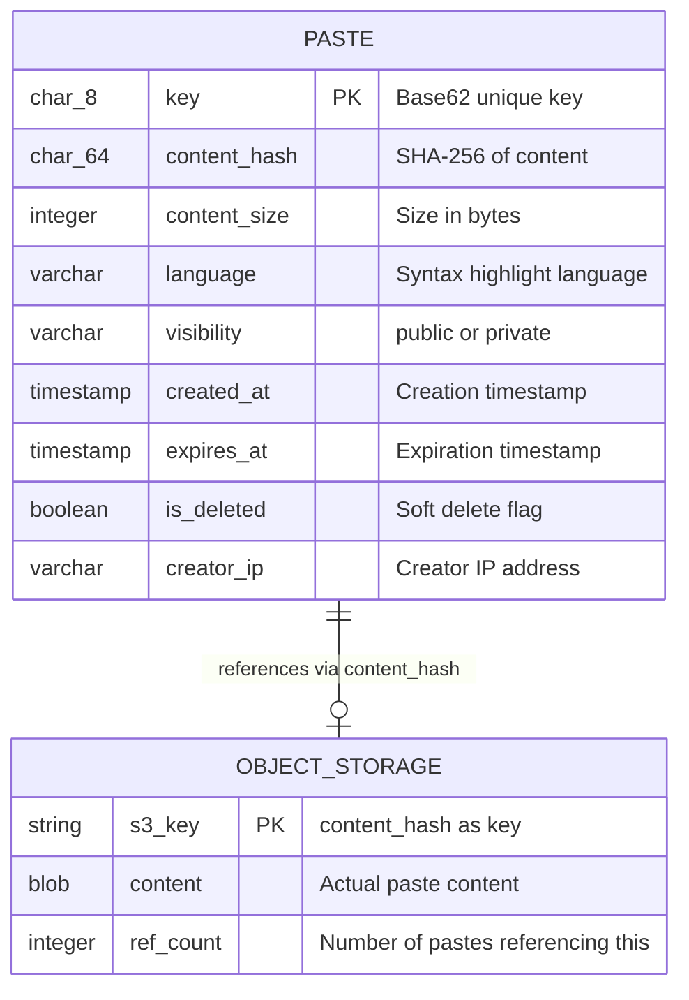
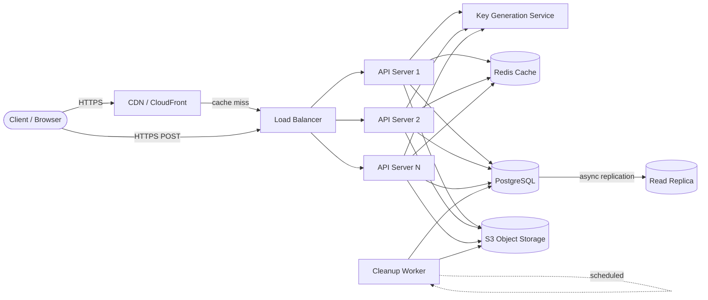
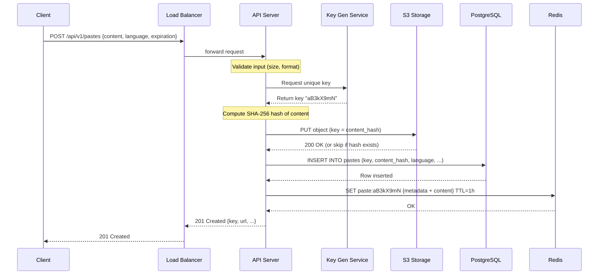
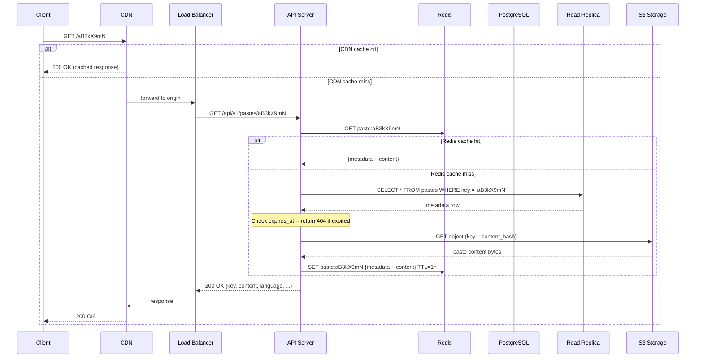
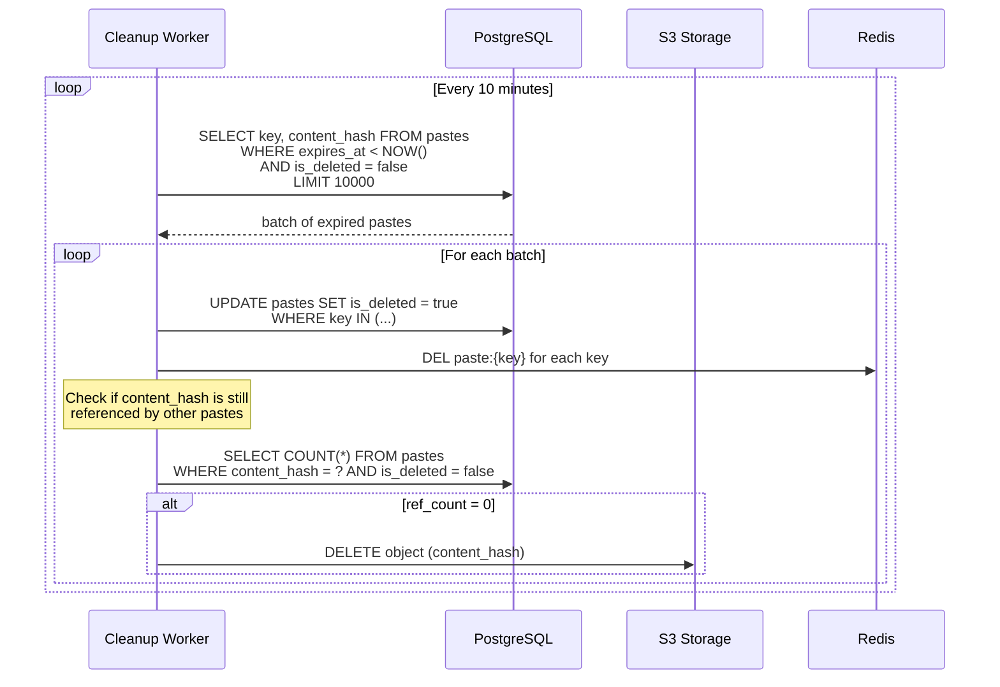

# Design Pastebin

> A web service that allows users to store and share plain text or code snippets via
> a unique URL. Think of it as a simplified GitHub Gist -- the user pastes content,
> gets a short link, and anyone with that link can view the content.

---

## 1. Problem Statement & Requirements

Design a Pastebin-like service where users can create, read, and manage text snippets
that are accessible via unique short URLs. The system must handle millions of pastes
per day with very low read latency.

### 1.1 Functional Requirements

- **FR-1:** Users can create a paste by submitting text content (up to 10 MB).
- **FR-2:** Each paste gets a unique, short URL (e.g., `pastebin.com/aB3kX9`).
- **FR-3:** Users can read a paste by visiting its URL.
- **FR-4:** Pastes can have an expiration time (e.g., 10 minutes, 1 hour, 1 day, 1 week, never).
- **FR-5:** Pastes can be marked as **public** or **private** (unlisted -- accessible only via URL).
- **FR-6:** Syntax highlighting based on user-selected language (stored as metadata, rendered client-side).

> **Priority for deep dive:** Create paste (write path), read paste (read path), and
> expiration handling.

### 1.2 Non-Functional Requirements

- **Availability:** 99.9% uptime (~8.7 hours downtime/year). Reads are more critical than writes.
- **Latency:** p99 read < 200 ms, p99 write < 500 ms.
- **Throughput:** ~58 writes/s, ~290 reads/s (derived below).
- **Consistency model:** Eventual consistency is acceptable. A paste may take a few hundred
  milliseconds to become globally readable after creation.
- **Durability:** Once a write is acknowledged, the paste must not be lost (until expiration).
- **Scalability:** Support pastes up to 10 MB in size without degrading the system.

### 1.3 Out of Scope

- User authentication and accounts (treat all users as anonymous for this design).
- Paste editing or versioning (pastes are immutable once created).
- Real-time collaboration or live editing.
- Analytics dashboard (view counts, traffic sources).
- Paste search or discovery features.
- Rate limiting design (assume it exists at the API gateway level).
- Custom vanity URLs.

### 1.4 Assumptions & Estimations (Back-of-Envelope Math)

#### Traffic

```
Pastes created / day       = 5 M
Reads / day                = 25 M
Read:Write ratio           = 5:1

Writes / second            = 5 M / 86,400 ≈ 58 WPS
Reads / second             = 25 M / 86,400 ≈ 290 RPS
```

#### Storage

```
Average paste size         = 10 KB
Max paste size             = 10 MB

Daily new content          = 5 M * 10 KB = 50 GB / day
Monthly new content        = 50 GB * 30  = 1.5 TB / month
5-year content storage     = 50 GB * 365 * 5 ≈ 91 TB

Metadata per paste         ≈ 500 bytes (key, timestamps, language, visibility, etc.)
Daily metadata             = 5 M * 500 B = 2.5 GB / day
5-year metadata storage    = 2.5 GB * 365 * 5 ≈ 4.5 TB
```

#### Bandwidth

```
Incoming (writes)          = 58 * 10 KB  ≈ 580 KB/s  ≈ 4.6 Mbps
Outgoing (reads)           = 290 * 10 KB ≈ 2.9 MB/s  ≈ 23.2 Mbps
```

#### Key Space

```
5 M pastes/day * 365 * 10 years = 18.25 B total pastes
Base62 key length needed:
  - 6 chars → 62^6 = 56.8 B combinations (enough for 10 years with margin)
  - 7 chars → 62^7 = 3.5 T combinations (very comfortable)

Decision: Use 8-character Base62 keys for safety margin.
```

> **Summary:** This is a read-heavy but not extreme system. The primary challenge is
> storing and serving large blobs efficiently, not raw QPS. Storage grows at ~50 GB/day,
> making object storage (S3) the right choice over relational DB storage.

---

## 2. API Design

All endpoints are RESTful over HTTPS. The API is versioned under `/v1/`.

### 2.1 Create Paste

```
POST /api/v1/pastes
Content-Type: application/json

Request:
{
    "content": "print('hello world')",
    "language": "python",
    "expiration": "1d",
    "visibility": "public"
}

Response: 201 Created
{
    "key": "aB3kX9mN",
    "url": "https://pastebin.com/aB3kX9mN",
    "language": "python",
    "visibility": "public",
    "expires_at": "2026-03-01T12:00:00Z",
    "created_at": "2026-02-28T12:00:00Z"
}
```

| Field        | Type   | Required | Notes                                                  |
| ------------ | ------ | -------- | ------------------------------------------------------ |
| `content`    | string | Yes      | The paste text, max 10 MB                              |
| `language`   | string | No       | For syntax highlighting (e.g., python, javascript, go) |
| `expiration` | string | No       | One of: `10m`, `1h`, `1d`, `1w`, `1M`, `never`        |
| `visibility` | string | No       | `public` (default) or `private`                        |

**Error Responses:**

| Status | Condition                            |
| ------ | ------------------------------------ |
| 400    | Empty content or content exceeds 10 MB |
| 413    | Payload too large (enforced at LB)   |
| 429    | Rate limit exceeded                  |
| 500    | Internal server error                |

### 2.2 Read Paste

```
GET /api/v1/pastes/{key}

Response: 200 OK
{
    "key": "aB3kX9mN",
    "content": "print('hello world')",
    "language": "python",
    "visibility": "public",
    "expires_at": "2026-03-01T12:00:00Z",
    "created_at": "2026-02-28T12:00:00Z"
}
```

**Error Responses:**

| Status | Condition                        |
| ------ | -------------------------------- |
| 404    | Paste not found or expired       |
| 410    | Paste has been explicitly deleted |
| 500    | Internal server error            |

> **Note:** The raw content can also be served at `GET /api/v1/pastes/{key}/raw`
> which returns `Content-Type: text/plain` with just the paste body. This is useful
> for `curl` users and embedding.

### 2.3 Delete Paste

```
DELETE /api/v1/pastes/{key}

Response: 204 No Content
```

| Status | Condition                                    |
| ------ | -------------------------------------------- |
| 404    | Paste not found                              |
| 403    | Delete not allowed (only creator can delete) |

> **Notes:** Rate limiting headers included. List public pastes via
> `GET /api/v1/pastes/recent?cursor=...&limit=20`. Large pastes can use `multipart/form-data`.

---

## 3. Data Model

The key insight is to **separate metadata from content**. Metadata lives in a relational
database for fast lookups and querying. Content lives in object storage (S3) for cheap,
durable, and scalable blob storage.

### 3.1 Schema

**Pastes Metadata Table (PostgreSQL)**

| Column         | Type         | Notes                                           |
| -------------- | ------------ | ----------------------------------------------- |
| `key`          | CHAR(8)      | Primary key, Base62 encoded                     |
| `content_hash` | CHAR(64)     | SHA-256 hash of content, used for dedup + S3 key |
| `content_size` | INTEGER      | Size in bytes                                   |
| `language`     | VARCHAR(32)  | Syntax highlighting language                    |
| `visibility`   | VARCHAR(8)   | `public` or `private`                           |
| `created_at`   | TIMESTAMP    | Creation time, indexed                          |
| `expires_at`   | TIMESTAMP    | Expiration time, indexed. NULL = never expires  |
| `is_deleted`   | BOOLEAN      | Soft delete flag, default false                 |
| `creator_ip`   | VARCHAR(45)  | For abuse prevention (IPv4/IPv6)                |

**Indexes:**

```sql
CREATE INDEX idx_pastes_expires_at ON pastes (expires_at)
    WHERE expires_at IS NOT NULL AND is_deleted = false;

CREATE INDEX idx_pastes_created_at ON pastes (created_at)
    WHERE visibility = 'public' AND is_deleted = false;

CREATE INDEX idx_pastes_content_hash ON pastes (content_hash);
```

### 3.2 ER Diagram



### 3.3 Storage Layout

**Object Storage (S3):**

```
s3://pastebin-content/
  ├── ab/                          # First 2 chars of hash (partitioning)
  │   ├── cd/                      # Next 2 chars
  │   │   └── abcdef123456...      # Full SHA-256 hash as filename
  │   └── ...
  └── ...
```

Content is stored with the SHA-256 hash as the key. This enables **content-addressable
storage** -- if two users paste identical content, it is stored only once.

### 3.4 Database Choice Justification

| Requirement            | Choice       | Reason                                             |
| ---------------------- | ------------ | -------------------------------------------------- |
| Metadata storage       | PostgreSQL   | ACID guarantees, efficient indexing on `expires_at` |
| Paste content          | Amazon S3    | Designed for blobs, 11 nines durability, cheap      |
| Hot paste caching      | Redis        | Sub-ms latency, TTL support, simple key-value       |
| CDN for popular pastes | CloudFront   | Edge caching, reduces origin load                   |

> **Why not store content in the DB?** At 50 GB/day, PostgreSQL bloats with blobs (slow
> backups, VACUUM overhead). S3 is purpose-built: 11 nines durability, ~$0.023/GB/month.

---

## 4. High-Level Architecture

### 4.1 Architecture Diagram



### 4.2 Component Walkthrough

| Component              | Responsibility                                                     |
| ---------------------- | ------------------------------------------------------------------ |
| **CDN (CloudFront)**   | Caches popular public pastes at edge locations worldwide           |
| **Load Balancer**      | Distributes traffic across API servers, TLS termination            |
| **API Server**         | Stateless request handling: validate, generate key, store, respond |
| **Key Generation Svc** | Pre-generates unique 8-char Base62 keys to avoid collisions        |
| **Redis Cache**        | Caches hot paste metadata + content, TTL-based eviction            |
| **PostgreSQL**         | Source of truth for paste metadata                                 |
| **Read Replica**       | Offloads read queries from primary PostgreSQL                      |
| **S3 Object Storage**  | Stores actual paste content (the blob)                             |
| **Cleanup Worker**     | Periodic cron job to delete expired pastes and orphaned S3 objects |

---

## 5. Deep Dive: Core Flows

### 5.1 Write Path (Create Paste)



**Key Generation Service (KGS) Detail:**

The KGS pre-generates a pool of unique 8-character Base62 keys and stores them in a
dedicated table:

```sql
CREATE TABLE keys_pool (
    key       CHAR(8) PRIMARY KEY,
    is_used   BOOLEAN DEFAULT false,
    used_at   TIMESTAMP
);
```

- A background process continuously generates random keys and inserts them.
- When an API server needs a key, it claims one atomically:

```sql
UPDATE keys_pool
SET is_used = true, used_at = NOW()
WHERE key = (
    SELECT key FROM keys_pool WHERE is_used = false LIMIT 1 FOR UPDATE SKIP LOCKED
)
RETURNING key;
```

- `FOR UPDATE SKIP LOCKED` ensures no two API servers get the same key, even under
  concurrency.
- Each API server can also **batch-fetch** 100-1000 keys into local memory for faster
  allocation, marking them used in bulk.

**Content Deduplication:**

Before uploading to S3, the API server computes the SHA-256 hash of the content.
If an object with that hash already exists in S3, the upload is skipped. The metadata
row simply points to the existing content hash.

```
if s3.head_object(content_hash) exists:
    skip upload          # Content already stored
else:
    s3.put_object(content_hash, content)
```

This saves significant storage for commonly pasted content (e.g., default config files,
popular code snippets).

### 5.2 Read Path (View Paste)



**Cache Strategy:**

| Cache Layer | What is Cached             | TTL    | Eviction       |
| ----------- | -------------------------- | ------ | -------------- |
| CDN         | Full HTTP response (public pastes only) | 5 min  | TTL-based      |
| Redis       | Metadata + content (both public and private) | 1 hour | LRU + TTL      |

- Only **public** pastes are cached at the CDN. Private pastes use `Cache-Control: no-store`.
- Redis caches metadata + content together. For large pastes (>1 MB), only metadata is cached
  and content is fetched directly from S3 to avoid Redis memory pressure.
- On delete: `DEL` from Redis + CDN invalidation request.

### 5.3 Expiration & Cleanup

Pastebin uses a **two-phase expiration** strategy:

#### Phase 1: Lazy Deletion (Real-Time)

When a read request arrives for an expired paste, the API server checks `expires_at`:

```python
def get_paste(key):
    paste = db.query("SELECT * FROM pastes WHERE key = %s", key)

    if paste is None or paste.is_deleted:
        return 404

    if paste.expires_at and paste.expires_at < now():
        # Lazy delete: mark as deleted
        db.execute("UPDATE pastes SET is_deleted = true WHERE key = %s", key)
        cache.delete(f"paste:{key}")
        return 404

    return paste
```

This ensures expired pastes are never served, even if the cleanup worker has not
run yet.

#### Phase 2: Active Cleanup Worker (Background)

A scheduled cron job runs every 10 minutes to clean up expired pastes in bulk:



**Why two phases?**

- **Lazy deletion** gives instant correctness -- no expired paste is ever served.
- **Active cleanup** reclaims storage space and keeps the database clean.
- Without active cleanup, the `pastes` table grows unbounded. With 5 M pastes/day,
  we would accumulate ~1.8 B rows/year.

**Orphan Cleanup:** S3 objects are only deleted when ref_count = 0 (no paste references
them), because content-addressable storage means multiple pastes may share one S3 object.

---

## 6. Scaling & Performance

### 6.1 Database Scaling

**Current Load:**
- 58 WPS (writes) and 290 RPS (reads) -- comfortably handled by a single PostgreSQL instance.

**Growth Strategy:**

| Stage    | Approach           | When to Apply                         |
| -------- | ------------------ | ------------------------------------- |
| Stage 1  | Vertical scaling   | Single primary, bigger instance       |
| Stage 2  | Read replicas      | When read latency increases (~1K RPS) |
| Stage 3  | Sharding by key    | When metadata exceeds single-node capacity (~500 GB) |

**Sharding Strategy:**

When sharding becomes necessary, shard by the paste `key`:

```
shard_id = hash(key) % num_shards
```

- The paste key is already random (Base62), so distribution will be uniform.
- Each shard holds a range of keys. Consistent hashing can be used for smoother resharding.
- The Key Generation Service assigns keys to specific shards to ensure locality.

### 6.2 Content-Addressable Storage for Deduplication

SHA-256 hashing means identical content is stored exactly once in S3.

**Dedup effectiveness:** Assuming ~15% of pastes are duplicates (common configs, snippets),
this saves ~7.5 GB/day (~2.7 TB/year). Beyond storage savings, dedup also reduces S3 PUT
costs and speeds up writes when content already exists (skip upload).

### 6.3 CDN for Popular Pastes

Traffic follows a power-law distribution -- a small percentage of pastes get most reads.

```
Cache-Control: public, max-age=300    # Public pastes: 5 min cache
Cache-Control: no-store                # Private pastes: never cached
```

- CloudFront (200+ edge locations) gives ~60-70% cache hit ratio for public pastes.
- A viral paste at 10K RPS: CDN absorbs ~7K, only ~3K RPS hits the origin.

### 6.4 Caching Layer (Redis)

**Sizing:** ~1M hot pastes * 20 KB each = 20 GB. A single 32 GB Redis instance handles this.
Use Redis Sentinel (1 primary + 2 replicas) for HA. Eviction: `allkeys-lru`.

### 6.5 Load Balancing

- **Layer 7 (ALB)** for path-based routing (e.g., `/api/v1/*` -> API servers, `/raw/*` -> raw handler).
- **Least-connections** algorithm for even distribution across API servers.
- **Auto-scaling group:** scale API servers from 3 to 20 based on CPU and request count.
- **Health checks:** `/health` endpoint, check every 10 seconds, 2 failed checks = unhealthy.

---

## 7. Reliability & Fault Tolerance

### 7.1 Single Points of Failure

| Component           | SPOF?   | Mitigation                                                |
| ------------------- | ------- | --------------------------------------------------------- |
| Load Balancer       | No      | AWS ALB is inherently HA (multi-AZ)                       |
| API Servers         | No      | Stateless, multiple instances across AZs                  |
| Key Generation Svc  | Yes     | Deploy 2+ instances; each API server also caches a batch  |
| PostgreSQL Primary  | Yes     | Synchronous standby in different AZ, automatic failover   |
| Read Replica        | No      | Multiple replicas, LB round-robins between them           |
| Redis               | Partial | Redis Sentinel with auto-failover; graceful degradation   |
| S3                  | No      | 99.999999999% (11 nines) durability by design             |
| Cleanup Worker      | Yes     | If worker is down, expired pastes are still blocked by lazy deletion |

### 7.2 S3 Durability and Replication

S3 provides **11 nines of durability** (99.999999999%) -- data replicated across 3+ AZs
automatically. Cross-region replication can be enabled for DR (us-east-1 -> us-west-2,
~15 min async lag).

### 7.3 Database Reliability

- Primary with synchronous standby in a different AZ for zero-data-loss failover.
- Async replication to 1-2 read replicas for read scaling.
- **RTO:** < 30 seconds with automatic failover (Patroni or RDS Multi-AZ).
- **RPO:** 0 for synchronous standby. <1 second for async replicas.
- **Backups:** Daily snapshots + continuous WAL archiving to S3.

### 7.4 Graceful Degradation

| Failure Scenario     | Impact                                  | Mitigation                                             |
| -------------------- | --------------------------------------- | ------------------------------------------------------ |
| Redis down           | Read latency increases (20 ms -> 200 ms)| Reads fall through to DB + S3 directly                 |
| Read replica down    | Slightly higher load on primary         | Other replicas absorb traffic; promote standby if needed|
| S3 temporarily slow  | Read latency spikes for cache misses    | CDN and Redis absorb most reads; retry with backoff     |
| KGS down             | Cannot create new pastes                | API servers use locally cached key batch (1000 keys)   |
| Primary DB down      | Writes fail until failover completes    | Auto-failover to standby; return 503 during switchover |
| Cleanup worker down  | Expired pastes not cleaned up           | Lazy deletion still blocks reads; storage grows temporarily |

### 7.5 Monitoring & Alerting

**Key Metrics:**

| Metric                          | Alert Threshold        |
| ------------------------------- | ---------------------- |
| API error rate (5xx)            | > 1% for 5 min         |
| Read p99 latency                | > 500 ms for 5 min     |
| Write p99 latency               | > 1 s for 5 min        |
| S3 PUT/GET error rate           | > 0.1% for 5 min       |
| Redis hit ratio                 | < 50% for 15 min       |
| DB connection pool utilization  | > 80% for 5 min        |
| Expired-but-not-cleaned pastes  | > 1 M                  |
| Key pool remaining              | < 10,000 keys          |
| Disk/storage usage              | > 80% capacity         |

**Observability:** Prometheus + Grafana (metrics), ELK (logging), OpenTelemetry (tracing),
PagerDuty (alerting).

---

## 8. Trade-offs & Alternatives

### 8.1 Key Design Decisions

| Decision                     | Chosen                 | Alternative              | Why Chosen                                                        |
| ---------------------------- | ---------------------- | ------------------------ | ----------------------------------------------------------------- |
| Metadata store               | PostgreSQL (SQL)       | DynamoDB (NoSQL)         | Need expiration index queries, familiar tooling, ACID guarantees  |
| Content storage              | S3 (object store)      | PostgreSQL BYTEA/TEXT    | S3 scales infinitely, cheaper, 11 nines durability, CDN-native    |
| Key generation               | Pre-generated pool     | Random + retry on collision | Pool guarantees no collision, avoids distributed coordination  |
| Expiration                   | Lazy + active cleanup  | TTL in database only     | Lazy gives instant correctness; active reclaims storage           |
| Cache layer                  | Redis (cache-aside)    | Memcached               | Redis has TTL, persistence, richer data structures                |
| Deduplication                | Content-addressable (SHA-256) | No dedup          | Saves storage, but adds hash computation cost (~1ms per paste)    |
| Consistency model            | Eventual               | Strong                   | Paste reads can tolerate slight lag; strong consistency costs more |

### 8.2 SQL vs NoSQL for Metadata

**PostgreSQL (Chosen):**
- Efficient range queries on `expires_at` for cleanup worker.
- B-tree indexes on `key` give O(log n) lookups.
- ACID transactions for key allocation.
- Rich ecosystem: pg_partman for time-based partitioning, pgBouncer for connection pooling.

**DynamoDB (Alternative):**
- Would work well at extreme scale (>100K WPS).
- Native TTL for automatic item expiration (no cleanup worker needed).
- But: range queries on `expires_at` would require a GSI, adding cost.
- At our scale (58 WPS), PostgreSQL is simpler and cheaper.

> **When to switch:** If write QPS exceeds 10K or metadata storage exceeds what a
> sharded PostgreSQL cluster can handle, DynamoDB's auto-scaling becomes attractive.

### 8.3 S3 vs Database for Content Storage

**S3 (Chosen):** Blob-native, 11 nines durability, CDN-friendly, ~$0.023/GB/month. Decouples
content scaling from metadata scaling.

**Database BYTEA/TEXT (Alternative):** Simpler (one store), atomic writes. But bloats DB size,
slows backups, increases replication lag. At 50 GB/day, DB reaches 1 TB in 20 days.

> **When DB makes sense:** Pastes < 1 KB average and volume < 100K/day.

### 8.4 Key Generation Strategies

| Strategy                    | Pros                                    | Cons                                            |
| --------------------------- | --------------------------------------- | ----------------------------------------------- |
| **Pre-generated pool (chosen)** | No collisions, fast allocation      | Need to maintain pool table, slightly more complex |
| Random Base62 + retry       | Simple implementation                   | Collision probability grows over time            |
| MD5/SHA hash of content     | Deterministic, enables dedup            | Not short enough for URL, collisions possible    |
| Auto-increment + Base62     | Simple, sequential                      | Predictable (security concern), single point of serialization |
| Snowflake ID + Base62       | Unique, timestamp-ordered               | 64-bit -> 11 chars in Base62, longer than needed |
| UUID v4 + truncate          | No coordination needed                  | Truncation increases collision risk              |

Pre-generated pool is optimal: guaranteed unique, batch-fetchable, and exactly 8 chars.

---

## 9. Interview Tips

### 9.1 How to Approach This Problem in 45 Minutes

| Time     | Phase                | What to Cover                                               |
| -------- | -------------------- | ----------------------------------------------------------- |
| 0-5 min  | Requirements         | Clarify scope. Ask about paste size limits, expiration, auth |
| 5-10 min | API + Data Model     | Three endpoints. Separate metadata from content early       |
| 10-25 min| Architecture + Flows | Draw the diagram. Walk through write and read paths          |
| 25-35 min| Scaling + Reliability| CDN, caching, S3 durability, expiration cleanup             |
| 35-45 min| Trade-offs + Q&A     | SQL vs NoSQL, key generation, dedup                          |

### 9.2 Key Points Interviewers Look For

1. **Separation of metadata and content.** This is THE core insight for Pastebin. If you
   store everything in one database, the interviewer will push back. Mention S3 early.

2. **Key generation without collisions.** Show you understand the challenge of generating
   unique short keys at scale. Pre-generated pool or hash-based approaches both work.

3. **Expiration handling.** Lazy deletion + active cleanup is the canonical answer.
   Just saying "set a TTL" is insufficient -- explain who deletes the data and when.

4. **Read optimization.** The system is read-heavy (5:1 ratio). Show a layered caching
   strategy: CDN -> Redis -> DB -> S3.

5. **Numbers drive decisions.** "We need S3 because we generate 50 GB/day of content"
   is much stronger than "I think S3 is good for blobs."

### 9.3 Common Follow-up Questions & How to Answer

**"What if a paste goes viral and gets 1M views/second?"**
- CDN absorbs the majority of traffic (cache TTL = 5 min for public pastes).
- Redis caches the paste content with a longer TTL for viral items.
- In extreme cases, serve directly from S3 via presigned URL, bypassing API servers.

**"How do you handle a user uploading a 10 MB paste?"**
- Request size limit enforced at the load balancer (413 Payload Too Large).
- Content is streamed to S3 (not buffered entirely in API server memory).
- For very large pastes, use S3 multipart upload or presigned upload URLs.

**"What if S3 is slow or down?"**
- S3 has 99.99% availability. Outages are rare but possible.
- Retry with exponential backoff for transient errors.
- If S3 is fully down, writes fail but reads from cache still work.
- The system returns 503 for uncached reads, with a Retry-After header.

**"How would you add user accounts and paste ownership?"**
- Add a `users` table and a `user_id` FK in `pastes`.
- Auth via JWT or session tokens at the API gateway.
- Delete authorization: check `user_id` matches the authenticated user.

**"How do you prevent abuse (spam, malware hosting)?"**
- Rate limiting per IP at the API gateway (e.g., 10 creates/min per IP).
- Content scanning for known malware signatures (async, post-upload).
- Report/flag mechanism for public pastes.

### 9.4 Common Pitfalls to Avoid

- **Storing paste content in SQL.** At 50 GB/day, this becomes a maintenance nightmare.
  Always separate metadata from content.
- **Ignoring the cleanup problem.** Expired pastes do not delete themselves. You need
  both lazy deletion (correctness) and active cleanup (storage reclamation).
- **Forgetting about large pastes.** 10 MB pastes need different handling than 1 KB pastes.
  Mention streaming, presigned URLs, and selective caching.
- **Over-engineering the key generation.** A simple pre-generated pool works perfectly.
  No need for Snowflake IDs or consensus protocols at this scale.
- **Not using CDN.** For a read-heavy system serving static content, CDN is essential.
  Mention it early in the architecture.

---

> **Design Checklist:**
>
> - [x] Requirements scoped: create, read, delete, expire, public/private.
> - [x] Back-of-envelope: 58 WPS, 290 RPS, 50 GB/day content, 8-char Base62 keys.
> - [x] API design: 3 endpoints with request/response formats and error codes.
> - [x] Data model: metadata in PostgreSQL, content in S3, ER diagram included.
> - [x] Architecture diagram: CDN -> LB -> API -> Redis/DB/S3.
> - [x] Core flows: write path, read path, and expiration cleanup with sequence diagrams.
> - [x] Scaling: CDN, Redis caching, DB sharding strategy, content dedup.
> - [x] Reliability: S3 durability, DB failover, graceful degradation table.
> - [x] Trade-offs: SQL vs NoSQL, S3 vs DB, key generation strategies with comparison tables.
> - [x] Interview tips: timing guide, follow-up answers, common pitfalls.
