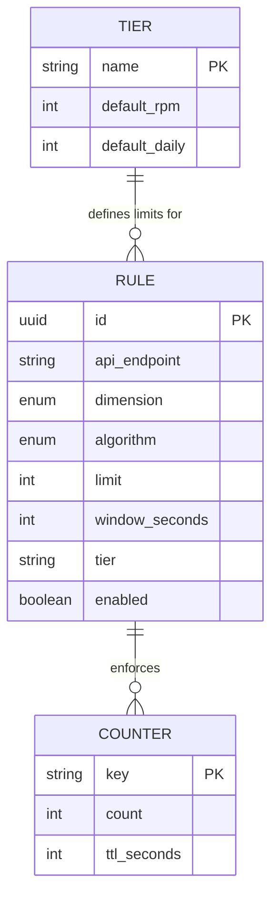
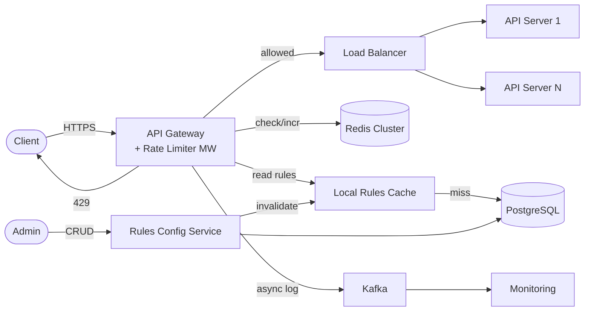
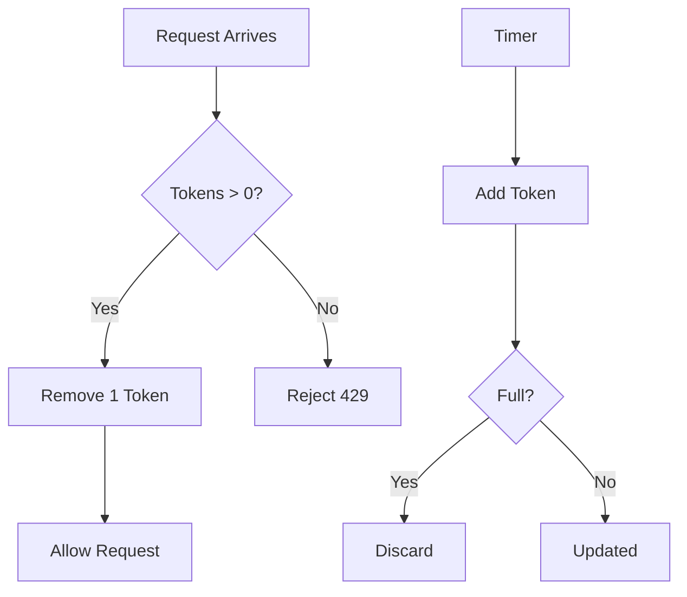
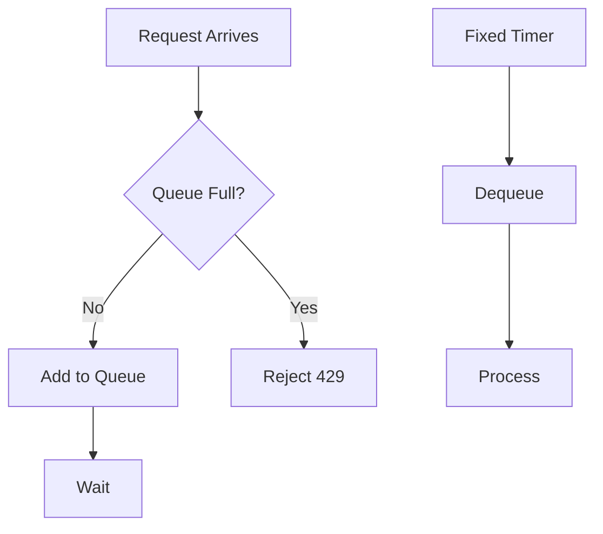
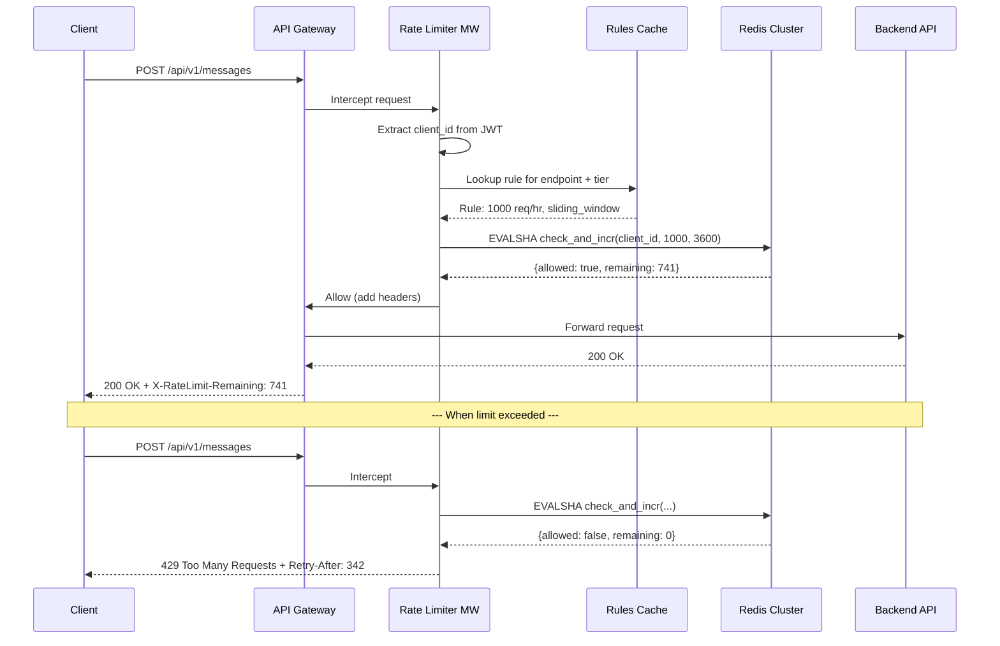
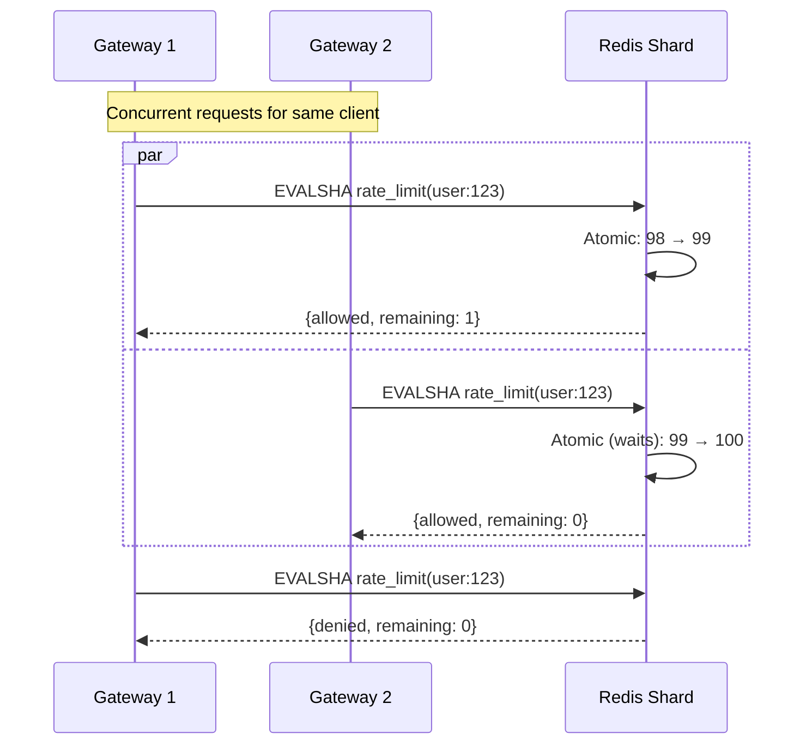
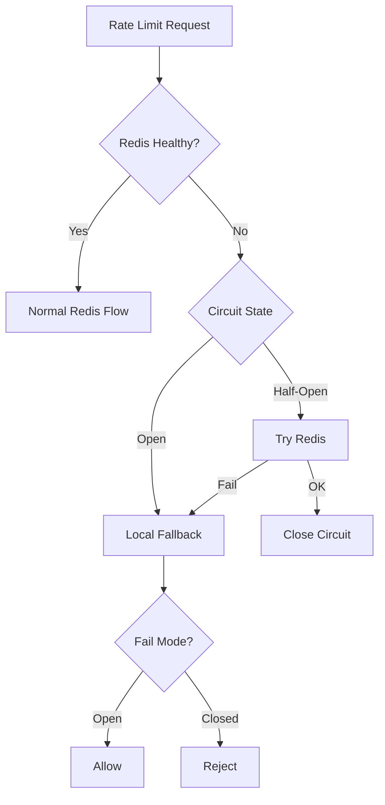

# Design a Rate Limiter

> A rate limiter controls the number of requests a client can send to a server within a given
> time window. It protects services from abuse, prevents resource starvation, manages costs,
> and ensures fair usage across all clients. Nearly every large-scale API (Stripe, GitHub,
> Twitter, Cloudflare) employs rate limiting as a first line of defense.

---

## 1. Problem Statement & Requirements

Design a distributed rate limiter that can throttle requests based on configurable rules
(per user, per IP, per API endpoint) and return appropriate HTTP 429 responses when limits
are exceeded.

### 1.1 Functional Requirements

- **FR-1:** Limit requests a client can make within a configurable time window.
- **FR-2:** Support multiple throttling dimensions -- by user ID, IP address, API key, or endpoint.
- **FR-3:** Return HTTP 429 (Too Many Requests) with rate limit headers when limit is exceeded.
- **FR-4:** Include standard headers in every response (`X-RateLimit-Limit`, `Remaining`, `Reset`).
- **FR-5:** Allow dynamic rule configuration without service restarts (hot reload).
- **FR-6:** Support different rate limits for different API tiers (free, pro, enterprise).

### 1.2 Non-Functional Requirements

- **Latency:** < 1 ms overhead per request (nearly invisible to clients).
- **Availability:** 99.99% uptime -- must not become a bottleneck.
- **Scalability:** Handle 1M+ RPM per API, across hundreds of APIs.
- **Consistency:** Slightly exceeding limits (small %) is acceptable; eventual consistency OK.
- **Fault tolerance:** Graceful degradation (fail-open by default, configurable to fail-closed).

### 1.3 Out of Scope

- DDoS protection at network layer (Layer 3/4) -- we focus on Layer 7.
- Request queuing / throttling (delaying instead of rejecting).
- Per-user billing or metering, authentication/authorization.

### 1.4 Assumptions & Estimations

```
APIs managed                = 200
Average RPM per API         = 1 M
Total RPM                   = 200 M
Total RPS                   = 200 M / 60 ~ 3.3 M RPS

Unique clients per API      = 100,000
Total unique clients        = 20 M

Redis throughput (single)   = ~300K ops/sec
Redis nodes needed          = 3.3 M / 300 K ~ 11 nodes

Memory per counter entry    = ~100 bytes (key + counter + TTL)
Active counters             = 20 M * 3 rules avg = 60 M entries
Memory for counters         = 60 M * 100 B = 6 GB
Redis Cluster               = 3 shards with replicas = 6 nodes
```

> **Key insight:** The rate limiter is on the hot path of every request.
> Even 1 ms at 3.3 M RPS = 3,300 seconds of cumulative delay per second.

---

## 2. API Design

### 2.1 Rate-Limited Response Headers

```
HTTP/1.1 200 OK
X-RateLimit-Limit: 1000              # max requests in window
X-RateLimit-Remaining: 742           # remaining in current window
X-RateLimit-Reset: 1704067200        # Unix timestamp when window resets
```

When throttled:

```
HTTP/1.1 429 Too Many Requests
X-RateLimit-Limit: 1000
X-RateLimit-Remaining: 0
X-RateLimit-Reset: 1704067200
Retry-After: 30

{ "error": { "code": "RATE_LIMIT_EXCEEDED", "message": "Try again in 30 seconds.", "retry_after": 30 } }
```

### 2.2 Rules Configuration API

```
POST /api/v1/rate-limit/rules
  Request: { "api_endpoint": "/api/v1/messages", "method": "POST",
             "dimension": "user_id", "algorithm": "sliding_window",
             "limit": 1000, "window_seconds": 3600, "tier": "free",
             "burst_limit": 50, "enabled": true }
  Response: 201 { "id": "rule_abc123", "created_at": "..." }

GET    /api/v1/rate-limit/rules?api_endpoint=/api/v1/messages
PUT    /api/v1/rate-limit/rules/{rule_id}
DELETE /api/v1/rate-limit/rules/{rule_id}

GET /api/v1/rate-limit/status?dimension=user_id&value=user_123&endpoint=/api/v1/messages
  Response: 200 { "limit": 1000, "remaining": 742, "current_count": 258 }
```

---

## 3. Data Model

### 3.1 Schema

**Rate Limit Rules (PostgreSQL):**

| Column           | Type         | Notes                              |
| ---------------- | ------------ | ---------------------------------- |
| `id`             | UUID / PK    | Auto-generated                     |
| `api_endpoint`   | VARCHAR(500) | e.g., `/api/v1/messages`           |
| `method`         | VARCHAR(10)  | GET, POST, PUT, DELETE, *          |
| `dimension`      | ENUM         | `user_id`, `ip`, `api_key`         |
| `algorithm`      | ENUM         | One of 5 algorithms                |
| `limit`          | INT          | Max requests in window             |
| `window_seconds` | INT          | Time window in seconds             |
| `tier`           | VARCHAR(50)  | `free`, `pro`, `enterprise`        |
| `burst_limit`    | INT          | Nullable, for token bucket         |
| `enabled`        | BOOLEAN      | Soft disable without deleting      |
| `updated_at`     | TIMESTAMP    | For cache invalidation             |

**Rate Limit Counters (Redis):**

| Key Pattern                                  | Value          | TTL              |
| -------------------------------------------- | -------------- | ---------------- |
| `rl:{dim}:{value}:{endpoint}:{window_start}` | String (count) | = window_seconds |
| `tb:{dim}:{value}:{endpoint}`                | Hash (tokens, last_refill) | None |

### 3.2 ER Diagram



### 3.3 Database Choice Justification

| Requirement          | Choice     | Reason                                             |
| -------------------- | ---------- | -------------------------------------------------- |
| Rule configuration   | PostgreSQL | Structured data, infrequent writes, ACID           |
| Request counters     | Redis      | In-memory, atomic INCR, sub-ms latency, TTL        |
| Rules cache (local)  | In-memory  | Avoid Redis round-trip for rule lookups             |
| Throttle audit log   | Kafka      | High-throughput append-only log for analytics       |

---

## 4. High-Level Architecture

### 4.1 Where to Place the Rate Limiter

| Placement       | Pros                                | Cons                                   |
| --------------- | ----------------------------------- | -------------------------------------- |
| **Client-side** | Reduces server load                 | Easily bypassed, not trustworthy       |
| **Server-side** | Full control, request context       | Coupled to application code            |
| **Middleware**   | Decoupled, reusable across services | Additional hop, shared state needed    |
| **API Gateway** | Centralized, managed infra          | Vendor lock-in, limited customization  |

**Chosen:** Middleware in the API Gateway -- single enforcement point, reusable, decoupled.

### 4.2 Architecture Diagram



### 4.3 Component Walkthrough

| Component           | Responsibility                                                    |
| ------------------- | ----------------------------------------------------------------- |
| **API Gateway**     | Entry point; hosts the rate limiter middleware                     |
| **Rate Limiter MW** | Extract client ID, lookup rules, check Redis, allow/deny          |
| **Redis Cluster**   | Stores counters with TTL; atomic increment operations             |
| **Local Rules Cache**| In-memory rule cache (refreshed every 30s or on invalidation)    |
| **PostgreSQL**      | Source of truth for rate limit rules and tier configuration        |
| **Kafka**           | Streams throttle events for monitoring                            |

### 4.4 Request Flow

1. Client sends request to API Gateway.
2. Rate limiter extracts client ID (user ID from JWT, IP from headers).
3. Lookup matching rule from local in-memory cache.
4. Call Redis to atomically check-and-increment the counter.
5. counter <= limit: forward to backend, add rate limit headers.
6. counter > limit: return 429 with `Retry-After`.

---

## 5. Deep Dive: Rate Limiting Algorithms

### 5.1 Token Bucket

The most widely used algorithm (Amazon, Stripe, most API gateways).

- A bucket holds tokens up to a max capacity (burst size).
- Tokens refill at a fixed rate. Each request consumes one token.
- If tokens available: allow and decrement. If empty: reject.
- Tokens accumulate when idle, allowing controlled bursts.



```python
class TokenBucket:
    def __init__(self, capacity: int, refill_rate: float):
        self.capacity = capacity
        self.tokens = capacity
        self.refill_rate = refill_rate
        self.last_refill = time.time()

    def allow_request(self) -> bool:
        now = time.time()
        elapsed = now - self.last_refill
        self.tokens = min(self.capacity, self.tokens + elapsed * self.refill_rate)
        self.last_refill = now
        if self.tokens >= 1:
            self.tokens -= 1
            return True
        return False
```

**Pros:** Simple, allows bursts, memory efficient (2 values per client).
**Cons:** Two parameters to tune, burst may not be desirable for all cases.

### 5.2 Leaky Bucket

Processes requests at a fixed constant rate -- like water leaking from a bucket.

- Requests enter a FIFO queue. Processed at a fixed outflow rate.
- If queue full on arrival: request is dropped.



**Pros:** Perfectly smooth output, predictable throughput.
**Cons:** No burst tolerance, adds queue latency, stale requests can starve.

### 5.3 Fixed Window Counter

Simplest approach: divide time into fixed windows, count per window.

```python
def fixed_window_check(client_id, limit, window_sec):
    window_key = int(time.time()) // window_sec
    key = f"rl:{client_id}:{window_key}"
    current = redis.incr(key)
    if current == 1:
        redis.expire(key, window_sec)
    return current <= limit
```

**The Boundary Burst Problem:** With 100 req/min limit, a client sends 100 requests at
12:00:58 and 100 at 12:01:01. Both windows see 100 (within limit), but 200 requests
arrived in 3 seconds -- **2x the intended rate**.

**Pros:** Dead simple, memory efficient, works with Redis INCR.
**Cons:** Boundary burst allows up to 2x rate at window edges.

### 5.4 Sliding Window Log

Tracks exact timestamps using a Redis sorted set.

```python
def sliding_window_log_check(client_id, limit, window_sec):
    now = time.time()
    key = f"rl:swl:{client_id}"
    pipe = redis.pipeline()
    pipe.zremrangebyscore(key, 0, now - window_sec)  # remove expired
    pipe.zadd(key, {str(now): now})                   # add current
    pipe.zcard(key)                                    # count
    pipe.expire(key, window_sec)
    results = pipe.execute()
    if results[2] > limit:
        redis.zrem(key, str(now))  # rollback
        return False
    return True
```

**Pros:** Perfectly accurate, no boundary burst.
**Cons:** Memory intensive (1 entry per request), impractical at 20M clients.

### 5.5 Sliding Window Counter (Hybrid)

Best of both worlds: fixed window simplicity + sliding window accuracy.

Maintains counters for current and previous windows. Uses weighted formula:

```
sliding_count = prev_count * overlap% + current_count
overlap% = (window_size - elapsed_in_current) / window_size
```

**Example:** Window=60s, limit=100. Previous=84 reqs, current=36 reqs, 15s into window.
`overlap = (60-15)/60 = 0.75`. Estimated = 84*0.75 + 36 = **99** (allowed).

```python
def sliding_window_counter_check(client_id, limit, window_sec):
    now = time.time()
    curr_window = int(now) // window_sec * window_sec
    prev_window = curr_window - window_sec
    elapsed = now - curr_window

    prev_count = int(redis.get(f"rl:{client_id}:{prev_window}") or 0)
    curr_count = int(redis.get(f"rl:{client_id}:{curr_window}") or 0)
    overlap = (window_sec - elapsed) / window_sec
    estimated = prev_count * overlap + curr_count

    if estimated >= limit:
        return False
    redis.incr(f"rl:{client_id}:{curr_window}")
    redis.expire(f"rl:{client_id}:{curr_window}", window_sec * 2)
    return True
```

**Pros:** Memory efficient (2 counters), ~99.7% accurate (per Cloudflare).
**Cons:** Approximate (assumes even distribution in previous window).

### 5.6 Algorithm Comparison

| Algorithm              | Accuracy     | Memory    | Burst      | Complexity | Best For                       |
| ---------------------- | ------------ | --------- | ---------- | ---------- | ------------------------------ |
| **Token Bucket**       | Good         | Very Low  | Allows     | Low        | Most APIs, AWS, Stripe         |
| **Leaky Bucket**       | Good         | Low       | None       | Low        | Payments, smooth output        |
| **Fixed Window**       | Poor (edges) | Very Low  | 2x risk    | Very Low   | Simple internal services       |
| **Sliding Window Log** | Perfect      | Very High | None       | Medium     | Low-volume, precision-critical |
| **Sliding Window Ctr** | Very Good    | Very Low  | Minimal    | Medium     | High-volume production APIs    |

> **Pick:** Token Bucket for most APIs (burst-friendly). Sliding Window Counter for strict control.

### 5.7 Request Flow Through Rate Limiter



---

## 6. Distributed Rate Limiting

### 6.1 Why Distributed is Hard

```
Gateway A sees: counter = 98  (allows 2 more)
Gateway B sees: counter = 98  (allows 2 more)
                               Result: 102 allowed (limit was 100)
```

Without atomic operations, race conditions cause over-counting.

### 6.2 Lua Script for Atomic Check-and-Increment

Redis executes Lua scripts atomically -- no interleaving possible.

**Sliding Window Counter Lua:**

```lua
-- KEYS[1]=current_key  KEYS[2]=prev_key
-- ARGV[1]=limit  ARGV[2]=window_start  ARGV[3]=window_size  ARGV[4]=now

local prev = tonumber(redis.call('GET', KEYS[2]) or '0')
local curr = tonumber(redis.call('GET', KEYS[1]) or '0')
local limit = tonumber(ARGV[1])
local elapsed = tonumber(ARGV[4]) - tonumber(ARGV[2])
local overlap = (tonumber(ARGV[3]) - elapsed) / tonumber(ARGV[3])
local estimated = prev * overlap + curr

if estimated >= limit then
    return {0, 0, tonumber(ARGV[2]) + tonumber(ARGV[3])}
end

local new_count = redis.call('INCR', KEYS[1])
redis.call('EXPIRE', KEYS[1], tonumber(ARGV[3]) * 2)
local remaining = math.max(0, limit - (prev * overlap + new_count))
return {1, math.floor(remaining), tonumber(ARGV[2]) + tonumber(ARGV[3])}
```

**Token Bucket Lua:**

```lua
-- KEYS[1]=bucket_key  ARGV[1]=capacity  ARGV[2]=refill_rate  ARGV[3]=now
local capacity = tonumber(ARGV[1])
local rate = tonumber(ARGV[2])
local now = tonumber(ARGV[3])
local b = redis.call('HMGET', KEYS[1], 'tokens', 'last_refill')
local tokens = tonumber(b[1]) or capacity
local last = tonumber(b[2]) or now

tokens = math.min(capacity, tokens + (now - last) * rate)
if tokens < 1 then
    return {0, math.floor(tokens), math.ceil((1 - tokens) / rate)}
end
tokens = tokens - 1
redis.call('HMSET', KEYS[1], 'tokens', tokens, 'last_refill', now)
return {1, math.floor(tokens), 0}
```

### 6.3 Race Conditions and Solutions

| Race Condition              | Cause                        | Solution                             |
| --------------------------- | ---------------------------- | ------------------------------------ |
| Concurrent read-then-write  | Non-atomic check + increment | Lua scripts (atomic in Redis)        |
| Counter drift across nodes  | Network partitions           | Accept minor over-count              |
| Clock skew between gateways | Different server clocks      | Use Redis `TIME` command             |
| Stale rules cache           | Rule updated, cache stale    | Pub/Sub invalidation + 30s TTL       |

### 6.4 Distributed Flow



### 6.5 Redis Cluster Topology

```
Redis Cluster (6 nodes):
├── Shard 1: Master (slots 0-5460)      + Replica
├── Shard 2: Master (slots 5461-10922)  + Replica
└── Shard 3: Master (slots 10923-16383) + Replica

Each shard: ~1.1M RPS. Replicas for failover.
```

### 6.6 Alternative: Local + Global Hybrid

Each gateway maintains a local counter, syncing to Redis every 100ms.
Effective limit per gateway = `global_limit / num_gateways`.

**Trade-off:** Less accurate (can overshoot), but eliminates Redis round-trip from hot path.
Used by systems like Envoy proxy.

---

## 7. Reliability & Fault Tolerance

### 7.1 Fail-Open vs. Fail-Closed

| Strategy       | Behavior                              | When to Use                           |
| -------------- | ------------------------------------- | ------------------------------------- |
| **Fail-open**  | Allow all requests (no rate limiting) | Default -- availability > enforcement |
| **Fail-closed**| Reject all (503 Unavailable)          | Security-critical: login, payments    |

```python
def rate_limit_check(request):
    try:
        return redis.evalsha(SCRIPT_SHA, keys, args)
    except RedisConnectionError:
        metrics.increment("rate_limiter.redis_failure")
        if get_rule(request).fail_mode == "closed":
            return RateLimitResult(allowed=False)
        return RateLimitResult(allowed=True, reason="fail_open")
```

### 7.2 Redis Replication and Failover

- **Redis Sentinel** monitors masters, auto-promotes replicas on failure.
- **Failover time:** 10-30 seconds.
- **Counter loss:** slight staleness acceptable (rate limiting is best-effort).

### 7.3 Local Cache as Fallback

```python
class FallbackRateLimiter:
    def __init__(self, num_gateways):
        self.counters = {}
        self.num_gateways = num_gateways

    def check(self, key, global_limit, window_sec):
        local_limit = global_limit // self.num_gateways
        window = int(time.time()) // window_sec
        count = self.counters.get(f"{key}:{window}", 0)
        if count >= local_limit:
            return False
        self.counters[f"{key}:{window}"] = count + 1
        return True
```

### 7.4 Circuit Breaker Pattern



---

## 8. Trade-offs

### 8.1 Key Design Decisions

| Decision                       | Chosen                  | Alternative             | Reason                                    |
| ------------------------------ | ----------------------- | ----------------------- | ----------------------------------------- |
| Counter storage                | Centralized (Redis)     | Local per-node          | Accurate global limits                    |
| Default failure mode           | Fail-open               | Fail-closed             | Availability > strict enforcement         |
| Primary algorithm              | Token Bucket            | Sliding Window Counter  | Industry standard, supports bursts        |
| Rule storage                   | PostgreSQL + cache      | Redis only              | Rules are relational, cache avoids DB hop |
| Atomic operations              | Lua scripts             | MULTI/EXEC              | Lua is truly atomic, no race window       |
| Placement                      | API Gateway middleware  | App-level library       | Single enforcement point, language-agnostic|
| Clock source                   | Redis server TIME       | Gateway local time      | Avoids clock skew                         |

### 8.2 Accuracy vs. Performance Spectrum

```
Accurate ◄──────────────────────────────────────────► Fast
  Sliding Window Log (exact, O(N) memory)
        Sliding Window Counter (99.7%, O(1))
                Token Bucket (good, sub-ms)
                        Fixed Window (poor edges, fastest)
```

### 8.3 Centralized vs. Distributed

| Aspect          | Centralized (Redis)       | Distributed (Local)         |
| --------------- | ------------------------- | --------------------------- |
| Accuracy        | High (single source)      | Low (partial view per node) |
| Latency         | ~0.5-1 ms (network hop)   | ~0.01 ms (in-process)       |
| Failure impact  | All nodes affected        | Independent per node        |
| Consistency     | Strong (atomic ops)       | Eventual (sync lag)         |

---

## 9. Interview Tips

### 9.1 45-Minute Pacing

```
[0-5 min]   Requirements: what to limit? scale? strict or approximate?
[5-10 min]  API: rate limit headers, 429 response, rules config API
[10-25 min] Core: single-server → multi-server → Redis → algorithm + Lua script
[25-35 min] Distributed: race conditions, Redis Cluster, fail-open/closed
[35-45 min] Trade-offs: algorithm comparison, accuracy vs. performance
```

### 9.2 What Interviewers Look For

1. **Algorithm knowledge** -- explain at least 3 with trade-offs
2. **Distributed awareness** -- race conditions, atomic operations
3. **Failure handling** -- what happens when Redis goes down?
4. **Quantitative reasoning** -- estimate RPS, derive cluster size
5. **Practical knowledge** -- rate limit headers, 429, Retry-After

### 9.3 Common Follow-up Questions

- **"Client changes IP?"** -- Rate limit by user ID (JWT/API key), not IP.
- **"10x traffic spike?"** -- Rate limiter handles it. Pre-provision Redis capacity.
- **"Multiple data centers?"** -- Global Redis (accurate, slower) or per-DC limits (fast, approximate).
- **"Gaming via rotating API keys?"** -- Layer limits: per-key AND per-IP AND per-org.
- **"Token bucket vs. sliding window?"** -- Token bucket for bursty APIs (Stripe). Sliding window
  counter for strict control (login endpoints).

### 9.4 Common Pitfalls

- Jumping to Redis without explaining single-server solution first.
- Not mentioning boundary burst problem with fixed windows.
- Forgetting failure modes (Redis down = ?).
- Over-engineering before getting basics right.
- Confusing rate limiting (L7) with DDoS protection (L3/4).

### 9.5 Key Numbers

```
Redis single-node:  ~300K ops/sec
Lua script:         ~0.1 ms per exec
Same-AZ RTT:        ~0.5 ms
Cross-AZ RTT:       ~1-2 ms
Token bucket mem:   ~32 bytes/key
Fixed window mem:   ~16 bytes/key
```

---

> **Checklist:**
> - [x] Requirements scoped: per-client limiting, configurable rules, 429 responses
> - [x] Estimations: 3.3M RPS, 6 GB counters, 6-node Redis Cluster
> - [x] Architecture: rate limiter as API Gateway middleware
> - [x] 5 algorithms with trade-offs and comparison table
> - [x] Lua scripts for atomic Redis operations
> - [x] Distributed race conditions addressed
> - [x] Failure handling: fail-open/closed, local fallback, circuit breaker
> - [x] Trade-offs with justification
