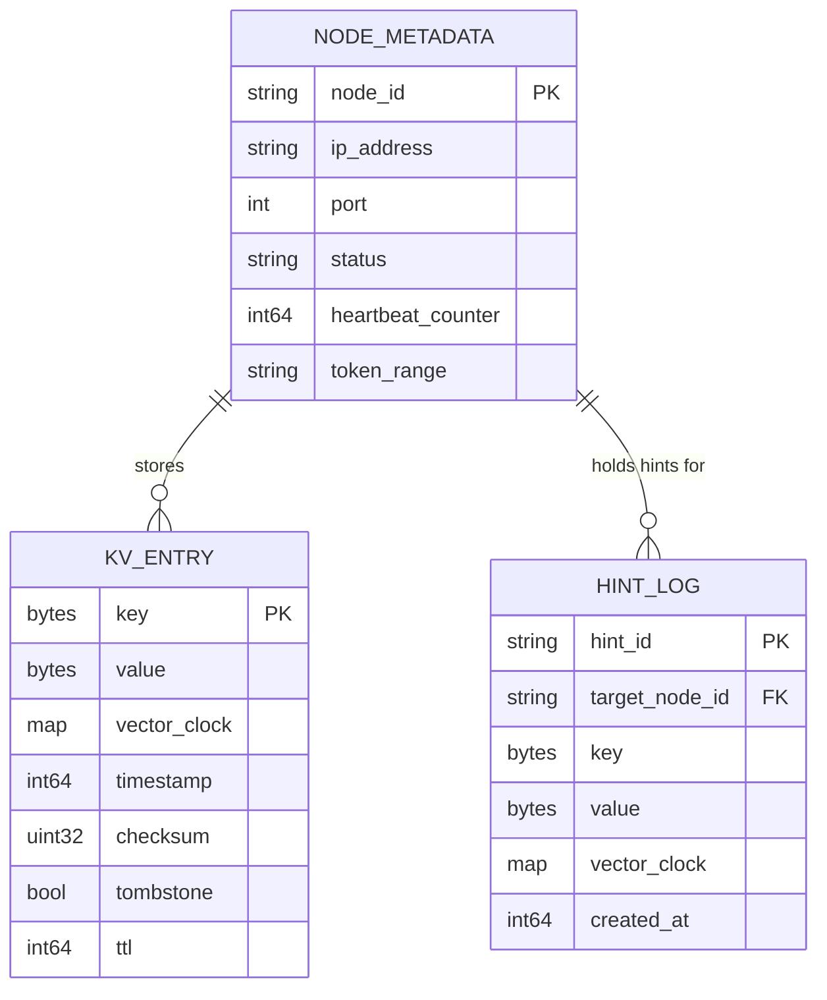
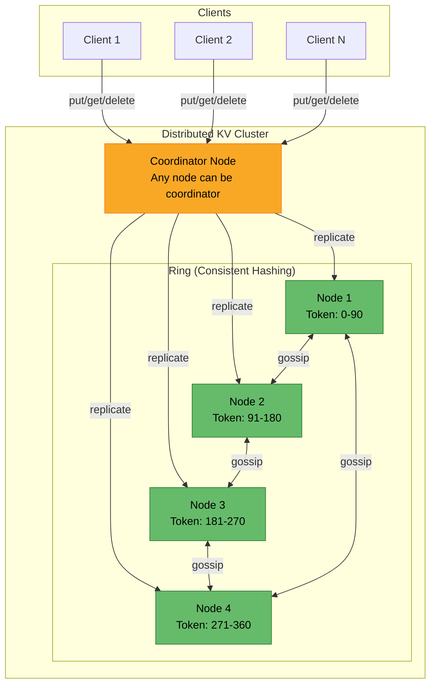
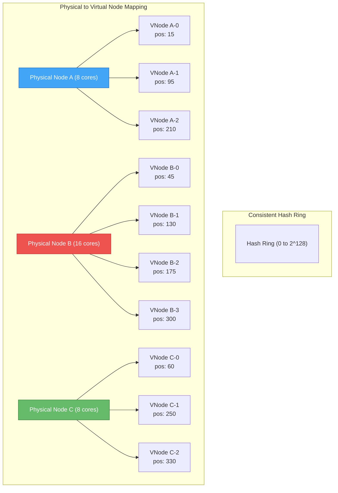
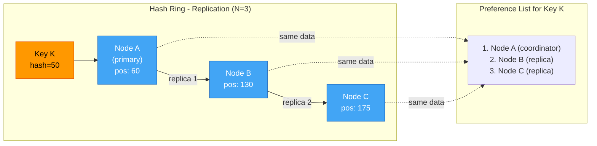
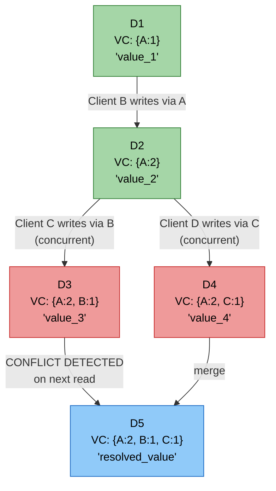
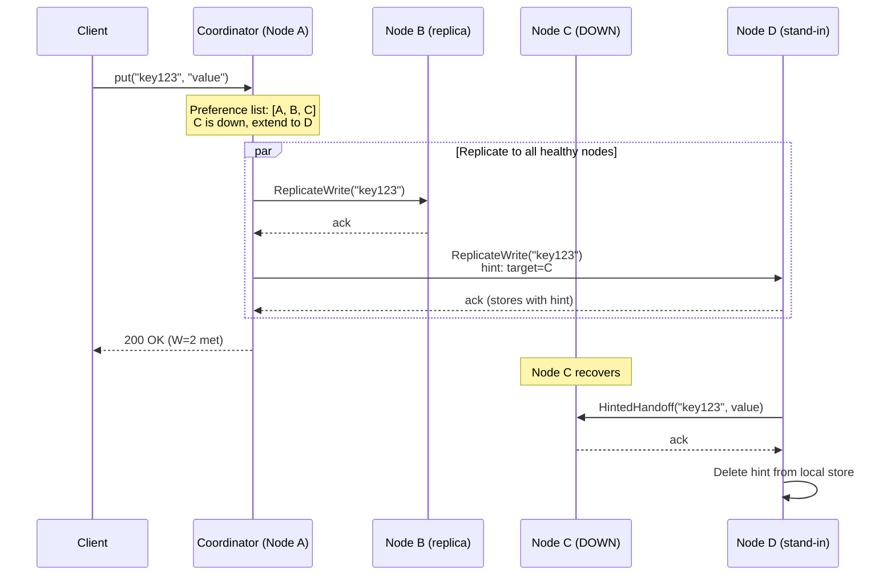
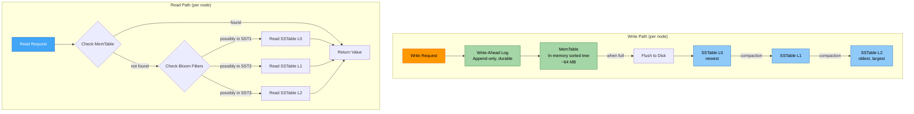
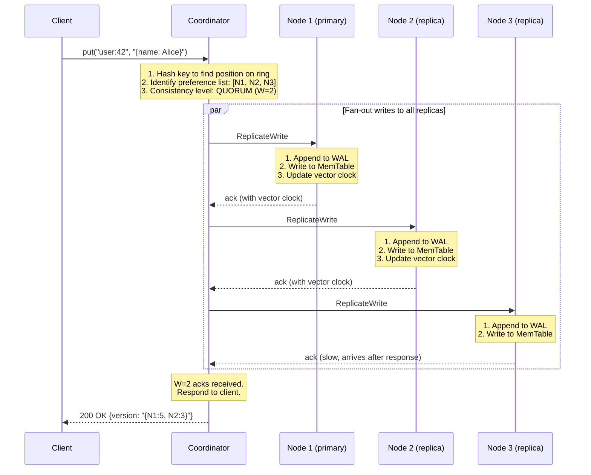
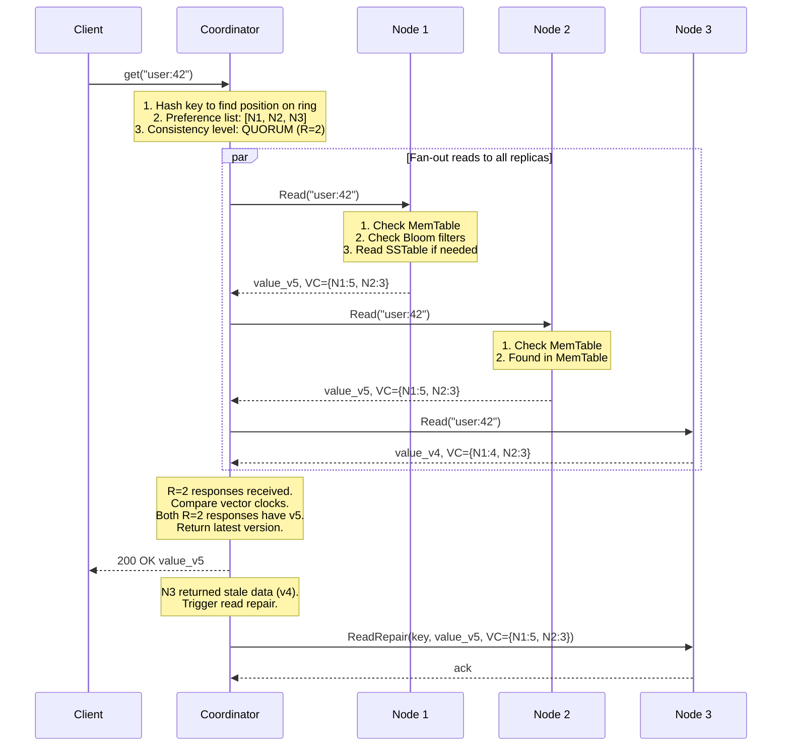

# Design a Distributed Key-Value Store

> A distributed key-value store is a non-relational database where each unique key is
> associated with a value. Data is distributed across multiple nodes for high availability,
> scalability, and fault tolerance. Real-world examples include Amazon DynamoDB, Apache
> Cassandra, and Riak. This design prioritizes an AP (Available + Partition-tolerant)
> system with tunable consistency, following the Dynamo paper architecture.

---

## 1. Problem Statement & Requirements

Design a distributed key-value store that can store and retrieve data across a cluster
of machines, providing high availability, horizontal scalability, and tunable consistency.
The system must handle node failures gracefully and support automatic data partitioning
and replication.

### 1.1 Functional Requirements

- **FR-1:** `put(key, value)` -- Store a key-value pair (insert or update).
- **FR-2:** `get(key)` -- Retrieve the value associated with a given key.
- **FR-3:** `delete(key)` -- Remove a key-value pair from the store.
- **FR-4:** Configurable consistency levels per request (ONE, QUORUM, ALL).
- **FR-5:** Automatic data partitioning across nodes.
- **FR-6:** Automatic data replication for durability.

> **Clarifying questions to ask the interviewer:**
> - What is the expected size of key-value pairs? (Assume < 10 KB)
> - Do we need support for range queries? (No, only point lookups)
> - Do we need TTL (time-to-live) support? (Nice to have, not core)

### 1.2 Non-Functional Requirements

- **Availability:** 99.99% uptime (~52 min downtime/year). Favor availability over consistency (AP system).
- **Latency:** p99 read < 10 ms, p99 write < 20 ms (single-digit ms at p50).
- **Throughput:** Support 500K+ reads/sec and 200K+ writes/sec across the cluster.
- **Scalability:** Horizontal -- add nodes linearly to increase capacity and throughput.
- **Partition Tolerance:** Must continue operating during network partitions.
- **Tunable Consistency:** Allow clients to choose between strong and eventual consistency per operation.
- **Durability:** Once a write is acknowledged (at the configured consistency level), the data must not be lost.

### 1.3 Out of Scope

- Multi-key transactions or ACID guarantees across keys.
- Range queries or secondary indexes.
- SQL-like query language.
- Authentication and authorization.
- Multi-tenancy and resource isolation.
- Cross-region replication (we design for a single region with multiple data centers).

### 1.4 Assumptions & Estimations (Back-of-Envelope Math)

```
Total key-value pairs       = 10 billion
Average key size            = 100 bytes
Average value size          = 10 KB
Storage per pair            = ~10 KB (key is negligible)

Total storage               = 10B * 10 KB = 100 TB
Replication factor (N)      = 3
Total storage with replicas = 100 TB * 3 = 300 TB

Reads per second            = 500,000 RPS
Writes per second           = 200,000 WPS
Read:Write ratio            = 2.5:1

Read bandwidth              = 500K * 10 KB = 5 GB/s
Write bandwidth             = 200K * 10 KB = 2 GB/s

Nodes (8 TB usable each)    = 300 TB / 8 TB ~ 38 nodes (round to 40)
Per-node read throughput    = 500K / 40 = 12,500 RPS per node
Per-node write throughput   = 200K / 40 = 5,000 WPS per node
```

> A single modern SSD-backed server can handle 10K-50K IOPS, so 12.5K reads + 5K writes
> per node is well within capacity. 40 nodes gives us headroom for growth.

---

## 2. API Design

The system exposes a simple interface. Clients interact through a coordinator node or
a client-side library that is cluster-aware.

```
PUT /api/v1/kv/{key}
  Headers:
    Content-Type: application/octet-stream
    X-Consistency-Level: ONE | QUORUM | ALL    (default: QUORUM)
  Request Body: <raw value bytes>
  Response:
    200 OK  { "version": "v3", "timestamp": 1700000000 }
    409 Conflict  { "error": "version conflict", "conflicting_versions": [...] }

GET /api/v1/kv/{key}
  Headers:
    X-Consistency-Level: ONE | QUORUM | ALL    (default: QUORUM)
  Response:
    200 OK
      Headers: X-Version: v3, X-Timestamp: 1700000000
      Body: <raw value bytes>
    404 Not Found  { "error": "key not found" }

DELETE /api/v1/kv/{key}
  Headers:
    X-Consistency-Level: ONE | QUORUM | ALL    (default: QUORUM)
  Response:
    204 No Content
    404 Not Found  { "error": "key not found" }
```

**Internal RPCs (node-to-node):**

```
// Replication RPCs (gRPC for low latency)
rpc ReplicateWrite(key, value, vector_clock, timestamp) -> ack
rpc ReplicateDelete(key, vector_clock, timestamp) -> ack
rpc ReadRepair(key) -> (value, vector_clock)
rpc SyncMerkleTree(range, merkle_root) -> diffs[]
rpc Gossip(node_state_map) -> node_state_map
rpc HintedHandoff(key, value, target_node_id) -> ack
```

> **ONE:** 1 ack, fastest. **QUORUM:** majority acks, balanced. **ALL:** all acks, strongest.

---

## 3. Data Model

### 3.1 Stored Data Structure

Each key-value pair is stored with metadata for versioning, conflict resolution,
and replication.

| Field          | Type         | Description                                    |
| -------------- | ------------ | ---------------------------------------------- |
| `key`          | byte[]       | The lookup key (max 256 bytes)                 |
| `value`        | byte[]       | The opaque value (max 1 MB)                    |
| `vector_clock` | Map<NodeID, Counter> | Version vector for conflict detection  |
| `timestamp`    | int64        | Wall-clock time of last write (epoch ms)       |
| `checksum`     | uint32       | CRC32 for data integrity verification          |
| `tombstone`    | boolean      | Marks deleted keys (for eventual consistency)  |
| `ttl`          | int64        | Optional time-to-live in seconds               |
| `hint_target`  | NodeID       | For hinted handoff -- the intended recipient   |

### 3.2 Data Layout Diagram



### 3.3 Storage Choice Justification

| Requirement               | Choice              | Reason                                      |
| ------------------------- | ------------------- | ------------------------------------------- |
| Per-node storage engine   | LSM Tree + SSTables | Write-optimized, sequential IO, compaction   |
| In-memory index           | Hash Map            | O(1) key lookups, fits in RAM for key index  |
| Cluster membership state  | In-memory (gossip)  | Lightweight, eventually consistent, no SPOF  |
| Hinted handoff queue      | Local append-only log | Durable, sequential writes, easy replay   |

---

## 4. High-Level Architecture

### 4.1 Architecture Diagram



### 4.2 Component Walkthrough

| Component            | Responsibility                                                             |
| -------------------- | -------------------------------------------------------------------------- |
| Client               | Sends get/put/delete requests; may be cluster-aware (knows the hash ring)  |
| Coordinator Node     | Receives client request, determines responsible nodes, fans out RPCs       |
| Storage Node         | Stores key-value data on local disk via LSM tree engine                    |
| Gossip Protocol      | Propagates cluster membership and failure detection across all nodes       |
| Consistent Hash Ring | Maps keys to nodes; ensures minimal data movement when nodes join/leave    |
| Replication Manager  | Ensures each key is replicated to N nodes on the preference list           |
| Conflict Resolver    | Uses vector clocks to detect and resolve conflicting versions              |
| Anti-Entropy Engine  | Runs Merkle tree comparisons to detect and repair data inconsistencies     |

> **Key principle:** Every node is equal. Any node can be a coordinator for any request.
> No leader = no single point of failure.

---

## 5. Deep Dive: Core Components

### 5.1 Data Partitioning -- Consistent Hashing with Virtual Nodes

**Problem:** How do we distribute data across N nodes so that adding or removing a node
moves the minimum amount of data?

**Solution:** Consistent hashing maps both keys and nodes onto a circular hash ring
(0 to 2^128 - 1). A key is assigned to the first node encountered walking clockwise
from the key's hash position.

**Virtual nodes:** Each physical node owns multiple positions on the ring. This solves
uneven distribution (data skew with few nodes) and supports heterogeneous hardware
(powerful nodes own more virtual nodes).



**How key assignment works:**

```
hash("user:1001") = 72  --> between VNode C-0 (60) and A-1 (95) --> Node A
hash("user:2050") = 140 --> between VNode B-1 (130) and B-2 (175) --> Node B

When Node D joins (vnodes at 80, 160, 290):
  "user:1001" (72) now goes to D-0 (80) instead of A-1 (95)
  Only keys in range 60-80 move from A to D. All others stay.
```

**Virtual node count:** 100-200 per physical node. More = better distribution but more metadata.

### 5.2 Data Replication

**Replication factor N = 3** means every key-value pair is stored on 3 different physical
nodes for durability and availability.

**Preference list:** After locating the key's primary node on the hash ring, we walk
clockwise and select the next N-1 *distinct physical nodes* (skipping virtual nodes
that belong to the same physical node).



**Rack/AZ awareness:** The preference list spans multiple racks/AZs by skipping nodes in
the same failure domain. Replication is async by default -- the coordinator sends writes
to all N replicas in parallel but only waits for W acks before responding.

### 5.3 Consistency -- Quorum Consensus

The system uses a quorum-based protocol where:
- **N** = total number of replicas (typically 3)
- **W** = number of replicas that must acknowledge a write
- **R** = number of replicas that must respond to a read

**The quorum condition:** If **W + R > N**, at least one node in the read set has the
latest write, guaranteeing the client sees the most recent value.

| Configuration  | W | R | N | Behavior                                    |
| -------------- | - | - | - | ------------------------------------------- |
| Strong read    | 2 | 2 | 3 | W+R=4 > 3. Guarantees latest value on read  |
| Fast write     | 1 | 3 | 3 | W+R=4 > 3. Fast writes, slower reads         |
| Fast read      | 3 | 1 | 3 | W+R=4 > 3. Slow writes, fast reads           |
| Eventual       | 1 | 1 | 3 | W+R=2 < 3. Fastest, but may read stale data  |
| One-copy-serial| 3 | 3 | 3 | Strongest. Slowest. All replicas must agree   |

**Consistency level mapping:**

```
Client asks for QUORUM:
  N=3 --> W=2, R=2  (majority)
  Coordinator sends write to all 3 replicas, responds after 2 ack

Client asks for ONE:
  W=1, R=1
  Coordinator responds after 1 ack. Fastest but may read stale data.

Client asks for ALL:
  W=3, R=3
  Coordinator waits for all replicas. Slowest but linearizable.
```

> **CAP trade-off:** W=1,R=1 = AP (available, may be stale). W=N,R=N = CP (consistent,
> unavailable if any node is down). QUORUM = balanced (tolerates 1 failure, consistent).

### 5.4 Conflict Resolution -- Vector Clocks

When multiple coordinators accept writes to the same key concurrently (during a network
partition, for example), conflicting versions are created. We need a mechanism to detect
and resolve these conflicts.

**Vector clocks** are a versioning scheme where each node maintains a counter. The vector
clock for a value is a list of `(node, counter)` pairs.

**How vector clocks work:**

```
Step 1: Client A writes key "x" through Node A
        VC = {A:1}

Step 2: Client B reads "x" (gets VC={A:1}), modifies it, writes through Node A
        VC = {A:2}

Step 3: Client C reads "x" (gets VC={A:2}), modifies it, writes through Node B
        VC = {A:2, B:1}

Step 4: Client D reads "x" (gets VC={A:2}), modifies it, writes through Node C
        VC = {A:2, C:1}

Now we have two concurrent versions:
  Version 1: VC = {A:2, B:1}  -- written by Client C
  Version 2: VC = {A:2, C:1}  -- written by Client D

Neither dominates the other (B:1 vs C:1 are incomparable).
This is a CONFLICT -- must be resolved.
```



**Conflict resolution strategies:**

| Strategy              | How it works                                | When to use                       |
| --------------------- | ------------------------------------------- | --------------------------------- |
| Last-Write-Wins (LWW) | Pick the version with the latest timestamp  | When conflicts are rare, simple   |
| Client-side merge     | Return all versions, let client merge       | Shopping carts (union merge)      |
| Application callback  | Application registers a merge function      | Domain-specific logic needed      |

> DynamoDB and Cassandra default to LWW. The original Dynamo paper used client-side
> merge for shopping carts. In an interview, mention both approaches.

**Vector clock truncation:** Clocks can grow unbounded. Remove entries older than a
threshold (e.g., 10 days). Small risk of false conflicts but keeps metadata bounded.

### 5.5 Handling Failures

#### 5.5.1 Failure Detection -- Gossip Protocol

Each node maintains a membership list with heartbeat counters. Every second, each node
picks a random peer and exchanges its membership list. If a node's heartbeat has not
incremented for a configured period (e.g., 30 seconds), it is marked as "suspected down."

```
Node A's membership table:
| Node | Heartbeat | Last Updated | Status      |
|------|-----------|-------------|-------------|
| A    | 1042      | now         | ALIVE       |
| B    | 890       | 2s ago      | ALIVE       |
| C    | 650       | 35s ago     | SUSPECTED   |
| D    | 920       | 1s ago      | ALIVE       |
```

**Gossip properties:** Decentralized (no SPOF), eventually consistent, scalable
(O(log N) rounds to propagate to all nodes), robust against message loss.

**Failure detection timeline:** Node C stops heartbeats --> neighbors notice via gossip
within 10-30s --> C marked SUSPECTED, traffic rerouted --> after 60s, C marked DOWN -->
if C returns, fresh heartbeats restore it to ALIVE.

#### 5.5.2 Temporary Failures -- Sloppy Quorum & Hinted Handoff

**Problem:** If one of the N replicas for a key is temporarily down, a strict quorum
would require waiting for it, reducing availability.

**Sloppy quorum:** The coordinator picks the first W *healthy* nodes from the preference
list (extending beyond N if needed), ensuring writes succeed even when replicas are down.

**Hinted handoff:** A substitute node stores the data with a "hint" for the intended
recipient. When that node recovers, the substitute forwards the data.



#### 5.5.3 Permanent Failures -- Anti-Entropy with Merkle Trees

**Problem:** If hinted handoff alone cannot bring replicas in sync (e.g., hints were lost,
or the outage lasted too long), replicas may diverge permanently.

**Solution:** Each node builds a **Merkle tree** (hash tree) over the key ranges it owns.
Nodes periodically compare Merkle tree roots to detect inconsistencies and synchronize
only the differing keys.

**How Merkle trees work:**

```
Key range: [0, 100]

Leaf nodes:     H(k1)   H(k2)   H(k3)   H(k4)   H(k5)   H(k6)   H(k7)   H(k8)
                  \      /          \      /          \      /          \      /
Internal:        H(1,2)            H(3,4)            H(5,6)            H(7,8)
                    \                /                    \                /
                     H(1..4)                              H(5..8)
                          \                              /
                           \                            /
                            Root = H(1..8)
```

**Comparison process:** Node A sends its Merkle root to Node B. If roots match, data is
identical. If they differ, recurse into differing children. At the leaf level, exchange
only the specific keys that differ. If two replicas hold 1M keys but only 10 differ,
Merkle trees find those 10 with O(log N) comparisons instead of scanning all 1M.

Merkle trees are rebuilt periodically (every hour) or incrementally updated on each write.

#### 5.5.4 Data Center Outage Handling

Each key is replicated across DCs (e.g., N=3 per DC). Writes are acknowledged on local
DC quorum; cross-DC replication is async. On DC failure, traffic routes to the surviving
DC. On recovery, Merkle tree anti-entropy brings data back in sync.

### 5.6 Storage Engine -- LSM Trees

Each node uses a **Log-Structured Merge-tree (LSM)** as its storage engine, optimized
for write-heavy workloads with good read performance.

**Components:**
1. **Write-Ahead Log (WAL):** Every write is first appended to a durable log for crash recovery.
2. **MemTable:** An in-memory sorted data structure (red-black tree or skip list) that
   buffers recent writes.
3. **SSTables (Sorted String Tables):** Immutable, sorted, on-disk files created when the
   MemTable is flushed.
4. **Bloom Filters:** Probabilistic data structures that quickly tell if a key *might* exist
   in an SSTable, avoiding unnecessary disk reads.



**Compaction strategies:**

| Strategy         | How it works                                      | Trade-off                        |
| ---------------- | ------------------------------------------------- | -------------------------------- |
| Size-tiered      | Merge SSTables of similar size                    | Better write throughput          |
| Leveled          | Each level is 10x larger, non-overlapping ranges  | Better read performance, more IO |

**Why LSM over B-Tree?** LSM writes are sequential (append WAL, flush MemTable). B-Trees
require random IO for in-place updates. For write-heavy KV stores, LSM is the standard
choice (Cassandra, RocksDB, LevelDB). B-Trees win on point reads but LSM compensates
with Bloom filters (~1% false positive rate, ~12 MB for 10M keys) that eliminate 99% of
unnecessary disk reads.

---

## 6. Write & Read Paths (End-to-End)

### 6.1 Write Path



**Write latency breakdown:**
```
Client -> Coordinator:     ~1 ms  (within data center)
Coordinator -> Replicas:   ~1 ms  (parallel, take slowest of W)
WAL append:                ~0.1 ms (sequential SSD write)
MemTable insert:           ~0.01 ms (in-memory)
Total p50:                 ~2-3 ms
Total p99:                 ~10-15 ms (tail latency from GC, slow disk)
```

### 6.2 Read Path



**Read repair:** When stale data is detected during a read, the coordinator sends the
latest version to the stale node in the background (zero extra latency for the client).

**Read latency breakdown:**
```
Client -> Coordinator:     ~1 ms
Coordinator -> Replicas:   ~1 ms  (parallel, take R-th fastest)
MemTable lookup:           ~0.01 ms (best case)
Bloom filter check:        ~0.01 ms
SSTable read (cache hit):  ~0.1 ms
SSTable read (disk):       ~1-5 ms (SSD random read)
Total p50:                 ~2-3 ms  (MemTable or block cache hit)
Total p99:                 ~8-10 ms (SSTable disk read)
```

---

## 7. Scaling -- Adding and Removing Nodes

### 7.1 Adding a Node

1. New node is assigned virtual node positions on the ring.
2. Affected nodes stream only the reassigned key ranges to the new node.
3. During migration, old nodes continue serving requests; ownership transfers atomically
   once the new node is synced.

```
Before (3 nodes, 4 ranges each):
  Node A: [0, 30], [90, 120], [180, 210], [270, 300]
  Node B: [30, 60], [120, 150], [210, 240], [300, 330]
  Node C: [60, 90], [150, 180], [240, 270], [330, 360]

New Node D joins (assigned positions: 45, 135, 225, 315):
  Node B gives range [30, 45] to D    (~4% of B's data)
  Node B gives range [120, 135] to D  (~4% of B's data)
  Node C gives range [210, 225] to D  (~4% of C's data)
  Node C gives range [300, 315] to D  (~4% of C's data)

Total data moved: ~8% of total data (not 25% which naive hashing would require)
```

### 7.2 Removing a Node

- **Graceful:** The leaving node streams data to successors before shutdown. Zero data loss.
- **Ungraceful (failure):** Remaining N-1 replicas still hold copies. Anti-entropy repairs
  the missing replica on successor nodes.

### 7.3 Scaling Characteristics

| Metric                      | Value                          |
| --------------------------- | ------------------------------ |
| Data moved when adding 1 node to 40 | ~2.5% of total data    |
| Time to rebalance 2.5% of 300 TB    | ~7.5 TB, at 500 MB/s = ~4 hours |
| Impact on live traffic during rebalance | Minimal (throttled background streaming) |
| Nodes can be added           | One at a time or in batches    |

---

## 8. Trade-offs & Alternatives

### 8.1 CP vs AP Configuration

| Aspect               | AP Configuration (default)        | CP Configuration                     |
| --------------------- | --------------------------------- | ------------------------------------ |
| Consistency level     | W=1, R=1 (eventual)               | W=3, R=3, N=3 (linearizable)        |
| Availability          | Survives N-1 node failures        | Unavailable if any 1 node is down   |
| Latency               | p99 < 5 ms                        | p99 < 50 ms (wait for slowest)      |
| Use case              | Session store, caching, user prefs| Financial records, inventory counts  |
| Conflict resolution   | Vector clocks + LWW               | No conflicts (single-writer)         |
| Partition behavior    | Both sides accept writes          | Minority side rejects writes         |

### 8.2 Key Design Decisions

| Decision                          | Chosen                    | Alternative               | Why chosen                                                 |
| --------------------------------- | ------------------------- | ------------------------- | ---------------------------------------------------------- |
| Partitioning scheme               | Consistent hashing + vnodes | Range partitioning       | Minimal data movement on scale, no hotspots                |
| Replication strategy              | Leaderless, multi-master  | Leader-follower           | Higher availability, no leader election delay              |
| Conflict detection                | Vector clocks             | Lamport timestamps        | Detects concurrent writes, not just ordering               |
| Conflict resolution default       | Last-Write-Wins           | Client-side merge         | Simpler, works for 95% of use cases                        |
| Storage engine                    | LSM Tree                  | B+ Tree                   | Better write throughput for write-heavy workloads          |
| Failure detection                 | Gossip protocol           | Central heartbeat monitor | Decentralized, no SPOF, scales to 1000s of nodes          |
| Anti-entropy                      | Merkle trees              | Full data comparison      | O(log N) to find diffs vs O(N) full scan                   |
| Membership protocol               | Gossip                   | Consensus (Raft/Paxos)   | Simpler, AP-friendly, no leader needed                     |

### 8.3 Strong vs Eventual Consistency Decision Matrix

| Factor                | Strong Consistency          | Eventual Consistency         |
| --------------------- | --------------------------- | ---------------------------- |
| Latency               | Higher (wait for all/quorum)| Lower (respond after 1 ack)  |
| Availability          | Lower (need quorum alive)   | Higher (any 1 node suffices) |
| Correctness           | Always read latest write    | May read stale data briefly  |
| Throughput             | Lower (coordination cost)  | Higher (no coordination)     |
| Partition behavior    | Reject writes on minority   | Accept writes on both sides  |
| Implementation cost   | Higher (need consensus)     | Lower (simple replication)   |
| Good for              | Banking, inventory, locks   | Social media, caching, logs  |

### 8.4 Comparison with Real Systems

| Feature              | DynamoDB               | Cassandra              | Our Design             |
| -------------------- | ---------------------- | ---------------------- | ---------------------- |
| Partitioning         | Consistent hashing     | Consistent hashing     | Consistent hashing     |
| Replication          | Multi-AZ, N=3          | Configurable N         | Configurable N=3       |
| Consistency          | Eventual + strong      | Tunable (QUORUM, etc.) | Tunable (ONE/QUORUM/ALL)|
| Conflict resolution  | LWW                    | LWW                    | Vector clocks + LWW    |
| Storage engine       | Proprietary (B-tree)   | LSM (commitlog + SST)  | LSM (WAL + SSTable)    |
| Membership           | Proprietary            | Gossip                 | Gossip                 |
| Managed              | Yes (AWS)              | No (self-hosted)       | Self-hosted            |

---

## 9. Interview Tips

### 9.1 How to Structure Your Answer (45-min breakdown)

```
[0-5 min]   Requirements & scope
            - Clarify: key-value only? size limits? consistency needs?
            - State: "I'll design an AP system with tunable consistency"

[5-10 min]  API & data model
            - put/get/delete + consistency level parameter
            - Key-value structure with vector clock metadata

[10-25 min] Core architecture deep dive (pick 2-3 of these)
            - Consistent hashing with virtual nodes
            - Replication + quorum consensus
            - Vector clocks for conflict resolution
            - Failure handling (gossip, hinted handoff, Merkle trees)

[25-35 min] Write/read paths + scaling
            - Walk through end-to-end flow with sequence diagram
            - Node addition/removal with minimal data movement

[35-45 min] Trade-offs + follow-ups
            - CP vs AP discussion
            - "What if consistency matters more?" --> increase W and R
```

### 9.2 What Interviewers Look For

1. **Distributed systems fundamentals** -- CAP theorem, consistency models, partitions.
2. **Systematic decomposition** -- Partitioning, replication, consistency, failure handling.
3. **Trade-off articulation** -- Every decision has a cost; explain the "why."
4. **Quantitative reasoning** -- Back-of-envelope math driving design decisions.
5. **Failure mode thinking** -- What happens when nodes/racks/DCs go down?

### 9.3 Common Follow-up Questions & Answers

**Q: "What happens if a node goes down during a write?"**
A: Sloppy quorum writes to a stand-in node. Hinted handoff delivers data when the
original node recovers. If hints are lost, Merkle tree anti-entropy detects and repairs
the inconsistency during the next background sync.

**Q: "How do you handle hot keys (e.g., a viral post)?"**
A: Three strategies: (1) Add a random suffix to spread across multiple partitions (but
requires scatter-gather on reads). (2) Add a local cache layer in front of the
coordinator. (3) Increase virtual nodes for the node owning the hot range.

**Q: "How would you add range query support?"**
A: Switch to range-based partitioning where each node owns a contiguous key range. Enables
range scans but risks hot partitions. Cassandra uses compound partition keys for this.

**Q: "What if we need cross-key transactions?"**
A: This requires consensus (Paxos/Raft) per partition, 2PC for cross-partition txns, and
synchronized clocks (like Spanner's TrueTime). Significantly more complex.

**Q: "How do you handle network partition between two data centers?"**
A: AP mode: both sides accept writes; vector clocks reconcile on heal. CP mode: minority
side rejects writes until partition heals.

**Q: "Why not just use Raft/Paxos for everything?"**
A: Raft requires a leader; leader election causes write unavailability. Leaderless
replication with quorum provides better uptime at the cost of potential stale reads.

### 9.4 Common Pitfalls to Avoid

- **Ignoring CAP theorem.** Do not claim both high availability and strong consistency.
- **Forgetting about deletes.** Use tombstones to prevent deleted keys from being
  "resurrected" by stale replicas.
- **Overlooking vector clock growth.** Mention clock-based truncation strategy.
- **Skipping the storage engine.** Explain WAL, MemTable, SSTables, and compaction.
- **Confusing consistent hashing with consensus.** Hashing = data placement.
  Consensus (Paxos/Raft) = agreement. Different problems.

### 9.5 Key Numbers to Memorize

```
Network round trip (same DC):     ~0.5 ms
Network round trip (cross-DC):    ~50-100 ms
SSD random read:                  ~0.1 ms
SSD sequential write:             ~0.01 ms per KB
HDD random read:                  ~5-10 ms
Memory access:                    ~0.0001 ms (100 ns)
Bloom filter check:               ~0.01 ms
MemTable lookup (skip list):      ~0.001 ms
Gossip convergence (100 nodes):   ~2-3 seconds
Merkle tree comparison:           O(log N) where N = keys in range
```

---

> **Checklist before finishing your design:**
>
> - [x] Requirements scoped: AP system, tunable consistency, put/get/delete.
> - [x] Back-of-envelope: 300 TB storage, 40 nodes, 500K RPS reads, 200K WPS.
> - [x] Consistent hashing with virtual nodes for partitioning.
> - [x] Replication factor N=3 with quorum consensus (W+R > N).
> - [x] Vector clocks for conflict detection, LWW for resolution.
> - [x] Gossip protocol for failure detection.
> - [x] Sloppy quorum + hinted handoff for temporary failures.
> - [x] Merkle trees for anti-entropy and permanent failure recovery.
> - [x] LSM tree storage engine (WAL -> MemTable -> SSTable).
> - [x] End-to-end write and read paths with sequence diagrams.
> - [x] Scaling: node add/remove with minimal data movement.
> - [x] Trade-offs: CP vs AP, strong vs eventual, LWW vs client merge.
