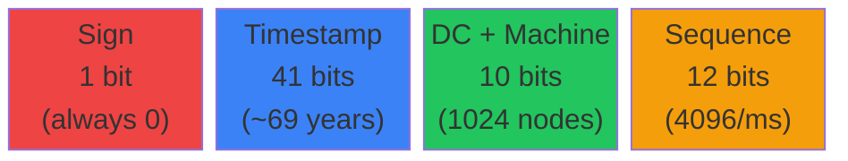
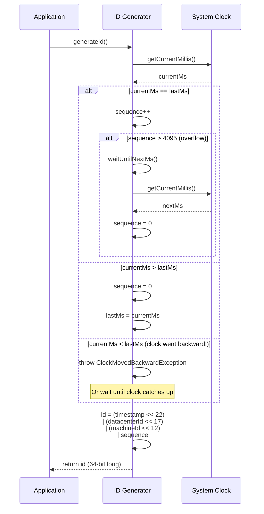
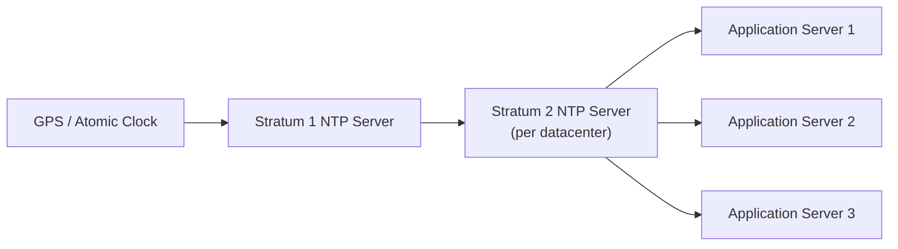
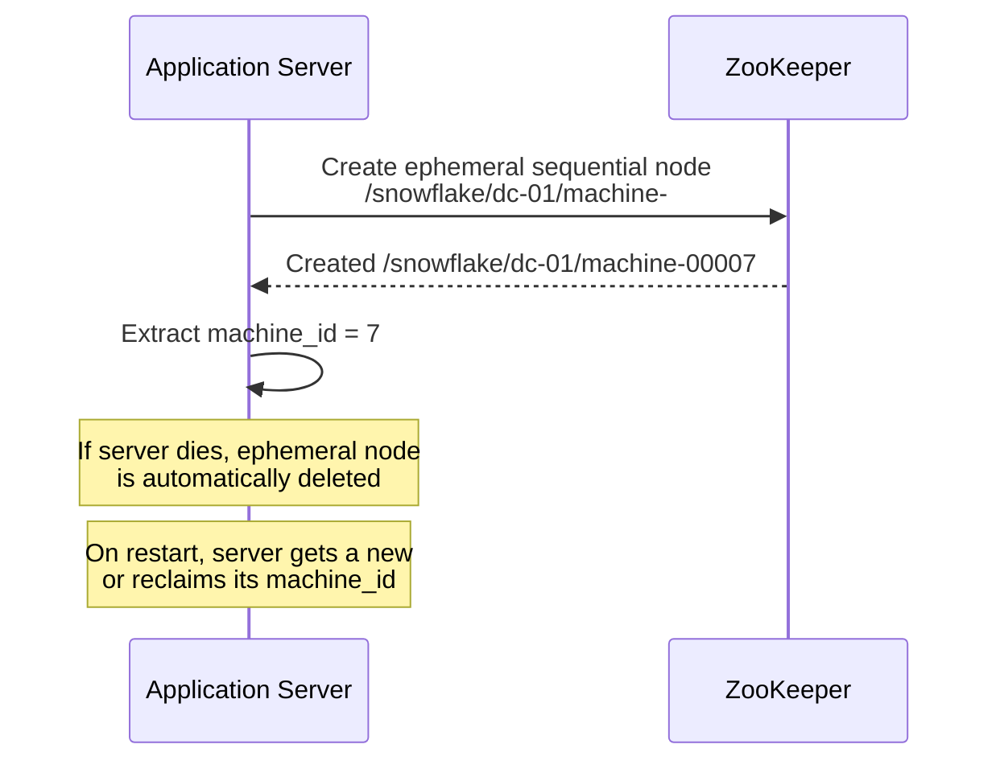
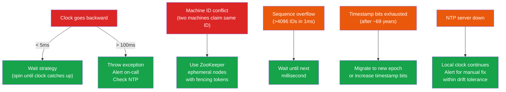

# Design a Unique ID Generator for Distributed Systems

> A unique ID generator is a foundational building block in distributed systems. Unlike
> single-server auto-increment, distributed ID generation must work across multiple
> machines, datacenters, and failure domains -- all while producing IDs that are globally
> unique, roughly time-ordered, and generated with sub-millisecond latency.

---

## 1. Problem Statement & Requirements

Design a system that generates **globally unique, 64-bit, time-sortable identifiers**
across a distributed fleet of servers, with no single point of failure and no coordination
between nodes at generation time.

### 1.1 Functional Requirements

- **FR-1:** Generate globally unique 64-bit numeric IDs.
- **FR-2:** IDs must be roughly sortable by creation time (newer IDs > older IDs).
- **FR-3:** Support at least 10,000 unique IDs per second per server.
- **FR-4:** No coordination between servers at ID generation time (no distributed locks).
- **FR-5:** IDs should be usable as database primary keys (numeric, compact).

### 1.2 Non-Functional Requirements

| Requirement        | Target                                                         |
| ------------------ | -------------------------------------------------------------- |
| **Availability**   | 99.999% (five nines) -- ID generation must never block writes  |
| **Latency**        | < 1 ms per ID generation (p99)                                 |
| **Throughput**     | 10,000+ IDs/sec per machine, millions/sec cluster-wide         |
| **Uniqueness**     | Zero collisions across all machines, all time                  |
| **Ordering**       | Roughly time-ordered (IDs from the same millisecond may vary)  |
| **Compactness**    | 64-bit integer -- fits in a single `BIGINT` column             |
| **No Coordination**| Each node generates IDs independently, no network round-trips  |

### 1.3 Out of Scope

- Cryptographic randomness or unpredictability of IDs (IDs can be guessable).
- Human-readable or URL-safe string encoding (we produce raw 64-bit integers).
- ID revocation or deletion semantics.
- Multi-region conflict resolution beyond unique datacenter/machine assignment.
- Authentication and authorization for the ID service itself.

### 1.4 Assumptions & Estimations (Back-of-Envelope Math)

```
Servers per datacenter        = 32   (5 bits)
Datacenters                   = 32   (5 bits)
Total machines                = 32 * 32 = 1,024

IDs per machine per ms        = 4,096  (12-bit sequence)
IDs per machine per second    = 4,096 * 1,000 = 4,096,000
IDs cluster-wide per second   = 4,096,000 * 1,024 ~ 4.19 billion/sec

Our requirement: 10,000 IDs/sec/server
Utilization at peak           = 10,000 / 4,096,000 = 0.24%
--> Massive headroom. The Snowflake scheme can handle 400x our requirement.

Epoch duration (41-bit ms)    = 2^41 ms = 2,199,023,255,552 ms ~ 69.73 years
If epoch starts Jan 1, 2020   -> IDs valid until ~2089

Storage per ID                = 8 bytes (64-bit integer)
1 billion IDs                 = 8 GB of raw ID storage
```

> **Key insight:** At 10K IDs/sec/server, we are using < 1% of the Snowflake scheme's
> capacity. This gives us enormous headroom for traffic spikes.

---

## 2. Approaches Comparison

Before diving into the chosen design, let's evaluate six common approaches.

### 2.1 UUID v4 (Random)

- **How it works:** Generate 128 bits of randomness. No coordination needed.
- **Pros:** Simple, no infrastructure, built into every language.
- **Cons:**
  - 128 bits -- does not fit our 64-bit requirement.
  - Not sortable by time (completely random).
  - Poor database index performance due to random distribution (B-tree page splits).
  - 36-character string representation is storage-heavy.

### 2.2 Database Auto-Increment

- **How it works:** A single database issues monotonically increasing IDs.
- **Pros:** Dead simple, perfectly ordered, no gaps (with careful transaction handling).
- **Cons:**
  - **Single point of failure** -- if the DB goes down, no IDs are generated anywhere.
  - Throughput bottleneck -- limited by DB write speed.
  - Not horizontally scalable without sharding tricks.
  - Network round-trip for every ID (high latency).

### 2.3 Multi-Master Database (Increment by N)

- **How it works:** Run N database servers. Server `k` starts at `k` and increments by `N`.
  - Server 1: 1, 4, 7, 10, ...
  - Server 2: 2, 5, 8, 11, ...
  - Server 3: 3, 6, 9, 12, ...
- **Pros:** No single point of failure, simple to implement.
- **Cons:**
  - IDs are **not time-sortable** (server 1 might produce ID 1000 before server 2 produces ID 5).
  - Adding/removing servers requires reconfiguring the increment and rebalancing.
  - Scaling is cumbersome -- you must decide `N` upfront.
  - Still requires a DB round-trip per ID.

### 2.4 Redis INCR

- **How it works:** Use Redis `INCR` command on a key. Atomic, single-threaded, fast.
- **Pros:**
  - Very fast (100K+ ops/sec per Redis instance).
  - Atomic -- guaranteed unique within a single Redis node.
  - Simple implementation.
- **Cons:**
  - Redis availability becomes critical -- if Redis goes down, IDs stop.
  - Single Redis node is a SPOF; Redis Cluster adds complexity.
  - IDs are sequential -- easy to guess (security concern for some use cases).
  - Not inherently time-sortable across multiple Redis instances.
  - Requires network round-trip (not sub-ms from application's perspective).

### 2.5 Twitter Snowflake (Chosen Approach)

- **How it works:** Each machine generates 64-bit IDs locally using a combination of
  timestamp, datacenter ID, machine ID, and a local sequence counter.
- **Pros:**
  - 64-bit -- fits in a `BIGINT`.
  - Time-sortable (timestamp is the most significant portion).
  - No coordination at generation time (fully local).
  - Sub-millisecond latency (no network call).
  - Horizontally scalable -- just assign new datacenter/machine IDs.
- **Cons:**
  - Depends on clock synchronization (NTP).
  - Clock drift or backward jumps require special handling.
  - Datacenter/machine IDs must be pre-assigned (operational overhead).
  - IDs are only roughly ordered (different machines may interleave within the same ms).

### 2.6 UUID v7 / ULID

- **How it works:** Embed a Unix timestamp in the most significant bits of a 128-bit UUID,
  followed by random bits. ULID is a similar concept with base32 encoding.
- **Pros:**
  - Time-sortable (timestamp prefix).
  - No coordination needed (random suffix prevents collisions).
  - Standard UUID format -- compatible with existing UUID columns.
- **Cons:**
  - 128 bits -- does not meet our 64-bit requirement.
  - Slight collision probability (though astronomically low).
  - Larger storage and index footprint than 64-bit integers.

---

### Comparison Table

| Criteria                  | UUID v4     | DB Auto-Inc | Multi-Master DB | Redis INCR  | Snowflake   | UUID v7/ULID |
| ------------------------- | ----------- | ----------- | --------------- | ----------- | ----------- | ------------ |
| **ID Size**               | 128-bit     | 64-bit      | 64-bit          | 64-bit      | 64-bit      | 128-bit      |
| **Time-Sortable**         | No          | Yes         | No              | Partial     | Yes         | Yes          |
| **Coordination Needed**   | None        | Per ID      | Per ID          | Per ID      | None        | None         |
| **Latency**               | < 1 us      | 1-10 ms     | 1-10 ms         | 0.1-1 ms    | < 1 us      | < 1 us       |
| **Single Point of Failure** | None      | Yes (DB)    | No              | Yes (Redis) | None        | None         |
| **Scalability**           | Infinite    | Low         | Medium          | Medium      | High        | Infinite     |
| **Uniqueness Guarantee**  | Statistical | Absolute    | Absolute        | Absolute    | Absolute    | Statistical  |
| **Clock Dependency**      | No          | No          | No              | No          | Yes (NTP)   | Yes          |
| **DB Index Performance**  | Poor        | Excellent   | Good            | Excellent   | Excellent   | Good         |
| **Implementation Effort** | Trivial     | Trivial     | Low             | Low         | Medium      | Low          |
| **Fits 64-bit?**          | No          | Yes         | Yes             | Yes         | Yes         | No           |

> **Verdict:** Twitter Snowflake is the best fit for our requirements: 64-bit, time-sortable,
> no coordination, sub-millisecond latency, and horizontally scalable. We proceed with a
> deep dive into this approach.

---

## 3. Deep Dive: Snowflake ID

### 3.1 Bit Layout

A Snowflake ID is a 64-bit integer with the following structure:

```
 0                   1                   2                   3
 0 1 2 3 4 5 6 7 8 9 0 1 2 3 4 5 6 7 8 9 0 1 2 3 4 5 6 7 8 9 0 1
+-+-+-+-+-+-+-+-+-+-+-+-+-+-+-+-+-+-+-+-+-+-+-+-+-+-+-+-+-+-+-+-+
|0|                    Timestamp (41 bits)                       |
+-+                                                             +
|                                                               |
+-+-+-+-+-+-+-+-+-+-+-+-+-+-+-+-+-+-+-+-+-+-+-+-+-+-+-+-+-+-+-+-+
|  Datacenter (5) |   Machine (5)   |     Sequence (12 bits)    |
+-+-+-+-+-+-+-+-+-+-+-+-+-+-+-+-+-+-+-+-+-+-+-+-+-+-+-+-+-+-+-+-+
```



| Field          | Bits  | Range / Meaning                                          |
| -------------- | ----- | -------------------------------------------------------- |
| **Sign bit**   | 1     | Always `0` (keeps IDs positive in signed 64-bit types)   |
| **Timestamp**  | 41    | Milliseconds since custom epoch. 2^41 ms = ~69.73 years  |
| **Datacenter** | 5     | 2^5 = 32 datacenters                                     |
| **Machine**    | 5     | 2^5 = 32 machines per datacenter                          |
| **Sequence**   | 12    | 2^12 = 4,096 IDs per millisecond per machine              |

**Total: 1 + 41 + 5 + 5 + 12 = 64 bits**

### 3.2 Field-by-Field Breakdown

#### Sign Bit (1 bit)

- Always `0`. This ensures the ID is a positive number when stored in signed 64-bit
  integer types (Java's `long`, PostgreSQL's `BIGINT`, etc.).
- We sacrifice one bit of range but gain universal compatibility.

#### Timestamp (41 bits)

- Stores the number of **milliseconds** elapsed since a **custom epoch**.
- Custom epoch example: `2020-01-01T00:00:00Z` (Unix timestamp `1577836800000`).
- Maximum duration: `2^41 = 2,199,023,255,552 ms` = **~69.73 years**.
- If epoch starts at 2020-01-01, IDs are valid until **~2089-09-07**.

**Why a custom epoch?**
Using a custom epoch (instead of Unix epoch 1970-01-01) maximizes the usable range.
Since 41 bits can only represent ~69 years, starting from 1970 would have exhausted
the range by ~2039. Starting from 2020 extends it to ~2089.

```
Custom epoch  = 2020-01-01 00:00:00 UTC = 1577836800000 ms (Unix)
Current time  = System.currentTimeMillis()
Timestamp     = current_time - custom_epoch
```

#### Datacenter ID (5 bits)

- 5 bits = 32 possible datacenter IDs (0-31).
- Assigned at deployment time via configuration or environment variable.
- Each datacenter gets a unique ID that never changes.

#### Machine ID (5 bits)

- 5 bits = 32 possible machine IDs (0-31) **per datacenter**.
- Total unique machines: 32 DCs x 32 machines = **1,024 machines**.
- Assigned at startup via:
  - Configuration file.
  - ZooKeeper/etcd registration (machine claims a free slot).
  - Instance metadata (e.g., last octet of IP address modulo 32).

#### Sequence Number (12 bits)

- 12 bits = 4,096 unique values (0-4095) per millisecond per machine.
- Resets to `0` when the millisecond changes.
- If all 4,096 sequences are exhausted within a single millisecond, the generator
  **waits** until the next millisecond before issuing the next ID.

```
Within the same millisecond:
  ID 1: timestamp=T, seq=0
  ID 2: timestamp=T, seq=1
  ...
  ID 4096: timestamp=T, seq=4095
  ID 4097: WAIT until timestamp=T+1, seq=0
```

### 3.3 ID Generation Algorithm



#### Pseudocode

```python
class SnowflakeGenerator:
    EPOCH = 1577836800000  # 2020-01-01 00:00:00 UTC in ms

    TIMESTAMP_BITS  = 41
    DATACENTER_BITS = 5
    MACHINE_BITS    = 5
    SEQUENCE_BITS   = 12

    MAX_DATACENTER_ID = (1 << DATACENTER_BITS) - 1   # 31
    MAX_MACHINE_ID    = (1 << MACHINE_BITS) - 1       # 31
    MAX_SEQUENCE      = (1 << SEQUENCE_BITS) - 1      # 4095

    MACHINE_SHIFT    = SEQUENCE_BITS                   # 12
    DATACENTER_SHIFT = SEQUENCE_BITS + MACHINE_BITS    # 17
    TIMESTAMP_SHIFT  = SEQUENCE_BITS + MACHINE_BITS + DATACENTER_BITS  # 22

    def __init__(self, datacenter_id, machine_id):
        assert 0 <= datacenter_id <= self.MAX_DATACENTER_ID
        assert 0 <= machine_id <= self.MAX_MACHINE_ID

        self.datacenter_id = datacenter_id
        self.machine_id = machine_id
        self.sequence = 0
        self.last_timestamp = -1
        self.lock = threading.Lock()

    def generate(self):
        with self.lock:
            current_ms = self._current_millis()

            if current_ms < self.last_timestamp:
                # Clock moved backward -- refuse to generate
                raise ClockMovedBackwardException(
                    f"Clock moved backward by {self.last_timestamp - current_ms} ms"
                )

            if current_ms == self.last_timestamp:
                # Same millisecond -- increment sequence
                self.sequence = (self.sequence + 1) & self.MAX_SEQUENCE
                if self.sequence == 0:
                    # Sequence overflow -- wait for next ms
                    current_ms = self._wait_next_millis(self.last_timestamp)
            else:
                # New millisecond -- reset sequence
                self.sequence = 0

            self.last_timestamp = current_ms

            # Assemble the 64-bit ID
            timestamp = current_ms - self.EPOCH
            id = (
                (timestamp << self.TIMESTAMP_SHIFT)
                | (self.datacenter_id << self.DATACENTER_SHIFT)
                | (self.machine_id << self.MACHINE_SHIFT)
                | self.sequence
            )
            return id

    def _current_millis(self):
        return int(time.time() * 1000)

    def _wait_next_millis(self, last_ts):
        current = self._current_millis()
        while current <= last_ts:
            current = self._current_millis()
        return current
```

### 3.4 Decoding a Snowflake ID

Given an ID, you can extract all components:

```python
def decode_snowflake(id, epoch=1577836800000):
    sequence      = id & 0xFFF             # lowest 12 bits
    machine_id    = (id >> 12) & 0x1F      # next 5 bits
    datacenter_id = (id >> 17) & 0x1F      # next 5 bits
    timestamp_ms  = (id >> 22) + epoch     # top 41 bits + epoch

    return {
        "timestamp": datetime.utcfromtimestamp(timestamp_ms / 1000),
        "datacenter_id": datacenter_id,
        "machine_id": machine_id,
        "sequence": sequence,
    }
```

This is extremely useful for debugging: given any ID, you immediately know **when** it was
created, **which datacenter**, and **which machine** produced it.

---

## 4. High-Level Architecture

### 4.1 Architecture Diagram

```mermaid
graph TB
    subgraph DC1["Datacenter 1 (dc_id=0)"]
        S1_1["Server 1<br/>machine_id=0<br/>SnowflakeGen"]
        S1_2["Server 2<br/>machine_id=1<br/>SnowflakeGen"]
        S1_3["Server 3<br/>machine_id=2<br/>SnowflakeGen"]
        S1_N["...<br/>machine_id=31<br/>SnowflakeGen"]
        NTP1["NTP Server"]
    end

    subgraph DC2["Datacenter 2 (dc_id=1)"]
        S2_1["Server 1<br/>machine_id=0<br/>SnowflakeGen"]
        S2_2["Server 2<br/>machine_id=1<br/>SnowflakeGen"]
        S2_3["Server 3<br/>machine_id=2<br/>SnowflakeGen"]
        S2_N["...<br/>machine_id=31<br/>SnowflakeGen"]
        NTP2["NTP Server"]
    end

    subgraph Coordination["Coordination Layer (Setup Only)"]
        ZK["ZooKeeper / etcd"]
    end

    ZK -->|"Assign machine_id<br/>(at startup only)"| S1_1
    ZK -->|"Assign machine_id<br/>(at startup only)"| S2_1

    NTP1 -.->|"Clock sync"| S1_1
    NTP1 -.->|"Clock sync"| S1_2
    NTP1 -.->|"Clock sync"| S1_3
    NTP2 -.->|"Clock sync"| S2_1
    NTP2 -.->|"Clock sync"| S2_2
    NTP2 -.->|"Clock sync"| S2_3

    App1["Application / Service"] -->|"generateId()"| S1_1
    App2["Application / Service"] -->|"generateId()"| S2_1

    style DC1 fill:#1e3a5f,color:#fff
    style DC2 fill:#1e3a5f,color:#fff
    style Coordination fill:#4a2c6b,color:#fff
```



### 4.2 Component Walkthrough

| Component                | Responsibility                                                    |
| ------------------------ | ----------------------------------------------------------------- |
| **Snowflake Generator**  | In-process library that generates IDs with zero network calls     |
| **NTP Server**           | Keeps machine clocks synchronized within each datacenter          |
| **ZooKeeper / etcd**     | Assigns unique (datacenter_id, machine_id) pairs at startup only  |
| **Application Service**  | Calls the generator as a local library function                   |

> **Critical design point:** The Snowflake generator is an **in-process library**, not a
> remote service. Applications import it as a dependency and call `generate()` locally.
> This is what gives us sub-microsecond latency -- there is no network hop.

### 4.3 Deployment Model

| Criteria              | Embedded Library (Recommended) | Dedicated ID Service        |
| --------------------- | ------------------------------ | --------------------------- |
| **Latency**           | < 1 us (in-process)            | 0.5-2 ms (network hop)     |
| **Availability**      | No external dependency         | Depends on service uptime   |
| **Operational cost**  | Per-app configuration          | Dedicated fleet management  |
| **Language support**  | One library per language       | Any language via API        |
| **ID pre-fetching**   | Not needed                     | Can batch-fetch IDs         |

---

## 5. Clock Synchronization

Clock synchronization is the **single most critical operational concern** for Snowflake
IDs. Since the timestamp forms the most significant bits, clock issues directly threaten
both uniqueness and ordering.

### 5.1 NTP (Network Time Protocol)

- All machines in the cluster must run NTP clients synchronized to reliable NTP servers.
- Typical NTP accuracy within a datacenter: **1-10 ms**.
- Google's TrueTime (used in Spanner) achieves **< 7 ms** uncertainty with GPS + atomic clocks.



### 5.2 What Happens When the Clock Goes Backward?

Clock jumps backward can happen due to:
1. **NTP corrections** -- NTP detects the local clock is ahead and steps it back.
2. **VM migration** -- a virtual machine is migrated to a host with a different clock.
3. **Leap seconds** -- rare, but they cause clocks to repeat a second.

If the clock goes backward, the generator could produce a timestamp that was already used,
leading to **duplicate IDs**.

### 5.3 Strategies for Handling Clock Regression

| Strategy              | Description                                         | Trade-off                          |
| --------------------- | --------------------------------------------------- | ---------------------------------- |
| **Refuse + Error**    | Throw an exception, refuse to generate IDs          | Safe but causes service disruption |
| **Wait**              | Spin-wait until the clock catches up to `lastMs`    | Safe, small delay, best for <5ms   |
| **Use last known ms** | Keep using `lastTimestamp`, increment sequence only  | Risks sequence exhaustion          |
| **Logical clock**     | Maintain a counter that only moves forward           | Complex, may drift from real time  |

**Recommended approach: Wait Strategy with a Threshold**

```python
def handle_clock_regression(self, current_ms):
    backward_ms = self.last_timestamp - current_ms

    if backward_ms <= 5:
        # Small regression (likely NTP adjustment) -- wait it out
        current_ms = self._wait_next_millis(self.last_timestamp)
        return current_ms

    elif backward_ms <= 100:
        # Medium regression -- log warning, wait
        log.warning(f"Clock moved backward by {backward_ms}ms, waiting...")
        current_ms = self._wait_next_millis(self.last_timestamp)
        return current_ms

    else:
        # Large regression (>100ms) -- something is seriously wrong
        raise ClockMovedBackwardException(
            f"Clock moved backward by {backward_ms}ms. "
            "Refusing to generate IDs. Check NTP configuration."
        )
```

### 5.4 NTP Best Practices for Snowflake Deployments

1. **Use `ntpd` with `-x` flag** (or `chrony` with `makestep 0 -1`) to prevent large
   backward steps. Instead, NTP will _slew_ the clock gradually.
2. **Monitor clock offset** -- alert if NTP offset exceeds 10 ms.
3. **Run local stratum-2 NTP servers** in each datacenter to minimize network jitter.
4. **Disable `ntpdate`** in cron jobs -- it can cause large backward jumps.
5. **Use hardware timestamping** (PTP) for sub-microsecond accuracy if budget allows.

---

## 6. Machine ID Assignment

### 6.1 Static Configuration

- Each machine has a config file with `datacenter_id` and `machine_id`.
- Simple but requires manual management; risk of misconfiguration.
- Best for small, stable fleets.

### 6.2 ZooKeeper / etcd Registration



- At startup, each server creates an ephemeral sequential node in ZooKeeper.
- The node's sequence number becomes the `machine_id`.
- When the server goes down, the ephemeral node is deleted, freeing the slot.
- **Risk:** If a server loses its ZK session but keeps running, it may still generate IDs
  with an orphaned `machine_id` -- another server could claim the same ID. Mitigate with
  heartbeat checks.

### 6.3 IP/MAC-Based Derivation

- Derive `machine_id` from the last 10 bits of IP or MAC address.
- No external dependency, but collision risk without careful IP management.
- Works well with predictable IP allocation (e.g., Kubernetes pod IPs from a /22 subnet).

---

## 7. Scaling

### 7.1 Current Capacity

```
Per machine:   4,096 IDs/ms = 4,096,000 IDs/sec
Per DC:        4,096,000 * 32 = 131 million IDs/sec
Cluster-wide:  131M * 32 DCs = ~4.19 billion IDs/sec
```

This is far beyond most real-world requirements.

### 7.2 Adding Machines Within a Datacenter

- Assign a new `machine_id` (0-31) via ZooKeeper or configuration.
- The new machine can immediately start generating unique IDs.
- **Limit:** 32 machines per datacenter with 5-bit machine ID.

### 7.3 Adding New Datacenters

- Assign a new `datacenter_id` (0-31) to the new datacenter.
- All machines in the new DC get `machine_id` values 0-31.
- **Limit:** 32 datacenters with 5-bit datacenter ID.

### 7.4 Exceeding 1,024 Machines

If you need more than 1,024 machines (32 DCs x 32 machines), you can **reconfigure the
bit allocation**:

| Configuration     | DC Bits | Machine Bits | Total Nodes | Sequence/ms | IDs/sec/node |
| ----------------- | ------- | ------------ | ----------- | ----------- | ------------ |
| **Default**       | 5       | 5            | 1,024       | 4,096       | 4,096,000    |
| **More machines** | 3       | 7            | 1,024       | 4,096       | 4,096,000    |
| **Max machines**  | 0       | 10           | 1,024       | 4,096       | 4,096,000    |
| **Max sequence**  | 5       | 5            | 1,024       | 4,096       | 4,096,000    |
| **Large fleet**   | 4       | 8            | 4,096       | 1,024       | 1,024,000    |
| **Huge fleet**    | 4       | 10           | 16,384      | 256         | 256,000      |

> **Trade-off:** More machine bits means fewer sequence bits (fewer IDs per ms per
> machine) or fewer timestamp bits (shorter epoch lifespan). Choose based on your
> specific scale requirements.

### 7.5 Multi-Region Deployment

Each region gets a unique `datacenter_id`. A global ZooKeeper/etcd cluster manages the
DC-to-ID registry (consulted only at setup time, not per-ID generation). Regions operate
fully independently -- no cross-region traffic for ID generation.

---

## 8. API Design (If Deployed as a Service)

```
GET  /api/v1/id              -> { "id": 1382971839182848 }
GET  /api/v1/ids?count=100   -> { "ids": [1382971839182848, ...] }
GET  /api/v1/id/{id}/decode  -> { "timestamp": "...", "datacenter_id": 3, "machine_id": 17, "sequence": 42 }
```

---

## 9. Failure Modes & Mitigations

### 9.1 Failure Analysis



### 9.2 Monitoring & Alerting

| Metric                          | Alert Threshold         | Action                        |
| ------------------------------- | ----------------------- | ----------------------------- |
| NTP clock offset                | > 10 ms                 | Check NTP daemon, network     |
| Clock backward events / min     | > 0                     | Investigate NTP configuration |
| Sequence overflow events / min  | > 100                   | Scale horizontally or adjust bits |
| ID generation latency (p99)     | > 1 ms                  | Check for lock contention     |
| Machine ID conflicts            | > 0                     | Check ZooKeeper health        |

---

## 10. Trade-offs & Alternatives

| Decision                    | Chosen                    | Alternative                | Why Chosen                                                  |
| --------------------------- | ------------------------- | -------------------------- | ----------------------------------------------------------- |
| ID size                     | 64-bit Snowflake          | 128-bit UUID v7            | Fits BIGINT, better index perf, lower storage               |
| Coordination model          | None (in-process)         | Centralized ID service     | Sub-us latency, no network dependency                       |
| Clock handling              | Wait + error strategy     | Logical clocks (Lamport)   | Simpler, IDs stay correlated with wall-clock time           |
| Machine ID assignment       | ZooKeeper ephemeral nodes | Static config files        | Auto-recovery, dynamic scaling, no manual intervention      |
| Sequence overflow handling  | Wait for next ms          | Return error immediately   | Callers don't need retry logic; tiny delay is acceptable    |
| Custom epoch                | 2020-01-01                | Unix epoch (1970-01-01)    | Extends usable range by 50 years (to ~2089 instead of ~2039)|
| Bit allocation (DC:Machine) | 5:5 (1024 nodes)          | 0:10 (1024 nodes, no DC)  | DC awareness aids debugging and regional isolation           |

---

## 11. Real-World Implementations

| System               | Approach                                  | Notable Difference                              |
| -------------------- | ----------------------------------------- | ----------------------------------------------- |
| **Twitter Snowflake** | Original Snowflake (41+5+5+12)           | Open-sourced 2010, now retired internally       |
| **Discord**          | Modified Snowflake (42+5+5+12)            | Uses Discord epoch (2015-01-01), worker process IDs |
| **Instagram**        | Modified Snowflake in PostgreSQL           | Uses DB shard ID instead of datacenter+machine  |
| **Baidu UID**        | Snowflake variant (28+22+13)              | More worker bits, fewer timestamp bits          |
| **Sony Sonyflake**   | 39+8+16 (10ms resolution, 256 machines)   | 10ms timestamp granularity, 174-year lifespan   |
| **MongoDB ObjectId** | 96-bit (32+40+24)                         | 12 bytes, includes random + counter             |

> **Instagram's approach:** Generates IDs inside PostgreSQL with a stored function --
> `(timestamp << 23) | (shard_id << 10) | (seq % 1024)`. No external coordination
> needed, but ties ID generation to the database.

---

## 12. Interview Tips

### 12.1 How to Structure the Discussion (45-Minute Interview)

| Time    | Activity                                                                |
| ------- | ----------------------------------------------------------------------- |
| 0-3 min | Clarify requirements: 64-bit? sortable? throughput? availability?       |
| 3-8 min | List and briefly compare approaches (UUID, DB auto-inc, Snowflake)      |
| 8-12 min| Select Snowflake, explain the bit layout on the whiteboard              |
| 12-25 min| Deep dive: generation algorithm, clock handling, machine ID assignment |
| 25-35 min| Architecture diagram, scaling discussion, failure modes               |
| 35-40 min| Trade-offs table, mention real-world systems                           |
| 40-45 min| Q&A, follow-up questions                                              |

### 12.2 Key Points Interviewers Want to Hear

1. **"Why not UUID?"** -- Too large (128 bits), not sortable, poor index performance.
2. **"Why not a centralized service?"** -- Network latency, single point of failure,
   throughput bottleneck.
3. **"How do you handle clock skew?"** -- NTP, wait strategy, error threshold.
4. **"What if you need more than 1024 machines?"** -- Reconfigure bit allocation.
5. **"How do you assign machine IDs?"** -- ZooKeeper ephemeral nodes, IP-based, config.
6. **"Are IDs truly ordered?"** -- Roughly ordered. Same millisecond across different
   machines may interleave, but IDs from the same machine are strictly ordered.

### 12.3 Common Follow-up Questions

- **"What happens if two datacenters have the same ID?"**
  Cannot happen -- datacenter_id is embedded in the ID. Even if the timestamps and
  sequences match, the datacenter bits differ.

- **"How would you make IDs unpredictable?"**
  Snowflake IDs are intentionally predictable (you can decode them). If you need
  unpredictability, encrypt the Snowflake ID with a block cipher (e.g., Format-Preserving
  Encryption) or use UUID v4 instead.

- **"What if the sequence overflows?"**
  Wait until the next millisecond. At 4,096 IDs/ms, this means > 4 million IDs/sec on a
  single machine. If that's not enough, allocate more sequence bits.

- **"How do you handle a datacenter going offline?"**
  Other datacenters continue generating IDs independently. No coordination is needed.
  When the failed DC comes back, it resumes with its assigned DC/machine IDs.

- **"What is the relationship between Snowflake and ULID/UUID v7?"**
  ULID and UUID v7 solve the same problem (time-sortable unique IDs) but use 128 bits.
  Snowflake is better when you need compact 64-bit IDs.

### 12.4 Common Pitfalls to Avoid

- Jumping to Snowflake without discussing alternatives first.
- Ignoring clock synchronization -- interviewers will probe this.
- Forgetting the sign bit (Java `long` / PostgreSQL `BIGINT` are signed).
- Not doing back-of-envelope math (41 bits = 69 years, 12 bits = 4096/ms).
- Over-complicating machine ID assignment -- start simple, then mention ZooKeeper.

---

> **Checklist before finishing your design:**
>
> - [x] Requirements are scoped and written down (64-bit, time-sortable, 10K/sec, <1ms).
> - [x] Back-of-envelope numbers computed (4.19B IDs/sec capacity, 69-year epoch).
> - [x] Multiple approaches compared with a decision matrix.
> - [x] Bit layout diagram drawn and explained field by field.
> - [x] Generation algorithm with pseudocode.
> - [x] Clock synchronization strategy (NTP + wait + error threshold).
> - [x] Architecture diagram showing embedded library vs. service deployment.
> - [x] Scaling path (bit reallocation, multi-region).
> - [x] Failure modes identified and mitigated.
> - [x] Trade-offs explicitly stated with reasoning.
> - [x] Real-world implementations referenced (Twitter, Discord, Instagram).
