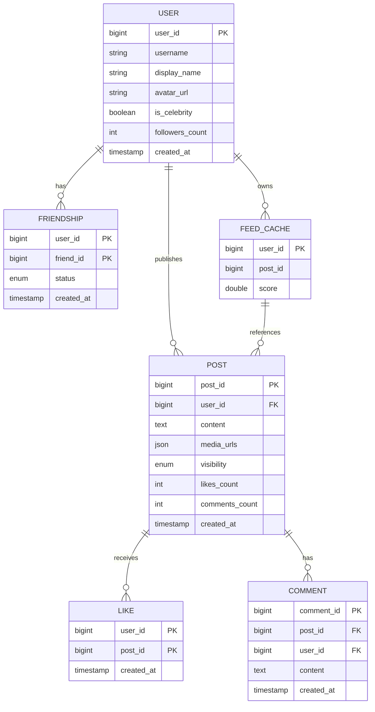
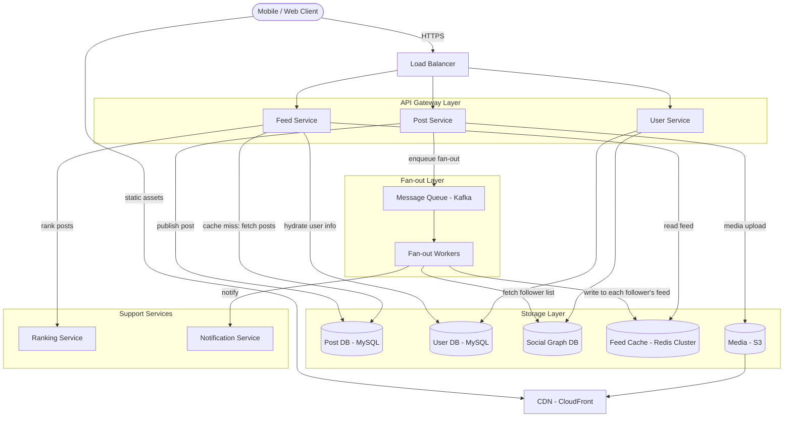
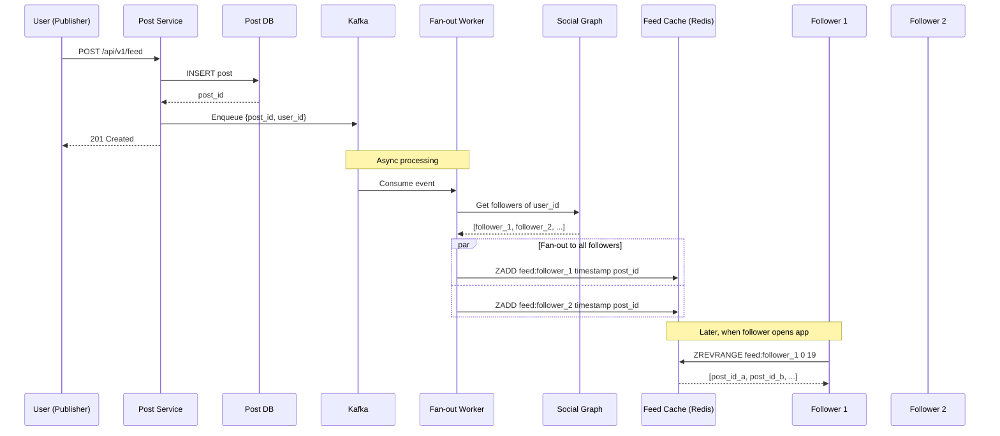
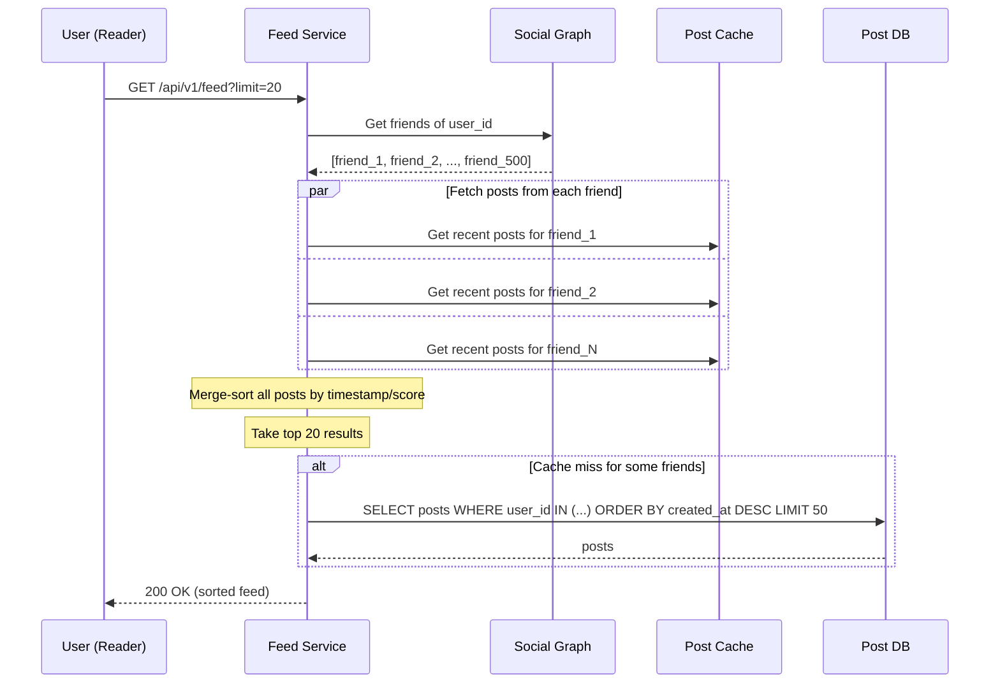
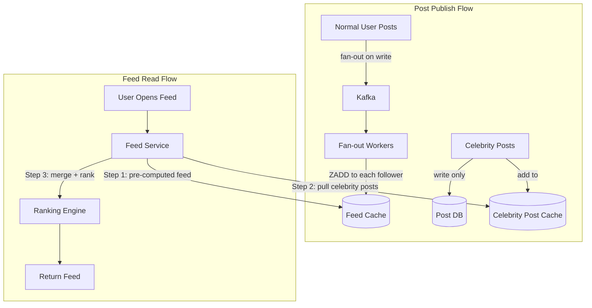
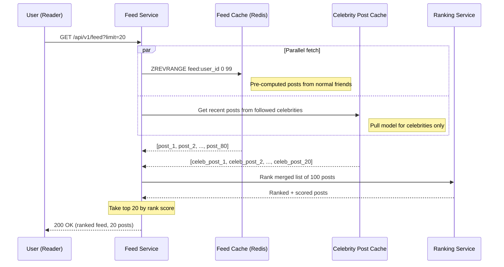
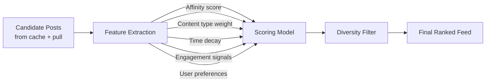
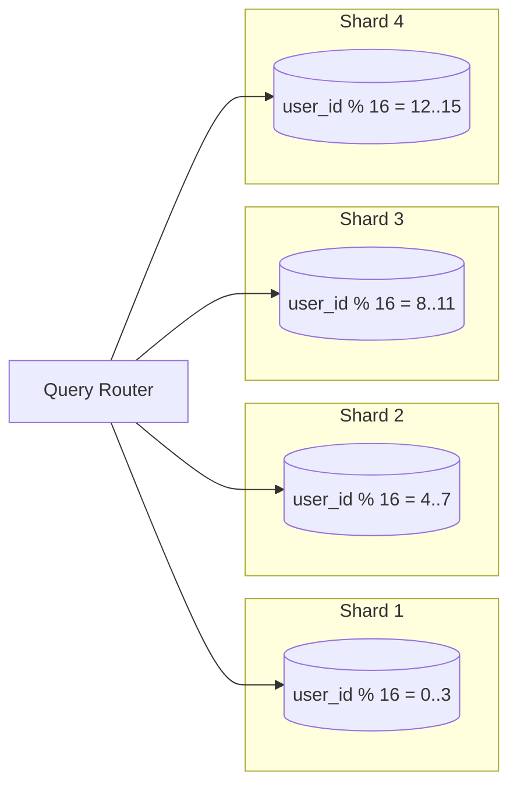

# Design a News Feed System

> A news feed system (Facebook News Feed, Twitter Timeline, LinkedIn Feed) aggregates
> and displays posts from a user's social connections in a personalized, ranked stream.
> This is one of the most frequently asked system design questions because it touches
> fan-out strategies, caching at scale, ranking algorithms, and hybrid push/pull trade-offs.

---

## 1. Problem Statement & Requirements

Design a scalable news feed system that allows users to publish posts and view a
personalized feed composed of their friends' and followed accounts' content, sorted
by relevance or chronological order.

### 1.1 Functional Requirements

- **FR-1:** Users can publish posts containing text, images, or videos.
- **FR-2:** Users can view a personalized feed of posts from their friends/followed accounts.
- **FR-3:** Feed supports cursor-based pagination (infinite scroll).
- **FR-4:** Feed ordering can be chronological or ranked by relevance.
- **FR-5:** Users can like, comment on, and share posts (interaction signals for ranking).
- **FR-6:** New posts appear in followers' feeds within a few seconds (near real-time).

### 1.2 Non-Functional Requirements

- **Availability:** 99.99% uptime (feed is a core experience -- downtime = users leave).
- **Latency:** Feed generation and retrieval < 200 ms at p99.
- **Throughput:** Must handle millions of feed reads per second (derived below).
- **Consistency:** Eventual consistency is acceptable. A post may take 1-5 seconds to
  appear in all followers' feeds. Users should always see their own posts immediately
  (read-your-writes consistency).
- **Durability:** Zero data loss for published posts.

### 1.3 Out of Scope

- Ads injection and bidding pipeline.
- Detailed ML recommendation engine internals.
- Authentication and authorization.
- Direct messaging.
- Notifications (covered in a separate design).
- Content moderation / spam detection pipeline.

### 1.4 Assumptions & Estimations (Back-of-Envelope Math)

```
Total users              = 1 Billion
Daily active users (DAU) = 300 M  (30%)
Avg friends per user     = 500
Avg posts per user/day   = 2
Avg feed reads per user  = 10x / day

--- Write (Post Publish) ---
Total posts / day        = 300 M * 2     = 600 M posts / day
Posts / second (WPS)     = 600 M / 86400 ~ 7,000 WPS

--- Read (Feed Fetch) ---
Total feed reads / day   = 300 M * 10    = 3 Billion / day
Feed reads / second (RPS)= 3 B / 86400  ~ 35,000 RPS
Peak RPS (3x avg)        = ~100,000 RPS

--- Fan-out Volume ---
Each post fans out to avg 500 friends
Fan-out writes / second  = 7,000 * 500  = 3.5 M cache writes / second

--- Storage ---
Avg post size (metadata) = 1 KB (text, IDs, timestamps)
Media per post (avg)     = 500 KB (images after compression)
Post metadata / day      = 600 M * 1 KB = 600 GB / day
Media storage / day      = 600 M * 0.3 (30% have media) * 500 KB = 90 TB / day
5-year metadata          = 600 GB * 365 * 5 ~ 1.1 PB
5-year media             = 90 TB * 365 * 5  ~ 164 PB (object storage + CDN)

--- Feed Cache ---
Feed entry size          = 8 bytes (post_id) + 8 bytes (timestamp) = 16 bytes
Entries per feed         = 500 (cached feed size)
Feed cache per user      = 500 * 16 = 8 KB
Total feed cache (DAU)   = 300 M * 8 KB = 2.4 TB (fits in distributed Redis)
```

> **Key Insight:** The read:write ratio is ~5:1, but the fan-out amplification makes
> the effective write volume 500x per post. This drives the core design decision
> between push, pull, and hybrid models.

---

## 2. API Design

### 2.1 Publish a Post

```
POST /api/v1/feed
Headers:
  Authorization: Bearer <token>
  Content-Type: multipart/form-data

Request Body:
  {
    "content": "Hello world! Check out this photo.",
    "media_ids": ["media_abc123"],       // pre-uploaded via media service
    "visibility": "friends"              // public | friends | private
  }

Response: 201 Created
  {
    "post_id": "post_7829341",
    "user_id": "user_123",
    "content": "Hello world! Check out this photo.",
    "media_urls": ["https://cdn.example.com/media/abc123.jpg"],
    "visibility": "friends",
    "created_at": "2026-02-28T10:30:00Z",
    "likes_count": 0,
    "comments_count": 0
  }
```

### 2.2 Retrieve News Feed

```
GET /api/v1/feed?cursor=<cursor>&limit=20&ranking=relevance
Headers:
  Authorization: Bearer <token>

Response: 200 OK
  {
    "posts": [
      {
        "post_id": "post_9981234",
        "user_id": "user_456",
        "author": {
          "name": "Jane Doe",
          "avatar_url": "https://cdn.example.com/avatars/456.jpg"
        },
        "content": "Beautiful sunset today!",
        "media_urls": ["https://cdn.example.com/media/sunset.jpg"],
        "created_at": "2026-02-28T09:15:00Z",
        "likes_count": 142,
        "comments_count": 23,
        "has_liked": false
      }
      // ... more posts
    ],
    "next_cursor": "eyJ0IjoxNzA5MTIzNDU2fQ==",
    "has_more": true
  }
```

### 2.3 Upload Media (Pre-signed URL)

```
POST /api/v1/media/upload
Request:  { "file_type": "image/jpeg", "file_size": 2048000 }
Response: 200
  {
    "media_id": "media_abc123",
    "upload_url": "https://s3.amazonaws.com/bucket/...?signature=...",
    "expires_at": "2026-02-28T11:00:00Z"
  }
```

> **Design Notes:**
> - Cursor-based pagination avoids offset drift when new posts are inserted.
> - Media is uploaded separately via pre-signed URLs to avoid routing large files through API servers.
> - Rate limiting: `X-RateLimit-Limit: 100`, `X-RateLimit-Remaining: 97`.

---

## 3. Data Model

### 3.1 Schema

| Table / Collection | Column           | Type          | Notes                              |
| ------------------ | ---------------- | ------------- | ---------------------------------- |
| `users`            | `user_id`        | BIGINT / PK   | Snowflake ID                       |
| `users`            | `username`       | VARCHAR(50)   | Unique, indexed                    |
| `users`            | `display_name`   | VARCHAR(100)  |                                    |
| `users`            | `avatar_url`     | VARCHAR(500)  |                                    |
| `users`            | `is_celebrity`   | BOOLEAN       | True if followers > 100K threshold |
| `users`            | `followers_count`| INT           | Denormalized counter               |
| `users`            | `created_at`     | TIMESTAMP     |                                    |
| `posts`            | `post_id`        | BIGINT / PK   | Snowflake ID (time-sortable)       |
| `posts`            | `user_id`        | BIGINT / FK   | Indexed, shard key                 |
| `posts`            | `content`        | TEXT          | Max 5000 chars                     |
| `posts`            | `media_urls`     | JSON          | Array of CDN URLs                  |
| `posts`            | `visibility`     | ENUM          | public, friends, private           |
| `posts`            | `likes_count`    | INT           | Denormalized, updated async        |
| `posts`            | `comments_count` | INT           | Denormalized, updated async        |
| `posts`            | `created_at`     | TIMESTAMP     | Indexed for chronological feed     |
| `friendships`      | `user_id`        | BIGINT / PK   | Composite PK (user_id, friend_id)  |
| `friendships`      | `friend_id`      | BIGINT / PK   | Indexed both directions            |
| `friendships`      | `status`         | ENUM          | pending, accepted, blocked         |
| `friendships`      | `created_at`     | TIMESTAMP     |                                    |
| `feed_cache`       | `user_id`        | BIGINT / PK   | Redis sorted set key               |
| `feed_cache`       | `post_id`        | BIGINT        | Member of sorted set               |
| `feed_cache`       | `score`          | DOUBLE        | Timestamp or ranking score         |

### 3.2 ER Diagram



### 3.3 Database Choice Justification

| Requirement                | Choice             | Reason                                           |
| -------------------------- | ------------------ | ------------------------------------------------ |
| User and post metadata     | MySQL / PostgreSQL | Structured data, ACID, mature replication         |
| Social graph (friendships) | MySQL + Graph Cache| Adjacency list in SQL, cached in Redis for lookups|
| Feed cache (per-user feed) | Redis Sorted Sets  | O(log N) insert, range queries, in-memory speed   |
| Media storage              | Amazon S3 / GCS    | Cheap, durable (11 nines), CDN-friendly           |
| Post search                | Elasticsearch      | Full-text search across post content              |
| Async messaging            | Apache Kafka       | Durable, high-throughput, ordered partitions       |

> **Why Redis Sorted Sets for Feed Cache?** Each user's feed is a sorted set where the
> score is the timestamp (or ranking score). `ZADD` inserts in O(log N), `ZREVRANGE`
> fetches the top-K posts for the feed page in O(log N + K). This enables sub-millisecond
> feed retrieval.

---

## 4. High-Level Architecture

### 4.1 Architecture Diagram



### 4.2 Component Walkthrough

| Component          | Responsibility                                                    |
| ------------------ | ----------------------------------------------------------------- |
| **Load Balancer**  | L7 routing, TLS termination, health checks, rate limiting         |
| **Post Service**   | Handles post creation, validation, media linking, writes to DB    |
| **Feed Service**   | Retrieves and assembles user's feed from cache, handles pagination|
| **User Service**   | User profiles, friendship management, social graph queries        |
| **Message Queue**  | Kafka topics for fan-out events, decouples publish from delivery  |
| **Fan-out Workers**| Consume post events, distribute post_ids to followers' feed caches|
| **Feed Cache**     | Redis Cluster holding per-user feed as sorted sets                |
| **Post DB**        | MySQL cluster storing post content and metadata                   |
| **Social Graph DB**| Stores friendship/follow edges, queried during fan-out            |
| **Ranking Service**| Scores and re-ranks posts before serving to user                  |
| **CDN**            | Serves images, videos, and static assets from edge locations      |
| **Notification**   | Sends push notifications for new posts from close friends         |

> **Data Flow Summary:** When a user publishes a post, the Post Service writes it to the
> Post DB and enqueues a fan-out event to Kafka. Fan-out Workers consume the event, look up
> the poster's follower list, and insert the post_id into each follower's feed cache in Redis.
> When a user opens their feed, the Feed Service reads post_ids from the Redis sorted set,
> hydrates them with post content and author info, optionally re-ranks them, and returns
> the assembled feed.

---

## 5. Deep Dive: Fan-out Strategies

The fan-out strategy is the single most critical design decision in a news feed system.
It determines how posts flow from publishers to consumers.

### 5.1 Fan-out on Write (Push Model)

When a user publishes a post, the system immediately pushes the post_id into every
follower's feed cache. The feed is pre-computed at write time.

**How it works:**

1. User publishes a post.
2. Post is written to the Post DB.
3. Fan-out event is enqueued to Kafka.
4. Fan-out workers fetch the poster's follower list.
5. For each follower, insert `(post_id, timestamp)` into their Redis sorted set.
6. When a follower opens their feed, it is already assembled -- just read from Redis.



**Pros:**
- Feed reads are extremely fast (single Redis read, sub-millisecond).
- Simple read path -- no complex aggregation at query time.
- Feed is always ready when the user opens the app.

**Cons:**
- Celebrity problem: A user with 10M followers triggers 10M cache writes per post.
- Wasted work: Many followers may never check their feed (inactive users).
- High write amplification: 7,000 WPS * 500 avg followers = 3.5M cache writes/sec.
- Delay in post appearing: Fan-out for popular users takes minutes.

### 5.2 Fan-out on Read (Pull Model)

When a user opens their feed, the system computes the feed on the fly by fetching
recent posts from all friends and merging them.

**How it works:**

1. User requests their feed.
2. Feed Service fetches the user's friend list.
3. For each friend, fetch their N most recent posts.
4. Merge-sort all posts by timestamp or ranking score.
5. Return the top K results.



**Pros:**
- No fan-out write amplification -- celebrities are handled naturally.
- No wasted work for inactive users.
- Always shows the freshest data (no stale cache).

**Cons:**
- Slow reads: Must aggregate posts from 500 friends on every request.
- High read latency: Fetching from 500 sources, even in parallel, is slow.
- Difficult to paginate consistently (merge cursors across sources).
- At 35K RPS, each requiring 500 sub-queries, this creates 17.5M internal queries/sec.

### 5.3 Hybrid Approach (The Production Solution)

The hybrid model combines push and pull based on a follower threshold. This is what
Facebook, Twitter/X, and Instagram actually use in production.

**Rules:**

| User Type             | Follower Count   | Strategy         |
| --------------------- | ---------------- | ---------------- |
| Normal user           | < 100,000        | Fan-out on Write |
| Celebrity / Influencer| >= 100,000       | Fan-out on Read  |

**How it works:**

1. When a normal user posts, fan-out on write pushes to all followers' caches.
2. When a celebrity posts, the post is only written to the Post DB (no fan-out).
3. When a user opens their feed:
   a. Read pre-computed feed from Redis (contains normal friends' posts).
   b. Fetch recent posts from followed celebrities (pull).
   c. Merge the two sets, rank, and return.





**Why This Works:**

- Normal users (99%+ of all users) still get fast fan-out on write.
- Celebrities (< 1% of users but responsible for disproportionate fan-out) only trigger
  a single DB write, avoiding millions of cache writes.
- At read time, merging pre-computed feed with a small pull from ~10-50 followed
  celebrities adds minimal latency (~20-50ms).
- Total fan-out volume drops dramatically: instead of 3.5M writes/sec, it becomes
  manageable because celebrities are excluded from the push path.

**Celebrity Threshold Tuning:**

```
Without hybrid: 3.5 M fan-out writes / sec (unsustainable)
With hybrid (100K threshold):
  - 99% of posters are normal users -> fan-out to avg 500 followers
  - Effective fan-out: 6,930 * 500 = 3.47 M writes / sec
  - But top 1% (celebrities) were responsible for 80%+ of the volume
  - Actual reduction: ~90% less fan-out writes
  - New effective rate: ~350K fan-out writes / sec (10x reduction)
```

---

## 6. Feed Ranking

### 6.1 Chronological vs Algorithmic Feed

| Aspect            | Chronological                     | Algorithmic (Ranked)                 |
| ----------------- | --------------------------------- | ------------------------------------ |
| Ordering          | Newest first                      | Relevance score descending           |
| Implementation    | Simple timestamp sort             | ML model + feature engineering       |
| User experience   | Predictable, transparent          | Higher engagement, personalized      |
| Miss rate         | High (users miss important posts) | Low (important posts bubble up)      |
| Celebrity problem | Celebrities dominate feed         | Balanced by affinity + diversity     |
| Used by           | Early Twitter, Mastodon           | Facebook, Instagram, TikTok, X       |

### 6.2 EdgeRank-Style Scoring

Facebook's original feed ranking used a formula called EdgeRank (now replaced by
ML models, but the core concepts remain):

```
Score = Affinity x Weight x Decay
```

| Factor       | Description                                           | Example Values         |
| ------------ | ----------------------------------------------------- | ---------------------- |
| **Affinity** | How close the viewer is to the poster                 | 0.0 - 1.0             |
|              | Based on: message frequency, profile views, likes,    |                        |
|              | comments, tags, time spent viewing their posts        |                        |
| **Weight**   | Type of interaction / content                         | Comment=10, Like=5,    |
|              | Different content types have different base weights   | Share=15, Photo=8,     |
|              |                                                       | Video=12, Text=3       |
| **Decay**    | Time decay -- older posts get lower scores            | e^(-lambda * age_hrs)  |
|              | Exponential decay ensures freshness                   | lambda ~ 0.05          |

**Ranking Pipeline:**



**Key Scoring Features:**

- **User-Post:** affinity_score, time_since_post, content_type, engagement velocity
- **User-Level:** session duration, preferred content types, active hours
- **Post-Level:** engagement rate (likes/impressions), original vs reshare, media quality

### 6.3 Real-Time Re-ranking

When a post goes viral (engagement velocity spike), its score should update in
near real-time without requiring a full feed recomputation:

1. Engagement events (like, comment, share) are streamed via Kafka.
2. A streaming processor (Flink / Spark Streaming) updates engagement counters.
3. Feed cache scores are updated asynchronously for active users.
4. On next feed fetch, the re-scored posts naturally sort higher.

---

## 7. Scaling & Performance

### 7.1 Database Sharding

**Posts Table -- Shard by user_id:**

```
Shard key: user_id % num_shards
Advantage: All posts by a user are on the same shard (efficient author queries)
Disadvantage: Celebrity shards may be hot -> use consistent hashing with virtual nodes
```



**Friendships Table -- Shard by user_id:**

```
Each shard holds the adjacency list for a subset of users.
Bidirectional: friendship (A, B) stored on shard(A) AND shard(B).
Lookup "all friends of user X" is single-shard.
```

### 7.2 Cache Layers

The system uses a multi-tier caching strategy:

```
Layer 1: Client-side cache (app local storage)
  - TTL: 5 minutes
  - Stores last-seen feed for instant app open

Layer 2: CDN cache (for media)
  - TTL: 24 hours (images), 1 hour (video thumbnails)
  - Invalidation via versioned URLs

Layer 3: Feed cache (Redis Cluster)
  - Per-user sorted set of post_ids + scores
  - Max 800 entries per user (older entries evicted)
  - TTL: 7 days for inactive users (LRU eviction for memory)
  - Cluster size: 2.4 TB across ~50 Redis nodes (48 GB each)

Layer 4: Post content cache (Redis / Memcached)
  - Caches hydrated post objects (content + author info)
  - TTL: 30 minutes
  - Cache-aside pattern with read-through

Layer 5: Social graph cache (Redis)
  - Caches follower/friend lists
  - TTL: 1 hour
  - Invalidated on follow/unfollow events
```

### 7.3 Redis Cluster Sizing

```
Feed cache: 300M DAU * 8 KB = 2.4 TB raw, ~4.8 TB with Redis overhead
  -> 50 nodes * 96 GB RAM (with replicas), 70K writes/sec per node

Post cache: 120M hot posts * 2 KB = 240 GB -> 10 Redis nodes
```

### 7.4 CDN for Media

```
Flow: Upload to S3 -> Lambda resize/compress -> CDN origin -> edge serve
CDN hit rate: ~95%, origin egress: ~45 TB/day
```

### 7.5 Kafka Partitioning

```
Fan-out topic: 256 partitions (by poster's user_id), 256 consumer workers
Throughput per partition: ~28 msgs/sec, each triggering ~500 Redis ZADD ops
```

---

## 8. Reliability & Fault Tolerance

### 8.1 Single Points of Failure

| Component        | SPOF? | Mitigation                                              |
| ---------------- | ----- | ------------------------------------------------------- |
| Load Balancer    | Yes   | Active-passive pair, DNS failover (Route 53)            |
| Post Service     | No    | Stateless, auto-scaling group (10-50 instances)         |
| Feed Service     | No    | Stateless, auto-scaling group (20-100 instances)        |
| Post DB (MySQL)  | Yes   | Primary + sync standby, automatic failover (< 30s)     |
| Feed Cache       | No    | Redis Cluster with replicas, automatic resharding       |
| Kafka            | No    | 3-broker ISR, replication factor 3, min.insync = 2      |
| Fan-out Workers  | No    | Consumer group, Kafka rebalances on failure              |
| S3               | No    | 99.999999999% durability, cross-region replication       |

### 8.2 Graceful Degradation

| Failure              | Behavior                                                        |
| -------------------- | --------------------------------------------------------------- |
| Feed Cache down      | Fall back to pull model from DB; latency rises 50ms -> 500ms   |
| Kafka down           | Posts still saved to DB; fan-out paused, replay on recovery     |
| Ranking Service down | Fall back to chronological ordering                             |
| Read replica down    | Route to remaining replicas; last resort: serve from post cache |

### 8.3 Feed Invalidation & Edge Cases

- **Post deletion:** Fan-out a DELETE event via Kafka; workers run `ZREM` on each
  follower's feed cache. Celebrity deletions need no cache cleanup (pulled at read time).
- **Cold start (new user):** Show trending/popular posts until they add friends;
  backfill feed with friends' last 50 posts on first follow.
- **Returning user (cache expired):** Rebuild feed via pull from friends' recent posts,
  warm cache, then resume normal fan-out path.

### 8.4 Data Consistency Guarantees

```
Post creation:     Strongly consistent (write to primary DB, ack to user)
Feed delivery:     Eventually consistent (fan-out takes 1-5 seconds)
Read-your-writes:  Guaranteed (user's own posts added to their feed immediately)
Like/comment count: Eventually consistent (async counter updates, ~2s delay)
```

---

## 9. Trade-offs & Alternatives

### 9.1 Push vs Pull vs Hybrid Comparison

| Dimension              | Fan-out on Write (Push)         | Fan-out on Read (Pull)         | Hybrid                          |
| ---------------------- | ------------------------------- | ------------------------------ | ------------------------------- |
| **Read latency**       | Very low (< 10ms)              | High (200-500ms)               | Low (< 50ms)                   |
| **Write latency**      | High for celebrities           | Very low (single DB write)     | Low (celebrities skip fan-out) |
| **Write amplification**| O(followers) per post          | O(1) per post                  | O(followers) for normal users  |
| **Read complexity**    | Simple (single cache read)     | Complex (aggregate + merge)    | Medium (cache read + small pull)|
| **Storage cost**       | High (duplicate post_ids)      | Low (no pre-computation)       | Medium                          |
| **Freshness**          | Near real-time                 | Always fresh                   | Near real-time                  |
| **Celebrity handling** | Poor (millions of writes)      | Natural                        | Optimal                         |
| **Inactive users**     | Wasted work                    | No waste                       | Wasted (but manageable)         |
| **Ideal for**          | Low fan-out, read-heavy        | High fan-out, write-heavy      | Production systems at scale     |

### 9.2 Key Design Decisions

| Decision                         | Chosen                   | Alternative               | Why Chosen                                           |
| -------------------------------- | ------------------------ | ------------------------- | ---------------------------------------------------- |
| Fan-out strategy                 | Hybrid (push + pull)     | Pure push or pure pull    | Handles both normal users and celebrities efficiently |
| Feed cache                       | Redis Sorted Sets        | Cassandra                 | Sub-ms reads, natural ordering, simpler operations    |
| Post DB                          | MySQL (sharded)          | DynamoDB / Cassandra      | Need transactions for post creation, mature tooling   |
| Message queue                    | Kafka                    | RabbitMQ / SQS            | Durable replay, ordered partitions, high throughput   |
| Feed ranking                     | Algorithmic (EdgeRank)   | Chronological only        | Higher engagement, better user experience             |
| Pagination                       | Cursor-based             | Offset-based              | Stable results when new posts are inserted            |
| Media handling                   | Pre-signed URL upload    | Proxy through API server  | Avoids routing large files through app servers        |
| Celebrity threshold              | 100K followers           | 1M followers              | Balances fan-out reduction vs pull complexity          |

### 9.3 SQL vs NoSQL for Posts

| Aspect          | SQL (MySQL + Vitess)              | NoSQL (Cassandra/DynamoDB)         |
| --------------- | --------------------------------- | ---------------------------------- |
| Transactions    | ACID for post creation            | Eventual consistency               |
| Querying        | Rich joins for hydration          | No joins, app-level aggregation    |
| Scaling         | Vitess/Citus for sharding         | Native horizontal scaling          |
| Schema changes  | Painful at scale                  | Flexible schema                    |

**Decision:** MySQL with Vitess. Posts are write-once, we need joins for hydration,
and the cache layer handles the read-heavy workload.

---

## 10. Interview Tips

### What to Lead With

1. **Start with the fan-out trade-off.** This is what the interviewer wants to hear.
   Immediately frame the problem as "push vs pull" and explain why a hybrid is needed.
2. **Draw the architecture early.** Sketch Post Service -> Kafka -> Fan-out Workers ->
   Feed Cache before diving into details.
3. **Use numbers.** "With 300M DAU and 500 avg friends, pure fan-out on write means
   3.5M cache writes per second -- that is our main scaling challenge."

### Common Follow-up Questions & Answers

| Question                                              | Answer Sketch                                    |
| ----------------------------------------------------- | ------------------------------------------------ |
| "What if a celebrity with 50M followers posts?"       | Hybrid model: skip fan-out, pull at read time    |
| "How do you handle a post going viral?"               | Engagement velocity triggers re-ranking; CDN absorbs media traffic |
| "How do you ensure users see their own posts?"        | Read-your-writes: insert into own feed cache synchronously before returning 201 |
| "What if Redis goes down?"                            | Graceful degradation to pull model from DB; client-side cache bridges the gap |
| "How do you handle feed for a new user?"              | Cold start: show trending posts, backfill when they add friends |
| "How would you add ads to the feed?"                  | Ad insertion service injects sponsored posts at positions 3, 8, 15 based on auction results |
| "How do you prevent duplicate posts in the feed?"     | Post_id is the sorted set member; ZADD is idempotent for same member |
| "What happens during a friendship change?"            | Follow: backfill last N posts; Unfollow: ZREM their posts from cache |

### Mistakes to Avoid

- **Do not jump to "use Kafka" without explaining why async fan-out is needed.**
  Start from the problem (write amplification) and derive the need for a message queue.
- **Do not ignore the celebrity problem.** If you propose pure fan-out on write without
  addressing celebrities, the interviewer will push back. Proactively mention the
  hybrid approach.
- **Do not over-engineer the ranking system.** Mention EdgeRank concepts and ML scoring,
  but do not spend 10 minutes on feature engineering. The interviewer cares about the
  system architecture, not the ML model.
- **Do not forget pagination.** Cursor-based pagination with `(timestamp, post_id)` as
  the cursor ensures stable results even when new posts are inserted.
- **Do not conflate the post database with the feed cache.** The Post DB stores the source
  of truth; the feed cache (Redis) stores pre-computed lists of post_ids per user.
  These are different systems with different scaling characteristics.

### Time Allocation (45-minute interview)

```
[0-5 min]   Requirements & estimations
            -> 300M DAU, 35K RPS reads, 7K WPS, 3.5M fan-out writes/sec
[5-10 min]  API design & data model
            -> POST/GET /feed, Users/Posts/Friendships tables, Redis sorted sets
[10-25 min] Architecture & fan-out deep dive
            -> Draw diagram, explain push vs pull vs hybrid, sequence diagrams
[25-35 min] Ranking, caching, scaling
            -> EdgeRank, multi-tier cache, sharding strategy
[35-45 min] Reliability, trade-offs, follow-ups
            -> SPOF table, graceful degradation, interviewer Q&A
```

---

## 11. Quick Reference Card

```
System:          News Feed (Facebook / Twitter / LinkedIn style)
Scale:           300M DAU, 35K feed reads/sec, 7K post writes/sec
Core challenge:  Fan-out amplification (3.5M cache writes/sec for pure push)
Key decision:    Hybrid fan-out (push for normal users, pull for celebrities)
Feed storage:    Redis Sorted Sets (per-user, post_id as member, timestamp as score)
Post storage:    Sharded MySQL (by user_id)
Async backbone:  Kafka (fan-out events, engagement events)
Ranking:         EdgeRank-style: Affinity x Weight x Decay
Consistency:     Eventual (1-5s fan-out delay), read-your-writes for own posts
Availability:    99.99% (graceful degradation if cache or queue fails)
Latency target:  < 200ms p99 for feed reads
```
