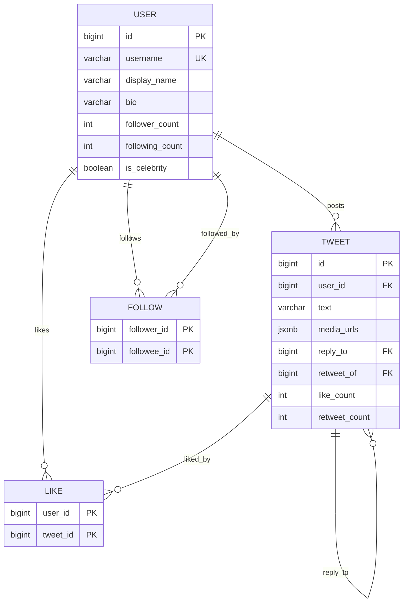
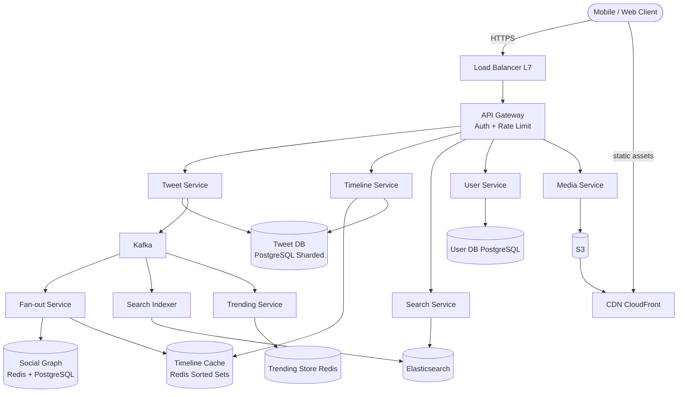
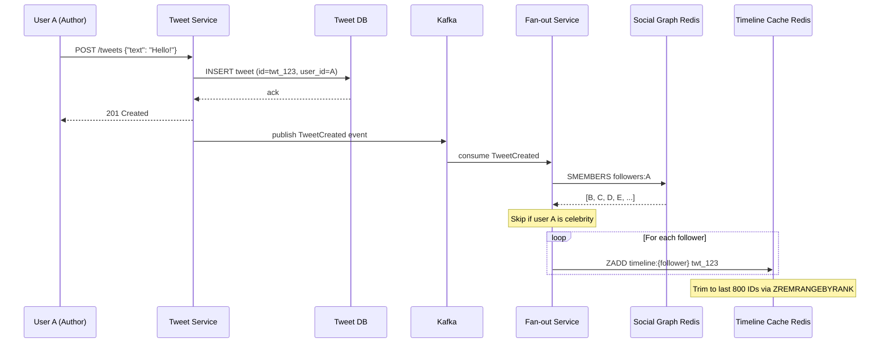
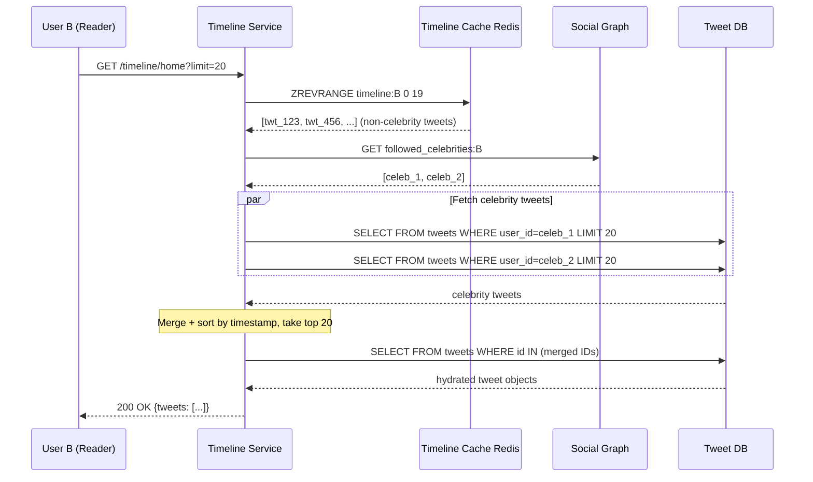
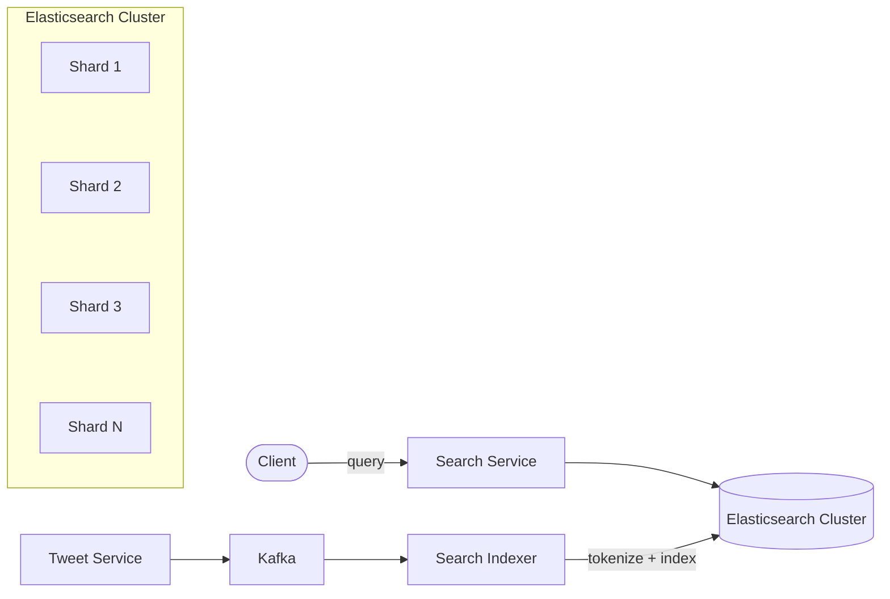
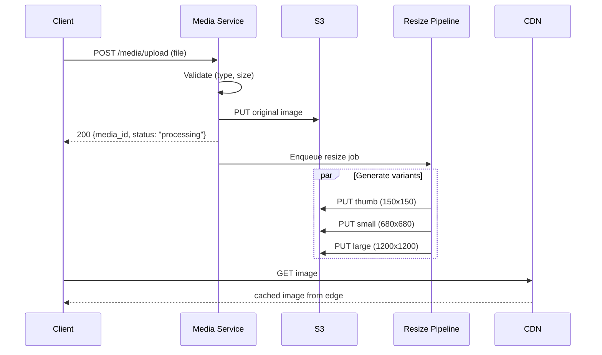

# Design Twitter

> A social media platform where users post short messages (tweets), follow other users,
> and consume a personalized timeline. The core challenge is generating timelines at scale
> for hundreds of millions of users with sub-200ms latency, handling the asymmetric
> follower distribution (celebrities vs normal users), and supporting real-time search
> across billions of tweets.

---

## 1. Problem Statement & Requirements

Design a Twitter-like social media platform that allows users to post short-form text
(with optional media), follow other users, and consume a real-time personalized feed.

### 1.1 Functional Requirements

- **FR-1:** Post tweets (up to 280 characters with optional images/videos, max 4 media)
- **FR-2:** Follow / unfollow other users
- **FR-3:** Home timeline -- aggregated feed of tweets from users you follow
- **FR-4:** User timeline -- all tweets by a specific user
- **FR-5:** Search tweets by keywords and hashtags
- **FR-6:** Trending topics -- real-time popular hashtags/keywords by region
- **FR-7:** Like and retweet (with optional quote text)

> **Priority for deep dive:** Home timeline generation (FR-3) is the hardest problem,
> followed by search (FR-5) and trending (FR-6).

### 1.2 Non-Functional Requirements

- **Scale:** 300M MAU, 150M DAU
- **Availability:** 99.99% uptime (< 52 min downtime/year)
- **Latency:** Home timeline p99 < 200ms, tweet post p99 < 500ms, search p99 < 300ms
- **Consistency:** Eventual consistency for timelines and counters. Strong durability for tweets.
- **Throughput:** ~175K read QPS and ~3.5K write QPS (derived below)

### 1.3 Out of Scope

- Direct messages (DMs) and group chats
- Advertising and ad targeting platform
- Analytics dashboards for tweet impressions
- Content moderation ML pipelines

### 1.4 Assumptions & Estimations (Back-of-Envelope Math)

```
Users
  MAU                     = 300M
  DAU                     = 150M  (50% of MAU)

Write Traffic (Tweets)
  Avg tweets per user/day = 2
  Tweets per day          = 150M * 2 = 300M tweets/day
  Write QPS               = 300M / 86,400 ~ 3,500 WPS
  Peak write QPS (3x)     = ~10,500 WPS

Read Traffic (Timeline)
  Avg timeline reads/day  = 100 per DAU
  Timeline reads per day  = 150M * 100 = 15B reads/day
  Read QPS                = 15B / 86,400 ~ 175,000 RPS
  Peak read QPS (3x)      = ~525,000 RPS
  Read:Write ratio        = 50:1

Storage
  Tweet size (avg)        = 300 bytes (text + metadata, no media)
  Daily tweet storage     = 300M * 300B = 90 GB/day
  Yearly tweet storage    = 90 GB * 365 ~ 33 TB/year
  5-year tweet storage    = ~165 TB

  Media (20% tweets have media, avg 500 KB)
  Daily media storage     = 300M * 0.2 * 500 KB = 30 TB/day
  Yearly media storage    = 30 TB * 365 ~ 11 PB/year

Bandwidth
  Outgoing (timeline)     = 175K RPS * 20 tweets * 300B ~ 1 GB/s (text only)
  Media bandwidth         = served via CDN, ~10-50 GB/s at peak

Social Graph
  Avg follows per user    = 200
  Total follow edges      = 300M * 200 = 60B edges
  Graph storage           = 60B * 16B ~ 1 TB
```

> **Key insight:** Read QPS (175K) is ~50x write QPS (3.5K). Pre-computing timelines
> (fan-out on write) makes sense for most users, but not for celebrities.

---

## 2. API Design

All endpoints require `Authorization: Bearer <token>`. Cursor-based pagination throughout.

```
POST /api/v1/tweets
  Request:  { "text": "Hello! #firsttweet", "media_ids": ["med_abc"], "reply_to": "twt_xyz" }
  Response: 201 { "id": "twt_123", "user_id": "usr_42", "text": "...", "created_at": "..." }

DELETE /api/v1/tweets/{tweet_id}
  Response: 204 No Content

GET /api/v1/timeline/home?cursor=<cursor>&limit=20
  Response: 200 { "tweets": [...], "next_cursor": "cur_abc", "has_more": true }

GET /api/v1/timeline/user/{user_id}?cursor=<cursor>&limit=20
  Response: 200 { "tweets": [...], "next_cursor": "cur_def", "has_more": true }

POST /api/v1/users/{user_id}/follow
  Response: 200 { "following": true }

DELETE /api/v1/users/{user_id}/follow
  Response: 200 { "following": false }

GET /api/v1/search?q=hello+world&cursor=<cursor>&limit=20
  Response: 200 { "tweets": [...], "next_cursor": "cur_ghi", "has_more": true }

GET /api/v1/trending?region=US&limit=10
  Response: 200 { "trends": [{ "topic": "#SuperBowl", "tweet_count": 1200000 }] }

POST /api/v1/tweets/{tweet_id}/like
  Response: 200 { "liked": true, "like_count": 42 }

DELETE /api/v1/tweets/{tweet_id}/like
  Response: 200 { "liked": false, "like_count": 41 }

POST /api/v1/tweets/{tweet_id}/retweet
  Request:  { "quote_text": "So true!" }
  Response: 201 { "retweet_id": "twt_rt_999" }

POST /api/v1/media/upload
  Request:  multipart/form-data with file
  Response: 200 { "media_id": "med_abc123" }
```

> **Rate Limiting:** `X-RateLimit-Limit/Remaining/Reset` headers. Tweet posting: 300/3h,
> timeline reads: 1500/15min.

---

## 3. Data Model

### 3.1 Schema

**Users Table** (PostgreSQL)

| Column           | Type         | Notes                       |
| ---------------- | ------------ | --------------------------- |
| `id`             | BIGINT / PK  | Snowflake ID                |
| `username`       | VARCHAR(15)  | Unique, indexed             |
| `display_name`   | VARCHAR(50)  |                             |
| `bio`            | VARCHAR(160) |                             |
| `profile_image`  | VARCHAR(255) | CDN URL                     |
| `follower_count` | INT          | Denormalized, updated async |
| `following_count`| INT          | Denormalized, updated async |
| `is_celebrity`   | BOOLEAN      | True if followers > 100K    |
| `created_at`     | TIMESTAMP    |                             |

**Tweets Table** (PostgreSQL, sharded by `user_id`)

| Column          | Type         | Notes                          |
| --------------- | ------------ | ------------------------------ |
| `id`            | BIGINT / PK  | Snowflake ID (time-sortable)   |
| `user_id`       | BIGINT / FK  | Shard key, indexed             |
| `text`          | VARCHAR(280) |                                |
| `media_urls`    | JSONB        | Array of CDN URLs              |
| `reply_to`      | BIGINT       | Nullable FK to parent tweet    |
| `retweet_of`    | BIGINT       | Nullable FK to original tweet  |
| `quote_text`    | VARCHAR(280) | Nullable, for quote retweets   |
| `like_count`    | INT          | Denormalized counter           |
| `retweet_count` | INT          | Denormalized counter           |
| `created_at`    | TIMESTAMP    | Indexed                        |

**Follows Table** (Adjacency list in both SQL and Redis)

| Column        | Type      | Notes                                   |
| ------------- | --------- | --------------------------------------- |
| `follower_id` | BIGINT    | Composite PK (follower_id, followee_id) |
| `followee_id` | BIGINT    | Indexed                                 |
| `created_at`  | TIMESTAMP |                                         |

**Likes Table**

| Column      | Type      | Notes                              |
| ----------- | --------- | ---------------------------------- |
| `user_id`   | BIGINT    | Composite PK (user_id, tweet_id)   |
| `tweet_id`  | BIGINT    | Indexed                            |
| `created_at`| TIMESTAMP |                                    |

### 3.2 ER Diagram



### 3.3 Database Choice Justification

| Requirement             | Choice        | Reason                                                    |
| ----------------------- | ------------- | --------------------------------------------------------- |
| User profiles, tweets   | PostgreSQL    | Structured data, ACID for writes, mature sharding (Citus) |
| Timeline cache          | Redis         | Sorted sets for O(log N) insertion, sub-ms reads          |
| Social graph (hot path) | Redis         | Adjacency list as sets, O(1) membership check             |
| Social graph (durable)  | PostgreSQL    | Source of truth, supports range queries on follows         |
| Full-text search        | Elasticsearch | Inverted index, real-time indexing, relevance scoring      |
| Media storage           | S3            | Cheap, durable (11 nines), integrates with CDN             |
| Trending counters       | Redis         | Atomic INCR, sorted sets for top-K                         |
| Tweet ID generation     | Snowflake IDs | Time-sortable, distributed, no coordination                |

> **Graph DB consideration:** Neo4j could model the social graph with richer traversals
> (friends-of-friends, shortest path). However, Twitter's core queries are simple one-hop
> lookups (who follows X, does A follow B). An adjacency list in Redis + SQL is sufficient
> and operationally simpler.

---

## 4. High-Level Architecture

### 4.1 Architecture Diagram



### 4.2 Component Walkthrough

| Component              | Responsibility                                                        |
| ---------------------- | --------------------------------------------------------------------- |
| **Load Balancer**      | L7 routing, TLS termination, health checks                            |
| **API Gateway**        | Authentication, rate limiting, request validation                     |
| **Tweet Service**      | CRUD on tweets, publishes tweet events to Kafka                       |
| **Timeline Service**   | Serves home/user timelines from Redis cache, falls back to DB         |
| **Fan-out Service**    | Consumes tweet events, pushes tweet IDs to followers' timeline caches |
| **Search Service**     | Queries Elasticsearch for keyword/hashtag search                      |
| **Search Indexer**     | Consumes tweet events, tokenizes and indexes into Elasticsearch       |
| **Trending Service**   | Sliding-window counts of hashtags, computes top-K                     |
| **Media Service**      | Media uploads, triggers resize pipeline, returns CDN URLs             |
| **Kafka**              | Decouples tweet ingestion from fan-out, search, and trending          |

> **Data flow:** Tweet Service -> DB -> Kafka -> consumed in parallel by Fan-out,
> Search Indexer, and Trending services.

---

## 5. Deep Dive: Core Flows

### 5.1 Timeline Generation (The Core Problem)

**Fan-out on Write (Push):** When user A tweets, push tweet ID to every follower's cache.
Pros: reads are fast (pre-computed). Cons: celebrity with 50M followers = 50M writes/tweet.

**Fan-out on Read (Pull):** On timeline read, fetch latest tweets from all followed users.
Pros: no write amplification. Cons: slow reads, can't meet 200ms SLA.

**Hybrid Approach (What Twitter Actually Does):**

```
Normal users (< 100K followers):  fan-out on write (push to all follower caches)
Celebrities (>= 100K followers):  do NOT fan-out on write

Timeline read:
  1. Read pre-computed timeline from Redis (non-celebrity tweets)
  2. Fetch followed celebrities list for this user
  3. Fetch latest tweets from each celebrity's user timeline
  4. Merge + sort by timestamp, return top N
```

#### Fan-out on Write Flow



#### Home Timeline Read Flow



> **Why only tweet IDs in Redis?** A tweet ID is 8 bytes. 150M users * 800 tweets =
> 120B entries * 8B = ~960 GB (fits in Redis cluster). Full tweets (~300B each) would
> need ~36 TB -- impractical for in-memory.

#### Fan-out Budget

```
Normal user (500 followers): 500 ZADD ops per tweet
  At 3,500 tweets/sec = 1.75M Redis ops/sec -> 20-shard cluster handles easily

Celebrity (50M followers): 50M ZADD ops per tweet
  Time = 50M / 500K ops/sec = 100 seconds -> UNACCEPTABLE, hence hybrid
```

### 5.2 Social Graph

Supports: who does A follow, who follows A, does A follow B, follower counts.

```
Redis (Hot Path):
  following:{user_id}  -> SET of followed user IDs
  followers:{user_id}  -> SET of follower user IDs
  SISMEMBER following:42 100  -> 1 (user 42 follows user 100)
  SCARD followers:42          -> follower count

PostgreSQL (Source of Truth):
  follows(follower_id, followee_id, created_at) -- indexed on both columns
```

#### Follow / Unfollow Flow

```
Follow (A follows B):
  1. INSERT INTO follows (A, B)       -- PostgreSQL
  2. SADD following:A B               -- Redis
  3. SADD followers:B A               -- Redis
  4. INCR following_count:A, follower_count:B
  5. If B is NOT celebrity: backfill B's recent tweets into timeline:A

Unfollow (A unfollows B):
  1. DELETE FROM follows WHERE follower_id=A AND followee_id=B
  2. SREM following:A B, SREM followers:B A
  3. DECR counts
  4. Remove B's tweets from timeline:A (async, best-effort)
```

### 5.3 Search

#### Architecture



#### Indexing Pipeline

```
1. Tweet created -> Kafka -> Search Indexer consumes
2. Tokenization: lowercase, extract #hashtags and @mentions, stemming, stop words
3. Index into Elasticsearch:
   { tweet_id, user_id, text, hashtags, mentions, lang, created_at,
     like_count, retweet_count, user_follower_count }
4. Indexing latency: ~2-5 seconds from creation to searchable
```

#### Query Execution

```
1. Parse query: keywords, hashtags, filters (from:user, since:date)
2. Elasticsearch bool query with match + range filter
3. Scatter-gather across shards, merge top-K results
4. Early termination for high-confidence results

Relevance scoring: BM25 text match + recency boost + engagement boost + author authority
```

### 5.4 Trending Topics

Detect bursts -- topics accelerating in volume, not just high absolute count.

```
Count-Min Sketch + Sliding Window:
  - Probabilistic data structure: multiple hash functions, 2D counter array
  - Space-efficient O(w*d), may overcount but never undercount
  - 12 buckets of 5 minutes each = 60-minute sliding window
  - Each bucket has its own Count-Min Sketch
  - Burst detection: if current_count > 3 * avg_24h_count -> "trending"

Redis implementation:
  ZINCRBY trending:US:current_hour "#SuperBowl" 1    # on each tweet
  ZREVRANGE trending:US:current_hour 0 9 WITHSCORES  # top 10 trending

Geographic trending:
  - Separate counters per region (US, EU, IN, JP)
  - IP geolocation determines region
  - Merge regional counts for global trending
```

### 5.5 Media Storage



```
S3 structure: originals/, thumb/, small/, large/, video/
CDN: Cache-Control max-age=1yr (immutable content-addressed URLs)
Processing: Convert to WebP, strip EXIF, generate blurhash placeholder
```

---

## 6. Scaling & Performance

### 6.1 Database Scaling

```
Tweet DB Sharding:
  Shard key: user_id (consistent hashing with virtual nodes)
  Shards: 64 (expandable to 256)
  Why user_id: user timeline queries hit single shard, fan-out can batch per shard
  Trade-off: hot shards possible for celebrities, mitigated by heavy caching

Read Replicas:
  2 replicas per shard (async, < 100ms lag)
  Timeline Service reads from replicas (eventual consistency OK)
  Total: 64 * 3 = 192 DB instances
```

### 6.2 Timeline Cache (Redis)

```
Data structure: Sorted Set per user
  ZADD timeline:42 <timestamp> twt_123    # add
  ZREVRANGE timeline:42 0 19              # latest 20
  ZREMRANGEBYRANK timeline:42 0 -801      # trim to 800

Memory: 150M users * 800 entries * 16B = ~1.9 TB (with overhead ~3.8 TB)
Cluster: 40 nodes * 100 GB = 4 TB capacity

Eviction: inactive users (30+ days) evicted, rebuilt on next login (LRU fallback)
```

### 6.3 Search Index Scaling

```
Elasticsearch:
  Hot tier: last 7 days (~2B tweets) on SSDs, 50 shards
  Warm tier: 7-30 days on HDDs, read-only
  Cold tier: 30+ days archived to S3

Time-based indices: tweets-YYYY-MM-DD (5 primary + 1 replica each)
"Latest" search: last 24h only (5 shards, fast)
"Top" search: last 7d, sorted by relevance
```

### 6.4 Kafka Scaling

```
Topics: tweets.created (64 partitions), tweets.deleted (16), follows.changed (32)
Partition key: user_id (ordering per user)
Consumer groups: fanout (64), search-indexer (16), trending (8)
Retention: 72 hours
```

---

## 7. Reliability & Fault Tolerance

### 7.1 Single Points of Failure

| Component        | SPOF? | Mitigation                                                |
| ---------------- | ----- | --------------------------------------------------------- |
| Load Balancer    | Yes   | Active-passive pair, DNS failover                         |
| API Gateway      | No    | Multiple stateless instances                              |
| Tweet DB Primary | Yes   | Synchronous standby, Patroni auto-failover (RTO < 30s)   |
| Redis Timeline   | No    | Redis Cluster with replicas, auto re-sharding             |
| Kafka            | No    | 3-broker ISR, min.insync.replicas=2                       |
| Elasticsearch    | No    | Replica shards, auto shard reallocation                   |
| S3               | No    | 11 nines durability, cross-region replication             |

### 7.2 Replication & Failover

```
PostgreSQL: Primary -> Sync Standby (RPO=0, RTO<30s via Patroni)
            Primary -> Async Replicas (RPO<1s, cross-AZ)

Redis:      Masters with 1-2 replicas in different AZs
            Sentinel-managed failover (RTO<15s)
            Timeline cache rebuildable, some loss acceptable

Kafka:      ISR=3, min.insync=2, producer acks=all
            Zero message loss for acknowledged writes
```

### 7.3 Rate Limiting & Abuse Prevention

```
Sliding window in Redis:
  Tweet creation: 300/3h | Timeline reads: 1500/15min
  Search: 450/15min      | Follows: 400/24h | Likes: 1000/24h

Abuse: spam ML scoring, bot CAPTCHA, hash-based duplicate detection, IP rate limits
```

### 7.4 Graceful Degradation

```
Redis down:     Fall back to pull-based timeline (~50ms -> ~500ms, still available)
ES down:        Search unavailable, trends from cached snapshot, tweets still publish
Kafka down:     Tweet Service writes to DB synchronously, fan-out pauses and catches up
DB shard down:  Stale reads from replicas, writes fail until failover (~30s)
```

---

## 8. Trade-offs & Alternatives

| Decision                | Chosen                            | Alternative                | Why Chosen                                                         |
| ----------------------- | --------------------------------- | -------------------------- | ------------------------------------------------------------------ |
| Timeline strategy       | Hybrid (push normal, pull celeb)  | Pure push or pure pull     | Push breaks for celebs (50M writes); pull too slow for reads       |
| Tweet DB                | PostgreSQL (sharded)              | Cassandra                  | SQL familiarity, ACID, Citus scaling. Read-heavy favors PG         |
| Social graph            | Redis + PostgreSQL                | Neo4j (Graph DB)           | One-hop queries only; Redis O(1) lookups; no multi-hop needed      |
| Search engine           | Elasticsearch                     | Solr / Custom index        | Battle-tested real-time indexing, good relevance tuning            |
| Message queue           | Kafka                             | RabbitMQ / SQS             | High throughput, replay, multiple consumer groups                  |
| Tweet IDs               | Snowflake IDs                     | UUID v4 / Auto-increment   | Time-sortable, distributed, 64-bit compact                        |
| Cache data              | Tweet IDs only                    | Full tweet objects          | 4 TB IDs vs 36 TB objects in Redis; IDs are practical              |
| Trending algo           | Count-Min Sketch + sliding window | Exact counting             | O(KB) vs O(GB) memory; ~1% error acceptable for trends            |
| Media processing        | Async (queue-based)               | Sync in request path       | Resizing takes 1-3s; async keeps publish latency low               |
| Consistency             | Eventual                          | Strong                     | Sub-200ms reads need caching + async fan-out                       |

---

## 9. Interview Tips

### 45-Minute Time Allocation

```
[0-5 min]   Requirements + estimations (175K reads, 3.5K writes, 50:1 ratio)
[5-10 min]  API design + data model (Snowflake IDs, sharding key)
[10-30 min] Architecture + timeline deep dive (hybrid fan-out = THE differentiator)
[30-40 min] Scaling (sharding, Redis sizing) + reliability (failover, degradation)
[40-45 min] Trade-offs (2-3 key ones) + wrap-up
```

### Key Insights That Impress

1. **Hybrid fan-out** -- explain why pure push fails (celebrity problem) and pure pull
   fails (latency), then present the hybrid as the natural solution
2. **Quantify fan-out cost** -- "50M followers = 100 seconds of writes per tweet"
3. **Snowflake IDs** -- time-sortable, eliminating separate `created_at` index
4. **IDs not objects in cache** -- 4 TB vs 36 TB memory math
5. **Count-Min Sketch** -- shows algorithmic depth beyond "just count hashtags"

### Common Follow-up Q&A

**Q: Celebrity tweets?**
A: No fan-out. Fetch at read time, merge with pre-computed timeline. Adds ~20-50ms.

**Q: User follows 10K accounts?**
A: Fan-out pushes TO them (fine). Concern is if many are celebrities requiring parallel
DB reads. Cap celebrity merge to top 50 for latency control.

**Q: Tweet deletion?**
A: Delete from DB, publish TweetDeleted to Kafka. Fan-out removes from caches (best-effort).
Search indexer removes from ES. Eventual consistency -- brief visibility after deletion.

**Q: Algorithmic timeline?**
A: Add ranking service between cache and API. Re-rank by: engagement prediction (ML),
recency, user affinity, content diversity. Read-time operation on fetched tweets.

**Q: Thundering herd on celebrity tweets?**
A: Cache celebrity tweets with 30s TTL. Request coalescing (singleflight pattern) so
one DB query serves all concurrent requests.

**Q: User inactive for months, empty cache?**
A: Detect empty cache on login, trigger rebuild job. Fetch followed users' recent tweets
per shard. Takes 2-5s; show loading state. Subsequent reads are fast.

### Pitfalls to Avoid

- Don't propose pure fan-out-on-write without addressing the celebrity problem
- Don't conflate user timeline (trivial) with home timeline (hard)
- Don't say "graph database" without justifying why one-hop queries need one
- Don't ignore write amplification math -- always quantify
- Don't skip media storage -- Twitter is a media-rich platform

---

> **Checklist:**
> - [x] Requirements: 7 functional, 5 non-functional, out-of-scope defined
> - [x] Estimations: 175K RPS reads, 3.5K WPS, ~33 TB/year
> - [x] Architecture diagram with all services
> - [x] Timeline deep dive with hybrid fan-out + sequence diagrams
> - [x] Social graph, search, trending, media covered
> - [x] DB choices justified (PostgreSQL, Redis, ES, S3)
> - [x] Scaling: sharding, Redis sizing, ES tiers
> - [x] SPOFs identified with mitigations
> - [x] 10 trade-offs with reasoning
> - [x] Interview tips with timing and follow-up Q&A
