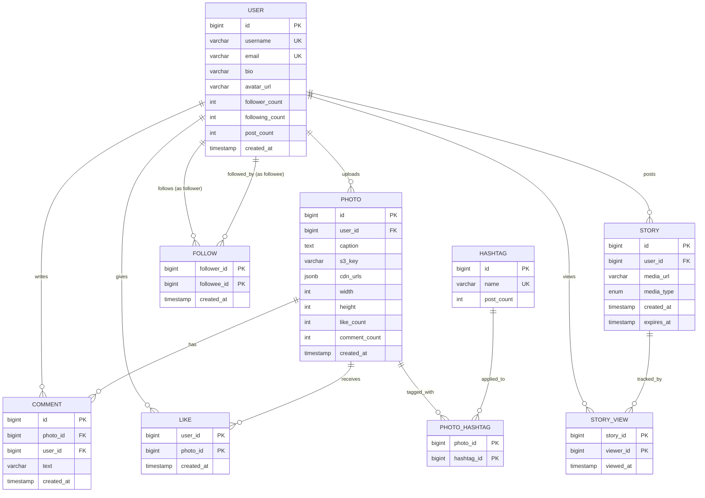
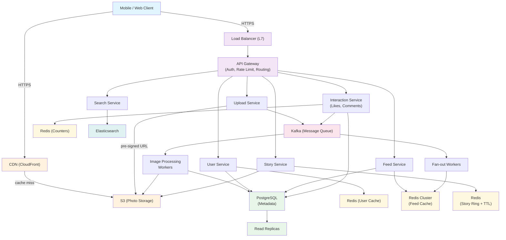
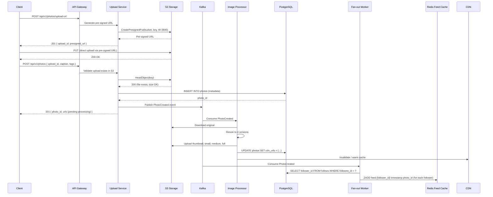
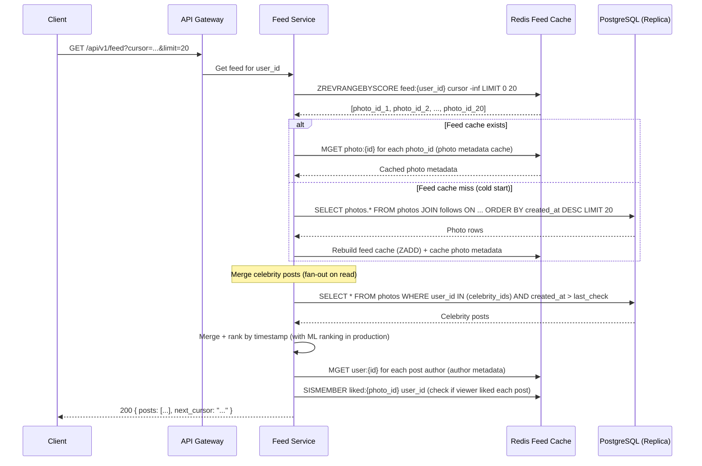
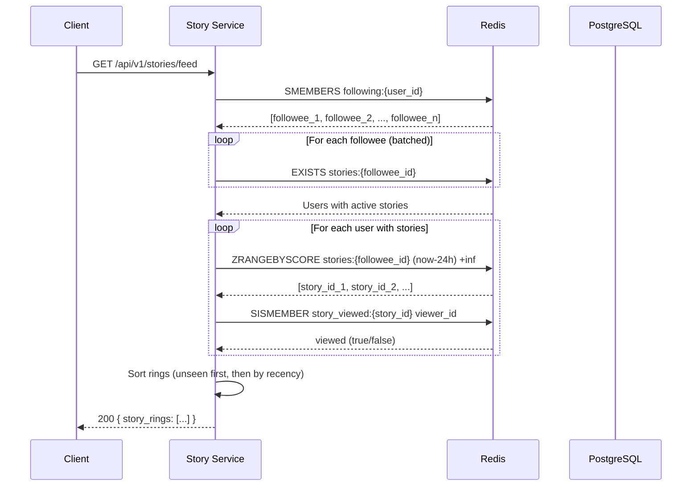

# Design Instagram

> A photo and video sharing social network where users upload media, follow other
> users, consume a personalized news feed, share ephemeral stories, and interact
> through likes and comments. The system is extremely read-heavy, media-intensive,
> and must serve a global audience with low latency.

---

## 1. Problem Statement & Requirements

Design a scalable photo-sharing platform that allows users to upload photos/videos,
follow other users, view a personalized news feed, share 24-hour ephemeral stories,
and engage via likes and comments. The system must handle hundreds of millions of
daily active users with high availability and low-latency media delivery.

### 1.1 Functional Requirements

- **FR-1: Photo/Video Upload** -- Users can upload photos and short videos with captions and hashtags.
- **FR-2: Follow System** -- Users can follow/unfollow other users (asymmetric relationship, not mutual).
- **FR-3: News Feed** -- Users see a chronological (with ranking) feed of posts from people they follow.
- **FR-4: Stories** -- Users can post ephemeral content that auto-expires after 24 hours.
- **FR-5: Like & Comment** -- Users can like and comment on posts.
- **FR-6: Explore & Discover** -- Users can discover trending content, search for users, and search by hashtags.

> **Priority for deep dive:** Photo Upload Pipeline (FR-1), News Feed Generation (FR-3),
> and Stories (FR-4) are the three most architecturally interesting features.

### 1.2 Non-Functional Requirements

- **Availability:** 99.99% uptime (~52 min downtime/year). Users expect Instagram to always be available.
- **Latency:** Feed load < 200 ms (p99), photo upload acknowledgement < 1 s, story load < 150 ms.
- **Throughput:** ~58K photo uploads/sec, ~290K feed reads/sec (derived below).
- **Consistency model:** Eventual consistency. A follower seeing a post 2-3 seconds late is acceptable. Like/comment counts can be eventually consistent.
- **Durability:** Zero data loss for uploaded media. Once a photo is acknowledged as uploaded, it must never be lost.
- **Scalability:** Must handle 500M DAU with linear scaling path.

### 1.3 Out of Scope

- Reels (short-form video with editing tools and music)
- Direct Messages (DMs)
- Advertising and ad-targeting platform
- Live streaming
- Shopping/commerce features
- Account verification and moderation pipelines

### 1.4 Assumptions & Estimations (Back-of-Envelope Math)

```
Users & Activity
────────────────────────────────────────────
Total registered users       = 2 B
Daily active users (DAU)     = 500 M
Avg follows per user         = 200

Photo Uploads
────────────────────────────────────────────
Photos uploaded / day        = 100 M
Avg photo size (original)    = 2 MB
Avg resized versions         = 4 (thumbnail 10KB, small 100KB, medium 500KB, full 2MB)
Total storage per photo      = 2 MB + 500KB + 100KB + 10KB ≈ 2.6 MB

Write QPS (uploads)
────────────────────────────────────────────
Uploads / second             = 100 M / 86,400 ≈ 1,157 ≈ ~1.2 K WPS
Peak (3x average)            = ~3.5 K WPS

Read QPS (feed + profile views)
────────────────────────────────────────────
Avg feed refreshes / user    = 10 / day
Total feed reads / day       = 500 M × 10 = 5 B
Feed reads / second          = 5 B / 86,400 ≈ 58 K RPS
Peak (5x average)            = ~290 K RPS
Read:Write ratio             ≈ 50:1 (heavily read-dominant)

Storage
────────────────────────────────────────────
Daily new photo storage      = 100 M × 2.6 MB = 260 TB / day
Monthly storage              = 260 TB × 30 = 7.8 PB / month
5-year storage (media only)  = 260 TB × 365 × 5 ≈ 474 PB

Metadata storage             = 100 M × 1 KB/row ≈ 100 GB / day
5-year metadata              = 100 GB × 365 × 5 ≈ 182 TB

Bandwidth
────────────────────────────────────────────
Ingress (uploads)            = 1.2 K × 2 MB = 2.4 GB/s
Egress (reads, avg 500KB)    = 58 K × 500 KB = 29 GB/s
Peak egress                  = ~145 GB/s (served mostly from CDN)

Stories
────────────────────────────────────────────
Active stories at any time   ≈ 200 M (24h window)
Story views / day            = 2 B
Story storage (24h TTL)      ≈ 200 M × 2 MB = 400 TB rotating
```

> **Key insight:** The system is massively read-heavy (50:1) and storage-intensive.
> CDN offloading is critical -- without it, origin servers cannot handle 29 GB/s egress.
> With CDN handling 95%+ of media reads, origin egress drops to ~1.5 GB/s.

---

## 2. API Design

All endpoints require `Authorization: Bearer <token>` header. Rate limiting
enforced via `X-RateLimit-Remaining` and `X-RateLimit-Reset` headers.

```
──────────────────────────────────────────────────────────────────────
PHOTO UPLOAD (two-phase: get pre-signed URL, then upload directly to S3)
──────────────────────────────────────────────────────────────────────

POST /api/v1/photos/upload-url
  Request:  { "file_type": "image/jpeg", "file_size": 2048000 }
  Response: 201 {
    "upload_id": "upl_abc123",
    "presigned_url": "https://s3.amazonaws.com/ig-uploads/...",
    "expires_in": 3600
  }

POST /api/v1/photos
  Request:  {
    "upload_id": "upl_abc123",
    "caption": "Beautiful sunset #travel",
    "location": { "lat": 34.05, "lng": -118.24, "name": "Los Angeles" },
    "tags": ["travel", "sunset"]
  }
  Response: 201 {
    "photo_id": "p_789xyz",
    "urls": {
      "thumbnail": "https://cdn.instagram.com/t/...",
      "medium": "https://cdn.instagram.com/m/...",
      "full": "https://cdn.instagram.com/f/..."
    },
    "created_at": "2026-02-28T10:30:00Z"
  }

──────────────────────────────────────────────────────────────────────
NEWS FEED
──────────────────────────────────────────────────────────────────────

GET /api/v1/feed?cursor=<timestamp_id>&limit=20
  Response: 200 {
    "posts": [
      {
        "photo_id": "p_789xyz",
        "user": { "id": "u_123", "username": "alice", "avatar_url": "..." },
        "urls": { "thumbnail": "...", "medium": "...", "full": "..." },
        "caption": "Beautiful sunset",
        "like_count": 1542,
        "comment_count": 87,
        "liked_by_viewer": false,
        "created_at": "2026-02-28T10:30:00Z"
      }
    ],
    "next_cursor": "1709113800_p_788abc",
    "has_more": true
  }

──────────────────────────────────────────────────────────────────────
STORIES
──────────────────────────────────────────────────────────────────────

POST /api/v1/stories
  Request:  (multipart) file + { "sticker_data": {...}, "duration": 5 }
  Response: 201 { "story_id": "s_456", "expires_at": "2026-03-01T10:30:00Z" }

GET /api/v1/stories/feed
  Response: 200 {
    "story_rings": [
      {
        "user": { "id": "u_123", "username": "alice", "avatar_url": "..." },
        "stories": [
          { "story_id": "s_456", "media_url": "...", "type": "image",
            "created_at": "...", "expires_at": "...", "viewed": false }
        ],
        "has_unseen": true
      }
    ]
  }

──────────────────────────────────────────────────────────────────────
USER & SOCIAL
──────────────────────────────────────────────────────────────────────

GET /api/v1/users/{user_id}
  Response: 200 {
    "id": "u_123", "username": "alice", "bio": "...",
    "avatar_url": "...", "post_count": 342,
    "follower_count": 15200, "following_count": 480,
    "is_followed_by_viewer": true
  }

POST /api/v1/users/{user_id}/follow
  Response: 200 { "status": "following" }

DELETE /api/v1/users/{user_id}/follow
  Response: 200 { "status": "unfollowed" }

POST /api/v1/photos/{photo_id}/like
  Response: 200 { "liked": true, "like_count": 1543 }

DELETE /api/v1/photos/{photo_id}/like
  Response: 200 { "liked": false, "like_count": 1542 }

POST /api/v1/photos/{photo_id}/comments
  Request:  { "text": "Amazing photo!" }
  Response: 201 { "comment_id": "c_901", "created_at": "..." }

──────────────────────────────────────────────────────────────────────
SEARCH & EXPLORE
──────────────────────────────────────────────────────────────────────

GET /api/v1/search?q=sunset&type=hashtag&cursor=...&limit=20
  Response: 200 { "results": [...], "next_cursor": "..." }

GET /api/v1/explore?cursor=...&limit=20
  Response: 200 { "posts": [...], "next_cursor": "..." }
```

> **Design note:** The two-phase upload (pre-signed URL) offloads large file
> transfers from our API servers directly to S3, keeping API servers lightweight
> and focused on metadata operations.

---

## 3. Data Model

### 3.1 Schema

| Table / Collection  | Column              | Type              | Notes                                        |
| ------------------- | ------------------- | ----------------- | -------------------------------------------- |
| `users`             | `id`                | BIGINT / PK       | Snowflake ID                                 |
| `users`             | `username`          | VARCHAR(30)       | Unique, indexed                              |
| `users`             | `email`             | VARCHAR(255)      | Unique, indexed                              |
| `users`             | `bio`               | VARCHAR(500)      |                                              |
| `users`             | `avatar_url`        | VARCHAR(512)      |                                              |
| `users`             | `follower_count`    | INT               | Denormalized counter                         |
| `users`             | `following_count`   | INT               | Denormalized counter                         |
| `users`             | `post_count`        | INT               | Denormalized counter                         |
| `users`             | `created_at`        | TIMESTAMP         |                                              |
| ------------------- | ------------------- | ----------------- | -------------------------------------------- |
| `photos`            | `id`                | BIGINT / PK       | Snowflake ID, encodes timestamp              |
| `photos`            | `user_id`           | BIGINT / FK       | Indexed, shard key                           |
| `photos`            | `caption`           | TEXT              |                                              |
| `photos`            | `s3_key`            | VARCHAR(512)      | Path to original in S3                       |
| `photos`            | `cdn_urls`          | JSONB             | `{thumbnail, small, medium, full}` URLs      |
| `photos`            | `width`             | INT               |                                              |
| `photos`            | `height`            | INT               |                                              |
| `photos`            | `location_lat`      | DECIMAL(9,6)      |                                              |
| `photos`            | `location_lng`      | DECIMAL(9,6)      |                                              |
| `photos`            | `location_name`     | VARCHAR(255)      |                                              |
| `photos`            | `like_count`        | INT               | Denormalized, updated async                  |
| `photos`            | `comment_count`     | INT               | Denormalized, updated async                  |
| `photos`            | `created_at`        | TIMESTAMP         | Indexed                                      |
| ------------------- | ------------------- | ----------------- | -------------------------------------------- |
| `follows`           | `follower_id`       | BIGINT / PK       | Composite PK (follower_id, followee_id)      |
| `follows`           | `followee_id`       | BIGINT / PK       | Indexed separately for "who follows me"      |
| `follows`           | `created_at`        | TIMESTAMP         |                                              |
| ------------------- | ------------------- | ----------------- | -------------------------------------------- |
| `likes`             | `user_id`           | BIGINT / PK       | Composite PK (user_id, photo_id)             |
| `likes`             | `photo_id`          | BIGINT / PK       |                                              |
| `likes`             | `created_at`        | TIMESTAMP         |                                              |
| ------------------- | ------------------- | ----------------- | -------------------------------------------- |
| `comments`          | `id`                | BIGINT / PK       | Snowflake ID                                 |
| `comments`          | `photo_id`          | BIGINT / FK       | Indexed                                      |
| `comments`          | `user_id`           | BIGINT / FK       |                                              |
| `comments`          | `text`              | VARCHAR(2200)     | Instagram's comment limit                    |
| `comments`          | `created_at`        | TIMESTAMP         |                                              |
| ------------------- | ------------------- | ----------------- | -------------------------------------------- |
| `stories`           | `id`                | BIGINT / PK       | Snowflake ID                                 |
| `stories`           | `user_id`           | BIGINT / FK       | Indexed                                      |
| `stories`           | `media_url`         | VARCHAR(512)      |                                              |
| `stories`           | `media_type`        | ENUM              | image, video                                 |
| `stories`           | `created_at`        | TIMESTAMP         |                                              |
| `stories`           | `expires_at`        | TIMESTAMP         | created_at + 24h, TTL index                  |
| ------------------- | ------------------- | ----------------- | -------------------------------------------- |
| `story_views`       | `story_id`          | BIGINT / PK       | Composite PK (story_id, viewer_id)           |
| `story_views`       | `viewer_id`         | BIGINT / PK       |                                              |
| `story_views`       | `viewed_at`         | TIMESTAMP         |                                              |
| ------------------- | ------------------- | ----------------- | -------------------------------------------- |
| `hashtags`          | `id`                | BIGINT / PK       |                                              |
| `hashtags`          | `name`              | VARCHAR(100)      | Unique, indexed                              |
| `hashtags`          | `post_count`        | INT               | Denormalized                                 |
| ------------------- | ------------------- | ----------------- | -------------------------------------------- |
| `photo_hashtags`    | `photo_id`          | BIGINT / PK       | Composite PK, junction table                 |
| `photo_hashtags`    | `hashtag_id`        | BIGINT / PK       |                                              |

### 3.2 ER Diagram



### 3.3 Database Choice Justification

| Requirement                | Choice            | Reason                                                    |
| -------------------------- | ----------------- | --------------------------------------------------------- |
| User/photo/follow metadata | PostgreSQL        | ACID for follows/likes, relational joins, mature sharding |
| Photo & video blobs        | Amazon S3         | Virtually unlimited, 11 nines durability, cheap at scale  |
| News feed cache            | Redis Sorted Sets | In-memory, O(log N) insert, range queries for pagination  |
| Story data (24h TTL)       | Redis + S3        | Redis for metadata with TTL, S3 for media                 |
| User/hashtag search        | Elasticsearch     | Full-text search, prefix matching, relevance scoring      |
| View/like counters         | Redis             | Atomic INCR/DECR, periodically flushed to PostgreSQL      |
| CDN for media delivery     | CloudFront / Akamai | Global PoPs, cache at edge, reduces origin load         |
| Message queue              | Apache Kafka      | Durable, ordered, high-throughput fan-out events          |

> **Key decision:** Photo metadata lives in PostgreSQL (structured, relational),
> while actual photo bytes live in S3. This separation is fundamental -- we never
> store blobs in a relational database.

---

## 4. High-Level Architecture

### 4.1 Architecture Diagram



### 4.2 Component Walkthrough

| Component              | Responsibility                                                                |
| ---------------------- | ----------------------------------------------------------------------------- |
| **CDN (CloudFront)**   | Serves cached photos/videos from edge locations globally. Handles 95%+ of media reads. |
| **Load Balancer (L7)** | Distributes traffic, TLS termination, health checks, connection draining.     |
| **API Gateway**        | Authentication, rate limiting, request routing, API versioning.               |
| **Upload Service**     | Generates pre-signed S3 URLs, validates uploads, publishes upload events.     |
| **Feed Service**       | Reads pre-computed feed from Redis, falls back to on-demand assembly.         |
| **Story Service**      | Manages 24h ephemeral content, story rings, view tracking.                    |
| **User Service**       | User profiles, follow/unfollow, follower counts, user search.                |
| **Interaction Service**| Handles likes and comments, updates counters asynchronously.                  |
| **Search Service**     | Queries Elasticsearch for user search and hashtag search.                     |
| **Image Processing Workers** | Async consumers: resize images, generate thumbnails, apply filters, update CDN URLs. |
| **Fan-out Workers**    | Consume new-post events, write post references to followers' feed caches.     |
| **PostgreSQL**         | Source of truth for all metadata (users, photos, follows, likes, comments).   |
| **Read Replicas**      | Offload read queries from primary PostgreSQL instances.                       |
| **Redis Cluster**      | Feed cache (sorted sets), user cache, story rings, like/comment counters.     |
| **Kafka**              | Event bus for upload events, fan-out triggers, counter updates, notifications.|
| **S3**                 | Durable blob storage for all photos, videos, and story media.                 |
| **Elasticsearch**      | Full-text search index for usernames, hashtags, and location-based discovery. |

---

## 5. Deep Dive: Core Flows

### 5.1 Photo Upload Pipeline

The upload is split into two phases to keep API servers lightweight:

1. **Phase 1** -- Client requests a pre-signed URL from the Upload Service.
2. **Phase 2** -- Client uploads the file directly to S3, then confirms with metadata.



**Why pre-signed URLs?** API servers never handle raw file bytes (no bandwidth
bottleneck), S3 scales horizontally for concurrent uploads, and upload retries
go directly against S3.

### 5.2 Image Processing Pipeline

Image processing runs asynchronously via Kafka consumers. Each upload produces
four resized versions:

| Version   | Resolution | Size   | Use Case                    |
| --------- | ---------- | ------ | --------------------------- |
| Thumbnail | 150x150    | ~10 KB | Profile grid, notifications |
| Small     | 320x320    | ~100 KB| Explore grid                |
| Medium    | 640x640    | ~500 KB| Feed display on mobile      |
| Full      | 1080x1080  | ~2 MB  | Full-screen view            |

**Processing steps:** Decode original, auto-orient (EXIF), resize with aspect-ratio
preservation, WebP conversion, strip EXIF metadata (privacy), upload to S3 with
`Cache-Control: max-age=31536000`.

**Worker scaling:** ~5s per image, 1.2K uploads/sec = ~6K concurrent workers,
auto-scaled on Kafka consumer lag.

### 5.3 News Feed Generation

Instagram uses a **hybrid fan-out** approach:

- **Fan-out on write** for normal users (< 10K followers): When a user posts, the fan-out worker pushes the post reference into each follower's pre-computed feed in Redis.
- **Fan-out on read** for celebrities (> 10K followers): Their posts are merged at read time to avoid writing to millions of feeds.



**Feed cache structure in Redis:**

```
Key:    feed:{user_id}
Type:   Sorted Set
Score:  Unix timestamp of post creation
Member: photo_id

Example:
  ZADD feed:u_123 1709113800 p_789
  ZADD feed:u_123 1709110200 p_456

Retrieval:
  ZREVRANGEBYSCORE feed:u_123 1709113800 -inf LIMIT 0 20
```

**Feed cache maintenance:**
- Maximum 800 entries per feed (beyond that, older posts fall off)
- TTL of 7 days on each feed key (inactive users' feeds get evicted)
- When a user unfollows someone, a background job removes that user's posts from the feed

**Celebrity threshold and hybrid logic:**

| User Type   | Follower Count | Fan-out Strategy | Rationale                                          |
| ----------- | -------------- | ---------------- | -------------------------------------------------- |
| Normal      | < 10K          | Write (push)     | Low cost: push to 10K feeds = 10K Redis writes     |
| Celebrity   | 10K - 1M       | Read (pull)      | Push to 1M feeds = expensive and slow              |
| Mega-celeb  | > 1M           | Read (pull)      | Push to 100M feeds = infeasible at write time       |

### 5.4 Stories System

Stories are ephemeral content with a strict 24-hour TTL.

**Data flow:**
1. User uploads story media (same pre-signed URL pattern as photos).
2. Story metadata written to PostgreSQL with `expires_at = NOW() + 24h`.
3. Story reference added to Redis with TTL of 24 hours.
4. When followers open the app, the story ring is assembled from Redis.
5. After 24 hours, Redis TTL expires automatically; a background job cleans up S3 media.

**Redis structure for story rings:**

```
Key:    stories:{user_id}
Type:   Sorted Set (score = created_at timestamp)
TTL:    24 hours (auto-expire)

Key:    story_viewed:{story_id}
Type:   Set (members = viewer user_ids)
TTL:    24 hours

Key:    story_ring:{viewer_id}
Type:   Sorted Set (score = latest story timestamp per followee)
TTL:    refreshed on access
```

**Story ring assembly:**



**Viewed tracking:** When a user views a story, their user_id is added to
`story_viewed:{story_id}` (Redis Set). Story owners read this set for the viewer
list. Since stories expire in 24h, the view data also gets a 24h TTL.

**Cleanup:** An hourly job queries expired stories, deletes S3 media and DB rows.
Redis handles its own cleanup via TTL expiration.

---

## 6. Scaling & Performance

### 6.1 Database Scaling

**Sharding strategy -- shard by `user_id`:**

```
Shard key:    user_id % number_of_shards
Shard count:  Start with 64 shards, double as needed

Shard 0:  user_id % 64 == 0  →  PostgreSQL cluster A
Shard 1:  user_id % 64 == 1  →  PostgreSQL cluster B
...
Shard 63: user_id % 64 == 63 →  PostgreSQL cluster AH
```

**Why shard by user_id:**
- A user's photos, likes, and comments are co-located on the same shard.
- Profile page queries hit a single shard (no scatter-gather).
- Feed generation requires cross-shard reads, but feeds are served from Redis cache.

**Each shard cluster:**
- 1 primary (writes)
- 2 synchronous standbys (failover)
- 3 async read replicas (read traffic)

**Follow table challenge:**
- The `follows` table has two access patterns: "who do I follow" (by follower_id) and "who follows me" (by followee_id).
- Shard by `follower_id` (co-locate with the user).
- For "who follows me" queries, maintain a reverse index or accept cross-shard fan-out.

### 6.2 Caching Strategy

| Cache Layer          | Strategy       | TTL       | Invalidation                           |
| -------------------- | -------------- | --------- | -------------------------------------- |
| Feed cache           | Write-through  | 7 days    | Fan-out worker updates on new posts    |
| Photo metadata       | Cache-aside    | 1 hour    | Invalidate on edit/delete              |
| User profile         | Cache-aside    | 5 minutes | Invalidate on profile update           |
| Follower/ing counts  | Write-through  | None      | Atomic INCR/DECR on follow/unfollow    |
| Like/comment counts  | Write-behind   | None      | Batch flush to DB every 30 seconds     |
| Story rings          | Write-through  | 24 hours  | TTL-based auto-expiry                  |

**Redis Cluster sizing (for feed cache alone):**
```
500M users × 800 entries × 16 bytes/entry = 6.4 TB
Redis overhead (2x for sorted set) ≈ 12.8 TB
With replication factor 2 = ~25.6 TB
At 64 GB per node = ~400 Redis nodes
```

> Not all 500M users have active feeds. In practice, ~100M active feed caches
> at any time, reducing this to ~80 Redis nodes.

### 6.3 CDN & Static Assets

**CDN is the most critical scaling component for Instagram:**
- 95%+ of photo reads are served from CDN edge, never hitting origin.
- Photos are immutable once processed -- set `Cache-Control: public, max-age=31536000` (1 year).
- Use content-based hashing for URLs (e.g., `/photos/{hash}.jpg`) so cache invalidation is never needed -- new versions get new URLs.
- Multiple CDN providers (CloudFront + Akamai) for redundancy and geo-optimization.
- Pre-warm popular content (trending posts, celebrity uploads) in CDN caches.

### 6.4 Feed Service Scaling

- Feed Service is stateless -- scale horizontally behind the load balancer.
- At 290K peak RPS, with each server handling ~5K RPS = ~58 Feed Service instances.
- Auto-scale based on CPU utilization (target 60%) and request queue depth.

---

## 7. Reliability & Fault Tolerance

### 7.1 Single Points of Failure (SPOFs)

| Component         | SPOF? | Mitigation                                                           |
| ----------------- | ----- | -------------------------------------------------------------------- |
| Load Balancer     | Yes   | Active-passive pair with DNS failover (Route 53 health checks)       |
| API Gateway       | No    | Multiple stateless instances behind LB                               |
| Upload Service    | No    | Stateless; pre-signed URLs work even if service temporarily down     |
| Feed Service      | No    | Stateless; multiple instances                                        |
| PostgreSQL Primary| Yes   | Synchronous standby with automatic failover (Patroni), RTO < 30s    |
| Redis Cluster     | No    | Redis Cluster with automatic failover per shard                      |
| Kafka             | No    | 3-broker cluster with replication factor 3, min ISR 2                |
| S3                | No    | 99.999999999% durability, cross-region replication                   |
| Elasticsearch     | No    | 3-node cluster with replicated shards                                |

### 7.2 Data Durability

**Photo storage (zero loss guarantee):**
- S3 standard: 11 nines durability within a region.
- Cross-region replication (CRR) to a secondary region for disaster recovery.
- Upload is not acknowledged until S3 confirms the write.
- Metadata write to PostgreSQL is within a transaction -- if it fails, the orphaned S3 object is cleaned up by a garbage collector.

**Database durability:**
- PostgreSQL WAL (Write-Ahead Log) with synchronous replication to at least one standby.
- Point-in-time recovery (PITR) via continuous WAL archiving to S3.
- RPO = 0 for synchronous standby, RPO < 1 minute for async replicas.

### 7.3 Graceful Degradation

| Failure Scenario          | Impact                              | Degradation Strategy                              |
| ------------------------- | ----------------------------------- | ------------------------------------------------- |
| Redis feed cache down     | Feed loads slower                   | Fall back to on-demand DB query (200ms → 800ms)   |
| Image processor backlog   | New photos show low-res temporarily | Serve original image via CDN, process later        |
| Elasticsearch down        | Search unavailable                  | Disable search, show cached trending content       |
| One DB shard down         | ~1.5% of users affected             | Failover to standby (< 30s), other users unaffected|
| CDN partial outage        | Higher origin load                  | Shift traffic to secondary CDN provider            |
| Kafka consumer lag        | Feeds update slowly                 | Posts still viewable on author's profile immediately|

### 7.4 Monitoring & Alerting

**Key metrics to track:**

```
Upload Pipeline:
  - Upload success rate (target > 99.9%)
  - Image processing latency p99 (target < 30s)
  - Kafka consumer lag (alert if > 100K messages)

Feed Service:
  - Feed load latency p50, p95, p99 (target p99 < 200ms)
  - Cache hit ratio (target > 95%)
  - Feed Service error rate (alert if > 0.1%)

Storage:
  - S3 request error rate
  - Daily storage growth rate
  - CDN cache hit ratio (target > 95%)

Database:
  - Replication lag (alert if > 5s)
  - Query latency p99
  - Connection pool utilization (alert if > 80%)
```

---

## 8. Trade-offs & Alternatives

| Decision                      | Chosen                        | Alternative                  | Why Chosen                                                                 |
| ----------------------------- | ----------------------------- | ---------------------------- | -------------------------------------------------------------------------- |
| Fan-out on write vs read      | Hybrid (write for normal, read for celebs) | Pure fan-out on write | Pure write fan-out is infeasible for users with 100M+ followers            |
| Pre-signed URL vs proxy upload| Pre-signed URL (direct to S3) | Upload through API servers   | API servers never handle large files, massive bandwidth savings            |
| SQL vs NoSQL for metadata     | PostgreSQL (SQL)              | Cassandra / DynamoDB         | Need ACID for follow relationships, join queries for feed assembly fallback|
| Redis vs Memcached for cache  | Redis                         | Memcached                    | Need sorted sets (feeds), sets (story views), TTL per key (stories)        |
| Sync vs async image processing| Async via Kafka               | Sync in upload request       | Upload response in < 1s; processing takes 5-30s and should not block user  |
| Single CDN vs multi-CDN       | Multi-CDN (CloudFront + Akamai)| Single CDN                  | Redundancy + better global coverage; cost is justified at Instagram scale  |
| Shard by user_id vs photo_id  | user_id                       | photo_id                     | Co-locates user's data on one shard; profile queries are single-shard      |
| Eventual vs strong consistency| Eventual consistency          | Strong consistency           | Social media tolerates 2-3s staleness; strong consistency would hurt availability and latency |
| Stories in Redis vs dedicated DB| Redis with TTL              | Cassandra with TTL           | 24h expiry maps naturally to Redis TTL; data volume is manageable in-memory|

---

## 9. Interview Tips

### What Interviewers Look For in an Instagram Design

1. **Media handling** -- Can you separate metadata from blob storage? Do you understand pre-signed URLs and CDN? This is the most fundamental architectural decision.
2. **Feed generation** -- Can you explain fan-out on write vs read? Do you know when each approach breaks? The hybrid approach shows depth.
3. **Scale intuition** -- Do your numbers make sense? 100M photos/day at 2MB = 200TB/day in storage. Can you reason about CDN offloading?
4. **Storage separation** -- Interviewers want to hear "photos in S3, metadata in SQL, feeds in Redis." Each storage is chosen for its strengths.
5. **Eventual consistency** -- Can you explain why Instagram does not need strong consistency and how that enables availability?

### Suggested 45-Minute Timeline

| Time      | Phase                          | Focus                                          |
| --------- | ------------------------------ | ---------------------------------------------- |
| 0-5 min   | Requirements & scope           | Narrow to upload, feed, stories. State NFRs.   |
| 5-8 min   | Estimations                    | 500M DAU, 100M uploads, 260TB/day, 58K RPS.   |
| 8-12 min  | API design                     | Two-phase upload, feed pagination, stories.    |
| 12-16 min | Data model                     | Schema + ER diagram. S3 vs SQL split.          |
| 16-20 min | High-level architecture        | Draw the full diagram. Walk through each hop.  |
| 20-30 min | Deep dive: upload + feed       | Pre-signed URLs, image pipeline, hybrid fan-out.|
| 30-35 min | Deep dive: stories             | TTL-based design, story rings, view tracking.  |
| 35-40 min | Scaling                        | Sharding, CDN, Redis cluster sizing.           |
| 40-45 min | Reliability + trade-offs       | SPOFs, degradation, key decisions.             |

### Common Follow-up Questions and Answers

- **"Celebrity with 200M followers posts?"** -- Fan-out on read. Do not push to 200M feeds. Merge celebrity posts at read time; adds ~20ms but avoids a fan-out storm of 200M writes.
- **"What if S3 goes down?"** -- Uploads fail gracefully with retry. Existing photos continue serving from CDN cache. Failover to cross-region S3 replica for reads.
- **"Add a ranking algorithm?"** -- Fetch top 200 candidates from Redis sorted set, re-rank using a lightweight ML inference service (engagement signals, author affinity), return top 20.
- **"Duplicate uploads?"** -- Compute perceptual hash (pHash) during processing. Check lookup table for near-duplicates. Deduplicate storage or warn user.
- **"Support video?"** -- Chunked multipart upload, transcoding pipeline (FFmpeg workers, multiple resolutions), adaptive bitrate streaming (HLS/DASH), significantly more storage and CDN bandwidth.

### Common Pitfalls to Avoid

- **Storing photos in the database.** Always separate blob storage (S3) from metadata (SQL). This is a red flag if missed.
- **Ignoring CDN.** Without CDN, origin servers need to serve 29 GB/s. That is physically impossible at reasonable cost. CDN is not optional.
- **Pure fan-out on write.** This works for Twitter (140 chars, small payloads) but becomes extremely expensive at Instagram's scale with celebrities. Always mention the hybrid approach.
- **Forgetting about image processing.** Raw uploads need resizing, format conversion, and EXIF stripping. This cannot happen synchronously.
- **Not computing storage numbers.** 260 TB/day is a staggering number. If you do not mention it, the interviewer may wonder if you understand the scale.

---

> **Checklist before finishing your design:**
>
> - [x] Requirements scoped: upload, feed, stories, likes/comments, search.
> - [x] Back-of-envelope: 500M DAU, 100M uploads/day, 260TB/day, 58K read RPS.
> - [x] API designed: two-phase upload, cursor-based feed, story endpoints.
> - [x] Data model: PostgreSQL for metadata, S3 for blobs, Redis for feeds/stories.
> - [x] Architecture diagram with all components and data flows.
> - [x] Deep dive: upload pipeline, image processing, hybrid fan-out, stories.
> - [x] Scaling: sharding by user_id, CDN offload, Redis cluster sizing.
> - [x] SPOFs identified and mitigated for every component.
> - [x] Trade-offs: 9 explicit decisions with reasoning.
