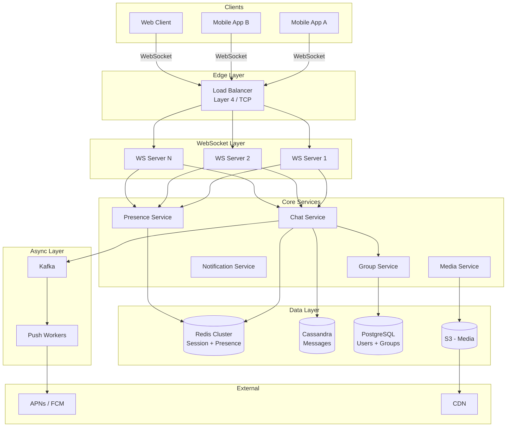
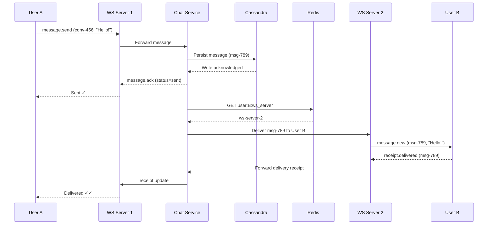
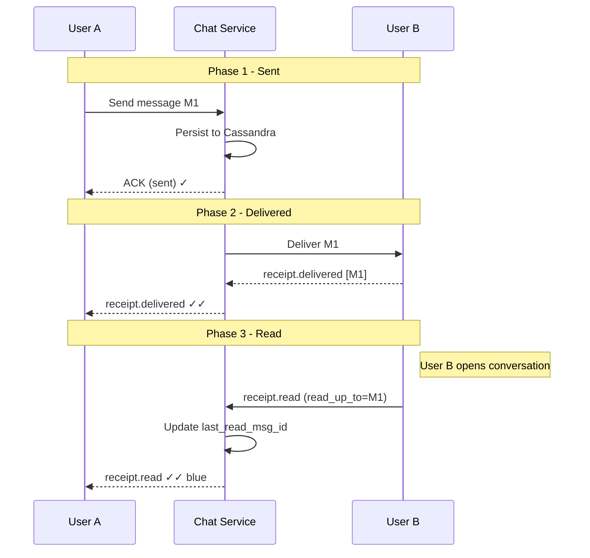
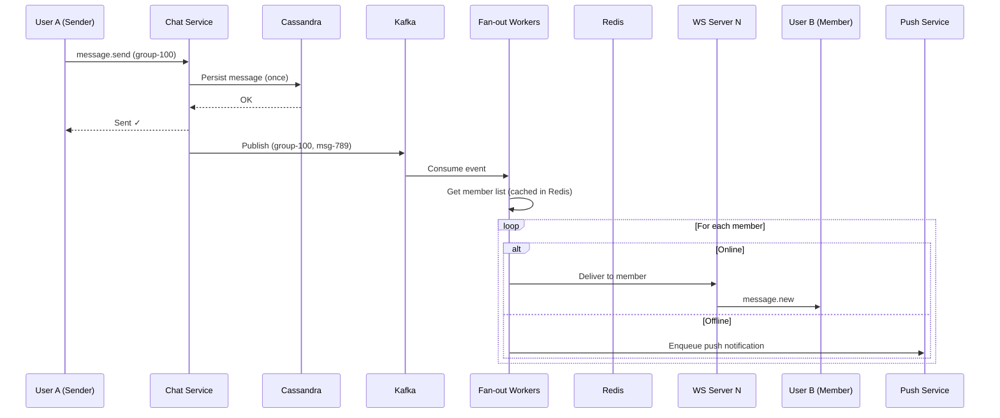
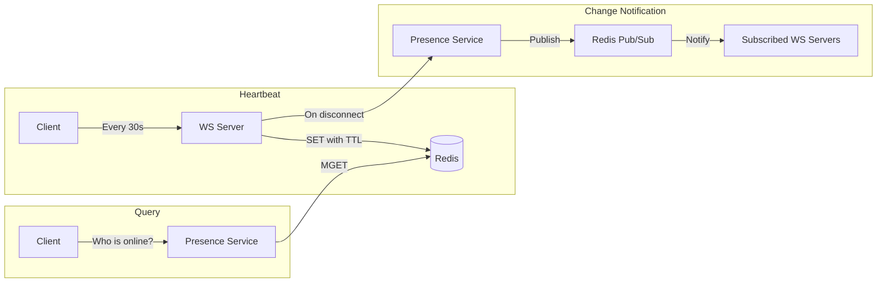
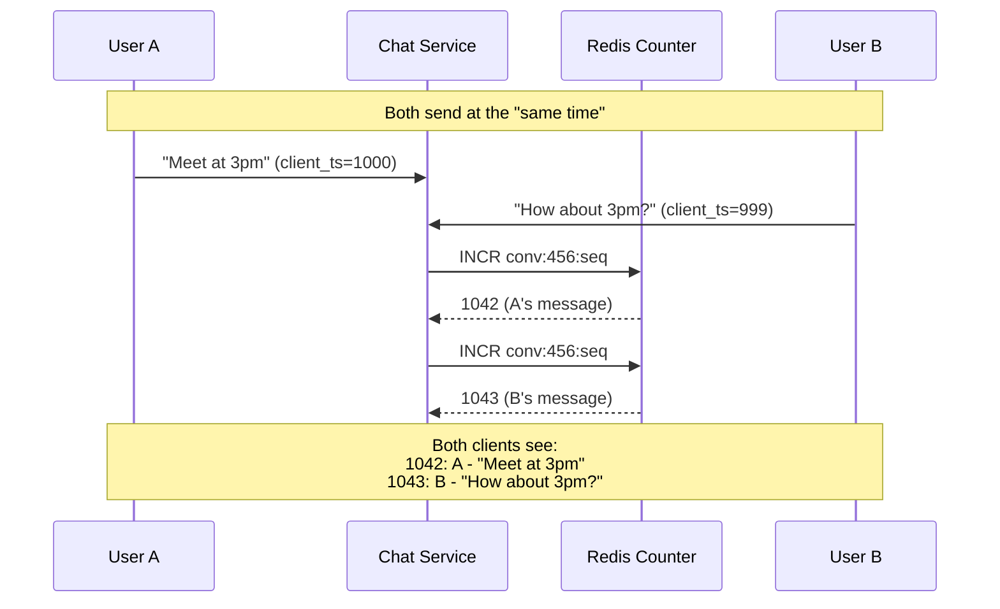
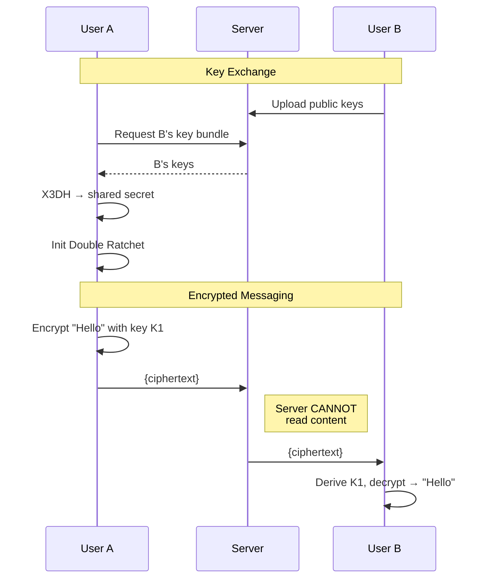
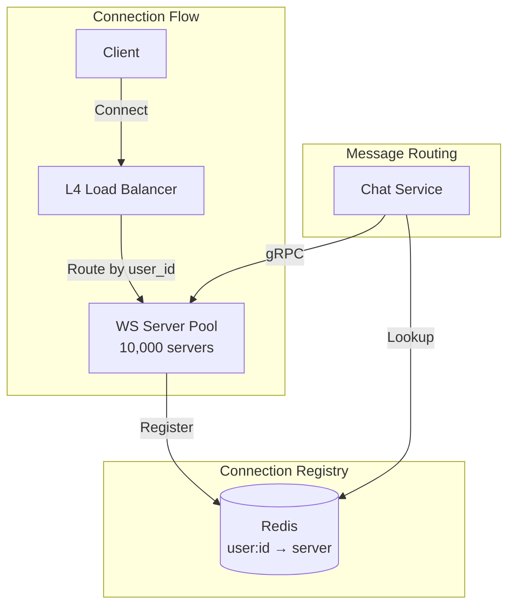
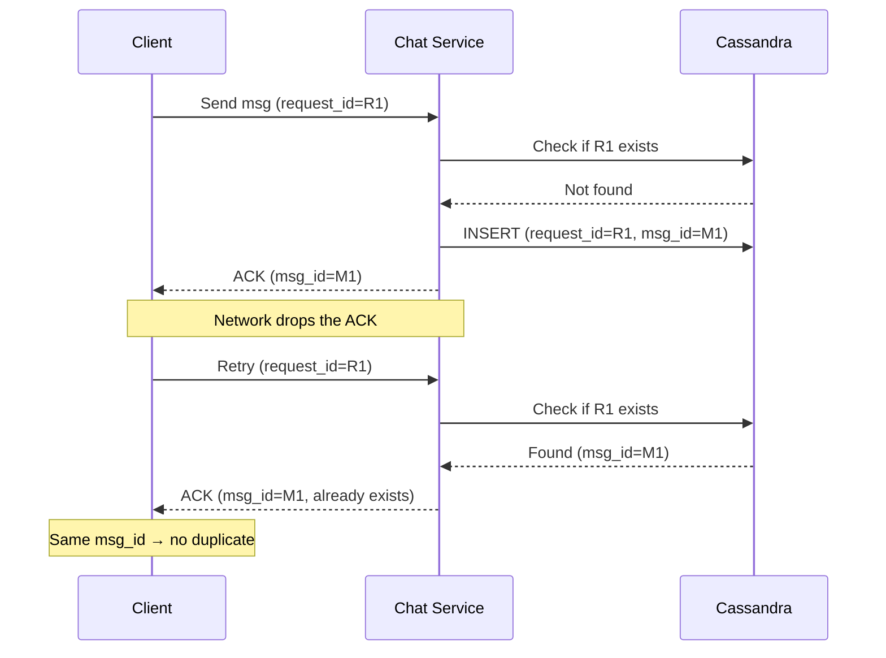

# Design a Chat Messenger (WhatsApp / Facebook Messenger)

> A real-time messaging system supporting 1-on-1 chat, group conversations,
> delivery receipts, presence indicators, and media sharing at massive scale.

---

## 1. Problem Statement & Requirements

Design a chat messaging platform similar to WhatsApp or Facebook Messenger that
allows users to send and receive messages in real time, participate in group
conversations, share media, and see delivery/read receipts and online status.

### 1.1 Functional Requirements

- **FR-1: 1-on-1 Chat** -- Real-time text messaging between two users.
- **FR-2: Group Chat** -- Groups with up to 500 members.
- **FR-3: Message Receipts** -- Sent (server received), Delivered (recipient
  device received), Read (recipient opened the conversation).
- **FR-4: Online/Offline Status** -- See if contacts are online + last seen.
- **FR-5: Media Sharing** -- Images, videos, files (up to 100 MB).
- **FR-6: Message History** -- Persistent, scrollable, available across devices.
- **FR-7: Push Notifications** -- Offline users receive push notifications.

> **Scope for deep dive:** Real-time 1-on-1 messaging (FR-1), group messaging
> (FR-2), message receipts (FR-3), and online status (FR-4).

### 1.2 Non-Functional Requirements

- **Latency:** Message delivery p99 < 100 ms when both users are online.
- **Availability:** 99.99% uptime.
- **Message Ordering:** Causal consistency within a conversation.
- **Durability:** Zero data loss for acknowledged messages.
- **Security:** End-to-end encryption (server cannot read message content).
- **Scale:** 500 million daily active users.

### 1.3 Out of Scope

- Voice/video calls, stories/status updates, payments, bot APIs.

### 1.4 Assumptions & Estimations

```
Users & Activity
-----------------
Total registered users    = 2 B
Daily active users (DAU)  = 500 M
Messages per user per day = 40
Total messages per day    = 500 M * 40 = 20 B messages/day

QPS
----
Messages per second       = 20 B / 86,400 ~ 231 K msg/sec
Peak (3x average)         = ~700 K msg/sec

Storage
--------
Average message size      = 200 bytes (text + metadata)
Daily new message storage = 20 B * 200 B = 4 TB/day
Yearly storage            = 4 TB * 365 ~ 1.5 PB/year

Media (10% of messages, avg 500 KB):
Daily media               = 2 B * 500 KB = 1 PB/day

Connections
------------
Concurrent WebSocket connections ~ 500 M (peak)
Each WS server handles 50K connections → 10,000 servers needed
```

> **Key insight:** This is write-heavy and real-time. The primary challenge is
> maintaining millions of persistent connections and delivering with minimal latency.

---

## 2. API Design

Two communication channels: **WebSocket** for real-time bidirectional communication,
**REST** for non-real-time operations.

### 2.1 WebSocket Protocol

```
// Client → Server: Send a message
{
  "type": "message.send",
  "request_id": "uuid-123",
  "conversation_id": "conv-456",
  "content": { "type": "text", "body": "Hello!" },
  "client_timestamp": 1709100000000
}

// Server → Client: Sent acknowledgment
{
  "type": "message.ack",
  "request_id": "uuid-123",
  "message_id": "msg-789",
  "server_timestamp": 1709100000050,
  "status": "sent"
}

// Server → Client: Deliver message to recipient
{
  "type": "message.new",
  "message_id": "msg-789",
  "conversation_id": "conv-456",
  "sender_id": "user-A",
  "content": { "type": "text", "body": "Hello!" },
  "server_timestamp": 1709100000050,
  "sequence_number": 1042
}

// Client → Server: Delivery receipt
{ "type": "receipt.delivered", "message_ids": ["msg-789"], "conversation_id": "conv-456" }

// Client → Server: Read receipt
{ "type": "receipt.read", "conversation_id": "conv-456", "read_up_to": "msg-789" }

// Server → Client: Presence update
{ "type": "presence.update", "user_id": "user-B", "status": "online", "last_seen": 1709100000000 }

// Client → Server: Typing indicator
{ "type": "typing.start", "conversation_id": "conv-456" }
```

### 2.2 REST API Endpoints

```
POST   /api/v1/auth/login
  Request:  { "phone_number": "+1...", "otp": "123456" }
  Response: 200 { "token": "jwt...", "user_id": "user-A" }

GET    /api/v1/conversations?cursor={cursor}&limit=20
  Response: 200 { "conversations": [...], "next_cursor": "..." }

GET    /api/v1/conversations/{conv_id}/messages?cursor={cursor}&limit=50
  Response: 200 { "messages": [...], "next_cursor": "..." }

POST   /api/v1/groups
  Request:  { "name": "Family", "member_ids": ["user-B", "user-C"] }
  Response: 201 { "conversation_id": "conv-789" }

PUT    /api/v1/groups/{conv_id}/members
  Request:  { "add": ["user-D"], "remove": ["user-E"] }
  Response: 200 OK

POST   /api/v1/media/upload
  Request:  multipart/form-data (file + conversation_id)
  Response: 201 { "media_id": "media-123", "url": "https://cdn.../..." }
```

> **Note:** Cursor-based pagination (not offset) because offset breaks when
> new messages arrive and performs poorly at scale.

---

## 3. Data Model

### 3.1 Schema

**Users** (PostgreSQL -- relational, low volume)

| Column              | Type         | Notes                           |
| ------------------- | ------------ | ------------------------------- |
| `id`                | UUID / PK    | Globally unique                 |
| `phone_number`      | VARCHAR(20)  | Unique, indexed                 |
| `display_name`      | VARCHAR(100) |                                 |
| `profile_image_url` | TEXT         | CDN URL                         |
| `public_key`        | BLOB         | E2E encryption public key       |
| `created_at`        | TIMESTAMP    |                                 |

**Conversations** (PostgreSQL)

| Column       | Type         | Notes                           |
| ------------ | ------------ | ------------------------------- |
| `id`         | UUID / PK    |                                 |
| `type`       | ENUM         | `one_on_one`, `group`           |
| `name`       | VARCHAR(255) | NULL for 1-on-1                 |
| `creator_id` | UUID / FK    |                                 |
| `created_at` | TIMESTAMP    |                                 |
| `updated_at` | TIMESTAMP    | Updated on each new message     |

**Conversation Members** (PostgreSQL)

| Column             | Type      | Notes                            |
| ------------------ | --------- | -------------------------------- |
| `conversation_id`  | UUID / FK | Composite PK                     |
| `user_id`          | UUID / FK | Composite PK                     |
| `role`             | ENUM      | `admin`, `member`                |
| `joined_at`        | TIMESTAMP |                                  |
| `last_read_msg_id` | UUID      | For read receipts / unread count |

**Messages** (Cassandra -- write-heavy, time-series)

| Column             | Type      | Notes                                        |
| ------------------ | --------- | -------------------------------------------- |
| `conversation_id`  | UUID      | Partition key                                |
| `message_id`       | TIMEUUID  | Clustering key (sorts by time)               |
| `sender_id`        | UUID      |                                              |
| `content_type`     | ENUM      | `text`, `image`, `video`, `file`             |
| `content`          | BLOB      | Encrypted message body                       |
| `media_url`        | TEXT      | NULL for text messages                       |
| `sequence_number`  | BIGINT    | Per-conversation monotonic counter           |
| `server_timestamp` | TIMESTAMP |                                              |

**Message Status** (Cassandra)

| Column         | Type      | Notes                             |
| -------------- | --------- | --------------------------------- |
| `message_id`   | UUID      | Partition key                     |
| `recipient_id` | UUID      | Clustering key                    |
| `status`       | ENUM      | `sent`, `delivered`, `read`       |
| `timestamp`    | TIMESTAMP |                                   |

### 3.2 ER Diagram

```mermaid
erDiagram
    USER ||--o{ CONVERSATION_MEMBER : joins
    CONVERSATION ||--o{ CONVERSATION_MEMBER : has
    CONVERSATION ||--o{ MESSAGE : contains
    USER ||--o{ MESSAGE : sends
    MESSAGE ||--o{ MESSAGE_STATUS : tracks

    USER {
        uuid id PK
        string phone_number UK
        string display_name
        blob public_key
    }

    CONVERSATION {
        uuid id PK
        enum type
        string name
        uuid creator_id FK
    }

    CONVERSATION_MEMBER {
        uuid conversation_id PK_FK
        uuid user_id PK_FK
        enum role
        uuid last_read_msg_id
    }

    MESSAGE {
        uuid conversation_id PK
        timeuuid message_id CK
        uuid sender_id FK
        enum content_type
        blob content
        bigint sequence_number
    }

    MESSAGE_STATUS {
        uuid message_id PK
        uuid recipient_id CK
        enum status
    }
```

### 3.3 Database Choice Justification

| Requirement            | Choice     | Reason                                                              |
| ---------------------- | ---------- | ------------------------------------------------------------------- |
| User & group metadata  | PostgreSQL | Relational, ACID, low volume, needs joins                           |
| Messages               | Cassandra  | Write-optimized LSM-tree, partitions by conversation_id, time-series clustering, linear horizontal scaling |
| User-to-server mapping | Redis      | In-memory K-V, sub-ms lookups for routing                           |
| Presence/online status | Redis      | TTL-based keys, pub/sub for broadcasts                              |
| Media files            | S3 / GCS   | Object storage, CDN-friendly, petabyte scale                        |

> **Why Cassandra?** Chat messages partition by `conversation_id` and cluster by
> `message_id` (TIMEUUID). All messages in a conversation are colocated. "Last N
> messages" = single sequential disk read. LSM-tree handles 700K+ writes/sec.

---

## 4. High-Level Architecture

### 4.1 Architecture Diagram



### 4.2 Component Walkthrough

| Component          | Responsibility                                                           |
| ------------------ | ------------------------------------------------------------------------ |
| **Load Balancer**  | L4 TCP LB for WebSocket. Routes by user ID hash. Health checks.          |
| **WS Servers**     | Hold persistent connections (50-100K each). Register user→server in Redis. |
| **Chat Service**   | Validates, persists, routes messages. Looks up recipient's WS server.    |
| **Group Service**  | Group metadata, membership. Provides member lists for fan-out.           |
| **Presence**       | Heartbeat-based online/offline tracking via Redis TTL keys.              |
| **Notification**   | Push notifications for offline users. Enqueues to Kafka.                 |
| **Media Service**  | Upload, compression, thumbnail generation. Stores in S3.                 |
| **Redis**          | User→server mapping, presence keys, sequence counters.                   |
| **Cassandra**      | Message persistence. Partitioned by conversation_id.                     |
| **Kafka**          | Async fan-out for groups, push notifications, analytics.                 |

---

## 5. Deep Dive: Core Flows

### 5.1 Real-time 1-on-1 Messaging



**Key design decisions:**

1. **Persist before ACK.** Server writes to Cassandra before sending the `sent`
   ACK. If the client sees "sent," the message is durable.

2. **User-to-server mapping in Redis.** Each WS server registers its users:
   `user:{id}:ws_server → ws-server-2`. Chat Service does a single Redis GET
   to find the right server, then makes an internal gRPC call.

3. **User B is offline?** Redis returns no mapping. Message is already in
   Cassandra. Enqueue push notification via Kafka. When B reconnects, client
   pulls missed messages via REST (using `sequence_number > last_seen`).

### 5.2 Message Delivery & Receipts

Three receipt states, each building on the previous:

```
┌──────┐        ┌───────────┐        ┌──────┐
│ Sent │───────>│ Delivered │───────>│ Read │
│  ✓   │        │    ✓✓     │        │ ✓✓   │
└──────┘        └───────────┘        └──────┘
Server saved    Device received      User opened conv
```



**Optimizations:**
- **Batch delivery receipts.** Reconnecting device sends one receipt for all
  missed messages, not individual receipts.
- **"Read up to" semantics.** Client reports "read up to message X" -- all
  messages with sequence_number <= X are read. One update, not N.
- **Lightweight storage.** Store only `last_read_msg_id` per user per
  conversation. No per-message read status for 1-on-1 (it is implied).

### 5.3 Group Chat Message Flow

**Small groups (< 50): Direct fan-out** -- Chat Service delivers to each member.
**Large groups (50-500): Async fan-out via Kafka** -- prevents blocking the sender.



**Key decisions:**
1. **Store once, fan-out on delivery.** Message written ONCE to Cassandra
   (partitioned by `conversation_id`). Not per-member. 500-member group = 500x
   storage savings.
2. **Kafka partitioned by conversation_id.** All messages for a group go to the
   same partition, preserving order within the group.
3. **Member list cached in Redis** (TTL 5 min) to avoid PostgreSQL on every message.

### 5.4 Online/Offline Status (Presence)

**Heartbeat mechanism:**
```
Client sends heartbeat every 30s:
  → SET user:{id}:presence = "online" EX 60  (Redis, TTL 60s)

If client disconnects or crashes:
  → Redis key expires after 60s → user is offline
```



**Scaling optimizations (presence is expensive at 500M users):**
1. **Lazy queries.** Only push presence updates to users currently viewing a
   conversation with the status-changed user.
2. **Batch fetches.** On app open, single MGET for all visible contacts.
3. **Fan-out limit.** Real-time presence for top 50 recent conversations only.
4. **Debounce flapping.** 10-second delay before broadcasting "offline" to
   avoid flicker from unstable connections.

### 5.5 Message Ordering

**Approach: Per-conversation sequence numbers in Redis.**

```
INCR conv:456:seq → 1042
Every message gets the next sequence number.
Clients display sorted by sequence_number.
```

**Why not timestamps?** Client clocks have skew. Server clocks across machines
differ. Sequence numbers provide a total ordering all participants agree on.



**Multi-device:** All devices sync based on sequence_number. On reconnect,
request messages with `sequence_number > last_seen_sequence`.

### 5.6 End-to-End Encryption

**Signal Protocol overview (used by WhatsApp):**

```
1. Each user generates identity key pair (long-term) + signed pre-key.
2. Users upload one-time pre-keys to server.
3. First message: sender fetches recipient's key bundle.
4. X3DH (Extended Triple Diffie-Hellman) → shared secret.
5. Double Ratchet: each message uses a new key derived from the ratchet.
   → Forward secrecy: compromising one key doesn't reveal past messages.
```



**Impact on system design:**
1. Server stores ciphertext only -- `content` field is an encrypted blob.
2. No server-side search (must be client-side on local DB).
3. Group E2E: sender encrypts separately for each member (limits group size).
4. Key verification via QR codes prevents MITM attacks.

---

## 6. Scaling & Performance

### 6.1 Database Scaling

**Cassandra (Messages):**
- Automatic sharding via consistent hashing.
- Replication factor 3 (each message on 3 nodes).
- 700K writes/sec peak: ~50-70 nodes (each handles 10-15K writes/sec).
- Compaction: Time-Window Compaction (TWCS) for time-series data.

**PostgreSQL (Users, Groups):**
- 1 primary + 3 read replicas.
- Shard by user_id if single primary becomes bottleneck.
- Cache hot group membership in Redis (TTL 5 min).

### 6.2 WebSocket Server Scaling



**Failure handling:** WS server crashes → connections drop → clients reconnect
with exponential backoff → new server registers in Redis → client pulls missed
messages via REST using last known sequence number.

### 6.3 Kafka Partitioning

```
Topic: group-message-fanout (1000 partitions, key=conversation_id)
  → In-order per group, parallel across groups

Topic: push-notifications (500 partitions, key=recipient_user_id)
  → Even distribution, prevents duplicate pushes

Topic: message-analytics (200 partitions)
  → Async metrics, monitoring, abuse detection
```

### 6.4 Caching Strategy

| Cache Key                    | Value               | TTL    | Purpose                   |
| ---------------------------- | ------------------- | ------ | ------------------------- |
| `user:{id}:ws_server`       | Server hostname     | 5 min  | Message routing           |
| `user:{id}:presence`        | "online"            | 60 sec | Auto-expires = offline    |
| `conv:{id}:seq`             | Sequence counter    | None   | Message ordering          |
| `group:{id}:members`        | Member ID list      | 5 min  | Avoid PG lookups          |
| `conv:{id}:recent_messages` | Last 50 messages    | 1 min  | Hot conversation cache    |

---

## 7. Reliability & Fault Tolerance

### 7.1 Message Delivery Guarantees

**At-least-once delivery with idempotency:**



### 7.2 Offline Message Recovery

When a user reconnects:
1. Client sends last known `sequence_number` for each conversation.
2. Server queries Cassandra: `WHERE conversation_id = X AND sequence_number > N`.
3. Streams missed messages to client. Client ACKs.
4. No separate offline queue needed -- Cassandra IS the queue.

### 7.3 SPOFs & Mitigation

| Component      | SPOF? | Mitigation                                                       |
| -------------- | ----- | ---------------------------------------------------------------- |
| Load Balancer  | Yes   | Active-passive pair, DNS failover. Cloud LBs are multi-AZ.      |
| WS Servers     | No    | Stateless pool. Reconnect to any server. Catch-up on reconnect.  |
| Chat Service   | No    | Stateless, horizontally scaled.                                  |
| Redis Cluster  | No    | 3 masters + 3 replicas. Auto-failover. Presence data is ephemeral. |
| Cassandra      | No    | RF=3, tolerates 1 node failure per partition. Multi-DC.          |
| PostgreSQL     | Yes   | Sync standby (RPO=0). Auto-failover via Patroni. RTO < 30s.     |
| Kafka          | No    | 3-broker ISR. Tolerates 1 broker failure.                        |

### 7.4 Graceful Degradation

| Failure                   | Impact                                                     |
| ------------------------- | ---------------------------------------------------------- |
| Redis partially down      | Routing slower (fallback broadcast). Stale presence.       |
| Cassandra node down       | Reads/writes still succeed at QUORUM. Higher latency.      |
| Kafka down                | Group messages delay. Push queues up. 1-on-1 unaffected.   |
| Push service down         | Offline users miss notifications. Messages safe in DB.     |
| Data center failure       | Failover to secondary DC. Brief message delay.             |

---

## 8. Trade-offs & Alternatives

| Decision | Chosen | Alternative | Why Chosen |
| -------- | ------ | ----------- | ---------- |
| **Protocol** | WebSocket | Long polling / SSE | True bidirectional, lowest latency. SSE is unidirectional. |
| **Message store** | Cassandra | PostgreSQL / DynamoDB | Write-optimized LSM-tree, time-series partitioning. PG can't handle 700K writes/sec. |
| **Group fan-out** | Write once, fan-out on delivery | Per-member inbox | 500x storage savings. Trade-off: delivery fan-out is more complex. |
| **Presence model** | Heartbeat + TTL | WS connection status | More reliable across server crashes. Connection-based shows "online" when app backgrounded. |
| **Message ordering** | Sequence numbers | Timestamps / vector clocks | Simple total ordering. Timestamps have clock skew. Vector clocks unnecessary with server routing. |
| **Encryption** | E2E (Signal Protocol) | TLS only | Table stakes for messaging. Trade-off: no server-side search, complex group keys. |
| **Offline delivery** | Pull on reconnect | Separate offline queue | Cassandra already stores messages. Separate queue adds complexity. |
| **Media handling** | Upload then send URL | Inline in message | Keeps messages small, enables CDN delivery. Trade-off: two-step send. |

---

## 9. Interview Tips

### Structuring Your 45 Minutes

```
0-5 min:   Clarify requirements. Ask about DAU, features, consistency.
5-8 min:   Back-of-envelope. Messages/sec, storage, WS server count.
8-13 min:  API design. Show BOTH WebSocket frames AND REST endpoints.
13-18 min: Data model + ER diagram. Justify Cassandra.
18-23 min: High-level architecture diagram. Walk through each component.
23-38 min: Deep dive 2-3 flows: 1-on-1 delivery, group fan-out,
           pick one of receipts/presence/E2E.
38-43 min: Scaling and reliability. Sharding, WS scaling, failures.
43-45 min: Trade-offs summary.
```

### Common Follow-ups & Answers

**"What if a WebSocket server crashes?"**
> Connections drop. Clients reconnect (exponential backoff) to any server. New
> server registers in Redis. Client catches up missed messages using last known
> sequence number. No messages lost (persisted in Cassandra before ACK).

**"500-person group with celebrity sender?"**
> Fan-out through Kafka, parallelized across workers. Message stored once.
> Prioritize active groups for faster delivery.

**"10x traffic spike?"**
> WS servers auto-scale on connection count. Cassandra absorbs write spikes
> (memtable → async flush). Kafka buffers group fan-out bursts. Redis is the
> bottleneck for sequence numbers → use Cluster sharding or pre-allocate ranges.

**"Message search with E2E encryption?"**
> Server-side search impossible. Client-side search on local message DB. If E2E
> is relaxed, index in Elasticsearch partitioned by conversation_id.

### Pitfalls to Avoid

- **Forgetting offline users.** Always address: what happens when recipient
  is offline? (Persist + push notification + catch-up on reconnect.)
- **Ignoring connection management.** 500M WebSocket connections is the hardest
  part. Skipping this misses the core challenge.
- **Using HTTP polling.** Red flag for interviewers. WebSocket is the right tool.
- **SQL for messages.** At 700K writes/sec, traditional RDBMS struggles. Justify
  with numbers.
- **Over-explaining E2E.** State Signal Protocol, explain implications (no
  server search, ciphertext only), move on.

---

> **Checklist:**
>
> - [x] Requirements: 1-on-1, groups, receipts, presence, media
> - [x] Estimations: 231K msg/sec, 4 TB/day, 10K WS servers
> - [x] Dual API: WebSocket frames + REST endpoints
> - [x] Data model with Cassandra justified by write pattern
> - [x] Architecture diagram with all components
> - [x] Deep dives: 1-on-1, receipts, groups, presence, ordering, E2E
> - [x] Scaling: Cassandra sharding, WS mapping, Kafka partitioning
> - [x] Reliability: idempotent delivery, offline catch-up, SPOFs
> - [x] Trade-offs with reasoning
