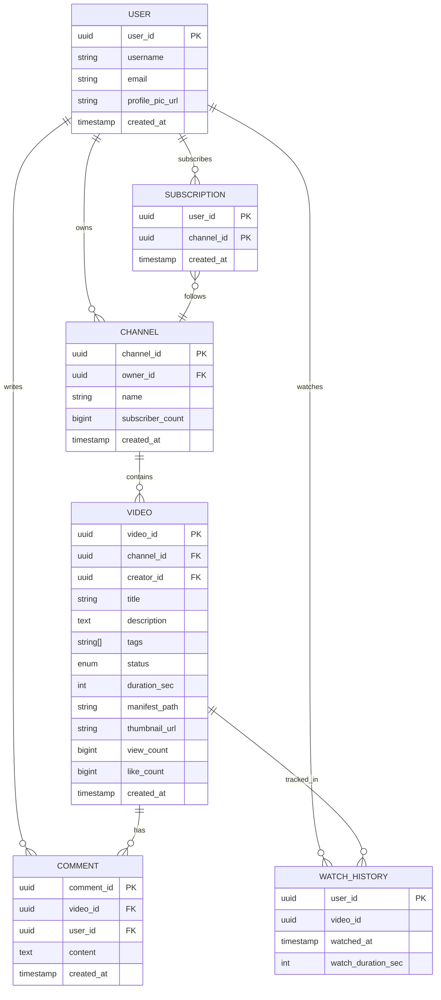
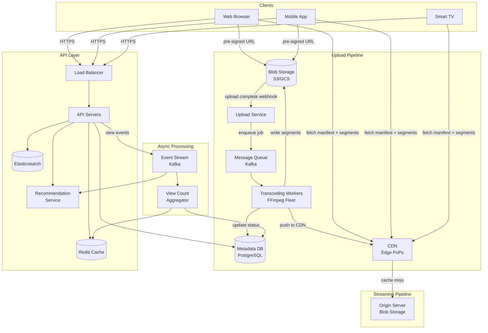
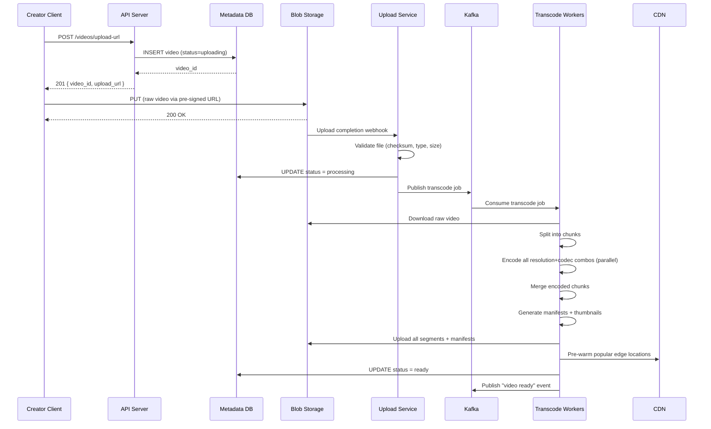
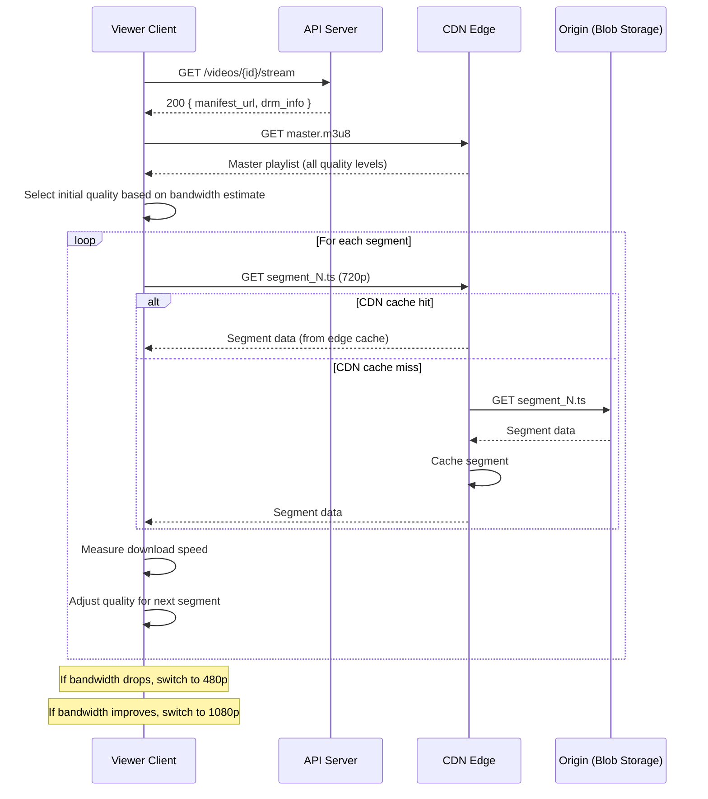
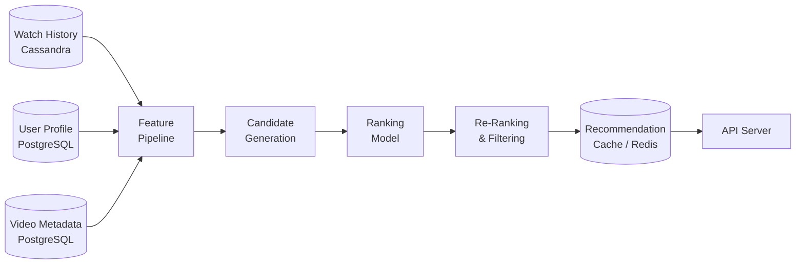

# Design a Video Streaming Platform (YouTube / Netflix)

> Design a system that allows users to upload, transcode, store, and stream video
> content at scale. The platform must support adaptive bitrate streaming, serve a
> global audience of over one billion daily active users, and deliver smooth playback
> across every device and network condition.

---

## 1. Problem Statement & Requirements

Users need a platform where creators can upload videos and viewers can discover
and stream them with minimal buffering, regardless of device or location. The core
engineering challenge is the **upload-to-playback pipeline** (transcoding at scale)
and **global low-latency delivery** (CDN architecture).

### 1.1 Functional Requirements

- **FR-1:** Upload videos -- creators upload raw video files up to several GBs.
- **FR-2:** Stream videos -- viewers watch with adaptive bitrate (ABR) streaming.
- **FR-3:** Search videos -- full-text search by title, description, tags.
- **FR-4:** Recommendations -- personalised feed based on watch history.
- **FR-5:** Interact -- comments, likes/dislikes on videos.
- **FR-6:** Subscribe -- follow channels and receive new-upload notifications.

> **Priority for deep dive:** FR-1 (upload + transcoding pipeline) and FR-2
> (streaming + CDN architecture) since they are the distinguishing features of a
> video platform.

### 1.2 Non-Functional Requirements

| Attribute          | Target                                                      |
| ------------------ | ----------------------------------------------------------- |
| **DAU**            | 1 billion                                                   |
| **Availability**   | 99.99% for streaming, 99.9% for uploads                     |
| **Playback start** | < 2 seconds (p95) on broadband, < 5 seconds on mobile       |
| **Buffering ratio**| < 1% of total watch time                                    |
| **Global latency** | Edge PoPs in every major geography                          |
| **Resolutions**    | 360p, 480p, 720p, 1080p, 4K                                 |
| **Device support** | Web, iOS, Android, Smart TVs, gaming consoles               |
| **Consistency**    | Eventual for view counts and likes; strong for uploads       |
| **Durability**     | Zero data loss for uploaded content                          |

### 1.3 Out of Scope

- Live streaming / real-time broadcasts
- Ad serving and monetisation engine
- Payment / subscription billing
- Creator analytics dashboard
- Content moderation ML pipeline (mentioned briefly, not designed)

### 1.4 Assumptions & Estimations (Back-of-Envelope Math)

```
DAU                     = 1 B
Average watch time      = 1 hour / day per user
Average video length    = 5 minutes
Videos watched / user   = 12 videos / day

--- Streaming bandwidth ---
Streams / day           = 1 B * 12           = 12 B streams / day
Streams / second        = 12 B / 86 400      ~ 139 K concurrent streams
Average bitrate         = 5 Mbps (mix of resolutions)
Peak bandwidth          = 139 K * 5 Mbps     = 695 Tbps (served from CDN)
  (with 3x peak factor ~ 2 Pbps peak)

--- Upload volume ---
New uploads / day       = 5 M
Average raw file size   = 300 MB
Daily upload ingress    = 5 M * 300 MB       = 1.5 PB / day
Upload RPS              = 5 M / 86 400       ~ 58 uploads / sec

--- Transcoding ---
Output per video        ~ 5 resolutions * 2 codecs = 10 renditions
Average output size     ~ 150 MB per rendition (compressed)
Daily transcoded output = 5 M * 10 * 150 MB  = 7.5 PB / day

--- Storage (5-year horizon) ---
Transcoded storage / yr = 7.5 PB * 365       ~ 2.7 EB / year
5-year transcoded       ~ 13.7 EB
Raw originals / yr      = 1.5 PB * 365       ~ 547 PB / year
Total 5-year            ~ 16+ EB (exabytes)

--- Metadata ---
Video metadata record   ~ 2 KB
Total videos (5 yr)     = 5 M * 365 * 5      = 9.1 B records
Metadata storage        = 9.1 B * 2 KB       ~ 18 TB
```

> **Key takeaway:** The dominant costs are **storage** (exabyte-scale) and
> **CDN bandwidth** (petabit-scale). Metadata is comparatively tiny. This drives
> every architecture decision below.

---

## 2. API Design

All endpoints are versioned under `/api/v1/`. Authentication via Bearer token
(OAuth 2.0). Rate limiting headers included in every response.

### 2.1 Video Upload

```
POST /api/v1/videos/upload-url
  Headers:  Authorization: Bearer <token>
  Request:  {
              "title": "My Video",
              "description": "...",
              "tags": ["tech", "tutorial"],
              "filename": "video.mp4",
              "file_size_bytes": 314572800,
              "content_type": "video/mp4"
            }
  Response: 201 {
              "video_id": "v_abc123",
              "upload_url": "https://storage.example.com/upload/presigned?token=...",
              "upload_expires_at": "2026-02-28T13:00:00Z"
            }
```

The client uploads the raw file directly to blob storage using the pre-signed URL
(bypassing our API servers entirely). Once the upload completes, blob storage fires
a completion webhook.

### 2.2 Video Streaming

```
GET /api/v1/videos/{video_id}/stream
  Query:    ?format=hls|dash
  Headers:  Authorization: Bearer <token>
  Response: 200 {
              "manifest_url": "https://cdn.example.com/v_abc123/master.m3u8",
              "available_qualities": ["360p","480p","720p","1080p","4K"],
              "subtitles": [
                { "lang": "en", "url": "https://cdn.example.com/v_abc123/subs_en.vtt" }
              ],
              "drm": {
                "type": "Widevine",
                "license_url": "https://drm.example.com/license"
              }
            }
```

The client fetches the manifest and then requests individual video segments
directly from the CDN. The API server is not in the streaming hot path.

### 2.3 Search

```
GET /api/v1/search?q=system+design&cursor=abc&limit=20
  Response: 200 {
              "results": [
                {
                  "video_id": "v_abc123",
                  "title": "System Design Interview",
                  "channel": "TechPrep",
                  "thumbnail_url": "https://cdn.example.com/v_abc123/thumb.jpg",
                  "duration_sec": 1200,
                  "view_count": 5400000
                }
              ],
              "next_cursor": "def456"
            }
```

### 2.4 Recommendations

```
GET /api/v1/recommendations?cursor=abc&limit=20
  Response: 200 {
              "videos": [ ... ],   // same shape as search results
              "next_cursor": "ghi789"
            }
```

### 2.5 Comments & Interactions

```
POST /api/v1/videos/{video_id}/comments
  Request:  { "text": "Great video!" }
  Response: 201 { "comment_id": "c_xyz", "created_at": "..." }

POST /api/v1/videos/{video_id}/like
  Response: 200 { "likes": 54321 }

POST /api/v1/channels/{channel_id}/subscribe
  Response: 200 { "subscribed": true }
```

---

## 3. Data Model

### 3.1 Key Tables

**videos** -- `video_id` (UUID PK), `creator_id` (FK), `channel_id` (FK), `title` (VARCHAR),
`description` (TEXT), `tags` (VARCHAR[]), `status` (ENUM: uploading/processing/ready/failed),
`duration_sec` (INT), `manifest_path` (VARCHAR), `thumbnail_url` (VARCHAR),
`view_count` (BIGINT, async), `like_count` (BIGINT, async), `created_at` (TIMESTAMP)

**users** -- `user_id` (UUID PK), `username` (UNIQUE), `email` (UNIQUE),
`profile_pic_url`, `created_at`

**channels** -- `channel_id` (UUID PK), `owner_id` (FK), `name`, `subscriber_count` (BIGINT)

**comments** -- `comment_id` (UUID PK), `video_id` (FK), `user_id` (FK), `text` (TEXT),
`created_at` (TIMESTAMP, indexed)

**subscriptions** -- `user_id` + `channel_id` (composite PK), `created_at`

**watch_history** -- `user_id` + `video_id` + `watched_at` (composite PK),
`watch_duration_sec` (INT)

### 3.2 ER Diagram



### 3.3 Database Choice Justification

| Requirement              | Choice             | Reason                                                    |
| ------------------------ | ------------------ | --------------------------------------------------------- |
| Video metadata           | PostgreSQL         | Structured, relational, ACID for upload status transitions |
| View / like counters     | Redis              | Atomic INCR, sub-ms latency, periodic flush to DB         |
| Full-text search         | Elasticsearch      | Inverted index, relevance scoring, typo tolerance          |
| Video files & segments   | S3 / GCS (blob)    | Exabyte-scale, 11-nines durability, CDN origin             |
| Watch history            | Cassandra          | Time-series writes at massive scale, partition by user_id  |
| Recommendations cache    | Redis              | Fast reads for pre-computed recommendation lists           |
| Transcoding job queue    | Kafka              | Durable, ordered, replay-capable message stream            |

---

## 4. High-Level Architecture

### 4.1 Architecture Diagram



### 4.2 Component Walkthrough

| Component              | Responsibility                                                       |
| ---------------------- | -------------------------------------------------------------------- |
| **Load Balancer**      | L7 routing, TLS termination, rate limiting, health checks            |
| **API Servers**        | Stateless request handling -- metadata CRUD, auth, pre-signed URLs   |
| **Upload Service**     | Handles upload completion callbacks, validates files, enqueues jobs   |
| **Message Queue**      | Kafka -- durable, ordered delivery of transcoding and event jobs     |
| **Transcoding Workers**| FFmpeg-based fleet -- encode video into multiple resolutions + codecs |
| **Blob Storage**       | S3/GCS -- stores raw uploads, transcoded segments, manifests         |
| **Metadata DB**        | PostgreSQL -- video metadata, user profiles, channels, comments      |
| **Redis Cache**        | Hot-path caching -- video metadata, view counts, session data        |
| **Elasticsearch**      | Full-text search index for video titles, descriptions, tags          |
| **CDN (Edge PoPs)**    | Serves video segments from edge locations closest to the viewer      |
| **Origin Server**      | Blob storage acts as CDN origin for cache misses                     |
| **Event Stream**       | Kafka topics for view events, like events, watch history             |
| **View Count Agg.**    | Consumes view events, batches updates to Redis and DB                |
| **Recommendation Svc.**| Generates personalised feeds from watch history + collaborative data |

> **Key insight:** The streaming hot path never touches API servers. It flows:
> Client -> CDN -> Origin. API servers only handle metadata and control-plane requests.

---

## 5. Deep Dive: Core Flows

### 5.1 Video Upload & Processing Pipeline

This is the most complex subsystem. When a creator uploads a video, it goes through
a multi-stage DAG-based pipeline before it becomes available for streaming.

#### Step-by-step flow

1. **Request upload URL** -- Creator calls `POST /api/v1/videos/upload-url`. API server
   creates a record (`status = uploading`) and returns a pre-signed URL.
2. **Direct upload** -- Client uploads raw file directly to blob storage (bypasses API).
3. **Completion webhook** -- Blob storage notifies the Upload Service.
4. **Validation** -- Check file integrity (checksum), type, and size.
5. **Enqueue transcoding** -- Publish to Kafka. Status transitions to `processing`.
6. **DAG-based transcoding** -- Workers execute a directed acyclic graph of tasks.
7. **Completion** -- Manifests generated, segments pushed to CDN, `status = ready`.

#### DAG-Based Processing Pipeline

Each video goes through a **DAG** (Directed Acyclic Graph) of processing tasks. This
allows parallelism and clear dependency management.

```
                    +------------+
                    |  Raw Video |
                    +-----+------+
                          |
                    +-----v------+
                    |   Split    |  (split into N-second chunks)
                    +-----+------+
                          |
           +--------------+--------------+
           |              |              |
     +-----v-----+  +----v-----+  +-----v-----+
     | Encode     |  | Encode   |  | Encode    |  ... (per resolution * codec)
     | 360p H.264 |  | 720p VP9 |  | 1080p AV1 |
     +-----+------+  +----+-----+  +-----+-----+
           |              |              |
           +--------------+--------------+
                          |
                    +-----v------+
                    |   Merge    |  (concatenate encoded chunks)
                    +-----+------+
                          |
              +-----------+-----------+
              |           |           |
        +-----v---+ +----v----+ +----v----+
        | Generate | | Generate| | Generate|
        | Manifest | | Thumbs  | | Preview |
        +----------+ +---------+ +---------+
```

**Processing tasks in detail:**

| Stage              | Description                                                    |
| ------------------ | -------------------------------------------------------------- |
| **Split**          | Divide raw video into 4-10 second chunks for parallel encoding |
| **Encode**         | Transcode each chunk into target resolution + codec combo      |
| **Merge**          | Reassemble encoded chunks into a continuous stream per variant |
| **Generate Manifest** | Create HLS `.m3u8` and/or DASH `.mpd` master + variant playlists |
| **Generate Thumbnails** | Extract frames at regular intervals for preview and poster |
| **Generate Preview**   | Create a short animated preview (like YouTube hover preview) |

#### Transcoding Matrix

| Resolution | H.264 (AVC) | H.265 (HEVC) | VP9    | AV1    |
| ---------- | ------------ | ------------- | ------ | ------ |
| 360p       | Yes          | --            | --     | --     |
| 480p       | Yes          | --            | Yes    | --     |
| 720p       | Yes          | Yes           | Yes    | --     |
| 1080p      | Yes          | Yes           | Yes    | Yes    |
| 4K         | --           | Yes           | Yes    | Yes    |

> H.264 = universal support. H.265/VP9 = 30-50% better compression. AV1 = best
> compression but high decode cost, so only used at 1080p+ where savings matter most.

#### Upload Pipeline Sequence Diagram



#### Video Deduplication

Before enqueuing transcoding, compute a **perceptual hash** (pHash). If a near-duplicate
exists: same creator = skip re-encoding; different creator = flag for copyright review.

---

### 5.2 Video Streaming (Adaptive Bitrate)

When a viewer clicks play, the player does **not** download the entire video. Instead,
it uses **Adaptive Bitrate Streaming (ABR)** to dynamically select the best quality
for the current network conditions.

#### How ABR Works

1. **Client requests the manifest** -- lists all quality levels and segment URLs.
2. **Client fetches segments** -- small 2-10 second chunks, one at a time.
3. **Quality adaptation** -- after each segment, the player measures throughput and
   decides whether to step up or down in quality.

#### HLS (HTTP Live Streaming) Flow

```
Master Playlist (master.m3u8)
├── 360p  → playlist_360p.m3u8  → seg_001.ts, seg_002.ts, ...
├── 720p  → playlist_720p.m3u8  → seg_001.ts, seg_002.ts, ...
├── 1080p → playlist_1080p.m3u8 → seg_001.ts, seg_002.ts, ...
└── 4K    → playlist_4k.m3u8    → seg_001.ts, seg_002.ts, ...
```

**Example master.m3u8:**

```
#EXTM3U
#EXT-X-STREAM-INF:BANDWIDTH=800000,RESOLUTION=640x360,CODECS="avc1.4d001f"
360p/playlist.m3u8
#EXT-X-STREAM-INF:BANDWIDTH=1400000,RESOLUTION=854x480,CODECS="avc1.4d001f"
480p/playlist.m3u8
#EXT-X-STREAM-INF:BANDWIDTH=2800000,RESOLUTION=1280x720,CODECS="avc1.4d0020"
720p/playlist.m3u8
#EXT-X-STREAM-INF:BANDWIDTH=5000000,RESOLUTION=1920x1080,CODECS="avc1.640028"
1080p/playlist.m3u8
#EXT-X-STREAM-INF:BANDWIDTH=14000000,RESOLUTION=3840x2160,CODECS="hev1.1.6.L150"
4k/playlist.m3u8
```

#### Streaming Sequence Diagram



#### Segment Size Trade-offs

| Segment Duration | Pros                                    | Cons                                   |
| ---------------- | --------------------------------------- | -------------------------------------- |
| 2 seconds        | Faster quality switching, lower latency | More HTTP requests, more manifest size |
| 6 seconds        | Balanced trade-off (industry standard)  | --                                     |
| 10 seconds       | Better compression, fewer requests      | Slower adaptation, longer initial load |

> **Industry practice:** YouTube uses 2-5 second segments. Netflix uses 4-6 second
> segments. The sweet spot is usually around 4-6 seconds.

---

### 5.3 CDN Architecture

With 1B DAU and petabit-scale bandwidth, the CDN is the single most critical
infrastructure component. Our design uses a **multi-tier CDN** architecture.

#### Multi-Tier CDN Design

```mermaid
graph TB
    subgraph Tier 1 -- Edge PoPs
        Edge1[Edge PoP<br/>New York]
        Edge2[Edge PoP<br/>London]
        Edge3[Edge PoP<br/>Tokyo]
        Edge4[Edge PoP<br/>Mumbai]
        EdgeN[Edge PoP<br/>... 200+ locations]
    end

    subgraph Tier 2 -- Regional Shields
        Regional1[Regional Shield<br/>US-East]
        Regional2[Regional Shield<br/>EU-West]
        Regional3[Regional Shield<br/>APAC]
    end

    subgraph Tier 3 -- Origin
        Origin[(Origin<br/>Blob Storage<br/>Multi-Region)]
    end

    Edge1 -->|cache miss| Regional1
    Edge2 -->|cache miss| Regional2
    Edge3 -->|cache miss| Regional3
    Edge4 -->|cache miss| Regional3
    EdgeN -->|cache miss| Regional1

    Regional1 -->|cache miss| Origin
    Regional2 -->|cache miss| Origin
    Regional3 -->|cache miss| Origin
```

#### Tier Responsibilities

| Tier                  | Count       | Cache Size | Hit Rate | Purpose                           |
| --------------------- | ----------- | ---------- | -------- | --------------------------------- |
| **Edge PoPs**         | 200+        | 50-100 TB  | ~90%     | Serve viewers, lowest latency     |
| **Regional Shields**  | 5-10        | 500 TB-1PB | ~95%     | Absorb misses, protect origin     |
| **Origin**            | 3 (regions) | Full store | 100%     | Source of truth, blob storage     |

#### CDN Optimization Strategies

- **Pre-warming:** Push segments of popular creators' new videos to edge PoPs proactively.
- **Popularity-based tiering:** Top 1% of videos (~80% of views) get long TTLs at edge.
- **Request coalescing:** Collapse concurrent cache-miss requests into one origin fetch.
- **DNS-based routing:** Latency-based DNS routes viewers to nearest edge PoP.
- **Multi-CDN:** Use 3-4 providers (Akamai, CloudFront, Fastly) and route by performance.

---

### 5.4 DRM (Digital Rights Management)

For premium/paid content (Netflix model), DRM prevents unauthorized copying.

| DRM System     | Platform           | Protocol     |
| -------------- | ------------------ | ------------ |
| **Widevine**   | Chrome, Android    | DASH (CENC)  |
| **FairPlay**   | Safari, iOS        | HLS          |
| **PlayReady**  | Edge, Xbox, Smart TVs | DASH (CENC) |

**Flow:** Segments are encrypted (AES-128/256) during transcoding. Keys are stored in
a KMS. At playback, the player contacts the license server, which verifies entitlement
(subscription status) before issuing a time-limited decryption key. Decryption happens
in a secure pipeline that prevents screen capture on supported devices.

> **Trade-off:** DRM adds ~200-500ms to playback start (license acquisition). Only
> apply it to premium/paid content.

---

### 5.5 Recommendations

The recommendation system drives engagement and is responsible for a large share of
video views (YouTube reports >70% of watch time comes from recommendations).

#### Architecture Overview



#### Two-Stage Approach

| Stage                     | Method                                         | Output            |
| ------------------------- | ---------------------------------------------- | ----------------- |
| **Candidate Generation**  | Collaborative filtering (user-user, item-item) | ~1000 candidates  |
|                           | Content-based similarity (embeddings)          |                   |
| **Ranking**               | Deep learning model (features: watch %, likes, | Top 50 ranked     |
|                           | freshness, user demographics)                  |                   |
| **Re-ranking / Filtering**| Remove watched, apply diversity rules, filter   | Final 20 for feed |
|                           | policy-violating content                       |                   |

**Key signals:** Watch history, likes/dislikes, search queries, subscriptions, video
metadata (title, tags, category), session context (time of day, device).

> **Interview tip:** You do not need to design the ML model. Mention the two-stage
> approach, key features, and that recommendations are pre-computed and cached.

---

## 6. Scaling & Performance

### 6.1 Database Scaling

**Video Metadata (PostgreSQL):**

- **Read replicas:** Most metadata reads (video info, channel info) go to read replicas.
  With 139K concurrent streams each needing metadata at start, we need ~10-20 replicas.
- **Sharding:** Shard the `videos` table by `video_id` (hash-based). With 9.1B records
  over 5 years, we need ~100 shards at 91M records each.
- **Connection pooling:** PgBouncer in front of every DB instance.

**Watch History (Cassandra):**

- Partition key = `user_id`, clustering key = `watched_at DESC`.
- With 1B DAU * 12 writes/day = 12B writes/day (~139K writes/sec).
- Cassandra cluster of ~50-100 nodes with RF=3 handles this comfortably.

**Counters (Redis):**

- View counts and like counts are incremented in Redis, then flushed to PostgreSQL
  every 30-60 seconds in batches.
- Redis Cluster with 10+ shards for counter operations.

### 6.2 Search Scaling (Elasticsearch)

- Index video titles, descriptions, tags, and channel names.
- ~9.1B documents over 5 years -- partition the ES cluster by time ranges.
- Use a two-phase approach: recent index (hot, last 30 days) + historical index (warm).
- Autocomplete powered by edge n-grams and completion suggesters.

### 6.3 Transcoding Scaling

- 5M videos/day * 10 renditions = 50M encoding jobs/day (~580 jobs/sec).
- Mix of spot instances (baseline) and on-demand (spikes).
- Fleet size: ~2000-5000 auto-scaled transcoding workers.

### 6.4 CDN Bandwidth

- ~695 Tbps average, ~2 Pbps peak. Multi-CDN across 3-4 providers by region.
- 90%+ edge cache hit rate reduces origin bandwidth to ~70 Tbps.

---

## 7. Reliability & Fault Tolerance

### 7.1 Single Points of Failure (SPOFs)

| Component           | SPOF? | Mitigation                                                   |
| ------------------- | ----- | ------------------------------------------------------------ |
| Load Balancer       | Yes   | Active-passive pair, DNS failover (Route 53 health checks)   |
| API Servers         | No    | Stateless, auto-scaling group, min 10 instances per region   |
| Metadata DB         | Yes   | Synchronous standby, automatic failover (Patroni)            |
| Redis Cache         | No    | Redis Cluster (6+ nodes), data survives individual failures  |
| Kafka               | No    | 3-broker ISR, replication factor 3, min.insync.replicas = 2  |
| Blob Storage (S3)   | No    | 11-nines durability, cross-region replication                |
| CDN                 | No    | Multi-CDN with automatic failover per PoP                    |
| Transcoding Workers | No    | Stateless, auto-scaled, Kafka retries failed jobs            |

### 7.2 Transcoding Job Retries

Transcoding is the most failure-prone component (OOM, codec bugs, corrupt files).

- **At-least-once delivery:** Kafka consumers use manual offset commits. If a worker
  crashes mid-encode, the job is redelivered to another worker.
- **Idempotency:** Each job writes output to a unique path based on
  `video_id/rendition_id`. Re-processing the same job overwrites the same path.
- **Dead letter queue (DLQ):** After 3 retries, move the job to a DLQ for manual
  inspection. Notify the creator that processing failed.
- **Checkpointing:** For long encoding jobs, workers checkpoint progress (which chunks
  are done) so retries can resume from the last checkpoint rather than restarting.

### 7.3 CDN Failover

- **Health checks:** Unhealthy PoPs removed from DNS rotation within 30 seconds.
- **Multi-CDN failover:** DNS routes traffic to alternative providers on outage.
- **Stale-while-revalidate:** Edge caches serve stale segments within a grace period
  even if origin is temporarily unavailable.

### 7.4 Graceful Degradation

| Failure Scenario             | Degraded Behavior                                      |
| ---------------------------- | ------------------------------------------------------ |
| Recommendation service down  | Serve trending/popular videos instead of personalised  |
| Search index down            | Show "search temporarily unavailable", browse still works |
| View counter (Redis) down    | Stop counting views, replay events from Kafka on recovery |
| Transcoding backlog          | Videos take longer to become available, queue prioritises popular creators |
| One CDN provider outage      | Traffic shifts to other providers, slightly higher latency in affected regions |

### 7.5 Monitoring & Alerting

- **Video metrics:** Buffering ratio, TTFB, rebuffering events, ABR quality distribution.
- **Pipeline metrics:** Transcoding queue depth, job duration p50/p95/p99, failure rate.
- **Alerts:** Buffering ratio > 2%, transcoding queue > 100K, API p99 > 500ms.

---

## 8. Trade-offs & Alternatives

### 8.1 HLS vs DASH

| Criteria               | HLS                           | DASH                          |
| ---------------------- | ----------------------------- | ----------------------------- |
| **Developer**          | Apple                         | MPEG consortium (open standard) |
| **Container**          | MPEG-TS (.ts) or fMP4         | fMP4 (.m4s)                   |
| **Manifest**           | `.m3u8` (text-based)          | `.mpd` (XML-based)            |
| **DRM**                | FairPlay (Apple only)         | Widevine, PlayReady (CENC)    |
| **Browser support**    | Safari native, others via JS  | All via JS (dash.js)          |
| **iOS support**        | Native                        | Not native                    |
| **Segment duration**   | Typically 6s                  | Flexible (2-10s)              |
| **Adoption**           | Dominant for mobile            | Growing, especially on web    |

> **Our choice:** Support **both** via **CMAF** -- fMP4 segments are shared, only the
> manifest format differs. HLS manifests for Apple devices, DASH for everything else.

### 8.2 Codec Comparison

| Codec    | Compression | CPU (encode) | CPU (decode) | Browser Support   | License    |
| -------- | ----------- | ------------ | ------------ | ----------------- | ---------- |
| H.264    | Baseline    | Low          | Very low     | Universal         | Royalty    |
| H.265    | 30-50% better | Medium     | Low          | Safari, Edge      | Royalty    |
| VP9      | 30-50% better | High       | Medium       | Chrome, Firefox   | Royalty-free |
| AV1      | 50-70% better | Very high  | Medium-high  | Chrome, Firefox, Edge (growing) | Royalty-free |

> **Strategy:** H.264 as universal fallback. VP9/H.265 for mid-range. AV1 for 1080p/4K.

### 8.3 Push CDN vs Pull CDN

| Approach        | How it works                              | Pros                              | Cons                                |
| --------------- | ----------------------------------------- | --------------------------------- | ----------------------------------- |
| **Pull (lazy)** | CDN fetches from origin on cache miss     | Simple, no wasted storage         | First viewer gets slow response     |
| **Push (eager)**| Origin pushes content to CDN proactively  | No cold-start latency             | Wastes edge storage on unpopular content |
| **Hybrid**      | Push for popular, pull for long-tail      | Best of both worlds               | More complex routing logic          |

> **Our choice:** **Hybrid.** Push the top 1% (which drives ~80% of traffic) to edge
> PoPs. Pull for the remaining 99%.

### 8.4 Other Key Trade-offs

| Decision                     | Chosen                  | Alternative              | Rationale                                              |
| ---------------------------- | ----------------------- | ------------------------ | ------------------------------------------------------ |
| Manifest format              | CMAF (shared segments)  | Separate HLS + DASH      | 50% less storage, single encode pipeline               |
| Segment duration             | 4-6 seconds             | 2 seconds                | Balanced adaptation speed vs request overhead           |
| Counter updates              | Async (batch to DB)     | Sync (write-through)     | 139K+ view events/sec; sync writes would crush the DB  |
| Thumbnail generation         | At transcode time       | On-demand                | Amortise cost during upload, instant display for viewers |
| Watch history store          | Cassandra               | PostgreSQL               | Time-series at 12B writes/day exceeds relational scale |
| Pre-signed URL upload        | Direct to blob store    | Proxy through API        | Avoids API server as bandwidth bottleneck for large files |

---

## 9. Interview Tips

### How to Structure Your Answer (45 minutes)

| Phase                  | Time  | What to cover                                              |
| ---------------------- | ----- | ---------------------------------------------------------- |
| Requirements + scope   | 5 min | Clarify: is it YouTube or Netflix? Upload or stream focus? |
| Estimations            | 5 min | Focus on storage and bandwidth -- these drive the design   |
| API + Data Model       | 5 min | Key endpoints, ER diagram, DB choices                      |
| Architecture           | 5 min | Draw the two pipelines (upload + streaming)                |
| Deep dive: Upload      | 8 min | Pre-signed URL, DAG pipeline, transcoding matrix           |
| Deep dive: Streaming   | 7 min | ABR, manifests, segments, quality switching                |
| Deep dive: CDN         | 5 min | Multi-tier, pre-warming, multi-CDN                         |
| Scaling + Reliability  | 5 min | Sharding, CDN failover, transcoding retries                |

### Key Points to Hit

1. **Separate upload and streaming paths.** Uploads are write-heavy and async. Streaming
   is read-heavy and latency-critical. They share blob storage but nothing else.
2. **Pre-signed URLs.** Large files upload directly to blob storage, not through API servers.
3. **DAG-based transcoding.** Split-encode-merge with parallel chunk encoding across workers.
4. **Adaptive bitrate streaming.** HLS/DASH manifests, segment-based delivery, quality
   adapts to measured throughput.
5. **CDN is the real system.** CDN handles 90%+ of traffic. Multi-tier design is essential.
6. **Numbers matter.** Exabyte storage and petabit bandwidth drive every decision.

### Common Follow-up Questions

| Question                                         | Key points to mention                              |
| ------------------------------------------------ | -------------------------------------------------- |
| "How do you handle a viral video?"               | CDN pre-warming, request coalescing, auto-scale    |
| "What if a CDN provider goes down?"              | Multi-CDN, DNS failover, stale-while-revalidate    |
| "How do you reduce storage costs?"               | Codec efficiency (AV1), dedup, cold-tier for old   |
| "How do you minimize startup latency?"           | CDN proximity, small first segments, preload hints |
| "How would you add live streaming?"              | Separate ingest pipeline, low-latency HLS (LL-HLS) |
| "How do you handle copyright/content moderation?"| Content-ID (perceptual hashing), ML classifiers    |
| "Why not just use one codec?"                    | Device compatibility vs compression efficiency     |
| "How do you serve 4K without huge bandwidth?"    | AV1 codec, smaller segments, aggressive CDN caching|

### Common Pitfalls

- **Routing video through API servers.** Use pre-signed URLs for upload, CDN for streaming.
- **Ignoring CDN.** It is the core delivery mechanism -- not an optimisation.
- **Single codec.** Multi-codec saves terabytes of bandwidth daily.
- **Monolithic transcoding.** The DAG pipeline with parallel chunk encoding is production reality.
- **Treating metadata and media the same.** Fundamentally different storage and access patterns.
- **Real-time exact counters.** Approximate async counts are the standard at 1B DAU.

---

> **Checklist before finishing your design:**
>
> - [x] Requirements scoped -- upload + streaming as primary focus.
> - [x] Back-of-envelope numbers computed -- storage (16+ EB), bandwidth (2 Pbps peak).
> - [x] Architecture diagram separating upload and streaming pipelines.
> - [x] Deep dive on transcoding pipeline with DAG explanation.
> - [x] Deep dive on ABR streaming with manifest and segment flow.
> - [x] CDN architecture with multi-tier design.
> - [x] Database choices justified (PostgreSQL, Cassandra, Redis, Elasticsearch).
> - [x] Scaling strategy addresses computed numbers.
> - [x] SPOFs identified and mitigated.
> - [x] Trade-offs explicitly stated (HLS vs DASH, codecs, push vs pull CDN).
